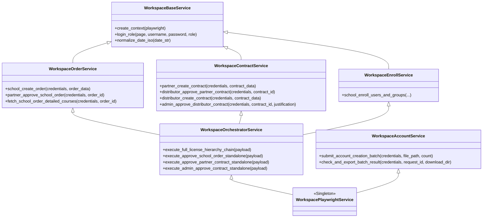
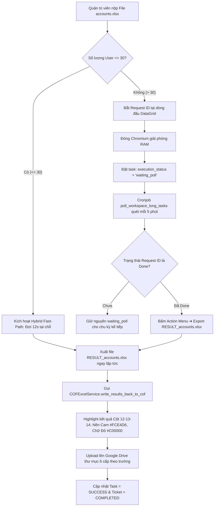
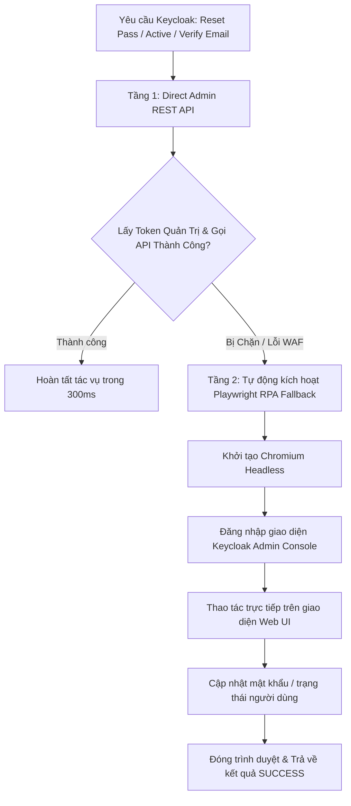

# 🚀 PROJECT BLUEPRINT: PYTHAVERSE CENTRAL ADMIN & AUTOMATION HUB
> **Tài Liệu Đặc Tả Kiến Trúc & Thiết Kế Kỹ Thuật Tổng Thể (Master Blueprint v2.0.0)**
> **Tác Giả & Kiến Trúc Sư Trưởng:** **Nguyễn Mạnh Hùng** (*Lead AI Engineer & Automation Architect – DTT Corporation / Pythaverse Ecosystem*)
> **Architecture:** Modern Monorepo (React 19 SPA + Python 3.11 FastAPI + Supabase PostgreSQL 16 + Playwright RPA + Google Workspace Engine)
> **Core Concept:** Multi-channel Unified Ingestion + 10-Model Fallback Gemini AI Triage + Human-in-the-Loop Gate + 4-Level RPA Hierarchy + 3-Tier Fernet Vault + Multi-board Kanban + 3-Tab Health Monitor

---

## 🤖 1. PHÂN BỔ NĂNG LỰC CHUYÊN GIA & AGENT INVOCATIONS

Khi thực thi và triển khai các tác vụ trong Blueprint này, Antigravity AI BẮT BUỘC tự động vận dụng các hồ sơ chuyên gia tương ứng:

| Agent Chuyên Gia | Hồ Sơ Tham Chiếu | Trọng Tâm Trách Nhiệm Kỹ Thuật |
|---|---|---|
| `@[orchestrator]` | `.agent/agents/orchestrator.md` | Phân tích luồng end-to-end, điều phối liên thông đa dịch vụ, giải quyết xung đột dữ liệu và thiết kế kiến trúc tổng thể. |
| `@[frontend-specialist]` | `.agent/agents/frontend-specialist.md` | Xây dựng React 19 SPA, TypeScript Strict, Tailwind CSS v4, Lucide Icons, tối ưu hóa Lazy Loading 13 trang chức năng, SaaS aesthetic, Dark/Light Mode. |
| `@[backend-specialist]` | `.agent/agents/backend-specialist.md` | Phát triển FastAPI 0.115, Pydantic v2, APScheduler 6 Crons chạy ngầm, bọc an toàn `safe_job_wrapper`, dọn bộ nhớ `gc.collect()`. |
| `@[qa-automation-engineer]` | `.agent/agents/qa-automation-engineer.md` | Xây dựng gói RPA đa kế thừa 8 modules (`backend/app/services/workspace/`), Direct API Scanner, Smart Polling 2 pha, Hybrid Fast-Path. |
| `@[database-architect]` | `.agent/agents/database-architect.md` | Thiết kế và tối ưu Supabase PostgreSQL 16 (16 bảng CSDL + Storage Bucket), ENUMs, RLS Policies `@dtt.vn`, Performance Indexes, Triggers. |
| `@[security-auditor]` | `.agent/agents/security-auditor.md` | Thực thi mã hóa Két Sắt Fernet (`VAULT_SECRET_KEY`), Whitelist Domain Google OAuth `@dtt.vn`, 2-Tier Hybrid Keycloak Admin, Human-in-the-Loop Gate. |
| `@[debugger]` | `.agent/agents/debugger.md` | Chuẩn đoán lỗi 4 pha, chuẩn hóa format log thời gian thực GMT+7, quản trị chuỗi 10-Model Gemini AI Fallback. |

---

## 🛠️ 2. ĐẶC TẢ TECH STACK (STABLE PRODUCTION VERSIONS)

Mọi mã nguồn sinh ra phải tuân thủ nghiêm ngặt các phiên bản thư viện ổn định sau:

### Frontend & Web UI Stack
- **Node.js**: `20.x LTS` / `22.x LTS`
- **React**: `19.0.0` (React 19 Functional Hooks, Concurrent Rendering)
- **Vite**: `6.2.x` (Build Tool & HMR Dev Server)
- **TypeScript**: `5.7.x` (`strict: true`, Strict Type Checking)
- **Tailwind CSS**: `4.0.x` (Kiến trúc Design Tokens hiện đại `@import "tailwindcss";`)
- **Lucide React**: `0.475.x` (Icon Library đồng nhất)
- **SheetJS (`xlsx`)**: `0.18.5` (Xử lý bóc tách & xuất file Excel client-side)
- **Supabase JS Client**: `@supabase/supabase-js: ^2.48.x` (Auth & Realtime Client)
- **Sonner**: `^2.0.1` (Toast Notification thích ứng Theme)
- **Canvas Confetti**: `^1.9.4` (Hiệu ứng pháo hoa hạt khi hoàn thành nhiệm vụ)

### Backend & Automation Brain Stack
- **Python Runtime**: `3.11.9` / `3.11.x`
- **FastAPI**: `0.115.x` (Async Web Framework, OpenAPI/Swagger tự động)
- **Pydantic**: `2.10.x` (Strict Model Validation & Settings Management)
- **Google Generative AI**: `google-generativeai: ^0.8.4` (Gemini SDK với 10-Model Fallback)
- **Playwright Async**: `1.50.x` (Chromium Automation cho Workspace RPA, LMS & Scraper)
- **Cryptography**: `cryptography: ^44.0.x` (Fernet Symmetric Encryption cho Vault)
- **APScheduler**: `3.10.x` (AsyncIO Background Cronjob Scheduler)
- **HTTPX**: `^0.28.x` (Async HTTP Client cho REST APIs & Synthetic Monitoring)
- **OpenPyXL**: `^3.1.5` (Xử lý bảng tính Excel COF phân tầng màu sắc)
- **Google API Client**: `google-api-python-client`, `google-auth-oauthlib` (Gmail, Sheets, Docs, Drive)

---

## 📊 3. SƠ ĐỒ CƠ SỞ DỮ LIỆU CHUẨN MỰC (SUPABASE POSTGRESQL 16 - 16 BẢNG)

```sql
-- Enable UUID Extension
CREATE EXTENSION IF NOT EXISTS "uuid-ossp";

-- =============================================================================
-- ENUM TYPES
-- =============================================================================
CREATE TYPE ticket_source AS ENUM ('gmail', 'google_form', 'osticket');
CREATE TYPE ticket_category AS ENUM ('bug', 'account_keycloak', 'lms_enroll', 'license', 'other');
CREATE TYPE ticket_priority AS ENUM ('critical', 'normal');
CREATE TYPE ticket_status AS ENUM ('pending', 'approved', 'processing', 'completed', 'dismissed');
CREATE TYPE bot_type AS ENUM ('keycloak_api', 'workspace_rpa', 'lms_playwright', 'lms_git_provisioning', 'github_issue_creator', 'google_doc_comment', 'feedback_doc_triage');
CREATE TYPE approval_status AS ENUM ('pending', 'approved', 'rejected');

-- =============================================================================
-- 1. UNIFIED INBOX & AUTOMATION QUEUE
-- =============================================================================
CREATE TABLE inbox_tickets (
    id UUID PRIMARY KEY DEFAULT uuid_generate_v4(),
    source ticket_source NOT NULL,
    source_id VARCHAR(255),
    sender_email VARCHAR(255) NOT NULL,
    submitter_name VARCHAR(255),
    subject TEXT,
    raw_content TEXT NOT NULL,
    ai_summary TEXT,
    category ticket_category DEFAULT 'other',
    priority ticket_priority DEFAULT 'normal',
    status ticket_status DEFAULT 'pending',
    country VARCHAR(100),
    doc_url TEXT,
    ticket_timestamp VARCHAR(100),
    attachments JSONB DEFAULT '[]'::jsonb,
    metadata JSONB DEFAULT '{}'::jsonb,
    created_at TIMESTAMP WITH TIME ZONE DEFAULT NOW(),
    updated_at TIMESTAMP WITH TIME ZONE DEFAULT NOW()
);

CREATE TABLE bot_automation_tasks (
    id UUID PRIMARY KEY DEFAULT uuid_generate_v4(),
    ticket_id UUID REFERENCES inbox_tickets(id) ON DELETE CASCADE,
    bot_type bot_type NOT NULL,
    payload_data JSONB NOT NULL,
    approval_status approval_status DEFAULT 'pending',
    execution_status VARCHAR(50) DEFAULT 'queued',
    execution_logs TEXT,
    created_at TIMESTAMP WITH TIME ZONE DEFAULT NOW(),
    executed_at TIMESTAMP WITH TIME ZONE
);

CREATE TABLE templates_config (
    id UUID PRIMARY KEY DEFAULT uuid_generate_v4(),
    template_key VARCHAR(100) UNIQUE NOT NULL,
    name VARCHAR(255) NOT NULL,
    content_markdown TEXT NOT NULL,
    fields_mapping JSONB DEFAULT '[]'::jsonb,
    updated_at TIMESTAMP WITH TIME ZONE DEFAULT NOW()
);

-- =============================================================================
-- 2. HIERARCHY & ENCRYPTED CREDENTIALS VAULT
-- =============================================================================
CREATE TABLE workspace_organizations (
    id UUID PRIMARY KEY DEFAULT uuid_generate_v4(),
    name VARCHAR(255) NOT NULL,
    code VARCHAR(100),
    type VARCHAR(50) NOT NULL, -- distributor | partner | school
    parent_id UUID REFERENCES workspace_organizations(id) ON DELETE SET NULL,
    country VARCHAR(100) DEFAULT 'Vietnam',
    is_active BOOLEAN DEFAULT TRUE,
    created_at TIMESTAMP WITH TIME ZONE DEFAULT NOW()
);

CREATE TABLE workspace_credentials_vault (
    id UUID PRIMARY KEY DEFAULT uuid_generate_v4(),
    org_id UUID REFERENCES workspace_organizations(id) ON DELETE CASCADE,
    username VARCHAR(255) NOT NULL,
    encrypted_password TEXT NOT NULL, -- Encrypted via Fernet (VAULT_SECRET_KEY)
    role VARCHAR(50) NOT NULL,
    updated_at TIMESTAMP WITH TIME ZONE DEFAULT NOW()
);

-- =============================================================================
-- 3. SCANNER CACHE & DUAL COURSE CATALOGS
-- =============================================================================
CREATE TABLE workspace_contracts_cache (
    id UUID PRIMARY KEY DEFAULT uuid_generate_v4(),
    contract_id VARCHAR(100) NOT NULL,
    distributor_name VARCHAR(255),
    partner_name VARCHAR(255),
    total_licenses INT DEFAULT 0,
    status VARCHAR(50),
    raw_data JSONB DEFAULT '{}'::jsonb,
    synced_at TIMESTAMP WITH TIME ZONE DEFAULT NOW()
);

CREATE TABLE workspace_orders_cache (
    id UUID PRIMARY KEY DEFAULT uuid_generate_v4(),
    order_id VARCHAR(100) NOT NULL,
    partner_name VARCHAR(255),
    school_name VARCHAR(255),
    total_licenses INT DEFAULT 0,
    status VARCHAR(50),
    raw_data JSONB DEFAULT '{}'::jsonb,
    synced_at TIMESTAMP WITH TIME ZONE DEFAULT NOW()
);

CREATE TABLE workspace_courses (
    id UUID PRIMARY KEY DEFAULT uuid_generate_v4(),
    course_id INT NOT NULL,
    category VARCHAR(100) NOT NULL,
    course_name VARCHAR(255) NOT NULL,
    sku VARCHAR(100),
    lms_url TEXT,
    created_at TIMESTAMP WITH TIME ZONE DEFAULT NOW()
);

CREATE TABLE lms_courses (
    id UUID PRIMARY KEY DEFAULT uuid_generate_v4(),
    course_id INT NOT NULL,
    category VARCHAR(100) NOT NULL,
    course_name VARCHAR(255) NOT NULL,
    lms_url TEXT,
    created_at TIMESTAMP WITH TIME ZONE DEFAULT NOW()
);

-- =============================================================================
-- 4. SITE MONITORING & CI/CD CONFIGS
-- =============================================================================
CREATE TABLE site_monitor_credentials (
    id UUID PRIMARY KEY DEFAULT uuid_generate_v4(),
    site_id VARCHAR(100) NOT NULL,
    role_label VARCHAR(100) NOT NULL,
    username VARCHAR(255) NOT NULL,
    encrypted_password TEXT NOT NULL,
    expected_path TEXT DEFAULT '/',
    is_active BOOLEAN DEFAULT TRUE,
    last_status VARCHAR(50) DEFAULT 'PENDING',
    last_latency_ms INT DEFAULT 0,
    last_checked_at TIMESTAMP WITH TIME ZONE,
    details TEXT
);

CREATE TABLE site_downtime_events (
    id UUID PRIMARY KEY DEFAULT uuid_generate_v4(),
    site_id VARCHAR(100) NOT NULL,
    started_at TIMESTAMP WITH TIME ZONE NOT NULL,
    ended_at TIMESTAMP WITH TIME ZONE,
    duration_s INT DEFAULT 0,
    is_ongoing BOOLEAN DEFAULT TRUE,
    http_code INT,
    error_message TEXT
);

CREATE TABLE site_deploy_configs (
    id UUID PRIMARY KEY DEFAULT uuid_generate_v4(),
    provider VARCHAR(50) NOT NULL, -- vercel | render
    target_id VARCHAR(255) NOT NULL,
    encrypted_api_token TEXT NOT NULL,
    is_active BOOLEAN DEFAULT TRUE,
    created_at TIMESTAMP WITH TIME ZONE DEFAULT NOW()
);

-- =============================================================================
-- 5. KANBAN WORK BOARD
-- =============================================================================
CREATE TABLE work_boards (
    id UUID PRIMARY KEY DEFAULT uuid_generate_v4(),
    title VARCHAR(255) NOT NULL,
    description TEXT,
    background_url TEXT,
    overlay_color VARCHAR(50) DEFAULT '#0f172a',
    overlay_opacity FLOAT DEFAULT 0.6,
    column_opacity FLOAT DEFAULT 0.85,
    card_opacity FLOAT DEFAULT 0.95,
    is_default BOOLEAN DEFAULT FALSE,
    is_deleted BOOLEAN DEFAULT FALSE,
    deleted_at TIMESTAMP WITH TIME ZONE,
    categories JSONB DEFAULT '["Dev", "Bug", "Automation", "Ops", "Design"]'::jsonb,
    priorities JSONB DEFAULT '[{"key": "low", "label": "Thấp", "color": "emerald"}, {"key": "medium", "label": "Vừa", "color": "amber"}, {"key": "high", "label": "Cao", "color": "rose"}]'::jsonb,
    created_at TIMESTAMP WITH TIME ZONE DEFAULT NOW()
);

CREATE TABLE work_board_columns (
    id UUID PRIMARY KEY DEFAULT uuid_generate_v4(),
    board_id UUID REFERENCES work_boards(id) ON DELETE CASCADE,
    title VARCHAR(100) NOT NULL,
    color VARCHAR(50) DEFAULT 'violet',
    column_type VARCHAR(50) NOT NULL, -- backlog | todo | in_progress | review | done | abort | custom
    order_index INT DEFAULT 0
);

CREATE TABLE work_board_cards (
    id UUID PRIMARY KEY DEFAULT uuid_generate_v4(),
    board_id UUID REFERENCES work_boards(id) ON DELETE CASCADE,
    column_id UUID REFERENCES work_board_columns(id) ON DELETE CASCADE,
    title VARCHAR(255) NOT NULL,
    description TEXT,
    priority VARCHAR(50) DEFAULT 'medium',
    category VARCHAR(100) DEFAULT 'Dev',
    color VARCHAR(50) DEFAULT 'violet',
    assigned_name VARCHAR(255),
    assigned_email VARCHAR(255),
    due_date TIMESTAMP WITH TIME ZONE,
    subtasks JSONB DEFAULT '[]'::jsonb,
    order_index INT DEFAULT 0,
    created_at TIMESTAMP WITH TIME ZONE DEFAULT NOW()
);

-- =============================================================================
-- INDEXES & ROW LEVEL SECURITY (RLS)
-- =============================================================================
CREATE INDEX idx_tickets_status ON inbox_tickets(status);
CREATE INDEX idx_tickets_category ON inbox_tickets(category);
CREATE INDEX idx_tasks_approval ON bot_automation_tasks(approval_status);
CREATE INDEX idx_board_cards_board ON work_board_cards(board_id);
CREATE INDEX idx_board_cards_column ON work_board_cards(column_id);

ALTER TABLE inbox_tickets ENABLE ROW LEVEL SECURITY;
ALTER TABLE bot_automation_tasks ENABLE ROW LEVEL SECURITY;
ALTER TABLE templates_config ENABLE ROW LEVEL SECURITY;
ALTER TABLE workspace_organizations ENABLE ROW LEVEL SECURITY;
ALTER TABLE workspace_credentials_vault ENABLE ROW LEVEL SECURITY;
ALTER TABLE work_boards ENABLE ROW LEVEL SECURITY;
ALTER TABLE work_board_columns ENABLE ROW LEVEL SECURITY;
ALTER TABLE work_board_cards ENABLE ROW LEVEL SECURITY;

CREATE POLICY "admin_dtt_vn_only" ON inbox_tickets FOR ALL USING ((auth.jwt() ->> 'email') LIKE '%@dtt.vn');
CREATE POLICY "admin_dtt_vn_only" ON bot_automation_tasks FOR ALL USING ((auth.jwt() ->> 'email') LIKE '%@dtt.vn');
CREATE POLICY "admin_dtt_vn_only" ON templates_config FOR ALL USING ((auth.jwt() ->> 'email') LIKE '%@dtt.vn');
CREATE POLICY "admin_dtt_vn_only" ON workspace_organizations FOR ALL USING ((auth.jwt() ->> 'email') LIKE '%@dtt.vn');
CREATE POLICY "admin_dtt_vn_only" ON workspace_credentials_vault FOR ALL USING ((auth.jwt() ->> 'email') LIKE '%@dtt.vn');
CREATE POLICY "admin_dtt_vn_only" ON work_boards FOR ALL USING ((auth.jwt() ->> 'email') LIKE '%@dtt.vn');
CREATE POLICY "admin_dtt_vn_only" ON work_board_columns FOR ALL USING ((auth.jwt() ->> 'email') LIKE '%@dtt.vn');
CREATE POLICY "admin_dtt_vn_only" ON work_board_cards FOR ALL USING ((auth.jwt() ->> 'email') LIKE '%@dtt.vn');
```

---

## 🧭 4. BẢN ĐỒ ĐIỀU HƯỚNG & 13 PHÂN HỆ FRONTEND

```
                                  ┌─────────────────────────────┐
                                  │   CỔNG LANDING & LOGIN      │
                                  │  [/] LandingPage • [/login] │
                                  └──────────────┬──────────────┘
                                                 │ Authenticated (@dtt.vn)
                                                 ▼
┌────────────────────────────────────────────────────────────────────────────────────────────────────────────────┐
│                                       APP LAYOUT CONTAINER (SIDEBAR & HEADER)                                  │
│                                                                                                                │
│  ┌──────────────────────┐  ┌──────────────────────┐  ┌──────────────────────┐  ┌────────────────────────────┐  │
│  │ 1. Executive Dash    │  │ 2. Work Board Kanban │  │ 3. Unified Inbox     │  │ 4. Automation Studio       │  │
│  │    [/dashboard]      │  │    [/board]          │  │    [/inbox]          │  │    [/studio]               │  │
│  ├──────────────────────┤  ├──────────────────────┤  ├──────────────────────┤  ├────────────────────────────┤  │
│  │ 5. Task & Approval   │  │ 6. Courses Manager   │  │ 7. GitHub Dispatcher │  │ 8. Bot Execution Center    │  │
│  │    [/tasks]          │  │    [/courses]        │  │    [/github]         │  │    [/bots]                 │  │
│  ├──────────────────────┤  ├──────────────────────┤  ├──────────────────────┤  ├────────────────────────────┤  │
│  │ 9. Analytics & Export│  │ 10. Site Health Mon  │  │ 11. Profile Settings │  │ 12/13. Landing & Auth      │  │
│  │    [/reports]        │  │     [/monitor]       │  │     [/profile]       │  │        [/, /login]         │  │
│  └──────────────────────┘  └──────────────────────┘  └──────────────────────┘  └────────────────────────────┘  │
└────────────────────────────────────────────────────────────────────────────────────────────────────────────────┘
```

### Chi Tiết 13 Màn Hình Chức Năng:
1. **Executive Dashboard (`/dashboard`):** 4 KPI Cards thời gian thực, biểu đồ Recharts, lối tắt Quick Actions, danh sách vé và tác vụ gần nhất.
2. **Work Board Kanban (`/board`):** Quản lý đa bảng, tùy biến wallpaper, thùng rác 30 ngày (soft delete/restore), 6 cột chuẩn (`backlog`, `todo`, `in_progress`, `review`, `done`, `abort`), kéo thả D&D, checklist subtasks, pháo hoa Canvas Confetti.
3. **Unified Inbox Feed (`/inbox`):** Hòm thư đa kênh hợp nhất từ Gmail, Google Form và OS Ticket; xem tệp đính kèm, tóm tắt AI Gemini, phân loại, gán người phụ trách và điều phối sang Studio/GitHub.
4. **Automation Studio (`/studio`):** Môi trường điều phối bot độc lập không cần ticket đầu vào với 4 Dispatcher Engines: Keycloak Identity, Workspace License Phả Hệ (6 sub-flows, 480 trường), LMS Moodle & Git, Google Feedback Docs.
5. **Task & Approval Hub (`/tasks`):** Cổng phê duyệt Human-in-the-Loop: xem payload JSON, Duyệt/Từ chối, Live Terminal Logs có màu ANSI, nút Retry tác vụ lỗi.
6. **Courses Management (`/courses`):** Quản lý song song 2 bảng `workspace_courses` (RPA) và `lms_courses` (Moodle), CRUD với URL LMS tự sinh, Bulk Upsert SheetJS, Category Manager đổi tên/gộp danh mục hàng loạt.
7. **GitHub Dispatcher (`/github`):** Tạo Issue trực tiếp vào Private Repo (`PTV-TechHub/Pythaverse2026`), tự động sinh Markdown template chuyên nghiệp bằng Gemini AI.
8. **Bot Execution Center (`/bots`):** Giám sát 6 background workers, stream log hệ thống chuẩn hóa GMT+7, nút Restart worker bằng key name.
9. **Analytics & XLSX Export (`/reports`):** Thống kê báo cáo KPI, chỉ số Dynamic Health 24h, biểu đồ cơ cấu yêu cầu, xuất file Excel KPI DTT 3Đ.
10. **Site Health Monitor (`/monitor`):** Giám sát 3 Tab: Tab 1 Uptime 10 website Pythaverse 24h; Tab 2 Ma trận xác thực 16 tài khoản test 7 vai trò qua giải mã Fernet; Tab 3 Theo dõi builds CI/CD Vercel & Render kèm live terminal logs.
11. **Profile Settings (`/profile`):** Hồ sơ tác giả Nguyễn Mạnh Hùng, cấu hình biến môi trường và thông tin phiên bản phát hành.
12. **Landing Page (`/`):** Giới thiệu tác giả và 7 phân hệ Pythaverse từ `authorConfig.ts`.
13. **Login Page (`/login`):** Cổng đăng nhập Google OAuth2 cưỡng chế Whitelist `@dtt.vn`.

---

## ⚙️ 5. GÓI DỊCH VỤ RPA & TIẾN TRÌNH CHẠY NGẦM BACKEND



### 6 Cronjobs Chạy Ngầm (APScheduler):
1. `gmail_cron` (5 phút): Gọi `poll_unread_gmails` quét hòm thư, upload attachment lên Supabase Storage và kích hoạt AI Triage.
2. `osticket_cron` (5 phút): Gọi `poll_open_ostickets` cào vé sự cố, bóc tách Custom Form và attachment.
3. `sheet_cron` (5 phút): Gọi `poll_form_feedbacks` quét Google Sheet Feedback, nhận diện tab và lưu ticket.
4. `site_uptime_cron` (30 phút): Gọi `poll_site_uptime_cron` kiểm tra Uptime 10 site và ma trận xác thực 16 tài khoản test.
5. `workspace_long_tasks_cron` (5 phút): Gọi `poll_workspace_long_tasks` kiểm tra trạng thái Request ID (Pha 2 Smart Polling), xuất file kết quả, ghi ngược COF và đẩy lên Google Drive.
6. `distributor_cache_scanner_cron` (45 phút): Gọi `workspace_scanner_service.scan_and_cache_all_distributors` quét Direct API 5 Master Distributors và cập nhật cache.

---

## 🔄 6. SƠ ĐỒ CÁC LUỒNG TỰ ĐỘNG HÓA CỐT LÕI (MERMAID)

### Quy Trình Smart Polling & Bóc Tách COF Phân Tầng


### Quy Trình Quản Lý Định Danh Keycloak 2-Tier Hybrid


---

## 🔒 7. BẢO MẬT & NGUYÊN TẮC AN TOÀN VẬN HÀNH

1. **Cổng Phê Duyệt Con Người (Human-in-the-Loop Gate):** Tuyệt đối không tự ý thực thi các tác vụ gây thay đổi trạng thái hệ thống nếu chưa có cờ phê duyệt `approval_status = 'approved'` do Quản trị viên chỉ định trên Web Portal (trừ khi chọn `run_immediately = true` từ Studio).
2. **Kiểm Soát Miền Doanh Nghiệp (@dtt.vn Whitelist):** Kiểm soát nghiêm ngặt tầng Frontend (AuthContext) và Backend (Security Middleware). Chỉ cho phép người dùng có email thuộc miền `@dtt.vn` (đặc biệt tài khoản `hung.nguyenmanh@dtt.vn`) thao tác.
3. **Két Sắt Mã Hóa Fernet (Credential Vault):** Mọi mật khẩu nhạy cảm của 480 trường học, đối tác, nhà phân phối và 16 tài khoản test BẮT BUỘC phải được mã hóa bằng thuật toán đối xứng `Fernet` với khóa `VAULT_SECRET_KEY` trong bảng `workspace_credentials_vault` và `site_monitor_credentials`.
4. **Bảo Vệ Bộ Nhớ Đệm RAM (Memory Collection Safeguard):** Toàn bộ các tác vụ nền và tiến trình Playwright Chromium BẮT BUỘC phải thực thi bên trong `safe_job_wrapper` và luôn gọi `gc.collect()` trong khối `finally` để tránh tràn bộ nhớ 512MB RAM trên Render.
5. **Google Gemini Auto-Fallback 10 Tầng:** Luôn trang bị cơ chế bắt lỗi hạn mức `429` để tự động chuyển tiếp qua danh sách 10 model dự phòng (`gemini-3.7-flash` ➔ `gemini-3.6-flash` ➔ `gemini-3.5-flash-lite` ➔ `gemini-2.5-flash`...).
