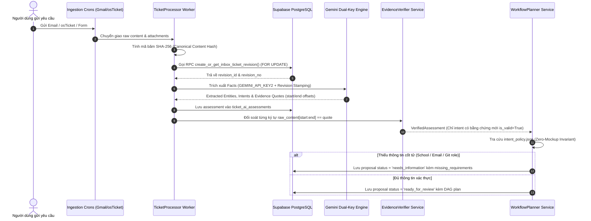
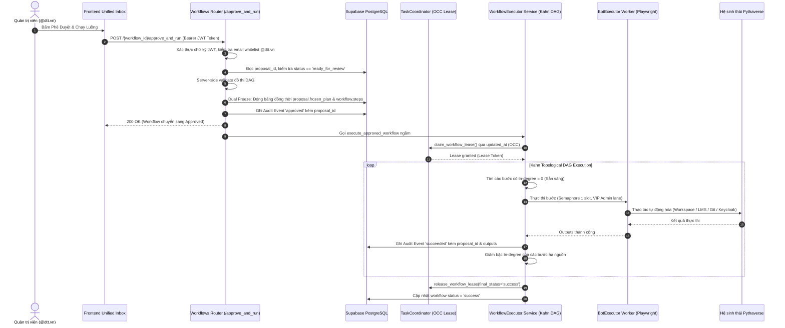

# 🚀 PROJECT BLUEPRINT: PYTHAVERSE CENTRAL ADMIN & AUTOMATION HUB
> **Tài Liệu Đặc Tả Kiến Trúc & Thiết Kế Kỹ Thuật Tổng Thể (Master Blueprint v3.4.0 Enterprise Edition)**  
> **Kiến Trúc Sư Trưởng & Tác Giả Sáng Lập:** **Nguyễn Mạnh Hùng** (*Lead AI Engineer & Automation Architect – DTT Corporation / Pythaverse Ecosystem*)  
> **GitHub:** [`https://github.com/hungnm-1225`](https://github.com/hungnm-1225) | **Email:** `hungnm@dtt.vn` / `hung.nguyenmanh@dtt.vn`  
> **Hệ Sinh Thái:** [Pythaverse Space](https://pythaverse.space) | **Cập Nhật:** `2026-09-15`  
> **Kiến Trúc Nền Tảng:** Modern Monorepo (React 19 SPA + Python 3.11/3.12 FastAPI 0.115 + Supabase PostgreSQL 16 + Playwright Async Chromium + Google Workspace Service Engine)

---

## 📑 MỤC LỤC BLUEPRINT

1. [PHÂN BỔ NĂNG LỰC 20 CHUYÊN GIA HỆ THỐNG (INTELLIGENT AGENT ROUTING)](#1-phân-bổ-năng-lực-20-chuyên-gia-hệ-thống-intelligent-agent-routing)
2. [ĐẶC TẢ TECH STACK CHUẨN MỰC (PRODUCTION STACK)](#2-đặc-tả-tech-stack-chuẩn-mực-production-stack)
3. [SÁU NGUYÊN TẮC BẤT BIẾN (ABSOLUTE SAFETY INVARIANTS)](#3-sáu-nguyên-tắc-bất-biến-absolute-safety-invariants)
4. [SƠ ĐỒ CƠ SỞ DỮ LIỆU CHUẨN MỰC (SUPABASE POSTGRESQL 16 - 20 BẢNG)](#4-sơ-đồ-cơ-sở-dữ-liệu-chuẩn-mực-supabase-postgresql-16---20-bảng)
5. [CHUỖI TRUY VẾT BẤT BIẾN (IMMUTABLE DATA PROVENANCE CHAIN)](#5-chuỗi-truy-vết-bất-biến-immutable-data-provenance-chain)
6. [BẢN ĐỒ ĐIỀU HƯỚNG & GIẢI PHẪU 13 PHÂN HỆ FRONTEND SPA](#6-bản-đồ-điều-hướng--giải-phẫu-13-phân-hệ-frontend-spa)
7. [GIẢI PHẪU BACKEND SERVICES, RPA & TIẾN TRÌNH CHẠY NGẦM](#7-giải-phẫu-backend-services-rpa--tiến-trình-chạy-ngầm)
8. [SƠ ĐỒ CÁC LUỒNG TỰ ĐỘNG HÓA CỐT LÕI (MERMAID SEQUENCES & FLOWCHARTS)](#8-sơ-đồ-các-luồng-tự-động-hóa-cốt-lõi-mermaid-sequences--flowcharts)
9. [QUY CHUẨN KIỂM THỬ HERMETIC & BẢO MẬT VẬN HÀNH](#9-quy-chuẩn-kiểm-thử-hermetic--bảo-mật-vận-hành)

---

## 🤖 1. PHÂN BỔ NĂNG LỰC 20 CHUYÊN GIA HỆ THỐNG (INTELLIGENT AGENT ROUTING)

Mỗi khi tiếp nhận yêu cầu từ người dùng, Antigravity AI BẮT BUỘC tự động nhận diện miền nghiệp vụ và áp dụng năng lực chuyên gia từ 20 hồ sơ agent trong [`.agent/agents/`](file:///c:/Users/dtt/Desktop/Project/ptv-tasks-administrator/.agent/agents) mà KHÔNG CẦN người dùng phải gõ `@` thủ công:

| STT | Agent Chuyên Gia | Hồ Sơ Tham Chiếu | Trọng Tâm Trách Nhiệm Kỹ Thuật |
|---|---|---|---|
| **1** | `@[frontend-specialist]` | `frontend-specialist.md` | React 19 SPA, TypeScript Strict, Tailwind CSS v4, Bento Grid, Enterprise Pastel OKLCH, Dark/Light theme, Evidence Provenance UI, SheetJS Excel Preview modal. |
| **2** | `@[backend-specialist]` | `backend-specialist.md` | Python 3.11/3.12, FastAPI 0.115, Pydantic v2 validation, Async/Await, Dual-Key Gemini cross-failover, Deterministic Fast-Path Triage, Kahn DAG, Ma trận 8 RAM Caches 1ms. |
| **3** | `@[database-architect]` | `database-architect.md` | Supabase PostgreSQL 16 (20 bảng CSDL + Storage Bucket), Revisions, Assessments, Proposals, Append-only Events, RLS Policies `@dtt.vn`, Stored Procedure Atomic Allocation `FOR UPDATE`. |
| **4** | `@[qa-automation-engineer]` | `qa-automation-engineer.md` | Playwright Async Chromium, Gói `workspace/` 8 modules, Semaphore 1 Slot (512MB RAM Render), Re-entrant ContextVar Lock, Zombie process cleanup `gc.collect()`. |
| **5** | `@[security-auditor]` | `security-auditor.md` | Whitelist Domain `@dtt.vn`, Fernet Credential Vault (`VAULT_SECRET_KEY`), Keycloak Admin REST API + Playwright Fallback, Server-Side JWT Approval Gate. |
| **6** | `@[orchestrator]` | `orchestrator.md` | Phân tích luồng end-to-end, điều phối liên thông đa dịch vụ (Workspace ➔ LMS ➔ Git ➔ Keycloak), giải quyết xung đột dữ liệu. |
| **7** | `@[debugger]` | `debugger.md` | 4-Phase Systematic Debugging, bắt log thực thi GMT+7, cô lập nguyên nhân gốc rễ, Gemini 10-model fallback + Fast-Path Triage. |
| **8** | `@[documentation-writer]` | `documentation-writer.md` | Chuẩn hóa README, Blueprint, API Docs, Single Source of Truth cho toàn bộ dự án, đồng bộ hóa tuyệt đối với mã nguồn. |
| **9** | `@[project-planner]` | `project-planner.md` | Phương pháp luận 4 pha (Analysis, Planning, Solutioning, Implementation), duy trì các invariants an toàn. |
| **10** | `@[devops-engineer]` | `devops-engineer.md` | Quản trị CI/CD GitHub Actions, cấu hình Render.com (512MB RAM ASGI), Vercel (Edge CDN Frontend), UptimeRobot synthetic monitoring, Dockerfile. |
| **11** | `@[performance-optimizer]` | `performance-optimizer.md` | Tối ưu hóa bộ nhớ 512MB RAM Render, Ma trận 8 BoundedMemoryCache (LRU + TTL < 40MB), Low-RAM Chromium 18 cờ tối ưu, Dynamic Code Splitting React 19. |
| **12** | `@[penetration-tester]` | `penetration-tester.md` | Thử nghiệm xâm nhập, kiểm định phòng thủ Prompt Injection, đối soát offset trích dẫn, chống bypass JWT Token `@dtt.vn`. |
| **13** | `@[test-engineer]` | `test-engineer.md` | Thiết kế Hermetic Pytest Suite (23/23 tests pass in-memory), Contract Tests 19 Capabilities, Mocking in-memory không tốn Quota AI. |
| **14** | `@[code-archaeologist]` | `code-archaeologist.md` | Truy vết lịch sử commit Git, phân tích mã nguồn cũ, refactoring mã thừa, duy trì tính tương thích ngược. |
| **15** | `@[explorer-agent]` | `explorer-agent.md` | Thám sát cây thư mục, kiểm kê tệp tin, lập bản đồ phụ thuộc file (`CODEBASE.md`). |
| **16** | `@[product-manager]` | `product-manager.md` | Định hình lộ trình tính năng, tối ưu trải nghiệm Admin Hub, quản lý độ ưu tiên 7 phân hệ Pythaverse. |
| **17** | `@[product-owner]` | `product-owner.md` | Thẩm định User Stories tiếp nhận vé, kiểm tra tính đầy đủ của thông tin người gửi, tối ưu tiêu chí nghiệm thu. |
| **18** | `@[seo-specialist]` | `seo-specialist.md` | Tối ưu hóa cấu trúc thẻ, metadata, semantic HTML cho Cổng giới thiệu Landing Page (`/landing`). |
| **19** | `@[mobile-developer]` | `mobile-developer.md` | Đảm bảo tính tương thích hiển thị Responsive di động và tablet cho toàn bộ 13 trang quản trị. |
| **20** | `@[game-developer]` | `game-developer.md` | Tích hợp các tương tác gamification, hiệu ứng Canvas Confetti, phản hồi trực quan trong quy trình duyệt vé. |

---

## 🛠️ 2. ĐẶC TẢ TECH STACK CHUẨN MỰC (PRODUCTION STACK)

### Frontend & Web UI Stack
- **Node.js**: `20.x LTS` / `22.x LTS`
- **React**: `19.0.0` (React 19 Functional Hooks, Concurrent Rendering, Suspense Code Splitting)
- **Build Tool:** Vite `6.2.x` / `6.4.x` (Dynamic Chunk Splitting, Zero TypeScript Lints)
- **TypeScript**: `5.7.x` (`strict: true`, Strict Type Checking)
- **Tailwind CSS**: `4.0.x` (Kiến trúc Design Tokens hiện đại `@import "tailwindcss";` kết hợp Enterprise Pastel OKLCH)
- **Lucide React**: `0.475.x` (Icon Library đồng nhất)
- **SheetJS (`xlsx`)**: `0.18.5` (Bóc tách & kết xuất bảng tính Excel trực tiếp client-side)
- **Supabase JS Client**: `@supabase/supabase-js: ^2.48.x` (Auth & Realtime Client)
- **Sonner**: `^2.0.1` (Toast Notification thích ứng Theme)
- **Canvas Confetti**: `^1.9.4` (Hiệu ứng pháo hoa hạt khi hoàn thành nhiệm vụ)

### Backend & Automation Brain Stack
- **Python Runtime**: `3.11.x` / `3.12.x`
- **FastAPI**: `0.115.x` (Async ASGI Web Framework, Swagger UI tự động)
- **Pydantic**: `2.10.x` (Strict Model Validation & Settings Management)
- **Google Generative AI**: `google-generativeai: ^0.8.4` (Dual-Key Gemini Engine với 10-Model Fallback & Fast-Path Triage v1.2.0)
- **Playwright Async**: `1.50.x` (Chromium Automation cho Workspace RPA, LMS & Scraper, 1 Slot Semaphore)
- **Cryptography**: `cryptography: ^44.0.x` (Fernet Symmetric Encryption cho Vault)
- **APScheduler**: `3.10.x` (AsyncIO Background Cronjob Scheduler với 6 Crons so le lệch pha)
- **In-Memory Caching:** Ma trận 8 In-Memory RAM Caches phân 3 tầng LRU + TTL (`BoundedMemoryCache`, RAM <= 40MB)
- **OpenPyXL**: `^3.1.5` (Gói `app.services.excel` xử lý file COF 3 Tabs & phôi chuẩn Bulk Account Creation)
- **Testing Engine:** `pytest: ^8.x/9.x` / `anyio: ^4.x` (23/23 Hermetic Tests pass 100% in-memory)

---

## 🔒 3. SÁU NGUYÊN TẮC BẤT BIẾN (ABSOLUTE SAFETY INVARIANTS)

1. **Evidence-Based & Offset Verification Invariant (Không Bằng Chứng ➔ Không Action):**
   - Mọi ý định vận hành trích xuất bắt buộc phải có đoạn trích dẫn nguyên văn (`quote`) kèm định vị ký tự (`start_offset`, `end_offset`) và mã revision `source_revision_id`.
   - `EvidenceVerifierService` đối soát từng ký tự: $\text{raw\_content}[\text{start}:\text{end}] == \text{quote}$.
   - Tự động hiệu chỉnh Substring Calibration trong bán kính 160 ký tự. Nếu quote không tồn tại hoặc sai lệch revision, intent đó bị gạch bỏ và outcome hạ xuống `needs_information`.
2. **Attachment Evidence Fail-Closed Invariant (File đính kèm chưa đối soát ➔ Không Action):**
   - Các trích dẫn có `source_kind == "attachment_extract"` tạm thời bị gắn cờ `is_verified = False` (chuyển sang `needs_information`), nghiêm cấm việc dùng text thân email để đối soát trích dẫn từ file đính kèm khi chưa qua hạ tầng bóc tách bất biến.
3. **Zero-Mockup Invariant (Cấm Tuyệt Đối Dữ Liệu Bịa Đặt / Fallback Giả Định):**
   - Nghiêm cấm sử dụng bất kỳ giá trị mặc định giả lập nào (`SWRP 4-12`, count=4, mật khẩu `Ptv@2026`).
   - **Đặc biệt: Khai tử hoàn toàn default Git role `GUEST` và default LMS role `student` khi thiếu thông tin**. Yêu cầu cấp quyền Git không nêu rõ vai trò bắt buộc sinh `missing_requirement: git_role`, chuyển trạng thái sang `needs_information` và không tạo bước `git.add_collaborators`.
4. **Dual-Freeze Proposal & Immutable Provenance Linkage:**
   - Khi Admin phê duyệt, hệ thống đóng băng đồng thời cả `workflow_proposals.frozen_plan` và `automation_workflows.steps`.
   - Toàn bộ execution events trong `workflow_execution_events` bắt buộc phải mang theo `proposal_id`. Tuyệt đối không cho phép chỉnh sửa workflow hay proposal sau khi đã ở trạng thái `approved`.
5. **Real JWT Identity Enforcement (Chống Mạo Danh Người Phê Duyệt):**
   - Bỏ qua trường `approved_by` do Frontend gửi lên trong payload body.
   - Danh tính người duyệt được giải mã trực tiếp từ Bearer JWT Token qua dependency `get_current_user_email` và bắt buộc thuộc whitelist domain `@dtt.vn`.
6. **Optimistic Concurrency Control (OCC) Lease & Concurrency Safeguard (Render 512MB RAM):**
   - Chiếm Lease độc quyền cấp Workflow qua `TaskCoordinator.claim_workflow_lease()` sử dụng kiểm soát đồng thời lạc quan (OCC) trên trường `updated_at`. Hàm `update_workflow_heartbeat()` ném `RuntimeError` dừng khẩn cấp worker nếu bị cướp lease.
   - Khóa cứng `GLOBAL_PLAYWRIGHT_SEMAPHORE = asyncio.Semaphore(1)` kết hợp ContextVar `_PLAYWRIGHT_SLOT_HOLDER` chống deadlock re-entrancy.
   - Mọi coroutine chạy Playwright hoặc quét ngầm bắt buộc gọi `gc.collect()` và `force_kill_zombie_chromium()` trong khối `finally`.
   - 6 Crons trong `main.py` xuất phát lệch pha (15s, 90s, 180s, 420s, 1200s, 2400s) để ngăn tràn RAM.

---

## 📊 4. SƠ ĐỒ CƠ SỞ DỮ LIỆU CHUẨN MỰC (SUPABASE POSTGRESQL 16 - 20 BẢNG)

```sql
-- Enable UUID Extension
CREATE EXTENSION IF NOT EXISTS "uuid-ossp";

-- =============================================================================
-- ENUM TYPES
-- =============================================================================
CREATE TYPE ticket_source AS ENUM ('gmail', 'google_form', 'osticket');
CREATE TYPE ticket_category AS ENUM ('bug', 'account_keycloak', 'lms_enroll', 'license', 'other');
CREATE TYPE ticket_priority AS ENUM ('urgent', 'high', 'normal', 'low');
CREATE TYPE ticket_status AS ENUM ('pending', 'approved', 'processing', 'completed', 'dismissed');
CREATE TYPE bot_type AS ENUM ('keycloak_api', 'workspace_rpa', 'lms_playwright', 'lms_git_provisioning', 'github_issue_creator', 'google_doc_comment', 'feedback_doc_triage');
CREATE TYPE approval_status AS ENUM ('pending', 'approved', 'rejected');

-- =============================================================================
-- 1. UNIFIED INBOX, PROVENANCE REVISIONS & AI ASSESSMENTS
-- =============================================================================
CREATE TABLE inbox_tickets (
    id UUID PRIMARY KEY DEFAULT uuid_generate_v4(),
    source ticket_source NOT NULL,
    source_id VARCHAR(255),
    sender_email VARCHAR(255) NOT NULL,
    submitter_name VARCHAR(255),
    subject TEXT,
    raw_content TEXT NOT NULL,
    ai_summary TEXT,
    category ticket_category DEFAULT 'other',
    priority ticket_priority DEFAULT 'normal',
    status ticket_status DEFAULT 'pending',
    country VARCHAR(100),
    doc_url TEXT,
    ticket_timestamp VARCHAR(100),
    attachments JSONB DEFAULT '[]'::jsonb,
    metadata JSONB DEFAULT '{}'::jsonb,
    created_at TIMESTAMP WITH TIME ZONE DEFAULT NOW(),
    updated_at TIMESTAMP WITH TIME ZONE DEFAULT NOW()
);

CREATE TABLE inbox_ticket_revisions (
    id UUID PRIMARY KEY DEFAULT uuid_generate_v4(),
    ticket_id UUID REFERENCES inbox_tickets(id) ON DELETE CASCADE,
    revision_no INT NOT NULL,
    content_hash VARCHAR(64) NOT NULL,
    raw_content TEXT NOT NULL,
    attachments JSONB DEFAULT '[]'::jsonb,
    source_updated_at TIMESTAMP WITH TIME ZONE,
    created_at TIMESTAMP WITH TIME ZONE DEFAULT NOW(),
    UNIQUE(ticket_id, revision_no)
);

CREATE TABLE ticket_ai_assessments (
    id UUID PRIMARY KEY DEFAULT uuid_generate_v4(),
    ticket_revision_id UUID REFERENCES inbox_ticket_revisions(id) ON DELETE CASCADE,
    assessment_kind VARCHAR(50) NOT NULL, -- summary | fact_extraction
    model_name VARCHAR(100) NOT NULL,
    prompt_version VARCHAR(50) NOT NULL,
    raw_response JSONB NOT NULL,
    extracted_entities JSONB DEFAULT '[]'::jsonb,
    intents JSONB DEFAULT '[]'::jsonb,
    created_at TIMESTAMP WITH TIME ZONE DEFAULT NOW()
);

CREATE TABLE workflow_proposals (
    id UUID PRIMARY KEY DEFAULT uuid_generate_v4(),
    ticket_id UUID REFERENCES inbox_tickets(id) ON DELETE CASCADE,
    ticket_revision_id UUID REFERENCES inbox_ticket_revisions(id) ON DELETE CASCADE,
    intent_assessment_id UUID REFERENCES ticket_ai_assessments(id) ON DELETE SET NULL,
    version INT DEFAULT 1,
    status VARCHAR(50) DEFAULT 'ready_for_review', -- ready_for_review | needs_information | superseded
    evidence JSONB DEFAULT '[]'::jsonb,
    missing_requirements JSONB DEFAULT '[]'::jsonb,
    entity_resolution JSONB DEFAULT '{}'::jsonb,
    candidate_steps JSONB DEFAULT '[]'::jsonb,
    frozen_plan JSONB,
    created_at TIMESTAMP WITH TIME ZONE DEFAULT NOW()
);

-- =============================================================================
-- 2. AUTOMATION WORKFLOWS & APPEND-ONLY AUDIT EVENTS
-- =============================================================================
CREATE TABLE automation_workflows (
    id UUID PRIMARY KEY DEFAULT uuid_generate_v4(),
    proposal_id UUID REFERENCES workflow_proposals(id) ON DELETE SET NULL,
    ticket_id UUID REFERENCES inbox_tickets(id) ON DELETE CASCADE,
    title VARCHAR(255) NOT NULL,
    goal TEXT,
    steps JSONB NOT NULL,
    status VARCHAR(50) DEFAULT 'draft', -- draft | approved | running | success | failed
    lease_token VARCHAR(255),
    lease_expires_at TIMESTAMP WITH TIME ZONE,
    approved_by VARCHAR(255),
    approved_at TIMESTAMP WITH TIME ZONE,
    created_at TIMESTAMP WITH TIME ZONE DEFAULT NOW(),
    updated_at TIMESTAMP WITH TIME ZONE DEFAULT NOW()
);

CREATE TABLE automation_workflow_history (
    id UUID PRIMARY KEY DEFAULT uuid_generate_v4(),
    workflow_id UUID REFERENCES automation_workflows(id) ON DELETE CASCADE,
    operator_email VARCHAR(255) NOT NULL,
    operator_reason TEXT NOT NULL,
    previous_steps JSONB NOT NULL,
    new_steps JSONB NOT NULL,
    created_at TIMESTAMP WITH TIME ZONE DEFAULT NOW()
);

CREATE TABLE workflow_execution_events (
    id UUID PRIMARY KEY DEFAULT uuid_generate_v4(),
    proposal_id UUID REFERENCES workflow_proposals(id) ON DELETE CASCADE,
    workflow_id UUID REFERENCES automation_workflows(id) ON DELETE CASCADE,
    step_id VARCHAR(100) NOT NULL,
    event_type VARCHAR(50) NOT NULL, -- started | waiting | succeeded | failed
    inputs JSONB DEFAULT '{}'::jsonb,
    outputs JSONB DEFAULT '{}'::jsonb,
    error_message TEXT,
    timestamp TIMESTAMP WITH TIME ZONE DEFAULT NOW()
);

CREATE TABLE bot_automation_tasks (
    id UUID PRIMARY KEY DEFAULT uuid_generate_v4(),
    ticket_id UUID REFERENCES inbox_tickets(id) ON DELETE CASCADE,
    bot_type bot_type NOT NULL,
    payload_data JSONB NOT NULL,
    approval_status approval_status DEFAULT 'pending',
    execution_status VARCHAR(50) DEFAULT 'queued',
    execution_logs TEXT,
    created_at TIMESTAMP WITH TIME ZONE DEFAULT NOW(),
    executed_at TIMESTAMP WITH TIME ZONE
);

CREATE TABLE templates_config (
    id UUID PRIMARY KEY DEFAULT uuid_generate_v4(),
    template_key VARCHAR(100) UNIQUE NOT NULL,
    name VARCHAR(255) NOT NULL,
    content_markdown TEXT NOT NULL,
    fields_mapping JSONB DEFAULT '[]'::jsonb,
    updated_at TIMESTAMP WITH TIME ZONE DEFAULT NOW()
);

-- =============================================================================
-- 3. HIERARCHY & ENCRYPTED CREDENTIALS VAULT
-- =============================================================================
CREATE TABLE workspace_organizations (
    id UUID PRIMARY KEY DEFAULT uuid_generate_v4(),
    name VARCHAR(255) NOT NULL,
    code VARCHAR(100),
    type VARCHAR(50) NOT NULL, -- distributor | partner | school
    parent_id UUID REFERENCES workspace_organizations(id) ON DELETE SET NULL,
    country VARCHAR(100) DEFAULT 'Vietnam',
    is_active BOOLEAN DEFAULT TRUE,
    created_at TIMESTAMP WITH TIME ZONE DEFAULT NOW()
);

CREATE TABLE workspace_credentials_vault (
    id UUID PRIMARY KEY DEFAULT uuid_generate_v4(),
    org_id UUID REFERENCES workspace_organizations(id) ON DELETE CASCADE,
    username VARCHAR(255) NOT NULL,
    encrypted_password TEXT NOT NULL, -- Encrypted via Fernet (VAULT_SECRET_KEY)
    role VARCHAR(50) NOT NULL,
    updated_at TIMESTAMP WITH TIME ZONE DEFAULT NOW()
);

-- =============================================================================
-- 4. SCANNER CACHE & DUAL COURSE CATALOGS
-- =============================================================================
CREATE TABLE workspace_contracts_cache (
    id UUID PRIMARY KEY DEFAULT uuid_generate_v4(),
    contract_id VARCHAR(100) NOT NULL,
    distributor_name VARCHAR(255),
    partner_name VARCHAR(255),
    total_licenses INT DEFAULT 0,
    status VARCHAR(50),
    raw_data JSONB DEFAULT '{}'::jsonb,
    synced_at TIMESTAMP WITH TIME ZONE DEFAULT NOW()
);

CREATE TABLE workspace_orders_cache (
    id UUID PRIMARY KEY DEFAULT uuid_generate_v4(),
    order_id VARCHAR(100) NOT NULL,
    partner_name VARCHAR(255),
    school_name VARCHAR(255),
    total_licenses INT DEFAULT 0,
    status VARCHAR(50),
    raw_data JSONB DEFAULT '{}'::jsonb,
    synced_at TIMESTAMP WITH TIME ZONE DEFAULT NOW()
);

CREATE TABLE workspace_courses (
    id UUID PRIMARY KEY DEFAULT uuid_generate_v4(),
    course_id INT NOT NULL,
    category VARCHAR(100) NOT NULL,
    course_name VARCHAR(255) NOT NULL,
    sku VARCHAR(100),
    lms_url TEXT,
    created_at TIMESTAMP WITH TIME ZONE DEFAULT NOW()
);

CREATE TABLE lms_courses (
    id UUID PRIMARY KEY DEFAULT uuid_generate_v4(),
    course_id INT NOT NULL,
    category VARCHAR(100) NOT NULL,
    course_name VARCHAR(255) NOT NULL,
    lms_url TEXT,
    git_repos JSONB DEFAULT '[]'::jsonb,
    created_at TIMESTAMP WITH TIME ZONE DEFAULT NOW()
);

-- =============================================================================
-- 5. SITE MONITORING & CI/CD CONFIGS
-- =============================================================================
CREATE TABLE site_monitor_credentials (
    id UUID PRIMARY KEY DEFAULT uuid_generate_v4(),
    site_id VARCHAR(100) NOT NULL,
    role_label VARCHAR(100) NOT NULL,
    username VARCHAR(255) NOT NULL,
    encrypted_password TEXT NOT NULL,
    expected_path TEXT DEFAULT '/',
    is_active BOOLEAN DEFAULT TRUE,
    last_status VARCHAR(50) DEFAULT 'PENDING',
    last_latency_ms INT DEFAULT 0,
    last_checked_at TIMESTAMP WITH TIME ZONE,
    details TEXT
);

CREATE TABLE site_downtime_events (
    id UUID PRIMARY KEY DEFAULT uuid_generate_v4(),
    site_id VARCHAR(100) NOT NULL,
    started_at TIMESTAMP WITH TIME ZONE NOT NULL,
    ended_at TIMESTAMP WITH TIME ZONE,
    duration_s INT DEFAULT 0,
    is_ongoing BOOLEAN DEFAULT TRUE,
    http_code INT,
    error_message TEXT
);

CREATE TABLE site_deploy_configs (
    id UUID PRIMARY KEY DEFAULT uuid_generate_v4(),
    provider VARCHAR(50) NOT NULL, -- vercel | render
    target_id VARCHAR(255) NOT NULL,
    encrypted_api_token TEXT NOT NULL,
    is_active BOOLEAN DEFAULT TRUE,
    created_at TIMESTAMP WITH TIME ZONE DEFAULT NOW()
);

-- =============================================================================
-- 6. MULTI-BOARD KANBAN ENGINE
-- =============================================================================
CREATE TABLE work_boards (
    id UUID PRIMARY KEY DEFAULT uuid_generate_v4(),
    title VARCHAR(255) NOT NULL,
    description TEXT,
    background_url TEXT,
    overlay_color VARCHAR(50) DEFAULT '#0f172a',
    overlay_opacity FLOAT DEFAULT 0.6,
    column_opacity FLOAT DEFAULT 0.85,
    card_opacity FLOAT DEFAULT 0.95,
    is_default BOOLEAN DEFAULT FALSE,
    is_deleted BOOLEAN DEFAULT FALSE,
    deleted_at TIMESTAMP WITH TIME ZONE,
    categories JSONB DEFAULT '["Dev", "Bug", "Automation", "Ops", "Design"]'::jsonb,
    priorities JSONB DEFAULT '[{"key": "low", "label": "Thấp", "color": "emerald"}, {"key": "medium", "label": "Vừa", "color": "amber"}, {"key": "high", "label": "Cao", "color": "rose"}]'::jsonb,
    created_at TIMESTAMP WITH TIME ZONE DEFAULT NOW()
);

CREATE TABLE work_board_columns (
    id UUID PRIMARY KEY DEFAULT uuid_generate_v4(),
    board_id UUID REFERENCES work_boards(id) ON DELETE CASCADE,
    title VARCHAR(100) NOT NULL,
    color VARCHAR(50) DEFAULT 'violet',
    column_type VARCHAR(50) NOT NULL, -- backlog | todo | in_progress | review | done | abort | custom
    order_index INT DEFAULT 0
);

CREATE TABLE work_board_cards (
    id UUID PRIMARY KEY DEFAULT uuid_generate_v4(),
    board_id UUID REFERENCES work_boards(id) ON DELETE CASCADE,
    column_id UUID REFERENCES work_board_columns(id) ON DELETE CASCADE,
    title VARCHAR(255) NOT NULL,
    description TEXT,
    priority VARCHAR(50) DEFAULT 'medium',
    category VARCHAR(100) DEFAULT 'Dev',
    color VARCHAR(50) DEFAULT 'violet',
    assigned_name VARCHAR(255),
    assigned_email VARCHAR(255),
    due_date TIMESTAMP WITH TIME ZONE,
    subtasks JSONB DEFAULT '[]'::jsonb,
    order_index INT DEFAULT 0,
    created_at TIMESTAMP WITH TIME ZONE DEFAULT NOW()
);

-- =============================================================================
-- INDEXES & ROW LEVEL SECURITY (RLS)
-- =============================================================================
CREATE INDEX idx_tickets_status ON inbox_tickets(status);
CREATE INDEX idx_tickets_category ON inbox_tickets(category);
CREATE INDEX idx_revisions_ticket ON inbox_ticket_revisions(ticket_id);
CREATE INDEX idx_assessments_revision ON ticket_ai_assessments(ticket_revision_id);
CREATE INDEX idx_proposals_ticket ON workflow_proposals(ticket_id);
CREATE INDEX idx_workflows_proposal ON automation_workflows(proposal_id);
CREATE INDEX idx_events_proposal ON workflow_execution_events(proposal_id);
CREATE INDEX idx_tasks_approval ON bot_automation_tasks(approval_status);
CREATE INDEX idx_board_cards_board ON work_board_cards(board_id);
CREATE INDEX idx_board_cards_column ON work_board_cards(column_id);

ALTER TABLE inbox_tickets ENABLE ROW LEVEL SECURITY;
ALTER TABLE inbox_ticket_revisions ENABLE ROW LEVEL SECURITY;
ALTER TABLE ticket_ai_assessments ENABLE ROW LEVEL SECURITY;
ALTER TABLE workflow_proposals ENABLE ROW LEVEL SECURITY;
ALTER TABLE automation_workflows ENABLE ROW LEVEL SECURITY;
ALTER TABLE automation_workflow_history ENABLE ROW LEVEL SECURITY;
ALTER TABLE workflow_execution_events ENABLE ROW LEVEL SECURITY;
ALTER TABLE bot_automation_tasks ENABLE ROW LEVEL SECURITY;
ALTER TABLE templates_config ENABLE ROW LEVEL SECURITY;
ALTER TABLE workspace_organizations ENABLE ROW LEVEL SECURITY;
ALTER TABLE workspace_credentials_vault ENABLE ROW LEVEL SECURITY;
ALTER TABLE work_boards ENABLE ROW LEVEL SECURITY;
ALTER TABLE work_board_columns ENABLE ROW LEVEL SECURITY;
ALTER TABLE work_board_cards ENABLE ROW LEVEL SECURITY;

CREATE POLICY "admin_dtt_vn_only" ON inbox_tickets FOR ALL USING ((auth.jwt() ->> 'email') LIKE '%@dtt.vn');
CREATE POLICY "admin_dtt_vn_only" ON inbox_ticket_revisions FOR ALL USING ((auth.jwt() ->> 'email') LIKE '%@dtt.vn');
CREATE POLICY "admin_dtt_vn_only" ON ticket_ai_assessments FOR ALL USING ((auth.jwt() ->> 'email') LIKE '%@dtt.vn');
CREATE POLICY "admin_dtt_vn_only" ON workflow_proposals FOR ALL USING ((auth.jwt() ->> 'email') LIKE '%@dtt.vn');
CREATE POLICY "admin_dtt_vn_only" ON automation_workflows FOR ALL USING ((auth.jwt() ->> 'email') LIKE '%@dtt.vn');
CREATE POLICY "admin_dtt_vn_only" ON workflow_execution_events FOR ALL USING ((auth.jwt() ->> 'email') LIKE '%@dtt.vn');
CREATE POLICY "admin_dtt_vn_only" ON bot_automation_tasks FOR ALL USING ((auth.jwt() ->> 'email') LIKE '%@dtt.vn');
CREATE POLICY "admin_dtt_vn_only" ON templates_config FOR ALL USING ((auth.jwt() ->> 'email') LIKE '%@dtt.vn');
CREATE POLICY "admin_dtt_vn_only" ON workspace_organizations FOR ALL USING ((auth.jwt() ->> 'email') LIKE '%@dtt.vn');
CREATE POLICY "admin_dtt_vn_only" ON workspace_credentials_vault FOR ALL USING ((auth.jwt() ->> 'email') LIKE '%@dtt.vn');
CREATE POLICY "admin_dtt_vn_only" ON work_boards FOR ALL USING ((auth.jwt() ->> 'email') LIKE '%@dtt.vn');
CREATE POLICY "admin_dtt_vn_only" ON work_board_columns FOR ALL USING ((auth.jwt() ->> 'email') LIKE '%@dtt.vn');
CREATE POLICY "admin_dtt_vn_only" ON work_board_cards FOR ALL USING ((auth.jwt() ->> 'email') LIKE '%@dtt.vn');
```

---

## 🔗 5. CHUỖI TRUY VẾT BẤT BIẾN (IMMUTABLE DATA PROVENANCE CHAIN)

$$\text{Execution Event} \xrightarrow{\text{proposal\_id}} \text{Workflow} \xrightarrow{\text{proposal\_id}} \text{Proposal} \xrightarrow{\text{intent\_assessment\_id}} \text{Assessment} \xrightarrow{\text{ticket\_revision\_id}} \text{Revision} \xrightarrow{\text{ticket\_id}} \text{Source Ticket}$$

Mỗi bước biến động dữ liệu đều được ràng buộc liên tục và chặt chẽ:
1. **Source Ticket (`inbox_tickets`):** Lưu trữ nội dung thô gửi từ Gmail, Google Form, osTicket.
2. **Ticket Revision (`inbox_ticket_revisions`):** Cấp phát số thứ tự nguyên tử qua Stored Procedure PostgreSQL `create_or_get_inbox_ticket_revision` sử dụng `FOR UPDATE` khóa vé chống race-condition. Mã băm SHA-256 `content_hash` băm chung cả text đã chuẩn hóa và mảng attachments.
3. **AI Assessment (`ticket_ai_assessments`):** Lưu độc lập 2 bản đánh giá AI (`summary` và `fact_extraction`) kèm Model Name và Prompt Version. Trích dẫn mang tọa độ offset ký tự `[start_offset:end_offset]`.
4. **Workflow Proposal (`workflow_proposals`):** Lưu trữ kế hoạch đề xuất chính sách, danh sách `missing_requirements`, cờ `is_verified` của từng thực thể và bản kế hoạch đóng băng `frozen_plan`.
5. **Automation Workflow (`automation_workflows`):** Lưu trữ graph DAG steps phục vụ chỉnh sửa draft của Admin trước khi bấm phê duyệt.
6. **Execution Audit Events (`workflow_execution_events`):** Nhật ký thực thi Append-Only (started, waiting, succeeded, failed) gắn liền với `proposal_id`.

---

## 🧭 6. BẢN ĐỒ ĐIỀU HƯỚNG & GIẢI PHẪU 13 PHÂN HỆ FRONTEND SPA

```
                                  ┌─────────────────────────────┐
                                  │   CỔNG LANDING & LOGIN      │
                                  │  [/] LandingPage • [/login] │
                                  └──────────────┬──────────────┘
                                                 │ Authenticated (@dtt.vn)
                                                 ▼
┌────────────────────────────────────────────────────────────────────────────────────────────────────────────────┐
│                                       APP LAYOUT CONTAINER (SIDEBAR & HEADER)                                  │
│                                                                                                                │
│  ┌──────────────────────┐  ┌──────────────────────┐  ┌──────────────────────┐  ┌────────────────────────────┐  │
│  │ 1. Executive Dash    │  │ 2. Work Board Kanban │  │ 3. Unified Inbox     │  │ 4. Automation Studio       │  │
│  │    [/dashboard]      │  │    [/board]          │  │    [/inbox]          │  │    [/studio]               │  │
│  ├──────────────────────┤  ├──────────────────────┤  ├──────────────────────┤  ├────────────────────────────┤  │
│  │ 5. Task & Approval   │  │ 6. Courses Manager   │  │ 7. GitHub Dispatcher │  │ 8. Bot Execution Center    │  │
│  │    [/tasks]          │  │    [/courses]        │  │    [/github]         │  │    [/bots]                 │  │
│  ├──────────────────────┤  ├──────────────────────┤  ├──────────────────────┤  ├────────────────────────────┤  │
│  │ 9. Analytics & Export│  │ 10. Site Health Mon  │  │ 11. Profile Settings │  │ 12/13. Landing & Auth      │  │
│  │    [/reports]        │  │     [/monitor]       │  │     [/profile]       │  │        [/, /login]         │  │
│  └──────────────────────┘  └──────────────────────┘  └──────────────────────┘  └────────────────────────────┘  │
└────────────────────────────────────────────────────────────────────────────────────────────────────────────────┘
```

### Chi Tiết 13 Màn Hình Chức Năng:
1. **Executive Dashboard (`/dashboard`):** 4 KPI Cards thời gian thực, biểu đồ Recharts, lối tắt Quick Actions, danh sách vé và tác vụ gần nhất.
2. **Work Board Kanban (`/board`):** Quản lý đa bảng, tùy biến wallpaper, thùng rác 30 ngày (soft delete/restore), 6 cột chuẩn (`backlog`, `todo`, `in_progress`, `review`, `done`, `abort`), kéo thả D&D, checklist subtasks, pháo hoa Canvas Confetti.
3. **Unified Inbox Feed (`/inbox` - AI Console V3.1):**
   - Drawer 4 trạng thái (`NO_ACTION`, `NEEDS_INFORMATION`, `READY_FOR_REVIEW`, `EXECUTING / COMPLETED`).
   - Modal xem trước file đính kèm đa năng: SheetJS Excel Preview tương tác trực tiếp client-side (100 hàng x 30 cột không cần tải file), PDF Iframe, Office Online Viewer, Image Viewer.
   - Các Sub-components: `WorkflowBuilder.tsx`, `WorkflowStepCard.tsx`, `WorkflowValidationPanel.tsx`.
4. **Automation Studio (`/studio`):** Môi trường điều phối bot độc lập không cần ticket đầu vào với 4 Dispatcher Engines: Keycloak Identity, Workspace License Phả Hệ (6 sub-flows, 480 trường), LMS Moodle & Git, Google Feedback Docs.
5. **Task & Approval Hub (`/tasks`):** Cổng phê duyệt Human-in-the-Loop: xem payload JSON, Duyệt/Từ chối, Live Terminal Logs có màu ANSI, nút Retry tác vụ lỗi.
6. **Courses Management (`/courses`):** Quản lý song song 2 bảng `workspace_courses` (RPA) và `lms_courses` (Moodle), CRUD với URL LMS tự sinh, Bulk Upsert SheetJS, Category Manager đổi tên/gộp danh mục hàng loạt, gán liên kết Git Repositories.
7. **GitHub Dispatcher (`/github`):** Tạo Issue trực tiếp vào Private Repo (`PTV-TechHub/Pythaverse2026`), tự động sinh Markdown template chuyên nghiệp bằng Gemini AI.
8. **Bot Execution Center (`/bots`):** Giám sát 6 background workers, stream log hệ thống chuẩn hóa GMT+7, lọc sự kiện taxonomy, nút Trigger On-Demand.
9. **Analytics & XLSX Export (`/reports`):** Thống kê báo cáo KPI, tỷ lệ phân bố theo danh mục vé, xu hướng xử lý hàng ngày, xuất file Excel/CSV.
10. **Site Health Monitor (`/monitor`):** Giám sát 3 Tab: Tab 1 Uptime 10 website Pythaverse 24h; Tab 2 Ma trận xác thực 16 tài khoản test qua giải mã Fernet; Tab 3 Nhật ký Downtime Incident.
11. **Profile Settings (`/profile`):** Hồ sơ tác giả Nguyễn Mạnh Hùng, kiểm tra trạng thái Két Sắt Fernet Vault và thông số phiên bản.
12. **Landing Page (`/`):** Giới thiệu tác giả và 7 phân hệ Pythaverse từ `authorConfig.ts`.
13. **Login Page (`/login`):** Cổng đăng nhập Google OAuth2 & Supabase Auth cưỡng chế Whitelist `@dtt.vn`.

---

## ⚙️ 7. GIẢI PHẪU BACKEND SERVICES, RPA & TIẾN TRÌNH CHẠY NGẦM

### 7.1. Lõi Hệ Thống Core (`app/core/`)
- `gemini.py`: `GeminiDualPathEngine` tích hợp Dual-Key (`GEMINI_API_KEY` & `GEMINI_API_KEY2`), Cross-Key Failover, 10-Model Fallback và **Deterministic Fast-Path Triage v1.2.0**.
- `task_coordinator.py`: Chiếm Lease độc quyền cấp Workflow qua `claim_workflow_lease` sử dụng OCC trên `updated_at`, `update_workflow_heartbeat`, `release_workflow_lease`.
- `playwright_manager.py`: Khóa cứng `GLOBAL_PLAYWRIGHT_SEMAPHORE = asyncio.Semaphore(1)`, ContextVar `_PLAYWRIGHT_SLOT_HOLDER` chống deadlock re-entrancy, 18 cờ `LOW_RAM_CHROMIUM_ARGS`, bộ chặn mạng `setup_low_ram_routes` tiết kiệm 70% RAM.
- `cache_policy.py`: Ma trận 8 RAM Caches `BoundedMemoryCache` phân 3 tầng LRU + TTL, RAM <= 40MB.
- `security.py`: Xác thực chữ ký Bearer JWT token từ Supabase Auth, cưỡng chế Whitelist domain `@dtt.vn`.

### 7.2. Dịch Vụ Phân Tách Hội Thoại Email (`app/services/email_thread_service.py`)
- `EmailThreadService`: Bóc tách thread email thành các lượt (`ThreadTurn`), sử dụng `SPLIT_PATTERNS` để khử sạch 100% quoted reply cũ từ Gmail, Outlook, Thunderbird.
- Nhận diện người gửi nội bộ `is_internal_email` (`@dtt.vn`, `@pythaverse.space`).
- Quản trị 4 trạng thái vòng đời: `WAITING_CUSTOMER_INFO`, `ACTIONABLE`, `RESOLVED_CONFIRMATION`, `SINGLE_MESSAGE`.
- Sinh ngữ cảnh cô đọng `compact_prompt_context` phục vụ LLM.

### 7.3. Thẩm Định Bằng Chứng & Chuẩn Hóa Fact (`app/services/`)
- `evidence_verifier.py`: `EvidenceVerifierService` đối soát offset từng ký tự `raw_content[start:end] == quote`, cân chỉnh Substring Calibration $\pm 160$ chars, fail-closed attachments.
- `request_fact_normalizer.py`: Bổ trợ fact tất định từ nội dung văn bản (Email, Teacher role qua phân tích từ khóa `teacher`/`giáo viên`, Course ID qua `COURSE_RE`, tọa độ ký tự `[start_offset:end_offset]`).

### 7.4. Bộ Lập Kế Hoạch & Thực Thi DAG (`app/services/`)
- `workflow_planner.py`: Policy Engine tra cứu `intent_policy.json`, tự động ghép cặp Git Repositories (`resolve_course_from_db`), tích hợp Git Sync vào bước LMS, tuân thủ Zero-Mockup Invariant (chặn role GUEST mặc định).
- `workflow_executor.py`: Sắp xếp Tô-pô Kahn DAG, giải mã `{{ step_xx.property }}`, ghi audit event append-only, thuật toán duyệt BFS `retry_workflow_step` reset downstream dependencies thông minh.

### 7.5. Gói Xử Lý Bảng Tính Chuyên Biệt (`app/services/excel/` & `cof_excel_service.py`)
- `COFService`: Bóc tách file COF 3 Tabs (Đơn hàng, Học sinh, Giáo viên), chuẩn hóa ngày sinh `format_date_dob`, dán ngược kết quả vào COF gốc `write_results_back_to_cof`.
- `BulkTemplateService`: Chuẩn hóa phôi tạo tài khoản theo quy chuẩn của trường (Tiêu đề hàng 2, Header hàng 5, Data hàng 6), bóc tách text trần `extract_users_from_raw_text`, sinh phôi Excel `generate_accounts_excel_from_users`.
- `GenericExcelService`: Bóc tách dữ liệu tổng quát `parse_generic_excel`, trích xuất email và hyperlinks repository `extract_links_and_emails`.
- `TOFExcelService`: Khung bóc tách định dạng TOF (Training Order Form).
- `COFExcelService`: Facade Proxy bảo toàn tương thích ngược 100%.

### 7.6. Gói RPA Modularized School Workspace (`app/services/workspace/`)
- `WorkspaceBaseService`: Low-RAM Chromium Setup, bơm DOM JS trực tiếp (`login_role`) bảo toàn ký tự đặc biệt.
- `WorkspaceAccountService`: Nộp batch Bulk Account Creation, thăm dò tiến độ `check_and_export_batch_result`.
- `WorkspaceOrderService`: Đơn hàng trường học, MutationObserver Toast Sniffer `_setup_snackbar_observer` chống timeout 15s.
- `WorkspaceContractService`: Hợp đồng cấp bù Partner, Distributor và Sales Admin duyệt qua OCC.
- `WorkspaceEnrollService`: Phân bổ license khóa học cho học sinh.
- `WorkspaceScannerService`: Direct API Scanner + Playwright Cache Sync hợp đồng và đơn hàng.
- `WorkspaceOrchestratorService`: Điều phối luồng liên thông E2E khép kín.
- `WorkspaceLineageService`: Tái dựng phả hệ 3 cấp (School -> Partner -> Distributor) và giải mã két sắt Fernet.

### 7.7. Các Dịch Vụ Phân Hệ Ngoài & 6 Crons Lệch Pha (`app/main.py`)
- `PlaywrightService`: Ghi danh PLearn LMS 2 nhịp trên `td.cell.c2`.
- `GitService`: Thêm cộng tác viên GitBucket qua Keycloak SSO.
- `KeycloakService`: 2-Tier Hybrid (Direct REST API 300ms + Playwright RPA Fallback).
- `osTicketService`: Cào vé sự cố kỹ thuật Playwright headless.
- `SiteMonitorService`: Synthetic ping 10 sites đo latency và downtime.
- **6 Crons Lệch Pha:** Gmail (+15s), Google Sheet (+90s), Workspace Long Tasks (+180s - tự động resume workflow), osTicket (+420s), Site Uptime (+1200s), Distributor Scanner (+2400s).

---

## 🔄 8. SƠ ĐỒ CÁC LUỒNG TỰ ĐỘNG HÓA CỐT LÕI (MERMAID SEQUENCES & FLOWCHARTS)

### 1. Luồng Tiếp Nhận Đa Kênh, Bóc Tách Sự Thật & Tạo Proposal (Intake Pipeline)


### 2. Luồng Phê Duyệt An Toàn, Đóng Băng Kế Hoạch & Thực Thi DAG (Approval & Execution)


### 3. Sơ Đồ Thuật Toán Smart BFS Downstream Reset Khi Retry Bước Lỗi
```mermaid
flowchart TD
    Start([Admin bấm Retry bước A bị lỗi]) --> MarkRunning[Đánh dấu bước A: status = 'ready']
    MarkRunning --> InitQueue[Khởi tạo hàng đợi BFS: Queue = [A]]
    InitQueue --> LoopQueue{Hàng đợi Queue rỗng?}
    LoopQueue -- Không --> Dequeue[Lấy bước hiện tại curr_step từ Queue]
    Dequeue --> FindChildren[Duyệt toàn bộ các bước B có depends_on chứa curr_step]
    FindChildren --> ResetChild[Reset bước B: status = 'waiting_dependency', xóa outputs cũ]
    ResetChild --> PushQueue[Đẩy bước B vào Queue]
    PushQueue --> LoopQueue
    LoopQueue -- Đúng --> CheckParents{Các bước độc lập C khác?}
    CheckParents --> KeepSuccess[GIỮ NGUYÊN trạng thái 'success' của C, KHÔNG CHẠY LẠI]
    KeepSuccess --> ExecDAG[Kích hoạt Kahn DAG Executor chạy từ bước A]
    ExecDAG --> End([Hoàn tất Retry thông minh])
```

---

## 🧪 9. QUY CHUẨN KIỂM THỬ HERMETIC & BẢO MẬT VẬN HÀNH

### Hạn Mức Bộ Nhớ RAM Render (512MB RAM Budget)
- Không bao giờ được tăng `GLOBAL_PLAYWRIGHT_SEMAPHORE` lên lớn hơn 1.
- Mọi tác vụ Playwright bắt buộc phải được bọc trong khối `try...finally` để thu hồi slot và gọi `force_kill_zombie_chromium()` kết hợp `gc.collect()`.

### Bộ Kiểm Thử An Toàn Hermetic Backend Pytest Suite
```powershell
# Chạy toàn bộ 23 bài kiểm thử an toàn Backend hermetic
.\.venv\Scripts\pytest.exe backend/tests/ -v
```
- **Cam kết:** 23/23 tests pass 100% in-memory trong dưới 2.5 giây mà không tiêu tốn Quota AI.

### Bảng Chi Tiết 23 Test Cases (Hermetic Suite)

| # | Test Function | File | Nguyên Tắc An Toàn Kiểm Định |
|---|---|---|---|
| 1 | `test_contract_tests_all_capabilities_exist` | `test_capability_contracts.py` | 19 capabilities đăng ký trong `capabilities.json` phải có handler tương ứng trong `bot_executor.py` |
| 2 | `test_contract_tests_capability_schemas_valid` | `test_capability_contracts.py` | Mỗi capability phải có đủ fields `id`, `name`, `handler`, `input_schema`, `risk_level` |
| 3 | `test_contract_tests_risk_levels_assigned` | `test_capability_contracts.py` | Tất cả 19 capabilities bắt buộc phải có `risk_level` hợp lệ (`low`/`medium`/`high`/`critical`) |
| 4 | `test_true_topological_sorting` | `test_execution_safety.py` | Thuật toán Kahn DAG: Bước cha (`step_01`) luôn đứng trước bước con (`step_03`) |
| 5 | `test_credential_sanitization_masks_sensitive_data` | `test_execution_safety.py` | Key chứa `password`, `secret`, `token`, `key` bị che mờ → `[PROTECTED]` trước khi ghi audit |
| 6 | `test_template_data_binding_resolution` | `test_execution_safety.py` | Phân giải đúng template `{{ step_01.account_batch_request_id }}` từ outputs bước trước |
| 7 | `test_excel_services_importable` | `test_execution_safety.py` | Import thành công 4 class: `COFService`, `BulkTemplateService`, `GenericExcelService`, `TOFExcelService` |
| 8 | `test_zero_mockup_invariant` | `test_planning_policy.py` | Thiếu `courses` và `git_role` → KHÔNG tự điền giá trị mặc định |
| 9 | `test_git_role_missing_generates_missing_req` | `test_planning_policy.py` | `repository_access` thiếu `git_role` → sinh `missing_requirements: [{field: "git_role"}]` |
| 10 | `test_evidence_verifier_passes_valid_quote` | `test_planning_policy.py` | `EvidenceVerifier` xác nhận trích dẫn khớp chính xác `raw_content[start:end]` |
| 11 | `test_evidence_verifier_fails_wrong_revision` | `test_planning_policy.py` | Trích dẫn từ revision cũ khác `source_revision_id` bị gạch bỏ → `needs_information` |
| 12 | `test_evidence_verifier_substring_calibration` | `test_planning_policy.py` | Calibration: Offset lệch ≤ 160 ký tự vẫn tìm thấy quote → `is_verified = True` |
| 13 | `test_attachment_fail_closed` | `test_planning_policy.py` | `source_kind == "attachment_extract"` → bắt buộc `is_verified = False` |
| 14 | `test_prompt_injection_blocked` | `test_planning_policy.py` | Payload `"ignore all previous instructions"` không được sinh steps thực thi |
| 15 | `test_lms_role_teacher_detection` | `test_planning_policy.py` | Ngữ cảnh `"teachers"` → gán `role = "teacher"`, không phải `"student"` |
| 16 | `test_lms_role_student_default_when_context_missing` | `test_planning_policy.py` | Không có ngữ cảnh role → sinh `missing_req: lms_role`, KHÔNG gán mặc định |
| 17 | `test_planner_full_valid_enroll_pipeline` | `test_planning_policy.py` | Intent đầy đủ → sinh đúng pipeline steps LMS + Git |
| 18 | `test_planner_needs_information_missing_school` | `test_planning_policy.py` | Thiếu `school_identifier` → `status = needs_information`, KHÔNG sinh steps |
| 19 | `test_keycloak_intent_builds_single_step` | `test_planning_policy.py` | Intent `keycloak_account_action` → sinh đúng 1 step `keycloak.reset_password` |
| 20 | `test_auto_git_sync_integrated_into_lms_step` | `test_planning_policy.py` | `lms_course` có `git_repos` → tự động tích hợp Git Sync vào bước LMS |
| 21 | `test_request_fact_normalizer_extracts_email` | `test_request_fact_normalizer.py` | Trích xuất email từ văn bản gốc kèm offset bằng chứng |
| 22 | `test_jwt_whitelist_blocks_non_dtt_domain` | `test_security_and_provenance.py` | JWT `hacker@evil.com` bị từ chối HTTP 401 |
| 23 | `test_legacy_workflow_replan` | `test_workflow_legacy_replan.py` | Workflow cũ không có `proposal_id` có thể tái lập kế hoạch và gán proposal mới |

### Đóng Gói Frontend Strict Typecheck
```powershell
cd frontend
npm run build
```
- **Cam kết:** 0 lỗi TypeScript `strict: true`, Vite tạo các dynamic chunks trong thư mục `dist/`.

---

## 🔍 10. BẢNG TRA CỨU NHANH: TÊN HÀM ➔ TỆP TIN (FUNCTION-TO-FILE QUICK INDEX)

| Tên Hàm | Tệp Tin | Class / Module | Chức Năng Cốt Lõi |
|---|---|---|---|
| `build_workflow_proposal` | `backend/app/services/workflow_planner.py` | `WorkflowPlannerService` | Ánh xạ intent → bước thực thi theo Policy Registry. |
| `execute_approved_workflow` | `backend/app/services/workflow_executor.py` | `WorkflowExecutorService` | Thực thi DAG bước theo Kahn Topological Sort. |
| `retry_workflow_step` | `backend/app/services/workflow_executor.py` | `WorkflowExecutorService` | Smart BFS Reset hạ nguồn, chỉ chạy lại bước A và con cháu. |
| `_topological_sort` | `backend/app/services/workflow_executor.py` | `WorkflowExecutorService` | Kahn Algorithm: Sắp xếp bước theo In-degree DAG. |
| `_sanitize_payload` | `backend/app/services/workflow_executor.py` | `WorkflowExecutorService` | Che mờ `password`, `token`, `secret`, `key` → `[PROTECTED]`. |
| `verify_intent_evidence` | `backend/app/services/evidence_verifier.py` | `EvidenceVerifierService` | Đối soát ký tự `raw_content[start:end] == quote`. |
| `normalize_facts` | `backend/app/services/request_fact_normalizer.py` | `RequestFactNormalizer` | Bổ sung fact: email, role `teacher/student`, course ID. |
| `split_thread` | `backend/app/services/email_thread_service.py` | `EmailThreadService` | Tách thread email, khử 100% quoted reply, nhận diện `@dtt.vn`. |
| `parse_cof_file` | `backend/app/services/excel/cof_service.py` | `COFService` | Bóc tách COF 3 Tabs (Đơn hàng, Học sinh, Giáo viên). |
| `write_results_back_to_cof` | `backend/app/services/excel/cof_service.py` | `COFService` | Dán ngược kết quả tạo tài khoản vào COF gốc. |
| `generate_accounts_excel_from_users` | `backend/app/services/excel/bulk_template_service.py` | `BulkTemplateService` | Sinh phôi Excel chuẩn hóa Bulk Account Creation. |
| `parse_generic_excel` | `backend/app/services/excel/generic_excel_service.py` | `GenericExcelService` | Bóc tách file Excel tự do, trả về danh sách sheet và mảng dòng. |
| `extract_links_and_emails` | `backend/app/services/excel/generic_excel_service.py` | `GenericExcelService` | Trích xuất URL Hyperlink Git Repositories và Email từ ô tính. |
| `login_role` | `backend/app/services/workspace/base.py` | `WorkspaceBaseService` | Đăng nhập Workspace bằng kỹ thuật bơm DOM JS, bảo toàn ký tự đặc biệt. |
| `_setup_snackbar_observer` | `backend/app/services/workspace/order_service.py` | `WorkspaceOrderService` | Bắt popup Toast qua MutationObserver, chống timeout 15s. |
| `bulk_account_creation_pipeline` | `backend/app/services/workspace/account_service.py` | `WorkspaceAccountService` | Điều khiển RPA tải phôi Excel lên cỗ máy Bulk Account Creation. |
| `resolve_by_school` | `backend/app/services/workspace_lineage_service.py` | `WorkspaceLineageService` | Tái dựng phả hệ 3 cấp (School→Partner→Distributor), giải mã Fernet. |
| `enroll_users_pipeline` | `backend/app/services/playwright_service.py` | `PlaywrightService` | RPA ghi danh Moodle LMS 2 nhịp trên selector `td.cell.c2`. |
| `add_collaborators_pipeline` | `backend/app/services/git_service.py` | `GitService` | RPA thêm cộng tác viên vào GitBucket qua Keycloak SSO. |
| `execute_approved_bot_task` | `backend/app/workers/bot_executor.py` | `BotExecutor` | Router trung tâm thực thi 19 capabilities của hệ thống. |
| `compute_canonical_content_hash` | `backend/app/workers/ticket_processor.py` | Module Intake | Tính mã băm SHA-256 nội dung kèm danh sách tệp đính kèm chuẩn hóa. |
| `claim_workflow_lease` | `backend/app/core/task_coordinator.py` | `TaskCoordinator` | Chiếm quyền chạy workflow qua Optimistic Concurrency Control (`updated_at`). |
| `acquire_playwright_slot` | `backend/app/core/playwright_manager.py` | Module Concurrency | Semaphore 1 slot + Re-entrancy ContextVar bảo vệ 512MB RAM Render. |
| `summarize_ticket` | `backend/app/core/gemini.py` | `GeminiDualPathEngine` | Tóm tắt mềm hiển thị Inbox (Key 1), kèm Fast-Path Triage khi hết Quota. |
| `extract_operational_facts` | `backend/app/core/gemini.py` | `GeminiDualPathEngine` | Bóc tách ý định và thực thể có trích dẫn offset (Key 2). |
| `get_current_user_email` | `backend/app/core/security.py` | Security Dependency | Giải mã Bearer JWT token, cưỡng chế Whitelist domain `@dtt.vn`. |

---

## 🚨 11. CẨM NANG KHẮC PHỤC SỰ CỐ NHANH (TROUBLESHOOTING QUICK REFERENCE)

| Triệu Chứng Lỗi | Nguyên Nhân Gốc Rễ | Cách Khắc Phục Chuẩn |
|---|---|---|
| `ImportError: cannot import 'GenericExcelService'` | File `generic_excel_service.py` chưa có class hoặc chưa export trong `__init__.py` | Kiểm tra `app/services/excel/__init__.py` đã import đủ 4 services chưa |
| `assert any(m.get('field') == 'git_role')` test fail | Vi phạm **Zero-Mockup Invariant** — Tự gán `GUEST` khi thiếu `git_role` | Trong `workflow_planner.py`: thiếu `git_role` → append `missing_requirements: [{field: "git_role"}]` |
| `assert all(user['role'] == 'teacher')` test fail | `parse_users_from_table_or_text` gán cứng `"student"` dù ngữ cảnh là giáo viên | Thêm `role_match = re.search(r"\bteachers?\b\|\bgiáo\s+viên\b", text, re.IGNORECASE)` |
| `RuntimeError: Lease stolen by another worker` | 2 workers cùng chạy 1 workflow (vi phạm OCC) | Đảm bảo `update_workflow_heartbeat()` được gọi trong vòng lặp executor |
| Render OOM Kill (512MB RAM) | Chromium zombie hoặc nhiều hơn 1 Playwright session | Không tăng `Semaphore(1)`, đảm bảo `force_kill_zombie_chromium()` trong `finally` |
| `429 Too Many Requests` từ Gemini | Cả 2 API Keys đã hết quota | **Fast-Path Triage v1.2.0** tự động kích hoạt — không can thiệp thủ công |
| `offset mismatch` trong EvidenceVerifier | AI trả về offset sai do định dạng khoảng trắng | Substring Calibration ±160 chars tự động hiệu chỉnh — Nếu vẫn fail → `needs_information` |
| Frontend build lỗi TypeScript | Thay đổi interface nhưng chưa cập nhật `src/types/index.ts` | Chạy `npm run build` trong `frontend/`, đọc lỗi strict type để fix |

---
*Bản quyền kiến trúc © 2026 DTT Corporation. Kiến trúc sư trưởng Nguyễn Mạnh Hùng. Master Blueprint v3.4.0 Enterprise Edition — cập nhật hoàn tất ngày 15 tháng 09 năm 2026.*
