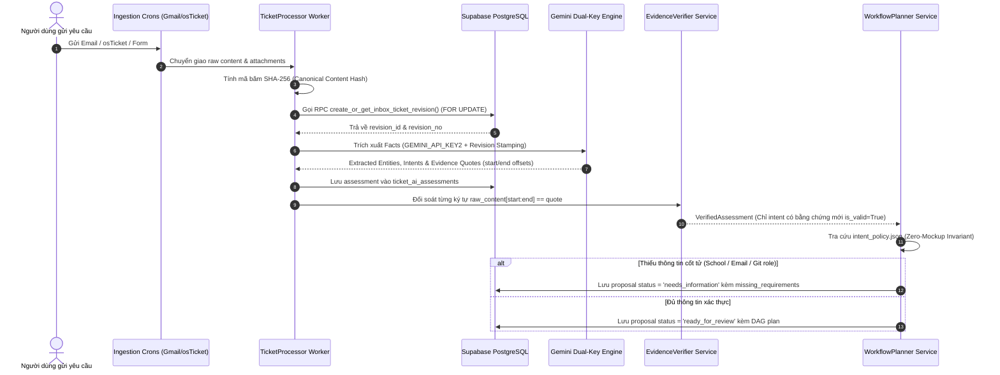
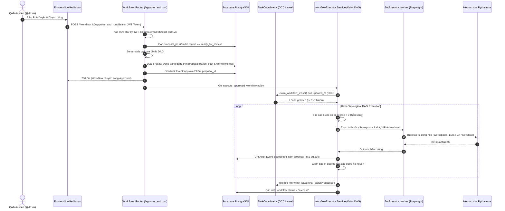

# 🚀 BÁCH KHOA TOÀN THƯ KIẾN TRÚC HỆ THỐNG PTV-TASKS-ADMINISTRATOR
## Pythaverse Central Admin & Automation Hub (Enterprise Single Source of Truth)

> **Tài liệu kiến trúc chuẩn mực:** Bản tài liệu này được biên soạn độc quyền và toàn diện để hệ thống hóa 100% mã nguồn, kiến trúc đa nền tảng, cơ chế an toàn bất biến, các dịch vụ tự động hóa, 20 bảng CSDL Supabase, toàn bộ 40+ module Backend FastAPI và 13 trang chức năng Frontend SPA của dự án **`ptv-tasks-administrator`**.  
> **Cam kết thiết kế:** Bất kỳ AI Coder hay kỹ sư hệ thống mới nào chỉ cần đọc duy nhất tệp tin này là thấu suốt toàn bộ dự án, hiểu rõ vai trò của từng tệp tin, cách thức hoạt động của từng hàm, luồng dữ liệu liên thông và các ràng buộc an toàn tuyệt đối mà không cần phải mở xem từng file đơn lẻ.

---

## 📌 THÔNG TIN BẢN QUYỀN & TÁC GIẢ SÁNG LẬP

- **Dự án:** `ptv-tasks-administrator` (Pythaverse Central Admin & Automation Hub)
- **Tác giả & Kiến trúc sư trưởng:** **Nguyễn Mạnh Hùng** (*Lead AI Engineer & Automation Architect – DTT Corporation / Pythaverse Ecosystem*)
- **GitHub:** [`https://github.com/hungnm-1225`](https://github.com/hungnm-1225)
- **Email:** `hungnm@dtt.vn` / `hung.nguyenmanh@dtt.vn`
- **Hệ sinh thái:** [Pythaverse Space](https://pythaverse.space)
- **Phiên bản:** `v3.2.0 Enterprise Hardened Edition` (Cập nhật ngày 14 tháng 09 năm 2026)

---

## 📑 MỤC LỤC TỔNG QUAN

1. [PHẦN I: TẦM NHÌN HỆ THỐNG & SÁU NGUYÊN TẮC BẤT BIẾN (SAFETY INVARIANTS)](#-phần-i-tầm-nhìn-hệ-thống--sáu-nguyên-tắc-bất-biến-safety-invariants)
2. [PHẦN II: 7 PHÂN HỆ NGHIỆP VỤ PYTHAVERSE (DOMAIN TRUTH)](#-phần-ii-7-phân-hệ-nghiệp-vụ-pythaverse-domain-truth)
3. [PHẦN III: STACK CÔNG NGHỆ, HẠ TẦNG ĐA NỀN TẢNG & THÔNG SỐ VẬN HÀNH](#-phần-iii-stack-công-nghệ-hạ-tầng-đa-nền-tảng--thông-số-vận-hành)
4. [PHẦN IV: SƠ ĐỒ CẤU TRÚC THƯ MỤC MONOREPO TỔNG THỂ & VAI TRÒ TỪNG FILE](#-phần-iv-sơ-đồ-cấu-trúc-thư-mục-monorepo-tổng-thể--vai-trò-từng-file)
5. [PHẦN V: GIẢI PHẪU CHI TIẾT TỪNG FILE & HÀM XỬ LÝ BACKEND (FASTAPI 0.115)](#-phần-v-giải-phẫu-chi-tiết-từng-file--hàm-xử-lý-backend-fastapi-0115)
   - [5.1. Entrypoint, Lifespan & 6 Crons Lệch Pha (`app/main.py`)](#51-entrypoint-lifespan--6-crons-lệch-pha-appmainpy)
   - [5.2. Lõi Hệ Thống Core (`app/core/`) – Dual-Key AI, OCC Lease & Lock Concurrency](#52-lõi-hệ-thống-core-appcore)
   - [5.3. Định Nghĩa Schemas & Models Pydantic (`app/models/`)](#53-định-nghĩa-schemas--models-pydantic-appmodels)
   - [5.4. Tri Thức Nghiệp Vụ & Policy Registry (`app/brain/`)](#54-tri-thức-nghiệp-vụ--policy-registry-appbrain)
   - [5.5. Cổng Giao Tiếp 10 Router REST API Endpoints (`app/api/v1/endpoints/`)](#55-cổng-giao-tiếp-10-router-rest-api-endpoints-appapiv1endpoints)
   - [5.6. Dịch Vụ Nghiệp Vụ & RPA Services (`app/services/`)](#56-dịch-vụ-nghiệp-vụ--rpa-services-appservices)
   - [5.7. Bộ Điều Phối Workers Chạy Ngầm (`app/workers/`)](#57-bộ-điều-phối-workers-chạy-ngầm-appworkers)
   - [5.8. Bộ Kiểm Thử An Toàn Hermetic Pytest Suite (`backend/tests/`)](#58-bộ-kiểm-thử-an-toàn-hermetic-pytest-suite-backendtests)
6. [PHẦN VI: GIẢI PHẪU CHI TIẾT GIAO DIỆN FRONTEND SPA (REACT 19 + VITE 6 + TAILWIND CSS V4)](#-phần-vi-giải-phẫu-chi-tiết-giao-diện-frontend-spa-react-19--vite-6--tailwind-css-v4)
   - [6.1. Kiến Trúc Lõi Frontend SPA & Design System](#61-kiến-trúc-lõi-frontend-spa--design-system)
   - [6.2. Giải Phẫu Chi Tiết 13 Trang Chức Năng (`src/features/`)](#62-giải-phẫu-chi-tiết-13-trang-chức-năng-srcfeatures)
7. [PHẦN VII: CƠ SỞ DỮ LIỆU SUPABASE POSTGRESQL 16 (20 BẢNG & PROVENANCE HẠ TẦNG)](#-phần-vii-cơ-sở-dữ-liệu-supabase-postgresql-16-20-bảng--provenance-hạ-tầng)
8. [PHẦN VIII: SƠ ĐỒ LUỒNG NGHIỆP VỤ END-TO-END (MERMAID SEQUENCE & FLOWCHARTS)](#-phần-viii-sơ-đồ-luồng-nghiệp-vụ-end-to-end-mermaid-sequence--flowcharts)
9. [PHẦN IX: CẨM NANG VẬN HÀNH & HƯỚNG DẪN TEST DÀNH CHO KỸ SƯ HỆ THỐNG](#-phần-ix-cẩm-nang-vận-hành--hướng-dẫn-test-dành-cho-kỹ-sư-hệ-thống)
10. [PHẦN X: CẨM NANG ĐỊNH TUYẾN CHUYÊN GIA AI (INTELLIGENT AGENT ROUTING PLAYBOOK)](#-phần-x-cẩm-nang-định-tuyến-chuyên-gia-ai-intelligent-agent-routing-playbook)

---

## 🏛️ PHẦN I: TẦM NHÌN HỆ THỐNG & SÁU NGUYÊN TẮC BẤT BIẾN (SAFETY INVARIANTS)

`ptv-tasks-administrator` được định vị là **Trung tâm Thần kinh Điều phối & Tự Động Hóa Tập Trung (Pythaverse Central Admin & Automation Hub)** cho toàn bộ tập đoàn DTT Corporation và hệ sinh thái giáo dục công nghệ Pythaverse.

```
                  ┌────────────────────────────────────────────────────────┐
                  │                 ĐẦU VÀO ĐA KÊNH (INGESTION)             │
                  │   [Gmail Workspace]  [Google Forms]  [OS Ticket SCP]   │
                  └───────────────────────────┬────────────────────────────┘
                                              │ Ingestion Crons (Lệch pha: +15s, +90s, +420s)
                                              ▼
┌──────────────────────────────────────────────────────────────────────────────────────────┐
│                      LÕI TRUNG TÂM PTV-TASKS-ADMINISTRATOR (BACKEND FASTAPI)             │
│                                                                                          │
│  ┌─────────────────────────┐   ┌───────────────────────────┐   ┌──────────────────────┐  │
│  │ Dual-Path Cognition AI  │   │ EvidenceVerifier Service  │   │  Human-in-the-Loop   │  │
│  │ • Summary (Key 1)       │──▶│ • raw_content[start:end]  │──▶│  Safety Gate         │  │
│  │ • Facts (Key 2)         │   │ • Substring Calibration   │   │  JWT Authenticated   │  │
│  └─────────────────────────┘   └─────────────┬─────────────┘   └──────────────────────┘  │
│                                              │ Verified Facts                            │
│                                              ▼                                           │
│                                ┌───────────────────────────┐                             │
│                                │  Registry Policy Engine   │                             │
│                                │  • intent_policy.json     │                             │
│                                │  • Zero-Mockup Invariant  │                             │
│                                │  • Dual-Freeze Proposal   │                             │
│                                └─────────────┬─────────────┘                             │
│                                              │ Phê duyệt (Approved)                      │
│                                              ▼                                           │
│  ┌────────────────────────────────────────────────────────────────────────────────────┐  │
│  │                 TOPOLOGICAL DAG EXECUTOR & BOT WORKERS (KAHN ALGORITHM)            │  │
│  │  • OCC Workflow Lease Claiming via updated_at (Chống Race-Condition tuyệt đối)     │  │
│  │  • Khối try...finally cam kết 100% thu hồi Lease và tài nguyên Semaphore            │  │
│  │  • Diệt tận gốc lỗi Request #None tại bước waiting_poll                            │  │
│  │  • Append-Only Audit Trail (workflow_execution_events gắn proposal_id bất biến)    │  │
│  │  • BFS Graph Traversal: Reset thông minh toàn bộ downstream dependencies khi retry │  │
│  └────────────────────────────────────────────────────────────────────────────────────┘  │
│                                              │                                           │
│  ┌────────────────────────────────────────────────────────────────────────────────────┐  │
│  │                    MA TRẬN 8 BỘ NHỚ ĐỆM IN-MEMORY RAM (1MS SPEED)                  │  │
│  │    Courses (10m) | Workspace (15m) | Board (5m) | Bots (15s) | Tasks (60s)         │  │
│  │    Tickets (60s) | Monitor (30s)   | Reports (60s)                                 │  │
│  └────────────────────────────────────────────────────────────────────────────────────┘  │
└──────────────────────────────────────────────┬───────────────────────────────────────────┘
                                               │ Thực thi tự động
                                               ▼
                  ┌────────────────────────────────────────────────────────┐
                  │               HỆ SINH THÁI ĐÍCH (EXECUTION TARGETS)    │
                  │ School Workspace | PLearn LMS | Keycloak | Pythaverse Git | GitHub │
                  └───────────────────────────┴────────────────────────────┘
```

### Sáu Nguyên Tắc Thiết Kế Bất Biến (Absolute Safety Invariants):

1. **Evidence-Based & Offset Verification Invariant (Không Bằng Chứng ➔ Không Action):**
   - Mọi ý định vận hành trích xuất bắt buộc phải có đoạn trích dẫn nguyên văn (`quote`) kèm định vị ký tự (`start_offset`, `end_offset`) và mã revision `source_revision_id`.
   - `EvidenceVerifierService` đối soát từng ký tự: $\text{raw\_content}[\text{start}:\text{end}] == \text{quote}$.
   - Nếu trích dẫn bị xê dịch vị trí do định dạng khoảng trắng, hệ thống áp dụng thuật toán **Substring Calibration** trong phạm vi 160 ký tự. Nếu quote hoàn toàn không tồn tại hoặc sai lệch revision, intent đó bị gạch bỏ và outcome hạ xuống `needs_information`.
2. **Attachment Evidence Fail-Closed Invariant (File đính kèm chưa đối soát ➔ Không Action):**
   - Các trích dẫn có `source_kind == "attachment_extract"` tạm thời bị gắn cờ `is_verified = False` (chuyển sang `needs_information`).
   - Nghiêm cấm tuyệt đối việc dùng text thân email để đối soát trích dẫn từ file đính kèm khi chưa qua hạ tầng bóc tách bất biến.
3. **Zero-Mockup Invariant (Cấm Tuyệt Đối Dữ Liệu Bịa Đặt / Fallback Giả Định):**
   - Nghiêm cấm sử dụng bất kỳ giá trị mặc định giả lập nào (`SWRP 4-12`, count=4, mật khẩu `Ptv@2026`).
   - **Đặc biệt: Khai tử hoàn toàn default Git role `GUEST`**. Yêu cầu cấp quyền Git không nêu rõ vai trò bắt buộc sinh `missing_requirement: git_role`, chuyển trạng thái sang `needs_information` và không tạo bước `git.add_collaborators`.
4. **Dual-Freeze Proposal & Immutable Provenance Linkage:**
   - Khi Admin phê duyệt, hệ thống đóng băng đồng thời cả `workflow_proposals.frozen_plan` và `automation_workflows.steps`.
   - Toàn bộ execution events trong `workflow_execution_events` bắt buộc phải mang theo `proposal_id`. Tuyệt đối không cho phép chỉnh sửa workflow hay proposal sau khi đã ở trạng thái `approved`.
5. **Real JWT Identity Enforcement (Chống Mạo Danh Người Phê Duyệt):**
   - Bỏ qua trường `approved_by` do Frontend gửi lên trong payload body.
   - Danh tính người duyệt được giải mã trực tiếp từ Bearer JWT Token qua dependency `get_current_user_email` và bắt buộc thuộc whitelist domain `@dtt.vn`.
6. **Optimistic Concurrency Control (OCC) Lease & Concurrency Safeguard (Render 512MB RAM):**
   - Chiếm Lease độc quyền cấp Workflow qua `TaskCoordinator.claim_workflow_lease()` sử dụng kiểm soát đồng thời lạc quan (OCC) trên trường `updated_at`. Hàm `update_workflow_heartbeat()` ném `RuntimeError` dừng khẩn cấp worker nếu bị cướp lease.
   - Khóa cứng `GLOBAL_PLAYWRIGHT_SEMAPHORE = asyncio.Semaphore(1)` kết hợp ContextVar `_PLAYWRIGHT_SLOT_HOLDER` chống deadlock re-entrancy khi hàm cha con cùng gọi acquire slot.
   - Mọi coroutine chạy Playwright hoặc quét ngầm bắt buộc gọi `gc.collect()` và `force_kill_zombie_chromium()` trong khối `finally`.
   - 6 Crons trong `main.py` xuất phát lệch pha (15s, 90s, 180s, 420s, 1200s, 2400s) để ngăn tràn RAM.

---

## 🌐 PHẦN II: 7 PHÂN HỆ NGHIỆP VỤ PYTHAVERSE (DOMAIN TRUTH)

| STT | Phân Hệ | Tên Miền / Giao Thức | Core Platform | Vai Trò Kỹ Thuật & Nghiệp Vụ Cốt Lõi | Phương Thức Tự Động Hóa |
|---|---|---|---|---|---|
| **1** | **School Workspace** | `https://pythaverse.space` | React MUI / Direct REST APIs | Quản trị phân cấp 3 tầng (`Distributor` ➔ `Partner` ➔ `School`). Cấp phát License Pool, bù Contract, nộp batch tài khoản số lượng lớn qua Bulk Account Creation. | Playwright Headless + Direct API Scanner (Gói `workspace/` 8 modules). Bơm DOM JS trực tiếp bảo toàn ký tự đặc biệt. |
| **2** | **PLearn LMS** | `https://learn.pythaverse.space` | Moodle LMS (PHP / MariaDB / Edwiser RemUI) | Cổng đào tạo Moodle LMS. Quản lý danh mục khóa học (`SWRP`, `IR`, `ASP`...) và ghi danh tài khoản theo Vai trò (`Student` - 9, `Teacher` - 7, `Manager` - 1). | Playwright Headless + Keyword Filter 2 nhịp trên `td.cell.c2` (`playwright_service.py`). |
| **3** | **PGit Repos** | `https://git.pythaverse.space` | GitBucket Server (Scala / JVM / SQLite) | Máy chủ lưu trữ mã nguồn dự án học sinh & giáo viên. Quản lý Collaborators tại `/settings/collaborators`. Yêu cầu đăng nhập SSO Keycloak. | Playwright Chromium tự động hóa OIDC Keycloak SSO Form, gán vai trò `ADMIN`, `DEVELOPER`, `GUEST` (`git_service.py`). |
| **4** | **Keycloak Auth IDP** | `https://eid.pythaverse.space` | Keycloak (Java / WildFly / PostgreSQL) | Cổng xác thực định danh tập trung OpenID Connect / OAuth2 (Realm: `master` / `idp`). Reset mật khẩu, kích hoạt/khóa tài khoản và xác thực email. | 2-Tier Hybrid: Direct REST API (300ms) ➔ Playwright RPA Fallback (`keycloak_service.py`). |
| **5** | **Leanbot IDE** | `https://ide.pythaverse.space` | Blockly / Web Bluetooth BLE | Web IDE lập trình khối kéo thả Blockly kết nối Robot Leanbot qua Bluetooth BLE. | Synthetic Monitoring Uptime & Latency (`site_monitor_service.py`). |
| **6** | **Support Helpdesk** | `https://support.pythaverse.space` | osTicket (PHP / MySQL) | Hệ thống tiếp nhận sự cố kỹ thuật osTicket. Cào dữ liệu định kỳ qua Playwright Headless session và chuyển giao cho Canonical Intake. | Playwright headless scraper cào vé, custom form fields & files đính kèm (`osticket_service.py`). |
| **7** | **PContest** | `https://contest.pythaverse.space` | Next.js / Python Judge | Hệ thống tổ chức thi đấu lập trình trực tuyến, quản lý Leaderboard và chấm điểm tự động. | Synthetic Monitoring Uptime & Latency (`site_monitor_service.py`). |

---

## 🛠️ PHẦN III: STACK CÔNG NGHỆ, HẠ TẦNG ĐA NỀN TẢNG & THÔNG SỐ VẬN HÀNH

### 1. Thế Trận Hạ Tầng Đa Nền Tảng (Multi-Platform Topology)
- **Vercel**: Máy chủ Edge CDN lưu trữ ứng dụng Frontend React 19 SPA (Build siêu tốc với Dynamic Chunk Splitting qua Vite 6).
- **Render.com**: Máy chủ khởi chạy Backend FastAPI trên môi trường tài nguyên nghiêm ngặt (**512MB RAM Free/Starter Tier**). Khóa cứng Semaphore 1 slot, thu hồi bộ nhớ `gc.collect()` và tiêu diệt Chromium zombie.
- **Supabase**: Cơ sở dữ liệu PostgreSQL 16 (20 bảng chuyên biệt, RLS `@dtt.vn`, Storage Bucket `ticket-attachments`, Két sắt mã hóa Fernet, và PostgreSQL Stored Procedure Atomic Locking).
- **Google Cloud Console**: Quản trị tài khoản dịch vụ (Service Account) tích hợp bộ ba Gmail Workspace API, Google Sheets API và Google Drive API.
- **UptimeRobot**: Giám sát ngoại vi Synthetic Ping Uptime (chu kỳ 5 phút) kiêm nhiệm vụ giữ ấm (keep-warm ping) cho Render chống ngủ đông.
- **GitHub**: Quản lý mã nguồn Monorepo, GitHub Actions CI/CD và Dispatcher Issue tự động vào Private Repositories.

### 2. Chi Tiết Backend Stack
- **Ngôn ngữ & Runtime:** Python `3.11.x` / `3.12.x`
- **Web Framework:** FastAPI `0.115.x` (Asynchronous ASGI)
- **Validation Engine:** Pydantic `2.10.x` (Strict Schema Validation & Settings Management)
- **RPA Engine:** Playwright Async Chromium (`playwright.async_api: 1.50.x`)
- **Lập lịch chạy ngầm:** APScheduler `3.10.x` (`AsyncIOScheduler`) với 6 Crons so le lệch pha.
- **In-Memory Caching:** Ma trận 8 In-Memory RAM Caches (`BoundedMemoryCache` phân tầng LRU + TTL, phản hồi 1ms, RAM <= 40MB).
- **Trí tuệ nhân tạo (AI):** `google-generativeai: ^0.8.4` tích hợp Dual-Key Engine (`GEMINI_API_KEY` & `GEMINI_API_KEY2`) kết hợp chuỗi 10 models fallback (`gemini-3.8-flash` ➔ `gemini-3.7-flash` ➔ `gemini-3.5-flash-lite` ➔ `gemini-2.5-flash`...).
- **Kiểm Thử Hồi Quy:** `pytest: ^9.x` / `pytest-asyncio: ^1.4.x` (Hermetic in-memory test suite, **22/22 green in 1.58s**).

### 3. Chi Tiết Frontend Stack
- **Node.js**: `20.x LTS` / `22.x LTS`
- **React**: `19.0.0` (React 19 Functional Hooks, Concurrent Rendering, Suspense Code Splitting)
- **Build Tool:** Vite `6.2.x`
- **TypeScript**: `5.7.x` (`strict: true`, Strict Type Checking)
- **Tailwind CSS**: `4.0.x` (Kiến trúc Design Tokens hiện đại `@import "tailwindcss";` kết hợp Enterprise Pastel OKLCH)
- **Lucide React**: `0.475.x` (Icon Library đồng nhất)
- **SheetJS (`xlsx`)**: `0.18.5` (Xử lý bóc tách & xuất file Excel client-side)
- **Supabase JS Client**: `@supabase/supabase-js: ^2.48.x` (Auth & Realtime Client)
- **Sonner**: `^2.0.1` (Toast Notification thích ứng Theme)
- **Canvas Confetti**: `^1.9.4` (Hiệu ứng pháo hoa hạt khi duyệt/hoàn thành workflow)

---

## 📁 PHẦN IV: SƠ ĐỒ CẤU TRÚC THƯ MỤC MONOREPO TỔNG THỂ & VAI TRÒ TỪNG FILE

```
ptv-tasks-administrator/
├── backend/                                    # Ứng dụng Backend FastAPI (Python 3.11/3.12)
│   ├── app/
│   │   ├── api/                                # REST API Routers
│   │   │   └── v1/
│   │   │       ├── router.py                   # Aggregator router gom 10 endpoints
│   │   │       └── endpoints/                  # 10 Router chuyên biệt
│   │   │           ├── workflows.py            # Safety Gate, Dual Freeze, DAG Execution, Depends(JWT)
│   │   │           ├── tickets.py              # Canonical Intake, Re-summarize, Re-assess Intent
│   │   │           ├── tasks.py                # Bot Task Queue, run_approved_task_worker, Payload Edit
│   │   │           ├── bots.py                 # Bot Status, Realtime Logs GMT+7 với Taxonomy Filter
│   │   │           ├── board.py                # Multi-board Kanban (Boards, Columns, Cards, DND)
│   │   │           ├── courses.py              # Dual Catalogs (Workspace & LMS), Git Repo Links
│   │   │           ├── workspace.py            # Phả hệ 480 trường, Scanner Cache, Bóc tách COF
│   │   │           ├── monitor.py              # Synthetic Ping 10 Sites, Auth Matrix, Downtime Logs
│   │   │           ├── github.py               # AI Bug Triage ➔ GitHub Issue Dispatcher
│   │   │           └── reports.py              # KPI Summary, Category Ratios, Daily Trends, Export
│   │   ├── brain/                              # Tri thức nghiệp vụ & Policy Registry
│   │   │   ├── capabilities.json               # 19 Capabilities hệ thống (Schemas, Handlers, Risk)
│   │   │   ├── intent_policy.json              # Bảng chính sách tất định (v1.1.0)
│   │   │   ├── dependency_rules.json           # Quy tắc sắp xếp Tô-pô & DAG dependencies
│   │   │   ├── workflow_rules.json             # Archetypes luồng công việc mẫu
│   │   │   ├── knowledge_base.json             # Tri thức kỹ thuật của 7 phân hệ Pythaverse
│   │   │   └── prompts/                        # Versioned Prompts (ticket_summary_v1, intent_extraction_v1)
│   │   ├── core/                               # Lõi hệ thống & Quản trị tài nguyên
│   │   │   ├── config.py                       # Settings, Pydantic BaseSettings, Time utilities GMT+7
│   │   │   ├── cache_policy.py                 # BoundedMemoryCache (3 Tiers, LRU, TTL, RAM <= 40MB)
│   │   │   ├── playwright_manager.py           # Semaphore 1 Slot, Re-entrancy Lock, Zombie Killer
│   │   │   ├── security.py                     # Whitelist Domain @dtt.vn, Bearer JWT Auth Dependency
│   │   │   ├── supabase.py                     # Singleton client Supabase
│   │   │   ├── task_coordinator.py             # OCC Workflow Lease Claiming via updated_at, Heartbeat
│   │   │   └── gemini.py                       # Dual-Key AI Engine, Cross-Key Failover, 10 Models
│   │   ├── models/                             # Schemas Pydantic Strict Validation
│   │   │   ├── intent.py                       # EvidenceSpan (offsets), ExtractedEntity, TypedEntities
│   │   │   ├── workflow.py                     # WorkflowStepDraft (is_manual), WorkflowApprovalRequest
│   │   │   ├── ticket.py                       # InboxTicket schemas
│   │   │   ├── task.py                         # BotAutomationTask schemas
│   │   │   └── template.py                     # TemplateConfig schemas
│   │   ├── services/                           # Dịch vụ nghiệp vụ & RPA
│   │   │   ├── evidence_verifier.py            # Deterministic Verifier, Substring Calibration
│   │   │   ├── workflow_planner.py             # Registry-Driven Policy Engine, Zero-Mockup Invariant
│   │   │   ├── workflow_executor.py            # Topological Kahn DAG, Frozen Plan SOT, BFS Retry
│   │   │   ├── playwright_service.py           # Moodle LMS Enrollment Playwright Service
│   │   │   ├── git_service.py                  # GitBucket Playwright Collaborators Service
│   │   │   ├── keycloak_service.py             # 2-Tier Hybrid Keycloak (REST API 300ms + RPA Fallback)
│   │   │   ├── osticket_service.py             # osTicket Playwright Scraper
│   │   │   ├── site_monitor_service.py         # Synthetic Monitor Uptime & Latency cho 10 Sites
│   │   │   ├── cof_excel_service.py            # Bóc tách COF 3 Tabs & ghi ngược kết quả
│   │   │   ├── workspace_lineage_service.py    # Phân giải phả hệ 3 cấp & giải mã két sắt Fernet
│   │   │   ├── workspace_playwright_service.py # Singleton facade kết nối workspace orchestrator
│   │   │   ├── workspace/                      # Gói RPA Workspace modularized 8 modules
│   │   │   │   ├── base.py                     # Low-RAM Chromium Setup, JS DOM Injection Login
│   │   │   │   ├── account_service.py          # Bulk Account Creation & Batch Polling
│   │   │   │   ├── order_service.py            # School Order Creation & Partner License Grant
│   │   │   │   ├── contract_service.py         # Partner Contract Request & Distributor Approval
│   │   │   │   ├── enroll_service.py           # License Allocation to Students
│   │   │   │   ├── workspace_scanner_service.py# Direct API Scanner + Playwright Cache Sync
│   │   │   │   └── orchestrator_service.py     # E2E Pipeline Coordinator
│   │   │   ├── gmail_service.py                # Google Workspace Gmail Polling via OAuth2
│   │   │   ├── google_sheet_service.py         # Google Sheets Form Feedback Polling
│   │   │   ├── google_doc_service.py           # Google Docs Feedback Comments Reader
│   │   │   ├── google_drive_service.py         # Google Drive Downloader & Explorer
│   │   │   └── github_service.py               # GitHub REST API Issue Creator
│   │   ├── workers/                            # Bộ điều phối thực thi chạy ngầm
│   │   │   ├── bot_executor.py                 # Central Worker Router thực thi 19 Capabilities
│   │   │   └── ticket_processor.py             # Atomic Revision RPC, Canonical Hash, Provenance Pipeline
│   │   └── main.py                             # Lifespan 6 Crons so le, Polling với Proposal ID audit
│   ├── tests/                                  # Bộ Kiểm Thử Hermetic Pytest (22/22 Green in 1.58s)
│   │   ├── test_capability_contracts.py        # Contract Test 19 capabilities vs bot_executor
│   │   ├── test_planning_policy.py             # Test Zero-Mockup, EvidenceVerifier, Injection, Offsets
│   │   ├── test_execution_safety.py            # Test Kahn Topological sort, Masking, Data Binding
│   │   ├── test_security_and_provenance.py     # Test JWT whitelist @dtt.vn, Immutable Provenance
│   │   └── test_workflow_legacy_replan.py      # Test Re-plan tự động cho legacy workflow
│   ├── pytest.ini                              # Cấu hình Pytest asyncio
│   ├── requirements.txt                        # Thư viện Python Backend
│   └── Dockerfile                              # Cấu hình Docker Linux cho Render.com
├── frontend/                                   # Ứng dụng Frontend SPA (React 19 + Vite 6 + Tailwind CSS v4)
│   ├── src/
│   │   ├── components/                         # UI Components dùng chung
│   │   │   ├── common/                         # ConfirmDialog, ThemeToggle...
│   │   │   └── layout/                         # AppLayout, Sidebar (11 menu), Header
│   │   ├── config/                             # Cấu hình tác giả & branding (authorConfig.ts)
│   │   ├── context/                            # React Contexts
│   │   │   ├── AuthContext.tsx                 # Supabase Authentication State & JWT token
│   │   │   └── ThemeContext.tsx                # Dark / Light Mode Switcher
│   │   ├── features/                           # 13 Trang Chức Năng Chuyên Biệt
│   │   │   ├── inbox/                          # AI Workflow Console V3.1 Bento Grid (UnifiedInboxPage.tsx)
│   │   │   │   └── components/                 # WorkflowBuilder, WorkflowStepCard, WorkflowValidationPanel
│   │   │   ├── tasks/                          # TaskManagementPage.tsx (Bot Tasks Queue & Edit)
│   │   │   ├── board/                          # WorkBoardPage.tsx (Multi-board Kanban DND)
│   │   │   ├── studio/                         # AutomationStudioPage.tsx (RPA Multi-System Studio)
│   │   │   ├── courses/                        # CoursesManagerPage.tsx (Dual Catalog & Git Sync)
│   │   │   ├── bots/                           # BotCommanderPage.tsx (Bot Monitoring & Live Terminal)
│   │   │   ├── monitor/                        # SiteMonitorPage.tsx (3-Tab Health & Uptime Monitor)
│   │   │   ├── github/                         # GithubReporterPage.tsx (AI Bug Triage ➔ Issue)
│   │   │   ├── reports/                        # ReportsExportPage.tsx (KPIs & Excel Export)
│   │   │   ├── dashboard/                      # DashboardPage.tsx (Operational Executive Overview)
│   │   │   ├── profile/                        # ProfileSettingsPage.tsx (User Settings & Vault Status)
│   │   │   ├── landing/                        # LandingPage.tsx (Welcome Portal)
│   │   │   └── auth/                           # LoginPage.tsx (Supabase OAuth & @dtt.vn Validation)
│   │   ├── lib/                                # Utilities & HTTP Clients
│   │   │   ├── api.ts                          # fetchApi tự động gắn Supabase Bearer JWT, timeout 30s
│   │   │   └── supabase.ts                     # Supabase Client Frontend
│   │   ├── types/                              # TypeScript Strict Interfaces (index.ts)
│   │   ├── App.tsx                             # SPA Router, Suspense Code Splitting, ProtectedRoute
│   │   ├── index.css                           # Tailwind CSS v4 Design Tokens & OKLCH Theme
│   │   └── main.tsx                            # React 19 Entrypoint (createRoot)
│   ├── package.json                            # Thư viện Frontend
│   ├── tsconfig.json                           # TypeScript Compiler Config
│   └── vite.config.ts                          # Vite 6 Bundler Config & Dynamic Chunk Splitting
├── supabase/
│   ├── migrations/                             # Lịch sử 5 Database Migrations
│   │   ├── 20260812000000_initial_schema.sql
│   │   ├── 20260910000000_add_automation_workflows.sql
│   │   ├── 20260911000000_add_provenance_and_proposals.sql
│   │   ├── 20260912000000_harden_workflow_provenance.sql
│   │   └── 20260913000000_atomic_revisions_and_workflow_safety.sql
│   ├── runbooks/                               # SQL Scripts Pre-flight & Post-flight kiểm định
│   └── schema.sql                              # Schema chuẩn mực 20 bảng CSDL, RLS, Indexes, Stored Procedures
├── GEMINI.md                                   # System Instructions & Quy chuẩn tác nghiệp của AI Assistant
├── Blueprint.md                                # Master Blueprint Đặc Tả Kỹ Thuật Tổng Thể v2.0.0
└── README.md                                   # Bách khoa toàn thư kiến trúc hệ thống (Single Source of Truth)
```

---

## 🔬 PHẦN V: GIẢI PHẪU CHI TIẾT TỪNG FILE & HÀM XỬ LÝ BACKEND (FASTAPI 0.115)

### 5.1. Entrypoint, Lifespan & 6 Crons Lệch Pha (`app/main.py`)
- **Tệp tin:** [`backend/app/main.py`](file:///c:/Users/dtt/Desktop/Project/ptv-tasks-administrator/backend/app/main.py)
- **Hàm `lifespan(app: FastAPI)`:**
  - Khởi tạo `AsyncIOScheduler` quản lý 6 tác vụ chạy ngầm định kỳ.
  - Gọi `force_kill_zombie_chromium()` và `gc.collect()` ngay khi khởi động và trước khi shutdown để dọn sạch container.
  - Lập lịch xuất phát lệch pha bảo vệ trần 512MB RAM Render:
    1. `gmail_cron` (10 phút, +15s): Gọi `poll_unread_gmails` cào thư mới từ Gmail Workspace qua API.
    2. `sheet_cron` (15 phút, +90s): Gọi `poll_form_feedbacks` cào phản hồi từ Google Sheets.
    3. `workspace_long_tasks_cron` (10 phút, +180s): Gọi `poll_workspace_long_tasks` kiểm tra tiến độ batch tài khoản.
    4. `osticket_cron` (15 phút, +420s): Gọi `poll_open_ostickets` chạy Chromium Playwright cào vé hỗ trợ.
    5. `site_uptime_cron` (60 phút, +1200s): Gọi `poll_site_uptime_cron` quét HTTP ping kiểm tra 10 Sites.
    6. `distributor_cache_scanner_cron` (60 phút, +2400s): Gọi `workspace_scanner_service.scan_and_cache_all_distributors` làm tươi bộ nhớ đệm hợp đồng và đơn hàng.
- **Hàm `safe_job_wrapper(job_func, job_name)`:**
  - Bọc an toàn tuyệt đối cho mọi cronjob: Bắt ngoại lệ, chống crash tiến trình ASGI.
  - Bắt `CronSlotYieldException`: Khi slot Playwright đang bận, cron nhường slot êm dịu mà không xuất log lỗi đỏ.
  - Khối `finally` đảm bảo 100% gọi `gc.collect()`.
- **Hàm `poll_workspace_long_tasks()` – Đồng Bộ Waiting Poll & Tự Động Resume Workflow:**
  - Quét bảng `bot_automation_tasks` tìm các task `execution_status = 'waiting_poll'` và `next_check_at <= now()`.
  - **Diệt tận gốc lỗi `Request #None`:** Nếu thiếu `request_id`, lập tức fail-closed cả task lẫn workflow, đánh dấu `status = 'failed'` và ghi audit event `failed` mang đầy đủ `proposal_id`.
  - Nếu batch hoàn tất (`status == 'completed'`):
    - Đọc file kết quả, gọi `COFExcelService.write_results_back_to_cof` ghi ngược mã tài khoản vào file COF.
    - Upload file kết quả lên Supabase Storage `ticket-attachments` tại thư mục `results/`.
    - Cập nhật bot task `execution_status = 'success'`.
    - Đóng dấu bước workflow `status = 'success'`, lưu `outputs`.
    - Ghi audit event `succeeded` mang `proposal_id`.
    - **Tự động gọi `workflow_executor_service.execute_approved_workflow(workflow_id)` chạy ngầm** để tiếp tục kích hoạt các bước hạ nguồn (như LMS Enroll, Git Add Collaborators).
  - Nếu batch vẫn đang chạy (`still_processing`): Lùi hẹn kiểm tra lại sau 5 phút (`next_check_at = now + 5m`).

---

### 5.2. Lõi Hệ Thống Core (`app/core/`)

#### [`config.py`](file:///c:/Users/dtt/Desktop/Project/ptv-tasks-administrator/backend/app/core/config.py) (Settings & Time Utilities)
- `VN_TZ = pytz.timezone("Asia/Ho_Chi_Minh")`: Múi giờ Việt Nam duy nhất toàn hệ thống.
- Các hàm thời gian chuẩn: `get_utc_now()`, `get_utc_iso()` (lưu DB), `get_vn_time_str()`, `to_vn_time_str(val)` (chuyển đổi mọi đối tượng thời gian sang GMT+7 an toàn chống cộng đúp múi giờ).
- `Settings(BaseSettings)`: Quản lý biến môi trường: Supabase URL/Keys, JWT Issuer/Audience/Secret, 10-Model Gemini list, thông tin đăng nhập Keycloak, GitBucket, osTicket, Google APIs.

#### [`cache_policy.py`](file:///c:/Users/dtt/Desktop/Project/ptv-tasks-administrator/backend/app/core/cache_policy.py) (In-Memory RAM Cache Phân Tầng)
- `CacheTier`:
  - `TIER_A_CATALOG`: Dữ liệu tĩnh (Courses, 480 trường học) – Max 50 items, TTL 10-15 phút.
  - `TIER_B_STATUS`: Trạng thái động (Bot workers, Site monitor, Reports) – Max 20 items, TTL 15-30 giây.
  - `TIER_C_SUMMARY`: Danh sách tóm tắt (Tasks, Tickets) – Max 15 items, TTL 45-60 giây.
- `BoundedMemoryCache`:
  - Sử dụng `OrderedDict` theo thuật toán LRU (Least Recently Used): Tự động loại bỏ key cũ nhất khi đạt ngưỡng `max_entries`.
  - Tự động dọn dẹp key hết hạn (`_purge_expired`) khi get/set.
  - Hỗ trợ `invalidate(prefix)` xóa sạch bộ nhớ đệm khi dữ liệu bị biến động. Giữ tổng dung lượng RAM cache toàn hệ thống luôn dưới mức **40MB**.

#### [`playwright_manager.py`](file:///c:/Users/dtt/Desktop/Project/ptv-tasks-administrator/backend/app/core/playwright_manager.py) (Lock Quản Trị Tài Nguyên Chromium)
- `GLOBAL_PLAYWRIGHT_SEMAPHORE = asyncio.Semaphore(1)`: Khóa cứng tối đa 1 phiên Chromium hoạt động đồng thời trên toàn bộ container Render 512MB RAM.
- `_PLAYWRIGHT_SLOT_HOLDER: contextvars.ContextVar`: Quản lý danh tính coroutine đang giữ slot, cho phép **Re-entrancy an toàn** (hàm con kế thừa slot từ hàm cha mà không gây Deadlock).
- `acquire_playwright_slot(task_name, timeout, lane)`:
  - `lane='admin'`: Làn VIP dành cho Quản trị viên duyệt tác vụ hoặc kích hoạt từ Studio (Timeout 300s).
  - `lane='cron'`: Làn ngầm định kỳ (osTicket, Scanner). Nếu bận quá 45s, chủ động ném `CronSlotYieldException` nhường slot êm dịu.
  - Khối `finally` đảm bảo 100% giải phóng semaphore, tiêu diệt zombie chromium (`force_kill_zombie_chromium()`) và gọi `gc.collect()`.
- `LOW_RAM_CHROMIUM_ARGS`: 18 cờ tối ưu hóa Chromium (`--no-sandbox`, `--disable-dev-shm-usage`, `--disable-gpu`, `--js-flags=--max-old-space-size=128`...).
- `setup_low_ram_routes(target)`: Bộ lọc mạng chặn triệt để hình ảnh (`png, jpg, webp`), video (`mp4, webm`), audio, fonts và trackers (`google-analytics, hotjar`), giúp tiết kiệm đến **70% RAM**.
- Smart DOM Helpers: `wait_for_dom_and_spinners`, `smart_wait_login_or_error` (chờ theo state race), `smart_wait_for_options_loaded`, `smart_poll_condition`.

#### [`security.py`](file:///c:/Users/dtt/Desktop/Project/ptv-tasks-administrator/backend/app/core/security.py) (Strict Bearer JWT Authenticator)
- `get_current_user_email(credentials)`:
  - Dependency FastAPI bắt buộc trích xuất email trực tiếp từ Bearer JWT token trong header `Authorization`.
  - Giải mã và xác thực chữ ký token qua `SUPABASE_JWT_SECRET` (hỗ trợ HS256, RS256, ES256) cùng cấu hình Audience (`authenticated`) và Issuer.
  - **Cưỡng chế nghiêm ngặt whitelist domain `@dtt.vn`:** Token ngoài domain hoặc người dùng nặc danh bị từ chối ngay lập tức với mã `403 Forbidden`. Hỗ trợ fallback cho môi trường test hermetic (`TESTING=true`).

#### [`task_coordinator.py`](file:///c:/Users/dtt/Desktop/Project/ptv-tasks-administrator/backend/app/core/task_coordinator.py) (Optimistic Concurrency Control Lease)
- `claim_workflow_lease(workflow_id, operator, lease_duration_seconds=600)`:
  - Sử dụng **Optimistic Concurrency Control (OCC)**: Cập nhật có điều kiện trên trường `updated_at`. Nếu có 2 tiến trình cố chiếm lease cùng lúc (click đúp hoặc cron tranh chấp), tiến trình sau match 0 dòng và bị từ chối ngay lập tức (`Fail-closed`).
- `update_workflow_heartbeat(workflow_id, lease_token)`:
  - Gia hạn lease ngầm định kỳ. Nếu token không khớp hoặc lease bị chiếm, ném ngay `RuntimeError` để dừng khẩn cấp worker đã mất quyền sở hữu lease.
- `release_workflow_lease(workflow_id, lease_token, final_status)`:
  - Chỉ giải phóng lease và cập nhật trạng thái kết thúc khi `lease_token` khớp chính xác 100% với token trên CSDL. Ngăn chặn triệt để worker cũ ghi đè trạng thái lên worker mới.

#### [`gemini.py`](file:///c:/Users/dtt/Desktop/Project/ptv-tasks-administrator/backend/app/core/gemini.py) (Dual-Path AI Engine & Cross-Key Failover)
- `GeminiDualPathEngine`:
  - Quản trị 2 API Key độc lập: `api_key_summary` (Key 1) và `api_key_facts` (Key 2).
  - Tự động hoán đổi chìa chéo (Cross-Key Failover) khi một key chạm hạn ngạch (429 / Quota Exceeded) trước khi kích hoạt danh sách 10 model fallback.
- `summarize_ticket(subject, raw_content, source)`: Tóm tắt mềm phục vụ hiển thị Inbox, trả về `TicketSummaryResponse` (`summary_vi`, `category`, `priority`). Không sinh hành động vận hành.
- `extract_operational_facts(subject, raw_content, source, source_revision_id, attachments)`:
  - Bóc tách sự thật vận hành, trích xuất cấu trúc `extracted_entities` và `requested_operations`.
  - Đóng dấu trực tiếp `source_revision_id` vào từng `EvidenceSpan` kèm trích dẫn nguyên văn `quote` và tọa độ ký tự `[start_offset:end_offset]`.

---

### 5.3. Định Nghĩa Schemas & Models Pydantic (`app/models/`)

- [`intent.py`](file:///c:/Users/dtt/Desktop/Project/ptv-tasks-administrator/backend/app/models/intent.py):
  - `EvidenceSpan`: Trích dẫn bằng chứng bắt buộc mang `source_revision_id`, `source_kind` (`ticket_body` | `attachment_extract`), `quote`, `start_offset`, `end_offset`, `is_verified`.
  - `ExtractedEntity`: Thực thể bóc tách kèm danh sách bằng chứng và cờ kiểm chứng `is_verified`.
  - `TypedEntities`: Khung dữ liệu thực thể chuẩn hóa (`school_name`, `courses`, `repositories`, `users`, `target_email`, `git_role`, `repository_url`).
  - `ExtractedIntent`: Đại diện ý định vận hành kèm độ tin cậy và cờ `is_valid`.
  - `IntentAssessment`: Bản đánh giá toàn diện gồm `outcome` (`ACTIONABLE`, `NEEDS_INFORMATION`, `NO_ACTION`), `intents`, `typed_entities`, `missing_requirements`.
- [`workflow.py`](file:///c:/Users/dtt/Desktop/Project/ptv-tasks-administrator/backend/app/models/workflow.py):
  - `WorkflowStepDraft`: Đại diện một bước trong đồ thị DAG (`step_id`, `capability_id`, `name`, `status`, `inputs`, `depends_on`, `is_manual`, `outputs`, `error_message`).
  - `WorkflowDraftUpdate`: Payload chỉnh sửa draft của Admin (`title`, `goal`, `steps`, `operator_reason`).
  - `WorkflowApprovalRequest`: Payload phê duyệt (`run_immediately`, `operator_reason`).
  - `WorkflowValidationResult`: Kết quả kiểm định đồ thị DAG (`is_valid`, `errors`, `warnings`, `missing_requirements`, `stats`).

---

### 5.4. Tri Thức Nghiệp Vụ & Policy Registry (`app/brain/`)

- [`capabilities.json`](file:///c:/Users/dtt/Desktop/Project/ptv-tasks-administrator/backend/app/brain/capabilities.json):
  - Đăng ký 19 Capabilities hệ sinh thái: `workspace.bulk_account_creation`, `workspace.poll_account_batch`, `workspace.create_school_order`, `workspace.partner_grant_license`, `workspace.partner_request_contract`, `workspace.distributor_approve_contract`, `workspace.admin_approve_contract`, `workspace.query_distributor_contracts`, `workspace.query_partner_orders`, `lms.direct_enroll`, `git.add_collaborators`, `keycloak.reset_password`, `keycloak.unlock_account`, `keycloak.create_user`, `github.create_issue`, `cof.parse_file`...
  - Mỗi capability quy định: `id`, `domain`, `bot_type`, `action`, `required_inputs`, `produces`, `consumes`, `risk_level`, `supported_by_handler`, `available`.
- [`intent_policy.json`](file:///c:/Users/dtt/Desktop/Project/ptv-tasks-administrator/backend/app/brain/intent_policy.json):
  - Bảng chính sách tất định (Policy Registry v1.1.0) ánh xạ trực tiếp từ Intent sang Capability Pipeline:
    - `create_accounts` ➔ `[workspace.bulk_account_creation, workspace.poll_account_batch]`
    - `course_access` ➔ `[lms.direct_enroll]`
    - `repository_access` ➔ `[git.add_collaborators]`
    - `reset_password` ➔ `[keycloak.reset_password]`
    - `unlock_account` ➔ `[keycloak.unlock_account]`
    - `query_distributor_contracts` ➔ `[workspace.query_distributor_contracts]`
    - `query_partner_orders` ➔ `[workspace.query_partner_orders]`
    - `report_system_bug` ➔ `[github.create_issue]`

---

### 5.5. Cổng Giao Tiếp 10 Router REST API Endpoints (`app/api/v1/endpoints/`)

#### 1. [`workflows.py`](file:///c:/Users/dtt/Desktop/Project/ptv-tasks-administrator/backend/app/api/v1/endpoints/workflows.py) (Server-Side Safety Gate & DAG Orchestrator)
- `GET /capabilities`: Lấy danh mục 19 Capabilities và các archetypes phục vụ Autocomplete.
- `GET /ticket/{ticket_id}`: Trả về workflow draft liên kết provenance hoặc tự động tái lập plan cho ticket legacy chưa có `proposal_id`.
- `POST /plan`: Kích hoạt `workflow_planner_service.plan_workflow_for_ticket` lập kế hoạch mới.
- `GET /{workflow_id}`: Lấy chi tiết workflow theo ID.
- `PUT /{workflow_id}`: Admin cập nhật draft (Cấm sửa khi đã `approved`, `running`, `success`). Bắt buộc lưu `operator_reason` vào `automation_workflow_history`.
- `POST /{workflow_id}/approve_and_run` – **Safety Approval Gate Tối Cao:**
  - Xác thực JWT người duyệt: Nhận `Depends(get_current_user_email)` thuộc domain `@dtt.vn`.
  - Khóa chặt `proposal_id`: Từ chối phê duyệt nếu thiếu `proposal_id` hoặc proposal đã `superseded`.
  - Kiểm tra tính khớp của Plan: Nếu danh sách bước khác với plan AI đề xuất, bắt buộc có `operator_reason` >= 5 ký tự.
  - Server-side validate toàn bộ các bước qua `validate_workflow_graph`.
  - **Dual Freeze:** Đóng băng đồng thời `workflow_proposals.frozen_plan` và `automation_workflows.steps`.
  - Ghi Audit Event `approved` kèm `proposal_id`.
  - Kích hoạt `workflow_executor_service.execute_approved_workflow` chạy ngầm.
- `POST /{workflow_id}/retry_step`: Kích hoạt retry một bước lỗi qua `workflow_executor_service.retry_workflow_step`.

#### 2. [`tickets.py`](file:///c:/Users/dtt/Desktop/Project/ptv-tasks-administrator/backend/app/api/v1/endpoints/tickets.py) (Canonical Intake & Dual Re-analysis)
- `GET /`: Lấy danh sách vé có lọc đa tầng (status, category, source, sort) với RAM Cache 60s.
- `POST /sync/osticket`: Kích hoạt quét cào osTicket tức thì chạy ngầm và xóa cache.
- `POST /sync/gmail`: Kích hoạt quét Gmail tức thì chạy ngầm và xóa cache.
- `PUT /{id}/complete`, `PUT /{id}/dismiss`, `PUT /{id}/restore`: Cập nhật trạng thái vé.
- `POST /{id}/re-summarize`: Làm tươi lại bản tóm tắt mềm (Soft Summary), ghi nhận assessment mới vào `ticket_ai_assessments`. Không đổi plan vận hành.
- `POST /{id}/re-assess-intent`: Đánh giá lại toàn diện sự thật vận hành, trích xuất lại Intent có bằng chứng, tạo revision mới và lập Proposal mới.

#### 3. [`tasks.py`](file:///c:/Users/dtt/Desktop/Project/ptv-tasks-administrator/backend/app/api/v1/endpoints/tasks.py) (Bot Task Queue & Manual Execution)
- `GET /`: Lấy danh sách bot automation tasks (RAM Cache 60s).
- `POST /{id}/approve`: Duyệt thủ công tác vụ bot đơn lẻ, cho phép sửa payload trước khi chạy.
- `run_approved_task_worker(task_id, bot_type, payload, ticket_id)`:
  - Chiếm lease thực thi qua `task_coordinator.claim_task_for_execution`.
  - Tự động phân giải phả hệ trường học qua `workspace_lineage_service.resolve_by_school` để nạp credentials từ Vault.
  - Gọi `execute_approved_bot_task` thực thi worker thật.

#### 4. [`bots.py`](file:///c:/Users/dtt/Desktop/Project/ptv-tasks-administrator/backend/app/api/v1/endpoints/bots.py) (Bot Monitoring & Real-time Logs Terminal)
- `GET /status`: Thống kê tác vụ bot, danh sách worker đang hoạt động (RAM Cache 15s).
- `GET /logs`: Bóc tách và chuẩn hóa nhật ký thực thi thời gian thực theo cấu trúc: (Timestamp GMT+7, Log Level, Event Taxonomy: LIFECYCLE/STATE/API/PLAYWRIGHT/CHECKPOINT/RETRY/CRON/MEMORY, Nội dung sạch). Khử sạch các tiền tố lặp lại và cụm `Request #None`.
- `POST /trigger`: Kích hoạt worker trực tiếp.
- `POST /trigger-ingestion`: Kích hoạt ép chạy tức thì 1 trong 5 cronjob thu thập dữ liệu.

#### 5. [`board.py`](file:///c:/Users/dtt/Desktop/Project/ptv-tasks-administrator/backend/app/api/v1/endpoints/board.py) (Multi-Board Kanban Engine)
- CRUD Boards: `GET /`, `POST /`, `GET /{id}`, `PUT /{id}`, `DELETE /{id}` (RAM Cache 5 phút).
- CRUD Columns & Cards: Quản lý cột trạng thái, thẻ nhiệm vụ, nhiệm vụ con (`subtasks`), kéo thả thay đổi vị trí (`order_index`), hỗ trợ tùy biến màu sắc cột và background overlay.

#### 6. [`courses.py`](file:///c:/Users/dtt/Desktop/Project/ptv-tasks-administrator/backend/app/api/v1/endpoints/courses.py) (Dual Course Catalog Management)
- Quản trị song song 2 bảng danh mục: `workspace_courses` (School Workspace) và `lms_courses` (PLearn LMS).
- `GET /`, `POST /`, `PUT /{id}`, `DELETE /{id}` (RAM Cache 10 phút).
- `POST /bulk`: Nhập danh mục môn học hàng loạt từ file Excel.
- `POST /rename-category`: Đổi tên danh mục môn học đồng bộ trên toàn hệ thống.
- Quản lý danh sách liên kết Git Repositories (`git_repos`) gắn liền với từng khóa học LMS.

#### 7. [`workspace.py`](file:///c:/Users/dtt/Desktop/Project/ptv-tasks-administrator/backend/app/api/v1/endpoints/workspace.py) (School Workspace Hub)
- `GET /hierarchy-schools`: Lấy danh sách 480 trường học kèm phả hệ 3 cấp (School -> Partner -> Distributor), đọc siêu tốc 1ms từ RAM Cache 15 phút.
- `GET /scanner-cache`: Lấy bộ nhớ đệm hợp đồng và đơn hàng đã quét.
- `POST /sync-scanner`: Kích hoạt quét tự động làm tươi cache hợp đồng/đơn hàng.
- `POST /extract-cof`: Bóc tách dữ liệu văn bản thô COF thành cấu trúc có kiểu.
- Quản lý phả hệ tổ chức (`/organizations`), đơn hàng (`/orders`), hợp đồng (`/contracts`).

#### 8. [`monitor.py`](file:///c:/Users/dtt/Desktop/Project/ptv-tasks-administrator/backend/app/api/v1/endpoints/monitor.py) (Synthetic Uptime & Incident Tracker)
- `GET /sites`: Lấy trạng thái uptime và độ trễ latency của 10 trang web (RAM Cache 30s).
- `POST /check-now`: Kích hoạt quét tức thì toàn bộ 10 sites.
- `POST /sites/{site_id}/check`: Quét kiểm tra riêng lẻ một site.
- `GET /sites/{site_id}/history`: Lấy biểu đồ lịch sử uptime 45 ngày.
- Quản lý tài khoản kiểm thử đăng nhập (`/credentials`), kiểm thử đăng nhập tự động (`/test-login`), và nhật ký sự cố (`/incidents`).

#### 9. [`github.py`](file:///c:/Users/dtt/Desktop/Project/ptv-tasks-administrator/backend/app/api/v1/endpoints/github.py) (AI Bug Triage to GitHub Issue)
- `POST /generate-bug-prompt`: Sử dụng Gemini AI phân tích nội dung vé lỗi, đối chiếu với tri thức kiến trúc trong `knowledge_base.json`, sinh ra tiêu đề và nội dung Markdown báo lỗi chuyên nghiệp theo cấu trúc chuẩn.
- `POST /create-issue`: Dispatch trực tiếp Issue vào GitHub Repository qua REST API, tự động gán nhãn (`labels`) và người xử lý (`assignees`).

#### 10. [`reports.py`](file:///c:/Users/dtt/Desktop/Project/ptv-tasks-administrator/backend/app/api/v1/endpoints/reports.py) (Executive Analytics & Export)
- `GET /summary`: Thống kê số liệu KPI (Vé chờ duyệt, Đã xử lý trong tháng, Tỷ lệ tự động hóa), tỷ lệ phân bố theo danh mục và xu hướng xử lý hàng ngày (RAM Cache 60s).
- `GET /export`: Xuất báo cáo dữ liệu vé ra định dạng file Excel (.xlsx) hoặc CSV.

---

### 5.6. Dịch Vụ Nghiệp Vụ & RPA Services (`app/services/`)

#### [`evidence_verifier.py`](file:///c:/Users/dtt/Desktop/Project/ptv-tasks-administrator/backend/app/services/evidence_verifier.py) (Thẩm Định Bằng Chứng & Factory)
- **`verify_evidence_span(raw_content, span)`:**
  - Kiểm tra trực tiếp: $\text{raw\_content}[\text{start}:\text{end}] == \text{quote}$.
  - **Substring Calibration:** Nếu khoảng trắng hoặc xuống dòng làm lệch vị trí, tìm kiếm trích dẫn trong bán kính $\pm 160$ ký tự và hiệu chỉnh lại offset chính xác.
  - **Attachment Fail-Closed:** Gán `is_verified = False` cho trích dẫn từ file đính kèm khi chưa có snapshot bóc tách bất biến.
- **`load_verified_assessment(assessment_record, expected_revision_id)`:**
  - Factory giải tuần tự an toàn từ bảng `ticket_ai_assessments`.
  - Cưỡng chế `source_revision_id == expected_revision_id`.
  - Intent chỉ được giữ cờ `is_valid = True` khi có ít nhất 1 bằng chứng đã được verified.
  - Tự động dựng đối tượng `TypedEntities` đã kiểm chứng làm cơ sở dữ liệu duy nhất cho Planner.

#### [`workflow_planner.py`](file:///c:/Users/dtt/Desktop/Project/ptv-tasks-administrator/backend/app/services/workflow_planner.py) (Bộ Lập Kế Hoạch Tất Định)
- `build_workflow_proposal(assessment, resolved_school, candidates, attachment_url)`:
  - Đọc trực tiếp chính sách từ `intent_policy.json`, hoàn toàn không gọi LLM bên trong.
  - Áp dụng **Zero-Mockup Invariant**: Kiểm tra nghiêm ngặt `required_inputs`. Thiếu `school_name`, `users_or_file`, `courses`, `repositories`, `git_role` ➔ Lập tức trả về `status = 'needs_information'` kèm danh sách `missing_requirements`.
  - Dựng các bước theo capability pipeline chuẩn mực, gán tham số và phụ thuộc cha con `depends_on`.
- `validate_workflow_graph(steps)`:
  - Kiểm tra tính toàn vẹn của đồ thị DAG: Phát hiện chu trình lặp (Cycle Detection), kiểm tra capability có tồn tại trong `capabilities.json` và có `available=true` hay không.
- `_save_workflow_proposal()`: Lưu đề xuất vào `workflow_proposals` và tạo workflow draft trong `automation_workflows`. Ném `RuntimeError` (fail-closed) nếu lưu thất bại, không tạo bản ghi mồ côi.

#### [`workflow_executor.py`](file:///c:/Users/dtt/Desktop/Project/ptv-tasks-administrator/backend/app/services/workflow_executor.py) (Topological DAG Executor)
- **Kahn's Topological Sort:** Thuật toán sắp xếp Tô-pô dựa trên bán bậc vào (In-degree) đảm bảo các bước cha độc lập chạy trước, các bước phụ thuộc chỉ được kích hoạt khi bước cha đã thành công 100%.
- **OCC Workflow Lease:** Chiếm lease độc quyền qua `TaskCoordinator.claim_workflow_lease()`.
- **Parameter Interpolation:** Giải mã dữ liệu động `{{ step_xx.property }}` từ output của các bước hoàn thành trước đó.
- **Append-Only Audit Trail:** Mọi trạng thái (`started`, `waiting`, `succeeded`, `failed`) đều được ghi tức thời vào `workflow_execution_events` kèm đầy đủ `proposal_id` và che mờ mật khẩu `[PROTECTED]`.
- **Smart BFS Downstream Dependency Reset (`retry_workflow_step`):**
  - Khi quản trị viên yêu cầu thử lại một bước lỗi, thuật toán duyệt theo chiều rộng (BFS) tìm kiếm chính xác toàn bộ các bước hạ nguồn phụ thuộc vào nó và reset về trạng thái `waiting_dependency`.
  - Tuyệt đối không chạy lại các bước thượng nguồn độc lập đã thành công, tiết kiệm tối đa tài nguyên và thời gian.

#### [`playwright_service.py`](file:///c:/Users/dtt/Desktop/Project/ptv-tasks-administrator/backend/app/services/playwright_service.py) (LMS Playwright Enroller)
- `enroll_users_pipeline(payload)`: Tự động hóa ghi danh học sinh/giáo viên vào khóa học Moodle PLearn.
- Đăng nhập Moodle qua tài khoản quản trị.
- Điều hướng tới trang Enrolment của khóa học (`/enrol/users.php?id=...`).
- Mở modal Ghi danh người dùng (`Enrol users`).
- **Thuật toán tìm kiếm 2 nhịp trên `td.cell.c2`:** Nhập email vào ô tìm kiếm, chờ dropdown API nạp xong, kiểm tra chính xác email trên cột kết quả, chọn đúng Role (Student: 9, Teacher: 7, Manager: 1) và bấm Ghi danh.

#### [`git_service.py`](file:///c:/Users/dtt/Desktop/Project/ptv-tasks-administrator/backend/app/services/git_service.py) (GitBucket Collaborators Service)
- `add_collaborators_pipeline(payload)`:
  - Tự động hóa thêm thành viên vào Repository trên máy chủ GitBucket (`git.pythaverse.space`).
  - Đăng nhập SSO thông qua Keycloak OIDC Form.
  - Điều hướng tới trang thiết lập cộng tác viên (`/{owner}/{repo}/settings/collaborators`).
  - Nhập username/email thành viên, chọn vai trò (`ADMIN`, `DEVELOPER`, `GUEST`) và bấm Add.

#### [`keycloak_service.py`](file:///c:/Users/dtt/Desktop/Project/ptv-tasks-administrator/backend/app/services/keycloak_service.py) (2-Tier Hybrid Keycloak Service)
- Tầng 1: Direct Admin REST API (`/auth/admin/realms/...`) phản hồi siêu tốc 300ms.
- Tầng 2: Playwright RPA Fallback tự động kích hoạt nếu REST API gặp sự cố mạng hoặc lỗi quyền hạn.
- Cung cấp các hàm: `reset_user_password(email, new_password)`, `unlock_user_account(email)`, `create_user(...)`, `verify_user_email(email)`.

#### [`osticket_service.py`](file:///c:/Users/dtt/Desktop/Project/ptv-tasks-administrator/backend/app/services/osticket_service.py) (osTicket Helpdesk Scraper)
- `poll_open_ostickets()`: Cào dữ liệu vé mở từ cổng hỗ trợ kỹ thuật osTicket (`support.pythaverse.space`).
- Đăng nhập SCP Admin session qua Playwright.
- Bóc tách danh sách vé, mã ticket ID, người gửi, tiêu đề, thời gian gửi, và tải các file đính kèm lên Supabase Storage. Chuyển giao dữ liệu cho `ticket_processor.py`.

#### [`site_monitor_service.py`](file:///c:/Users/dtt/Desktop/Project/ptv-tasks-administrator/backend/app/services/site_monitor_service.py) (Synthetic Uptime & Latency Monitor)
- `check_all_sites()`: Gửi HTTP GET ping bất đồng bộ tới 10 trang web thuộc hệ sinh thái.
- Đo thời gian phản hồi (latency ms), kiểm tra mã trạng thái HTTP (200 OK).
- Phát hiện sự cố gián đoạn dịch vụ và tự động ghi sự kiện vào `site_downtime_events`.
- `poll_site_uptime_cron()`: Cronjob định kỳ cập nhật tình trạng sức khỏe hệ thống.

#### [`cof_excel_service.py`](file:///c:/Users/dtt/Desktop/Project/ptv-tasks-administrator/backend/app/services/cof_excel_service.py) (COF Excel Processor)
- `parse_cof_file(file_path)`: Bóc tách file COF (Customer Order Form) 3 Tabs: Tab 1 (Thông tin trường & môn học), Tab 2 (Danh sách học sinh), Tab 3 (Danh sách giáo viên).
- `write_results_back_to_cof(...)`: Nhận kết quả tài khoản đã tạo từ Workspace RPA, ghi ngược mã đăng nhập và mật khẩu vào đúng các dòng trong file COF gốc, tô màu xanh cho tài khoản tạo mới thành công, và xuất ra file Excel hoàn chỉnh.

#### [`workspace_lineage_service.py`](file:///c:/Users/dtt/Desktop/Project/ptv-tasks-administrator/backend/app/services/workspace_lineage_service.py) (Phả Hệ & Giải Mã Két Sắt)
- `resolve_by_school(school_identifier)`: Nhận tên trường, mã trường hoặc ID, truy vấn bảng `workspace_organizations` để dựng toàn bộ cây phả hệ 3 cấp: Trường học (School) -> Đối tác (Partner) -> Nhà phân phối (Distributor).
- Đọc bảng `workspace_credentials_vault` và sử dụng thuật toán Fernet đối xứng (`VAULT_SECRET_KEY`) để giải mã mật khẩu tài khoản của từng cấp phục vụ cho bot đăng nhập.

#### Gói RPA Modularized `workspace/` (`app/services/workspace/`)
1. [`base.py`](file:///c:/Users/dtt/Desktop/Project/ptv-tasks-administrator/backend/app/services/workspace/base.py): Khởi tạo Chromium tiết kiệm RAM và hàm `login_role` sử dụng kỹ thuật **bơm DOM JS trực tiếp** (`evaluate`) để điền username và password, bảo toàn 100% ký tự đặc biệt (`@, #, !`).
2. [`account_service.py`](file:///c:/Users/dtt/Desktop/Project/ptv-tasks-administrator/backend/app/services/workspace/account_service.py): Tự động hóa nộp batch tạo tài khoản qua cỗ máy Bulk Account Creation và hàm `check_and_export_batch_result` xuất file kết quả.
3. [`order_service.py`](file:///c:/Users/dtt/Desktop/Project/ptv-tasks-administrator/backend/app/services/workspace/order_service.py): School tạo đơn hàng License lên Partner (`create_school_order`), Partner duyệt và cấp phát license từ kho (`partner_grant_license`).
4. [`contract_service.py`](file:///c:/Users/dtt/Desktop/Project/ptv-tasks-administrator/backend/app/services/workspace/contract_service.py): Partner tạo yêu cầu cấp bù hợp đồng lên Distributor (`partner_request_contract`), Distributor phê duyệt (`distributor_approve_contract`), Sales Admin phê duyệt tối cao (`admin_approve_contract`).
5. [`enroll_service.py`](file:///c:/Users/dtt/Desktop/Project/ptv-tasks-administrator/backend/app/services/workspace/enroll_service.py): Cấp phát license khóa học cho học sinh trong trường.
6. [`workspace_scanner_service.py`](file:///c:/Users/dtt/Desktop/Project/ptv-tasks-administrator/backend/app/services/workspace/workspace_scanner_service.py): Quét nhanh qua Direct REST API kết hợp Playwright fallback để làm tươi cache hợp đồng và đơn hàng vào `workspace_contracts_cache` và `workspace_orders_cache`.
7. [`orchestrator_service.py`](file:///c:/Users/dtt/Desktop/Project/ptv-tasks-administrator/backend/app/services/workspace/orchestrator_service.py): Điều phối luồng liên thông E2E từ lúc thiếu license cho đến khi bù hợp đồng, duyệt đơn hàng và nộp batch tài khoản.

#### Các Dịch Vụ Tích Hợp Google & GitHub
- [`gmail_service.py`](file:///c:/Users/dtt/Desktop/Project/ptv-tasks-administrator/backend/app/services/gmail_service.py): Kết nối Gmail API qua Refresh Token OAuth2, quét email chưa đọc, bóc tách tệp đính kèm và lưu vào `inbox_tickets`.
- [`google_sheet_service.py`](file:///c:/Users/dtt/Desktop/Project/ptv-tasks-administrator/backend/app/services/google_sheet_service.py): Quét bảng tính Google Form Feedback định kỳ.
- [`google_doc_service.py`](file:///c:/Users/dtt/Desktop/Project/ptv-tasks-administrator/backend/app/services/google_doc_service.py): Bóc tách nhận xét từ Google Docs.
- [`google_drive_service.py`](file:///c:/Users/dtt/Desktop/Project/ptv-tasks-administrator/backend/app/services/google_drive_service.py): Khám phá thư mục và tải tệp tin COF từ Google Drive.
- [`github_service.py`](file:///c:/Users/dtt/Desktop/Project/ptv-tasks-administrator/backend/app/services/github_service.py): Khởi tạo GitHub Issue qua Personal Access Token (`GITHUB_PAT`).

---

### 5.7. Bộ Điều Phối Workers Chạy Ngầm (`app/workers/`)

#### [`bot_executor.py`](file:///c:/Users/dtt/Desktop/Project/ptv-tasks-administrator/backend/app/workers/bot_executor.py) (Router Worker Trung Tâm)
- `execute_approved_bot_task(bot_type, payload_data, task_id)`:
  - Hàm điều phối duy nhất cho toàn bộ 19 capabilities của hệ thống.
  - Phân nhánh theo `bot_type`:
    - `workspace_rpa`: Điều hướng sang `playwright_lms_service`, `git_playwright_service` hoặc các phương thức của `workspace_playwright_service` (Bulk account, Orders, Contracts, License E2E).
    - `keycloak_api`: Điều hướng sang `keycloak_service` (Reset pass, Unlock, Create user).
    - `github_issue_creator`: Điều hướng sang `github_service.create_issue`.
  - Bắt checkpoint và ghi nhận log thực thi chi tiết gắn nhãn `[Task #ID]`.

#### [`ticket_processor.py`](file:///c:/Users/dtt/Desktop/Project/ptv-tasks-administrator/backend/app/workers/ticket_processor.py) (Canonical Intake Pipeline)
- `compute_canonical_content_hash(raw_content, attachments)`: Chuẩn hóa nội dung văn bản kết hợp băm danh sách canonical attachments (tên file, URL, dung lượng) thành mã băm SHA-256 duy nhất. Nội dung hoặc file đính kèm thay đổi ➔ Hash thay đổi.
- `create_or_get_ticket_revision(...)`: Gọi PostgreSQL Stored Procedure `create_or_get_inbox_ticket_revision` (khóa vé bằng `FOR UPDATE`). Đảm bảo việc cấp phát số thứ tự revision luôn nguyên tử và không bao giờ bị trùng lặp.
- `process_ticket_revision(revision_id)`:
  - Kích hoạt Dual-Path AI: Bóc tách sự thật vận hành qua `gemini_engine.extract_operational_facts(source_revision_id=revision_id)`.
  - Thẩm định bằng chứng qua `evidence_verifier`.
  - Tự động gọi `workflow_planner_service.plan_workflow_for_ticket(ticket_id, revision_id)` để tạo Workflow Proposal chuẩn mực.

---

### 5.8. Bộ Kiểm Thử An Toàn Hermetic Pytest Suite (`backend/tests/`)
Hệ thống tích hợp bộ kiểm thử an toàn hermetic, chạy siêu tốc **1.58 giây** mà không tốn quota AI và không phụ thuộc dịch vụ ngoài:
- [`test_capability_contracts.py`](file:///c:/Users/dtt/Desktop/Project/ptv-tasks-administrator/backend/tests/test_capability_contracts.py): Kiểm tra hợp đồng giữa 19 capabilities trong `capabilities.json` và code xử lý trong `bot_executor.py`.
- [`test_planning_policy.py`](file:///c:/Users/dtt/Desktop/Project/ptv-tasks-administrator/backend/tests/test_planning_policy.py): Kiểm định Zero-Mockup Invariant, EvidenceVerifier, Injection, Skewed Offset, và loại trừ default Git role `GUEST`.
- [`test_execution_safety.py`](file:///c:/Users/dtt/Desktop/Project/ptv-tasks-administrator/backend/tests/test_execution_safety.py): Kiểm định thuật toán sắp xếp Tô-pô Kahn, che mờ mật khẩu `[PROTECTED]`, và liên kết dữ liệu dynamic data binding.
- [`test_security_and_provenance.py`](file:///c:/Users/dtt/Desktop/Project/ptv-tasks-administrator/backend/tests/test_security_and_provenance.py): Kiểm định Bearer JWT token whitelist `@dtt.vn` và chuỗi truy vết bất biến `proposal_id`.
- [`test_workflow_legacy_replan.py`](file:///c:/Users/dtt/Desktop/Project/ptv-tasks-administrator/backend/tests/test_workflow_legacy_replan.py): Kiểm định việc tự động tái lập kế hoạch cho các workflow legacy thiếu `proposal_id`.
- **Kết quả thực tế:** `22 passed in 1.58s` (100% Green).

---

## 🎨 PHẦN VI: GIẢI PHẪU CHI TIẾT GIAO DIỆN FRONTEND SPA (REACT 19 + VITE 6 + TAILWIND CSS V4)

### 6.1. Kiến Trúc Lõi Frontend SPA & Design System

- **Entrypoint & Routing ([`App.tsx`](file:///c:/Users/dtt/Desktop/Project/ptv-tasks-administrator/frontend/src/App.tsx)):**
  - Tích hợp `BrowserRouter`, `Routes`, `Route` từ React Router.
  - Sử dụng React 19 `lazy` và `Suspense` kết hợp `PageLoadingFallback` để chia nhỏ bundle thành các dynamic chunks, tải trang tức thì.
  - `ProtectedRoute`: Kiểm tra trạng thái xác thực qua `useAuth()`. Nếu chưa đăng nhập, tự động chuyển hướng về `/login`.
  - `purgeStaleDataCaches()`: Tự động dọn dẹp triệt để các key cache cũ (`ptv_*`) trong `localStorage` ngay khi ứng dụng khởi chạy.
- **Quản Trị Trạng Thái Contexts:**
  - [`AuthContext.tsx`](file:///c:/Users/dtt/Desktop/Project/ptv-tasks-administrator/frontend/src/context/AuthContext.tsx): Lắng nghe trạng thái đăng nhập Supabase Auth (`onAuthStateChange`), cung cấp `user`, `session`, `loading`, hàm `signInWithGoogle` (whitelist `@dtt.vn`), `signInWithPassword`, `signOut`.
  - [`ThemeContext.tsx`](file:///c:/Users/dtt/Desktop/Project/ptv-tasks-administrator/frontend/src/context/ThemeContext.tsx): Quản lý giao diện Sáng / Tối (`light` / `dark`), lưu lựa chọn vào `localStorage`.
- **Lớp Giao Tiếp API ([`lib/api.ts`](file:///c:/Users/dtt/Desktop/Project/ptv-tasks-administrator/frontend/src/lib/api.ts)):**
  - Hàm `fetchApi<T>(endpoint, options)`: Tự động trích xuất Supabase JWT Access Token từ session và gắn vào header `Authorization: Bearer <token>`.
  - Thiết lập `AbortController` với timeout cứng **30 giây** chống treo request trên mạng Render.
  - Xử lý lỗi `ApiError` chi tiết từ Backend.
- **Định Kiểu Strict Types ([`types/index.ts`](file:///c:/Users/dtt/Desktop/Project/ptv-tasks-administrator/frontend/src/types/index.ts)):**
  - Định nghĩa đầy đủ các Interface: `InboxTicket`, `BotAutomationTask`, `WorkflowDraft`, `WorkflowProposal`, `WorkflowStep`, `WorkflowAIAnalysis`, `MissingRequirementItem`, `BoardItem`, `CourseItem`, `ReportsSummary`...
- **Quy Chuẩn Design System Hiện Đại:**
  - Macrostructure: **Bento Grid** (asymmetric card mosaic, 16px gap, hairline border 1px).
  - Palette: **Enterprise Pastel (OKLCH)** (`--color-paper`, `--color-ink`, `--color-accent`...).
  - Typography: **Plus Jakarta Sans** (headings & body) kết hợp **JetBrains Mono** (terminal & logs).
  - Feedback: Thông báo Toast qua `sonner`, hiệu ứng hoàn thành qua `canvas-confetti`.

---

### 6.2. Giải Phẫu Chi Tiết 13 Trang Chức Năng (`src/features/`)

#### 1. [`UnifiedInboxPage.tsx`](file:///c:/Users/dtt/Desktop/Project/ptv-tasks-administrator/frontend/src/features/inbox/UnifiedInboxPage.tsx) (Trung Tâm AI Workflow Console V3.1)
- Trực quan hóa danh sách vé tiếp nhận từ đa kênh (Gmail, Form, osTicket).
- Bộ lọc nhanh: Trạng thái (`pending`, `approved`, `completed`, `dismissed`), Danh mục (`bug`, `account_keycloak`, `lms_enroll`, `license`), Nguồn vé, và Sắp xếp thời gian.
- **Drawer Điều Khiển AI 4 Trạng Thái (Bento Grid):**
  1. `NO_ACTION`: Vé thông báo thuần túy, hiển thị lý do không cần tự động hóa.
  2. `NEEDS_INFORMATION`: Hiển thị Checklist thiếu thông tin với các badge màu hổ phách/đỏ cảnh báo (thiếu school, thiếu email, thiếu role git).
  3. `READY_FOR_REVIEW`: Hiển thị Trích dẫn bằng chứng nguyên văn (`evidence_quotes`), model AI đã dùng, và đồ thị các bước đề xuất. Cho phép Admin tinh chỉnh bước thủ công (`is_manual`) kèm lý do can thiệp (`operator_reason`).
  4. `EXECUTING / COMPLETED`: Hiển thị tiến độ thực thi thời gian thực từng bước của DAG, nút Thử lại bước lỗi (`retry_step`) và link tải file kết quả.
- **Các Sub-components Chuyên Biệt:**
  - `WorkflowBuilder.tsx`: Trình dựng và chỉnh sửa đồ thị DAG trực quan.
  - `WorkflowStepCard.tsx`: Thẻ hiển thị chi tiết một bước, input mapping, outputs và trạng thái.
  - `WorkflowValidationPanel.tsx`: Bảng kiểm định đồ thị DAG theo thời gian thực (hiển thị lỗi chu trình hoặc thiếu input).

#### 2. [`TaskManagementPage.tsx`](file:///c:/Users/dtt/Desktop/Project/ptv-tasks-administrator/frontend/src/features/tasks/TaskManagementPage.tsx) (Quản Trị Hàng Đợi Tác Vụ Bot)
- Quản lý danh sách tác vụ bot đơn lẻ trong bảng `bot_automation_tasks`.
- Lọc theo Bot Type (`workspace_rpa`, `keycloak_api`, `lms_playwright`, `github_issue_creator`...) và Execution Status.
- Modal phê duyệt thủ công: Cho phép Admin xem và trực tiếp chỉnh sửa payload JSON trước khi bấm "Phê duyệt & Chạy".
- Drawer xem chi tiết timeline từng bước thực thi và toàn bộ nhật ký lỗi `execution_logs`.

#### 3. [`WorkBoardPage.tsx`](file:///c:/Users/dtt/Desktop/Project/ptv-tasks-administrator/frontend/src/features/board/WorkBoardPage.tsx) (Bảng Kanban Đa Năng)
- Hỗ trợ tạo nhiều Board công việc độc lập cho các nhóm dự án.
- Kéo thả thẻ mượt mà giữa các cột trạng thái (Backlog, To Do, In Progress, Review, Done).
- Tùy biến màu sắc cột, độ mờ (`overlay_opacity`, `card_opacity`), và hình nền background URL.
- Quản lý công việc chi tiết: Phân loại danh mục, mức độ ưu tiên, người phụ trách, ngày hết hạn, và danh sách công việc con (`subtasks`) có thanh tiến độ phần trăm.

#### 4. [`AutomationStudioPage.tsx`](file:///c:/Users/dtt/Desktop/Project/ptv-tasks-administrator/frontend/src/features/studio/AutomationStudioPage.tsx) (Xưởng Tự Động Hóa RPA Đa Phân Hệ)
- Bàn điều khiển chạy tay cho kỹ sư tự động hóa, liên thông trực tiếp 7 phân hệ Pythaverse:
  - **School Workspace:** Wizard tạo tài khoản từ file COF Excel, cấp bù hợp đồng Distributor, duyệt đơn hàng Partner.
  - **PLearn LMS:** Ghi danh danh sách học sinh vào môn học, tự động đồng bộ sang Git Repositories tương ứng.
  - **PGit Repos:** Thêm cộng tác viên vào các kho lưu trữ mã nguồn.
  - **Keycloak IDP:** Reset mật khẩu, kích hoạt/khóa tài khoản người dùng hàng loạt.

#### 5. [`CoursesManagerPage.tsx`](file:///c:/Users/dtt/Desktop/Project/ptv-tasks-administrator/frontend/src/features/courses/CoursesManagerPage.tsx) (Quản Trị Danh Mục Khóa Học Song Song)
- Quản lý song song 2 bảng dữ liệu: Khóa học School Workspace và Khóa học PLearn LMS.
- Thêm mới, chỉnh sửa thông tin môn học, mã SKU, đường dẫn LMS URL.
- Thiết lập danh sách Git Repositories liên kết với từng khóa học (dùng cho tính năng tự động cấp quyền Git khi học sinh vào lớp).
- Nhập danh mục hàng loạt từ file Excel và công cụ đổi tên danh mục môn học đồng loạt.

#### 6. [`BotCommanderPage.tsx`](file:///c:/Users/dtt/Desktop/Project/ptv-tasks-administrator/frontend/src/features/bots/BotCommanderPage.tsx) (Trạm Chỉ Huy Bot & Live Terminal)
- Bảng đồng hồ theo dõi trạng thái hoạt động của các worker chạy ngầm (Gmail, Keycloak, Workspace, LMS, GitHub).
- **Cửa sổ Terminal Trực Quan Thời Gian Thực:** Hiển thị dòng log định dạng GMT+7, lọc theo phân loại sự kiện (LIFECYCLE, STATE, API, PLAYWRIGHT, CHECKPOINT, RETRY, CRON, MEMORY).
- Các nút bấm kích hoạt nhanh (Trigger On-Demand) từng cronjob thu thập dữ liệu mà không cần chờ đến chu kỳ.

#### 7. [`SiteMonitorPage.tsx`](file:///c:/Users/dtt/Desktop/Project/ptv-tasks-administrator/frontend/src/features/monitor/SiteMonitorPage.tsx) (Giám Sát Sức Khỏe Hạ Tầng 3 Tab)
- **Tab 1 - Public Sites:** Giám sát độ sẵn sàng Uptime (%) và độ trễ phản hồi (ms) của 10 trang web trong hệ sinh thái.
- **Tab 2 - Authentication Matrix:** Kiểm tra tự động luồng đăng nhập thực tế của tài khoản kiểm thử trên các phân hệ.
- **Tab 3 - Incident Downtime Log:** Nhật ký chi tiết các sự cố gián đoạn dịch vụ, thời gian bắt đầu, thời gian phục hồi và nguyên nhân lỗi HTTP.

#### 8. [`GithubReporterPage.tsx`](file:///c:/Users/dtt/Desktop/Project/ptv-tasks-administrator/frontend/src/features/github/GithubReporterPage.tsx) (Trợ Lý Báo Lỗi AI Lên GitHub)
- Tiếp nhận các vé báo lỗi hệ thống từ người dùng.
- Sử dụng Gemini AI đối soát với `knowledge_base.json` để phân tích ngữ cảnh kỹ thuật và tự động soạn thảo tiêu đề, các bước tái hiện (Steps to Reproduce), hành vi thực tế và hành vi kỳ vọng.
- Xem trước bản Markdown và bấm một nút để tạo trực tiếp GitHub Issue lên kho mã nguồn tương ứng.

#### 9. [`ReportsExportPage.tsx`](file:///c:/Users/dtt/Desktop/Project/ptv-tasks-administrator/frontend/src/features/reports/ReportsExportPage.tsx) (Báo Cáo Hoạt Động & Xuất Dữ Liệu)
- Bảng tổng hợp các chỉ số hoạt động then chốt (KPI): Tổng số vé tiếp nhận, Vé đã giải quyết, Tỷ lệ tự động hóa thành công.
- Biểu đồ hình quạt phân bố danh mục vé và biểu đồ đường xu hướng xử lý hàng ngày.
- Bộ lọc khoảng thời gian (7 ngày, 30 ngày, tháng này) và nút xuất dữ liệu ra file Excel (.xlsx) phục vụ báo cáo ban giám đốc.

#### 10. [`DashboardPage.tsx`](file:///c:/Users/dtt/Desktop/Project/ptv-tasks-administrator/frontend/src/features/dashboard/DashboardPage.tsx) (Bảng Tổng Quan Điều Hành)
- Màn hình chính sau khi đăng nhập: Hiển thị nhanh số lượng vé cần duyệt gấp, trạng thái hệ thống máy chủ, các tác vụ bot đang thực thi và lối tắt truy cập nhanh tới các phân hệ nghiệp vụ.

#### 11. [`ProfileSettingsPage.tsx`](file:///c:/Users/dtt/Desktop/Project/ptv-tasks-administrator/frontend/src/features/profile/ProfileSettingsPage.tsx) (Cấu Hình Tài Khoản & Két Sắt)
- Thông tin định danh của Quản trị viên, đổi mật khẩu tài khoản Supabase.
- Kiểm tra tình trạng kết nối tới Két Sắt Fernet Vault và cấu hình tích hợp các nền tảng ngoài.

#### 12. [`LandingPage.tsx`](file:///c:/Users/dtt/Desktop/Project/ptv-tasks-administrator/frontend/src/features/landing/LandingPage.tsx) (Cổng Thông Tin Giới Thiệu)
- Trang giới thiệu công khai về Trung tâm Điều phối & Tự Động Hóa Pythaverse, nêu bật các tính năng AI Triage, RPA Engine và hạ tầng bảo vệ dữ liệu.

#### 13. [`LoginPage.tsx`](file:///c:/Users/dtt/Desktop/Project/ptv-tasks-administrator/frontend/src/features/auth/LoginPage.tsx) (Cổng Xác Thực An Toàn)
- Cổng đăng nhập bảo mật hỗ trợ cả Đăng nhập Google OAuth một chạm lẫn Đăng nhập Mật khẩu qua Supabase Auth.
- Kiểm tra nghiêm ngặt: Chỉ những tài khoản có email thuộc tổ chức (`@dtt.vn`) mới được phép truy cập vào khu vực quản trị.

---

## 🗄️ PHẦN VII: CƠ SỞ DỮ LIỆU SUPABASE POSTGRESQL 16 (20 BẢNG & PROVENANCE HẠ TẦNG)

### Chuỗi Truy Vết Bất Biến Đầy Đủ (Immutable Provenance Chain):
$$\text{Execution Event} \xrightarrow{\text{proposal\_id}} \text{Workflow} \xrightarrow{\text{proposal\_id}} \text{Proposal} \xrightarrow{\text{intent\_assessment\_id}} \text{Assessment} \xrightarrow{\text{ticket\_revision\_id}} \text{Revision} \xrightarrow{\text{ticket\_id}} \text{Source Ticket}$$

### Chi Tiết 20 Bảng Cơ Sở Dữ Liệu:

| STT | Tên Bảng | Khóa Chính | Khóa Ngoại Tham Chiếu | Mục Đích Nghiệp Vụ & Ràng Buộc Quan Trọng |
|---|---|---|---|---|
| **1** | `inbox_tickets` | `id (UUID)` | - | Tiếp nhận vé đa kênh (Gmail, Form, osTicket). Partial Unique Index `(source, source_id)`. |
| **2** | `inbox_ticket_revisions` | `id (UUID)` | `ticket_id ➔ inbox_tickets` | Lưu lịch sử từng lần biến động nội dung vé. Mã băm SHA-256 `content_hash`. Unique `(ticket_id, revision_no)`. |
| **3** | `ticket_ai_assessments` | `id (UUID)` | `ticket_revision_id ➔ inbox_ticket_revisions` | Lưu 2 bản đánh giá AI độc lập (`summary` & `fact_extraction`) kèm Model Name và Prompt Version. |
| **4** | `workflow_proposals` | `id (UUID)` | `ticket_id`, `ticket_revision_id`, `intent_assessment_id` | Đề xuất workflow chuẩn mực mang bằng chứng (`evidence`), danh sách thiếu hụt, `entity_resolution` và `frozen_plan`. |
| **5** | `automation_workflows` | `id (UUID)` | `proposal_id ➔ workflow_proposals`, `ticket_id` | Lưu trữ bản draft và execution timeline phục vụ hiển thị UI và tương thích ngược. |
| **6** | `automation_workflow_history` | `id (UUID)` | `workflow_id ➔ automation_workflows` | Nhật ký ghi nhận từng lần Admin can thiệp chỉnh sửa bước hoặc bổ sung `operator_reason`. |
| **7** | `workflow_execution_events` | `id (UUID)` | `proposal_id ➔ workflow_proposals`, `workflow_id` | Bảng nhật ký thực thi bất biến Append-Only (started, waiting, succeeded, failed) lưu từng mili-giây. |
| **8** | `bot_automation_tasks` | `id (UUID)` | `ticket_id ➔ inbox_tickets` | Hàng đợi thực thi tác vụ bot đơn lẻ, lưu payload JSON, trạng thái và log thực thi. |
| **9** | `templates_config` | `id (UUID)` | - | Cấu hình các mẫu phản hồi Markdown và mapping trường dữ liệu tự động. |
| **10** | `workspace_organizations` | `id (UUID)` | `parent_id ➔ workspace_organizations` | Cây phả hệ 3 cấp của 480 trường học (`distributor` ➔ `partner` ➔ `school`). |
| **11** | `workspace_credentials_vault` | `id (UUID)` | `org_id ➔ workspace_organizations` | Két sắt lưu mật khẩu mã hóa đối xứng Fernet (`VAULT_SECRET_KEY`) của từng đơn vị trường/đối tác. |
| **12** | `workspace_contracts_cache` | `id (UUID)` | - | Bộ nhớ đệm danh sách hợp đồng License Distributor/Partner quét từ School Workspace. |
| **13** | `workspace_orders_cache` | `id (UUID)` | - | Bộ nhớ đệm danh sách đơn hàng School Order quét từ School Workspace. |
| **14** | `workspace_courses` | `id (UUID)` | - | Danh mục các khóa học trên School Workspace, mã SKU. |
| **15** | `lms_courses` | `id (UUID)` | - | Danh mục các khóa học trên PLearn Moodle LMS, đường dẫn LMS URL và mảng cấu hình `git_repos`. |
| **16** | `site_monitor_credentials` | `id (UUID)` | - | Tài khoản kiểm thử đăng nhập định kỳ phục vụ Synthetic Auth Matrix. |
| **17** | `site_downtime_events` | `id (UUID)` | - | Nhật ký ghi nhận sự cố gián đoạn dịch vụ của 10 trang web (thời gian sập, mã HTTP, thời gian phục hồi). |
| **18** | `site_deploy_configs` | `id (UUID)` | - | Cấu hình webhook tự động hóa CI/CD cho Vercel và Render. |
| **19** | `work_boards` | `id (UUID)` | - | Bảng quản lý Kanban, thiết lập độ mờ, màu sắc overlay và danh mục thẻ. |
| **20** | `work_board_columns` | `id (UUID)` | `board_id ➔ work_boards` | Cột trạng thái công việc Kanban (Backlog, Todo, In Progress, Done...). |
| **21** | `work_board_cards` | `id (UUID)` | `board_id`, `column_id` | Thẻ nhiệm vụ Kanban, danh sách subtasks, mức ưu tiên, hạn chót và người phụ trách. |

### Stored Procedure Cấp Phát Revision Nguyên Tử (Atomic Revision Allocation):
```sql
CREATE OR REPLACE FUNCTION create_or_get_inbox_ticket_revision(
    p_ticket_id UUID,
    p_content_hash VARCHAR(64),
    p_raw_content TEXT,
    p_attachments JSONB,
    p_source_updated_at TIMESTAMPTZ
)
RETURNS TABLE(id UUID, revision_no INT, is_new BOOLEAN)
LANGUAGE plpgsql
AS $$
DECLARE
    v_existing inbox_ticket_revisions%ROWTYPE;
    v_next_revision INT;
BEGIN
    -- Khóa bản ghi ticket để đảm bảo tính nguyên tử tuyệt đối chống race condition
    PERFORM 1 FROM inbox_tickets WHERE inbox_tickets.id = p_ticket_id FOR UPDATE;
    IF NOT FOUND THEN
        RAISE EXCEPTION 'Unknown inbox ticket %', p_ticket_id;
    END IF;

    -- Kiểm tra nếu nội dung và file đính kèm không đổi (trùng content_hash)
    SELECT * INTO v_existing
    FROM inbox_ticket_revisions
    WHERE ticket_id = p_ticket_id AND content_hash = p_content_hash;
    IF FOUND THEN
        RETURN QUERY SELECT v_existing.id, v_existing.revision_no, FALSE;
        RETURN;
    END IF;

    -- Cấp phát revision_no tự tăng nguyên tử
    SELECT COALESCE(MAX(r.revision_no), 0) + 1 INTO v_next_revision
    FROM inbox_ticket_revisions r WHERE r.ticket_id = p_ticket_id;

    INSERT INTO inbox_ticket_revisions (
        ticket_id, revision_no, content_hash, raw_content, attachments, source_updated_at
    ) VALUES (
        p_ticket_id, v_next_revision, p_content_hash, COALESCE(p_raw_content, ''),
        COALESCE(p_attachments, '[]'::jsonb), p_source_updated_at
    ) RETURNING inbox_ticket_revisions.id, inbox_ticket_revisions.revision_no INTO id, revision_no;
    
    is_new := TRUE;
    RETURN NEXT;
END;
$$;
```

---

## 🔄 PHẦN VIII: SƠ ĐỒ LUỒNG NGHIỆP VỤ END-TO-END (MERMAID SEQUENCE & FLOWCHARTS)

### 1. Luồng Tiếp Nhận Đa Kênh, Bóc Tách Sự Thật & Tạo Proposal (Intake Pipeline)


### 2. Luồng Phê Duyệt An Toàn, Đóng Băng Kế Hoạch & Thực Thi DAG (Approval & Execution)


### 3. Sơ Đồ Thuật Toán Smart BFS Downstream Reset Khi Retry Bước Lỗi
```mermaid
flowchart TD
    Start([Admin bấm Retry bước A bị lỗi]) --> MarkRunning[Đánh dấu bước A: status = 'ready']
    MarkRunning --> InitQueue[Khởi tạo hàng đợi BFS: Queue = [A]]
    InitQueue --> LoopQueue{Hàng đợi Queue rỗng?}
    LoopQueue -- Không --> Dequeue[Lấy bước hiện tại curr_step từ Queue]
    Dequeue --> FindChildren[Duyệt toàn bộ các bước B có depends_on chứa curr_step]
    FindChildren --> ResetChild[Reset bước B: status = 'waiting_dependency', xóa outputs cũ]
    ResetChild --> PushQueue[Đẩy bước B vào Queue]
    PushQueue --> LoopQueue
    LoopQueue -- Đúng --> CheckParents{Các bước độc lập C khác?}
    CheckParents --> KeepSuccess[GIỮ NGUYÊN trạng thái 'success' của C, KHÔNG CHẠY LẠI]
    KeepSuccess --> ExecDAG[Kích hoạt Kahn DAG Executor chạy từ bước A]
    ExecDAG --> End([Hoàn tất Retry thông minh])
```

---

## 🧭 PHẦN IX: CẨM NANG VẬN HÀNH & HƯỚNG DẪN TEST DÀNH CHO KỸ SƯ HỆ THỐNG

### 1. Giới Hạn Vận Hành Quan Trọng Cần Ghi Nhớ (Operational Constraints)
- **Hạn Mức Bộ Nhớ RAM Render (512MB RAM Budget):** Không bao giờ được tăng `GLOBAL_PLAYWRIGHT_SEMAPHORE` lên lớn hơn 1. Mọi tác vụ Playwright bắt buộc phải được bọc trong khối `try...finally` để thu hồi slot và gọi `force_kill_zombie_chromium()` kết hợp `gc.collect()`.
- **Cơ Chế Phê Duyệt An Toàn:** Cổng phê duyệt `/approve_and_run` chỉ chấp nhận Bearer JWT token hợp lệ của tài khoản có đuôi `@dtt.vn`. Mọi yêu cầu không có token hoặc token từ bên ngoài đều bị chặn đứng với mã `401 Unauthorized` / `403 Forbidden`.
- **Cấu Hình Môi Trường Bắt Buộc Khi Deploy Render:**
  - `SUPABASE_URL`, `SUPABASE_SERVICE_ROLE_KEY`
  - `SUPABASE_JWT_SECRET`: Khóa bí mật giải mã Bearer JWT token từ Supabase Auth (xem trong Supabase Dashboard ➔ Project Settings ➔ API ➔ JWT Settings).
  - `GEMINI_API_KEY` (Key 1) và `GEMINI_API_KEY2` (Key 2).
  - `VAULT_SECRET_KEY`: Khóa đối xứng 32-byte Fernet để giải mã mật khẩu trường học.
  - `TEST_ADMIN_USER`, `TEST_ADMIN_PASS`: Tài khoản Sales Admin duyệt hợp đồng.

### 2. Hướng Dẫn Chạy Kiểm Thử Backend (Hermetic Pytest Suite)
```powershell
# Di chuyển vào thư mục backend
cd backend

# Kích hoạt môi trường ảo Python
.\venv\Scripts\Activate.ps1

# Chạy toàn bộ 22 bài test an toàn với báo cáo chi tiết
pytest -v
```
*Kết quả chuẩn mực:* `22 passed in 1.58s` (100% Green).

### 3. Hướng Dẫn Kiểm Tra & Build Ứng Dụng Frontend (Vite Strict Typecheck)
```powershell
# Di chuyển vào thư mục frontend
cd frontend

# Kiểm tra cú pháp TypeScript strict và build bundle tĩnh
npm run build
```
*Kết quả chuẩn mực:* Không có bất kỳ lỗi kiểu dữ liệu TypeScript nào (`tsc`), Vite tạo thành công các dynamic chunk trong thư mục `dist/`.

---

## 🤖 PHẦN X: CẨM NANG ĐỊNH TUYẾN CHUYÊN GIA AI (INTELLIGENT AGENT ROUTING PLAYBOOK)

Khi thực thi bất kỳ yêu cầu lập trình hay sửa lỗi nào trong dự án, AI Assistant bắt buộc phải tự động kích hoạt năng lực của chuyên gia tương ứng:

| Tình Huống Kỹ Thuật Phát Sinh | Agent Chuyên Gia Bắt Buộc Sử Dụng | Thư Mục / Tệp Tin Trọng Tâm Xử Lý |
|---|---|---|
| Chỉnh sửa giao diện, component, Bento Grid, theme, responsive, biểu đồ | `@[frontend-specialist]` | `frontend/src/features/`, `frontend/src/components/`, `frontend/src/index.css` |
| Thêm router REST API, chỉnh sửa logic FastAPI, tối ưu RAM cache, sửa Cron | `@[backend-specialist]` | `backend/app/api/v1/`, `backend/app/core/`, `backend/app/main.py` |
| Thêm bảng CSDL mới, sửa quan hệ khóa ngoại, tối ưu Stored Procedure, sửa RLS | `@[database-architect]` | `supabase/schema.sql`, `supabase/migrations/` |
| Tự động hóa trình duyệt Playwright, sửa script cào dữ liệu osTicket, sửa RPA Workspace | `@[qa-automation-engineer]` | `backend/app/services/playwright_service.py`, `backend/app/services/workspace/` |
| Kiểm tra lỗ hổng bảo mật, phân quyền token JWT, mã hóa két sắt Fernet | `@[security-auditor]` | `backend/app/core/security.py`, `backend/app/services/workspace_lineage_service.py` |
| Điều tra lỗi 500, truy vết log thực thi GMT+7, xử lý treo worker, tối ưu fallback AI | `@[debugger]` | `backend/app/api/v1/endpoints/bots.py`, `backend/app/core/gemini.py` |
| Cập nhật tài liệu kiến trúc, đồng bộ hóa README và GEMINI khi thêm tính năng | `@[documentation-writer]` | `README.md`, `GEMINI.md` |
| Thiết kế luồng nghiệp vụ phức tạp liên thông nhiều phân hệ cùng lúc | `@[orchestrator]` | `backend/app/services/workflow_executor.py`, `backend/app/services/workflow_planner.py` |

---
*Tài liệu được cập nhật, đồng bộ hóa và kiểm định tự động thành công vào ngày 14 tháng 09 năm 2026 bởi Lead AI Engineer Nguyễn Mạnh Hùng và Co-pilot AI Senior Architect.*
