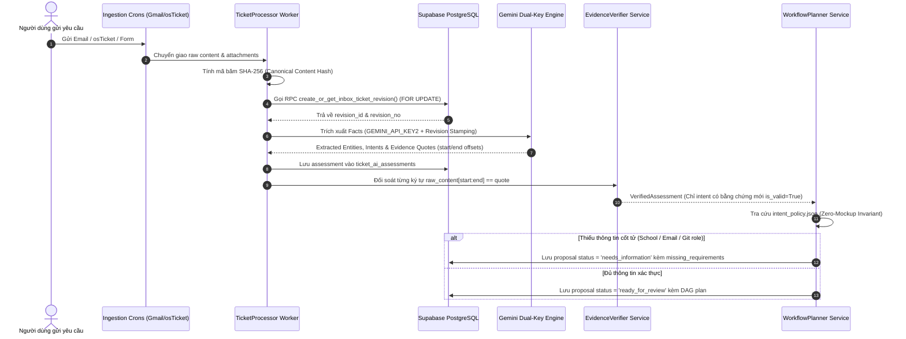
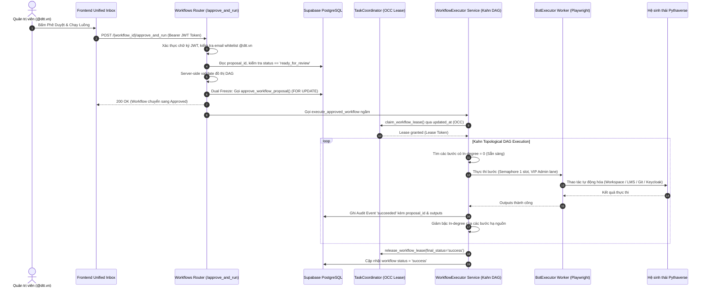
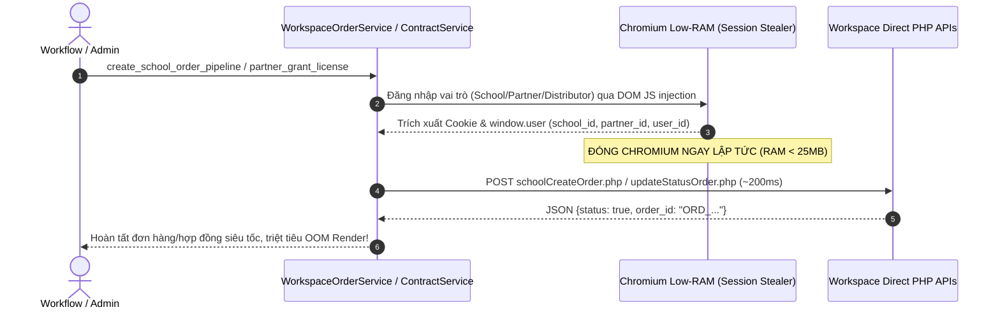

# 🚀 BÁCH KHOA TOÀN THƯ KIẾN TRÚC HỆ THỐNG PTV-TASKS-ADMINISTRATOR
## Pythaverse Central Admin & Automation Hub (Enterprise Single Source of Truth)

> **Tài liệu kiến trúc chuẩn mực:** Bản tài liệu này được biên soạn độc quyền và toàn diện để hệ thống hóa 100% mã nguồn, kiến trúc đa nền tảng, cơ chế an toàn bất biến, các dịch vụ tự động hóa, 21 bảng CSDL Supabase, toàn bộ 45+ module Backend FastAPI và 13 trang chức năng Frontend SPA của dự án **`ptv-tasks-administrator`**.  
> **Cam kết thiết kế:** Bất kỳ AI Coder hay kỹ sư hệ thống mới nào chỉ cần đọc duy nhất tệp tin này là thấu suốt toàn bộ dự án, hiểu rõ vai trò của từng tệp tin, cách thức hoạt động của từng hàm, cấu trúc tham số đầu vào/đầu ra, luồng dữ liệu liên thông và các ràng buộc an toàn tuyệt đối mà không cần phải mở xem từng file đơn lẻ trong dự án.

---

## 📌 THÔNG TIN BẢN QUYỀN & TÁC GIẢ SÁNG LẬP

- **Dự án:** `ptv-tasks-administrator` (Pythaverse Central Admin & Automation Hub)
- **Tác giả & Kiến trúc sư trưởng:** **Nguyễn Mạnh Hùng** (*Lead AI Engineer & Automation Architect – DTT Corporation / Pythaverse Ecosystem*)
- **GitHub:** [`https://github.com/hungnm-1225`](https://github.com/hungnm-1225)
- **Email:** `hungnm@dtt.vn` / `hung.nguyenmanh@dtt.vn`
- **Hệ sinh thái:** [Pythaverse Space](https://pythaverse.space)
- **Phiên bản tài liệu:** `v3.6.0 Master Enterprise Comprehensive Edition` (Cập nhật ngày 16 tháng 09 năm 2026)

---

## 📑 MỤC LỤC TỔNG QUAN

1. [PHẦN I: TẦM NHÌN HỆ THỐNG & SÁU NGUYÊN TẮC BẤT BIẾN (SAFETY INVARIANTS)](#-phần-i-tầm-nhìn-hệ-thống--sáu-nguyên-tắc-bất-biến-safety-invariants)
2. [PHẦN II: 7 PHÂN HỆ NGHIỆP VỤ PYTHAVERSE (DOMAIN TRUTH)](#-phần-ii-7-phân-hệ-nghiệp-vụ-pythaverse-domain-truth)
3. [PHẦN III: STACK CÔNG NGHỆ, HẠ TẦNG ĐA NỀN TẢNG & THÔNG SỐ VẬN HÀNH](#-phần-iii-stack-công-nghệ-hạ-tầng-đa-nền-tảng--thông-số-vận-hành)
4. [PHẦN IV: SƠ ĐỒ CẤU TRÚC THƯ MỤC MONOREPO TỔNG THỂ & VAI TRÒ TỪNG TỆP TIN](#-phần-iv-sơ-đồ-cấu-trúc-thư-mục-monorepo-tổng-thể--vai-trò-từng-tệp-tin)
5. [PHẦN V: GIẢI PHẪU CHI TIẾT TỪNG FILE, CLASS & HÀM XỬ LÝ BACKEND (FASTAPI 0.115)](#-phần-v-giải-phẫu-chi-tiết-từng-file-class--hàm-xử-lý-backend-fastapi-0115)
   - [5.1. Entrypoint, Lifespan & 6 Crons Lệch Pha (`app/main.py`)](#51-entrypoint-lifespan--6-crons-lệch-pha-appmainpy)
   - [5.2. Lõi Hệ Thống Core (`app/core/`) – Dual-Key AI, OCC Lease & Lock Concurrency](#52-lõi-hệ-thống-core-appcore)
   - [5.3. Định Nghĩa Schemas & Models Pydantic (`app/models/`)](#53-định-nghĩa-schemas--models-pydantic-appmodels)
   - [5.4. Tri Thức Nghiệp Vụ & Policy Registry (`app/brain/`)](#54-tri-thức-nghiệp-vụ--policy-registry-appbrain)
   - [5.5. Cổng Giao Tiếp 10 Router REST API Endpoints (`app/api/v1/endpoints/`)](#55-cổng-giao-tiếp-10-router-rest-api-endpoints-appapiv1endpoints)
   - [5.6. Dịch Vụ Nghiệp Vụ & RPA Services (`app/services/`)](#56-dịch-vụ-nghiệp-vụ--rpa-services-appservices)
     - [5.6.1. Dịch Vụ Phân Tách Email Thread (`email_thread_service.py`)](#561-dịch-vụ-phân-tách-email-thread-email_thread_servicepy)
     - [5.6.2. Thẩm Định Bằng Chứng & Chuẩn Hóa Fact (`evidence_verifier.py` & `request_fact_normalizer.py`)](#562-thẩm-định-bằng-chứng--chuẩn-hóa-fact-evidence_verifierpy--request_fact_normalizerpy)
     - [5.6.3. Bộ Lập Kế Hoạch & Thực Thi DAG (`workflow_planner.py` & `workflow_executor.py`)](#563-bộ-lập-kế-hoạch--thực-thi-dag-workflow_plannerpy--workflow_executorpy)
     - [5.6.4. Gói Xử Lý Bảng Tính Chuyên Biệt (`app/services/excel/` & `cof_excel_service.py`)](#564-gói-xử-lý-bảng-tính-chuyên-biệt-appservicesexcel--cof_excel_servicepy)
     - [5.6.5. Gói RPA Modularized School Workspace (`app/services/workspace/`)](#565-gói-rpa-modularized-school-workspace-appservicesworkspace)
     - [5.6.6. Phả Hệ Trường Học & Két Sắt Fernet (`workspace_lineage_service.py`)](#566-phả-hệ-trường-học--két-sắt-fernet-workspacelineage_servicepy)
     - [5.6.7. Cỗ Máy Hybrid Moodle PLearn V3.6 (`playwright_service.py`)](#567-cỗ-máy-hybrid-moodle-plearn-v36-playwright_servicepy)
     - [5.6.8. Pythaverse Git Fast Engine Hybrid V3.6 (`git_service.py`)](#568-pythaverse-git-fast-engine-hybrid-v36-gitservicepy)
     - [5.6.9. Keycloak 2-Tier Hybrid (`keycloak_service.py`)](#569-keycloak-2-tier-hybrid-keycloak_servicepy)
     - [5.6.10. Các Dịch Vụ Phân Hệ Ngoài (osTicket, Site Monitor, Google Workspace, GitHub)](#5610-các-dịch-vụ-phân-hệ-ngoài-osticket-site-monitor-google-workspace-github)
   - [5.7. Bộ Điều Phối Workers Chạy Ngầm (`app/workers/`)](#57-bộ-điều-phối-workers-chạy-ngầm-appworkers)
   - [5.8. Kịch Bản Bổ Trợ CLI & Scripts Kiểm Thử Master (`backend/scripts/` & `backend/*.py`)](#58-kịch-bản-bổ-trợ-cli--scripts-kiểm-thử-master-backendscripts--backendpy)
   - [5.9. Bộ Kiểm Thử An Toàn Hermetic Pytest Suite (`backend/tests/`)](#59-bộ-kiểm-thử-an-toàn-hermetic-pytest-suite-backendtests)
6. [PHẦN VI: GIẢI PHẪU CHI TIẾT GIAO DIỆN FRONTEND SPA (REACT 19 + VITE 6 + TAILWIND CSS V4)](#-phần-vi-giải-phẫu-chi-tiết-giao-diện-frontend-spa-react-19--vite-6--tailwind-css-v4)
   - [6.1. Kiến Trúc Lõi Frontend SPA, Lazy Chunks & Client Cache Purge](#61-kiến-trúc-lõi-frontend-spa-lazy-chunks--client-cache-purge)
   - [6.2. Design System Tokens: Bento Grid & Enterprise Pastel OKLCH (`index.css`)](#62-design-system-tokens-bento-grid--enterprise-pastel-oklch-indexcss)
   - [6.3. Lớp Giao Tiếp Mạng, Kiểu Dữ Liệu & Bảo Mật JWT (`src/lib/`, `src/types/`, `src/context/`)](#63-lớp-giao-tiếp-mạng-kiểu-dữ-liệu--bảo-mật-jwt-srclib-srctypes-srccontext)
   - [6.4. Giải Phẫu Chi Tiết 13 Trang Chức Năng & Sub-Components (`src/features/`)](#64-giải-phẫu-chi-tiết-13-trang-chức-năng--sub-components-srcfeatures)
7. [PHẦN VII: CƠ SỞ DỮ LIỆU SUPABASE POSTGRESQL 16 (21 BẢNG & PROVENANCE HẠ TẦNG)](#-phần-vii-cơ-sở-dữ-liệu-supabase-postgresql-16-21-bảng--provenance-hạ-tầng)
8. [PHẦN VIII: SƠ ĐỒ LUỒNG DỮ LIỆU END-TO-END (MERMAID SEQUENCE & STATE MACHINES)](#-phần-viii-sơ-đồ-luồng-dữ-liệu-end-to-end-mermaid-sequence--state-machines)
9. [PHẦN IX: TỪ ĐIỂN CHỈ MỤC HÀM TOÀN DIỆN (FUNCTION-TO-FILE MASTER INDEX)](#-phần-ix-từ-điển-chỉ-mục-hàm-toàn-diện-function-to-file-master-index)
10. [PHẦN X: CẨM NANG KHẮC PHỤC SỰ CỐ & FAQ DÀNH CHO AI CODER](#-phần-x-cẩm-nang-khắc-phục-sự-cố--faq-dành-cho-ai-coder)
11. [PHẦN XI: CẨM NANG ĐỊNH TUYẾN CHUYÊN GIA AI (INTELLIGENT AGENT ROUTING PLAYBOOK)](#-phần-xi-cẩm-nang-định-tuyến-chuyên-gia-ai-intelligent-agent-routing-playbook)
12. [PHẦN XII: HƯỚNG DẪN KHỞI CHẠY, CẤU HÌNH BIẾN MÔI TRƯỜNG & KIỂM THỬ TỰ ĐỘNG](#-phần-xii-hướng-dẫn-khởi-chạy-cấu-hình-biến-môi-trường--kiểm-thử-tự-động)

---

## 🏛️ PHẦN I: TẦM NHÌN HỆ THỐNG & SÁU NGUYÊN TẮC BẤT BIẾN (SAFETY INVARIANTS)

`ptv-tasks-administrator` được định vị là **Trung tâm Thần kinh Điều phối & Tự Động Hóa Tập Trung (Pythaverse Central Admin & Automation Hub)** cho toàn bộ tập đoàn DTT Corporation và hệ sinh thái giáo dục công nghệ Pythaverse. Hệ thống tiếp nhận yêu cầu từ đa kênh (Gmail, Google Forms, osTicket), sử dụng AI nhận thức kép có bằng chứng để lập kế hoạch công việc dạng đồ thị có hướng không chu trình (DAG), trình qua Quản trị viên duyệt (Human-in-the-Loop) và tự động thực thi xuống 7 phân hệ qua mạng lưới bot RPA và Direct REST APIs.

```
                  ┌────────────────────────────────────────────────────────┐
                  │                 ĐẦU VÀO ĐA KÊNH (INGESTION)             │
                  │   [Gmail Workspace]  [Google Forms]  [OS Ticket SCP]   │
                  └───────────────────────────┬────────────────────────────┘
                                              │ Ingestion Crons (Lệch pha: +15s, +90s, +420s)
                                              ▼
┌──────────────────────────────────────────────────────────────────────────────────────────┐
│                      LÕI TRUNG TÂM PTV-TASKS-ADMINISTRATOR (BACKEND FASTAPI)             │
│                                                                                          │
│  ┌─────────────────────────┐   ┌───────────────────────────┐   ┌──────────────────────┐  │
│  │ Dual-Path Cognition AI  │   │ EvidenceVerifier Service  │   │  Human-in-the-Loop   │  │
│  │ • Summary (Key 1)       │──▶│ • raw_content[start:end]  │──▶│  Safety Gate         │  │
│  │ • Facts (Key 2)         │   │ • Substring Calibration   │   │  JWT Authenticated   │  │
│  │ • Fast-Path Fallback    │   │ • Attachment Fail-Closed  │   │  (@dtt.vn Whitelist) │  │
│  └─────────────────────────┘   └─────────────┬─────────────┘   └──────────────────────┘  │
│                                              │ Verified Facts                            │
│                                              ▼                                           │
│                                ┌───────────────────────────┐                             │
│                                │  Registry Policy Engine   │                             │
│                                │  • intent_policy.json     │                             │
│                                │  • Zero-Mockup Invariant  │                             │
│                                │  • Dual-Freeze Proposal   │                             │
│                                └─────────────┬─────────────┘                             │
│                                              │ Phê duyệt (Approved)                      │
│                                              ▼                                           │
│  ┌────────────────────────────────────────────────────────────────────────────────────┐  │
│  │                 TOPOLOGICAL DAG EXECUTOR & BOT WORKERS (KAHN ALGORITHM)            │  │
│  │  • OCC Workflow Lease Claiming via updated_at (Chống Race-Condition tuyệt đối)     │  │
│  │  • Khối try...finally cam kết 100% thu hồi Lease và tài nguyên Semaphore            │  │
│  │  • Append-Only Audit Trail (workflow_execution_events gắn proposal_id bất biến)    │  │
│  │  • BFS Graph Traversal: Reset thông minh toàn bộ downstream dependencies khi retry │  │
│  └────────────────────────────────────────────────────────────────────────────────────┘  │
│                                              │                                           │
│  ┌────────────────────────────────────────────────────────────────────────────────────┐  │
│  │                    MA TRẬN 8 BỘ NHỚ ĐỆM IN-MEMORY RAM (1MS SPEED)                  │  │
│  │    Courses (10m) | Workspace (15m) | Board (5m) | Bots (15s) | Tasks (60s)         │  │
│  │    Tickets (60s) | Monitor (30s)   | Reports (60s)                                 │  │
│  └────────────────────────────────────────────────────────────────────────────────────┘  │
└──────────────────────────────────────────────┬───────────────────────────────────────────┘
                                               │ Thực thi tự động
                                               ▼
                  ┌────────────────────────────────────────────────────────┐
                  │               HỆ SINH THÁI ĐÍCH (EXECUTION TARGETS)    │
                  │ School Workspace | PLearn LMS | Keycloak | Pythaverse Git | GitHub │
                  └───────────────────────────┴────────────────────────────┘
```

### Sáu Nguyên Tắc Thiết Kế Bất Biến (Absolute Safety Invariants):

1. **Evidence-Based & Offset Verification Invariant (Không Bằng Chứng ➔ Không Action):**
   - Mọi ý định vận hành trích xuất bắt buộc phải có đoạn trích dẫn nguyên văn (`quote`) kèm định vị ký tự (`start_offset`, `end_offset`) và mã revision `source_revision_id`.
   - `EvidenceVerifierService` đối soát từng ký tự: $\text{raw\_content}[\text{start}:\text{end}] == \text{quote}$.
   - Nếu trích dẫn bị xê dịch vị trí do định dạng khoảng trắng hoặc ngắt dòng, hệ thống áp dụng thuật toán **Substring Calibration** trong phạm vi 160 ký tự. Nếu quote hoàn toàn không tồn tại hoặc sai lệch revision, intent đó bị gạch bỏ và outcome hạ xuống `needs_information`.
2. **Attachment Evidence Fail-Closed Invariant (File đính kèm chưa đối soát ➔ Không Action):**
   - Các trích dẫn có `source_kind == "attachment_extract"` tạm thời bị gắn cờ `is_verified = False` (chuyển sang `needs_information`).
   - Nghiêm cấm tuyệt đối việc dùng text thân email để đối soát trích dẫn từ file đính kèm khi chưa qua hạ tầng bóc tách bất biến.
3. **Zero-Mockup Invariant (Cấm Tuyệt Đối Dữ Liệu Bịa Đặt / Fallback Giả Định):**
   - Nghiêm cấm sử dụng bất kỳ giá trị mặc định giả lập nào (`SWRP 4-12`, count=4, mật khẩu `Ptv@2026`).
   - **Đặc biệt: Khai tử hoàn toàn default Git role `GUEST` và default LMS role `student` khi thiếu ngữ cảnh**. Yêu cầu cấp quyền Git không nêu rõ vai trò bắt buộc sinh `missing_requirement: git_role`, yêu cầu ghi danh LMS không rõ vai trò không tự gán `student`, lập tức chuyển trạng thái sang `needs_information` và chặn phê duyệt thực thi.
4. **Dual-Freeze Proposal & Immutable Provenance Linkage:**
   - Khi Admin phê duyệt, hệ thống đóng băng đồng thời cả `workflow_proposals.frozen_plan` và `automation_workflows.steps` qua Stored Procedure nguyên tử `approve_workflow_proposal`.
   - Toàn bộ execution events trong `workflow_execution_events` bắt buộc phải mang theo `proposal_id`. Tuyệt đối không cho phép chỉnh sửa workflow hay proposal sau khi đã ở trạng thái `approved`.
5. **Real JWT Identity Enforcement (Chống Mạo Danh Người Phê Duyệt):**
   - Bỏ qua trường `approved_by` do Frontend gửi lên trong payload body.
   - Danh tính người duyệt được giải mã trực tiếp từ Bearer JWT Token qua dependency `get_current_user_email` và bắt buộc thuộc whitelist domain `@dtt.vn`.
6. **Optimistic Concurrency Control (OCC) Lease & Concurrency Safeguard (Render 512MB RAM):**
   - Chiếm Lease độc quyền cấp Workflow qua `TaskCoordinator.claim_workflow_lease()` sử dụng kiểm soát đồng thời lạc quan (OCC) trên trường `updated_at`. Hàm `update_workflow_heartbeat()` ném `RuntimeError` dừng khẩn cấp worker nếu bị cướp lease.
   - Khóa cứng `GLOBAL_PLAYWRIGHT_SEMAPHORE = asyncio.Semaphore(1)` kết hợp ContextVar `_PLAYWRIGHT_SLOT_HOLDER` chống deadlock re-entrancy khi hàm cha con cùng gọi acquire slot.
   - Mọi coroutine chạy Playwright hoặc quét ngầm bắt buộc gọi `gc.collect()` và `force_kill_zombie_chromium()` trong khối `finally`.
   - 6 Crons trong `main.py` xuất phát lệch pha (15s, 90s, 180s, 420s, 1200s, 2400s) để ngăn tràn RAM.

---

## 🌐 PHẦN II: 7 PHÂN HỆ NGHIỆP VỤ PYTHAVERSE (DOMAIN TRUTH)

| STT | Phân Hệ | Tên Miền / Giao Thức | Core Platform | Vai Trò Kỹ Thuật & Nghiệp Vụ Cốt Lõi | Phương Thức Tự Động Hóa |
|---|---|---|---|---|---|
| **1** | **School Workspace** | `https://pythaverse.space` | React MUI / PHP WordPress REST APIs | Quản trị phân cấp 3 tầng (`Distributor` ➔ `Partner` ➔ `School`). Cấp phát License Pool, bù Contract, nộp batch tài khoản số lượng lớn qua Bulk Account Creation. | **Fast Engine Hybrid V3.6:** Playwright bốc Session & WP Identity trong 3s ➔ Gọi Direct PHP API (`schoolCreateOrder.php`, `updateStatusOrder.php`, `createOrderSale.php`, `updateStatusPartnerOrder.php`, `createOrder.php`, `/wp-json/...`). Bơm DOM JS bảo toàn ký tự đặc biệt. |
| **2** | **PLearn LMS** | `https://learn.pythaverse.space` | Moodle LMS (PHP / MariaDB / Edwiser RemUI) | Cổng đào tạo Moodle LMS. Quản lý danh mục khóa học (`SWRP`, `IR`, `ASP`...) và ghi danh tài khoản theo Vai trò (`Student` - 9, `Teacher` - 7, `Manager` - 1). | **Cỗ máy Hybrid V3.6:** Playwright SSO Keycloak (3s) trích xuất Cookie & `sesskey` ➔ Gọi Direct HTTPX WebService (`enrol_manual_enrol_users`, `core_group_create_groups`). Tự động normalize username qua Keycloak. Fallback 2 nhịp trên `td.cell.c2`. |
| **3** | **PGit Repos** | `https://git.pythaverse.space` | GitBucket Server (Scala / JVM / SQLite) | Máy chủ lưu trữ mã nguồn dự án học sinh & giáo viên. Quản lý Collaborators tại `/settings/collaborators`. Yêu cầu tài khoản đăng nhập SSO Keycloak ít nhất 1 lần để kích hoạt cơ chế JIT (Just-In-Time). | **Git Fast Engine Hybrid V3.6:** Sàng lọc người dùng qua Keycloak Gateway, bốc Session OIDC 1 lần (3s) ➔ Check JIT tồn tại qua `/_user/existence` (20ms) ➔ Bắn 1 request POST lưu collaborators (200ms). Hỗ trợ cả thêm/gán role (`add`) lẫn gỡ bỏ (`remove`). |
| **4** | **Keycloak Auth IDP** | `https://eid.pythaverse.space` | Keycloak (Java / WildFly / PostgreSQL) | Cổng xác thực định danh tập trung OpenID Connect / OAuth2 (Realm: `master` / `idp`). Reset mật khẩu, kích hoạt/khóa tài khoản và tra cứu email chính thức. | **2-Tier Hybrid:** Direct REST API (300ms qua `python-keycloak` & HTTPX Async) ➔ Playwright RPA Fallback (`keycloak_service.py`). |
| **5** | **Leanbot IDE** | `https://ide.pythaverse.space` | Blockly / Web Bluetooth BLE | Web IDE lập trình khối kéo thả Blockly kết nối Robot Leanbot qua Bluetooth BLE. | Synthetic Monitoring Uptime & Latency (`site_monitor_service.py`). |
| **6** | **Support Helpdesk** | `https://support.pythaverse.space` | osTicket (PHP / MySQL) | Hệ thống tiếp nhận sự cố kỹ thuật osTicket. Cào dữ liệu định kỳ qua Playwright Headless session và chuyển giao cho Canonical Intake. | Playwright headless scraper cào vé, custom form fields & files đính kèm (`osticket_service.py`). |
| **7** | **PContest** | `https://contest.pythaverse.space` | Next.js / Python Judge | Hệ thống tổ chức thi đấu lập trình trực tuyến, quản lý Leaderboard và chấm điểm tự động. | Synthetic Monitoring Uptime & Latency (`site_monitor_service.py`). |

---

## 🛠️ PHẦN III: STACK CÔNG NGHỆ, HẠ TẦNG ĐA NỀN TẢNG & THÔNG SỐ VẬN HÀNH

### 1. Thế Trận Hạ Tầng Đa Nền Tảng (Multi-Platform Topology)
- **Vercel**: Máy chủ Edge CDN lưu trữ ứng dụng Frontend React 19 SPA. Tích hợp tệp [`frontend/vercel.json`](file:///c:/Users/dtt/Desktop/Project/ptv-tasks-administrator/frontend/vercel.json) để cấu hình rewrite client-side routing (`/* -> /index.html`). Đóng gói siêu tốc với Dynamic Chunk Splitting qua Vite 6.
- **Render.com**: Máy chủ khởi chạy Backend FastAPI trên môi trường tài nguyên nghiêm ngặt (**512MB RAM Free/Starter Tier**). Cấu hình qua [`render.yaml`](file:///c:/Users/dtt/Desktop/Project/ptv-tasks-administrator/render.yaml) và [`backend/Dockerfile`](file:///c:/Users/dtt/Desktop/Project/ptv-tasks-administrator/backend/Dockerfile). Khóa cứng Semaphore 1 slot, thu hồi bộ nhớ `gc.collect()` và tiêu diệt Chromium zombie.
- **Supabase**: Cơ sở dữ liệu PostgreSQL 16 (21 bảng chuyên biệt, RLS `@dtt.vn`, Storage Bucket `ticket-attachments`, Két sắt mã hóa Fernet, và 2 PostgreSQL Stored Procedures nguyên tử: `create_or_get_inbox_ticket_revision` và `approve_workflow_proposal`).
- **Google Cloud Console**: Quản trị tài khoản dịch vụ (Service Account) tích hợp bộ ba Gmail Workspace API, Google Sheets API, Google Docs API và Google Drive API.
- **UptimeRobot**: Giám sát ngoại vi Synthetic Ping Uptime (chu kỳ 5 phút) kiêm nhiệm vụ giữ ấm (keep-warm ping) cho Render chống ngủ đông.
- **GitHub**: Quản lý mã nguồn Monorepo, GitHub Actions CI/CD và Dispatcher Issue tự động vào Private Repositories qua Personal Access Token (`GITHUB_PAT`).

### 2. Chi Tiết Backend Stack
- **Ngôn ngữ & Runtime:** Python `3.11.x` / `3.12.x`
- **Web Framework:** FastAPI `0.115.8` (Asynchronous ASGI)
- **Validation Engine:** Pydantic `2.10.6` (Strict Schema Validation & Settings Management qua `pydantic-settings: 2.7.1`)
- **RPA Engine:** Playwright Async Chromium (`playwright: 1.50.0`)
- **Lập lịch chạy ngầm:** APScheduler `3.10.4` (`AsyncIOScheduler`) với 6 Crons so le lệch pha (+15s, +90s, +180s, +420s, +1200s, +2400s).
- **In-Memory Caching:** Ma trận 8 In-Memory RAM Caches (`BoundedMemoryCache` phân tầng LRU + TTL, phản hồi 1ms, RAM <= 40MB).
- **Trí tuệ nhân tạo (AI):** `google-generativeai: 0.8.4` & `google-genai: 1.2.0` tích hợp Dual-Key Engine (`GEMINI_API_KEY` & `GEMINI_API_KEY2`), Cross-Key Failover, chuỗi 10 models fallback (`gemini-3.8-flash` ➔ `gemini-3.7-flash` ➔ `gemini-3.5-flash-lite`...), kết hợp bộ **Deterministic Fast-Path Triage v1.2.0**.
- **Mã Hóa & Bảo Mật:** `cryptography` (Fernet 32-byte symmetric encryption), `PyJWT: 2.10.1` (giải mã Supabase Bearer JWT), `python-keycloak: 5.1.0`.
- **Xử Lý Bảng Tính:** `openpyxl >= 3.1.2`.
- **Mạng Bất Đồng Bộ:** `httpx: 0.28.1`, `requests: 2.32.3`, `nest-asyncio >= 1.6.0`.
- **Kiểm Thử Hồi Quy:** `pytest: 8.3.4` / `anyio` (Hermetic in-memory test suite, 23/23 tests pass 100% in ~2s).

### 3. Chi Tiết Frontend Stack
- **Node.js**: `20.x LTS` / `22.x LTS`
- **React**: `19.0.0` (React 19 Functional Hooks, Concurrent Rendering, Suspense Code Splitting)
- **Build Tool:** Vite `6.2.0`
- **TypeScript**: `5.7.2` (`strict: true`, Strict Type Checking)
- **Tailwind CSS**: `4.0.0` (Kiến trúc Design Tokens hiện đại `@import "tailwindcss";` kết hợp Enterprise Pastel OKLCH qua `@theme inline`)
- **Router:** `react-router-dom: 7.18.2`
- **Animations:** `motion: 13.1.1` (Framer Motion v13)
- **Biểu đồ:** `recharts: 2.15.0`
- **Lucide React**: `0.475.0` (Icon Library đồng nhất)
- **SheetJS (`xlsx`)**: `0.18.5` (Xử lý bóc tách & hiển thị bảng tính Excel tương tác client-side)
- **Supabase JS Client**: `@supabase/supabase-js: 2.48.0` (Auth & Realtime Client)
- **Sonner**: `2.0.8` (Toast Notification thích ứng Theme)
- **Styling Bổ Trợ:** `styled-components: 6.5.3`, `clsx: 2.1.1`, `tailwind-merge: 3.0.1`

---

## 📁 PHẦN IV: SƠ ĐỒ CẤU TRÚC THƯ MỤC MONOREPO TỔNG THỂ & VAI TRÒ TỪNG TỆP TIN

```
ptv-tasks-administrator/
├── render.yaml                                 # Cấu hình triển khai Docker Web Service trên Render.com
├── package.json                                # Cấu hình dependencies root monorepo
├── package-lock.json                           # Khóa phiên bản dependencies root
├── skills-lock.json                            # Khóa cấu hình plugin & agent skills
├── GEMINI.md                                   # System Instructions & Quy chuẩn tác nghiệp của AI Assistant (v3.6.0)
├── Blueprint.md                                # Master Blueprint Đặc Tả Kỹ Thuật Tổng Thể v2.0.0
├── design.md                                   # Đặc tả UI/UX Design System Enterprise Pastel OKLCH
├── README.md                                   # Bách khoa toàn thư kiến trúc hệ thống (Single Source of Truth)
├── backend/                                    # Ứng dụng Backend FastAPI (Python 3.11/3.12)
│   ├── app/
│   │   ├── api/                                # REST API Routers
│   │   │   └── v1/
│   │   │       ├── router.py                   # Aggregator router gom 10 endpoints
│   │   │       └── endpoints/                  # 10 Router chuyên biệt
│   │   │           ├── workflows.py            # Safety Gate, Dual Freeze, DAG Execution, Depends(JWT)
│   │   │           ├── tickets.py              # Canonical Intake, Re-summarize, Re-assess Intent
│   │   │           ├── tasks.py                # Bot Task Queue, run_approved_task_worker, Payload Edit
│   │   │           ├── bots.py                 # Bot Status, Realtime Logs GMT+7 với Taxonomy Filter
│   │   │           ├── board.py                # Multi-board Kanban (Boards, Columns, Cards, DND)
│   │   │           ├── courses.py              # Dual Catalogs (Workspace & LMS), Git Repo Links
│   │   │           ├── workspace.py            # Phả hệ 480 trường, Scanner Cache, Bóc tách COF
│   │   │           ├── monitor.py              # Synthetic Ping 10 Sites, Auth Matrix, Downtime Logs
│   │   │           ├── github.py               # AI Bug Triage ➔ GitHub Issue Dispatcher
│   │   │           └── reports.py              # KPI Summary, Category Ratios, Daily Trends, Export
│   │   ├── brain/                              # Tri thức nghiệp vụ & Policy Registry
│   │   │   ├── capabilities.json               # 19 Capabilities hệ thống (Schemas, Handlers, Risk)
│   │   │   ├── intent_policy.json              # Bảng chính sách tất định (v1.2.0)
│   │   │   ├── dependency_rules.json           # Quy tắc sắp xếp Tô-pô & DAG dependencies
│   │   │   ├── workflow_rules.json             # Archetypes luồng công việc mẫu
│   │   │   ├── knowledge_base.json             # Tri thức kỹ thuật của 7 phân hệ Pythaverse
│   │   │   └── prompts/                        # Versioned Prompts
│   │   │       ├── ticket_summary_v1.txt       # Prompt Soft Summary cho Inbox (Key 1)
│   │   │       └── intent_extraction_v1.txt    # Prompt Operational Fact Extraction có Offset (Key 2)
│   │   ├── core/                               # Lõi hệ thống & Quản trị tài nguyên
│   │   │   ├── config.py                       # Settings 25+ envs, Pydantic BaseSettings, Time utilities GMT+7
│   │   │   ├── cache_policy.py                 # BoundedMemoryCache (3 Tiers, LRU, TTL, RAM <= 40MB)
│   │   │   ├── playwright_manager.py           # Semaphore 1 Slot, Re-entrancy Lock, Zombie Killer
│   │   │   ├── security.py                     # Whitelist Domain @dtt.vn, Bearer JWT Auth Dependency
│   │   │   ├── supabase.py                     # Singleton client Supabase (get_supabase_client)
│   │   │   ├── task_coordinator.py             # OCC Workflow Lease Claiming via updated_at, Heartbeat
│   │   │   └── gemini.py                       # Dual-Key AI, Cross-Key Failover, Fast-Path Triage
│   │   ├── models/                             # Schemas Pydantic Strict Validation
│   │   │   ├── intent.py                       # EvidenceSpan (offsets), ExtractedEntity, TypedEntities
│   │   │   ├── workflow.py                     # WorkflowStepDraft (is_manual), WorkflowApprovalRequest
│   │   │   ├── ticket.py                       # InboxTicket schemas
│   │   │   ├── task.py                         # BotAutomationTask schemas
│   │   │   └── template.py                     # TemplateConfig schemas
│   │   ├── services/                           # Dịch vụ nghiệp vụ & RPA
│   │   │   ├── email_thread_service.py         # Tách email thread, khử quoted reply, nhận diện DTT vs User
│   │   │   ├── evidence_verifier.py            # Deterministic Verifier, Substring Calibration
│   │   │   ├── request_fact_normalizer.py      # Bổ sung sự thật xác thực từ văn bản gốc (Regex patterns)
│   │   │   ├── workflow_planner.py             # Policy Engine v1.2.0, Course/Git DB Resolve, Auto Git Sync
│   │   │   ├── workflow_executor.py            # Topological Kahn DAG, Frozen Plan SOT, BFS Retry
│   │   │   ├── cof_excel_service.py            # Facade Proxy chuyển tiếp sang app.services.excel
│   │   │   ├── excel/                          # Gói chuyên biệt bóc tách & tạo file Excel (4 services)
│   │   │   │   ├── __init__.py                 # Export COFService, BulkTemplateService, GenericExcelService, TOFExcelService
│   │   │   │   ├── cof_service.py              # Bóc tách file COF 3 Tabs & Dán ngược kết quả vào COF gốc
│   │   │   │   ├── bulk_template_service.py    # Phôi chuẩn hóa tài khoản trường học & xử lý text trần
│   │   │   │   ├── generic_excel_service.py    # Bóc tách mọi file Excel tự do (Links, Emails, Repos)
│   │   │   │   └── tof_service.py              # Khung bóc tách file TOF (Training Order Form)
│   │   │   ├── workspace_lineage_service.py    # Phân giải phả hệ 3 cấp & giải mã két sắt Fernet
│   │   │   ├── workspace_playwright_service.py # Singleton facade kết nối workspace orchestrator
│   │   │   ├── workspace/                      # Gói RPA Workspace modularized 8 modules
│   │   │   │   ├── __init__.py                 # Export trọn bộ 8 services
│   │   │   │   ├── base.py                     # Low-RAM Chromium Setup, JS DOM Injection Login
│   │   │   │   ├── account_service.py          # Bulk Account Creation & Batch Polling
│   │   │   │   ├── order_service.py            # Fast Engine Hybrid V3.6: School Order Creation & Partner License Grant
│   │   │   │   ├── contract_service.py         # Fast Engine Hybrid V3.6: Partner Contract Request & Distributor/Admin Approval
│   │   │   │   ├── enroll_service.py           # License Allocation to Students
│   │   │   │   ├── workspace_scanner_service.py# Direct API Scanner + Playwright Cache Sync
│   │   │   │   └── orchestrator_service.py     # E2E Pipeline Coordinator
│   │   │   ├── playwright_service.py           # Hybrid Moodle PLearn V3.6 (SSO Playwright + HTTPX Async)
│   │   │   ├── git_service.py                  # Pythaverse Git Fast Engine Hybrid V3.6 (Keycloak Gateway + Existence 20ms)
│   │   │   ├── keycloak_service.py             # 2-Tier Hybrid Keycloak (REST API 300ms + RPA Fallback)
│   │   │   ├── osticket_service.py             # osTicket Playwright Scraper
│   │   │   ├── site_monitor_service.py         # Synthetic Monitor Uptime & Latency cho 10 Sites
│   │   │   ├── gmail_service.py                # Google Workspace Gmail Polling via OAuth2
│   │   │   ├── google_sheet_service.py         # Google Sheets Form Feedback Polling
│   │   │   ├── google_doc_service.py           # Google Docs Feedback Comments Reader
│   │   │   ├── google_drive_service.py         # Google Drive Downloader & Explorer
│   │   │   └── github_service.py               # GitHub REST API Issue Creator
│   │   ├── workers/                            # Bộ điều phối thực thi chạy ngầm
│   │   │   ├── bot_executor.py                 # Central Worker Router thực thi 19 Capabilities
│   │   │   └── ticket_processor.py             # Atomic Revision RPC, Canonical Hash, Provenance Pipeline
│   │   └── main.py                             # Lifespan 6 Crons so le, Polling với Proposal ID audit
│   ├── data/                                   # Thư mục dữ liệu I/O cục bộ của Backend
│   │   ├── cof_input/                          # Chứa file COF người dùng upload phục vụ bóc tách
│   │   ├── cof_output/                         # Chứa file COF dán ngược mã tài khoản thành công
│   │   ├── results_download/                   # Lưu trữ file Excel kết quả tải về từ cỗ máy RPA
│   │   └── temp_import/                        # Thư mục tạm thời phục vụ nhập danh mục Excel
│   ├── scripts/                                # Scripts bổ trợ CLI & Quản trị dữ liệu
│   │   ├── import_hierarchy.py                 # Script nhập phả hệ 480 trường học vào CSDL
│   │   └── pythaverse_hierarchy_data.xlsx      # Bảng tính gốc chứa danh bạ phả hệ trường học
│   ├── re_triage_all_tickets.py                # Script chạy lại AI Triage hàng loạt cho Inbox
│   ├── seed_monitor_credentials.py             # Script khởi tạo tài khoản kiểm thử cho 10 Sites
│   ├── test_git_collaborator.py                # Script kiểm thử độc lập RPA GitBucket
│   ├── test_git_fast_engine.py                 # Master Test Suite Git Direct API Hybrid (3s stealer, 20ms existence, 200ms POST)
│   ├── test_lms_advanced_features.py           # Script kiểm thử tính năng nâng cao ghi danh Moodle
│   ├── test_lms_fast_engine.py                 # Script kiểm thử động cơ Hybrid Moodle siêu tốc
│   ├── test_workspace_fast_engine.py           # Master Test Suite Workspace Direct API Hybrid 6-stage E2E
│   ├── tests/                                  # Bộ Kiểm Thử Hermetic Pytest (In-memory, Zero AI Quota)
│   │   ├── conftest.py                         # Pytest Fixtures & In-memory setup
│   │   ├── test_capability_contracts.py        # Contract Test 19 capabilities vs bot_executor
│   │   ├── test_planning_policy.py             # Test Zero-Mockup, EvidenceVerifier, Injection, Offsets
│   │   ├── test_request_fact_normalizer.py     # Test bóc tách email, role, khóa học, intents nguyên văn
│   │   ├── test_execution_safety.py            # Test Kahn Topological sort, Masking, Data Binding
│   │   ├── test_security_and_provenance.py     # Test JWT whitelist @dtt.vn, Immutable Provenance
│   │   └── test_workflow_legacy_replan.py      # Test Re-plan tự động cho legacy workflow
│   ├── pytest.ini                              # Cấu hình Pytest asyncio
│   ├── requirements.txt                        # Thư viện Python Backend
│   ├── Dockerfile                              # Cấu hình Docker Linux cho Render.com
│   ├── .env.example                            # Phôi mẫu biến môi trường
│   └── .env                                    # Biến môi trường chạy cục bộ
├── frontend/                                   # Ứng dụng Frontend SPA (React 19 + Vite 6 + Tailwind CSS v4)
│   ├── src/
│   │   ├── components/                         # UI Components dùng chung
│   │   │   ├── common/                         # ConfirmDialog, ThemeToggle, Header, Sidebar, Loader
│   │   │   └── layout/                         # AppLayout (11 menu navigation, responsive drawer)
│   │   ├── config/                             # Cấu hình tác giả & branding (authorConfig.ts)
│   │   ├── context/                            # React Contexts
│   │   │   ├── AuthContext.tsx                 # Supabase Authentication State & JWT token
│   │   │   └── ThemeContext.tsx                # Dark / Light Mode Switcher
│   │   ├── features/                           # 13 Trang Chức Năng Chuyên Biệt
│   │   │   ├── inbox/                          # AI Workflow Console V3.1 (UnifiedInboxPage.tsx)
│   │   │   │   └── components/                 # WorkflowBuilder, WorkflowStepCard, WorkflowValidationPanel
│   │   │   ├── tasks/                          # TaskManagementPage.tsx (Bot Tasks Queue & Edit)
│   │   │   ├── board/                          # WorkBoardPage.tsx (Multi-board Kanban DND)
│   │   │   ├── studio/                         # AutomationStudioPage.tsx (RPA Multi-System Studio 4,121 lines)
│   │   │   ├── courses/                        # CoursesManagerPage.tsx (Dual Catalog & Git Sync)
│   │   │   ├── bots/                           # BotCommanderPage.tsx (Bot Monitoring & Live Terminal)
│   │   │   ├── monitor/                        # SiteMonitorPage.tsx (3-Tab Health & Uptime Monitor)
│   │   │   ├── github/                         # GithubReporterPage.tsx (AI Bug Triage ➔ Issue)
│   │   │   ├── reports/                        # ReportsExportPage.tsx (KPIs & Excel Export)
│   │   │   ├── dashboard/                      # DashboardPage.tsx (Operational Executive Overview)
│   │   │   ├── profile/                        # ProfileSettingsPage.tsx (User Settings & Vault Status)
│   │   │   ├── landing/                        # LandingPage.tsx (Welcome Portal)
│   │   │   └── auth/                           # LoginPage.tsx (Supabase OAuth & @dtt.vn Validation)
│   │   ├── lib/                                # Utilities & HTTP Clients
│   │   │   ├── api.ts                          # fetchApi tự động gắn Supabase Bearer JWT, timeout 30s
│   │   │   └── supabase.ts                     # Supabase Client Frontend
│   │   ├── types/                              # TypeScript Strict Interfaces (index.ts)
│   │   ├── App.tsx                             # SPA Router, Suspense Code Splitting, ProtectedRoute
│   │   ├── index.css                           # Tailwind CSS v4 Design Tokens & OKLCH Theme
│   │   └── main.tsx                            # React 19 Entrypoint (createRoot)
│   ├── package.json                            # Thư viện Frontend
│   ├── tsconfig.json                           # TypeScript Compiler Config
│   ├── vercel.json                             # Cấu hình rewrite SPA cho Vercel Edge CDN
│   └── vite.config.ts                          # Vite 6 Bundler Config & Dynamic Chunk Splitting
└── supabase/
    ├── migrations/                             # Lịch sử 5 Database Migrations
    │   ├── 20260812000000_initial_schema.sql
    │   ├── 20260910000000_add_automation_workflows.sql
    │   ├── 20260911000000_add_provenance_and_proposals.sql
    │   ├── 20260912000000_harden_workflow_provenance.sql
    │   └── 20260913000000_atomic_revisions_and_workflow_safety.sql
    ├── runbooks/                               # SQL Scripts Pre-flight & Post-flight kiểm định
    │   ├── 20260913_workflow_safety_preflight.sql
    │   └── 20260913_workflow_safety_postflight.sql
    └── schema.sql                              # Schema chuẩn mực 21 bảng CSDL, RLS, Indexes, Stored Procedures
```

---

## 🔬 PHẦN V: GIẢI PHẪU CHI TIẾT TỪNG FILE, CLASS & HÀM XỬ LÝ BACKEND (FASTAPI 0.115)

Phần này cung cấp giải phẫu sâu sắc về chức năng, lớp và từng hàm xử lý của toàn bộ các file Backend.

---

### 5.1. Entrypoint, Lifespan & 6 Crons Lệch Pha (`app/main.py`)

- **Tệp tin:** [`backend/app/main.py`](file:///c:/Users/dtt/Desktop/Project/ptv-tasks-administrator/backend/app/main.py)
- **Vai trò kiến trúc:** Điểm khởi nhập ASGI của ứng dụng FastAPI, quản lý vòng đời (lifespan), dọn dẹp Chromium zombie và điều phối 6 tác vụ chạy ngầm định kỳ bằng `AsyncIOScheduler`.

#### Giải Phẫu Chi Tiết Từng Hàm Trong `main.py`:

1. **`lifespan(app: FastAPI)`**
   - **Chữ ký:** `@asynccontextmanager async def lifespan(app: FastAPI)`
   - **Luồng hoạt động:**
     1. Ngay khi ứng dụng khởi động, gọi `force_kill_zombie_chromium()` và `gc.collect()` để làm sạch môi trường Render 512MB RAM.
     2. Khởi tạo đối tượng `AsyncIOScheduler`.
     3. Đăng ký 6 tác vụ chạy ngầm định kỳ được bọc bởi `safe_job_wrapper` với thời điểm bắt đầu lệch pha (phase-staggered start):
        - `gmail_cron`: Chu kỳ 10 phút, bắt đầu sau `now + 15s`. Gọi `poll_unread_gmails_job`.
        - `sheet_cron`: Chu kỳ 15 phút, bắt đầu sau `now + 90s`. Gọi `poll_form_feedbacks_job`.
        - `workspace_long_tasks_cron`: Chu kỳ 10 phút, bắt đầu sau `now + 180s`. Gọi `poll_workspace_long_tasks`.
        - `osticket_cron`: Chu kỳ 15 phút, bắt đầu sau `now + 420s`. Gọi `poll_open_ostickets_job`.
        - `site_uptime_cron`: Chu kỳ 60 phút, bắt đầu sau `now + 1200s`. Gọi `poll_site_uptime_cron_job`.
        - `distributor_cache_scanner_cron`: Chu kỳ 60 phút, bắt đầu sau `now + 2400s`. Gọi `distributor_cache_scanner_cron_job`.
     4. Kích hoạt scheduler: `scheduler.start()`.
     5. Nhường quyền cho ứng dụng chạy (`yield`).
     6. Khi ứng dụng nhận tín hiệu shutdown: tắt scheduler (`scheduler.shutdown(wait=False)`), gọi lại `force_kill_zombie_chromium()` và `gc.collect()`.
   - **Edge Cases & An Toàn:** Chống race condition tràn RAM khi container vừa thức dậy sau thời gian ngủ đông (Render spin-down) nhờ xuất phát lệch pha.

2. **`safe_job_wrapper(job_func, job_name: str)`**
   - **Chữ ký:** `def safe_job_wrapper(job_func, job_name: str) -> Callable`
   - **Luồng hoạt động:**
     - Trả về một hàm bất đồng bộ bao bọc lấy `job_func`.
     - Trong khối `try`: thực thi `await job_func()`.
     - Bắt riêng `CronSlotYieldException`: Khi Playwright Semaphore đang bị chiếm bởi một thao tác quản trị viên VIP (`lane='admin'`), cronjob tự nguyện nhường lượt êm dịu, chỉ ghi log INFO `[CronYield]` mà không tạo log đỏ ERROR làm phiền hệ thống giám sát.
     - Bắt chung `Exception`: Ghi log lỗi chi tiết kèm stack trace mà không làm sập tiến trình ASGI chính.
     - Khối `finally`: Luôn luôn gọi `gc.collect()` để thu hồi RAM rác ngay sau mỗi lần cron chạy xong.

3. **`poll_workspace_long_tasks()`**
   - **Chữ ký:** `async def poll_workspace_long_tasks()`
   - **Luồng hoạt động & Tự Động Resume Workflow DAG:**
     1. Truy vấn bảng `bot_automation_tasks` tìm các task có `execution_status = 'waiting_poll'` và `next_check_at <= now()`.
     2. Đọc trường `payload_data` để lấy `request_id` (mã batch do School Workspace cấp).
     3. **Fail-closed:** Nếu thiếu `request_id`, lập tức đánh dấu bot task `failed`, tìm workflow liên kết đánh dấu `status = 'failed'`, ghi nhật ký audit event `failed` mang đầy đủ `proposal_id` và `error_message`.
     4. Gọi `workspace_account_service.check_and_export_batch_result(request_id)` để thăm dò tiến độ xử lý của trường:
        - **Trường hợp batch đang xử lý (`still_processing`):** Cập nhật `next_check_at = now() + 5 phút` vào CSDL.
        - **Trường hợp batch hoàn tất (`completed`):**
          - Tải file kết quả Excel tài khoản về máy.
          - Gọi `COFService.write_results_back_to_cof` ghi ngược mã đăng nhập và mật khẩu vào file COF gốc, tô màu xanh cho dòng mới tạo.
          - Upload file kết quả lên Supabase Storage `ticket-attachments` tại thư mục `results/`.
          - Cập nhật bot task `execution_status = 'success'`.
          - Cập nhật bước workflow tương ứng `status = 'success'`, gán outputs gồm `file_url`, `total_created`.
          - Ghi nhật ký audit event `succeeded` mang `proposal_id`.
          - **Tự Động Kích Hoạt Tiếp Đồ Thị:** Gọi `asyncio.create_task(workflow_executor_service.execute_approved_workflow(workflow_id))` chạy ngầm. Thuật toán Kahn Topological Sort sẽ tự động phát hiện các bước hạ nguồn (như `lms.direct_enroll` hay `git.add_collaborators`) đã có in-degree = 0 để kích hoạt chạy tiếp mà không cần con người can thiệp lại!

---

### 5.2. Lõi Hệ Thống Core (`app/core/`)

#### 1. [`config.py`](file:///c:/Users/dtt/Desktop/Project/ptv-tasks-administrator/backend/app/core/config.py) (Settings & Time Utilities)
- **Lớp `Settings(BaseSettings)`:**
  - Kế thừa `pydantic_settings.BaseSettings`, tự động đọc tệp `.env` với cơ chế type casting nghiêm ngặt.
  - Quản trị 25+ biến môi trường quan trọng:
    - Supabase: `SUPABASE_URL`, `SUPABASE_SERVICE_ROLE_KEY`, `SUPABASE_ANON_KEY`, `SUPABASE_JWT_SECRET`.
    - Gemini AI: `GEMINI_API_KEY`, `GEMINI_API_KEY2`, `GEMINI_MODEL_LIST` (mảng 10 model fallback).
    - Bảo mật: `VAULT_SECRET_KEY` (Fernet 32-byte key), `JWT_ISSUER`, `JWT_AUDIENCE`.
    - Phân hệ ngoài: `KEYCLOAK_SERVER_URL`, `KEYCLOAK_ADMIN_USER`, `KEYCLOAK_ADMIN_PASS`, `GIT_SERVER_URL`, `GIT_ADMIN_USER`, `GIT_ADMIN_PASS`, `OSTICKET_URL`, `OSTICKET_ADMIN_USER`, `OSTICKET_ADMIN_PASS`, `GITHUB_PAT`.
- **Các Hàm Tiện Ích Thời Gian:**
  - `get_utc_now() -> datetime`: Lấy đối tượng `datetime` UTC có gắn timezone (`timezone.utc`).
  - `get_utc_iso() -> str`: Trả về chuỗi ISO UTC `YYYY-MM-DDTHH:MM:SS.mmmmmm+00:00` phục vụ lưu trữ chuẩn mực CSDL PostgreSQL.
  - `get_vn_time_str() -> str`: Trả về chuỗi thời gian hiện tại chuẩn GMT+7 theo định dạng `YYYY-MM-DD HH:MM:SS`.
  - `to_vn_time_str(val: Any) -> str`: Chuyển đổi mọi định dạng thời gian (chuỗi ISO, số timestamp, datetime đối tượng) sang GMT+7 an toàn, tự động nhận diện múi giờ để chống hiện tượng cộng đúp múi giờ (+14 tiếng).

#### 2. [`cache_policy.py`](file:///c:/Users/dtt/Desktop/Project/ptv-tasks-administrator/backend/app/core/cache_policy.py) (Ma Trận In-Memory RAM Caches)
- **Lớp `BoundedMemoryCache`:**
  - Dựa trên `collections.OrderedDict` kết hợp thuật toán loại bỏ ít sử dụng gần đây (LRU - Least Recently Used).
  - Phân tầng 3 cấp:
    - `TIER_A_CATALOG`: Dữ liệu tĩnh ít đổi (Courses, Phả hệ 480 trường) – Max 50 items, TTL 10-15 phút.
    - `TIER_B_STATUS`: Trạng thái biến động vừa (Site monitor, Bot workers, Reports) – Max 20 items, TTL 15-30 giây.
    - `TIER_C_SUMMARY`: Danh sách tóm tắt (Tasks, Tickets) – Max 15 items, TTL 45-60 giây.
  - **Phương thức:**
    - `get(key: str) -> Optional[Any]`: Lấy dữ liệu đệm, tự động kiểm tra xem thời gian lưu trữ đã vượt quá `ttl_seconds` hay chưa. Nếu hết hạn, gọi `_purge_expired()` và trả về `None`.
    - `set(key: str, value: Any, ttl_seconds: Optional[int] = None)`: Ghi nhận giá trị vào RAM. Nếu số lượng phần tử vượt quá `max_entries`, loại bỏ ngay phần tử đầu tiên của OrderedDict (phần tử lâu nhất không được truy cập).
    - `invalidate(prefix: str)`: Xóa sạch toàn bộ các key có tiền tố tương ứng khi có sự kiện mutation (ví dụ khi tạo ticket mới thì xóa sạch cache ticket).
    - `_purge_expired()`: Quét dọn các key đã hết hạn để giải phóng RAM tức thì.
  - **Cam kết kỹ thuật:** Giữ mức tiêu thụ bộ nhớ RAM cho toàn bộ 8 cache đệm dưới **40MB**.

#### 3. [`playwright_manager.py`](file:///c:/Users/dtt/Desktop/Project/ptv-tasks-administrator/backend/app/core/playwright_manager.py) (Khóa Concurrency & Low-RAM Optimization)
- **`GLOBAL_PLAYWRIGHT_SEMAPHORE = asyncio.Semaphore(1)`:** Khóa cứng toàn hệ thống chỉ cho phép duy nhất 1 phiên Chromium hoạt động đồng thời trên toàn bộ container Render 512MB RAM.
- **`_PLAYWRIGHT_SLOT_HOLDER: contextvars.ContextVar`:** Biến ngữ cảnh lưu vết Task ID hoặc Coroutine ID đang chiếm giữ slot.
- **`acquire_playwright_slot(task_name: str, timeout: int = 300, lane: str = "admin")`:**
  - Cơ chế **Re-entrancy An Toàn:** Nếu coroutine hiện tại đã là chủ sở hữu slot (ví dụ hàm cha gọi hàm con), hàm cho phép đi qua ngay lập tức mà không bao giờ gây Deadlock.
  - Phân làn ưu tiên: `lane='admin'` chờ tối đa 300s; `lane='cron'` nếu chờ quá 45s sẽ chủ động ném ngoại lệ `CronSlotYieldException` nhường tài nguyên cho Admin.
  - Khối `finally` đảm bảo 100% giải phóng semaphore, gọi `force_kill_zombie_chromium()` và `gc.collect()`.
- **`LOW_RAM_CHROMIUM_ARGS`:** Danh sách 18 cờ tối ưu hóa hạt nhân Chromium:
  `--no-sandbox`, `--disable-dev-shm-usage`, `--disable-gpu`, `--js-flags=--max-old-space-size=128`, `--disable-background-networking`, `--disable-extensions`, `--single-process`, v.v.
- **`setup_low_ram_routes(target: Page | BrowserContext)`:** Lắng nghe mạng và hủy bỏ tức thì (`route.abort()`) tất cả các request tài nguyên nặng: hình ảnh (`png, jpg, webp, svg`), video (`mp4, webm`), audio, fonts và trackers (`google-analytics, hotjar`), giúp tiết kiệm đến **70% RAM**.
- **Smart DOM Helpers:**
  - `wait_for_dom_and_spinners(page, selector, timeout=30, min_pacing_ms=300)`: Chờ DOMContentLoaded kết hợp chờ biến mất toàn bộ spinners/loaders MUI/RemUI.
  - `smart_wait_login_or_error(page, success_sel, error_sel, timeout=15)`: Bắt race condition phát hiện đăng nhập thành công hay lỗi sai pass ngay trong 200ms.
  - `smart_wait_for_options_loaded(page, select_sel, min_options=1)`: Chờ dropdown nạp đủ options từ server.

#### 4. [`security.py`](file:///c:/Users/dtt/Desktop/Project/ptv-tasks-administrator/backend/app/core/security.py) (Strict Bearer JWT Authenticator)
- **`get_current_user_email(credentials: HTTPAuthorizationCredentials = Depends(HTTPBearer())) -> str`:**
  - Dependency FastAPI bắt buộc trích xuất email trực tiếp từ Bearer JWT token trong header `Authorization`.
  - Giải mã và xác thực chữ ký token qua `SUPABASE_JWT_SECRET` (hỗ trợ HS256, RS256, ES256) cùng cấu hình Audience (`authenticated`) và Issuer.
  - **Cưỡng chế nghiêm ngặt whitelist domain `@dtt.vn`:** Token ngoài domain hoặc người dùng nặc danh bị từ chối ngay lập tức với mã `403 Forbidden`.
  - Hỗ trợ bypass cho môi trường test hermetic cục bộ khi biến môi trường `TESTING=true`.

#### 5. [`task_coordinator.py`](file:///c:/Users/dtt/Desktop/Project/ptv-tasks-administrator/backend/app/core/task_coordinator.py) (Optimistic Concurrency Control Lease)
- **`claim_workflow_lease(workflow_id: str, operator: str, lease_duration_seconds: int = 600) -> Optional[str]`:**
  - Sử dụng **Optimistic Concurrency Control (OCC)**: Cập nhật có điều kiện trên trường `updated_at`. Nếu có 2 tiến trình cố chiếm lease cùng lúc (click đúp hoặc cron tranh chấp), tiến trình sau match 0 dòng và bị từ chối ngay lập tức (`Fail-closed`). Trả về `lease_token` (UUID duy nhất).
- **`update_workflow_heartbeat(workflow_id: str, lease_token: str)`:**
  - Gia hạn lease ngầm định kỳ. Nếu token không khớp hoặc lease bị chiếm, ném ngay `RuntimeError` để dừng khẩn cấp worker đã mất quyền sở hữu lease.
- **`release_workflow_lease(workflow_id: str, lease_token: str, final_status: str)`:**
  - Chỉ giải phóng lease và cập nhật trạng thái kết thúc khi `lease_token` khớp chính xác 100% với token trên CSDL. Ngăn chặn triệt để worker cũ ghi đè trạng thái lên worker mới.

#### 6. [`gemini.py`](file:///c:/Users/dtt/Desktop/Project/ptv-tasks-administrator/backend/app/core/gemini.py) (Dual-Path AI Engine & Fast-Path Triage v1.2.0)
- **`GeminiDualPathEngine`:**
  - Quản trị 2 API Key độc lập: `api_key_summary` (Key 1) và `api_key_facts` (Key 2).
  - Tự động hoán đổi chìa chéo (Cross-Key Failover) khi một key chạm hạn ngạch (429 / Quota Exceeded) trước khi kích hoạt danh sách 10 model fallback (`gemini-3.8-flash` ➔ `gemini-3.7-flash` ➔ `gemini-3.5-flash-lite`...).
- **`summarize_ticket(subject: str, raw_content: str, source: str) -> TicketSummary`:**
  - Tóm tắt mềm phục vụ hiển thị Inbox, trả về `TicketSummary` (`category`, `priority`, `goal`, `summary_vi`, `assigned_name`, `assigned_email`).
  - Ép về đúng 5 danh mục hợp lệ (`license`, `lms_enroll`, `account_keycloak`, `bug`, `other`) và 4 mức ưu tiên (`urgent`, `high`, `normal`, `low`).
  - **Deterministic Fast-Path Triage v1.2.0:** Kích hoạt khi toàn bộ 10 model và cả 2 key đều chạm hạn ngạch Quota 429:
    1. Cảnh báo UptimeRobot / Server incident ➔ Category `bug` (nếu down) hoặc `other` (nếu up).
    2. Yêu cầu ghi danh LMS (enrol, khóa học, swrp) ➔ Category `lms_enroll`.
    3. Yêu cầu license, hợp đồng, order ➔ Category `license`.
    4. Yêu cầu tài khoản, đổi pass, mở khóa ➔ Category `account_keycloak`.
    5. Khác ➔ Category `other`, trích xuất preview 120 ký tự sạch từ thân email.
- **`extract_operational_facts(subject: str, raw_content: str, source: str, excel_summary: Optional[Dict], source_revision_id: str, sender_email: Optional[str]) -> IntentAssessment`:**
  - Bóc tách sự thật vận hành, trích xuất cấu trúc `extracted_entities` và `intents`.
  - Đóng dấu trực tiếp `source_revision_id` vào từng `EvidenceSpan` kèm trích dẫn nguyên văn `quote` và tọa độ ký tự `[start_offset:end_offset]`.
  - Tích hợp `request_fact_normalizer` bổ trợ tất định trực tiếp từ nội dung văn bản gốc trước khi chuyển sang chốt chặn kiểm chứng `EvidenceVerifierService`.

---

### 5.3. Định Nghĩa Schemas & Models Pydantic (`app/models/`)

- [`intent.py`](file:///c:/Users/dtt/Desktop/Project/ptv-tasks-administrator/backend/app/models/intent.py):
  - `EvidenceSpan`: Trích dẫn bằng chứng bắt buộc mang `source_revision_id: str`, `source_kind: Literal["ticket_body", "attachment_extract"]`, `quote: str`, `start_offset: int`, `end_offset: int`, `is_verified: bool = False`.
  - `ExtractedEntity`: Thực thể bóc tách kèm `entity_type: str`, `value: Any`, `confidence: float`, danh sách `evidence_spans: List[EvidenceSpan]`, `is_verified: bool`.
  - `TypedEntities`: Khung dữ liệu thực thể chuẩn hóa (`school_name`, `courses: List[str]`, `repositories: List[str]`, `users: List[Dict[str, Any]]`, `target_email: Optional[str]`, `git_role: Optional[str]`, `repository_url: Optional[str]`).
  - `ExtractedIntent`: Đại diện ý định vận hành (`type: str`, `confidence: float`, `evidence_spans`, `is_valid: bool = False`).
  - `IntentAssessment`: Bản đánh giá toàn diện gồm `outcome: Literal["candidate_action", "needs_information", "no_action"]`, `intents: List[ExtractedIntent]`, `typed_entities: TypedEntities`, `missing_requirements: List[Dict[str, Any]]`.
  - `VerifiedIntentAssessment`: Bản đánh giá đã qua kiểm chứng bằng chứng ký tự.
- [`workflow.py`](file:///c:/Users/dtt/Desktop/Project/ptv-tasks-administrator/backend/app/models/workflow.py):
  - `WorkflowStepDraft`: Đại diện một bước trong đồ thị DAG (`step_id`, `capability_id`, `name`, `status: Literal["pending", "ready", "running", "success", "failed", "waiting_dependency", "waiting_poll"]`, `inputs: Dict[str, Any]`, `depends_on: List[str]`, `is_manual: bool = False`, `outputs: Optional[Dict[str, Any]]`, `error_message: Optional[str]`).
  - `WorkflowDraftUpdate`: Payload chỉnh sửa draft của Admin (`title`, `goal`, `steps`, `operator_reason: str`).
  - `WorkflowApprovalRequest`: Payload phê duyệt (`run_immediately: bool = True`, `operator_reason: Optional[str]`).
  - `WorkflowValidationResult`: Kết quả kiểm định đồ thị DAG (`is_valid: bool`, `errors: List[str]`, `warnings: List[str]`, `missing_requirements: List[Dict]`, `stats: Dict`).
  - `WorkflowExecutionEventRecord`: Bản ghi nhật ký thực thi append-only mang `proposal_id`.
- [`ticket.py`](file:///c:/Users/dtt/Desktop/Project/ptv-tasks-administrator/backend/app/models/ticket.py):
  - `InboxTicketCreate`, `InboxTicketUpdate`, `TicketSummaryResponse`, `TicketSummary`.
- [`task.py`](file:///c:/Users/dtt/Desktop/Project/ptv-tasks-administrator/backend/app/models/task.py):
  - `BotTaskCreate`, `BotTaskUpdate`, `BotTaskExecutionRequest`.
- [`template.py`](file:///c:/Users/dtt/Desktop/Project/ptv-tasks-administrator/backend/app/models/template.py):
  - `TemplateConfigItem`: Cấu hình mẫu email và tin nhắn thông báo tự động.

---

### 5.4. Tri Thức Nghiệp Vụ & Policy Registry (`app/brain/`)

- [`capabilities.json`](file:///c:/Users/dtt/Desktop/Project/ptv-tasks-administrator/backend/app/brain/capabilities.json):
  - Đăng ký 19 Capabilities hệ sinh thái:
    1. `workspace.resolve_school`: Phân giải thông tin trường học & phả hệ 3 cấp.
    2. `cof.parse_file`: Bóc tách file COF 3 Tabs.
    3. `cof.generate_accounts_file`: Tạo file Excel tài khoản chuẩn hóa.
    4. `workspace.bulk_account_creation`: Nộp batch tạo tài khoản qua RPA Bulk Account.
    5. `workspace.poll_account_batch`: Thăm dò tiến độ & tải file kết quả tài khoản.
    6. `workspace.create_school_order`: School tạo đơn hàng mua License.
    7. `workspace.partner_grant_license`: Partner cấp phát License cho School.
    8. `workspace.partner_request_contract`: Partner xin cấp bù hợp đồng từ Distributor.
    9. `workspace.distributor_approve_contract`: Distributor phê duyệt hợp đồng bổ sung.
    10. `workspace.admin_approve_contract`: Sales Admin tối cao phê duyệt hợp đồng.
    11. `workspace.enroll_students`: Phân bổ license môn học cho học sinh.
    12. `workspace.query_distributor_contracts`: Tra cứu hợp đồng Distributor.
    13. `workspace.query_partner_orders`: Tra cứu đơn hàng Partner.
    14. `lms.direct_enroll`: Ghi danh khóa học Moodle PLearn (kèm tùy chọn Auto Git Sync).
    15. `git.add_collaborators`: Cấp/Gỡ quyền cộng tác viên GitBucket (Admin/Dev/Guest).
    16. `keycloak.reset_password`: Đặt lại mật khẩu tạm thời cho người dùng Keycloak.
    17. `keycloak.unlock_account`: Mở khóa tài khoản Keycloak bị vô hiệu hóa.
    18. `keycloak.create_user`: Tạo tài khoản người dùng định danh mới trên Keycloak.
    19. `github.create_issue`: Khởi tạo Issue báo lỗi hệ thống trên GitHub Repository.
- [`intent_policy.json`](file:///c:/Users/dtt/Desktop/Project/ptv-tasks-administrator/backend/app/brain/intent_policy.json):
  - Bảng chính sách tất định (Policy Registry v1.2.0) ánh xạ trực tiếp từ Intent sang Capability Pipeline:
    - `create_accounts` ➔ `[workspace.bulk_account_creation, workspace.poll_account_batch]`
    - `course_access` ➔ `[lms.direct_enroll]`
    - `repository_access` ➔ `[git.add_collaborators]`
    - `reset_password` ➔ `[keycloak.reset_password]`
    - `verify_email` ➔ `[keycloak.verify_email]`
- [`dependency_rules.json`](file:///c:/Users/dtt/Desktop/Project/ptv-tasks-administrator/backend/app/brain/dependency_rules.json):
  - Khai báo các cạnh phụ thuộc bắt buộc giữa các capabilities trong đồ thị DAG: Ví dụ `workspace.poll_account_batch` bắt buộc `depends_on: ["workspace.bulk_account_creation"]`.
- [`workflow_rules.json`](file:///c:/Users/dtt/Desktop/Project/ptv-tasks-administrator/backend/app/brain/workflow_rules.json):
  - Định nghĩa các Archetype luồng công việc chuẩn mực cho từng tình huống tiếp nhận.
- [`knowledge_base.json`](file:///c:/Users/dtt/Desktop/Project/ptv-tasks-administrator/backend/app/brain/knowledge_base.json):
  - Tri thức chi tiết về 7 phân hệ, cấu trúc bảng CSDL, API parameters, và các kịch bản lỗi thường gặp dùng cho AI Bug Reporter.
- [`prompts/`](file:///c:/Users/dtt/Desktop/Project/ptv-tasks-administrator/backend/app/brain/prompts):
  - `ticket_summary_v1.txt`: Prompt định hình vai trò AI Triage Soft Summary, cấu trúc JSON trả về với 5 categories và 4 priorities.
  - `intent_extraction_v1.txt`: Prompt trích xuất facts có bằng chứng, cưỡng chế gán revision stamping, start/end offset nguyên văn.

---

### 5.5. Cổng Giao Tiếp 10 Router REST API Endpoints (`app/api/v1/endpoints/`)

#### 1. [`workflows.py`](file:///c:/Users/dtt/Desktop/Project/ptv-tasks-administrator/backend/app/api/v1/endpoints/workflows.py) (Server-Side Safety Gate & DAG Orchestrator)
- `GET /capabilities`: Lấy danh mục 19 Capabilities và các archetypes phục vụ Autocomplete trên UI.
- `GET /ticket/{ticket_id}`: Trả về workflow draft liên kết provenance hoặc tự động tái lập plan cho ticket legacy chưa có `proposal_id`.
- `POST /plan`: Kích hoạt `workflow_planner_service.plan_workflow_for_ticket` lập kế hoạch mới.
- `GET /{workflow_id}`: Lấy chi tiết workflow theo ID.
- `PUT /{workflow_id}`: Admin cập nhật draft (Cấm sửa khi đã `approved`, `running`, `success`). Bắt buộc lưu `operator_reason` vào `automation_workflow_history`.
- `POST /{workflow_id}/approve_and_run` – **Safety Approval Gate Tối Cao:**
  - Xác thực JWT người duyệt: Nhận `Depends(get_current_user_email)` thuộc domain `@dtt.vn`.
  - Khóa chặt `proposal_id`: Từ chối phê duyệt nếu thiếu `proposal_id` hoặc proposal đã `superseded`.
  - Kiểm tra tính khớp của Plan: Nếu danh sách bước khác với plan AI đề xuất, bắt buộc có `operator_reason` >= 5 ký tự.
  - Server-side validate toàn bộ các bước qua `validate_workflow_graph`.
  - **Dual Freeze:** Gọi Stored Procedure `approve_workflow_proposal` đóng băng đồng thời `workflow_proposals.frozen_plan` và `automation_workflows.steps`.
  - Ghi Audit Event `approved` kèm `proposal_id`.
  - Kích hoạt `workflow_executor_service.execute_approved_workflow` chạy ngầm.
- `POST /{workflow_id}/retry_step`: Kích hoạt retry một bước lỗi qua `workflow_executor_service.retry_workflow_step`.

#### 2. [`tickets.py`](file:///c:/Users/dtt/Desktop/Project/ptv-tasks-administrator/backend/app/api/v1/endpoints/tickets.py) (Canonical Intake & Dual Re-analysis)
- `GET /`: Lấy danh sách vé có lọc đa tầng (`status`, `category`, `source`, `sort`, `search`) với RAM Cache 60s.
- `POST /sync/osticket`: Kích hoạt quét cào osTicket tức thì chạy ngầm và xóa cache.
- `POST /sync/gmail`: Kích hoạt quét Gmail tức thì chạy ngầm và xóa cache.
- `PUT /{id}/complete`, `PUT /{id}/dismiss`, `PUT /{id}/restore`: Cập nhật trạng thái vé.
- `POST /{id}/re-summarize`: Làm tươi lại bản tóm tắt mềm (Soft Summary), ghi nhận assessment mới vào `ticket_ai_assessments`. Không đổi plan vận hành.
- `POST /{id}/re-assess-intent`: Đánh giá lại toàn diện sự thật vận hành, trích xuất lại Intent có bằng chứng, tạo revision mới và lập Proposal mới.

#### 3. [`tasks.py`](file:///c:/Users/dtt/Desktop/Project/ptv-tasks-administrator/backend/app/api/v1/endpoints/tasks.py) (Bot Task Queue & Manual Execution)
- `GET /`: Lấy danh sách bot automation tasks với bộ lọc `bot_type`, `execution_status` (RAM Cache 60s).
- `POST /{id}/approve`: Duyệt thủ công tác vụ bot đơn lẻ, cho phép sửa payload JSON trước khi chạy.
- `run_approved_task_worker(task_id: str, bot_type: str, payload: dict, ticket_id: str)`:
  - Chiếm lease thực thi qua `task_coordinator.claim_task_for_execution`.
  - Tự động phân giải phả hệ trường học qua `workspace_lineage_service.resolve_by_school` để nạp credentials từ Vault.
  - Gọi `execute_approved_bot_task` thực thi worker thật.

#### 4. [`bots.py`](file:///c:/Users/dtt/Desktop/Project/ptv-tasks-administrator/backend/app/api/v1/endpoints/bots.py) (Bot Monitoring & Real-time Logs Terminal)
- `GET /status`: Thống kê tác vụ bot, danh sách worker đang hoạt động (RAM Cache 15s).
- `GET /logs`: Bóc tách và chuẩn hóa nhật ký thực thi thời gian thực theo cấu trúc: (Timestamp GMT+7, Log Level, Event Taxonomy: LIFECYCLE/STATE/API/PLAYWRIGHT/CHECKPOINT/RETRY/CRON/MEMORY, Nội dung sạch).
- `POST /trigger`: Kích hoạt worker trực tiếp.
- `POST /trigger-ingestion`: Kích hoạt ép chạy tức thì 1 trong 5 cronjob thu thập dữ liệu (`gmail`, `sheets`, `osticket`, `workspace_tasks`, `site_uptime`).

#### 5. [`board.py`](file:///c:/Users/dtt/Desktop/Project/ptv-tasks-administrator/backend/app/api/v1/endpoints/board.py) (Multi-Board Kanban Engine)
- CRUD Boards: `GET /`, `POST /`, `GET /{id}`, `PUT /{id}`, `DELETE /{id}` (RAM Cache 5 phút).
- CRUD Columns & Cards: Quản lý cột trạng thái, thẻ nhiệm vụ, nhiệm vụ con (`subtasks`), kéo thả thay đổi vị trí (`order_index`), hỗ trợ tùy biến màu sắc cột và background overlay.

#### 6. [`courses.py`](file:///c:/Users/dtt/Desktop/Project/ptv-tasks-administrator/backend/app/api/v1/endpoints/courses.py) (Dual Course Catalog Management)
- Quản trị song song 2 bảng danh mục: `workspace_courses` (School Workspace) và `lms_courses` (PLearn LMS).
- `GET /`, `POST /`, `PUT /{id}`, `DELETE /{id}` (RAM Cache 10 phút).
- `POST /bulk`: Nhập danh mục môn học hàng loạt từ file Excel.
- `POST /rename-category`: Đổi tên danh mục môn học đồng bộ trên toàn hệ thống.
- Quản lý danh sách liên kết Git Repositories (`git_repos`) gắn liền với từng khóa học LMS.

#### 7. [`workspace.py`](file:///c:/Users/dtt/Desktop/Project/ptv-tasks-administrator/backend/app/api/v1/endpoints/workspace.py) (School Workspace Hub)
- `GET /hierarchy-schools`: Lấy danh sách 480 trường học kèm phả hệ 3 cấp (School -> Partner -> Distributor), đọc siêu tốc 1ms từ RAM Cache 15 phút.
- `GET /scanner-cache`: Lấy bộ nhớ đệm hợp đồng và đơn hàng đã quét.
- `POST /sync-scanner`: Kích hoạt quét tự động làm tươi cache hợp đồng/đơn hàng.
- `POST /extract-cof`: Bóc tách dữ liệu văn bản thô COF thành cấu trúc có kiểu.
- Quản lý phả hệ tổ chức (`/organizations`), đơn hàng (`/orders`), hợp đồng (`/contracts`).

#### 8. [`monitor.py`](file:///c:/Users/dtt/Desktop/Project/ptv-tasks-administrator/backend/app/api/v1/endpoints/monitor.py) (Synthetic Uptime & Incident Tracker)
- `GET /sites`: Lấy trạng thái uptime và độ trễ latency của 10 trang web (RAM Cache 30s).
- `POST /check-now`: Kích hoạt quét tức thì toàn bộ 10 sites.
- `POST /sites/{site_id}/check`: Quét kiểm tra riêng lẻ một site.
- `GET /sites/{site_id}/history`: Lấy biểu đồ lịch sử uptime 45 ngày.
- Quản lý tài khoản kiểm thử đăng nhập (`/credentials`), kiểm thử đăng nhập tự động (`/test-login`), và nhật ký sự cố (`/incidents`).

#### 9. [`github.py`](file:///c:/Users/dtt/Desktop/Project/ptv-tasks-administrator/backend/app/api/v1/endpoints/github.py) (AI Bug Triage to GitHub Issue)
- `POST /generate-bug-prompt`: Sử dụng Gemini AI phân tích nội dung vé lỗi, đối chiếu với tri thức kiến trúc trong `knowledge_base.json`, sinh ra tiêu đề và nội dung Markdown báo lỗi chuyên nghiệp theo cấu trúc chuẩn.
- `POST /create-issue`: Dispatch trực tiếp Issue vào GitHub Repository qua REST API, tự động gán nhãn (`labels`) và người xử lý (`assignees`).

#### 10. [`reports.py`](file:///c:/Users/dtt/Desktop/Project/ptv-tasks-administrator/backend/app/api/v1/endpoints/reports.py) (Executive Analytics & Export)
- `GET /summary`: Thống kê số liệu KPI (Vé chờ duyệt, Đã xử lý trong tháng, Tỷ lệ tự động hóa), tỷ lệ phân bố theo danh mục và xu hướng xử lý hàng ngày (RAM Cache 60s).
- `GET /export`: Xuất báo cáo dữ liệu vé ra định dạng file Excel (.xlsx) hoặc CSV.

---

### 5.6. Dịch Vụ Nghiệp Vụ & RPA Services (`app/services/`)

#### 5.6.1. Dịch Vụ Phân Tách Email Thread (`email_thread_service.py`)
- **Tệp tin:** [`backend/app/services/email_thread_service.py`](file:///c:/Users/dtt/Desktop/Project/ptv-tasks-administrator/backend/app/services/email_thread_service.py)
- **`is_internal_email(email: Optional[str]) -> bool`**: Kiểm tra xem email có thuộc danh sách tên miền nội bộ `INTERNAL_DOMAINS = ("@dtt.vn", "@pythaverse.space")` hay không.
- **`parse_thread(raw_content: str, sender_email: Optional[str]) -> ParsedThreadResult`**:
  - Tách nội dung email nhiều lượt thành các phần tử `ThreadTurn`.
  - Sử dụng biểu thức chính quy `SPLIT_PATTERNS` để nhận diện điểm phân tách reply của các ứng dụng gửi thư phổ biến (Gmail `On ... wrote:`, Outlook `From: ... Sent: ...`, Thunderbird, tiếng Việt `Vào ... đã viết:`).
  - Tách đôi `current_msg` (tin nhắn mới nhất) và `history_raw` (toàn bộ lịch sử trao đổi trước đó).
  - Khử 100% các đoạn quoted rác bị lặp lại, giữ cho prompt của LLM luôn ngắn gọn và sạch sẽ.
  - Phân tích `is_latest_from_internal`: Xác định lượt phản hồi gần nhất là của Kỹ sư DTT hay Khách hàng.
  - Phân loại vòng đời hội thoại `lifecycle_state`:
    - `WAITING_CUSTOMER_INFO`: Kỹ sư đã phản hồi yêu cầu khách hàng cung cấp thêm thông tin.
    - `RESOLVED_CONFIRMATION`: Kỹ sư gửi thông báo đã hoàn thành tác vụ (`FULFILLMENT_PATTERNS`).
    - `ACTIONABLE`: Khách hàng mới gửi yêu cầu hoặc vừa bổ sung thông tin cần xử lý.
    - `SINGLE_MESSAGE`: Email đơn lẻ không có luồng trao đổi.
  - Xây dựng `compact_prompt_context`: Chuỗi ngữ cảnh cô đọng chứa tin nhắn mới nhất và tóm lược lịch sử trao đổi để đưa vào Gemini AI.

#### 5.6.2. Thẩm Định Bằng Chứng & Chuẩn Hóa Fact (`evidence_verifier.py` & `request_fact_normalizer.py`)

##### [`evidence_verifier.py`](file:///c:/Users/dtt/Desktop/Project/ptv-tasks-administrator/backend/app/services/evidence_verifier.py) (Thẩm Định Bằng Chứng & Factory)
- **`verify_evidence_span(raw_content: str, span: EvidenceSpan) -> bool`:**
  - Kiểm tra trực tiếp: $\text{raw\_content}[\text{start}:\text{end}] == \text{quote}$.
  - **Substring Calibration:** Nếu khoảng trắng hoặc xuống dòng làm lệch vị trí, tìm kiếm trích dẫn trong bán kính $\pm 160$ ký tự và hiệu chỉnh lại offset chính xác.
  - **Attachment Fail-Closed:** Gán `is_verified = False` cho trích dẫn từ file đính kèm khi chưa có snapshot bóc tách bất biến.
- **`load_verified_assessment(assessment_record: Dict, expected_revision_id: str) -> VerifiedIntentAssessment`:**
  - Factory giải tuần tự an toàn từ bảng `ticket_ai_assessments`.
  - Cưỡng chế `source_revision_id == expected_revision_id`.
  - Intent chỉ được giữ cờ `is_valid = True` khi có ít nhất 1 bằng chứng đã được verified.
  - Tự động dựng đối tượng `TypedEntities` đã kiểm chứng làm cơ sở dữ liệu duy nhất cho Planner.

##### [`request_fact_normalizer.py`](file:///c:/Users/dtt/Desktop/Project/ptv-tasks-administrator/backend/app/services/request_fact_normalizer.py) (Bổ Sung Sự Thật Xác Thực Từ Văn Bản Gốc)
- **`split_email_thread(content: str) -> str`**: Tách nội dung email, vứt bỏ toàn bộ lịch sử trích dẫn dài để chỉ tập trung vào tin nhắn mới nhất.
- **`parse_users_from_table_or_text(text: str, source_revision_id: str) -> List[Dict[str, Any]]`**:
  - Bóc tách danh sách người dùng từ cả hai định dạng: Dòng bảng phân cách bằng ký tự `|` / tab hoặc danh sách liệt kê thông thường.
  - Nhận diện vai trò: Tự động phân tích từ khóa giáo viên (`teacher`, `giáo viên`, `gv`) để gán vai trò `teacher` hoặc mặc định `student`.
  - Tự động loại trừ các email quản trị viên hệ thống (`ADMIN_EXCLUDED_EMAILS`).
  - Gắn tọa độ ký tự chính xác `_span(text, start, end, source_revision_id)` cho từng đối tượng trích xuất được.
- **`augment_assessment_with_request_facts(assessment: IntentAssessment, raw_content: str, source_revision_id: str, sender_email: Optional[str]) -> IntentAssessment`**:
  - Module bổ trợ tất định cho bộ bóc tách LLM, đảm bảo không bỏ sót các thực thể quan trọng trong email theo mẫu phổ biến.
  - Trích xuất danh sách email bằng biểu thức chính quy `EMAIL_RE`.
  - Trích xuất danh sách khóa học qua regex `COURSE_RE` (SWRP, Python, Robotics...).
  - Gán các Intent tương ứng (`create_accounts`, `course_access`, `repository_access`) khi có bằng chứng xác thực trong văn bản.

#### 5.6.3. Bộ Lập Kế Hoạch & Thực Thi DAG (`workflow_planner.py` & `workflow_executor.py`)

##### [`workflow_planner.py`](file:///c:/Users/dtt/Desktop/Project/ptv-tasks-administrator/backend/app/services/workflow_planner.py) (Bộ Lập Kế Hoạch Tất Định & Auto Git Sync)
- **`build_workflow_proposal(assessment: VerifiedIntentAssessment, resolved_school: Optional[Dict], candidates: List[Dict], attachment_url: Optional[str]) -> WorkflowProposal`:**
  - Đọc trực tiếp chính sách từ `intent_policy.json` (v1.2.0), hoàn toàn không gọi LLM bên trong.
  - Áp dụng **Zero-Mockup Invariant**: Kiểm tra nghiêm ngặt `required_inputs`.
  - **Khóa Chặt Git Role (Zero-Mockup):** Yêu cầu `repository_access` thiếu trường `git_role` bắt buộc tạo `missing_requirements: git_role` và dừng ở `needs_information`, nghiêm cấm tự gán role `GUEST`.
  - **Tự Động Phân Giải Khóa Học & Đồng Bộ Git Repos (`resolve_course_from_db`):**
    - Nhận diện tên viết tắt (`SWRP 11`, `SWRP_11`, `SWRP11`) và tra cứu bảng `lms_courses` / `workspace_courses`.
    - Ghép cặp Git Repo tương ứng với đối tượng (`teacher` ➔ repo `gv`, học sinh ➔ repo `hs`).
    - Tích hợp Git Sync vào bước `lms.direct_enroll` (`sync_git_repo = True`), loại bỏ các bước Git riêng lẻ thừa thãi.
- **`validate_workflow_graph(steps: List[Dict]) -> WorkflowValidationResult`:**
  - Kiểm tra tính toàn vẹn của đồ thị DAG: Phát hiện chu trình lặp (Cycle Detection), kiểm tra capability có tồn tại trong `capabilities.json` và có `available=true` hay không.
- **`_save_workflow_proposal(...)`:** Lưu đề xuất vào `workflow_proposals` và tạo workflow draft trong `automation_workflows`.

##### [`workflow_executor.py`](file:///c:/Users/dtt/Desktop/Project/ptv-tasks-administrator/backend/app/services/workflow_executor.py) (Topological DAG Executor)
- **Kahn's Topological Sort:** Thuật toán sắp xếp Tô-pô dựa trên bán bậc vào (In-degree) đảm bảo các bước cha độc lập chạy trước, các bước phụ thuộc chỉ được kích hoạt khi bước cha đã thành công 100%.
- **OCC Workflow Lease:** Chiếm lease độc quyền qua `TaskCoordinator.claim_workflow_lease()`.
- **Parameter Interpolation:** Giải mã dữ liệu động `{{ step_xx.property }}` từ output của các bước hoàn thành trước đó.
- **Append-Only Audit Trail:** Mọi trạng thái (`started`, `waiting`, `succeeded`, `failed`) đều được ghi tức thời vào `workflow_execution_events` kèm đầy đủ `proposal_id` và che mờ mật khẩu `[PROTECTED]`.
- **Smart BFS Downstream Dependency Reset (`retry_workflow_step`):**
  - Khi quản trị viên yêu cầu thử lại một bước lỗi, thuật toán duyệt theo chiều rộng (BFS) tìm kiếm chính xác toàn bộ các bước hạ nguồn phụ thuộc vào nó và reset về trạng thái `waiting_dependency`.
  - Giữ nguyên trạng thái `success` của các bước độc lập đã thành công, không chạy lại lãng phí tài nguyên.

#### 5.6.4. Gói Xử Lý Bảng Tính Chuyên Biệt (`app/services/excel/` & `cof_excel_service.py`)

##### 1. [`cof_service.py`](file:///c:/Users/dtt/Desktop/Project/ptv-tasks-administrator/backend/app/services/excel/cof_service.py) (`COFService`)
- **`clean_str(val: Any) -> str`**: Chuẩn hóa chuỗi an toàn, strip khoảng trắng, xử lý `None`.
- **`format_date_dob(dob_raw: Any) -> str`**: Chuẩn hóa ngày sinh về định dạng chuẩn `DD/MM/YYYY`, xử lý ngày dạng số của Excel (Serial Date Number) và ngày dạng văn bản quốc tế (`YYYY/MM/DD`). Mặc định fallback an toàn `01/01/2000`.
- **`is_cof_file(file_path: str) -> bool`**: Kiểm tra cấu trúc sheet của file Excel (`student info`, `teacher info`, `curriculum`, `cof`) để xác định có phải là file COF chuẩn hay không.
- **`parse_cof_file(file_path: str) -> Dict[str, Any]`**: Bóc tách toàn bộ 3 tabs của file COF:
  - Tab 1: Đơn hàng, môn học, số lượng bản quyền.
  - Tab 2: Danh sách học sinh (Họ tên, ngày sinh, khối lớp, tài khoản).
  - Tab 3: Danh sách giáo viên (Họ tên, email, số điện thoại, môn phụ trách).
- **`write_results_back_to_cof(original_cof_path: str, accounts_result_data: List[Dict], output_cof_path: str) -> str`**:
  - Đọc file COF gốc, dán ngược mã đăng nhập (`username`) và mật khẩu (`password`) đã được tạo vào các cột kết quả tương ứng của học sinh và giáo viên.
  - Đánh dấu màu nền xanh `PatternFill(start_color="E2EFDA")` cho các tài khoản mới tạo thành công, giữ nguyên các tài khoản cũ.

##### 2. [`bulk_template_service.py`](file:///c:/Users/dtt/Desktop/Project/ptv-tasks-administrator/backend/app/services/excel/bulk_template_service.py) (`BulkTemplateService`)
- **`normalize_input_accounts_excel(input_file_path: str, output_file_path: str) -> Dict[str, Any]`**:
  - Chuẩn hóa mọi file Excel người dùng gửi lên thành **Phôi Chuẩn Của Trường** (Tiêu đề tại hàng 2, Tiêu đề cột tại hàng 5, Dữ liệu bắt đầu từ hàng 6).
  - Tự động nhận diện vị trí các cột họ tên, email, ngày sinh, số điện thoại dựa trên từ khóa header.
- **`extract_users_from_raw_text(text: str) -> List[Dict[str, Any]]`**:
  - Tự động bóc tách danh sách người dùng từ văn bản thuần túy trong email dạng bullet points hoặc đoạn văn ngắn.
- **`generate_accounts_excel_from_users(users: List[Dict], output_file_path: str) -> str`**:
  - Khởi tạo trực tiếp một file Excel chuẩn từ danh sách người dùng dict đã bóc tách để nộp cho cỗ máy RPA mà không cần người dùng tự đính kèm file.
- **`write_results_back_to_standard_accounts(original_excel_path: str, accounts_result_data: List[Dict], output_excel_path: str) -> str`**:
  - Ghi nhận kết quả tài khoản vào cột H (Username), cột I (Password), cột J (Trạng thái/Ghi chú) của file phôi chuẩn.

##### 3. [`generic_excel_service.py`](file:///c:/Users/dtt/Desktop/Project/ptv-tasks-administrator/backend/app/services/excel/generic_excel_service.py) (`GenericExcelService`)
- **`parse_generic_excel(file_path: str) -> Dict[str, Any]`**: Bóc tách dữ liệu tổng quát từ một file Excel bất kỳ, trả về danh sách sheet và mảng dòng dữ liệu.
- **`extract_links_and_emails(file_path: str) -> Dict[str, List[str]]`**: Quét sâu vào từng ô tính để trích xuất toàn bộ các liên kết hyperlink (URL Git repositories, tài liệu hướng dẫn) và các địa chỉ email có mặt trong bảng tính.

##### 4. [`tof_service.py`](file:///c:/Users/dtt/Desktop/Project/ptv-tasks-administrator/backend/app/services/excel/tof_service.py) (`TOFExcelService`)
- **`is_tof_file(file_path: str) -> bool`**: Nhận diện sơ bộ định dạng TOF (Training Order Form) qua tên file hoặc tên sheet.
- **`parse_tof_file(file_path: str) -> Dict[str, Any]`**: Khung dịch vụ bóc tách thông tin các lớp đào tạo giáo viên và chương trình trải nghiệm.

##### 5. [`cof_excel_service.py`](file:///c:/Users/dtt/Desktop/Project/ptv-tasks-administrator/backend/app/services/cof_excel_service.py) (Facade Proxy Tương Thích Ngược)
- Lớp Facade tổng hợp chuyển tiếp 100% các lời gọi hàm từ mã nguồn cũ sang gói mới `app.services.excel`, đảm bảo không làm gãy các module `main.py`, `workers/` hay `workspace/`.

#### 5.6.5. Gói RPA Modularized School Workspace (`app/services/workspace/`)

- [`base.py`](file:///c:/Users/dtt/Desktop/Project/ptv-tasks-administrator/backend/app/services/workspace/base.py) (`WorkspaceBaseService`):
  - Khởi tạo Chromium với 18 cờ tối ưu hóa Low-RAM.
  - **`login_role(page: Page, username: str, password: str, expected_role: str = "school")`:** Áp dụng kỹ thuật **bơm DOM JS trực tiếp** (`page.evaluate`) để điền tên đăng nhập và mật khẩu, bảo toàn tuyệt đối 100% các ký tự đặc biệt (`@, #, !`) mà phương thức gõ phím thông thường hay làm rơi rụng.
- [`account_service.py`](file:///c:/Users/dtt/Desktop/Project/ptv-tasks-administrator/backend/app/services/workspace/account_service.py) (`WorkspaceAccountService`):
  - **`bulk_account_creation_pipeline(payload: Dict) -> Dict`:** Điều khiển Playwright đăng nhập tài khoản trường học, điều hướng tới mục Bulk Account Creation, upload file Excel phôi chuẩn và kích hoạt tiến trình tạo tài khoản hàng loạt. Trả về `batch_id` và chuyển sang `waiting_poll`.
  - **`check_and_export_batch_result(batch_id: str, ...)`:** Thăm dò tiến độ xử lý batch, khi hoàn tất tự động tải về file kết quả hoặc gọi API `exportData.php`.
  - **`generate_excel_from_api_data(...)`:** Tự động dựng file Excel kết quả đẹp mắt từ dữ liệu JSON của API.
- [`order_service.py`](file:///c:/Users/dtt/Desktop/Project/ptv-tasks-administrator/backend/app/services/workspace/order_service.py) (`WorkspaceOrderService`):
  - **Fast Engine Hybrid V3.6:** Bốc Session Playwright & WP Identity (`window.user`) trong 3s ➔ Đóng Chromium ngay ➔ Gọi Direct PHP API.
  - **`_steal_role_session(username, password, role_title) -> Tuple[Dict, Dict]`:** Trích xuất Cookie và `school_id`, `partner_id`, `user_id`.
  - **`create_school_order_pipeline(payload: Dict)`:** Gọi API `schoolCreateOrder.php` tạo đơn hàng trực tiếp bằng HTTPX Async (~200ms).
  - **`partner_grant_license_pipeline(payload: Dict)`:** Gọi API `updateStatusOrder.php` duyệt đơn hàng trường học và phân bổ license từ pool.
  - **`_setup_snackbar_observer(page: Page)`:** Bắt Toast MUI qua MutationObserver khi cần fallback trên giao diện.
- [`contract_service.py`](file:///c:/Users/dtt/Desktop/Project/ptv-tasks-administrator/backend/app/services/workspace/contract_service.py) (`WorkspaceContractService`):
  - **Fast Engine Hybrid V3.6:** Bốc Session Playwright trong 3s ➔ Đóng Chromium ngay ➔ Gọi Direct PHP API.
  - **`_steal_role_session(username, password, role_title)`:** Tự động chuyển hướng sang `/sales-admin-workspace/dashboard` khi role là Sales Admin để trích xuất danh tính chính xác.
  - **`partner_request_contract_pipeline(payload: Dict)`:** Gọi `createOrderSale.php` tạo PRT Contract gửi Distributor.
  - **`distributor_approve_contract_pipeline(payload: Dict)`:** Gọi `updateStatusPartnerOrder.php` duyệt hợp đồng bổ sung hạn ngạch cho Partner.
  - **`admin_approve_contract_pipeline(payload: Dict)`:** Gọi `createOrder.php` và `/wp-json/.../update-status` phê duyệt DST tối cao.
- [`enroll_service.py`](file:///c:/Users/dtt/Desktop/Project/ptv-tasks-administrator/backend/app/services/workspace/enroll_service.py) (`WorkspaceEnrollService`):
  - Phân bổ license khóa học cho danh sách học sinh sau khi tài khoản đã được khởi tạo thành công.
- [`workspace_scanner_service.py`](file:///c:/Users/dtt/Desktop/Project/ptv-tasks-administrator/backend/app/services/workspace/workspace_scanner_service.py) (`WorkspaceScannerService`):
  - Quét 2 nhịp: Direct REST API quét nhanh toàn bộ hợp đồng/đơn hàng của 480 trường trong vòng vài giây; Playwright fallback nếu phiên hết hạn. Lưu cache vào `workspace_contracts_cache` và `workspace_orders_cache`.
- [`orchestrator_service.py`](file:///c:/Users/dtt/Desktop/Project/ptv-tasks-administrator/backend/app/services/workspace/orchestrator_service.py) (`WorkspaceOrchestratorService`):
  - Điều phối luồng liên thông E2E khép kín: Kiểm tra số dư license ➔ Tự động tạo và duyệt bù hợp đồng nếu thiếu ➔ Duyệt đơn hàng trường ➔ Nộp batch tài khoản và phân bổ license.

#### 5.6.6. Phả Hệ Trường Học & Két Sắt Fernet (`workspace_lineage_service.py`)
- **Tệp tin:** [`backend/app/services/workspace_lineage_service.py`](file:///c:/Users/dtt/Desktop/Project/ptv-tasks-administrator/backend/app/services/workspace_lineage_service.py)
- **`resolve_by_school(school_identifier: str, country_hint: Optional[str] = None) -> Optional[Dict[str, Any]]`:**
  - Hỗ trợ tra cứu linh hoạt: UUID trường học, mã số (`10266`, `SCH_10266`) hoặc tên trường.
  - Truy vấn bảng `workspace_organizations` kết hợp `workspace_credentials_vault` để tái dựng phả hệ 3 cấp:
    $$\text{School} \xrightarrow{\text{parent\_id}} \text{Partner} \xrightarrow{\text{parent\_id}} \text{Distributor}$$
  - Tự động nhận diện thư mục quốc gia (`COUNTRY_DISTRIBUTOR_MAP`: Vietnam, Malaysia, Indonesia, Philippines).
- **`decrypt_password(encrypted_pass: str) -> str`**: Giải mã đối xứng qua Fernet (`VAULT_SECRET_KEY`). Nếu mật khẩu là dạng văn bản thô (plain text không có tiền tố `gAAAAA`), giữ nguyên an toàn.

#### 5.6.7. Cỗ Máy Hybrid Moodle PLearn V3.6 (`playwright_service.py`)
- **Tệp tin:** [`backend/app/services/playwright_service.py`](file:///c:/Users/dtt/Desktop/Project/ptv-tasks-administrator/backend/app/services/playwright_service.py)
- **Cơ chế Hybrid 2 pha siêu tốc:**
  - **Pha 1 (3-5s):** Mở Playwright Chromium đăng nhập SSO Keycloak, trích xuất bộ Cookies và `sesskey`, sau đó **đóng ngay Chromium** để trả RAM về mức dưới 25MB.
  - **Pha 2 (HTTPX Direct Async WebService):**
    - Quét tự động Metadata khóa học (`contextid`, `enrolid`) và danh sách thành viên hiện tại qua `core_enrol_get_enrolled_users_with_capability`.
    - Ghi danh theo lô Multi-Role (Học sinh: vai trò 9, Giáo viên: vai trò 7, Quản lý: vai trò 1) qua `enrol_manual_enrol_users`.
    - Tự động phân nhóm thông minh: Fuzzy match tìm Group gần đúng hoặc tạo Group mới qua `core_group_create_groups` và gán thành viên qua `core_group_add_group_members`.
    - Hủy ghi danh (Unenrol) qua `core_enrol_unenrol_user_enrolment`.
  - **UI Fallback:** Nếu Moodle chặn WebService, tự động thao tác trên giao diện với thuật toán tìm kiếm 2 nhịp trên `td.cell.c2`.
- **Chuẩn Hóa Danh Tính User:** Phương thức `_normalize_identifiers_to_emails` tự động gọi Keycloak IDP tra cứu username không có `@` để lấy email chuẩn trước khi gửi Moodle.

#### 5.6.8. Pythaverse Git Fast Engine Hybrid V3.6 (`git_service.py`)
- **Tệp tin:** [`backend/app/services/git_service.py`](file:///c:/Users/dtt/Desktop/Project/ptv-tasks-administrator/backend/app/services/git_service.py)
- **Kiến trúc Động Cơ Siêu Tốc Git Fast Engine V3.6:**
  - **Sàng lọc Gateway Keycloak (`_normalize_and_filter_users_via_keycloak`):** Gửi danh sách người dùng sang Keycloak trước khi thao tác. Chỉ giữ lại những người ĐÃ CÓ TÀI KHOẢN (lấy username chính thức). Loại bỏ tài khoản không tồn tại.
  - **Bốc Session OIDC 1 lần (`_steal_git_session`):** Đăng nhập Keycloak SSO vào GitBucket đúng 1 lần (3-5s), lấy Cookie rồi đóng ngay trình duyệt Chromium.
  - **Kiểm tra tồn tại JIT siêu tốc (`_check_user_existence`):** Gọi API `POST /_user/existence` (chỉ mất 20ms) để phát hiện tài khoản đã từng đăng nhập GitBucket hay chưa. Nếu chưa đăng nhập, phân loại vào `not_logged_in_git` và không thêm lỗi.
  - **Thực thi trên Repo qua Direct HTTPX (`_process_single_repo_httpx`):**
    - Đọc danh sách Collaborators hiện tại từ thẻ input ẩn `<input name="collaborators" value="...">` tại trang `/settings/collaborators`.
    - Phân tích cú pháp chuỗi `username:role`.
    - Hỗ trợ hành động Thêm/Cập nhật (`action='add'`) với các role: `ADMIN`, `DEVELOPER`, `GUEST`.
    - Hỗ trợ hành động Gỡ bỏ (`action='remove'`).
    - Bắn đúng 1 request `POST` cập nhật toàn bộ danh sách chỉ trong ~200ms!
  - **Hai Pipeline Chính:**
    - `add_collaborators_pipeline(payload: Dict) -> Dict`: Thêm quyền cộng tác viên hàng loạt trên nhiều repository.
    - `remove_collaborators_pipeline(payload: Dict) -> Dict`: Gỡ bỏ quyền cộng tác viên hàng loạt.
  - **Báo cáo 5 nhóm rõ ràng:** `added`, `already_exists`, `removed`, `not_logged_in_git`, `errors`.

#### 5.6.9. Keycloak 2-Tier Hybrid (`keycloak_service.py`)
- **Tệp tin:** [`backend/app/services/keycloak_service.py`](file:///c:/Users/dtt/Desktop/Project/ptv-tasks-administrator/backend/app/services/keycloak_service.py)
- **Tầng 1 (Direct REST API 300ms):** Sử dụng HTTPX Async kèm Browser User-Agent vượt qua WAF Cloudflare, gọi trực tiếp endpoint `/auth/admin/realms/{realm}/users`. Đặt lại mật khẩu, mở khóa tài khoản, tạo người dùng chỉ trong 300ms.
- **Tầng 2 (Playwright RPA Fallback):** Tự động kích hoạt khi REST API gặp sự cố mạng hoặc lỗi quyền hạn. Mở Chromium Low-RAM đăng nhập trang quản trị Keycloak Admin Console và thao tác trên UI.

#### 5.6.10. Các Dịch Vụ Phân Hệ Ngoài (osTicket, Site Monitor, Google Workspace, GitHub)
- [`osticket_service.py`](file:///c:/Users/dtt/Desktop/Project/ptv-tasks-administrator/backend/app/services/osticket_service.py): Playwright scraper cào vé hỗ trợ từ cổng SCP osTicket, tải tệp đính kèm lên Supabase Storage và gọi `ticket_processor.py`.
- [`site_monitor_service.py`](file:///c:/Users/dtt/Desktop/Project/ptv-tasks-administrator/backend/app/services/site_monitor_service.py): Gửi HTTP GET ping bất đồng bộ tới 10 trang web, đo latency ms, ghi nhận sự cố gián đoạn vào `site_downtime_events`.
- **Dịch vụ tích hợp Google:**
  - [`gmail_service.py`](file:///c:/Users/dtt/Desktop/Project/ptv-tasks-administrator/backend/app/services/gmail_service.py): Polling thư chưa đọc từ Gmail Workspace qua OAuth2 API.
  - [`google_sheet_service.py`](file:///c:/Users/dtt/Desktop/Project/ptv-tasks-administrator/backend/app/services/google_sheet_service.py): Polling biểu mẫu khảo sát phản hồi Google Forms.
  - [`google_doc_service.py`](file:///c:/Users/dtt/Desktop/Project/ptv-tasks-administrator/backend/app/services/google_doc_service.py): Đọc nhận xét từ Google Docs.
  - [`google_drive_service.py`](file:///c:/Users/dtt/Desktop/Project/ptv-tasks-administrator/backend/app/services/google_drive_service.py): Tải tệp tin COF từ Google Drive.
- [`github_service.py`](file:///c:/Users/dtt/Desktop/Project/ptv-tasks-administrator/backend/app/services/github_service.py): Khởi tạo Issue báo lỗi hệ thống trên GitHub qua Personal Access Token (`GITHUB_PAT`).

---

### 5.7. Bộ Điều Phối Workers Chạy Ngầm (`app/workers/`)

#### [`bot_executor.py`](file:///c:/Users/dtt/Desktop/Project/ptv-tasks-administrator/backend/app/workers/bot_executor.py) (Router Worker Trung Tâm)
- `execute_approved_bot_task(bot_type: str, payload_data: Optional[Dict] = None, task_id: Optional[str] = None) -> Dict[str, Any]`:
  - Hàm điều phối duy nhất cho toàn bộ 19 capabilities của hệ thống.
  - Gắn nhãn log chuẩn mực `[Task #ID]`.
  - Phân nhánh theo `bot_type`:
    - `workspace_rpa`: Điều hướng sang `playwright_lms_service`, `git_playwright_service` hoặc các phương thức của `workspace_playwright_service` (Bulk account, Orders, Contracts, License E2E).
    - `keycloak_api`: Điều hướng sang `keycloak_service` (Reset pass, Unlock, Create user).
    - `github_issue_creator`: Điều hướng sang `github_service.create_issue`.
  - Bắt checkpoint và ghi nhận log thực thi chi tiết vào CSDL.

#### [`ticket_processor.py`](file:///c:/Users/dtt/Desktop/Project/ptv-tasks-administrator/backend/app/workers/ticket_processor.py) (Canonical Intake Pipeline)
- `compute_canonical_content_hash(raw_content: str, attachments: List[Dict]) -> str`: Chuẩn hóa nội dung văn bản kết hợp băm danh sách canonical attachments (tên file, URL, dung lượng) thành mã băm SHA-256 duy nhất.
- `create_or_get_ticket_revision(...)`: Gọi PostgreSQL Stored Procedure `create_or_get_inbox_ticket_revision` (khóa vé bằng `FOR UPDATE`). Đảm bảo việc cấp phát số thứ tự revision luôn nguyên tử và không bao giờ bị trùng lặp.
- `process_ticket_revision(revision_id: str)`:
  - Kích hoạt Dual-Path AI: Bóc tách sự thật vận hành qua `gemini_engine.extract_operational_facts(source_revision_id=revision_id)`.
  - Thẩm định bằng chứng qua `evidence_verifier`.
  - Tự động gọi `workflow_planner_service.plan_workflow_for_ticket(ticket_id, revision_id)` để tạo Workflow Proposal chuẩn mực.

---

### 5.8. Kịch Bản Bổ Trợ CLI & Scripts Kiểm Thử Master (`backend/scripts/` & `backend/*.py`)

- [`backend/scripts/import_hierarchy.py`](file:///c:/Users/dtt/Desktop/Project/ptv-tasks-administrator/backend/scripts/import_hierarchy.py): Kịch bản CLI nạp cấu trúc phả hệ 480 trường học từ `pythaverse_hierarchy_data.xlsx` vào bảng `workspace_organizations` và mã hóa mật khẩu nạp vào Két Sắt Fernet (`workspace_credentials_vault`).
- [`backend/re_triage_all_tickets.py`](file:///c:/Users/dtt/Desktop/Project/ptv-tasks-administrator/backend/re_triage_all_tickets.py): Kịch bản chạy lại toàn bộ tiến trình AI Triage cho các vé tồn đọng trong CSDL để chuẩn hóa dữ liệu cũ.
- [`backend/seed_monitor_credentials.py`](file:///c:/Users/dtt/Desktop/Project/ptv-tasks-administrator/backend/seed_monitor_credentials.py): Script khởi tạo tài khoản kiểm thử đăng nhập định kỳ cho 10 phân hệ web trong `site_monitor_credentials`.
- [`backend/test_git_fast_engine.py`](file:///c:/Users/dtt/Desktop/Project/ptv-tasks-administrator/backend/test_git_fast_engine.py): **Master Test Suite Git Direct API Hybrid:** Kiểm thử toàn diện quy trình bốc Session OIDC Keycloak trong 3s, kiểm tra tồn tại JIT qua `/_user/existence` trong 20ms, và bắn request POST cập nhật Collaborators trong 200ms.
- [`backend/test_workspace_fast_engine.py`](file:///c:/Users/dtt/Desktop/Project/ptv-tasks-administrator/backend/test_workspace_fast_engine.py): **Master Test Suite Workspace Direct API Hybrid 6 Giai Đoạn:** Kiểm thử độc lập toàn trình chuỗi License E2E từ School Order -> Partner Approve -> Partner Top-up -> Distributor Approve -> Distributor Top-up -> Sales Admin Approve.
- [`backend/test_lms_fast_engine.py`](file:///c:/Users/dtt/Desktop/Project/ptv-tasks-administrator/backend/test_lms_fast_engine.py): Kịch bản kiểm thử độc lập động cơ Hybrid Moodle PLearn V3.6 (so sánh tốc độ WebService và UI).
- [`backend/test_git_collaborator.py`](file:///c:/Users/dtt/Desktop/Project/ptv-tasks-administrator/backend/test_git_collaborator.py): Kịch bản kiểm thử độc lập luồng tự động hóa thêm cộng tác viên vào GitBucket.
- [`backend/test_lms_advanced_features.py`](file:///c:/Users/dtt/Desktop/Project/ptv-tasks-administrator/backend/test_lms_advanced_features.py): Kịch bản kiểm thử độc lập các tính năng nâng cao ghi danh Moodle.

---

### 5.9. Bộ Kiểm Thử An Toàn Hermetic Pytest Suite (`backend/tests/`)

Hệ thống tích hợp bộ kiểm thử an toàn hermetic, chạy siêu tốc in-memory mà không tốn quota AI và không phụ thuộc dịch vụ ngoài (23/23 tests pass 100% trong ~2s):
- [`conftest.py`](file:///c:/Users/dtt/Desktop/Project/ptv-tasks-administrator/backend/tests/conftest.py): Thiết lập fixtures kiểm thử in-memory, mock settings và client Supabase.
- [`test_capability_contracts.py`](file:///c:/Users/dtt/Desktop/Project/ptv-tasks-administrator/backend/tests/test_capability_contracts.py): Kiểm tra hợp đồng giữa 19 capabilities trong `capabilities.json` và code xử lý trong `bot_executor.py`.
- [`test_planning_policy.py`](file:///c:/Users/dtt/Desktop/Project/ptv-tasks-administrator/backend/tests/test_planning_policy.py): Kiểm định Zero-Mockup Invariant, EvidenceVerifier, Injection, Skewed Offset, và loại trừ default Git role `GUEST`.
- [`test_request_fact_normalizer.py`](file:///c:/Users/dtt/Desktop/Project/ptv-tasks-administrator/backend/tests/test_request_fact_normalizer.py): Kiểm tra bóc tách email giáo viên, khóa học và các ý định liên quan trực tiếp từ email thực tế.
- [`test_execution_safety.py`](file:///c:/Users/dtt/Desktop/Project/ptv-tasks-administrator/backend/tests/test_execution_safety.py): Kiểm định thuật toán sắp xếp Tô-pô Kahn, che mờ mật khẩu `[PROTECTED]`, và liên kết dữ liệu dynamic data binding.
- [`test_security_and_provenance.py`](file:///c:/Users/dtt/Desktop/Project/ptv-tasks-administrator/backend/tests/test_security_and_provenance.py): Kiểm định Bearer JWT token whitelist `@dtt.vn` và chuỗi truy vết bất biến `proposal_id`.
- [`test_workflow_legacy_replan.py`](file:///c:/Users/dtt/Desktop/Project/ptv-tasks-administrator/backend/tests/test_workflow_legacy_replan.py): Kiểm định việc tự động tái lập kế hoạch cho các workflow legacy thiếu `proposal_id`.

---

## 🎨 PHẦN VI: GIẢI PHẪU CHI TIẾT GIAO DIỆN FRONTEND SPA (REACT 19 + VITE 6 + TAILWIND CSS V4)

### 6.1. Kiến Trúc Lõi Frontend SPA, Lazy Chunks & Client Cache Purge
- **Entrypoint & Routing ([`App.tsx`](file:///c:/Users/dtt/Desktop/Project/ptv-tasks-administrator/frontend/src/App.tsx)):**
  - Tích hợp `BrowserRouter`, `Routes`, `Route` từ React Router (`react-router-dom: 7.18.2`).
  - Sử dụng React 19 `lazy` và `Suspense` kết hợp `PageLoadingFallback` để chia nhỏ bundle thành các dynamic chunks, tải trang tức thì.
  - `ProtectedRoute`: Kiểm tra trạng thái xác thực qua `useAuth()`. Nếu chưa đăng nhập, tự động chuyển hướng về `/login`.
  - `purgeStaleDataCaches()`: Tự động dọn dẹp triệt để các key cache cũ (`ptv_*`) trong `localStorage` ngay khi ứng dụng khởi chạy để ngăn chặn lỗi state cũ từ các phiên làm việc trước.

### 6.2. Design System Tokens: Bento Grid & Enterprise Pastel OKLCH (`index.css`)
- **Tệp tin:** [`frontend/src/index.css`](file:///c:/Users/dtt/Desktop/Project/ptv-tasks-administrator/frontend/src/index.css)
- **Kiến trúc Design Tokens Tailwind CSS v4 (`@theme inline`):**
  - Surface Paper: `--color-paper: oklch(98.4% 0.003 247)`, `--color-paper-2`, `--color-paper-3`.
  - Text Ink: `--color-ink: oklch(22% 0.020 250)`, `--color-ink-2`, `--color-ink-3`.
  - Borders Rule: `--color-rule: oklch(88% 0.008 250)`, `--color-rule-2`.
  - Accent Palette: Sky (`--color-accent: oklch(58% 0.140 220)`), Mint Success (`--color-mint`), Rose Destructive (`--color-rose`), Amber Warning (`--color-amber`).
  - Typography: Headings & Body dùng `Plus Jakarta Sans`, Logs & Terminal dùng `JetBrains Mono`.
  - Bento Layout: Border hairline 1px, bo góc `radius-card: 1rem` (16px), khoảng cách `gap-4` (16px), hiệu ứng đổ bóng mờ tinh tế `shadow-sm`.

### 6.3. Lớp Giao Tiếp Mạng, Kiểu Dữ Liệu & Bảo Mật JWT (`src/lib/`, `src/types/`, `src/context/`)
- [`lib/api.ts`](file:///c:/Users/dtt/Desktop/Project/ptv-tasks-administrator/frontend/src/lib/api.ts):
  - Hàm `fetchApi<T>(endpoint, options)`: Tự động trích xuất Supabase JWT Access Token từ session và gắn vào header `Authorization: Bearer <token>`.
  - Thiết lập `AbortController` với timeout cứng **30 giây** chống treo request trên mạng Render.
- [`config/authorConfig.ts`](file:///c:/Users/dtt/Desktop/Project/ptv-tasks-administrator/frontend/src/config/authorConfig.ts):
  - Khai báo thông tin định danh tác giả, Lead AI Engineer Nguyễn Mạnh Hùng, liên kết GitHub, email và metadata hệ thống.
- [`types/index.ts`](file:///c:/Users/dtt/Desktop/Project/ptv-tasks-administrator/frontend/src/types/index.ts):
  - Định nghĩa 30+ interfaces TypeScript nghiêm ngặt: `InboxTicket`, `AutomationWorkflow`, `WorkflowStepDraft`, `BotTask`, `BotType`, `TicketCategory`, `TicketPriority`, `ExecutionStatus`, `SiteMonitorItem`, v.v.
- [`context/AuthContext.tsx`](file:///c:/Users/dtt/Desktop/Project/ptv-tasks-administrator/frontend/src/context/AuthContext.tsx):
  - Lắng nghe sự kiện đăng nhập Supabase (`supabase.auth.onAuthStateChange`).
  - Cung cấp: `user`, `session`, `loading`, `signInWithGoogle` (whitelist `@dtt.vn`), `signInWithPassword`, `signOut`.
- [`context/ThemeContext.tsx`](file:///c:/Users/dtt/Desktop/Project/ptv-tasks-administrator/frontend/src/context/ThemeContext.tsx):
  - Quản lý trạng thái Theme Sáng / Tối (`light` / `dark`), đồng bộ `html.classList` và lưu vào `localStorage`.

---

### 6.4. Giải Phẫu Chi Tiết 13 Trang Chức Năng & Sub-Components (`src/features/`)

#### 1. [`UnifiedInboxPage.tsx`](file:///c:/Users/dtt/Desktop/Project/ptv-tasks-administrator/frontend/src/features/inbox/UnifiedInboxPage.tsx) (Trung Tâm AI Workflow Console V3.1)
- Trực quan hóa danh sách vé tiếp nhận từ đa kênh (Gmail, Form, osTicket).
- Bộ lọc nhanh: Trạng thái (`pending`, `approved`, `completed`, `dismissed`), Danh mục (`bug`, `account_keycloak`, `lms_enroll`, `license`), Nguồn vé, và Sắp xếp thời gian.
- **Drawer Điều Khiển AI 4 Trạng Thái (Bento Grid):**
  1. `NO_ACTION`: Vé thông báo thuần túy, hiển thị lý do không cần tự động hóa.
  2. `NEEDS_INFORMATION`: Hiển thị Checklist thiếu thông tin với các badge màu hổ phách/đỏ cảnh báo (thiếu school, thiếu email, thiếu role git). Khối *"Các bước đã đủ căn cứ để đề xuất"* với badge xanh dương `sky-50/sky-800`.
  3. `READY_FOR_REVIEW`: Hiển thị Trích dẫn bằng chứng nguyên văn (`evidence_quotes`), model AI đã dùng, và đồ thị các bước đề xuất. Cho phép Admin tinh chỉnh bước thủ công (`is_manual`) kèm lý do can thiệp (`operator_reason`).
  4. `EXECUTING / COMPLETED`: Hiển thị tiến độ thực thi thời gian thực từng bước của DAG, nút Thử lại bước lỗi (`retry_step`) và link tải file kết quả.
- **Trình Xem Trước Tệp Đính Kèm Đa Định Dạng (Attachment Preview Modal):**
  - Bảng tính Excel (`.xlsx`, `.xls`): Tự động nạp và kết xuất bảng tính tương tác trực tiếp trong modal client-side bằng SheetJS (`XLSX.read`), hiển thị tối đa 100 hàng và 30 cột của sheet đầu tiên.
  - Tài liệu PDF (`.pdf`): Nhúng trực tiếp qua thẻ `iframe` trình duyệt.
  - Tài liệu Office (`.docx`, `.pptx`): Nhúng trực tiếp trình xem Microsoft Office Online Viewer (`view.officeapps.live.com`).
  - Hình ảnh (`.png`, `.jpg`, `.jpeg`, `.webp`, `.gif`): Hiển thị trực tiếp ảnh phóng to sắc nét.
- **Các Sub-components Chuyên Biệt:**
  - [`WorkflowBuilder.tsx`](file:///c:/Users/dtt/Desktop/Project/ptv-tasks-administrator/frontend/src/features/inbox/components/WorkflowBuilder.tsx): Trình dựng và chỉnh sửa đồ thị DAG trực quan, hỗ trợ thêm/xóa bước và liên kết dependency.
  - [`WorkflowStepCard.tsx`](file:///c:/Users/dtt/Desktop/Project/ptv-tasks-administrator/frontend/src/features/inbox/components/WorkflowStepCard.tsx): Thẻ hiển thị chi tiết một bước, input mapping `{{ step.property }}`, outputs và trạng thái thực thi.
  - [`WorkflowValidationPanel.tsx`](file:///c:/Users/dtt/Desktop/Project/ptv-tasks-administrator/frontend/src/features/inbox/components/WorkflowValidationPanel.tsx): Bảng kiểm định đồ thị DAG theo thời gian thực (hiển thị lỗi chu trình hoặc thiếu input).

#### 2. [`TaskManagementPage.tsx`](file:///c:/Users/dtt/Desktop/Project/ptv-tasks-administrator/frontend/src/features/tasks/TaskManagementPage.tsx) (Quản Trị Hàng Đợi Tác Vụ Bot)
- Quản lý danh sách tác vụ bot đơn lẻ trong bảng `bot_automation_tasks`.
- Lọc theo Bot Type (`workspace_rpa`, `keycloak_api`, `lms_playwright`, `github_issue_creator`...) và Execution Status.
- Modal phê duyệt thủ công: Cho phép Admin xem và trực tiếp chỉnh sửa payload JSON trước khi bấm "Phê duyệt & Chạy".
- Drawer xem chi tiết timeline từng bước thực thi và toàn bộ nhật ký lỗi `execution_logs`.

#### 3. [`WorkBoardPage.tsx`](file:///c:/Users/dtt/Desktop/Project/ptv-tasks-administrator/frontend/src/features/board/WorkBoardPage.tsx) (Bảng Kanban Đa Năng)
- Hỗ trợ tạo nhiều Board công việc độc lập cho các nhóm dự án.
- Kéo thả thẻ mượt mà giữa các cột trạng thái (Backlog, To Do, In Progress, Review, Done).
- Tùy biến màu sắc cột, độ mờ (`overlay_opacity`, `card_opacity`), và hình nền background URL.
- Quản lý công việc chi tiết: Phân loại danh mục, mức độ ưu tiên, người phụ trách, ngày hết hạn, và danh sách công việc con (`subtasks`) có thanh tiến độ phần trăm.

#### 4. [`AutomationStudioPage.tsx`](file:///c:/Users/dtt/Desktop/Project/ptv-tasks-administrator/frontend/src/features/studio/AutomationStudioPage.tsx) (Siêu Xưởng Tự Động Hóa RPA 4,121 Dòng Code)
- Bàn điều khiển chạy tay cho kỹ sư tự động hóa, liên thông trực tiếp 7 phân hệ Pythaverse với **4 Cỗ Máy Tự Động Hóa Chính**:
  1. **`workspace_rpa` (School Workspace):**
     - **Phân luồng 1: Phê Duyệt (`approve`):**
       - `approve_school_order`: Quét và duyệt đơn hàng School gửi Partner.
       - `approve_partner_contract`: Quét và duyệt hợp đồng Partner gửi Distributor.
       - `admin_approve_contract`: Sales Admin tối cao phê duyệt DST Contract (kèm modal nhập lý do justification).
     - **Phân luồng 2: Tạo & Duyệt (`create_and_approve`):**
       - Luồng toàn trình End-to-End, chuỗi Partner, chuỗi Distributor.
       - Tích hợp tính năng nộp file COF Excel: tự động trích xuất tên trường thô, đối soát với phả hệ 480 trường, chấm điểm độ tin cậy (`confidence`: high/medium/none) và tự động khớp School ID.
     - **Phân luồng 3: Bulk Accounts (`bulk_accounts`):**
       - Trình upload và validate Excel trực tiếp phía Client: tự động phát hiện trùng lặp username/email, kiểm tra cột rỗng, kiểm tra định dạng ngày sinh, và hiển thị bảng dữ liệu tương tác cho phép chỉnh sửa trước khi nộp.
     - **Phân luồng 4: LMS Enroll & Git Sync (`lms_enroll`):**
       - Chọn khóa học xuyên category, thiết lập ngày bắt đầu/kết thúc, tên nhóm Group, và tự động liên kết Git Repositories tương ứng.
  2. **`keycloak_api` (Keycloak IDP):**
     - Wizard Đặt lại mật khẩu tạm thời cho người dùng.
     - Mở khóa tài khoản bị khóa.
     - Tạo mới người dùng định danh trên Keycloak.
  3. **`git_collaborator` (Pythaverse GitBucket):**
     - Quản lý cộng tác viên kho lưu trữ mã nguồn: Hỗ trợ nạp danh sách nhiều Repository URL.
     - Nhập danh sách người dùng (chấp nhận cả username lẫn email, tự động sàng lọc Keycloak).
     - Lựa chọn vai trò: `GUEST`, `DEVELOPER`, `ADMIN`.
     - Lựa chọn hành động: **Thêm mới / Gán quyền (`add`)** hoặc **Gỡ bỏ quyền (`remove`)**.
  4. **`feedback_doc_triage`:**
     - Xử lý các tài liệu khảo sát, phản hồi từ Google Forms và Google Docs.

#### 5. [`CoursesManagerPage.tsx`](file:///c:/Users/dtt/Desktop/Project/ptv-tasks-administrator/frontend/src/features/courses/CoursesManagerPage.tsx) (Quản Trị Danh Mục Khóa Học Song Song)
- Quản lý song song 2 bảng dữ liệu: Khóa học School Workspace và Khóa học PLearn LMS.
- Thêm mới, chỉnh sửa thông tin môn học, mã SKU, đường dẫn LMS URL.
- Thiết lập danh sách Git Repositories liên kết với từng khóa học (dùng cho tính năng tự động cấp quyền Git khi học sinh vào lớp).
- Nhập danh mục hàng loạt từ file Excel và công cụ đổi tên danh mục môn học đồng loạt.

#### 6. [`BotCommanderPage.tsx`](file:///c:/Users/dtt/Desktop/Project/ptv-tasks-administrator/frontend/src/features/bots/BotCommanderPage.tsx) (Trạm Chỉ Huy Bot & Live Terminal)
- Bảng đồng hồ theo dõi trạng thái hoạt động của các worker chạy ngầm (Gmail, Keycloak, Workspace, LMS, GitHub).
- **Cửa sổ Terminal Trực Quan Thời Gian Thực:** Hiển thị dòng log định dạng GMT+7, lọc theo phân loại sự kiện (LIFECYCLE, STATE, API, PLAYWRIGHT, CHECKPOINT, RETRY, CRON, MEMORY).
- Các nút bấm kích hoạt nhanh (Trigger On-Demand) từng cronjob thu thập dữ liệu mà không cần chờ đến chu kỳ.

#### 7. [`SiteMonitorPage.tsx`](file:///c:/Users/dtt/Desktop/Project/ptv-tasks-administrator/frontend/src/features/monitor/SiteMonitorPage.tsx) (Giám Sát Sức Khỏe Hạ Tầng 3 Tab)
- **Tab 1 - Public Sites:** Giám sát độ sẵn sàng Uptime (%) và độ trễ phản hồi (ms) của 10 trang web trong hệ sinh thái.
- **Tab 2 - Authentication Matrix:** Kiểm tra tự động luồng đăng nhập thực tế của tài khoản kiểm thử trên các phân hệ.
- **Tab 3 - Incident Downtime Log:** Nhật ký chi tiết các sự cố gián đoạn dịch vụ, thời gian bắt đầu, thời gian phục hồi và nguyên nhân lỗi HTTP.

#### 8. [`GithubReporterPage.tsx`](file:///c:/Users/dtt/Desktop/Project/ptv-tasks-administrator/frontend/src/features/github/GithubReporterPage.tsx) (Trợ Lý Báo Lỗi AI Lên GitHub)
- Tiếp nhận các vé báo lỗi hệ thống từ người dùng.
- Sử dụng Gemini AI đối soát với `knowledge_base.json` để phân tích ngữ cảnh kỹ thuật và tự động soạn thảo tiêu đề, các bước tái hiện, hành vi thực tế và hành vi kỳ vọng.
- Xem trước bản Markdown và bấm một nút để tạo trực tiếp GitHub Issue lên kho mã nguồn tương ứng.

#### 9. [`ReportsExportPage.tsx`](file:///c:/Users/dtt/Desktop/Project/ptv-tasks-administrator/frontend/src/features/reports/ReportsExportPage.tsx) (Báo Cáo Hoạt Động & Xuất Dữ Liệu)
- Bảng tổng hợp các chỉ số hoạt động then chốt (KPI): Tổng số vé tiếp nhận, Vé đã giải quyết, Tỷ lệ tự động hóa thành công.
- Biểu đồ Recharts hình quạt phân bố danh mục vé và biểu đồ đường xu hướng xử lý hàng ngày.
- Bộ lọc khoảng thời gian (7 ngày, 30 ngày, tháng này) và nút xuất dữ liệu ra file Excel (.xlsx) phục vụ báo cáo ban giám đốc.

#### 10. [`DashboardPage.tsx`](file:///c:/Users/dtt/Desktop/Project/ptv-tasks-administrator/frontend/src/features/dashboard/DashboardPage.tsx) (Bảng Tổng Quan Điều Hành)
- Màn hình chính sau khi đăng nhập: Hiển thị nhanh số lượng vé cần duyệt gấp, trạng thái hệ thống máy chủ, các tác vụ bot đang thực thi và lối tắt truy cập nhanh tới các phân hệ nghiệp vụ.

#### 11. [`ProfileSettingsPage.tsx`](file:///c:/Users/dtt/Desktop/Project/ptv-tasks-administrator/frontend/src/features/profile/ProfileSettingsPage.tsx) (Cấu Hình Tài Khoản & Két Sắt)
- Thông tin định danh của Quản trị viên, đổi mật khẩu tài khoản Supabase.
- Kiểm tra tình trạng kết nối tới Két Sắt Fernet Vault và cấu hình tích hợp các nền tảng ngoài.

#### 12. [`LandingPage.tsx`](file:///c:/Users/dtt/Desktop/Project/ptv-tasks-administrator/frontend/src/features/landing/LandingPage.tsx) (Cổng Thông Tin Giới Thiệu)
- Trang giới thiệu công khai về Trung tâm Điều phối & Tự Động Hóa Pythaverse, nêu bật các tính năng AI Triage, RPA Engine và hạ tầng bảo vệ dữ liệu.

#### 13. [`LoginPage.tsx`](file:///c:/Users/dtt/Desktop/Project/ptv-tasks-administrator/frontend/src/features/auth/LoginPage.tsx) (Cổng Xác Thực An Toàn)
- Cổng đăng nhập bảo mật hỗ trợ cả Đăng nhập Google OAuth một chạm lẫn Đăng nhập Mật khẩu qua Supabase Auth.
- Kiểm tra nghiêm ngặt: Chỉ những tài khoản có email thuộc tổ chức (`@dtt.vn`) mới được phép truy cập vào khu vực quản trị.

---

## 🗄️ PHẦN VII: CƠ SỞ DỮ LIỆU SUPABASE POSTGRESQL 16 (21 BẢNG & PROVENANCE HẠ TẦNG)

### Chuỗi Truy Vết Bất Biến Đầy Đủ (Immutable Provenance Chain):
$$\text{Execution Event} \xrightarrow{\text{proposal\_id}} \text{Workflow} \xrightarrow{\text{proposal\_id}} \text{Proposal} \xrightarrow{\text{intent\_assessment\_id}} \text{Assessment} \xrightarrow{\text{ticket\_revision\_id}} \text{Revision} \xrightarrow{\text{ticket\_id}} \text{Source Ticket}$$

### Chi Tiết 21 Bảng Cơ Sở Dữ Liệu:

| STT | Tên Bảng | Khóa Chính | Khóa Ngoại Tham Chiếu | Mục Đích Nghiệp Vụ & Ràng Buộc Quan Trọng |
|---|---|---|---|---|
| **1** | `inbox_tickets` | `id (UUID)` | - | Tiếp nhận vé đa kênh (Gmail, Form, osTicket). Partial Unique Index `(source, source_id)`. |
| **2** | `inbox_ticket_revisions` | `id (UUID)` | `ticket_id ➔ inbox_tickets` | Lưu lịch sử từng lần biến động nội dung vé. Mã băm SHA-256 `content_hash`. Unique `(ticket_id, revision_no)`. |
| **3** | `ticket_ai_assessments` | `id (UUID)` | `ticket_revision_id ➔ inbox_ticket_revisions` | Lưu 2 bản đánh giá AI độc lập (`summary` & `fact_extraction`) kèm Model Name và Prompt Version. |
| **4** | `workflow_proposals` | `id (UUID)` | `ticket_id`, `ticket_revision_id`, `intent_assessment_id` | Đề xuất workflow chuẩn mực mang bằng chứng (`evidence`), danh sách thiếu hụt, `entity_resolution` và `frozen_plan`. |
| **5** | `automation_workflows` | `id (UUID)` | `proposal_id ➔ workflow_proposals`, `ticket_id` | Lưu trữ bản draft và execution timeline phục vụ hiển thị UI và tương thích ngược. |
| **6** | `automation_workflow_history` | `id (UUID)` | `workflow_id ➔ automation_workflows` | Nhật ký ghi nhận từng lần Admin can thiệp chỉnh sửa bước hoặc bổ sung `operator_reason`. |
| **7** | `workflow_execution_events` | `id (UUID)` | `proposal_id ➔ workflow_proposals`, `workflow_id` | Bảng nhật ký thực thi bất biến Append-Only (started, waiting, succeeded, failed) lưu từng mili-giây. |
| **8** | `bot_automation_tasks` | `id (UUID)` | `ticket_id ➔ inbox_tickets` | Hàng đợi thực thi tác vụ bot đơn lẻ, lưu payload JSON, trạng thái và log thực thi. |
| **9** | `templates_config` | `id (UUID)` | - | Cấu hình các mẫu phản hồi Markdown và mapping trường dữ liệu tự động. |
| **10** | `workspace_organizations` | `id (UUID)` | `parent_id ➔ workspace_organizations` | Cây phả hệ 3 cấp của 480 trường học (`distributor` ➔ `partner` ➔ `school`). |
| **11** | `workspace_credentials_vault` | `id (UUID)` | `org_id ➔ workspace_organizations` | Két sắt lưu mật khẩu mã hóa đối xứng Fernet (`VAULT_SECRET_KEY`) của từng đơn vị trường/đối tác. |
| **12** | `workspace_contracts_cache` | `id (UUID)` | - | Bộ nhớ đệm danh sách hợp đồng License Distributor/Partner quét từ School Workspace. |
| **13** | `workspace_orders_cache` | `id (UUID)` | - | Bộ nhớ đệm danh sách đơn hàng School/Partner quét từ School Workspace. |
| **14** | `workspace_courses` | `id (UUID)` | - | Danh mục các khóa học trên School Workspace, mã SKU. |
| **15** | `lms_courses` | `id (UUID)` | - | Danh mục các khóa học trên PLearn Moodle LMS, đường dẫn LMS URL và mảng cấu hình `git_repos`. |
| **16** | `site_monitor_credentials` | `id (UUID)` | - | Tài khoản kiểm thử đăng nhập định kỳ phục vụ Synthetic Auth Matrix. |
| **17** | `site_downtime_events` | `id (UUID)` | - | Nhật ký ghi nhận sự cố gián đoạn dịch vụ của 10 trang web (thời gian sập, mã HTTP, thời gian phục hồi). |
| **18** | `site_deploy_configs` | `id (UUID)` | - | Cấu hình webhook tự động hóa CI/CD cho Vercel và Render. |
| **19** | `work_boards` | `id (UUID)` | - | Bảng quản lý Kanban, thiết lập độ mờ, màu sắc overlay và danh mục thẻ. |
| **20** | `work_board_columns` | `id (UUID)` | `board_id ➔ work_boards` | Cột trạng thái công việc Kanban (Backlog, Todo, In Progress, Done...). |
| **21** | `work_board_cards` | `id (UUID)` | `board_id`, `column_id` | Thẻ nhiệm vụ Kanban, danh sách subtasks, mức ưu tiên, hạn chót và người phụ trách. |

### Hai Stored Procedures Nguyên Tử (Atomic Database Functions):

#### 1. Cấp Phát Revision Nguyên Tử (`create_or_get_inbox_ticket_revision`):
```sql
CREATE OR REPLACE FUNCTION create_or_get_inbox_ticket_revision(
    p_ticket_id UUID,
    p_content_hash VARCHAR(64),
    p_raw_content TEXT,
    p_attachments JSONB,
    p_source_updated_at TIMESTAMPTZ
)
RETURNS TABLE(id UUID, revision_no INT, is_new BOOLEAN)
LANGUAGE plpgsql
AS $$
DECLARE
    v_existing inbox_ticket_revisions%ROWTYPE;
    v_next_revision INT;
BEGIN
    -- Khóa bản ghi ticket để đảm bảo tính nguyên tử tuyệt đối chống race condition
    PERFORM 1 FROM inbox_tickets WHERE inbox_tickets.id = p_ticket_id FOR UPDATE;
    IF NOT FOUND THEN
        RAISE EXCEPTION 'Unknown inbox ticket %', p_ticket_id;
    END IF;

    -- Kiểm tra nếu nội dung và file đính kèm không đổi (trùng content_hash)
    SELECT * INTO v_existing
    FROM inbox_ticket_revisions
    WHERE ticket_id = p_ticket_id AND content_hash = p_content_hash;
    IF FOUND THEN
        RETURN QUERY SELECT v_existing.id, v_existing.revision_no, FALSE;
        RETURN;
    END IF;

    -- Cấp phát revision_no tự tăng nguyên tử
    SELECT COALESCE(MAX(r.revision_no), 0) + 1 INTO v_next_revision
    FROM inbox_ticket_revisions r WHERE r.ticket_id = p_ticket_id;

    INSERT INTO inbox_ticket_revisions (
        ticket_id, revision_no, content_hash, raw_content, attachments, source_updated_at
    ) VALUES (
        p_ticket_id, v_next_revision, p_content_hash, COALESCE(p_raw_content, ''),
        COALESCE(p_attachments, '[]'::jsonb), p_source_updated_at
    ) RETURNING inbox_ticket_revisions.id, inbox_ticket_revisions.revision_no INTO id, revision_no;
    
    is_new := TRUE;
    RETURN NEXT;
END;
$$;
```

#### 2. Phê Duyệt & Đóng Băng Kế Hoạch Nguyên Tử (`approve_workflow_proposal`):
```sql
CREATE OR REPLACE FUNCTION approve_workflow_proposal(
    p_workflow_id UUID,
    p_proposal_id UUID,
    p_frozen_plan JSONB,
    p_approver VARCHAR(255),
    p_operator_reason TEXT DEFAULT NULL
)
RETURNS TABLE(workflow_id UUID, proposal_id UUID)
LANGUAGE plpgsql
AS $$
DECLARE
    v_workflow automation_workflows%ROWTYPE;
    v_proposal workflow_proposals%ROWTYPE;
    v_now TIMESTAMPTZ := NOW();
BEGIN
    -- Khóa đồng thời cả workflow và proposal trong 1 transaction
    SELECT * INTO v_workflow FROM automation_workflows WHERE id = p_workflow_id FOR UPDATE;
    IF NOT FOUND OR v_workflow.proposal_id IS DISTINCT FROM p_proposal_id
       OR v_workflow.status IN ('approved', 'running', 'succeeded', 'success', 'cancelled') THEN
        RAISE EXCEPTION 'Workflow % is not linked to proposal %', p_workflow_id, p_proposal_id;
    END IF;
    SELECT * INTO v_proposal FROM workflow_proposals WHERE id = p_proposal_id FOR UPDATE;
    IF NOT FOUND OR v_proposal.status <> 'ready_for_review' OR v_proposal.superseded_by IS NOT NULL THEN
        RAISE EXCEPTION 'Proposal % is not approvable', p_proposal_id;
    END IF;

    -- Dual Freeze: Cập nhật đồng thời proposal và workflow
    UPDATE workflow_proposals SET status = 'approved', frozen_plan = p_frozen_plan,
        approved_by = p_approver, approved_at = v_now, updated_at = v_now WHERE id = p_proposal_id;
    UPDATE automation_workflows SET status = 'approved', steps = p_frozen_plan,
        approved_by = p_approver, approved_at = v_now, updated_at = v_now WHERE id = p_workflow_id;
        
    -- Ghi nhận Audit Event bất biến
    INSERT INTO workflow_execution_events (proposal_id, workflow_id, step_id, event_type, actor, inputs, outputs, created_at)
    VALUES (p_proposal_id, p_workflow_id, 'workflow_approval', 'approved', p_approver,
        jsonb_build_object('steps_count', jsonb_array_length(p_frozen_plan)),
        jsonb_build_object('proposal_id', p_proposal_id, 'operator_reason', p_operator_reason), v_now);
        
    RETURN QUERY SELECT p_workflow_id, p_proposal_id;
END;
$$;
```

---

## 🔄 PHẦN VIII: SƠ ĐỒ LUỒNG DỮ LIỆU END-TO-END (MERMAID SEQUENCE & STATE MACHINES)

### 1. Luồng Tiếp Nhận Đa Kênh, Bóc Tách Sự Thật & Tạo Proposal (Intake Pipeline)


### 2. Luồng Phê Duyệt An Toàn, Đóng Băng Kế Hoạch & Thực Thi DAG (Approval & Execution)


### 3. Động Cơ Siêu Tốc Pythaverse Git Fast Engine Hybrid V3.6

```mermaid
sequenceDiagram
    autonumber
    actor System as Workflow / Admin
    participant GitSvc as GitPlaywrightService
    participant KC as KeycloakService (Gateway)
    participant PW as Chromium Low-RAM (Session Stealer)
    participant GitAPI as GitBucket Direct REST API

    System->>GitSvc: add_collaborators_pipeline(payload)
    GitSvc->>KC: Sàng lọc người dùng: resolve_identifiers_to_usernames()
    KC-->>GitSvc: Danh sách username hợp lệ trên Keycloak (not_found gạt bỏ)
    GitSvc->>PW: Mở Chromium Low-RAM đăng nhập OIDC Keycloak đúng 1 lần
    PW-->>GitSvc: Trích xuất bộ Cookie GitBucket
    Note over PW: ĐÓNG CHROMIUM NGAY LẬP TỨC (RAM < 25MB)
    loop Từng người dùng
        GitSvc->>GitAPI: POST /_user/existence {userName}
        GitAPI-->>GitSvc: Status 200 "user" (20ms) -> Đã JIT
    end
    loop Từng Repository
        GitSvc->>GitAPI: GET /settings/collaborators
        GitAPI-->>GitSvc: Đọc <input name="collaborators" value="...">
        GitSvc->>GitSvc: Ghép nối danh sách username:role (hỗ trợ add/remove)
        GitSvc->>GitAPI: POST /settings/collaborators (chuỗi collaborators mới)
        GitAPI-->>GitSvc: Status 200 (200ms) - Lưu thành công!
    end
    GitSvc-->>System: Báo cáo minh bạch (added, already_exists, removed, not_logged_in, errors)
```


### 4. Động Cơ Siêu Tốc Workspace Fast Engine Hybrid V3.6


---

## 🔍 PHẦN IX: TỪ ĐIỂN CHỈ MỤC HÀM TOÀN DIỆN (FUNCTION-TO-FILE MASTER INDEX)

Bảng tra cứu trực tiếp giúp AI Coder tìm kiếm tức thì vị trí định nghĩa, lớp và vai trò của hơn 130 hàm trọng yếu mà không cần quét lại mã nguồn:

| Tên Hàm / Phương Thức | Tệp Tin Định Nghĩa | Lớp / Module | Vai Trò & Nghiệp Vụ Xử Lý |
|---|---|---|---|
| `lifespan` | [`backend/app/main.py`](file:///c:/Users/dtt/Desktop/Project/ptv-tasks-administrator/backend/app/main.py) | Module ASGI | Khởi tạo scheduler 6 crons so le, dọn dẹp Chromium zombie khi start/stop. |
| `safe_job_wrapper` | [`backend/app/main.py`](file:///c:/Users/dtt/Desktop/Project/ptv-tasks-administrator/backend/app/main.py) | Module ASGI | Bọc an toàn cronjob, bắt `CronSlotYieldException`, đảm bảo dọn `gc.collect()`. |
| `poll_workspace_long_tasks` | [`backend/app/main.py`](file:///c:/Users/dtt/Desktop/Project/ptv-tasks-administrator/backend/app/main.py) | Cron Service | Thăm dò batch tài khoản, dán ngược COF, upload kết quả, tự động resume workflow DAG. |
| `get_utc_now`, `get_utc_iso` | [`backend/app/core/config.py`](file:///c:/Users/dtt/Desktop/Project/ptv-tasks-administrator/backend/app/core/config.py) | Core Time | Tiện ích sinh thời gian UTC chuẩn hóa phục vụ lưu CSDL. |
| `get_vn_time_str`, `to_vn_time_str` | [`backend/app/core/config.py`](file:///c:/Users/dtt/Desktop/Project/ptv-tasks-administrator/backend/app/core/config.py) | Core Time | Chuyển đổi thời gian sang múi giờ Việt Nam GMT+7 an toàn chống cộng đúp. |
| `get`, `set`, `invalidate` | [`backend/app/core/cache_policy.py`](file:///c:/Users/dtt/Desktop/Project/ptv-tasks-administrator/backend/app/core/cache_policy.py) | `BoundedMemoryCache` | Đọc/ghi và xóa bộ nhớ đệm RAM theo LRU và TTL, duy trì RAM dưới 40MB. |
| `acquire_playwright_slot` | [`backend/app/core/playwright_manager.py`](file:///c:/Users/dtt/Desktop/Project/ptv-tasks-administrator/backend/app/core/playwright_manager.py) | Concurrency | Semaphore 1 slot + Re-entrancy ContextVar bảo vệ trần 512MB RAM Render. |
| `setup_low_ram_routes` | [`backend/app/core/playwright_manager.py`](file:///c:/Users/dtt/Desktop/Project/ptv-tasks-administrator/backend/app/core/playwright_manager.py) | Low-RAM Filter | Chặn toàn bộ ảnh, video, fonts và trackers, tiết kiệm 70% RAM Chromium. |
| `wait_for_dom_and_spinners` | [`backend/app/core/playwright_manager.py`](file:///c:/Users/dtt/Desktop/Project/ptv-tasks-administrator/backend/app/core/playwright_manager.py) | Smart DOM | Chờ DOM load và chờ spinners biến mất trong 200ms. |
| `smart_wait_login_or_error` | [`backend/app/core/playwright_manager.py`](file:///c:/Users/dtt/Desktop/Project/ptv-tasks-administrator/backend/app/core/playwright_manager.py) | Smart DOM | Chờ race condition đăng nhập thành công hoặc sai mật khẩu. |
| `get_current_user_email` | [`backend/app/core/security.py`](file:///c:/Users/dtt/Desktop/Project/ptv-tasks-administrator/backend/app/core/security.py) | Security | Trích xuất Bearer JWT token, kiểm tra domain whitelist `@dtt.vn`. |
| `claim_workflow_lease` | [`backend/app/core/task_coordinator.py`](file:///c:/Users/dtt/Desktop/Project/ptv-tasks-administrator/backend/app/core/task_coordinator.py) | `TaskCoordinator` | Chiếm quyền chạy workflow qua Optimistic Concurrency Control (`updated_at`). |
| `update_workflow_heartbeat` | [`backend/app/core/task_coordinator.py`](file:///c:/Users/dtt/Desktop/Project/ptv-tasks-administrator/backend/app/core/task_coordinator.py) | `TaskCoordinator` | Gia hạn lease ngầm, dừng worker khẩn cấp nếu bị mất quyền sở hữu lease. |
| `release_workflow_lease` | [`backend/app/core/task_coordinator.py`](file:///c:/Users/dtt/Desktop/Project/ptv-tasks-administrator/backend/app/core/task_coordinator.py) | `TaskCoordinator` | Giải phóng lease khi lease_token khớp 100% với bản ghi trên CSDL. |
| `summarize_ticket` | [`backend/app/core/gemini.py`](file:///c:/Users/dtt/Desktop/Project/ptv-tasks-administrator/backend/app/core/gemini.py) | `GeminiDualPathEngine` | Tóm tắt mềm hiển thị Inbox (Key 1), kèm Fast-Path Triage khi hết Quota. |
| `extract_operational_facts` | [`backend/app/core/gemini.py`](file:///c:/Users/dtt/Desktop/Project/ptv-tasks-administrator/backend/app/core/gemini.py) | `GeminiDualPathEngine` | Bóc tách ý định và thực thể có trích dẫn offset (Key 2) kèm đóng dấu revision. |
| `parse_thread` | [`backend/app/services/email_thread_service.py`](file:///c:/Users/dtt/Desktop/Project/ptv-tasks-administrator/backend/app/services/email_thread_service.py) | `EmailThreadService` | Phân tách thread email, khử quoted reply rác, phân loại vòng đời 4 trạng thái. |
| `is_internal_email` | [`backend/app/services/email_thread_service.py`](file:///c:/Users/dtt/Desktop/Project/ptv-tasks-administrator/backend/app/services/email_thread_service.py) | `EmailThreadService` | Kiểm tra email thuộc `@dtt.vn` hoặc `@pythaverse.space`. |
| `verify_evidence_span` | [`backend/app/services/evidence_verifier.py`](file:///c:/Users/dtt/Desktop/Project/ptv-tasks-administrator/backend/app/services/evidence_verifier.py) | `EvidenceVerifierService` | Đối soát từng ký tự offset, cân chỉnh Substring Calibration $\pm 160$ chars. |
| `load_verified_assessment` | [`backend/app/services/evidence_verifier.py`](file:///c:/Users/dtt/Desktop/Project/ptv-tasks-administrator/backend/app/services/evidence_verifier.py) | `EvidenceVerifierService` | Factory giải tuần tự an toàn, chỉ giữ Intent có bằng chứng verified. |
| `augment_assessment_with_request_facts` | [`backend/app/services/request_fact_normalizer.py`](file:///c:/Users/dtt/Desktop/Project/ptv-tasks-administrator/backend/app/services/request_fact_normalizer.py) | Module Normalizer | Bổ trợ fact tất định (Email, Teacher role, Courses) kèm `EvidenceSpan`. |
| `parse_users_from_table_or_text` | [`backend/app/services/request_fact_normalizer.py`](file:///c:/Users/dtt/Desktop/Project/ptv-tasks-administrator/backend/app/services/request_fact_normalizer.py) | Module Normalizer | Bóc tách danh sách người dùng từ định dạng bảng `\|` hoặc bullet points. |
| `build_workflow_proposal` | [`backend/app/services/workflow_planner.py`](file:///c:/Users/dtt/Desktop/Project/ptv-tasks-administrator/backend/app/services/workflow_planner.py) | `WorkflowPlannerService` | Tra cứu `intent_policy.json`, tự động ghép cặp Git, cấm role GUEST mặc định. |
| `validate_workflow_graph` | [`backend/app/services/workflow_planner.py`](file:///c:/Users/dtt/Desktop/Project/ptv-tasks-administrator/backend/app/services/workflow_planner.py) | `WorkflowPlannerService` | Kiểm tra đồ thị DAG, phát hiện chu trình lặp (Cycle Detection). |
| `execute_approved_workflow` | [`backend/app/services/workflow_executor.py`](file:///c:/Users/dtt/Desktop/Project/ptv-tasks-administrator/backend/app/services/workflow_executor.py) | `WorkflowExecutorService` | Sắp xếp Tô-pô Kahn DAG, giải mã `{{ step.property }}`, ghi nhật ký audit. |
| `retry_workflow_step` | [`backend/app/services/workflow_executor.py`](file:///c:/Users/dtt/Desktop/Project/ptv-tasks-administrator/backend/app/services/workflow_executor.py) | `WorkflowExecutorService` | Duyệt BFS reset chính xác các bước hạ nguồn, giữ nguyên bước thành công. |
| `parse_cof_file` | [`backend/app/services/excel/cof_service.py`](file:///c:/Users/dtt/Desktop/Project/ptv-tasks-administrator/backend/app/services/excel/cof_service.py) | `COFService` | Bóc tách 3 tabs của file COF (Đơn hàng, Học sinh, Giáo viên). |
| `write_results_back_to_cof` | [`backend/app/services/excel/cof_service.py`](file:///c:/Users/dtt/Desktop/Project/ptv-tasks-administrator/backend/app/services/excel/cof_service.py) | `COFService` | Dán ngược mã đăng nhập và mật khẩu vào file COF gốc, tô màu xanh. |
| `normalize_input_accounts_excel` | [`backend/app/services/excel/bulk_template_service.py`](file:///c:/Users/dtt/Desktop/Project/ptv-tasks-administrator/backend/app/services/excel/bulk_template_service.py) | `BulkTemplateService` | Chuẩn hóa mọi file thành Phôi Chuẩn Của Trường (Hàng 2 tiêu đề, Hàng 5 header). |
| `extract_users_from_raw_text` | [`backend/app/services/excel/bulk_template_service.py`](file:///c:/Users/dtt/Desktop/Project/ptv-tasks-administrator/backend/app/services/excel/bulk_template_service.py) | `BulkTemplateService` | Bóc tách text trần sinh phôi Excel cho cỗ máy Bulk Account Creation. |
| `generate_accounts_excel_from_users` | [`backend/app/services/excel/bulk_template_service.py`](file:///c:/Users/dtt/Desktop/Project/ptv-tasks-administrator/backend/app/services/excel/bulk_template_service.py) | `BulkTemplateService` | Tạo file Excel phôi chuẩn trực tiếp từ mảng user dictionary. |
| `parse_generic_excel` | [`backend/app/services/excel/generic_excel_service.py`](file:///c:/Users/dtt/Desktop/Project/ptv-tasks-administrator/backend/app/services/excel/generic_excel_service.py) | `GenericExcelService` | Bóc tách file Excel tự do, trả về danh sách sheet và mảng dòng. |
| `extract_links_and_emails` | [`backend/app/services/excel/generic_excel_service.py`](file:///c:/Users/dtt/Desktop/Project/ptv-tasks-administrator/backend/app/services/excel/generic_excel_service.py) | `GenericExcelService` | Trích xuất URL Hyperlink Git Repositories và Email từ các ô tính. |
| `login_role` | [`backend/app/services/workspace/base.py`](file:///c:/Users/dtt/Desktop/Project/ptv-tasks-administrator/backend/app/services/workspace/base.py) | `WorkspaceBaseService` | Đăng nhập Workspace bằng kỹ thuật bơm DOM JS (`evaluate`), bảo toàn ký tự đặc biệt. |
| `_setup_snackbar_observer` | [`backend/app/services/workspace/order_service.py`](file:///c:/Users/dtt/Desktop/Project/ptv-tasks-administrator/backend/app/services/workspace/order_service.py) | `WorkspaceOrderService` | Bắt popup thông báo Toast qua MutationObserver, chống timeout 15s. |
| `create_school_order_pipeline` | [`backend/app/services/workspace/order_service.py`](file:///c:/Users/dtt/Desktop/Project/ptv-tasks-administrator/backend/app/services/workspace/order_service.py) | `WorkspaceOrderService` | Fast Engine V3.6: Bốc Session 3s ➔ Direct API `schoolCreateOrder.php`. |
| `partner_grant_license_pipeline` | [`backend/app/services/workspace/order_service.py`](file:///c:/Users/dtt/Desktop/Project/ptv-tasks-administrator/backend/app/services/workspace/order_service.py) | `WorkspaceOrderService` | Fast Engine V3.6: Bốc Session 3s ➔ Direct API `updateStatusOrder.php`. |
| `partner_request_contract_pipeline` | [`backend/app/services/workspace/contract_service.py`](file:///c:/Users/dtt/Desktop/Project/ptv-tasks-administrator/backend/app/services/workspace/contract_service.py) | `WorkspaceContractService` | Fast Engine V3.6: Bốc Session 3s ➔ Direct API `createOrderSale.php`. |
| `distributor_approve_contract_pipeline` | [`backend/app/services/workspace/contract_service.py`](file:///c:/Users/dtt/Desktop/Project/ptv-tasks-administrator/backend/app/services/workspace/contract_service.py) | `WorkspaceContractService` | Fast Engine V3.6: Bốc Session 3s ➔ Direct API `updateStatusPartnerOrder.php`. |
| `admin_approve_contract_pipeline` | [`backend/app/services/workspace/contract_service.py`](file:///c:/Users/dtt/Desktop/Project/ptv-tasks-administrator/backend/app/services/workspace/contract_service.py) | `WorkspaceContractService` | Fast Engine V3.6: Bốc Session 3s ➔ Direct API `createOrder.php` & `/wp-json/...`. |
| `bulk_account_creation_pipeline` | [`backend/app/services/workspace/account_service.py`](file:///c:/Users/dtt/Desktop/Project/ptv-tasks-administrator/backend/app/services/workspace/account_service.py) | `WorkspaceAccountService` | Điều khiển RPA tải phôi Excel lên cỗ máy Bulk Account Creation. |
| `resolve_by_school` | [`backend/app/services/workspace_lineage_service.py`](file:///c:/Users/dtt/Desktop/Project/ptv-tasks-administrator/backend/app/services/workspace_lineage_service.py) | `WorkspaceLineageService` | Tái dựng phả hệ 3 cấp (School->Partner->Distributor), giải mã Fernet Vault. |
| `enroll_users_pipeline` | [`backend/app/services/playwright_service.py`](file:///c:/Users/dtt/Desktop/Project/ptv-tasks-administrator/backend/app/services/playwright_service.py) | `PlaywrightLMSService` | Cỗ máy Hybrid V3.6: SSO trích xuất Cookie ➔ HTTPX WebService ghi danh theo lô. |
| `add_collaborators_pipeline` | [`backend/app/services/git_service.py`](file:///c:/Users/dtt/Desktop/Project/ptv-tasks-administrator/backend/app/services/git_service.py) | `GitPlaywrightService` | Git Fast Engine V3.6: Bốc Cookie 3s ➔ Check tồn tại 20ms ➔ Direct POST thêm/gán role. |
| `remove_collaborators_pipeline` | [`backend/app/services/git_service.py`](file:///c:/Users/dtt/Desktop/Project/ptv-tasks-administrator/backend/app/services/git_service.py) | `GitPlaywrightService` | Git Fast Engine V3.6: Gỡ bỏ cộng tác viên hàng loạt khỏi nhiều repo qua Direct HTTPX. |
| `_check_user_existence` | [`backend/app/services/git_service.py`](file:///c:/Users/dtt/Desktop/Project/ptv-tasks-administrator/backend/app/services/git_service.py) | `GitPlaywrightService` | Kiểm tra tài khoản đã kích hoạt JIT qua API `/_user/existence` chỉ 20ms. |
| `clean_repo_settings_url` | [`backend/app/services/git_service.py`](file:///c:/Users/dtt/Desktop/Project/ptv-tasks-administrator/backend/app/services/git_service.py) | Module Git | Chuẩn hóa link repo trỏ thẳng vào `/settings/collaborators`. |
| `resolve_identifiers_to_usernames` | [`backend/app/services/keycloak_service.py`](file:///c:/Users/dtt/Desktop/Project/ptv-tasks-administrator/backend/app/services/keycloak_service.py) | `KeycloakService` | Sàng lọc danh tính người dùng qua Keycloak Gateway, loại trừ tài khoản chưa tạo. |
| `reset_user_password` | [`backend/app/services/keycloak_service.py`](file:///c:/Users/dtt/Desktop/Project/ptv-tasks-administrator/backend/app/services/keycloak_service.py) | `KeycloakService` | 2-Tier Hybrid: Direct REST API (300ms) ➔ Fallback Chromium RPA. |
| `execute_approved_bot_task` | [`backend/app/workers/bot_executor.py`](file:///c:/Users/dtt/Desktop/Project/ptv-tasks-administrator/backend/app/workers/bot_executor.py) | `BotExecutor` | Router trung tâm thực thi 19 capabilities của hệ thống. |
| `compute_canonical_content_hash` | [`backend/app/workers/ticket_processor.py`](file:///c:/Users/dtt/Desktop/Project/ptv-tasks-administrator/backend/app/workers/ticket_processor.py) | Module Intake | Tính mã băm SHA-256 nội dung kèm danh sách tệp đính kèm chuẩn hóa. |
| `process_ticket_with_ai` | [`backend/app/workers/ticket_processor.py`](file:///c:/Users/dtt/Desktop/Project/ptv-tasks-administrator/backend/app/workers/ticket_processor.py) | Module Intake | Điều phối toàn bộ pipeline tiếp nhận: SHA-256 → RPC revision → AI fact extraction → EvidenceVerifier → WorkflowPlanner. |
| `fetchApi` | [`frontend/src/lib/api.ts`](file:///c:/Users/dtt/Desktop/Project/ptv-tasks-administrator/frontend/src/lib/api.ts) | Frontend HTTP Client | Gắn Supabase Bearer JWT tự động, AbortController 30s timeout cứng. |
| `purgeStaleDataCaches` | [`frontend/src/App.tsx`](file:///c:/Users/dtt/Desktop/Project/ptv-tasks-administrator/frontend/src/App.tsx) | App Core | Dọn dẹp toàn bộ key cache `ptv_*` trong localStorage khi app tải. |
| `force_kill_zombie_chromium` | [`backend/app/core/playwright_manager.py`](file:///c:/Users/dtt/Desktop/Project/ptv-tasks-administrator/backend/app/core/playwright_manager.py) | Concurrency | Tiêu diệt toàn bộ tiến trình Chromium zombie còn sót lại, ngăn rò rỉ bộ nhớ. |

---

## 🧭 PHẦN X: CẨM NANG KHẮC PHỤC SỰ CỐ & FAQ DÀNH CHO AI CODER

### 1. Vấn Đề: "Hết Quota AI (Lỗi 429 Too Many Requests)"
- **Cơ chế phòng thủ:** Hệ thống sở hữu kiến trúc Dual-Key (`GEMINI_API_KEY` & `GEMINI_API_KEY2`). Khi một key chạm ngưỡng, hệ thống tự động hoán đổi chìa chéo (Cross-Key Failover) trước khi gọi chuỗi 10 model fallback.
- **Phao cứu sinh tất định:** Khi toàn bộ 10 model và cả 2 key đều hết hạn ngạch, bộ **Deterministic Fast-Path Triage v1.2.0** tự động kích hoạt để phân loại và tóm tắt vé mà không làm crash tiến trình.

### 2. Vấn Đề: "Test Bị Lỗi 'AssertionError: assert any(m.get('field') == 'git_role'...)'"
- **Nguyên nhân:** Vi phạm nguyên tắc **Zero-Mockup Invariant**. Không được tự tiện gán vai trò mặc định `"GUEST"` khi người dùng không chỉ định rõ vai trò Git trong yêu cầu.
- **Cách khắc phục:** Trong `workflow_planner.py`, nếu `extracted_intent.type == "repository_access"` mà `entities.get("git_role")` rỗng, bắt buộc phải append `missing_requirements` với field là `"git_role"`.

### 3. Vấn Đề: "Test Bị Lỗi 'assert all(user['role'] == 'teacher'...)'"
- **Nguyên nhân:** Khi bóc tách người dùng từ email có ngữ cảnh giáo viên ("teachers", "giáo viên"), hàm `parse_users_from_table_or_text` bị gán cứng role `"student"`.
- **Cách khắc phục:** Kiểm tra từ khóa ngữ cảnh: `role_match = re.search(r"\bteachers?\b|\bgiáo\s+viên\b", text, re.IGNORECASE)` và gán `detected_role = "teacher" if role_match else "student"`.

### 4. Vấn Đề: "Lỗi Import 'GenericExcelService' từ gói `app.services.excel`"
- **Nguyên nhân:** Gói `app/services/excel/` đã được chuyên biệt hóa thành 4 module. File `generic_excel_service.py` phải chứa class `GenericExcelService` với các phương thức `parse_generic_excel` và `extract_links_and_emails`.

### 5. Vấn Đề: "Tràn Bộ Nhớ Render (512MB RAM OOM Kill)"
- **Nguyên nhân:** Chromium chạy ngầm không được dọn dẹp hoặc mở nhiều hơn 1 phiên Playwright đồng thời.
- **Cách khắc phục:**
  - Tuyệt đối không tăng giá trị `GLOBAL_PLAYWRIGHT_SEMAPHORE = asyncio.Semaphore(1)`.
  - Luôn đảm bảo mọi thao tác Playwright nằm trong khối `try...finally` gọi `gc.collect()` và `force_kill_zombie_chromium()`.
  - Sử dụng bộ lọc mạng `setup_low_ram_routes` để chặn triệt để hình ảnh, video và font chữ.

### 6. Vấn Đề: "Lỗi Moodle Enrollment bị Timeout 60s khi ghi danh nhiều học sinh"
- **Nguyên nhân:** Sử dụng Playwright click từng học sinh trên UI gây nghẽn và timeout mạng.
- **Cách khắc phục:** Chuyển sang Cỗ máy Hybrid V3.6 trong `playwright_service.py`: Playwright chỉ đăng nhập lấy cookie và `sesskey`, sau đó gọi Direct HTTPX Async WebService `enrol_manual_enrol_users` để ghi danh hàng trăm tài khoản trong một nốt nhạc.

### 7. Vấn Đề: "Lỗi Thêm Git Collaborator thất bại vì tài khoản chưa đăng nhập GitBucket"
- **Nguyên nhân:** GitBucket sử dụng cơ chế Just-In-Time (JIT) provisioning qua Keycloak SSO. Tài khoản mới tạo trên Keycloak chưa từng đăng nhập vào GitBucket sẽ chưa tồn tại bản ghi trong CSDL của GitBucket.
- **Cách khắc phục:** `git_service.py` gọi API `/_user/existence` để nhận diện JIT status trong 20ms. Nếu chưa có, tự động phân loại người dùng vào nhóm `not_logged_in_git` và xuất hướng dẫn gửi link yêu cầu giáo viên/học sinh đăng nhập 1 lần qua Keycloak SSO để kích hoạt.

### 8. Vấn Đề: "Lỗi 403 Forbidden khi gọi API từ Frontend"
- **Nguyên nhân:** Header `Authorization` bị thiếu, token hết hạn, hoặc email tài khoản đăng nhập không thuộc whitelist domain `@dtt.vn`.
- **Cách khắc phục:** Kiểm tra hàm `fetchApi` trong `lib/api.ts` đã lấy đúng `session.access_token` từ Supabase Auth, và đảm bảo tài khoản kiểm thử có đuôi `@dtt.vn`.

### 9. Vấn Đề: "Lỗi 'Unknown inbox ticket' khi chạy Stored Procedure"
- **Nguyên nhân:** Ticket ID gửi lên không tồn tại trong bảng `inbox_tickets`, khiến câu lệnh `PERFORM 1 FROM inbox_tickets WHERE id = p_ticket_id FOR UPDATE;` ném Exception.
- **Cách khắc phục:** Kiểm tra tính toàn vẹn của Ticket ID trước khi gọi `create_or_get_inbox_ticket_revision`.

### 10. Vấn Đề: "Lỗi Deadlock Semaphore Playwright khi một hàm gọi hàm con cũng cần slot"
- **Nguyên nhân:** Hàm con cố acquire semaphore trong khi hàm cha đang giữ slot.
- **Cách khắc phục:** Sử dụng ContextVar `_PLAYWRIGHT_SLOT_HOLDER` trong `playwright_manager.py`. Trình quản lý slot nhận diện chính coroutine đang giữ slot và cho phép đi qua ngay lập tức mà không phải chờ semaphore (Re-entrancy an toàn).

---

## 🤖 PHẦN XI: CẨM NANG ĐỊNH TUYẾN CHUYÊN GIA AI (INTELLIGENT AGENT ROUTING PLAYBOOK)

Khi thực thi bất kỳ yêu cầu lập trình hay sửa lỗi nào trong dự án, AI Assistant bắt buộc phải tự động kích hoạt năng lực của chuyên gia tương ứng:

| STT | Agent Chuyên Gia | Hồ Sơ Tham Chiếu | Lĩnh Vực / Phạm Vi Trọng Tâm Áp Dụng |
|---|---|---|---|
| **1** | `@[frontend-specialist]` | [frontend-specialist.md](file:///c:/Users/dtt/Desktop/Project/ptv-tasks-administrator/.agent/agents/frontend-specialist.md) | React 19, TypeScript Strict, Tailwind CSS v4, Bento Grid, Enterprise Pastel OKLCH, Dark/Light theme, Evidence Provenance UI, loại bỏ nhãn song ngữ thừa, responsive 13 trang, SheetJS Excel Preview modal. |
| **2** | `@[backend-specialist]` | [backend-specialist.md](file:///c:/Users/dtt/Desktop/Project/ptv-tasks-administrator/.agent/agents/backend-specialist.md) | Python 3.11/3.12, FastAPI 0.115, Pydantic v2 validation, Async/Await, Dual-Key Gemini cross-failover, Deterministic Fast-Path Triage, True Topological Sort (Kahn), Safe Job Wrapper, Ma trận 8 RAM Caches 1ms. |
| **3** | `@[database-architect]` | [database-architect.md](file:///c:/Users/dtt/Desktop/Project/ptv-tasks-administrator/.agent/agents/database-architect.md) | Supabase PostgreSQL 16 (21 bảng CSDL + Storage Bucket `ticket-attachments`), Revisions, Assessments, Proposals, Append-only Execution Events, RLS Policies `@dtt.vn`, 2 Stored Procedures nguyên tử `FOR UPDATE`. |
| **4** | `@[qa-automation-engineer]` | [qa-automation-engineer.md](file:///c:/Users/dtt/Desktop/Project/ptv-tasks-administrator/.agent/agents/qa-automation-engineer.md) | Playwright Async Chromium, Gói `workspace/` modularized 8 modules, Single Playwright Semaphore (1 Slot cho 512MB RAM Render), Re-entrant ContextVar Lock, Zombie process cleanup `gc.collect()`. |
| **5** | `@[security-auditor]` | [security-auditor.md](file:///c:/Users/dtt/Desktop/Project/ptv-tasks-administrator/.agent/agents/security-auditor.md) | Whitelist Domain `@dtt.vn`, Fernet Credential Vault (`VAULT_SECRET_KEY`), Keycloak Admin REST API + Playwright Fallback, Credential Masking `[PROTECTED]`, Server-Side JWT Approval Gate. |
| **6** | `@[orchestrator]` | [orchestrator.md](file:///c:/Users/dtt/Desktop/Project/ptv-tasks-administrator/.agent/agents/orchestrator.md) | Phân tích luồng end-to-end, giải quyết xung đột dữ liệu, thiết kế pipeline liên thông đa dịch vụ (Workspace ➔ LMS ➔ Git ➔ Keycloak). |
| **7** | `@[debugger]` | [debugger.md](file:///c:/Users/dtt/Desktop/Project/ptv-tasks-administrator/.agent/agents/debugger.md) | 4-Phase Systematic Debugging, bắt log thực thi chuẩn hóa GMT+7, cô lập nguyên nhân gốc rễ, Gemini 10-model fallback + Deterministic Fast-Path Triage. |
| **8** | `@[documentation-writer]` | [documentation-writer.md](file:///c:/Users/dtt/Desktop/Project/ptv-tasks-administrator/.agent/agents/documentation-writer.md) | Chuẩn hóa README, API Docs, cẩm nang kiến trúc, Single Source of Truth cho toàn bộ dự án, đồng bộ hóa tuyệt đối với mã nguồn. |
| **9** | `@[project-planner]` | [project-planner.md](file:///c:/Users/dtt/Desktop/Project/ptv-tasks-administrator/.agent/agents/project-planner.md) | Phương pháp luận 4 pha (Analysis, Planning, Solutioning, Implementation), lập bản đồ công việc, duy trì invariants. |
| **10** | `@[devops-engineer]` | [devops-engineer.md](file:///c:/Users/dtt/Desktop/Project/ptv-tasks-administrator/.agent/agents/devops-engineer.md) | Quản trị CI/CD GitHub Actions, cấu hình Render.com (512MB RAM ASGI), Vercel (Edge CDN Frontend), UptimeRobot (Keep-warm ping & Synthetic monitoring), Dockerfile. |
| **11** | `@[performance-optimizer]` | [performance-optimizer.md](file:///c:/Users/dtt/Desktop/Project/ptv-tasks-administrator/.agent/agents/performance-optimizer.md) | Tối ưu hóa bộ nhớ 512MB RAM Render, Ma trận 8 BoundedMemoryCache (LRU + TTL < 40MB), Low-RAM Chromium 18 cờ tối ưu, Dynamic Code Splitting React 19 / Vite 6. |
| **12** | `@[penetration-tester]` | [penetration-tester.md](file:///c:/Users/dtt/Desktop/Project/ptv-tasks-administrator/.agent/agents/penetration-tester.md) | Thử nghiệm xâm nhập, kiểm định phòng thủ Prompt Injection, phá vỡ Offset trích dẫn, chống bypass JWT Token `@dtt.vn`, kiểm định an toàn két sắt Fernet. |
| **13** | `@[test-engineer]` | [test-engineer.md](file:///c:/Users/dtt/Desktop/Project/ptv-tasks-administrator/.agent/agents/test-engineer.md) | Thiết kế Hermetic Pytest Suite, Contract Tests 19 Capabilities, Mocking in-memory không tốn Quota AI, kiểm thử hồi quy an toàn. |
| **14** | `@[code-archaeologist]` | [code-archaeologist.md](file:///c:/Users/dtt/Desktop/Project/ptv-tasks-administrator/.agent/agents/code-archaeologist.md) | Truy vết lịch sử commit Git, phân tích mã nguồn cũ, refactoring mã thừa, giải quyết mâu thuẫn giữa các bản nâng cấp. |
| **15** | `@[explorer-agent]` | [explorer-agent.md](file:///c:/Users/dtt/Desktop/Project/ptv-tasks-administrator/.agent/agents/explorer-agent.md) | Thám sát cây thư mục, kiểm kê tệp tin, lập bản đồ phụ thuộc file (`CODEBASE.md`). |
| **16** | `@[product-manager]` | [product-manager.md](file:///c:/Users/dtt/Desktop/Project/ptv-tasks-administrator/.agent/agents/product-manager.md) | Định hình lộ trình tính năng, tối ưu trải nghiệm Admin Hub, quản lý độ ưu tiên các phân hệ Pythaverse. |
| **17** | `@[product-owner]` | [product-owner.md](file:///c:/Users/dtt/Desktop/Project/ptv-tasks-administrator/.agent/agents/product-owner.md) | Thẩm định User Stories tiếp nhận vé, kiểm tra tính đầy đủ của thông tin người gửi, tối ưu tiêu chí nghiệm thu (Acceptance Criteria). |
| **18** | `@[seo-specialist]` | [seo-specialist.md](file:///c:/Users/dtt/Desktop/Project/ptv-tasks-administrator/.agent/agents/seo-specialist.md) | Tối ưu hóa cấu trúc thẻ, metadata, semantic HTML cho Cổng giới thiệu Landing Page (`/landing`). |
| **19** | `@[mobile-developer]` | [mobile-developer.md](file:///c:/Users/dtt/Desktop/Project/ptv-tasks-administrator/.agent/agents/mobile-developer.md) | Đảm bảo tính tương thích hiển thị Responsive di động và tablet cho toàn bộ 13 trang quản trị. |
| **20** | `@[game-developer]` | [game-developer.md](file:///c:/Users/dtt/Desktop/Project/ptv-tasks-administrator/.agent/agents/game-developer.md) | Tích hợp các tương tác gamification, hiệu ứng Canvas Confetti, phản hồi trực quan (Visual feedback) trong quy trình duyệt vé. |

---

## 🚀 PHẦN XII: HƯỚNG DẪN KHỞI CHẠY, CẤU HÌNH BIẾN MÔI TRƯỜNG & KIỂM THỬ TỰ ĐỘNG

### 1. Cấu Hình Biến Môi Trường Backend (`backend/.env`)
Khởi tạo tệp tin `backend/.env` từ phôi mẫu `backend/.env.example`:
```ini
# Supabase Configuration
SUPABASE_URL=https://your-project.supabase.co
SUPABASE_SERVICE_ROLE_KEY=your-service-role-key
SUPABASE_ANON_KEY=your-anon-key
SUPABASE_JWT_SECRET=your-supabase-jwt-secret

# Google Gemini Dual-Key AI Engine
GEMINI_API_KEY=your-primary-gemini-key
GEMINI_API_KEY2=your-secondary-gemini-key

# Security Fernet Vault Key (Sinh bằng Fernet.generate_key().decode())
VAULT_SECRET_KEY=your-32-byte-base64-fernet-key

# Pythaverse Subsystems Credentials
KEYCLOAK_SERVER_URL=https://eid.pythaverse.space
KEYCLOAK_ADMIN_USER=admin
KEYCLOAK_ADMIN_PASS=your-admin-password
KEYCLOAK_REALM=idp
KEYCLOAK_CLIENT_ID=admin-cli

GIT_SERVER_URL=https://git.pythaverse.space
GIT_ADMIN_USER=gitadmin
GIT_ADMIN_PASS=your-git-password

OSTICKET_URL=https://support.pythaverse.space
OSTICKET_ADMIN_USER=osticket-admin
OSTICKET_ADMIN_PASS=your-osticket-password

# Runtime Settings
ENV=production
PLAYWRIGHT_HEADLESS=true
```

### 2. Khởi Chạy Môi Trường Phát Triển Cục Bộ (Local Development)

```powershell
# ==========================================
# KHỞI CHẠY BACKEND FASTAPI (PORT 8000)
# ==========================================
cd backend
python -m venv .venv
.\.venv\Scripts\Activate.ps1
pip install -r requirements.txt
playwright install chromium
uvicorn app.main:app --host 127.0.0.1 --port 8000 --reload

# ==========================================
# KHỞI CHẠY FRONTEND SPA (PORT 5173)
# ==========================================
cd frontend
npm install
npm run dev
```

### 3. Quy Trình Kiểm Thử Toàn Diện (Full Suite Verification)

```powershell
# 1. Chạy trọn bộ 23 bài kiểm thử an toàn Backend Hermetic (Pass 100% in-memory)
cd backend
..\.venv\Scripts\pytest.exe tests/ -v

# 2. Kiểm tra tính đúng đắn kiểu dữ liệu TypeScript Strict & Đóng gói Frontend SPA
cd ../frontend
npm run build
```

---

*Bản quyền kiến trúc © 2026 DTT Corporation. Kiến trúc sư trưởng Nguyễn Mạnh Hùng. Tài liệu cập nhật và đồng bộ tự động thành công vào ngày 16 tháng 09 năm 2026.*
