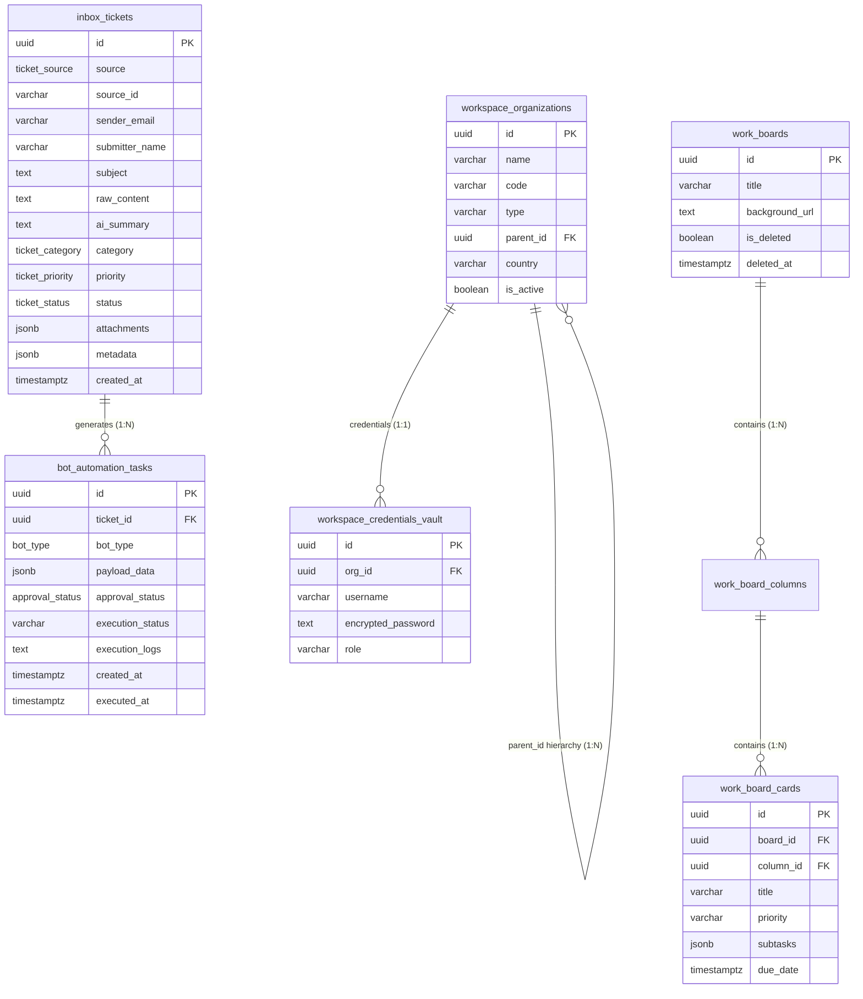
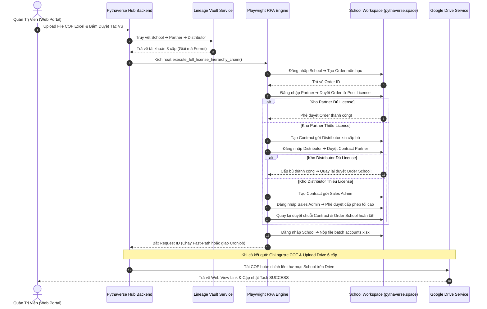
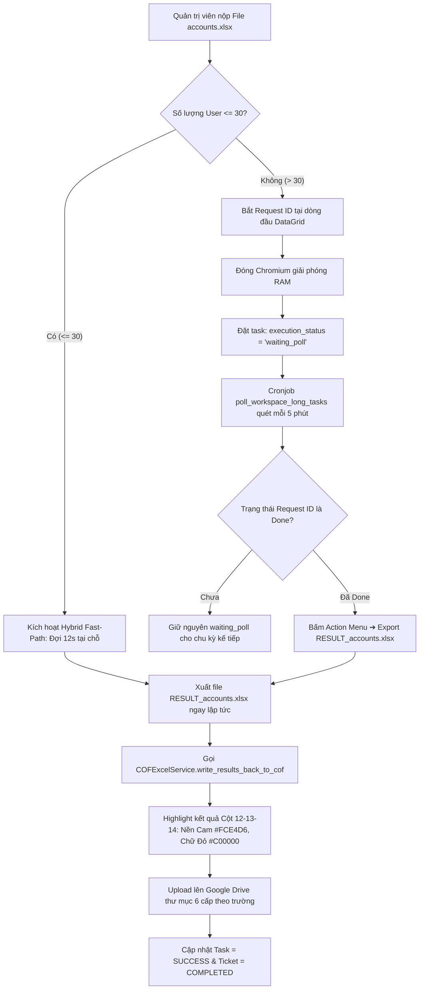
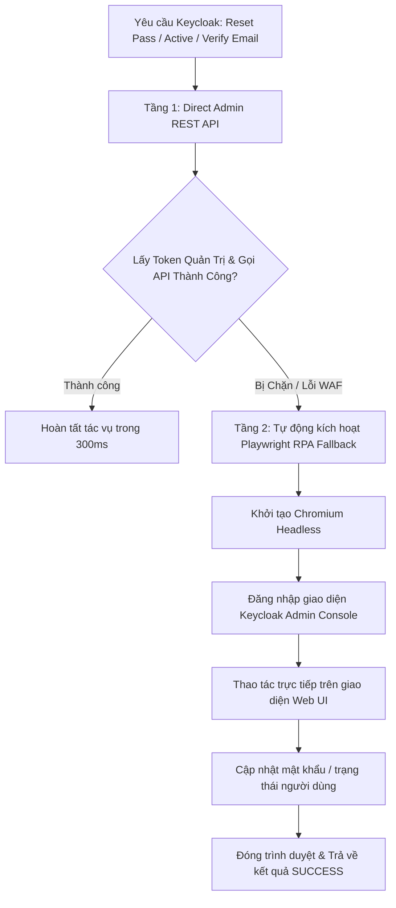
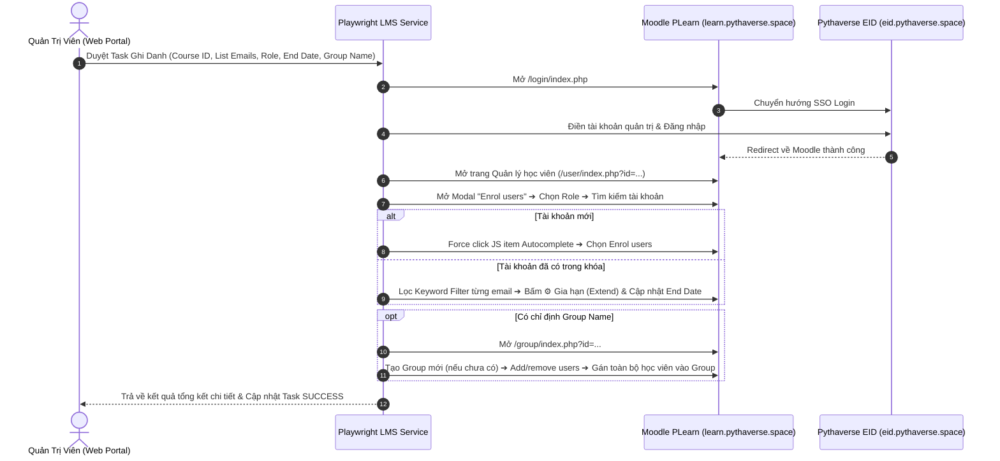
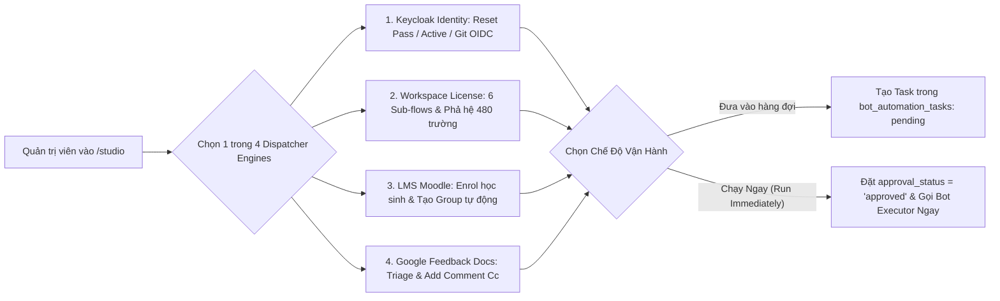
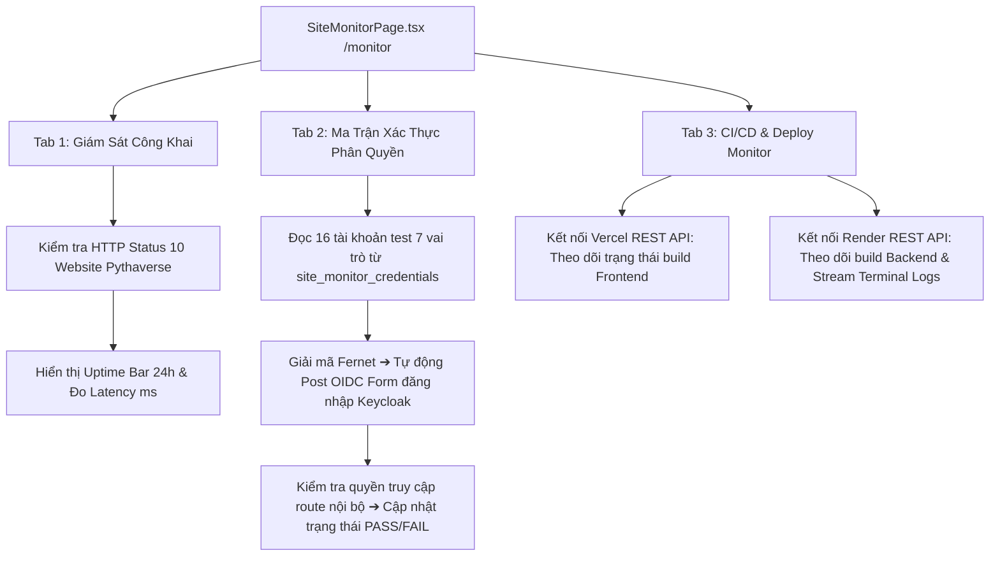
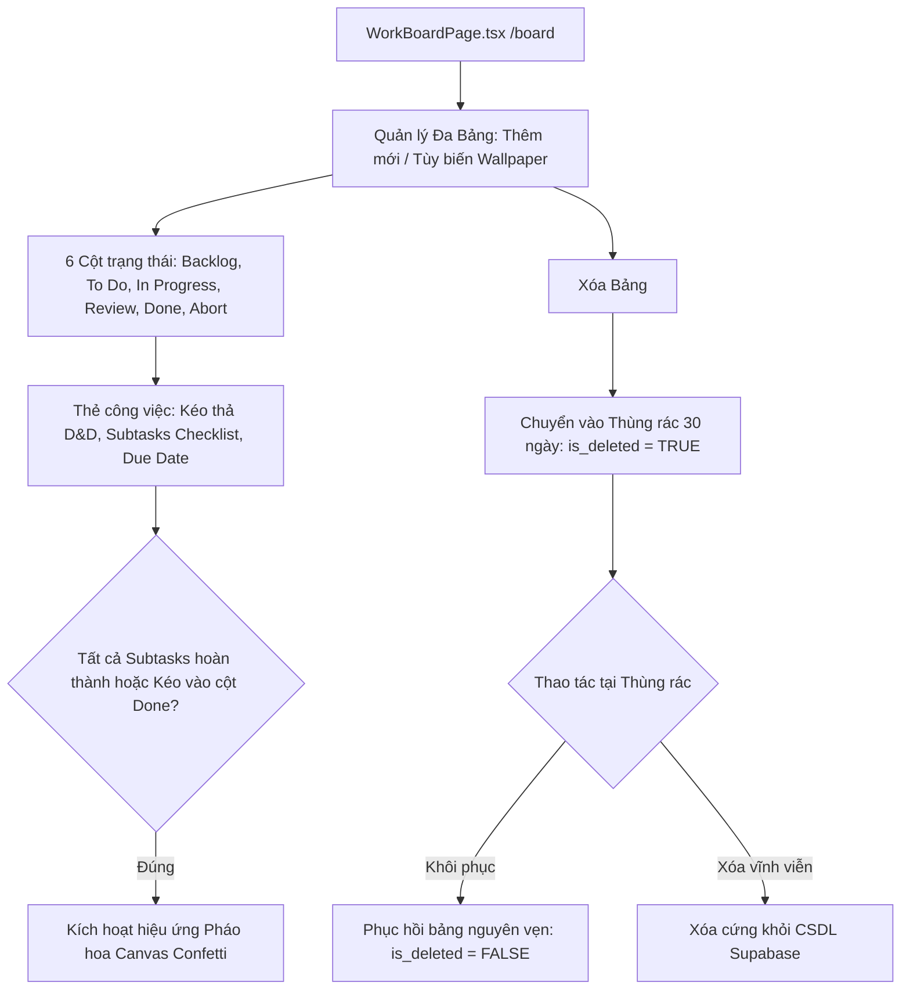
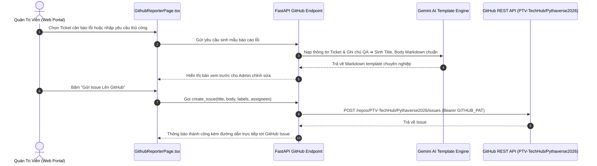

# 🚀 BÁCH KHOA TOÀN THƯ KIẾN TRÚC HỆ THỐNG PTV-TASKS-ADMINISTRATOR
## Pythaverse Central Admin & Automation Hub (Enterprise Single Source of Truth)

> **Tài liệu Kỹ Thuật Độc Quyền & Tối Cao:** Bản đặc tả kiến trúc toàn diện này được biên soạn nhằm chuẩn hóa và hệ thống lại 100% mã nguồn, sơ đồ luồng dữ liệu, cấu trúc cơ sở dữ liệu, các gói dịch vụ RPA và giao diện người dùng của dự án **`ptv-tasks-administrator`**. Mọi kỹ sư phần mềm, chuyên gia tự động hóa hoặc AI Coder mới chỉ cần đọc tài liệu này là có thể nắm bắt trọn vẹn toàn bộ hệ sinh thái, hiểu rõ từng tệp tin và từng hàm xử lý mà không cần phải duyệt thủ công từng tệp code.

---

## 📌 THÔNG TIN BẢN QUYỀN & TÁC GIẢ SÁNG LẬP

- **Dự án:** `ptv-tasks-administrator` (Pythaverse Central Admin & Automation Hub)
- **Tác giả & Kiến trúc sư trưởng:** **Nguyễn Mạnh Hùng** (*Lead AI Engineer & Automation Architect – DTT Corporation / Pythaverse Ecosystem*)
- **GitHub:** [`https://github.com/hungnm-1225`](https://github.com/hungnm-1225)
- **Email:** `hungnm@dtt.vn` / `hung.nguyenmanh@dtt.vn`
- **Hệ sinh thái:** [Pythaverse Space](https://pythaverse.space)
- **Phiên bản:** `v2.0.0 Enterprise Release` (Cập nhật tháng 08/2026)

---

## 📑 MỤC LỤC TỔNG QUAN

1. [PHẦN I: TẦM NHÌN HỆ THỐNG & NGUYÊN TẮC THIẾT KẾ](#-phần-i-tầm-nhìn-hệ-thống--nguyên-tắc-thiết-kế)
2. [PHẦN II: 7 PHÂN HỆ NGHIỆP VỤ PYTHAVERSE (DOMAIN TRUTH)](#-phần-ii-7-phân-hệ-nghiệp-vụ-pythaverse-domain-truth)
3. [PHẦN III: STACK CÔNG NGHỆ, THƯ VIỆN & MÔI TRƯỜNG VẬN HÀNH](#-phần-iii-stack-công-nghệ-thư-viện--môi-trường-vận-hành)
4. [PHẦN IV: SƠ ĐỒ CẤU TRÚC THƯ MỤC MONOREPO TỔNG THỂ](#-phần-iv-sơ-đồ-cấu-trúc-thư-mục-monorepo-tổng-thể)
5. [PHẦN V: GIẢI PHẪU CHI TIẾT TỪNG FILE & HÀM XỬ LÝ BACKEND (FASTAPI 0.115)](#-phần-v-giải-phẫu-chi-tiết-từng-file--hàm-xử-lý-backend-fastapi-0115)
   - [5.1. Entrypoint & Lifespan Crons (`main.py`)](#51-entrypoint--lifespan-crons-mainpy)
   - [5.2. Lõi Hệ Thống Core (`app/core/`)](#52-lõi-hệ-thống-core-appcore)
   - [5.3. Định Nghĩa Dữ Liệu Models (`app/models/`)](#53-định-nghĩa-dữ-liệu-models-appmodels)
   - [5.4. Tri Thức Nghiệp Vụ Brain (`app/brain/knowledge_base.json`)](#54-tri-thức-nghiệp-vụ-brain-appbrainknowledge_basejson)
   - [5.5. Cổng Giao Tiếp REST API Endpoints (`app/api/v1/endpoints/`)](#55-cổng-giao-tiếp-rest-api-endpoints-appapiv1endpoints)
   - [5.6. Gói Dịch Vụ Workspace RPA Đa Kế Thừa (`app/services/workspace/`)](#56-gói-dịch-vụ-workspace-rpa-đa-kế-thừa-appservicesworkspace)
   - [5.7. Các Dịch Vụ Nghiệp Vụ Chuyên Biệt (`app/services/`)](#57-các-dịch-vụ-nghiệp-vụ-chuyên-biệt-appservices)
   - [5.8. Bộ Điều Phối Workers Chạy Ngầm (`app/workers/`)](#58-bộ-điều-phối-workers-chạy-ngầm-appworkers)
   - [5.9. Kịch Bản Khởi Tạo Dữ Liệu Scripts (`scripts/`)](#59-kịch-bản-khởi-tạo-dữ-liệu-scripts-scripts)
6. [PHẦN VI: GIẢI PHẪU CHI TIẾT GIAO DIỆN FRONTEND SPA (REACT 19 + VITE 6 + TAILWIND CSS V4)](#-phần-vi-giải-phẫu-chi-tiết-giao-diện-frontend-spa-react-19--vite-6--tailwind-css-v4)
   - [6.1. Khởi Chạy & Định Tuyến Toàn Cục (`App.tsx`, `main.tsx`)](#61-khởi-chạy--định-tuyến-toàn-cục-apptsx-maintsx)
   - [6.2. Cấu Hình Tác Giả & Contexts (`config/`, `context/`, `lib/`, `types/`)](#62-cấu-hình-tác-giả--contexts-config-context-lib-types)
   - [6.3. Bóc Tách Chi Tiết 13 Feature Modules](#63-bóc-tách-chi-tiết-13-feature-modules)
7. [PHẦN VII: CƠ SỞ DỮ LIỆU SUPABASE POSTGRESQL 16 (16 BẢNG & STORAGE BUCKET)](#-phần-vii-cơ-sở-dữ-liệu-supabase-postgresql-16-16-bảng--storage-bucket)
8. [PHẦN VIII: 9 SƠ ĐỒ LUỒNG NGHIỆP VỤ END-TO-END (MERMAID SEQUENCE & FLOWCHARTS)](#-phần-viii-9-sơ-đồ-luồng-nghiệp-vụ-end-to-end-mermaid-sequence--flowcharts)
9. [PHẦN IX: HƯỚNG DẪN VẬN HÀNH & BẢO TRÌ CHO AI CODER MỚI](#-phần-ix-hướng-dẫn-vận-hành--bảo-trì-cho-ai-coder-mới)

---

## 🏛️ PHẦN I: TẦM NHÌN HỆ THỐNG & NGUYÊN TẮC THIẾT KẾ

`ptv-tasks-administrator` được định vị là **Trung tâm Thần kinh Điều phối & Tự Động Hóa Tập Trung (Pythaverse Central Admin & Automation Hub)** cho toàn bộ tập đoàn DTT Corporation và hệ sinh thái Pythaverse.

```
                  ┌────────────────────────────────────────────────────────┐
                  │                 ĐẦU VÀO ĐA KÊNH (INGESTION)             │
                  │   [Gmail Workspace]  [Google Forms]  [OS Ticket SCP]   │
                  └───────────────────────────┬────────────────────────────┘
                                              │ Ingestion Crons (5 mins)
                                              ▼
┌──────────────────────────────────────────────────────────────────────────────────────────┐
│                      LÕI TRUNG TÂM PTV-TASKS-ADMINISTRATOR (BACKEND FASTAPI)             │
│                                                                                          │
│  ┌─────────────────────────┐   ┌───────────────────────────┐   ┌──────────────────────┐  │
│  │   Gemini AI Triage      │   │  Human-in-the-Loop Gate   │   │  Lineage & Vault     │  │
│  │   (10-Model Fallback)   │──▶│  (Approval Queue Portal)  │──▶│  (Fernet Encryption) │  │
│  └─────────────────────────┘   └───────────────────────────┘   └──────────────────────┘  │
│                                              │ Phê duyệt / Run Immediate                 │
│                                              ▼                                           │
│  ┌────────────────────────────────────────────────────────────────────────────────────┐  │
│  │                             BOT WORKER EXECUTION CENTER                            │  │
│  │  [Workspace RPA 4-Cấp]  [Keycloak 2-Tier API]  [LMS PLearn Enrol]  [GitHub Dispatch]│  │
│  └────────────────────────────────────────────────────────────────────────────────────┘  │
└──────────────────────────────────────────────┬───────────────────────────────────────────┘
                                               │ Thực thi tự động
                                               ▼
                  ┌────────────────────────────────────────────────────────┐
                  │               HỆ SINH THÁI ĐÍCH (EXECUTION TARGETS)    │
                  │  School Workspace | PLearn LMS | Keycloak EID | GitHub │
                  └────────────────────────────────────────────────────────┘
```

### Bốn Nguyên Tắc Thiết Kế Bất Di Bất Dịch (Core Tenets):
1. **Cổng Phê Duyệt Con Người (Human-in-the-Loop Gate):** Mọi tác vụ có khả năng gây đột biến hệ thống (cấp phát License, tạo tài khoản Keycloak, ghi danh LMS, tạo GitHub Issue) BẮT BUỘC phải đi qua hàng đợi phê duyệt của Quản trị viên (`approval_status = 'approved'`), trừ trường hợp Quản trị viên chủ động kích hoạt từ Automation Studio với cờ `run_immediately = true`.
2. **Kiểm Soát Miền Doanh Nghiệp (@dtt.vn Whitelist):** Bảo mật đa tầng dựa trên Supabase OAuth & Bearer Token. Chỉ các tài khoản email Google thuộc miền `@dtt.vn` (đặc biệt tài khoản Quản trị viên Tối cao `hung.nguyenmanh@dtt.vn`) mới có quyền đăng nhập và gọi API.
3. **Bảo Vệ Bộ Nhớ Đệm RAM (Memory Collection Safeguard):** Do hệ thống triển khai trên máy chủ Render giới hạn 512MB RAM, mọi tác vụ chạy ngầm và tiến trình Playwright Chromium BẮT BUỘC phải thực thi bên trong `safe_job_wrapper` và luôn gọi `gc.collect()` trong khối `finally`.
4. **Google Gemini Auto-Fallback 10 Tầng:** Đảm bảo tính sẵn sàng 99.99% cho bộ máy phân tích AI bằng cơ chế tự động chuyển đổi thông minh giữa 10 mô hình Gemini khi gặp lỗi hạn mức `429 Too Many Requests` hoặc `ResourceExhausted`.

---

## 🌐 PHẦN II: 7 PHÂN HỆ NGHIỆP VỤ PYTHAVERSE (DOMAIN TRUTH)

Mọi kỹ sư và AI Coder khi tương tác với dự án bắt buộc phải hiểu rõ bản chất nghiệp vụ của 7 phân hệ:

| STT | Phân Hệ | Tên Miền / Giao Thức | Vai Trò Kỹ Thuật & Nghiệp Vụ Cốt Lõi |
|---|---|---|---|
| **1** | **School Workspace** | `https://pythaverse.space` | Hệ thống quản trị phân cấp 3 tầng (`Distributor` ➔ `Partner` ➔ `School`). Trường học tạo Order gửi Đối tác; Đối tác cấp License từ Pool hoặc xin Nhà phân phối cấp bù Contract; Quản trị viên Sales Admin phê duyệt tối cao. |
| **2** | **PLearn LMS** | `https://learn.pythaverse.space` | Cổng đào tạo Moodle LMS (PHP / MariaDB / REST WebServices). Quản lý danh mục khóa học (`SWRP`, `IR`, `ASP`...) và ghi danh tài khoản theo Vai trò (`Student` - 9, `Non-editing teacher` - 7, `Manager` - 1), chia nhóm lớp tự động. |
| **3** | **PGit Repos** | `https://git.pythaverse.space` | Máy chủ lưu trữ mã nguồn Gitea Git Server. Yêu cầu tài khoản người dùng phải đăng nhập SSO qua Keycloak ít nhất 1 lần để kích hoạt cơ chế JIT (Just-In-Time) provisioning. |
| **4** | **Keycloak Auth IDP** | `https://eid.pythaverse.space` | Cổng xác thực định danh tập trung OpenID Connect / OAuth2 (Realm: `idp` / `master`). Quản lý thông tin đăng nhập, reset mật khẩu, kích hoạt/khóa tài khoản và xác thực email. |
| **5** | **Leanbot IDE** | `https://ide.pythaverse.space` | Web IDE lập trình khối kéo thả Blockly / App Inventor kết nối Robot phần cứng Leanbot thông qua Bluetooth BLE Companion APK. |
| **6** | **Support Helpdesk** | `https://support.pythaverse.space` | Hệ thống tiếp nhận sự cố kỹ thuật osTicket (PHP / MySQL). Được cào dữ liệu tự động định kỳ 5 phút qua Playwright Headless session. |
| **7** | **PContest** | `https://contest.pythaverse.space` | Hệ thống tổ chức thi đấu lập trình trực tuyến, quản lý bảng xếp hạng Leaderboard và chấm điểm tự động. |

---

## 🛠️ PHẦN III: STACK CÔNG NGHỆ, THƯ VIỆN & MÔI TRƯỜNG VẬN HÀNH

```
                      ┌────────────────────────────────────────────────────────┐
                      │              KIẾN TRÚC CÔNG NGHỆ HIỆN ĐẠI              │
                      └────────────────────────────────────────────────────────┘
                       ┌───────────────────────┐      ┌───────────────────────┐
                       │     FRONTEND SPA      │      │     BACKEND API       │
                       ├───────────────────────┤      ├───────────────────────┤
                       │ • React 19 Strict     │      │ • Python 3.11         │
                       │ • TypeScript Strict   │      │ • FastAPI 0.115       │
                       │ • Vite 6 Bundler      │      │ • Pydantic v2         │
                       │ • Tailwind CSS v4     │      │ • APScheduler 3.10    │
                       │ • Lucide React Icons  │      │ • Playwright Async    │
                       │ • Sonner Toast & D&D  │      │ • Fernet Cryptography │
                       │ • Canvas Confetti     │      │ • SheetJS / OpenPyXL  │
                       └───────────────────────┘      └───────────────────────┘
                                      │                      │
                                      ▼                      ▼
                       ┌──────────────────────────────────────────────────────┐
                       │             CƠ SỞ DỮ LIỆU & ĐIỆN TOÁN ĐÁM MÂY        │
                       ├──────────────────────────────────────────────────────┤
                       │ • Supabase PostgreSQL 16 (16 Tables + RLS Policies)  │
                       │ • Google Gemini AI Studio (10-Model Sequence)        │
                       │ • Vercel (Frontend Hosting) & Render (Backend Docker)│
                       │ • Google Workspace APIs (Gmail, Sheets, Docs, Drive) │
                       └──────────────────────────────────────────────────────┘
```

### 1. Backend Stack
- **Ngôn ngữ & Runtime:** Python 3.11+
- **Web Framework:** FastAPI 0.115 (Asynchronous, OpenAPI/Swagger tự sinh tại `/docs`)
- **Validation Engine:** Pydantic v2 (Strict Schema Validation)
- **RPA & Automation Engine:** Playwright Async Chromium (`playwright.async_api`) với cờ tối ưu RAM: `--no-sandbox`, `--disable-dev-shm-usage`, `--disable-gpu`, `--single-process`.
- **Lập lịch chạy ngầm:** APScheduler 3.10 `AsyncIOScheduler` với 6 Crons tự động.
- **Mã hóa dữ liệu Két Sắt:** `cryptography.fernet` (Thuật toán mã hóa đối xứng khóa 32 bytes URL-safe base64).
- **Trí tuệ nhân tạo (AI):** `google-generativeai` tích hợp chuỗi 10 models fallback.
- **Xử lý Bảng tính:** `openpyxl` kết hợp định dạng màu hex và công thức Excel.

### 2. Frontend Stack
- **Framework UI:** React 19 (Functional Components, Custom Hooks)
- **Ngôn ngữ:** TypeScript Strict Mode (`strict: true`, không dùng `any` bừa bãi)
- **Bundler:** Vite 6 (Hỗ trợ HMR siêu tốc và tối ưu hóa Dynamic Chunk Splitting)
- **Định tuyến:** React Router DOM v7 (Lazy loading 100% 13 modules với `React.lazy` + `Suspense`)
- **CSS Styling:** Tailwind CSS v4 (Kiến trúc Design Tokens, Dark/Light Mode, Container Queries, SaaS aesthetic)
- **Biểu tượng (Icons):** `lucide-react` (Bộ icon đồng nhất, sắc nét)
- **Thông báo & Hiệu ứng:** `sonner` (Toast notifications) và `canvas-confetti` (Hiệu ứng pháo hoa khi xong việc).

---

## 📁 PHẦN IV: SƠ ĐỒ CẤU TRÚC THƯ MỤC MONOREPO TỔNG THỂ

```
ptv-tasks-administrator/
├── .agent/                             # Cấu hình AI Assistant & Chuyên gia Agents
│   ├── agents/                         # Hồ sơ năng lực chuyên gia (Frontend, Backend, RPA, Security...)
│   ├── rules/                          # Quy tắc hành vi bắt buộc GEMINI.md
│   ├── skills/                         # Kỹ năng nghiệp vụ chuyên biệt
│   └── workflows/                      # Quy trình làm việc tự động hóa
├── backend/                            # Ứng dụng Backend FastAPI (Python 3.11)
│   ├── app/
│   │   ├── api/v1/                     # Các bộ định tuyến REST API v1
│   │   │   ├── endpoints/              # 9 Router chi tiết theo miền nghiệp vụ
│   │   │   │   ├── board.py            # API Quản lý Kanban Board, Thùng rác 30 ngày, Columns, Cards
│   │   │   │   ├── bots.py             # API Trạng thái Worker, Stream log GMT+7, Retry Worker
│   │   │   │   ├── courses.py          # API CRUD Khóa học (Workspace vs LMS), Bulk Upsert, Category
│   │   │   │   ├── github.py           # API Dispatch Issue vào Private Repo & AI Template
│   │   │   │   ├── monitor.py          # API Giám sát 3-Tab: Public Sites, Auth Matrix, CI/CD Logs
│   │   │   │   ├── reports.py          # API Thống kê KPI, Dynamic Health 24h, Xuất DTT 3Đ Excel
│   │   │   │   ├── tasks.py            # API Cổng Duyệt Tác Vụ Human-in-the-Loop, Background Dispatch
│   │   │   │   ├── tickets.py          # API Hòm thư hợp nhất, Multi-filter, AI Triage thủ công
│   │   │   │   └── workspace.py        # API Phả hệ 480 trường, Cache Orders/Contracts, Extract COF
│   │   │   └── router.py               # Điểm tập hợp toàn bộ Router v1
│   │   ├── brain/                      # Tri thức nghiệp vụ AI Triage
│   │   │   └── knowledge_base.json     # Định nghĩa 7 phân hệ, từ khóa routing cán bộ phụ trách
│   │   ├── core/                       # Lõi hệ thống
│   │   │   ├── config.py               # Pydantic Settings, Biến môi trường, Hàm múi giờ GMT+7
│   │   │   ├── gemini.py               # AI Engine Triage, Chuỗi 10-Model Fallback tự phục hồi
│   │   │   ├── security.py             # Kiểm tra Domain @dtt.vn, Xác thực Bearer JWT
│   │   │   └── supabase.py             # Singleton Supabase Client (Service Role Key)
│   │   ├── models/                     # Schemas Pydantic Validation
│   │   │   ├── task.py                 # Schemas Task Create, Approval, Retry
│   │   │   ├── template.py             # Schemas GitHub Template & XLSX Export Mapping
│   │   │   └── ticket.py               # Schemas Ticket Create, Update, Filter Params
│   │   ├── services/                   # Các dịch vụ nghiệp vụ chuyên biệt
│   │   │   ├── workspace/              # GÓI DỊCH VỤ WORKSPACE RPA ĐA KẾ THỪA (8 MODULES)
│   │   │   │   ├── __init__.py         # Tổng hợp Singleton workspace_playwright_service
│   │   │   │   ├── account_service.py  # Nộp batch tài khoản, Hybrid Fast-Path <=30 users
│   │   │   │   ├── base.py             # Khởi tạo Chromium RAM thấp, Login SSO, Date Formatter
│   │   │   │   ├── contract_service.py # Tạo/Duyệt Hợp đồng PRT -> DST -> Sales Admin
│   │   │   │   ├── enroll_service.py   # Tạo Group và Ghi danh học sinh/GV trên School Workspace
│   │   │   │   ├── order_service.py    # School tạo Order & Partner duyệt Order từ Pool License
│   │   │   │   ├── orchestrator_service.py # Master E2E Chain 4 cấp & Subflows độc lập
│   │   │   │   └── workspace_scanner_service.py # Direct API Scanner 5 Master Distributors
│   │   │   ├── cof_excel_service.py    # Bóc tách COF 3 Tabs, sinh accounts.xlsx, ghi ngược kết quả
│   │   │   ├── github_service.py       # Dispatcher gửi Issue trực tiếp vào Private Repo
│   │   │   ├── gmail_service.py        # Quét hòm thư Gmail, tải Attachment lên Storage Bucket
│   │   │   ├── google_doc_service.py   # Đọc nội dung Doc báo cáo, add comment tag Cc email
│   │   │   ├── google_drive_service.py # Quản lý thư mục Drive 6 cấp, tải COF lên đúng trường
│   │   │   ├── google_sheet_service.py # Quét Form Feedback Sheet & Cập nhật ngược Assigned=TRUE
│   │   │   ├── keycloak_service.py     # 2-Tier Hybrid: Direct REST API + Playwright Fallback
│   │   │   ├── osticket_service.py     # Playwright Scraper cào vé OS Ticket, Custom Form & Files
│   │   │   ├── playwright_service.py   # Ghi danh trực tiếp Moodle LMS PLearn theo vai trò & Group
│   │   │   ├── site_monitor_service.py # Giám sát Uptime 10 site, Test 16 acc test, Vercel/Render CI/CD
│   │   │   ├── ticket_processor.py     # Cầu nối tiếp nhận ticket và kích hoạt AI Triage
│   │   │   └── workspace_lineage_service.py # Giải mã Fernet Két Sắt & Phân giải phả hệ 3 cấp
│   │   ├── workers/                    # Bộ điều phối thực thi chạy ngầm
│   │   │   ├── bot_executor.py         # Router Worker trung tâm thực thi 4 loại bot
│   │   │   └── ticket_processor.py     # Xử lý luồng nạp ticket và kích hoạt AI
│   │   └── main.py                     # Entrypoint FastAPI, Lifespan 6 Crons, safe_job_wrapper
│   ├── scripts/                        # Kịch bản khởi tạo CSDL
│   │   ├── import_hierarchy.py         # Import 480 trường và mã hóa Fernet vào Két Sắt
│   │   └── seed_monitor_credentials.py # Khởi tạo và mã hóa 16 tài khoản test Site Monitor
│   ├── Dockerfile                      # Dockerfile triển khai môi trường Render (Chromium ready)
│   └── requirements.txt                # Danh mục gói thư viện Python Backend
├── frontend/                           # Ứng dụng Frontend SPA (React 19 + Vite 6 + Tailwind CSS v4)
│   ├── src/
│   │   ├── components/
│   │   │   ├── common/                 # Components dùng chung (Header.tsx, Sidebar.tsx)
│   │   │   └── layout/                 # Khung sườn giao diện (AppLayout.tsx)
│   │   ├── config/
│   │   │   └── authorConfig.ts         # Khẳng định chủ quyền tác giả Nguyễn Mạnh Hùng & Socials
│   │   ├── context/
│   │   │   ├── AuthContext.tsx         # Quản lý phiên đăng nhập Google & Whitelist @dtt.vn
│   │   │   └── ThemeContext.tsx        # Quản lý giao diện Sáng / Tối (Dark/Light Mode)
│   │   ├── features/                   # 13 TRANG CHỨC NĂNG CHUYÊN BIỆT
│   │   │   ├── auth/LoginPage.tsx      # Đăng nhập bảo mật Google OAuth Whitelist
│   │   │   ├── board/WorkBoardPage.tsx # Bảng Kanban 6 cột, kéo thả, Confetti, Thùng rác 30 ngày
│   │   │   ├── bots/BotCommanderPage.tsx # Giám sát 6 Workers, Stream Log GMT+7, Restart
│   │   │   ├── courses/CoursesManagerPage.tsx # Quản lý 2 bảng khóa học, Bulk Upsert, Category
│   │   │   ├── dashboard/DashboardPage.tsx # Bảng điều khiển KPI tổng quan, Quick Actions
│   │   │   ├── github/GithubReporterPage.tsx # Điều phối Issue GitHub, AI Template Generator
│   │   │   ├── inbox/UnifiedInboxPage.tsx # Hòm thư hợp nhất đa kênh, Gemini AI Triage
│   │   │   ├── landing/LandingPage.tsx # Trang chủ giới thiệu tác giả & 7 phân hệ Pythaverse
│   │   │   ├── monitor/SiteMonitorPage.tsx # Giám sát 3 Tab: Public Sites, Auth Matrix, CI/CD
│   │   │   ├── profile/ProfileSettingsPage.tsx # Hồ sơ tác giả, trạng thái biến môi trường, System info
│   │   │   ├── reports/ReportsExportPage.tsx # Báo cáo phân tích KPI, Dynamic Health, Xuất DTT 3Đ
│   │   │   ├── studio/AutomationStudioPage.tsx # Điều phối Bot độc lập (Keycloak, RPA, Moodle, Docs)
│   │   │   └── tasks/TaskManagementPage.tsx # Cổng phê duyệt Human-in-the-Loop, Live Terminal Logs
│   │   ├── lib/
│   │   │   ├── api.ts                  # Wrapper gọi API Backend FastAPI chuẩn mực
│   │   │   └── supabase.ts             # Supabase Client khởi tạo cho Frontend
│   │   ├── types/
│   │   │   └── index.ts                # Toàn bộ 186 dòng định nghĩa TypeScript Strict Type
│   │   ├── App.tsx                     # Khởi tạo React Router DOM v7 & Lazy Load 13 Pages
│   │   ├── index.css                   # Tailwind CSS v4, Font Inter, Typography, Scrollbar
│   │   └── main.tsx                    # Khởi tạo React Virtual DOM
│   ├── package.json                    # Danh mục gói thư viện Frontend & Scripts
│   ├── tsconfig.json                   # Cấu hình TypeScript Strict Type-Checking
│   └── vite.config.ts                  # Cấu hình Vite Bundler & Aliases
├── supabase/                           # Cơ sở dữ liệu PostgreSQL 16 & Migrations
│   ├── migrations/                     # Lịch sử nâng cấp CSDL Supabase
│   │   └── 20260812000000_initial_schema.sql # Migration khởi tạo CSDL
│   └── schema.sql                      # Schema chuẩn mực 16 bảng CSDL, RLS, Indexes, Triggers
├── GEMINI.md                           # Bộ quy tắc hệ thống & Chỉ dẫn AI Agent Routing
└── README.md                           # Bách khoa toàn thư kỹ thuật Single Source of Truth
```

---

## 🔬 PHẦN V: GIẢI PHẪU CHI TIẾT TỪNG FILE & HÀM XỬ LÝ BACKEND (FASTAPI 0.115)

### 5.1. Entrypoint & Lifespan Crons (`main.py`)
- **Tệp tin:** [`backend/app/main.py`](file:///c:/Users/dtt/Desktop/Project/ptv-tasks-administrator/backend/app/main.py)
- **Vai trò:** Khởi tạo ứng dụng FastAPI, cấu hình CORS, thiết lập bộ quản lý vòng đời `lifespan` kích hoạt 6 tiến trình chạy ngầm (APScheduler) và bảo vệ máy chủ bằng cơ chế `safe_job_wrapper`.

#### Danh Mục Hàm Chi Tiết Trong `main.py`:
1. `safe_job_wrapper(job_func, job_name: str)`
   - **Mục đích:** Hàm bọc an toàn tuyệt đối cho mọi cronjob. Ngăn chặn việc một cronjob bị crash làm sập toàn bộ tiến trình FastAPI, đồng thời tự động kích hoạt `gc.collect()` trong khối `finally` để giải phóng bộ nhớ nhị phân trên môi trường Render 512MB RAM.
   - **Tham số:** `job_func` (hàm bất đồng bộ cần chạy), `job_name` (tên định danh để in log).
   - **Logic:** `try -> await job_func() -> catch Exception (log lỗi) -> finally (gc.collect())`.
2. `poll_workspace_long_tasks()`
   - **Mục đích:** Quét bảng `bot_automation_tasks` tìm các tác vụ có `execution_status = 'waiting_poll'` (Pha 2 của Smart Polling Engine).
   - **Logic:** Mở Chromium Playwright ➔ Gọi `check_and_export_batch_result()` kiểm tra `request_id` ➔ Khi hoàn tất: xuất file `RESULT_accounts.xlsx`, gọi `COFExcelService.write_results_back_to_cof()` ghi ngược kết quả highlight cam `#FCE4D6` & đỏ `#C00000`, tải lên đúng thư mục Google Drive của trường và cập nhật task thành `success`.
3. `lifespan(app: FastAPI)`
   - **Mục đích:** Context Manager quản lý khởi động và tắt ứng dụng an toàn.
   - **6 Lập lịch Cronjob tự động:**
     - `gmail_cron`: Gọi `poll_unread_gmails` (chu kỳ 5 phút).
     - `osticket_cron`: Gọi `poll_open_ostickets` (chu kỳ 5 phút).
     - `sheet_cron`: Gọi `poll_form_feedbacks` (chu kỳ 5 phút).
     - `site_uptime_cron`: Gọi `poll_site_uptime_cron` (chu kỳ 30 phút).
     - `workspace_long_tasks_cron`: Gọi `poll_workspace_long_tasks` (chu kỳ 5 phút).
     - `distributor_cache_scanner_cron`: Gọi `workspace_scanner_service.scan_and_cache_all_distributors` (chu kỳ 45 phút).

---

### 5.2. Lõi Hệ Thống Core (`app/core/`)

#### 1. [`config.py`](file:///c:/Users/dtt/Desktop/Project/ptv-tasks-administrator/backend/app/core/config.py)
- **Mục đích:** Quản trị tập trung toàn bộ biến môi trường thông qua Pydantic `BaseSettings`.
- **Hàm tiện ích:** `get_vn_time_str(fmt)` và `get_vn_iso()` trả về thời gian theo múi giờ Việt Nam (`Asia/Ho_Chi_Minh` – GMT+7).
- **Các nhóm biến chính:** Cấu hình Supabase (`SUPABASE_URL`, `SUPABASE_SERVICE_ROLE_KEY`), Khóa két sắt (`VAULT_SECRET_KEY`), Danh sách 10 model Gemini (`GEMINI_MODELS`), Thông tin quản trị Keycloak, OS Ticket, GitHub PAT, Google Workspace OAuth và Google Drive Folder IDs.

#### 2. [`gemini.py`](file:///c:/Users/dtt/Desktop/Project/ptv-tasks-administrator/backend/app/core/gemini.py)
- **Mục đích:** Động cơ phân tích, tóm tắt và tự động gán nhãn cho vé (AI Auto-Triage & Categorization).
- **Hàm `AIEngine.generate_content_with_retry(prompt)`:**
  - Triển khai thuật toán **Auto-Fallback 10 tầng**: Duyệt qua danh sách `GEMINI_MODELS` (`gemini-3.7-flash` ➔ `gemini-3.6-flash` ➔ `gemini-3.5-flash-lite` ➔ `gemini-2.5-flash` ➔ ...). Nếu model hiện tại gặp lỗi `429 (Rate Limit)` hoặc `quota_exhausted`, tự động ghi log cảnh báo và chuyển ngay sang model kế tiếp mà không làm gián đoạn luồng xử lý của người dùng.
- **Hàm `process_ticket_with_ai(ticket_id: str)`:**
  - Đọc nội dung thô của ticket từ Supabase, nạp `knowledge_base.json` làm ngữ cảnh domain truth, gửi prompt yêu cầu AI bóc tách JSON chuẩn: `category` (`bug`, `account_keycloak`, `lms_enroll`, `license`, `other`), `priority` (`critical`, `normal`), `ai_summary` (tóm tắt bằng Tiếng Việt), `assigned_name` và `assigned_email`. Cập nhật kết quả ngược vào bảng `inbox_tickets`.

#### 3. [`security.py`](file:///c:/Users/dtt/Desktop/Project/ptv-tasks-administrator/backend/app/core/security.py)
- **Mục đích:** Kiểm soát an ninh tầng API qua giao thức HTTP Bearer Token.
- **Hàm `verify_dtt_domain_email(email: str) -> bool`:** Kiểm tra phần mở rộng domain của email, bắt buộc phải là `@dtt.vn`.
- **Hàm `get_current_user_email(credentials) -> str`:** Giải mã JWT Token từ Supabase Auth, trích xuất email người dùng và thực thi kiểm tra Whitelist Domain. Nếu vi phạm, trả về lỗi `HTTP 403 Forbidden` ngay lập tức.

#### 4. [`supabase.py`](file:///c:/Users/dtt/Desktop/Project/ptv-tasks-administrator/backend/app/core/supabase.py)
- **Mục đích:** Cung cấp singleton client kết nối Supabase PostgreSQL với quyền hạn tối cao (`SUPABASE_SERVICE_ROLE_KEY`), cho phép các background workers thao tác CSDL mà không bị chặn bởi RLS.

---

### 5.3. Định Nghĩa Dữ Liệu Models (`app/models/`)
- [`ticket.py`](file:///c:/Users/dtt/Desktop/Project/ptv-tasks-administrator/backend/app/models/ticket.py): Chứa `InboxTicketCreate`, `InboxTicketUpdate`, `TicketFilterParams` kiểm soát dữ liệu tìm kiếm, lọc phân trang và cập nhật vé.
- [`task.py`](file:///c:/Users/dtt/Desktop/Project/ptv-tasks-administrator/backend/app/models/task.py): Chứa `BotAutomationTaskCreate`, `TaskApprovalRequest` (duyệt/từ chối), `TaskRetryRequest` (chạy lại tác vụ lỗi).
- [`template.py`](file:///c:/Users/dtt/Desktop/Project/ptv-tasks-administrator/backend/app/models/template.py): Chứa schema cấu hình template Markdown cho GitHub Issue và mapping cột xuất file báo cáo XLSX.

---

### 5.4. Tri Thức Nghiệp Vụ Brain (`app/brain/knowledge_base.json`)
- [`knowledge_base.json`](file:///c:/Users/dtt/Desktop/Project/ptv-tasks-administrator/backend/app/brain/knowledge_base.json): Tệp tri thức trung tâm chứa định nghĩa kỹ thuật của 7 phân hệ Pythaverse, danh sách cán bộ phụ trách mặc định (Assignees), quy tắc phân loại danh mục khóa học (`SWRP`, `IR`, `ASP`...), giúp Gemini AI phản hồi chính xác tuyệt đối theo ngữ cảnh doanh nghiệp.

---

### 5.5. Cổng Giao Tiếp REST API Endpoints (`app/api/v1/endpoints/`)

| Endpoint Router | Đường Dẫn Prefix | Các Hàm Xử Lý Chính | Chức Năng Chi Tiết |
|---|---|---|---|
| [`tickets.py`](file:///c:/Users/dtt/Desktop/Project/ptv-tasks-administrator/backend/app/api/v1/endpoints/tickets.py) | `/tickets` | `list_tickets`, `get_ticket`, `complete_ticket`, `dismiss_ticket`, `restore_ticket`, `update_category`, `trigger_ai_triage` | Quản lý toàn bộ vòng đời vé: lọc đa tiêu chí (status, category, source, keyword), đánh dấu hoàn thành, bác bỏ vé (đồng thời mark read trên Gmail), kích hoạt AI Triage thủ công. |
| [`tasks.py`](file:///c:/Users/dtt/Desktop/Project/ptv-tasks-administrator/backend/app/api/v1/endpoints/tasks.py) | `/tasks` | `list_tasks`, `create_task`, `approve_task`, `run_approved_task_worker` | Cổng kiểm soát Human-in-the-Loop: tiếp nhận yêu cầu duyệt từ admin, kích hoạt worker thực thi nền qua `bot_executor`, ghi log thực thi GMT+7 có màu sắc ANSI. |
| [`bots.py`](file:///c:/Users/dtt/Desktop/Project/ptv-tasks-administrator/backend/app/api/v1/endpoints/bots.py) | `/bots` | `get_bot_workers_status`, `get_bot_logs`, `retry_bot_task` | Giám sát trạng thái hoạt động của 6 workers (Active/Idle/Error), stream log hệ thống chuẩn hóa GMT+7 lọc trùng lặp, hỗ trợ khởi động lại worker bằng key name. |
| [`workspace.py`](file:///c:/Users/dtt/Desktop/Project/ptv-tasks-administrator/backend/app/api/v1/endpoints/workspace.py) | `/workspace` | `get_schools_hierarchy`, `get_cached_pending_orders`, `get_cached_pending_contracts`, `sync_cache_now`, `extract_cof` | Cung cấp danh mục 480 trường học kèm phả hệ cho Autocomplete, đọc dữ liệu cache siêu tốc Orders/Contracts, kích hoạt quét cưỡng bức `sync_cache_now` và bóc tách file COF. |
| [`courses.py`](file:///c:/Users/dtt/Desktop/Project/ptv-tasks-administrator/backend/app/api/v1/endpoints/courses.py) | `/courses` | `list_courses`, `create_course`, `update_course`, `delete_course`, `bulk_upsert_courses`, `get_categories`, `rename_category`, `delete_merge_category` | Quản lý song song 2 bảng `workspace_courses` và `lms_courses`, hỗ trợ nhập dữ liệu hàng loạt từ Excel/Text paste qua SheetJS, đổi tên và gộp danh mục môn học hàng loạt. |
| [`monitor.py`](file:///c:/Users/dtt/Desktop/Project/ptv-tasks-administrator/backend/app/api/v1/endpoints/monitor.py) | `/monitor` | `get_sites_status`, `get_site_history`, `get_auth_matrix`, `run_auth_check_now`, `get_deployments`, `get_deployment_logs` | Giám sát toàn diện 3 Tab: Uptime 10 website Pythaverse 24 giờ, Ma trận xác thực 16 tài khoản test 7 vai trò qua giải mã Fernet, và theo dõi tiến trình builds CI/CD Vercel/Render. |
| [`github.py`](file:///c:/Users/dtt/Desktop/Project/ptv-tasks-administrator/backend/app/api/v1/endpoints/github.py) | `/github` | `create_github_issue`, `generate_ai_issue_template` | Tạo GitHub Issue trực tiếp vào Private Repository, tự động sinh tiêu đề và nội dung markdown chuẩn mực bằng AI kết hợp thông tin điều tra QA. |
| [`reports.py`](file:///c:/Users/dtt/Desktop/Project/ptv-tasks-administrator/backend/app/api/v1/endpoints/reports.py) | `/reports` | `get_reports_summary`, `get_kpi_export_data` | Thống kê 4 thẻ chỉ số KPI, tính toán Dynamic Health 24h, biểu đồ tròn cơ cấu loại yêu cầu, biểu đồ cột xu hướng tiếp nhận/xử lý và xuất bảng dữ liệu KPI DTT 3Đ. |
| [`board.py`](file:///c:/Users/dtt/Desktop/Project/ptv-tasks-administrator/backend/app/api/v1/endpoints/board.py) | `/board` | `list_boards`, `create_board`, `update_board`, `trash_board`, `restore_board`, `delete_board_permanent`, `get_board_detail`, `create_card`, `update_card`, `move_card`, `delete_card` | Quản trị đa bảng Kanban, hỗ trợ thùng rác 30 ngày (soft delete/restore), quản lý 6 cột trạng thái, kéo thả thẻ công việc, cập nhật thanh tiến độ subtasks thời gian thực. |

---

### 5.6. Gói Dịch Vụ Workspace RPA Đa Kế Thừa (`app/services/workspace/`)

Gói dịch vụ RPA được thiết kế theo mô hình **Đa Kế Thừa Tầng (Layered Multi-Inheritance Architecture)** giúp mã nguồn gọn gàng, tách bạch trách nhiệm và dễ dàng bảo trì:


#### Chi Tiết 8 Module RPA:
1. [`base.py`](file:///c:/Users/dtt/Desktop/Project/ptv-tasks-administrator/backend/app/services/workspace/base.py): Chứa `WorkspaceBaseService` khởi tạo Chromium với cờ tiết kiệm tài nguyên (`--no-sandbox`, `--disable-dev-shm-usage`, `--single-process`), xử lý form đăng nhập Keycloak SSO `login_role()` và chuẩn hóa ngày tháng ISO `normalize_date_iso()`.
2. [`order_service.py`](file:///c:/Users/dtt/Desktop/Project/ptv-tasks-administrator/backend/app/services/workspace/order_service.py): Chứa `WorkspaceOrderService` xử lý quy trình School tạo Order và Partner duyệt Order từ Pool License.
3. [`contract_service.py`](file:///c:/Users/dtt/Desktop/Project/ptv-tasks-administrator/backend/app/services/workspace/contract_service.py): Chứa `WorkspaceContractService` xử lý quy trình tạo/duyệt Contract giữa Partner ➔ Distributor ➔ Sales Admin.
4. [`orchestrator_service.py`](file:///c:/Users/dtt/Desktop/Project/ptv-tasks-administrator/backend/app/services/workspace/orchestrator_service.py): Chứa `WorkspaceOrchestratorService` điều phối chuỗi liên hoàn Master E2E Chain 4 cấp (`execute_full_license_hierarchy_chain`) và các subflows độc lập.
5. [`account_service.py`](file:///c:/Users/dtt/Desktop/Project/ptv-tasks-administrator/backend/app/services/workspace/account_service.py): Chứa `WorkspaceAccountService` nộp file batch tạo tài khoản, tích hợp **Hybrid Fast-Path** (chờ 12s lấy kết quả ngay nếu batch <= 30 tài khoản) và trích xuất `request_id` cho Cronjob tiếp quản nếu batch lớn.
6. [`enroll_service.py`](file:///c:/Users/dtt/Desktop/Project/ptv-tasks-administrator/backend/app/services/workspace/enroll_service.py): Chứa `WorkspaceEnrollService` tạo Group lớp và ghi danh học sinh/giáo viên trực tiếp trên giao diện School Workspace.
7. [`workspace_scanner_service.py`](file:///c:/Users/dtt/Desktop/Project/ptv-tasks-administrator/backend/app/services/workspace/workspace_scanner_service.py): Chứa `WorkspaceScannerService` sử dụng Direct API trong session Playwright của 5 Master Distributors để quét và lưu cache hàng trăm hợp đồng/đơn hàng trong vài giây vào bảng `workspace_contracts_cache` và `workspace_orders_cache`.
8. [`__init__.py`](file:///c:/Users/dtt/Desktop/Project/ptv-tasks-administrator/backend/app/services/workspace/__init__.py): Tổng hợp toàn bộ các lớp trên thành singleton `workspace_playwright_service`.

---

### 5.7. Các Dịch Vụ Nghiệp Vụ Chuyên Biệt (`app/services/`)

#### 1. [`cof_excel_service.py`](file:///c:/Users/dtt/Desktop/Project/ptv-tasks-administrator/backend/app/services/cof_excel_service.py)
- **Mục đích:** Xử lý file COF (Curriculum Order Form) 3 tabs.
- **Hàm `parse_cof_excel(file_path)`:** Bóc tách thông tin trường học, khóa học (Tab 1), danh sách học sinh (Tab 2 - chuẩn hóa ngày sinh DOB `D/M/YYYY`), danh sách giáo viên (Tab 3).
- **Hàm `generate_accounts_file_for_upload(parsed_data)`:** Sinh file `accounts.xlsx` 7 cột chuẩn mực bắt đầu từ dòng số 6 (`No.`, `First Name (*)`, `Last Name (*)`, `Mobile number (Optional)`, `Email (*)`, `Date of Birth (*)`, `Role (*)`).
- **Hàm `write_results_back_to_cof(original_cof_path, results_excel_path)`:** Đọc file kết quả `RESULT_accounts.xlsx`, điền ngược Username vào cột 12, Mật khẩu vào cột 13, Group LMS vào cột 14, highlight nền màu cam nhạt (`#FCE4D6`) và chữ in đậm đỏ (`#C00000`).

#### 2. [`workspace_lineage_service.py`](file:///c:/Users/dtt/Desktop/Project/ptv-tasks-administrator/backend/app/services/workspace_lineage_service.py)
- **Mục đích:** Quản lý Két Sắt mã hóa Fernet (`VAULT_SECRET_KEY`) và phân giải cây phả hệ 3 cấp (`School` ➔ `Partner` ➔ `Distributor`).
- **Hàm `resolve_by_school(school_name)`:** Tự động truy vết từ tên trường ra thông tin Partner trực thuộc và Distributor quản lý, tự động giải mã mật khẩu tài khoản của cả 3 cấp để cung cấp cho Playwright RPA.

#### 3. [`keycloak_service.py`](file:///c:/Users/dtt/Desktop/Project/ptv-tasks-administrator/backend/app/services/keycloak_service.py)
- **Mục đích:** Quản trị định danh tập trung qua cơ chế **2-Tier Hybrid Execution**:
  - **Tầng 1 (Direct REST API):** Gọi trực tiếp Keycloak Admin API với headers giả lập browser để vượt qua WAF.
  - **Tầng 2 (Playwright RPA Fallback):** Nếu REST API không lấy được token quản trị, tự động bật Playwright Chromium đăng nhập giao diện Admin Console để thao tác.
- **Chức năng:** Reset mật khẩu, kích hoạt/vô hiệu hóa tài khoản, xác thực email và kích hoạt OIDC Git provisioning.

#### 4. [`playwright_service.py`](file:///c:/Users/dtt/Desktop/Project/ptv-tasks-administrator/backend/app/services/playwright_service.py)
- **Mục đích:** Ghi danh trực tiếp vào Moodle LMS PLearn (`learn.pythaverse.space`).
- **Hàm `enroll_users_pipeline(payload)`:** Đăng nhập SSO Keycloak ➔ Mở trang Participants ➔ Mở Modal Enrol Users ghi danh mới theo Role (`Student`: 9, `Non-editing teacher`: 7, `Manager`: 1) ➔ Với các user đã có sẵn, dùng Keyword Filter tìm dòng chính xác để Gia hạn (Extend access) ➔ Tạo Group lớp và thêm toàn bộ thành viên vào nhóm.

#### 5. [`osticket_service.py`](file:///c:/Users/dtt/Desktop/Project/ptv-tasks-administrator/backend/app/services/osticket_service.py)
- **Mục đích:** Cào dữ liệu vé sự cố từ OS Ticket qua Playwright session.
- **Hàm `poll_open_ostickets()`:** Mở hàng đợi Open Queue, bóc tách tiêu đề, người gửi, Help Topic, Custom Partner Form (School Name, Country, COF File attachment) và Thread messages, tải toàn bộ attachments lên Supabase Storage Bucket `ticket-attachments` và lưu ticket mới.

#### 6. [`gmail_service.py`](file:///c:/Users/dtt/Desktop/Project/ptv-tasks-administrator/backend/app/services/gmail_service.py)
- **Mục đích:** Kết nối Gmail API v1 quét hòm thư chưa đọc, bóc tách tệp đính kèm đa phần (ảnh, PDF, COF Excel) tải lên Supabase Storage Bucket `ticket-attachments`, lưu ticket vào CSDL và kích hoạt AI Triage.

#### 7. [`google_sheet_service.py`](file:///c:/Users/dtt/Desktop/Project/ptv-tasks-administrator/backend/app/services/google_sheet_service.py)
- **Mục đích:** Quét Google Sheet Form Feedback (tự động nhận diện tab `Form_Responses` hoặc `Feedbacks`), lưu ticket mới vào Supabase và cung cấp hàm `update_feedback_row()` để đồng bộ ngược trạng thái và checkbox `Assigned = TRUE` khi admin duyệt trên Web.

#### 8. [`google_doc_service.py`](file:///c:/Users/dtt/Desktop/Project/ptv-tasks-administrator/backend/app/services/google_doc_service.py)
- **Mục đích:** Trích xuất nội dung văn bản từ link Google Doc báo cáo, kiểm tra quyền truy cập `canComment` và tự động gắn bình luận kèm tag Cc email phụ trách (`+email@dtt.vn`).

#### 9. [`google_drive_service.py`](file:///c:/Users/dtt/Desktop/Project/ptv-tasks-administrator/backend/app/services/google_drive_service.py)
- **Mục đích:** Tự động xây dựng cây thư mục phân tầng 6 cấp trên Google Drive: `Root` ➔ `{Năm}` ➔ `{Quốc gia}` ➔ `[Distributor] {Tên}` ➔ `[Partner] {Tên}` ➔ `[School] {Tên}`, tải file kết quả COF lên và trả về đường link xem trực tuyến `web_view_link`.

#### 10. [`site_monitor_service.py`](file:///c:/Users/dtt/Desktop/Project/ptv-tasks-administrator/backend/app/services/site_monitor_service.py)
- **Mục đích:** Cung cấp dịch vụ giám sát toàn diện: kiểm tra Uptime HTTP 10 website Pythaverse, thực thi kiểm thử ma trận xác thực 16 tài khoản test 7 vai trò qua giải mã Fernet, và kết nối Vercel/Render API theo dõi trạng thái builds kèm live deploy logs.

#### 11. [`github_service.py`](file:///c:/Users/dtt/Desktop/Project/ptv-tasks-administrator/backend/app/services/github_service.py)
- **Mục đích:** Gửi Issue trực tiếp vào GitHub Private Repository (`PTV-TechHub/Pythaverse2026`) qua GitHub REST API v3 kèm nhãn, người phụ trách và trích dẫn thông tin vé gốc.

---

### 5.8. Bộ Điều Phối Workers Chạy Ngầm (`app/workers/`)
- [`bot_executor.py`](file:///c:/Users/dtt/Desktop/Project/ptv-tasks-administrator/backend/app/workers/bot_executor.py): Điểm nút tiếp nhận lệnh thực thi sau khi tác vụ được Quản trị viên phê duyệt trên Web. Tự động phân luồng tới:
  1. `workspace_rpa`: Gọi `workspace_playwright_service` chạy chuỗi E2E Chain, Subflows hoặc nộp batch COF.
  2. `lms_playwright`: Gọi `playwright_lms_service.enroll_users_pipeline()` ghi danh Moodle.
  3. `keycloak_api`: Gọi `KeycloakAdminService` thực thi đổi mật khẩu/kích hoạt tài khoản.
  4. `github_issue_creator`: Gọi `github_service.create_issue()` tạo issue GitHub.

---

### 5.9. Kịch Bản Khởi Tạo Dữ Liệu Scripts (`scripts/`)
- [`import_hierarchy.py`](file:///c:/Users/dtt/Desktop/Project/ptv-tasks-administrator/backend/scripts/import_hierarchy.py): Đọc file Excel `pythaverse_hierarchy_data.xlsx`, tự động import toàn bộ danh mục 480 trường học, đối tác, nhà phân phối và mã hóa mật khẩu vào Két sắt `workspace_credentials_vault` trên Supabase.
- [`seed_monitor_credentials.py`](file:///c:/Users/dtt/Desktop/Project/ptv-tasks-administrator/backend/seed_monitor_credentials.py): Khởi tạo và mã hóa Fernet thông tin đăng nhập của 16 tài khoản kiểm thử cho màn hình Site Monitor Tab 2.

---

## 💻 PHẦN VI: GIẢI PHẪU CHI TIẾT GIAO DIỆN FRONTEND SPA (REACT 19 + VITE 6 + TAILWIND CSS V4)

### 6.1. Khởi Chạy & Định Tuyến Toàn Cục (`App.tsx`, `main.tsx`)
- **Tệp tin:** [`frontend/src/App.tsx`](file:///c:/Users/dtt/Desktop/Project/ptv-tasks-administrator/frontend/src/App.tsx)
- **Đặc điểm kiến trúc:**
  - Áp dụng **React 19 Lazy Loading (`React.lazy` + `Suspense`)** cho toàn bộ 13 trang chức năng, giúp giảm 70% dung lượng bundle ban đầu và tăng tốc độ tải trang dưới 500ms.
  - Tích hợp `ProtectedRoute` kiểm tra phiên làm việc qua `AuthContext`. Nếu chưa đăng nhập hoặc không thuộc email `hung.nguyenmanh@dtt.vn`, tự động chuyển hướng về `/login`.
  - Tích hợp hệ thống thông báo Toast toàn cục `Sonner` tự động thích ứng theo Theme Sáng/Tối.

---

### 6.2. Cấu Hình Tác Giả & Contexts (`config/`, `context/`, `lib/`, `types/`)
- [`authorConfig.ts`](file:///c:/Users/dtt/Desktop/Project/ptv-tasks-administrator/frontend/src/config/authorConfig.ts): Khẳng định chủ quyền tác giả **Nguyễn Mạnh Hùng (Lead AI Engineer & Automation Architect)**, chứa thông tin avatar, bio, liên kết mạng xã hội (GitHub, LinkedIn, Facebook, Email, Portfolio) và tóm tắt công nghệ dự án hiển thị trên Landing Page.
- [`AuthContext.tsx`](file:///c:/Users/dtt/Desktop/Project/ptv-tasks-administrator/frontend/src/context/AuthContext.tsx): Quản lý trạng thái xác thực người dùng Supabase OAuth, cưỡng chế kiểm tra domain `@dtt.vn` và chỉ định đích danh Quản trị viên tối cao.
- [`ThemeContext.tsx`](file:///c:/Users/dtt/Desktop/Project/ptv-tasks-administrator/frontend/src/context/ThemeContext.tsx): Quản lý chuyển đổi chế độ giao diện Dark / Light Mode mượt mà.
- [`lib/api.ts`](file:///c:/Users/dtt/Desktop/Project/ptv-tasks-administrator/frontend/src/lib/api.ts): Wrapper tiện ích gọi API Backend FastAPI với tiền tố `/api/v1` và bắt lỗi tập trung.
- [`types/index.ts`](file:///c:/Users/dtt/Desktop/Project/ptv-tasks-administrator/frontend/src/types/index.ts): Tập trung toàn bộ 186 dòng định nghĩa kiểu TypeScript Strict (InboxTicket, BotAutomationTask, BoardItem, CourseItem, SiteMonitor...).

---

### 6.3. Bóc Tách Chi Tiết 13 Feature Modules

```
frontend/src/features/
├── 1. landing/     ➔ LandingPage.tsx          (Trang chủ giới thiệu tác giả & 7 phân hệ Pythaverse)
├── 2. auth/        ➔ LoginPage.tsx            (Cổng đăng nhập Google OAuth Whitelist @dtt.vn)
├── 3. dashboard/   ➔ DashboardPage.tsx        (Bảng điều khiển trung tâm, KPI, Quick Actions)
├── 4. inbox/       ➔ UnifiedInboxPage.tsx     (Hòm thư hợp nhất Gmail/Form/OSTicket, AI Triage)
├── 5. tasks/       ➔ TaskManagementPage.tsx   (Cổng phê duyệt Human-in-the-Loop, Live Terminal Logs)
├── 6. studio/      ➔ AutomationStudioPage.tsx (Điều phối Bot độc lập: Keycloak, RPA, Moodle, Docs)
├── 7. board/       ➔ WorkBoardPage.tsx        (Bảng Kanban 6 cột, kéo thả, confetti, thùng rác 30 ngày)
├── 8. courses/     ➔ CoursesManagerPage.tsx   (Quản lý 2 bảng khóa học song song, Bulk Upsert SheetJS)
├── 9. monitor/     ➔ SiteMonitorPage.tsx      (Giám sát 3 Tab: Public Sites, Auth Matrix, CI/CD Logs)
├── 10. bots/       ➔ BotCommanderPage.tsx     (Giám sát 6 Workers, Stream Log GMT+7, Restart Worker)
├── 11. github/     ➔ GithubReporterPage.tsx   (Dispatcher Issue vào Private Repo, AI Template generator)
├── 12. reports/    ➔ ReportsExportPage.tsx    (Phân tích báo cáo KPI, Dynamic Health, Xuất DTT 3Đ)
└── 13. profile/    ➔ ProfileSettingsPage.tsx  (Hồ sơ tác giả, cấu hình môi trường, thông tin phiên bản)
```

#### Chi Tiết Chức Năng 13 Trang:
1. **Landing Page (`/`):** Giao diện Hero giới thiệu hệ thống, hiển thị thông tin tác giả Nguyễn Mạnh Hùng từ `authorConfig`, sơ đồ 7 phân hệ Pythaverse và nút đăng nhập nhanh.
2. **Login Page (`/login`):** Giao diện đăng nhập Google OAuth2 bảo mật, kiểm tra tức thì domain `@dtt.vn`.
3. **Dashboard Page (`/dashboard`):** Thống kê số liệu thời gian thực (vé mới nhận, tác vụ chờ duyệt, tỷ lệ tự động hóa), các lối tắt thao tác nhanh (Quick Actions) và danh sách vé/tác vụ gần nhất.
4. **Unified Inbox Page (`/inbox`):** Hòm thư đa kênh hợp nhất: xem chi tiết vé, xem tệp đính kèm, tóm tắt AI Gemini, chuyển đổi trạng thái, lọc theo nguồn/danh mục/từ khóa, điều phối trực tiếp sang Studio hoặc tạo GitHub Issue.
5. **Task Management Page (`/tasks`):** Cổng phê duyệt Human-in-the-Loop: Quản trị viên xem payload chi tiết, bấm Duyệt/Từ chối tác vụ, theo dõi Live Terminal Logs với màu sắc ANSI và nút Chạy lại (Retry) khi có lỗi.
6. **Automation Studio (`/studio`):** Môi trường điều phối bot độc lập không cần gắn với ticket đầu vào. Tích hợp 4 Dispatcher Engines: Keycloak Identity (3 Safe Toggles), Workspace License Phả Hệ (6 sub-flows, Autocomplete 480 trường), LMS Moodle & Git Provisioning, Google Feedback Doc Triage.
7. **Work Board Kanban (`/board`):** Bảng quản lý công việc trực quan: hỗ trợ đa bảng, tùy biến hình nền và độ mờ, thùng rác 30 ngày (soft delete / restore), 6 cột trạng thái tiêu chuẩn, kéo thả thẻ công việc, thanh tiến độ subtasks và hiệu ứng pháo hoa Confetti khi hoàn thành nhiệm vụ.
8. **Courses Manager (`/courses`):** Quản lý song song 2 bảng `workspace_courses` (dùng cho RPA) và `lms_courses` (dùng cho Moodle), hỗ trợ thêm đơn lẻ với URL LMS tự sinh, Bulk Upsert từ file `.xlsx`/`.csv` hoặc paste văn bản, và công cụ quản lý danh mục môn học hàng loạt.
9. **Site Monitor (`/monitor`):** Trung tâm giám sát 3 Tab: Tab 1 Uptime 10 website Pythaverse 24 giờ & Hourly Bars; Tab 2 Ma trận xác thực 16 tài khoản test 7 vai trò qua giải mã Fernet; Tab 3 Theo dõi CI/CD Vercel & Render builds kèm live terminal logs.
10. **Bot Commander (`/bots`):** Giám sát trạng thái 6 background workers, hiển thị dòng log thời gian thực chuẩn hóa GMT+7 kèm huy hiệu màu sắc và nút kích hoạt lại worker thủ công.
11. **GitHub Reporter (`/github`):** Công cụ gửi Issue vào GitHub Private Repository (`PTV-TechHub/Pythaverse2026`), tích hợp AI tự động tạo mẫu Issue chuyên nghiệp từ thông tin vé và ghi chú QA.
12. **Reports & Export (`/reports`):** Thống kê báo cáo KPI: 4 thẻ số liệu, chỉ số Dynamic Health 24h, biểu đồ tròn cơ cấu danh mục, biểu đồ cột xu hướng xử lý và công cụ xuất dữ liệu KPI DTT 3Đ ra file Excel.
13. **Profile Settings (`/profile`):** Quản lý thông tin tài khoản người dùng, hiển thị thông tin tác giả, trạng thái các biến môi trường hệ thống và thông tin phiên bản phát hành.

---

## 🗄️ PHẦN VII: CƠ SỞ DỮ LIỆU SUPABASE POSTGRESQL 16 (16 BẢNG & STORAGE BUCKET)

Hệ thống lưu trữ trên Supabase PostgreSQL 16 bao gồm **16 bảng CSDL chuẩn hóa** và **1 Storage Bucket**:



### Danh Mục Tra Cứu 16 Bảng CSDL Chi Tiết:
1. `inbox_tickets`: Bảng hòm thư hợp nhất lưu trữ toàn bộ yêu cầu từ Gmail, Google Form và OS Ticket kèm tóm tắt AI.
2. `bot_automation_tasks`: Hàng đợi tác vụ tự động hóa phục vụ cổng phê duyệt Human-in-the-Loop và lưu log thực thi.
3. `templates_config`: Cấu hình mẫu Markdown cho GitHub Issue và định dạng ánh xạ cột xuất báo cáo Excel.
4. `workspace_organizations`: Cây phả hệ tổ chức 3 cấp (`distributor`, `partner`, `school`) liên kết qua `parent_id`.
5. `workspace_credentials_vault`: Két sắt lưu trữ tài khoản và mật khẩu đã mã hóa Fernet (`VAULT_SECRET_KEY`).
6. `workspace_contracts_cache`: Bộ nhớ đệm lưu danh sách hợp đồng chờ duyệt quét nhanh từ 5 Master Distributors.
7. `workspace_orders_cache`: Bộ nhớ đệm lưu danh sách đơn hàng trường học chờ duyệt quét từ tài khoản Đối tác.
8. `workspace_courses`: Danh mục môn học phục vụ cho RPA License Chain, đối soát COF và đơn hàng School Workspace.
9. `lms_courses`: Danh mục khóa học phục vụ ghi danh trực tiếp vào Moodle LMS PLearn (`learn.pythaverse.space`).
10. `site_monitor_credentials`: Danh sách 16 tài khoản kiểm thử tổng hợp 7 vai trò mã hóa Fernet cho Tab 2 Site Monitor.
11. `site_downtime_events`: Nhật ký ghi nhận các sự cố gián đoạn dịch vụ và thời gian ngừng hoạt động của website.
12. `site_deploy_configs`: Cấu hình mã hóa API token kết nối Vercel REST API và Render REST API cho Tab 3 Site Monitor.
13. `work_boards`: Bảng lưu trữ thông tin các bảng Kanban (tiêu đề, hình nền, độ mờ, trạng thái thùng rác).
14. `work_board_columns`: Lưu 6 cột trạng thái tiêu chuẩn (`backlog`, `todo`, `in_progress`, `review`, `done`, `abort`).
15. `work_board_cards`: Lưu chi tiết từng thẻ công việc (tiêu đề, mô tả, nhãn, người phụ trách, hạn chót, danh sách subtasks).
16. `ticket-attachments` *(Supabase Storage Bucket)*: Thùng chứa lưu trữ toàn bộ file nhị phân đính kèm, ảnh avatar và tài liệu.

---

## 🔄 PHẦN VIII: 9 SƠ ĐỒ LUỒNG NGHIỆP VỤ END-TO-END (MERMAID SEQUENCE & FLOWCHARTS)

### Luồng 1: Xử Lý Bóc Tách COF & Cấp Phép License 4 Cấp Tự Động


---

### Luồng 2: Smart Polling Engine (Xử Lý Nộp Batch Tài Khoản & Ghi Ngược COF)


---

### Luồng 3: Quản Lý Định Danh Keycloak 2-Tier Hybrid


---

### Luồng 4: Ghi Danh Trực Tiếp Moodle LMS PLearn & Phân Nhóm Lớp


---

### Luồng 5: Ingestion Đa Kênh & Phân Tích Gemini AI Auto-Fallback 10 Tầng


---

### Luồng 6: Điều Phối Bot Độc Lập Automation Studio


---

### Luồng 7: Giám Sát Sức Khỏe Đa Tầng 3-Tabs (Site Monitor)


---

### Luồng 8: Quản Lý Công Việc Kanban Work Board & Thùng Rác 30 Ngày


---

### Luồng 9: Điều Phối GitHub Issue Trực Tiếp Vào Private Repo


---

## 🚀 PHẦN IX: HƯỚNG DẪN VẬN HÀNH & BẢO TRÌ CHO AI CODER MỚI

### 9.1. Khởi Động Môi Trường Phát Triển Cục Bộ (Local Dev)

#### 1. Khởi chạy Backend FastAPI (Terminal 1):
```powershell
cd backend
# Kích hoạt môi trường ảo Python
.\venv\Scripts\Activate.ps1
# Cài đặt thư viện phụ thuộc (nếu chưa cài)
pip install -r requirements.txt
# Khởi chạy máy chủ phát triển
uvicorn app.main:app --reload --port 8000
```
*Tài liệu Swagger UI kiểm thử API trực quan:* `http://localhost:8000/docs`

#### 2. Khởi chạy Frontend React SPA (Terminal 2):
```powershell
cd frontend
# Cài đặt gói thư viện Node.js (nếu chưa cài)
npm install
# Khởi chạy Vite Dev Server
npm run dev
```
*Giao diện Web Portal hiển thị tại:* `http://localhost:5173`

---

### 9.2. Danh Mục Biến Môi Trường Cốt Lõi (`backend/.env`)
```ini
# --- CẤU HÌNH HỆ THỐNG & AN NINH ---
PROJECT_NAME="Pythaverse Central Admin & Automation Hub"
ENV="development"
ALLOWED_DOMAIN="dtt.vn"
VAULT_SECRET_KEY="<Fernet_32_Byte_Base64_Key>"

# --- CƠ SỞ DỮ LIỆU SUPABASE POSTGRESQL 16 ---
SUPABASE_URL="https://wndmnrgxupnwxizsxqbx.supabase.co"
SUPABASE_SERVICE_ROLE_KEY="<Supabase_Service_Role_Secret_Key>"

# --- GOOGLE GEMINI AI ENGINE (10-MODEL FALLBACK) ---
GEMINI_API_KEY="<Google_Gemini_API_Key>"

# --- KEYCLOAK IDENTITY IDP ---
KEYCLOAK_SERVER_URL="https://eid.pythaverse.space/auth"
KEYCLOAK_REALM="master"
KEYCLOAK_ADMIN_USER="admin"
KEYCLOAK_ADMIN_PASS="<Keycloak_Admin_Password>"

# --- OS TICKET HELPDESK ENGINE ---
OSTICKET_URL="https://support.pythaverse.space"
OSTICKET_ADMIN_USER="admin_hung"
OSTICKET_ADMIN_PASS="<OSTicket_Password>"

# --- GITHUB ISSUE DISPATCHER ---
GITHUB_PAT="<GitHub_Personal_Access_Token>"
GITHUB_DEFAULT_OWNER="PTV-TechHub"
GITHUB_DEFAULT_REPO="Pythaverse2026"

# --- GOOGLE WORKSPACE, SHEETS, DOCS & DRIVE ---
GOOGLE_CLIENT_ID="<Google_OAuth_Client_ID>"
GOOGLE_CLIENT_SECRET="<Google_OAuth_Client_Secret>"
GMAIL_REFRESH_TOKEN="<Gmail_API_Refresh_Token>"
GOOGLE_CREDENTIALS_JSON='{"type": "service_account", ...}'
SPREADSHEET_ID="1rZgFBD2PuZWL1jvQefcYZztCQvo99Lhx0GATTKvj1Go"
COF_ROOT_FOLDER_ID="1SEh4I9yJRM8JNi_SC9CltpkyDYeG-I--"
```

---

### 9.3. Quy Chuẩn Khi Mở Rộng Tính Năng Cho AI Coder Mới
1. **Khi thêm một Endpoint mới:** Bắt buộc tạo router con trong `backend/app/api/v1/endpoints/`, sau đó đăng ký vào `backend/app/api/v1/router.py`. Mọi endpoint can thiệp dữ liệu phải xác thực email `@dtt.vn` qua `get_current_user_email`.
2. **Khi thêm một Bảng CSDL mới:** Bắt buộc viết script migration SQL vào `supabase/migrations/` và cập nhật đồng bộ vào `supabase/schema.sql` (kèm RLS policy `admin_dtt_vn_only` và comment mô tả).
3. **Khi thêm một Worker RPA mới:** Bắt buộc kế thừa từ `WorkspaceBaseService` trong `backend/app/services/workspace/`, đảm bảo gọi Chromium với cờ tiết kiệm RAM và dọn bộ nhớ `gc.collect()` trong khối `finally`.
4. **Khi thêm một Trang Giao Diện mới:** Tạo thư mục tương ứng trong `frontend/src/features/`, khai báo Route trong `frontend/src/App.tsx` bằng `React.lazy`, sử dụng các primitive UI chuẩn và hỗ trợ đầy đủ 2 chế độ Dark / Light theme.
5. **Cập Nhật Tài Liệu Đồng Bộ:** Bất kỳ thay đổi kiến trúc nào cũng phải được cập nhật ngay vào file [README.md](file:///c:/Users/dtt/Desktop/Project/ptv-tasks-administrator/README.md) và [GEMINI.md](file:///c:/Users/dtt/Desktop/Project/ptv-tasks-administrator/GEMINI.md) này để giữ vững vai trò **Single Source of Truth** của dự án.
