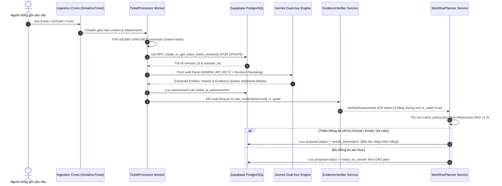
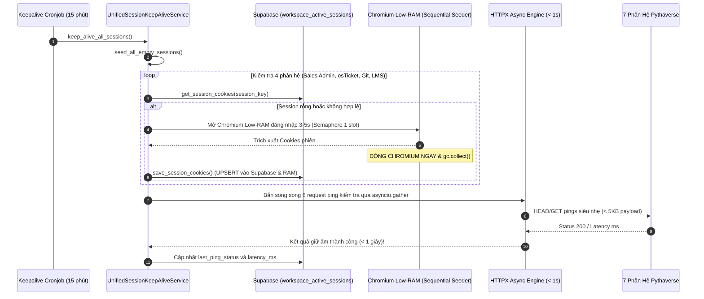
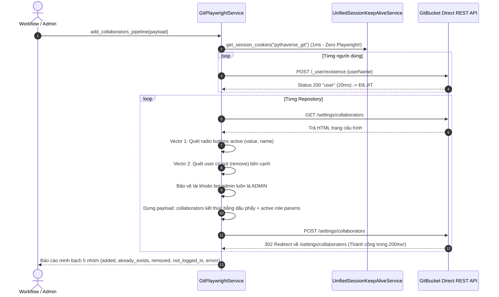

# 🚀 BÁCH KHOA TOÀN THƯ KIẾN TRÚC HỆ THỐNG PTV-TASKS-ADMINISTRATOR
## Pythaverse Central Admin & Automation Hub (Enterprise Single Source of Truth)

> **Tài liệu kiến trúc chuẩn mực:** Bản tài liệu này được biên soạn độc quyền và toàn diện để hệ thống hóa 100% mã nguồn, kiến trúc đa nền tảng, cơ chế an toàn bất biến, các dịch vụ tự động hóa, 23 bảng CSDL Supabase, toàn bộ 48+ module Backend FastAPI và 14 trang chức năng Frontend SPA của dự án **`ptv-tasks-administrator`**.  
> **Cam kết thiết kế:** Bất kỳ AI Coder hay kỹ sư hệ thống mới nào chỉ cần đọc duy nhất tệp tin này là thấu suốt toàn bộ dự án, hiểu rõ vai trò của từng tệp tin, cách thức hoạt động của từng hàm, cấu trúc tham số đầu vào/đầu ra, luồng dữ liệu liên thông, kiến trúc **Hybrid RPA-API Architecture kết hợp Ephemeral Session Caching**, **Cỗ máy Unified Session Keep-Alive & Auto-Seeding (v2.0)**, **Động cơ Git Fast Engine 2-Vector DOM Parser**, **Triết lý Lập Kế Hoạch Non-Destructive DAG** và các ràng buộc an toàn tuyệt đối mà không cần phải mở xem từng file đơn lẻ trong dự án.

---

## 📌 THÔNG TIN BẢN QUYỀN & TÁC GIẢ SÁNG LẬP

- **Dự án:** `ptv-tasks-administrator` (Pythaverse Central Admin & Automation Hub)
- **Tác giả & Kiến trúc sư trưởng:** **Nguyễn Mạnh Hùng** (*Lead AI Engineer & Automation Architect – DTT Corporation / Pythaverse Ecosystem*)
- **GitHub:** [`https://github.com/hungnm-1225`](https://github.com/hungnm-1225)
- **Email:** `hungnm@dtt.vn` / `hung.nguyenmanh@dtt.vn`
- **Hệ sinh thái:** [Pythaverse Space](https://pythaverse.space)
- **Phiên bản tài liệu:** `v3.8.0 Master Enterprise Comprehensive Edition` (Cập nhật ngày 22 tháng 09 năm 2026)

---

## 📑 MỤC LỤC TỔNG QUAN

1. [PHẦN I: TẦM NHÌN HỆ THỐNG & SÁU NGUYÊN TẮC BẤT BIẾN (SAFETY INVARIANTS)](#-phần-i-tầm-nhìn-hệ-thống--sáu-nguyên-tắc-bất-biến-safety-invariants)
2. [PHẦN II: 7 PHÂN HỆ NGHIỆP VỤ PYTHAVERSE (DOMAIN TRUTH) & KIẾN TRÚC HYBRID RPA-API](#-phần-ii-7-phân-hệ-nghiệp-vụ-pythaverse-domain-truth)
3. [PHẦN III: STACK CÔNG NGHỆ, HẠ TẦNG ĐA NỀN TẢNG & THÔNG SỐ VẬN HÀNH](#-phần-iii-stack-công-nghệ-hạ-tầng-đa-nền-tảng--thông-số-vận-hành)
4. [PHẦN IV: SƠ ĐỒ CẤU TRÚC THƯ MỤC MONOREPO TỔNG THỂ & VAI TRÒ TỪNG TỆP TIN](#-phần-iv-sơ-đồ-cấu-trúc-thư-mục-monorepo-tổng-thể--vai-trò-từng-tệp-tin)
5. [PHẦN V: GIẢI PHẪU CHI TIẾT TỪNG FILE, CLASS & HÀM XỬ LÝ BACKEND (FASTAPI 0.115)](#-phần-v-giải-phẫu-chi-tiết-từng-file-class--hàm-xử-lý-backend-fastapi-0115)
   - [5.1. Entrypoint, Lifespan & 7 Crons Lệch Pha (`app/main.py`)](#51-entrypoint-lifespan--7-crons-lệch-pha-appmainpy)
   - [5.2. Lõi Hệ Thống Core (`app/core/`) – Dual-Key AI, OCC Lease, Concurrency & Cron Telemetry](#52-lõi-hệ-thống-core-appcore)
   - [5.3. Định Nghĩa Schemas & Models Pydantic (`app/models/`)](#53-định-nghĩa-schemas--models-pydantic-appmodels)
   - [5.4. Tri Thức Nghiệp Vụ & Policy Registry (`app/brain/`)](#54-tri-thức-nghiệp-vụ--policy-registry-appbrain)
   - [5.5. Cổng Giao Tiếp 10 Router REST API Endpoints (`app/api/v1/endpoints/`)](#55-cổng-giao-tiếp-10-router-rest-api-endpoints-appapiv1endpoints)
   - [5.6. Dịch Vụ Nghiệp Vụ & RPA Services (`app/services/`)](#56-dịch-vụ-nghiệp-vụ--rpa-services-appservices)
     - [5.6.1. Dịch Vụ Phân Tách Email Thread (`email_thread_service.py`)](#561-dịch-vụ-phân-tách-email-thread-email_thread_servicepy)
     - [5.6.2. Thẩm Định Bằng Chứng & Chuẩn Hóa Fact (`evidence_verifier.py` & `request_fact_normalizer.py`)](#562-thẩm-định-bằng-chứng--chuẩn-hóa-fact-evidence_verifierpy--request_fact_normalizerpy)
     - [5.6.3. Bộ Lập Kế Hoạch & Thực Thi DAG (`workflow_planner.py` & `workflow_executor.py`)](#563-bộ-lập-kế-hoạch--thực-thi-dag-workflow_plannerpy--workflow_executorpy)
     - [5.6.4. Gói Xử Lý Bảng Tính Chuyên Biệt (`app/services/excel/` & `cof_excel_service.py`)](#564-gói-xử-lý-bảng-tính-chuyên-biệt-appservicesexcel--cof_excel_servicepy)
     - [5.6.5. Gói RPA Modularized School Workspace (`app/services/workspace/`)](#565-gói-rpa-modularized-school-workspace-appservicesworkspace)
     - [5.6.6. Phả Hệ Trường Học & Két Sắt Fernet (`workspace_lineage_service.py`)](#566-phả-hệ-trường-học--két-sắt-fernet-workspacelineage_servicepy)
     - [5.6.7. Cỗ Máy Hybrid Moodle PLearn V3.6 (`playwright_service.py`)](#567-cỗ-máy-hybrid-moodle-plearn-v36-playwright_servicepy)
     - [5.6.8. Pythaverse Git Fast Engine Hybrid V3.6 (`git_service.py`)](#568-pythaverse-git-fast-engine-hybrid-v36-gitservicepy)
     - [5.6.9. Keycloak 2-Tier Hybrid (`keycloak_service.py`)](#569-keycloak-2-tier-hybrid-keycloak_servicepy)
     - [5.6.10. Cỗ Máy Giữ Ấm Tập Trung & Gieo Mầm Phiên (`session_keepalive_service.py`)](#5610-cỗ-máy-giữ-ấm-tập-trung--gieo-mầm-phiên-session_keepalive_servicepy)
     - [5.6.11. Các Dịch Vụ Phân Hệ Ngoài (osTicket, Site Monitor, Google Workspace, GitHub)](#5611-các-dịch-vụ-phân-hệ-ngoài-osticket-site-monitor-google-workspace-github)
   - [5.7. Bộ Điều Phối Workers Chạy Ngầm (`app/workers/`)](#57-bộ-điều-phối-workers-chạy-ngầm-appworkers)
   - [5.8. Kịch Bản Bổ Trợ CLI & Scripts Kiểm Thử Master (`backend/scripts/` & `backend/*.py`)](#58-kịch-bản-bổ-trợ-cli--scripts-kiểm-thử-master-backendscripts--backendpy)
   - [5.9. Bộ Kiểm Thử An Toàn Hermetic Pytest Suite (`backend/tests/`)](#59-bộ-kiểm-thử-an-toàn-hermetic-pytest-suite-backendtests)
6. [PHẦN VI: GIẢI PHẪU CHI TIẾT GIAO DIỆN FRONTEND SPA (REACT 19 + VITE 6 + TAILWIND CSS V4)](#-phần-vi-giải-phẫu-chi-tiết-giao-diện-frontend-spa-react-19--vite-6--tailwind-css-v4)
   - [6.1. Kiến Trúc Lõi Frontend SPA, Lazy Chunks & Client Cache Purge](#61-kiến-trúc-lõi-frontend-spa-lazy-chunks--client-cache-purge)
   - [6.2. Design System Tokens: Bento Grid & Enterprise Pastel OKLCH (`index.css`)](#62-design-system-tokens-bento-grid--enterprise-pastel-oklch-indexcss)
   - [6.3. Lớp Giao Tiếp Mạng, Kiểu Dữ Liệu & Bảo Mật JWT (`src/lib/`, `src/types/`, `src/context/`)](#63-lớp-giao-tiếp-mạng-kiểu-dữ-liệu--bảo-mật-jwt-srclib-srctypes-srccontext)
   - [6.4. Giải Phẫu Chi Tiết 14 Trang Chức Năng & Sub-Components (`src/features/`)](#64-giải-phẫu-chi-tiết-14-trang-chức-năng--sub-components-srcfeatures)
     - [6.4.1. AI Workflow Console V3.1 & Trình Xem Tệp Đa Định Dạng (`src/features/inbox/`)](#641-ai-workflow-console-v31--trình-xem-tệp-đa-định-dạng-srcfeaturesinbox)
     - [6.4.2. Siêu Xưởng Tự Động Hóa RPA Modularized Hub 13 Modules (`src/features/studio/`)](#642-siêu-xưởng-tự-động-hóa-rpa-modularized-hub-13-modules-srcfeaturesstudio)
     - [6.4.3. Quản Trị Phả Hệ Trường Học & Két Sắt Vault (`src/features/hierarchy/`)](#643-quản-trị-phả-hệ-trường-học--két-sắt-vault-srcfeatureshierarchy)
     - [6.4.4. 11 Trang Nghiệp Vụ & Quản Trị Khác](#644-11-trang-nghiệp-vụ--quản-trị-khác)
7. [PHẦN VII: CƠ SỞ DỮ LIỆU SUPABASE POSTGRESQL 16 (23 BẢNG & PROVENANCE HẠ TẦNG)](#-phần-vii-cơ-sở-dữ-liệu-supabase-postgresql-16-23-bảng--provenance-hạ-tầng)
8. [PHẦN VIII: SƠ ĐỒ LUỒNG DỮ LIỆU END-TO-END (MERMAID SEQUENCE & STATE MACHINES)](#-phần-viii-sơ-đồ-luồng-dữ-liệu-end-to-end-mermaid-sequence--state-machines)
9. [PHẦN IX: TỪ ĐIỂN CHỈ MỤC HÀM TOÀN DIỆN (FUNCTION-TO-FILE MASTER INDEX)](#-phần-ix-từ-điển-chỉ-mục-hàm-toàn-diện-function-to-file-master-index)
10. [PHẦN X: CẨM NANG KHẮC PHỤC SỰ CỐ & FAQ DÀNH CHO AI CODER](#-phần-x-cẩm-nang-khắc-phục-sự-cố--faq-dành-cho-ai-coder)
11. [PHẦN XI: CẨM NANG ĐỊNH TUYẾN CHUYÊN GIA AI (INTELLIGENT AGENT ROUTING PLAYBOOK)](#-phần-xi-cẩm-nang-định-tuyến-chuyên-gia-ai-intelligent-agent-routing-playbook)
12. [PHẦN XII: HƯỚNG DẪN KHỞI CHẠY, CẤU HÌNH BIẾN MÔI TRƯỜNG & KIỂM THỬ TỰ ĐỘNG](#-phần-xii-hướng-dẫn-khởi-chạy-cấu-hình-biến-môi-trường--kiểm-thử-tự-động)

---

## 🏛️ PHẦN I: TẦM NHÌN HỆ THỐNG & SÁU NGUYÊN TẮC BẤT BIẾN (SAFETY INVARIANTS)

`ptv-tasks-administrator` được định vị là **Trung tâm Thần kinh Điều phối & Tự Động Hóa Tập Trung (Pythaverse Central Admin & Automation Hub)** cho toàn bộ tập đoàn DTT Corporation và hệ sinh thái giáo dục công nghệ Pythaverse. Hệ thống tiếp nhận yêu cầu từ đa kênh (Gmail, Google Forms, osTicket), sử dụng AI nhận thức kép có bằng chứng để lập kế hoạch công việc dạng đồ thị có hướng không chu trình (DAG), trình qua Quản trị viên duyệt (Human-in-the-Loop) và tự động thực thi xuống 7 phân hệ qua mạng lưới bot RPA và Direct REST APIs.

```
                  ┌────────────────────────────────────────────────────────┐
                  │                 ĐẦU VÀO ĐA KÊNH (INGESTION)             │
                  │   [Gmail Workspace]  [Google Forms]  [OS Ticket SCP]   │
                  └───────────────────────────┬────────────────────────────┘
                                              │ Ingestion Crons (Lệch pha: +15s, +45s, +75s...)
                                              ▼
┌──────────────────────────────────────────────────────────────────────────────────────────┐
│                      LÕI TRUNG TÂM PTV-TASKS-ADMINISTRATOR (BACKEND FASTAPI)             │
│                                                                                          │
│  ┌─────────────────────────┐   ┌───────────────────────────┐   ┌──────────────────────┐  │
│  │ Dual-Path Cognition AI  │   │ EvidenceVerifier Service  │   │  Human-in-the-Loop   │  │
│  │ • Summary (Key 1)       │──▶│ • raw_content[start:end]  │──▶│  Safety Gate         │  │
│  │ • Facts (Key 2)         │   │ • Substring Calibration   │   │  JWT Authenticated   │  │
│  │ • Fast-Path Fallback    │   │ • Attachment Fail-Closed  │   │  (@dtt.vn Whitelist) │  │
│  └─────────────────────────┘   └─────────────┬─────────────┘   └──────────────────────┘  │
│                                              │ Verified Facts                            │
│                                              ▼                                           │
│                                ┌───────────────────────────┐                             │
│                                │  Registry Policy Engine   │                             │
│                                │  • intent_policy.json     │                             │
│                                │  • Zero-Mockup Invariant  │                             │
│                                │  • Non-Destructive DAG    │                             │
│                                │  • Dual-Freeze Proposal   │                             │
│                                └─────────────┬─────────────┘                             │
│                                              │ Phê duyệt (Approved)                      │
│                                              ▼                                           │
│  ┌────────────────────────────────────────────────────────────────────────────────────┐  │
│  │                 TOPOLOGICAL DAG EXECUTOR & BOT WORKERS (KAHN ALGORITHM)            │  │
│  │  • OCC Workflow Lease Claiming via updated_at (Chống Race-Condition tuyệt đối)     │  │
│  │  • Khối try...finally cam kết 100% thu hồi Lease và tài nguyên Semaphore            │  │
│  │  • Append-Only Audit Trail (workflow_execution_events gắn proposal_id bất biến)    │  │
│  │  • BFS Graph Traversal: Reset thông minh toàn bộ downstream dependencies khi retry │  │
│  └────────────────────────────────────────────────────────────────────────────────────┘  │
│                                              │                                           │
│  ┌────────────────────────────────────────────────────────────────────────────────────┐  │
│  │            MA TRẬN 8 BỘ NHỚ ĐỆM IN-MEMORY RAM & UNIFIED SESSION KEEPALIVE          │  │
│  │    Courses (10m) | Workspace (15m) | Board (5m) | Bots (15s) | Tasks (60s)         │  │
│  │    Tickets (60s) | Monitor (30s)   | Reports (60s) | Keep-Alive Supabase Vault     │  │
│  └────────────────────────────────────────────────────────────────────────────────────┘  │
└──────────────────────────────────────────────┬───────────────────────────────────────────┘
                                               │ Thực thi tự động
                                               ▼
                  ┌────────────────────────────────────────────────────────┐
                  │               HỆ SINH THÁI ĐÍCH (EXECUTION TARGETS)    │
                  │ School Workspace | PLearn LMS | Keycloak | Pythaverse Git | GitHub │
                  └───────────────────────────┴────────────────────────────┘
```

### Sáu Nguyên Tắc Thiết Kế Bất Biến (Absolute Safety Invariants):

1. **Evidence-Based & Offset Verification Invariant (Không Bằng Chứng ➔ Không Action):**
   - Mọi ý định vận hành trích xuất bắt buộc phải có đoạn trích dẫn nguyên văn (`quote`) kèm định vị ký tự (`start_offset`, `end_offset`) và mã revision `source_revision_id`.
   - `EvidenceVerifierService` đối soát từng ký tự: $\text{raw\_content}[\text{start}:\text{end}] == \text{quote}$.
   - Nếu trích dẫn bị xê dịch vị trí do định dạng khoảng trắng hoặc ngắt dòng, hệ thống áp dụng thuật toán **Substring Calibration** trong phạm vi 160 ký tự. Nếu quote hoàn toàn không tồn tại hoặc sai lệch revision, intent đó bị gạch bỏ và outcome hạ xuống `needs_information`.
2. **Attachment Evidence Fail-Closed Invariant (File đính kèm chưa đối soát ➔ Không Action):**
   - Các trích dẫn có `source_kind == "attachment_extract"` tạm thời bị gắn cờ `is_verified = False` (chuyển sang `needs_information`).
   - Nghiêm cấm tuyệt đối việc dùng text thân email để đối soát trích dẫn từ file đính kèm khi chưa qua hạ tầng bóc tách bất biến.
3. **Zero-Mockup Invariant & Triết Lý Non-Destructive DAG v7.0:**
   - Nghiêm cấm sử dụng bất kỳ giá trị mặc định giả lập nào (`SWRP 4-12`, count=4, mật khẩu `Ptv@2026`).
   - **Đặc biệt: Khai tử hoàn toàn default Git role `GUEST` và default LMS role `student` khi thiếu ngữ cảnh**. Yêu cầu cấp quyền Git không nêu rõ vai trò bắt buộc sinh `missing_requirement: git_role`, yêu cầu ghi danh LMS không rõ vai trò không tự gán `student`, lập tức chuyển trạng thái sang `needs_information` và chặn phê duyệt thực thi.
   - **Triết lý Non-Destructive DAG:** Khi ở trạng thái `needs_information`, hệ thống **không bao giờ xóa sạch các bước về 0**. Thay vào đó, bộ lập kế hoạch vẫn bảo tồn và trực quan hóa các bước tiềm năng trên giao diện UI kèm nhãn cảnh báo rõ ràng những thông tin còn thiếu, giúp Quản trị viên nắm bắt bức tranh toàn cảnh thay vì nhìn thấy một khung trống rỗng vô nghĩa.
4. **Dual-Freeze Proposal & Immutable Provenance Linkage:**
   - Khi Admin phê duyệt, hệ thống đóng băng đồng thời cả `workflow_proposals.frozen_plan` và `automation_workflows.steps` qua Stored Procedure nguyên tử `approve_workflow_proposal`.
   - Toàn bộ execution events trong `workflow_execution_events` bắt buộc phải mang theo `proposal_id`. Tuyệt đối không cho phép chỉnh sửa workflow hay proposal sau khi đã ở trạng thái `approved`.
5. **Real JWT Identity Enforcement (Chống Mạo Danh Người Phê Duyệt):**
   - Bỏ qua trường `approved_by` do Frontend gửi lên trong payload body.
   - Danh tính người duyệt được giải mã trực tiếp từ Bearer JWT Token qua dependency `get_current_user_email` và bắt buộc thuộc whitelist domain `@dtt.vn`.
6. **Optimistic Concurrency Control (OCC) Lease & Concurrency Safeguard (Render 512MB RAM):**
   - Chiếm Lease độc quyền cấp Workflow qua `TaskCoordinator.claim_workflow_lease()` sử dụng kiểm soát đồng thời lạc quan (OCC) trên trường `updated_at`. Hàm `update_workflow_heartbeat()` ném `RuntimeError` dừng khẩn cấp worker nếu bị cướp lease.
   - Khóa cứng `GLOBAL_PLAYWRIGHT_SEMAPHORE = asyncio.Semaphore(1)` kết hợp ContextVar `_PLAYWRIGHT_SLOT_HOLDER` chống deadlock re-entrancy khi hàm cha con cùng gọi acquire slot.
   - Mọi coroutine chạy Playwright hoặc quét ngầm bắt buộc gọi `gc.collect()` và `force_kill_zombie_chromium()` trong khối `finally`.
   - 7 Crons trong `main.py` xuất phát lệch pha (+15s, +30s, +45s, +75s, +150s, +240s, +900s) kết hợp cơ chế Circuit Breaker tự động nhường slot (`CronSlotYieldException`) để ngăn chặn triệt để nguy cơ tràn RAM trên hạ tầng Render 512MB.

---

## 🌐 PHẦN II: 7 PHÂN HỆ NGHIỆP VỤ PYTHAVERSE (DOMAIN TRUTH) & KIẾN TRÚC HYBRID RPA-API

Hệ sinh thái Pythaverse vận hành trên 7 phân hệ độc lập. Nhằm tối ưu hóa triệt để tài nguyên máy chủ Render (**trần 512MB RAM**) và triệt tiêu hoàn toàn nguy cơ Timeout 15s/30s do click chuột UI, hệ sinh thái áp dụng **Kiến Trúc Hybrid RPA-API kết hợp Ephemeral Session Caching**:
- **Playwright đóng vai Auth Gateway (không phải Automation Engine):** Chỉ khởi chạy Chromium siêu nhẹ (18 flags Low-RAM) trong đúng 3–5 giây để thực hiện đăng nhập, vượt qua các cổng xác thực phức tạp (Keycloak OIDC, WordPress SSO), bốc toàn bộ Cookies phiên, `window.user` identity, `sesskey` Moodle, hoặc JWT token.
- **Giải phóng Chromium tức thì (Ephemeral Lifecycle):** Ngay sau khi bốc được Session Dictionary, tiến trình Chromium được đóng ngay lập tức (`await browser.close()`), gọi `gc.collect()` và `force_kill_zombie_chromium()`, trả bộ nhớ RAM máy chủ về mức an toàn (< 25MB).
- **Hạ tầng thực thi là Async Non-blocking HTTP Engine (HTTPX):** 100% các thao tác nghiệp vụ phức tạp (tạo đơn hàng, phân bổ license, tạo group, ghi danh học sinh/giáo viên đa môn học, check JIT existence 20ms, thêm/gỡ git collaborator 200ms) được thực thi bởi HTTPX Async với tốc độ phản hồi từ 20ms đến 300ms.
- **Unified Session Keep-Alive & Auto-Seeding (v2.0):** Một cỗ máy giữ ấm tập trung lưu trữ phiên đăng nhập bền vững trên bảng `workspace_active_sessions` của Supabase, tự động gieo mầm tuần tự khi phát hiện bảng rỗng và định kỳ ping giữ ấm 7 phân hệ mỗi 15 phút bằng HTTPX thuần (< 1s, zero Playwright).

| STT | Phân Hệ | Tên Miền / Giao Thức | Core Platform | Vai Trò Kỹ Thuật & Nghiệp Vụ Cốt Lõi | Phương Thức Tự Động Hóa (Hybrid RPA-API) |
|---|---|---|---|---|---|
| **1** | **School Workspace** | `https://pythaverse.space` | React MUI / PHP WordPress REST APIs | Quản trị phân cấp 3 tầng (`Distributor` ➔ `Partner` ➔ `School`). Cấp phát License Pool, bù Contract, nộp batch tài khoản số lượng lớn qua Bulk Account Creation, phân bổ môn học & Group. | **Hybrid RPA-API (Ephemeral Session):** Đọc session Sales Admin ấm nóng từ `session_keepalive_service` (1ms) hoặc Playwright Auth Gateway bốc Session trong 3s ➔ Đóng Chromium ➔ HTTPX Async Engine gọi trực tiếp PHP endpoints (`schoolCreateOrder.php`, `updateStatusOrder.php`, `createOrderSale.php`, `updateStatusPartnerOrder.php`, `uploadFileAccount.php`, `createMultipleUser.php`, `enrolMultipleUser.php`, `createGroup.php`, `updateUser.php`). Bơm DOM JS bảo toàn 100% ký tự đặc biệt. |
| **2** | **PLearn LMS** | `https://learn.pythaverse.space` | Moodle LMS (PHP / MariaDB / Edwiser RemUI) | Cổng đào tạo Moodle LMS. Quản lý danh mục khóa học (`SWRP`, `IR`, `ASP`...) và ghi danh tài khoản theo Vai trò (`Student` - 9, `Teacher` - 7, `Manager` - 1). | **Hybrid RPA-API (Moodle Engine V3.6):** Đọc session từ Keep-Alive hoặc Playwright SSO Keycloak (3s) trích xuất Cookie & `sesskey` ➔ Đóng Chromium ➔ Gọi Direct HTTPX WebService (`core_enrol_manual_enrol_users`, `core_group_create_groups`, `core_group_add_group_members`). Tự động chuẩn hóa username qua Keycloak. Fallback 2 nhịp trên `td.cell.c2`. |
| **3** | **PGit Repos** | `https://git.pythaverse.space` | GitBucket Server (Scala / JVM / SQLite) | Máy chủ lưu trữ mã nguồn dự án học sinh & giáo viên. Quản lý Collaborators tại `/settings/collaborators`. Yêu cầu tài khoản đăng nhập SSO Keycloak ít nhất 1 lần để kích hoạt cơ chế JIT (Just-In-Time). | **Git Fast Engine Hybrid V3.6 (2-Vector DOM Parser):** Sàng lọc người dùng qua Keycloak Gateway, đọc session từ Keep-Alive hoặc Playwright bốc Session OIDC (3s) ➔ Đóng Chromium ➔ Check JIT tồn tại qua `POST /_user/existence` (20ms) ➔ Bóc tách 2-vector radio active + remove anchor ➔ Bảo vệ bot admin ➔ Bắn 1 request POST lưu collaborators (200ms) kèm active role params. |
| **4** | **Keycloak Auth IDP** | `https://eid.pythaverse.space` | Keycloak (Java / WildFly / PostgreSQL) | Cổng xác thực định danh tập trung OpenID Connect / OAuth2 (Realm: `master` / `idp`). Reset mật khẩu, kích hoạt/khóa tài khoản và tra cứu email chính thức. | **2-Tier Hybrid:** Direct REST API (300ms qua HTTPX Async với In-Memory Token Caching, tự động tái sử dụng Admin Token) ➔ Playwright RPA Fallback khi lỗi API (`keycloak_service.py`). |
| **5** | **Leanbot IDE** | `https://ide.pythaverse.space` | Blockly / Web Bluetooth BLE | Web IDE lập trình khối kéo thả Blockly kết nối Robot Leanbot qua Bluetooth BLE. | Synthetic Monitoring Uptime & Latency (`site_monitor_service.py`). |
| **6** | **Support Helpdesk** | `https://support.pythaverse.space` | osTicket (PHP / MySQL) | Hệ thống tiếp nhận sự cố kỹ thuật osTicket. Cào dữ liệu định kỳ qua Playwright Headless session và chuyển giao cho Canonical Intake. | Đọc session từ Keep-Alive hoặc Playwright headless scraper cào vé, custom form fields & files đính kèm (`osticket_service.py`). |
| **7** | **PContest** | `https://contest.pythaverse.space` | Next.js / Python Judge | Hệ thống tổ chức thi đấu lập trình trực tuyến, quản lý Leaderboard và chấm điểm tự động. | Synthetic Monitoring Uptime & Latency (`site_monitor_service.py`). |

---

## 🛠️ PHẦN III: STACK CÔNG NGHỆ, HẠ TẦNG ĐA NỀN TẢNG & THÔNG SỐ VẬN HÀNH

### 1. Thế Trận Hạ Tầng Đa Nền Tảng (Multi-Platform Topology)
- **Vercel**: Máy chủ Edge CDN lưu trữ ứng dụng Frontend React 19 SPA (14 trang chức năng). Tích hợp tệp [`frontend/vercel.json`](file:///c:/Users/dtt/Desktop/Project/ptv-tasks-administrator/frontend/vercel.json) để cấu hình rewrite client-side routing (`/* -> /index.html`). Đóng gói siêu tốc với Dynamic Chunk Splitting qua Vite 6.
- **Render.com**: Máy chủ khởi chạy Backend FastAPI trên môi trường tài nguyên nghiêm ngặt (**512MB RAM Free/Starter Tier**). Cấu hình qua [`render.yaml`](file:///c:/Users/dtt/Desktop/Project/ptv-tasks-administrator/render.yaml) và [`backend/Dockerfile`](file:///c:/Users/dtt/Desktop/Project/ptv-tasks-administrator/backend/Dockerfile). Áp dụng **Kiến Trúc Hybrid RPA-API kết hợp Ephemeral Session Caching**, khóa cứng Semaphore 1 slot, thu hồi bộ nhớ `gc.collect()` và tiêu diệt Chromium zombie.
- **Supabase**: Cơ sở dữ liệu PostgreSQL 16 (**23 bảng chuyên biệt** bao gồm 21 bảng nghiệp vụ + 2 bảng session/telemetry persistence, RLS `@dtt.vn`, Storage Bucket `ticket-attachments`, Két sắt mã hóa Fernet, và 2 PostgreSQL Stored Procedures nguyên tử: `create_or_get_inbox_ticket_revision` và `approve_workflow_proposal`).
- **Google Cloud Console**: Quản trị tài khoản dịch vụ (Service Account) tích hợp bộ ba Gmail Workspace API, Google Sheets API, Google Docs API và Google Drive API.
- **UptimeRobot**: Giám sát ngoại vi Synthetic Ping Uptime (chu kỳ 5 phút) kiêm nhiệm vụ giữ ấm (keep-warm ping) cho Render chống ngủ đông.
- **GitHub**: Quản lý mã nguồn Monorepo, GitHub Actions CI/CD và Dispatcher Issue tự động vào Private Repositories qua Personal Access Token (`GITHUB_PAT`).

### 2. Chi Tiết Backend Stack
- **Ngôn ngữ & Runtime:** Python `3.11.x` / `3.12.x`
- **Web Framework:** FastAPI `0.115.8` (Asynchronous ASGI)
- **Validation Engine:** Pydantic `2.10.6` (Strict Schema Validation & Settings Management qua `pydantic-settings: 2.7.1`)
- **Kiến trúc Tự động hóa:** **Hybrid RPA-API Architecture với Ephemeral Session Caching** (Playwright Auth Gateway + HTTPX Async Non-blocking Engine).
- **RPA Engine:** Playwright Async Chromium (`playwright: 1.50.0`) kết hợp bộ 18 cờ tối ưu `LOW_RAM_CHROMIUM_ARGS` và chặn media/trackers.
- **Lập lịch chạy ngầm:** APScheduler `3.10.4` (`AsyncIOScheduler`) với **7 Crons so le lệch pha** (+15s, +30s, +45s, +75s, +150s, +240s, +900s).
- **In-Memory Caching & Telemetry:** Ma trận 8 In-Memory RAM Caches (`BoundedMemoryCache` phân tầng LRU + TTL, phản hồi 1ms, RAM <= 40MB) + Registry Telemetry [`cron_telemetry.py`](file:///c:/Users/dtt/Desktop/Project/ptv-tasks-administrator/backend/app/core/cron_telemetry.py) đồng bộ Supabase `cron_telemetry_state`.
- **Giữ Ấm Phiên Tự Động:** [`session_keepalive_service.py`](file:///c:/Users/dtt/Desktop/Project/ptv-tasks-administrator/backend/app/services/session_keepalive_service.py) gieo mầm tuần tự 4 phân hệ bằng Playwright 3s, lưu vào `workspace_active_sessions`, và ping giữ ấm 7 phân hệ bằng HTTPX thuần (< 1s).
- **Trí tuệ nhân tạo (AI):** `google-generativeai: 0.8.4` & `google-genai: 1.2.0` tích hợp Dual-Key Engine (`GEMINI_API_KEY` & `GEMINI_API_KEY2`), Cross-Key Failover, chuỗi 10 models fallback (`gemini-3.8-flash` ➔ `gemini-3.7-flash` ➔ `gemini-3.5-flash-lite`...), kết hợp bộ **Deterministic Fast-Path Triage v1.2.0**.
- **Mã Hóa & Bảo Mật:** `cryptography` (Fernet 32-byte symmetric encryption), `PyJWT: 2.10.1` (giải mã Supabase Bearer JWT), `python-keycloak: 5.1.0`.
- **Xử Lý Bảng Tính:** `openpyxl >= 3.1.2` (Chuyên biệt hóa 4 dịch vụ trong `app.services.excel`).
- **Mạng Bất Đồng Bộ:** `httpx: 0.28.1`, `requests: 2.32.3`, `nest-asyncio >= 1.6.0`.
- **Kiểm Thử Hồi Quy:** `pytest: 8.3.4` / `anyio` (Hermetic in-memory test suite).

### 3. Chi Tiết Frontend Stack
- **Node.js**: `20.x LTS` / `22.x LTS`
- **React**: `19.0.0` (React 19 Functional Hooks, Concurrent Rendering, Suspense Code Splitting, `createPortal` modal isolation)
- **Build Tool:** Vite `6.2.0`
- **TypeScript**: `5.7.2` (`strict: true`, Strict Type Checking)
- **Tailwind CSS**: `4.0.0` (Kiến trúc Design Tokens hiện đại `@import "tailwindcss";` kết hợp Enterprise Pastel OKLCH qua `@theme inline`)
- **Router:** `react-router-dom: 7.18.2` (14 Trang Quản trị & Công vụ)
- **Animations:** `motion: 13.1.1` (Framer Motion v13)
- **Biểu đồ:** `recharts: 2.15.0`
- **Lucide React**: `0.475.0` (Icon Library đồng nhất)
- **SheetJS (`xlsx`)**: `0.18.5` (Xử lý bóc tách & hiển thị bảng tính Excel tương tác client-side, đa tab sheet switching)
- **Supabase JS Client**: `@supabase/supabase-js: 2.48.0` (Auth & Realtime Client)
- **Sonner**: `2.0.8` (Toast Notification thích ứng Theme)
- **Styling Bổ Trợ:** `styled-components: 6.5.3`, `clsx: 2.1.1`, `tailwind-merge: 3.0.1`

---

## 📁 PHẦN IV: SƠ ĐỒ CẤU TRÚC THƯ MỤC MONOREPO TỔNG THỂ & VAI TRÒ TỪNG TỆP TIN

```
ptv-tasks-administrator/
├── render.yaml                                 # Cấu hình triển khai Docker Web Service trên Render.com
├── package.json                                # Cấu hình dependencies root monorepo
├── package-lock.json                           # Khóa phiên bản dependencies root
├── skills-lock.json                            # Khóa cấu hình plugin & agent skills
├── GEMINI.md                                   # System Instructions & Quy chuẩn tác nghiệp của AI Assistant (v3.8.0)
├── Blueprint.md                                # Master Blueprint Đặc Tả Kỹ Thuật Tổng Thể v2.0.0
├── design.md                                   # Đặc tả UI/UX Design System Enterprise Pastel OKLCH
├── README.md                                   # Bách khoa toàn thư kiến trúc hệ thống (Single Source of Truth)
├── backend/                                    # Ứng dụng Backend FastAPI (Python 3.11/3.12)
│   ├── app/
│   │   ├── api/                                # REST API Routers
│   │   │   └── v1/
│   │   │       ├── router.py                   # Aggregator router gom 10 endpoints
│   │   │       └── endpoints/                  # 10 Router chuyên biệt
│   │   │           ├── workflows.py            # Safety Gate, Dual Freeze, DAG Execution, Depends(JWT)
│   │   │           ├── tickets.py              # Canonical Intake, Re-summarize, Re-assess Intent
│   │   │           ├── tasks.py                # Bot Task Queue, run_approved_task_worker, Payload Edit
│   │   │           ├── bots.py                 # Bot Status, Realtime Logs GMT+7 với Taxonomy Filter
│   │   │           ├── board.py                # Multi-board Kanban (Boards, Columns, Cards, DND)
│   │   │           ├── courses.py              # Dual Catalogs (Workspace & LMS), Git Repo Links
│   │   │           ├── workspace.py            # Phả hệ 480 trường, Scanner Cache, Bóc tách COF, Prewarm Sessions
│   │   │           ├── monitor.py              # Synthetic Ping 10 Sites, Auth Matrix, Downtime Logs
│   │   │           ├── github.py               # AI Bug Triage ➔ GitHub Issue Dispatcher
│   │   │           └── reports.py              # KPI Summary, Category Ratios, Daily Trends, Export
│   │   ├── brain/                              # Tri thức nghiệp vụ & Policy Registry
│   │   │   ├── capabilities.json               # 19 Capabilities hệ thống (Schemas, Handlers, Risk)
│   │   │   ├── intent_policy.json              # Bảng chính sách tất định (v1.3.0)
│   │   │   ├── dependency_rules.json           # Quy tắc sắp xếp Tô-pô & DAG dependencies
│   │   │   ├── workflow_rules.json             # Archetypes luồng công việc mẫu
│   │   │   ├── knowledge_base.json             # Tri thức kỹ thuật của 7 phân hệ Pythaverse
│   │   │   └── prompts/                        # Versioned Prompts
│   │   │       ├── ticket_summary_v1.txt       # Prompt Soft Summary cho Inbox (Key 1)
│   │   │       └── intent_extraction_v1.txt    # Prompt Operational Fact Extraction có Offset (Key 2)
│   │   ├── core/                               # Lõi hệ thống & Quản trị tài nguyên
│   │   │   ├── config.py                       # Settings 25+ envs, Pydantic BaseSettings, Time utilities GMT+7
│   │   │   ├── cache_policy.py                 # BoundedMemoryCache (3 Tiers, LRU, TTL, RAM <= 40MB)
│   │   │   ├── cron_telemetry.py               # Quản lý Telemetry chạy ngầm & persist Supabase (cron_telemetry_state)
│   │   │   ├── playwright_manager.py           # Semaphore 1 Slot, Re-entrancy Lock, Zombie Killer, Circuit Breaker
│   │   │   ├── security.py                     # Whitelist Domain @dtt.vn, Bearer JWT Auth Dependency
│   │   │   ├── supabase.py                     # Singleton client Supabase (get_supabase_client)
│   │   │   ├── task_coordinator.py             # OCC Workflow Lease Claiming via updated_at, Heartbeat
│   │   │   └── gemini.py                       # Dual-Key AI, Cross-Key Failover, Fast-Path Triage
│   │   ├── models/                             # Schemas Pydantic Strict Validation
│   │   │   ├── intent.py                       # EvidenceSpan (offsets), ExtractedEntity, TypedEntities
│   │   │   ├── workflow.py                     # WorkflowStepDraft (is_manual), WorkflowApprovalRequest, ValidationResult
│   │   │   ├── ticket.py                       # InboxTicket schemas
│   │   │   ├── task.py                         # BotAutomationTask schemas
│   │   │   └── template.py                     # TemplateConfig schemas
│   │   ├── services/                           # Dịch vụ nghiệp vụ & RPA
│   │   │   ├── email_thread_service.py         # Tách email thread, khử quoted reply, nhận diện DTT vs User
│   │   │   ├── evidence_verifier.py            # Deterministic Verifier, Substring Calibration
│   │   │   ├── request_fact_normalizer.py      # Bổ sung sự thật xác thực từ văn bản gốc (Regex patterns)
│   │   │   ├── workflow_planner.py             # Policy Engine v7.0 Non-Destructive DAG, validate_workflow_graph
│   │   │   ├── workflow_executor.py            # Topological Kahn DAG, Frozen Plan SOT, BFS Retry
│   │   │   ├── session_keepalive_service.py    # Unified Session Keepalive & Sequential Auto-Seeding (v2.0)
│   │   │   ├── cof_excel_service.py            # Facade Proxy chuyển tiếp sang app.services.excel
│   │   │   ├── excel/                          # Gói chuyên biệt bóc tách & tạo file Excel (4 services)
│   │   │   │   ├── __init__.py                 # Export COFService, BulkTemplateService, GenericExcelService, TOFExcelService
│   │   │   │   ├── cof_service.py              # Bóc tách file COF 3 Tabs & Dán ngược kết quả vào COF gốc
│   │   │   │   ├── bulk_template_service.py    # Phôi chuẩn hóa tài khoản trường học & xử lý text trần
│   │   │   │   ├── generic_excel_service.py    # Bóc tách mọi file Excel tự do (Links, Emails, Repos)
│   │   │   │   └── tof_service.py              # Khung bóc tách file TOF (Training Order Form)
│   │   │   ├── workspace_lineage_service.py    # Phân giải phả hệ 3 cấp & giải mã két sắt Fernet
│   │   │   ├── workspace_playwright_service.py # Singleton facade kết nối workspace orchestrator
│   │   │   ├── workspace/                      # Gói RPA Workspace modularized 9 modules (Hybrid RPA-API)
│   │   │   │   ├── __init__.py                 # Export trọn bộ 9 services
│   │   │   │   ├── base.py                     # Low-RAM Chromium Setup, JS DOM Injection Login
│   │   │   │   ├── account_service.py          # Bulk Account Creation (Direct API) & 100% Pure HTTPX Batch Polling
│   │   │   │   ├── user_service.py             # User Profile Service: Tích hợp Session Keep-Alive 1ms & updateUser.php
│   │   │   │   ├── order_service.py            # Fast Engine Hybrid V3.6: School Order Creation & Partner License Grant (~200ms)
│   │   │   │   ├── contract_service.py         # Fast Engine Hybrid V3.6: Partner Contract Request & Distributor/Admin Approval
│   │   │   │   ├── enroll_service.py           # Multi-Course Enrollment, LMS Group Assignment & Auto Git Sync
│   │   │   │   ├── workspace_scanner_service.py# Direct API Scanner + Playwright Cache Sync
│   │   │   │   └── orchestrator_service.py     # Master Orchestrator: Trọn gói 5-in-1 E2E, Boomerang Cascade, Checkpoint 2.0
│   │   │   ├── playwright_service.py           # Hybrid Moodle PLearn V3.6 (Auth Gateway 3s + Direct HTTPX WebService)
│   │   │   ├── git_service.py                  # Pythaverse Git Fast Engine V3.6 (2-Vector DOM Parser, Bot Admin Protection)
│   │   │   ├── keycloak_service.py             # 2-Tier Hybrid Keycloak (REST API 300ms với In-Memory Token Cache + RPA Fallback)
│   │   │   ├── osticket_service.py             # osTicket Playwright Scraper
│   │   │   ├── site_monitor_service.py         # Synthetic Monitor Uptime & Latency cho 10 Sites
│   │   │   ├── gmail_service.py                # Google Workspace Gmail Polling via OAuth2
│   │   │   ├── google_sheet_service.py         # Google Sheets Form Feedback Polling
│   │   │   ├── google_doc_service.py           # Google Docs Feedback Comments Reader
│   │   │   ├── google_drive_service.py         # Google Drive Downloader & Explorer
│   │   │   └── github_service.py               # GitHub REST API Issue Creator
│   │   ├── workers/                            # Bộ điều phối thực thi chạy ngầm
│   │   │   ├── bot_executor.py                 # Central Worker Router thực thi 19 Capabilities
│   │   │   └── ticket_processor.py             # Atomic Revision RPC, Canonical Hash, Provenance Pipeline
│   │   └── main.py                             # Lifespan 7 Crons so le, Polling với Proposal ID audit, Health Telemetry
│   ├── data/                                   # Thư mục dữ liệu I/O cục bộ của Backend
│   │   ├── cof_input/                          # Chứa file COF người dùng upload phục vụ bóc tách
│   │   ├── cof_output/                         # Chứa file COF dán ngược mã tài khoản thành công
│   │   ├── results_download/                   # Lưu trữ file Excel kết quả tải về từ cỗ máy RPA
│   │   └── temp_import/                        # Thư mục tạm thời phục vụ nhập danh mục Excel
│   ├── scripts/                                # Scripts bổ trợ CLI & Quản trị dữ liệu
│   │   ├── import_hierarchy.py                 # Script nhập phả hệ 480 trường học vào CSDL
│   │   └── pythaverse_hierarchy_data.xlsx      # Bảng tính gốc chứa danh bạ phả hệ trường học
│   ├── re_triage_all_tickets.py                # Script chạy lại AI Triage hàng loạt cho Inbox
│   ├── seed_monitor_credentials.py             # Script khởi tạo tài khoản kiểm thử cho 10 Sites
│   ├── test_cof_parser.py                      # Script kiểm thử local bóc tách COF từng tọa độ (Tab1 Cột G/H/I/L/Q, Tab2, Tab3)
│   ├── test_cof_intelligent_engine.py          # Cỗ máy phân tích COF thông minh: Grade Matcher, Group Name, Capacity Check, Teacher Allocation
│   ├── test_git_collaborator.py                # Script kiểm thử độc lập RPA GitBucket
│   ├── test_git_fast_engine.py                 # Master Test Suite Git Direct API Hybrid (3s stealer, 20ms existence, 200ms POST)
│   ├── test_lms_advanced_features.py           # Script kiểm thử tính năng nâng cao ghi danh Moodle
│   ├── test_lms_fast_engine.py                 # Script kiểm thử động cơ Hybrid Moodle siêu tốc
│   ├── test_workspace_enroll_fast.py           # Master Test Suite Ghi danh đa môn học & Tự động đồng bộ Git Supabase
│   ├── test_workspace_fast_engine.py           # Master Test Suite Workspace Direct API Hybrid 6-stage E2E
│   ├── tests/                                  # Bộ Kiểm Thử Hermetic Pytest (In-memory, Zero AI Quota)
│   │   ├── conftest.py                         # Pytest Fixtures & In-memory setup
│   │   ├── test_capability_contracts.py        # Contract Test 19 capabilities vs bot_executor
│   │   ├── test_planning_policy.py             # Test Zero-Mockup, EvidenceVerifier, Injection, Offsets, validate_workflow_graph
│   │   ├── test_request_fact_normalizer.py     # Test bóc tách email, role, khóa học, intents nguyên văn
│   │   ├── test_execution_safety.py            # Test Kahn Topological sort, Masking, Data Binding
│   │   ├── test_security_and_provenance.py     # Test JWT whitelist @dtt.vn, Immutable Provenance
│   │   └── test_workflow_legacy_replan.py      # Test Re-plan tự động cho legacy workflow
│   ├── pytest.ini                              # Cấu hình Pytest asyncio
│   ├── requirements.txt                        # Thư viện Python Backend
│   ├── Dockerfile                              # Cấu hình Docker Linux cho Render.com
│   ├── .env.example                            # Phôi mẫu biến môi trường
│   └── .env                                    # Biến môi trường chạy cục bộ
├── frontend/                                   # Ứng dụng Frontend SPA (React 19 + Vite 6 + Tailwind CSS v4)
│   ├── src/
│   │   ├── components/                         # UI Components dùng chung
│   │   │   ├── common/                         # ConfirmDialog, ThemeToggle, Header, Sidebar, Loader
│   │   │   └── layout/                         # AppLayout (11 menu navigation, responsive drawer)
│   │   ├── config/                             # Cấu hình tác giả & branding (authorConfig.ts)
│   │   ├── context/                            # React Contexts
│   │   │   ├── AuthContext.tsx                 # Supabase Authentication State & JWT token
│   │   │   └── ThemeContext.tsx                # Dark / Light Mode Switcher
│   │   ├── features/                           # 14 Trang Chức Năng Chuyên Biệt
│   │   │   ├── inbox/                          # AI Workflow Console V3.1 (UnifiedInboxPage.tsx)
│   │   │   │   ├── types.ts                    # Kiểu dữ liệu nội bộ của Inbox
│   │   │   │   ├── UnifiedInboxPage.tsx        # Controller trang Inbox, bộ lọc đa tầng, drawer trigger
│   │   │   │   └── components/
│   │   │   │       ├── TicketCard.tsx          # Card hiển thị vé tiếp nhận, SLA, unread badge
│   │   │   │       ├── WorkflowConsoleModal.tsx# AI Console Drawer 4 trạng thái, chỉnh sửa DAG, approve_and_run
│   │   │   │       ├── AttachmentPreviewModal.tsx# Trình xem file đa năng: SheetJS Excel đa tab, PDF iframe, Office, Ảnh
│   │   │   │       ├── WorkflowBuilder.tsx     # Bộ dựng đồ thị DAG, thêm/xóa bước, input binding
│   │   │   │       ├── WorkflowStepCard.tsx    # Card hiển thị chi tiết bước thực thi, output inspection
│   │   │   │       └── WorkflowValidationPanel.tsx # Bảng hiển thị lỗi chu trình và input cảnh báo
│   │   │   ├── tasks/                          # TaskManagementPage.tsx (Bot Tasks Queue & Edit)
│   │   │   ├── studio/                         # Automation Studio Modular RPA Hub (13 modules)
│   │   │   │   ├── AutomationStudioPage.tsx    # Host Controller điều phối tabs, state & modal
│   │   │   │   ├── types.ts                    # 15 Interfaces TypeScript nội bộ chuyên biệt
│   │   │   │   └── components/
│   │   │   │       ├── tabs/
│   │   │   │       │   ├── workspace/          # 5 Phân luồng School Workspace RPA
│   │   │   │       │   │   ├── ApprovalFlowSection.tsx     # Phân luồng 1: Phê duyệt đơn hàng & hợp đồng
│   │   │   │       │   │   ├── CreateAndApproveSection.tsx # Phân luồng 2: Tạo & Duyệt E2E, COF Heuristic, Bento Grid GV
│   │   │   │       │   │   ├── BulkAccountsSection.tsx     # Phân luồng 3: SheetJS Client Validator & Account Preview
│   │   │   │       │   │   ├── LmsEnrollSection.tsx        # Phân luồng 4: Multi-Course & Multi-Group LMS + Auto Git
│   │   │   │       │   │   └── UpdateUserSection.tsx       # Phân luồng 5: Tra cứu & Cập nhật hồ sơ User Workspace
│   │   │   │       │   ├── KeycloakEngineTab.tsx           # Reset pass, Unlock, Tạo người dùng Keycloak IDP
│   │   │   │       │   ├── GitCollaboratorTab.tsx          # Thêm/gỡ cộng tác viên GitBucket đa repo
│   │   │   │       │   └── FeedbackTriageTab.tsx           # Điều phối phản hồi khảo sát Google Docs
│   │   │   │       ├── modals/
│   │   │   │       │   ├── TaskConfirmationModal.tsx       # Modal xác nhận & duyệt JSON payload trước khi chạy (createPortal)
│   │   │   │       │   └── TeacherAllocationModal.tsx      # Modal ma trận phân bổ giáo viên vào môn & group LMS (createPortal)
│   │   │   │       └── utils/
│   │   │   │           ├── excelParsers.ts                 # Parser Excel Client-side (Accounts & COF 3 tabs)
│   │   │   │           ├── payloadBuilder.ts               # Bộ dựng payload JSON cho 4 bot types & 8 workspace actions
│   │   │   │           └── studioFormatters.ts             # Format text, trích xuất khối lớp, format ngày, fuzzy match
│   │   │   ├── hierarchy/                      # HierarchyManagerPage.tsx (School Hierarchy 3 Tiers, Pagination & Vault)
│   │   │   ├── bots/                           # BotCommanderPage.tsx (Bot Monitoring & Live Terminal GMT+7)
│   │   │   ├── monitor/                        # SiteMonitorPage.tsx (3-Tab Health & Uptime Monitor)
│   │   │   ├── github/                         # GithubReporterPage.tsx (AI Bug Triage ➔ Issue)
│   │   │   ├── reports/                        # ReportsExportPage.tsx (KPIs & Excel Export)
│   │   │   ├── dashboard/                      # DashboardPage.tsx (Operational Executive Overview)
│   │   │   ├── profile/                        # ProfileSettingsPage.tsx (User Settings & Vault Status)
│   │   │   ├── landing/                        # LandingPage.tsx (Welcome Portal)
│   │   │   └── auth/                           # LoginPage.tsx (Supabase OAuth & @dtt.vn Validation)
│   │   ├── lib/                                # Utilities & HTTP Clients
│   │   │   ├── api.ts                          # fetchApi tự động gắn Supabase Bearer JWT, timeout 30s
│   │   │   └── supabase.ts                     # Supabase Client Frontend
│   │   ├── types/                              # TypeScript Strict Interfaces (index.ts)
│   │   ├── App.tsx                             # SPA Router 14 Routes, Suspense Code Splitting, ProtectedRoute, Cache Purge
│   │   ├── index.css                           # Tailwind CSS v4 Design Tokens & OKLCH Theme
│   │   └── main.tsx                            # React 19 Entrypoint (createRoot)
│   ├── package.json                            # Thư viện Frontend
│   ├── tsconfig.json                           # TypeScript Compiler Config
│   ├── vercel.json                             # Cấu hình rewrite SPA cho Vercel Edge CDN
│   └── vite.config.ts                          # Vite 6 Bundler Config & Dynamic Chunk Splitting
└── supabase/
    ├── migrations/                             # Lịch sử 5 Database Migrations
    │   ├── 20260812000000_initial_schema.sql
    │   ├── 20260910000000_add_automation_workflows.sql
    │   ├── 20260911000000_add_provenance_and_proposals.sql
    │   ├── 20260912000000_harden_workflow_provenance.sql
    │   └── 20260913000000_atomic_revisions_and_workflow_safety.sql
    ├── runbooks/                               # SQL Scripts Pre-flight & Post-flight kiểm định
    │   ├── 20260913_workflow_safety_preflight.sql
    │   └── 20260913_workflow_safety_postflight.sql
    └── schema.sql                              # Schema chuẩn mực 23 bảng CSDL, RLS, Indexes, Stored Procedures
```

---

## 🔬 PHẦN V: GIẢI PHẪU CHI TIẾT TỪNG FILE, CLASS & HÀM XỬ LÝ BACKEND (FASTAPI 0.115)

Phần này cung cấp giải phẫu sâu sắc về chức năng, lớp và từng hàm xử lý của toàn bộ các file Backend.

---

### 5.1. Entrypoint, Lifespan & 7 Crons Lệch Pha (`app/main.py`)

- **Tệp tin:** [`backend/app/main.py`](file:///c:/Users/dtt/Desktop/Project/ptv-tasks-administrator/backend/app/main.py)
- **Vai trò kiến trúc:** Điểm khởi nhập ASGI của ứng dụng FastAPI, quản lý vòng đời (lifespan), dọn dẹp Chromium zombie và điều phối **7 tác vụ chạy ngầm định kỳ** bằng `AsyncIOScheduler`.

#### Giải Phẫu Chi Tiết Từng Hàm Trong `main.py`:

1. **`lifespan(app: FastAPI)`**
   - **Chữ ký:** `@asynccontextmanager async def lifespan(app: FastAPI)`
   - **Luồng hoạt động:**
     1. Ngay khi ứng dụng khởi động, gọi `force_kill_zombie_chromium()` và `gc.collect()` để làm sạch môi trường Render 512MB RAM.
     2. Khởi tạo đối tượng `AsyncIOScheduler`.
     3. Đăng ký **7 tác vụ chạy ngầm định kỳ** được bọc bởi `safe_job_wrapper` với thời điểm bắt đầu lệch pha (phase-staggered start):
        - `gmail_cron`: Chu kỳ 5 phút, bắt đầu sau `now + 15s`. Gọi `poll_unread_gmails`.
        - `site_uptime_cron`: Chu kỳ 5 phút, bắt đầu sau `now + 30s`. Gọi `poll_site_uptime_cron`.
        - `keepalive_cron`: Chu kỳ 15 phút, bắt đầu sau `now + 45s`. Gọi `run_session_keepalive_cron` giữ ấm đồng loạt 7 phân hệ.
        - `sheet_cron`: Chu kỳ 5 phút, bắt đầu sau `now + 75s`. Gọi `poll_form_feedbacks`.
        - `workspace_long_tasks_cron`: Chu kỳ 5 phút, bắt đầu sau `now + 150s`. Gọi `poll_workspace_long_tasks`.
        - `osticket_cron`: Chu kỳ 10 phút, bắt đầu sau `now + 240s`. Gọi `poll_open_ostickets`.
        - `distributor_cache_scanner_cron`: Chu kỳ 45 phút, bắt đầu sau `now + 900s`. Gọi `workspace_scanner_service.scan_and_cache_all_distributors`.
     4. Kích hoạt scheduler: `scheduler.start()`.
     5. Nhường quyền cho ứng dụng chạy (`yield`).
     6. Khi ứng dụng nhận tín hiệu shutdown: tắt scheduler (`scheduler.shutdown()`), gọi lại `force_kill_zombie_chromium()` và `gc.collect()`.
   - **Edge Cases & An Toàn:** Chống race condition tràn RAM khi container vừa thức dậy sau thời gian ngủ đông (Render spin-down) nhờ xuất phát lệch pha.

2. **`safe_job_wrapper(job_func, job_name: str, cron_id: str)`**
   - **Chữ ký:** `async def safe_job_wrapper(job_func, job_name: str, cron_id: str)`
   - **Luồng hoạt động & Circuit Breaker Bảo Vệ Bộ Nhớ:**
     - **Chốt Chặn Circuit Breaker:** Trước khi thực thi, hàm gọi `is_heavy_operation_running()`. Nếu cờ tác vụ VIP nặng đang bật (ví dụ Admin đang nộp batch tài khoản lớn, duyệt chuỗi đơn hàng hoặc ghi danh đa môn học), cronjob lập tức tự nguyện nhường lượt, ghi telemetry `status="yielded"`, ghi log `⏸️ [Cron Yield]` và dừng lại ngay, ngăn ngừa triệt để hiện tượng tràn bộ nhớ 512MB RAM Render.
     - Đánh dấu thời điểm bắt đầu qua `mark_cron_running(cron_id, next_run_dt)`.
     - Trong khối `try`: thực thi trực tiếp `await job_func()`. Ghi nhận hoàn tất thành công qua `mark_cron_finished(cron_id, status="success", duration=...)`.
     - Bắt riêng `CronSlotYieldException`: Khi Playwright Semaphore đang bị chiếm bởi một thao tác quản trị viên VIP (`lane='admin'`), cronjob tự nguyện nhường lượt êm dịu, ghi telemetry `status="yielded"`, chỉ ghi log INFO `[Cron Yield]` mà không tạo log đỏ ERROR làm phiền hệ thống giám sát.
     - Bắt chung `Exception`: Ghi telemetry `status="error"` kèm thông báo lỗi tóm tắt và ghi stack trace mà không làm sập tiến trình ASGI chính.
     - Khối `finally`: Luôn luôn gọi `gc.collect()` để thu hồi RAM rác ngay sau mỗi lần cron chạy xong.

3. **`poll_workspace_long_tasks()`**
   - **Chữ ký:** `async def poll_workspace_long_tasks()`
   - **Luồng hoạt động & Tự Động Resume Workflow DAG:**
     1. Truy vấn bảng `bot_automation_tasks` tìm các task có `execution_status = 'waiting_poll'` và `payload_data->>next_check_at <= now()`.
     2. Đọc trường `payload_data` để lấy `request_id` (mã batch do School Workspace cấp).
     3. **Fail-Closed & Chống Lỗi Cố Hữu `Request #None`:** Nếu thiếu `request_id` hoặc giá trị bắt đầu bằng `Request #None` (lỗi phản hồi do phía Workspace PHP không sinh được mã đơn), hệ thống lập tức đánh dấu bot task `failed`, ghi nhật ký lỗi minh bạch, không để tiến trình treo vĩnh viễn.
     4. Gọi `workspace_account_service.check_and_export_batch_result(credentials, request_id, download_dir)` để thăm dò tiến độ xử lý của trường bằng **100% Pure HTTPX** (Zero RAM Render, không mở Playwright):
        - **Trường hợp batch đang xử lý (`still_processing`):** Cập nhật `next_check_at = now() + 5 phút` vào CSDL.
        - **Trường hợp batch hoàn tất (`completed`):**
          - Tải file kết quả Excel tài khoản về máy.
          - Gọi `COFService.write_results_back_to_cof` ghi ngược mã đăng nhập và mật khẩu vào file COF gốc, highlight màu cam `FCE4D6` + font đỏ đậm `C00000` (Calibri 11 Bold) cho các ô được cập nhật để Quản trị viên dễ dàng nhận diện bằng mắt thường.
          - Upload file kết quả lên Supabase Storage `ticket-attachments` tại thư mục `results/`.
          - Cập nhật bot task `execution_status = 'success'`.
          - Cập nhật bước workflow tương ứng `status = 'success'`, gán outputs gồm `file_url`, `total_created`.
          - Ghi nhật ký audit event `succeeded` mang `proposal_id`.
          - **Tự Động Kích Hoạt Tiếp Đồ Thị:** Gọi `asyncio.create_task(workflow_executor_service.execute_approved_workflow(workflow_id))` chạy ngầm. Thuật toán Kahn Topological Sort sẽ tự động phát hiện các bước hạ nguồn (như `lms.direct_enroll` hay `git.add_collaborators`) đã có in-degree = 0 để kích hoạt chạy tiếp mà không cần con người can thiệp lại!

4. **`health_check()`**
   - **Chữ ký:** `@app.api_route("/api/v1/health", methods=["GET", "HEAD"]) async def health_check()`
   - Trả về JSON trạng thái hệ thống: `status: "online"`, `scheduler_running`, `active_jobs` và toàn bộ dữ liệu telemetry thời gian thực từ `get_all_cron_telemetry()`.

---

### 5.2. Lõi Hệ Thống Core (`app/core/`)

#### 1. [`config.py`](file:///c:/Users/dtt/Desktop/Project/ptv-tasks-administrator/backend/app/core/config.py) (Settings & Time Utilities)
- **Lớp `Settings(BaseSettings)`:**
  - Kế thừa `pydantic_settings.BaseSettings`, tự động đọc tệp `.env` với cơ chế type casting nghiêm ngặt.
  - Quản trị 25+ biến môi trường quan trọng:
    - Supabase: `SUPABASE_URL`, `SUPABASE_SERVICE_ROLE_KEY`, `SUPABASE_ANON_KEY`, `SUPABASE_JWT_SECRET`.
    - Gemini AI: `GEMINI_API_KEY`, `GEMINI_API_KEY2`, `GEMINI_MODEL_LIST` (mảng 10 model fallback).
    - Bảo mật: `VAULT_SECRET_KEY` (Fernet 32-byte key), `JWT_ISSUER`, `JWT_AUDIENCE`.
    - Phân hệ ngoài: `KEYCLOAK_SERVER_URL`, `KEYCLOAK_ADMIN_USER`, `KEYCLOAK_ADMIN_PASS`, `GIT_SERVER_URL`, `GIT_ADMIN_USER`, `GIT_ADMIN_PASS`, `OSTICKET_URL`, `OSTICKET_ADMIN_USER`, `OSTICKET_ADMIN_PASS`, `GITHUB_PAT`.
- **Các Hàm Tiện Ích Thời Gian:**
  - `get_utc_now() -> datetime`: Lấy đối tượng `datetime` UTC có gắn timezone (`timezone.utc`).
  - `get_utc_iso() -> str`: Trả về chuỗi ISO UTC `YYYY-MM-DDTHH:MM:SS.mmmmmm+00:00` phục vụ lưu trữ chuẩn mực CSDL PostgreSQL.
  - `get_vn_time_str() -> str`: Trả về chuỗi thời gian hiện tại chuẩn GMT+7 theo định dạng `YYYY-MM-DD HH:MM:SS`.
  - `to_vn_time_str(val: Any) -> str`: Chuyển đổi mọi định dạng thời gian sang GMT+7 an toàn, tự động nhận diện múi giờ để chống hiện tượng cộng đúp múi giờ (+14 tiếng).

#### 2. [`cache_policy.py`](file:///c:/Users/dtt/Desktop/Project/ptv-tasks-administrator/backend/app/core/cache_policy.py) (Ma Trận In-Memory RAM Caches)
- **Lớp `BoundedMemoryCache`:**
  - Dựa trên `collections.OrderedDict` kết hợp thuật toán loại bỏ ít sử dụng gần đây (LRU - Least Recently Used).
  - Phân tầng 3 cấp:
    - `TIER_A_CATALOG`: Dữ liệu tĩnh ít đổi (Courses, Phả hệ 480 trường) – Max 50 items, TTL 10-15 phút.
    - `TIER_B_STATUS`: Trạng thái biến động vừa (Site monitor, Bot workers, Reports) – Max 20 items, TTL 15-30 giây.
    - `TIER_C_SUMMARY`: Danh sách tóm tắt (Tasks, Tickets) – Max 15 items, TTL 45-60 giây.
  - **Phương thức:** `get(key)`, `set(key, value, ttl_seconds)`, `invalidate(prefix)`, `_purge_expired()`.
  - **Cam kết kỹ thuật:** Giữ mức tiêu thụ bộ nhớ RAM cho toàn bộ 8 cache đệm dưới **40MB**.

#### 3. [`cron_telemetry.py`](file:///c:/Users/dtt/Desktop/Project/ptv-tasks-administrator/backend/app/core/cron_telemetry.py) (Quản Lý Telemetry Chạy Ngầm & Supabase Persistence)
- **Vai trò:** Quản lý trạng thái Real-time, thời điểm chạy gần nhất & kế tiếp của các Cronjobs ngầm kết hợp lưu trữ bền vững trên bảng `cron_telemetry_state` của Supabase (chống mất dữ liệu khi container Render khởi động lại sau thời gian ngủ đông).
- **Từ điển `CRON_TELEMETRY`**: Lưu trữ trạng thái in-memory cho toàn bộ 7 cronjobs (`job_name`, `sync_type`, `status: idle/running/success/yielded/error`, `last_run_at`, `next_run_at`, `duration_seconds`, `last_message`, `total_runs`, `failed_count`).
- **`load_telemetry_from_db()`**: Tự động kéo toàn bộ lịch sử chạy từ bảng `cron_telemetry_state` trên Supabase nạp vào RAM ngay khi module được import (chỉ mất ~10ms).
- **`mark_cron_running(cron_id, next_run_dt)`**: Đánh dấu trạng thái đang chạy kèm thời gian GMT+7.
- **`mark_cron_finished(cron_id, status, duration, message, next_run_dt)`**: Cập nhật thời lượng, số lần chạy, thông báo và tự động `upsert` bản ghi vào bảng `cron_telemetry_state` trên Supabase.
- **`get_all_cron_telemetry() -> Dict[str, Dict[str, Any]]`**: Trả về toàn bộ dữ liệu telemetry phục vụ endpoint `/api/v1/health` và giao diện giám sát Bot Commander.

#### 4. [`playwright_manager.py`](file:///c:/Users/dtt/Desktop/Project/ptv-tasks-administrator/backend/app/core/playwright_manager.py) (Khóa Concurrency & Low-RAM Optimization)
- **`GLOBAL_PLAYWRIGHT_SEMAPHORE = asyncio.Semaphore(1)`:** Khóa cứng toàn hệ thống chỉ cho phép duy nhất 1 phiên Chromium hoạt động đồng thời trên toàn bộ container Render 512MB RAM.
- **`_PLAYWRIGHT_SLOT_HOLDER: contextvars.ContextVar`:** Biến ngữ cảnh lưu vết Task ID hoặc Coroutine ID đang chiếm giữ slot.
- **`acquire_playwright_slot(task_name: str, timeout: int = 300, lane: str = "admin")`:**
  - Cơ chế **Re-entrancy An Toàn:** Nếu coroutine hiện tại đã là chủ sở hữu slot (ví dụ hàm cha gọi hàm con), hàm cho phép đi qua ngay lập tức mà không bao giờ gây Deadlock.
  - Phân làn ưu tiên: `lane='admin'` chờ tối đa 300s; `lane='cron'` nếu chờ quá 45s sẽ chủ động ném ngoại lệ `CronSlotYieldException` nhường tài nguyên cho Admin.
  - Khối `finally` đảm bảo 100% giải phóng semaphore, gọi `force_kill_zombie_chromium()` và `gc.collect()`.
- **`LOW_RAM_CHROMIUM_ARGS`:** Danh sách 18 cờ tối ưu hóa hạt nhân Chromium:
  `--no-sandbox`, `--disable-dev-shm-usage`, `--disable-gpu`, `--js-flags=--max-old-space-size=128`, `--disable-background-networking`, `--disable-extensions`, `--single-process`, v.v.
- **`setup_low_ram_routes(target: Page | BrowserContext)`:** Lắng nghe mạng và hủy bỏ tức thì (`route.abort()`) tất cả các request tài nguyên nặng: hình ảnh (`png, jpg, webp, svg`), video (`mp4, webm`), audio, fonts và trackers (`google-analytics, hotjar`), giúp tiết kiệm đến **70% RAM**.
- **Circuit Breaker Pattern Bảo Vệ Bộ Nhớ 512MB RAM:**
  - `_HEAVY_OPERATION_LOCK = asyncio.Lock()`: Khóa an toàn đồng bộ trạng thái cờ ưu tiên.
  - `is_heavy_operation_running() -> tuple[bool, str]`: Trả về tuple `(is_running: bool, operation_name: str)` cho phép các tác vụ nền (7 crons trong `main.py`) kiểm tra tức thì xem có thao tác VIP nặng nào đang diễn ra hay không.
  - `class heavy_operation_guard(operation_name: str)`: Async context manager sử dụng cú pháp `async with heavy_operation_guard("Tên thao tác VIP")`. Khi kết thúc khối lệnh (kể cả khi ném ngoại lệ), `__aexit__` lập tức hạ cờ về `False`, bảo đảm hệ thống trở lại bình thường mà không bị rò rỉ cờ.
- **Smart DOM Helpers:** `wait_for_dom_and_spinners`, `smart_wait_login_or_error`, `smart_wait_for_options_loaded`, `async_poll_until`.

#### 5. [`security.py`](file:///c:/Users/dtt/Desktop/Project/ptv-tasks-administrator/backend/app/core/security.py) (Strict Bearer JWT Authenticator)
- **`get_current_user_email(credentials: HTTPAuthorizationCredentials = Depends(HTTPBearer())) -> str`:**
  - Dependency FastAPI bắt buộc trích xuất email trực tiếp từ Bearer JWT token trong header `Authorization`.
  - Giải mã và xác thực chữ ký token qua `SUPABASE_JWT_SECRET` (hỗ trợ HS256, RS256, ES256) cùng cấu hình Audience (`authenticated`) và Issuer.
  - **Cưỡng chế nghiêm ngặt whitelist domain `@dtt.vn`:** Token ngoài domain hoặc người dùng nặc danh bị từ chối ngay lập tức với mã `403 Forbidden`.
  - Hỗ trợ bypass cho môi trường test hermetic cục bộ khi biến môi trường `TESTING=true`.

#### 6. [`task_coordinator.py`](file:///c:/Users/dtt/Desktop/Project/ptv-tasks-administrator/backend/app/core/task_coordinator.py) (Optimistic Concurrency Control Lease)
- **`claim_workflow_lease(workflow_id: str, operator: str, lease_duration_seconds: int = 600) -> Optional[str]`:**
  - Sử dụng **Optimistic Concurrency Control (OCC)**: Cập nhật có điều kiện trên trường `updated_at`. Nếu có 2 tiến trình cố chiếm lease cùng lúc, tiến trình sau match 0 dòng và bị từ chối ngay lập tức (`Fail-closed`). Trả về `lease_token` (UUID duy nhất).
- **`update_workflow_heartbeat(workflow_id: str, lease_token: str)`:**
  - Gia hạn lease ngầm định kỳ. Nếu token không khớp hoặc lease bị chiếm, ném ngay `RuntimeError` để dừng khẩn cấp worker đã mất quyền sở hữu lease.
- **`release_workflow_lease(workflow_id: str, lease_token: str, final_status: str)`:**
  - Chỉ giải phóng lease và cập nhật trạng thái kết thúc khi `lease_token` khớp chính xác 100% với token trên CSDL.

#### 7. [`gemini.py`](file:///c:/Users/dtt/Desktop/Project/ptv-tasks-administrator/backend/app/core/gemini.py) (Dual-Path AI Engine & Fast-Path Triage v1.2.0)
- **`GeminiDualPathEngine`:**
  - Quản trị 2 API Key độc lập: `api_key_summary` (Key 1) và `api_key_facts` (Key 2).
  - Tự động hoán đổi chìa chéo (Cross-Key Failover) khi một key chạm hạn ngạch (429 / Quota Exceeded) trước khi kích hoạt danh sách 10 model fallback (`gemini-3.8-flash` ➔ `gemini-3.7-flash` ➔ `gemini-3.5-flash-lite`...).
- **`summarize_ticket(subject, raw_content, source) -> TicketSummary`:**
  - Tóm tắt mềm phục vụ hiển thị Inbox, trả về `TicketSummary` (`category`, `priority`, `goal`, `summary_vi`, `assigned_name`, `assigned_email`).
  - **Deterministic Fast-Path Triage v1.2.0:** Kích hoạt khi toàn bộ 10 model và cả 2 key đều chạm hạn ngạch Quota 429: UptimeRobot alert ➔ `bug`/`other`; Khóa học ➔ `lms_enroll`; License ➔ `license`; Tài khoản ➔ `account_keycloak`; Khác ➔ `other` kèm preview 120 ký tự sạch.
- **`extract_operational_facts(...) -> IntentAssessment`:**
  - Bóc tách sự thật vận hành, trích xuất cấu trúc `extracted_entities` và `intents`.
  - Đóng dấu trực tiếp `source_revision_id` vào từng `EvidenceSpan` kèm trích dẫn nguyên văn `quote` và tọa độ ký tự `[start_offset:end_offset]`.

---

### 5.3. Định Nghĩa Schemas & Models Pydantic (`app/models/`)

- [`intent.py`](file:///c:/Users/dtt/Desktop/Project/ptv-tasks-administrator/backend/app/models/intent.py): `EvidenceSpan`, `ExtractedEntity`, `TypedEntities`, `ExtractedIntent`, `IntentAssessment`, `VerifiedIntentAssessment`.
- [`workflow.py`](file:///c:/Users/dtt/Desktop/Project/ptv-tasks-administrator/backend/app/models/workflow.py): `WorkflowStepDraft` (hỗ trợ `is_manual`, `depends_on`, `inputs`, `outputs`), `WorkflowDraftUpdate`, `WorkflowApprovalRequest`, `WorkflowValidationResult`, `WorkflowExecutionEventRecord`.
- [`ticket.py`](file:///c:/Users/dtt/Desktop/Project/ptv-tasks-administrator/backend/app/models/ticket.py): `InboxTicketCreate`, `InboxTicketUpdate`, `TicketSummaryResponse`, `TicketSummary`.
- [`task.py`](file:///c:/Users/dtt/Desktop/Project/ptv-tasks-administrator/backend/app/models/task.py): `BotTaskCreate`, `BotTaskUpdate`, `BotTaskExecutionRequest`.
- [`template.py`](file:///c:/Users/dtt/Desktop/Project/ptv-tasks-administrator/backend/app/models/template.py): `TemplateConfigItem`.

---

### 5.4. Tri Thức Nghiệp Vụ & Policy Registry (`app/brain/`)

- [`capabilities.json`](file:///c:/Users/dtt/Desktop/Project/ptv-tasks-administrator/backend/app/brain/capabilities.json): Đăng ký 19 Capabilities chuẩn mực của hệ sinh thái (khớp 100% với contract test trong `backend/tests/test_capability_contracts.py`).
- [`intent_policy.json`](file:///c:/Users/dtt/Desktop/Project/ptv-tasks-administrator/backend/app/brain/intent_policy.json): Bảng chính sách tất định (Master Policy Registry `v1.3.0`) đồng bộ hóa 100% tính năng giữa Automation Studio và Unified Inbox, ánh xạ trực tiếp từ 9 Intent sang Capability Pipeline (`update_user_profile`, `create_accounts`, `course_access`, `unenrol_course`, `repository_access`, `remove_repository_access`, `reset_password`, `verify_email`, `keycloak_lookup`).
- [`dependency_rules.json`](file:///c:/Users/dtt/Desktop/Project/ptv-tasks-administrator/backend/app/brain/dependency_rules.json): Khai báo các cạnh phụ thuộc bắt buộc giữa các capabilities trong đồ thị DAG.
- [`workflow_rules.json`](file:///c:/Users/dtt/Desktop/Project/ptv-tasks-administrator/backend/app/brain/workflow_rules.json): Định nghĩa các Archetype luồng công việc chuẩn mực cho từng tình huống tiếp nhận.
- [`knowledge_base.json`](file:///c:/Users/dtt/Desktop/Project/ptv-tasks-administrator/backend/app/brain/knowledge_base.json): Tri thức kỹ thuật của 7 phân hệ dùng cho AI Bug Reporter.
- [`prompts/`](file:///c:/Users/dtt/Desktop/Project/ptv-tasks-administrator/backend/app/brain/prompts): `ticket_summary_v1.txt` và `intent_extraction_v1.txt`.

---

### 5.5. Cổng Giao Tiếp 10 Router REST API Endpoints (`app/api/v1/endpoints/`)

#### 1. [`workflows.py`](file:///c:/Users/dtt/Desktop/Project/ptv-tasks-administrator/backend/app/api/v1/endpoints/workflows.py) (Server-Side Safety Gate & DAG Orchestrator)
- `GET /capabilities`: Lấy danh mục 19 Capabilities và archetypes phục vụ Autocomplete trên UI.
- `GET /ticket/{ticket_id}`: Trả về workflow draft liên kết provenance hoặc tự động tái lập plan cho ticket legacy.
- `POST /plan`: Kích hoạt `workflow_planner_service.plan_workflow_for_ticket` lập kế hoạch mới.
- `GET /{workflow_id}`: Lấy chi tiết workflow theo ID.
- `PUT /{workflow_id}`: Admin cập nhật draft (Cấm sửa khi đã `approved`, `running`, `success`). Bắt buộc lưu `operator_reason` vào `automation_workflow_history`.
- `POST /{workflow_id}/approve_and_run`: Xác thực JWT `@dtt.vn`, kiểm tra `proposal_id`, validate đồ thị DAG qua `validate_workflow_graph`, thực hiện Dual Freeze qua Stored Procedure `approve_workflow_proposal`, ghi audit event và kích hoạt `workflow_executor_service.execute_approved_workflow` chạy ngầm.
- `POST /{workflow_id}/validate`: Kiểm tra tính hợp lệ của toàn bộ đồ thị DAG (cycle detection, required inputs, unsupported capabilities) qua `workflow_planner_service.validate_workflow_graph`.
- `POST /{workflow_id}/steps/{step_id}/retry`: Kích hoạt retry một bước lỗi qua BFS downstream dependency reset.
- `POST /{workflow_id}/cancel`: Hủy bỏ workflow và giải phóng OCC lease an toàn.

#### 2. [`tickets.py`](file:///c:/Users/dtt/Desktop/Project/ptv-tasks-administrator/backend/app/api/v1/endpoints/tickets.py) (Canonical Intake & Dual Re-analysis)
- `GET /`: Lấy danh sách vé có lọc đa tầng (`status`, `category`, `source`, `sort`, `search`) với RAM Cache 60s.
- `POST /sync/osticket`: Kích hoạt quét cào osTicket tức thì chạy ngầm và xóa cache.
- `POST /sync/gmail`: Kích hoạt quét Gmail tức thì chạy ngầm và xóa cache.
- `PUT /{id}/complete`, `PUT /{id}/dismiss`, `PUT /{id}/restore`: Cập nhật trạng thái vé.
- `POST /{id}/re-summarize`: Làm tươi lại bản tóm tắt mềm (Soft Summary), ghi nhận assessment mới vào `ticket_ai_assessments`. Không đổi plan vận hành.
- `POST /{id}/re-assess-intent`: Đánh giá lại toàn diện sự thật vận hành, trích xuất lại Intent có bằng chứng, tạo revision mới và lập Proposal mới.

#### 3. [`tasks.py`](file:///c:/Users/dtt/Desktop/Project/ptv-tasks-administrator/backend/app/api/v1/endpoints/tasks.py) (Bot Task Queue & Manual Execution)
- `GET /`: Lấy danh sách bot automation tasks với bộ lọc `bot_type`, `execution_status` (RAM Cache 60s).
- `POST /{id}/approve`: Duyệt thủ công tác vụ bot đơn lẻ, cho phép sửa payload JSON trước khi chạy.
- `run_approved_task_worker(task_id, bot_type, payload, ticket_id)`: Chiếm lease, phân giải phả hệ nạp credentials từ Vault, gọi `execute_approved_bot_task`.

#### 4. [`bots.py`](file:///c:/Users/dtt/Desktop/Project/ptv-tasks-administrator/backend/app/api/v1/endpoints/bots.py) (Bot Monitoring & Real-time Logs Terminal)
- `GET /status`: Thống kê tác vụ bot, danh sách worker đang hoạt động (RAM Cache 15s).
- `GET /logs`: Bóc tách và chuẩn hóa nhật ký thực thi thời gian thực theo cấu trúc: (Timestamp GMT+7, Log Level, Event Taxonomy: LIFECYCLE/STATE/API/PLAYWRIGHT/CHECKPOINT/RETRY/CRON/MEMORY, Nội dung sạch).
- `POST /trigger`: Kích hoạt worker trực tiếp.
- `POST /trigger-ingestion`: Kích hoạt ép chạy tức thì 1 trong các cronjob thu thập dữ liệu (`gmail`, `sheets`, `osticket`, `workspace_tasks`, `site_uptime`).

#### 5. [`board.py`](file:///c:/Users/dtt/Desktop/Project/ptv-tasks-administrator/backend/app/api/v1/endpoints/board.py) (Multi-Board Kanban Engine)
- CRUD Boards: `GET /`, `POST /`, `GET /{id}`, `PUT /{id}`, `DELETE /{id}` (RAM Cache 5 phút).
- CRUD Columns & Cards: Quản lý cột trạng thái, thẻ nhiệm vụ, subtasks, kéo thả thay đổi vị trí (`order_index`), tùy biến màu sắc và background overlay.

#### 6. [`courses.py`](file:///c:/Users/dtt/Desktop/Project/ptv-tasks-administrator/backend/app/api/v1/endpoints/courses.py) (Dual Course Catalog Management)
- Quản trị song song 2 bảng danh mục: `workspace_courses` (School Workspace) và `lms_courses` (PLearn LMS).
- `GET /`, `POST /`, `PUT /{id}`, `DELETE /{id}` (RAM Cache 10 phút), `POST /bulk` nhập Excel, `POST /rename-category`.
- Quản lý danh sách liên kết Git Repositories (`git_repos`) gắn liền với từng khóa học LMS.

#### 7. [`workspace.py`](file:///c:/Users/dtt/Desktop/Project/ptv-tasks-administrator/backend/app/api/v1/endpoints/workspace.py) (School Workspace Hub & Phả Hệ 480 Trường)
- `GET /hierarchy-schools`: Lấy danh sách 480 trường học kèm phả hệ 3 cấp, đọc siêu tốc 1ms từ RAM Cache 15 phút.
- `GET /categories`, `GET /courses`, `GET /cached-pending-orders`, `GET /cached-pending-contracts`.
- `POST /sync-cache-now`: Kích hoạt quét tự động làm tươi cache hợp đồng/đơn hàng ngay lập tức.
- `GET /school-order-details`, `POST /extract-cof`, `POST /keycloak-lookup`.
- `GET /hierarchy-manage`: Lấy danh sách toàn bộ các đơn vị tổ chức phục vụ trang Hierarchy Manager.
- `POST /users/search-and-detail`: Dò tìm `user_id` qua `getDataUser.php` và bóc tách toàn bộ chi tiết người dùng Workspace qua `detailUser.php` bằng HTTPX Async (~300ms).
- `GET /organizations/{org_id}/vault-password`: Truy vấn Két Sắt `workspace_credentials_vault` và giải mã đối xứng Fernet (`VAULT_SECRET_KEY`).
- `GET /countries`: Lấy danh mục các quốc gia đang hoạt động (Vietnam, Malaysia, Indonesia, Philippines) kèm flag emoji.
- `PUT /organizations/{org_id}`: Cập nhật thông tin đơn vị, mã hóa Fernet vào Két Sắt Vault, chặn lỗi tự làm cha chính mình, và xóa sạch RAM cache `ws_cache`.
- 🌟 `POST /prewarm-all-sessions`: Kích hoạt chạy ngầm `session_keepalive_service.keep_alive_all_sessions`, tự động gieo mầm và nạp toàn bộ Session Cookies vào Supabase ngay lập tức.
- `sanitize_env_credential(val)`: Tiện ích làm sạch dấu ngoặc kép `"` hoặc đơn `'` bọc ngoài do Render environment variables sinh ra.

#### 8. [`monitor.py`](file:///c:/Users/dtt/Desktop/Project/ptv-tasks-administrator/backend/app/api/v1/endpoints/monitor.py) (Synthetic Uptime & Incident Tracker)
- `GET /sites` (RAM Cache 30s), `POST /check-now`, `POST /sites/{site_id}/check`, `GET /sites/{site_id}/history` (lịch sử 45 ngày).
- Quản lý credentials đăng nhập (`/credentials`), test login tự động (`/test-login`), và nhật ký sự cố (`/incidents`).

#### 9. [`github.py`](file:///c:/Users/dtt/Desktop/Project/ptv-tasks-administrator/backend/app/api/v1/endpoints/github.py) (AI Bug Triage to GitHub Issue)
- `POST /generate-bug-prompt`: Gemini AI phân tích vé lỗi, đối chiếu với `knowledge_base.json`, sinh Markdown báo lỗi chuyên nghiệp.
- `POST /create-issue`: Dispatch trực tiếp Issue vào GitHub Repository qua REST API.

#### 10. [`reports.py`](file:///c:/Users/dtt/Desktop/Project/ptv-tasks-administrator/backend/app/api/v1/endpoints/reports.py) (Executive Analytics & Export)
- `GET /summary`: Thống kê KPI, phân bố danh mục và xu hướng xử lý hàng ngày (RAM Cache 60s).
- `GET /export`: Xuất báo cáo dữ liệu vé ra định dạng file Excel (.xlsx) hoặc CSV.

---

### 5.6. Dịch Vụ Nghiệp Vụ & RPA Services (`app/services/`)

#### 5.6.1. Dịch Vụ Phân Tách Email Thread (`email_thread_service.py`)
- **Tệp tin:** [`backend/app/services/email_thread_service.py`](file:///c:/Users/dtt/Desktop/Project/ptv-tasks-administrator/backend/app/services/email_thread_service.py)
- **`is_internal_email(email) -> bool`**: Kiểm tra tên miền nội bộ `@dtt.vn`, `@pythaverse.space`.
- **`parse_thread(raw_content, sender_email) -> ParsedThreadResult`**:
  - Tách nội dung email nhiều lượt thành `ThreadTurn` bằng `SPLIT_PATTERNS` (Gmail, Outlook, Thunderbird, tiếng Việt).
  - Tách đôi `current_msg` (tin nhắn mới nhất) và `history_raw` (lịch sử trao đổi).
  - Khử 100% quoted reply rác. Phân loại 4 trạng thái vòng đời: `WAITING_CUSTOMER_INFO`, `RESOLVED_CONFIRMATION`, `ACTIONABLE`, `SINGLE_MESSAGE`.
  - Sinh `compact_prompt_context` cô đọng đưa vào Gemini AI.

#### 5.6.2. Thẩm Định Bằng Chứng & Chuẩn Hóa Fact (`evidence_verifier.py` & `request_fact_normalizer.py`)
- **[`evidence_verifier.py`](file:///c:/Users/dtt/Desktop/Project/ptv-tasks-administrator/backend/app/services/evidence_verifier.py):**
  - `verify_evidence_span(raw_content, span)`: Đối soát từng ký tự $\text{raw\_content}[\text{start}:\text{end}] == \text{quote}$. Áp dụng Substring Calibration $\pm 160$ ký tự khi bị lệch do khoảng trắng/xuống dòng. Gán `is_verified = False` (Fail-Closed) cho file đính kèm.
  - `load_verified_assessment(assessment_record, expected_revision_id)`: Factory giải tuần tự an toàn, chỉ giữ Intent có bằng chứng verified.
- **[`request_fact_normalizer.py`](file:///c:/Users/dtt/Desktop/Project/ptv-tasks-administrator/backend/app/services/request_fact_normalizer.py):**
  - `parse_users_from_table_or_text(text, source_revision_id)`: Bóc tách danh sách người dùng từ định dạng bảng `|` hoặc danh sách thường. Nhận diện từ khóa giáo viên (`teacher`, `giáo viên`, `gv`) để gán role `teacher` hoặc mặc định `student`. Loại trừ email admin. Gắn `EvidenceSpan` chính xác.
  - `augment_assessment_with_request_facts(...)`: Bổ trợ tất định các fact trích xuất bằng regex (Email, Khóa học SWRP/Python/Robotics) kèm tọa độ ký tự.

#### 5.6.3. Bộ Lập Kế Hoạch & Thực Thi DAG (`workflow_planner.py` & `workflow_executor.py`)
- **[`workflow_planner.py`](file:///c:/Users/dtt/Desktop/Project/ptv-tasks-administrator/backend/app/services/workflow_planner.py) (Master Enterprise v7.0 Non-Destructive DAG):**
  - **Triết lý Non-Destructive DAG:** Khi phát hiện thiếu thông tin cốt tử (thiếu school, thiếu email, thiếu role git), hệ thống chuyển status sang `needs_information` và ghi nhận `missing_requirements`, nhưng **không xóa sạch bước về 0**. Toàn bộ các bước đề xuất khả dĩ vẫn được bảo tồn để hiển thị trên UI.
  - **Auto Git Sync & DB Course Resolution (`resolve_course_from_db`):** Tự động nhận diện tên viết tắt (`SWRP 11`, `SWRP_11`, `SWRP11`), tra cứu bảng `lms_courses`/`workspace_courses`, ghép cặp Git Repo tương ứng (`teacher` ➔ repo `gv`, học sinh ➔ repo `hs`), và tích hợp Git Sync vào bước `lms.direct_enroll` (`sync_git_repo = True`).
  - **Khóa Chặt Git Role (Zero-Mockup):** Yêu cầu `repository_access` thiếu `git_role` bắt buộc tạo `missing_requirements: git_role` và dừng ở `needs_information`, nghiêm cấm tự gán role `GUEST`.
  - **`validate_workflow_graph(steps: List[Any]) -> WorkflowValidationResult`:**
    - Kiểm định tính toàn vẹn của Đồ thị phụ thuộc (DAG).
    - Phát hiện chu trình khép kín (Circular Dependencies) bằng thuật toán DFS 3 màu (0=unvisited, 1=visiting, 2=visited).
    - Kiểm tra các bước phụ thuộc có tồn tại trong danh sách không.
    - Kiểm tra tính khả dụng của Capability (`supported_by_handler` và `available`).
    - Kiểm tra các trường inputs bắt buộc theo `capabilities.json`.
- **[`workflow_executor.py`](file:///c:/Users/dtt/Desktop/Project/ptv-tasks-administrator/backend/app/services/workflow_executor.py) (Topological DAG Executor):**
  - Thực thi các bước theo **Thuật toán sắp xếp Tô-pô Kahn (In-degree DAG)**.
  - Chiếm lease độc quyền qua OCC `TaskCoordinator.claim_workflow_lease()`.
  - Giải mã tham số động `{{ step_xx.property }}` từ output của bước trước.
  - Append-Only Audit Trail: Ghi từng mili-giây vào `workflow_execution_events` kèm `proposal_id` và che mờ mật khẩu `[PROTECTED]`.
  - **Smart BFS Downstream Dependency Reset (`retry_workflow_step`):** Duyệt BFS tìm chính xác toàn bộ các bước hạ nguồn phụ thuộc vào bước lỗi và reset về trạng thái `waiting_dependency`, giữ nguyên các bước độc lập đã `success`.

#### 5.6.4. Gói Xử Lý Bảng Tính Chuyên Biệt (`app/services/excel/` & `cof_excel_service.py`)
- **[`cof_service.py`](file:///c:/Users/dtt/Desktop/Project/ptv-tasks-administrator/backend/app/services/excel/cof_service.py) (`COFService` - Master Enterprise Edition):**
  - `clean_text_no_special`, `generate_lms_group_name`, `extract_grade_number`, `format_date_iso`.
  - `parse_cof_file(file_path)`: Bóc tách Tab 1 (ordered_trays từng tọa độ G/H/I/L/Q), Tab 2 (Học sinh + Heuristic Grade Matcher so khớp `extract_grade_number` với `target_grade`), Tab 3 (Giáo viên: Forward-fill kế thừa email/tên, gộp trùng theo Email qua `teacher_map`, chẻ đa môn bằng regex).
  - `write_results_back_to_cof(...)`: Dán ngược `username` (Cột L), `password` (Cột M), `lms_group_name` (Cột N) vào Tab 2 & 3 của COF gốc, highlight màu cam `FCE4D6` + font đỏ đậm `C00000` (Calibri 11 Bold).
- **[`bulk_template_service.py`](file:///c:/Users/dtt/Desktop/Project/ptv-tasks-administrator/backend/app/services/excel/bulk_template_service.py) (`BulkTemplateService`):**
  - Chuẩn hóa mọi file thành Phôi Chuẩn Của Trường (hàng 2 tiêu đề, hàng 5 header, hàng 6 dữ liệu). Bóc tách text trần sinh phôi Excel. Ghi ngược kết quả vào cột H (Username), I (Password), J (Ghi chú).
- **[`generic_excel_service.py`](file:///c:/Users/dtt/Desktop/Project/ptv-tasks-administrator/backend/app/services/excel/generic_excel_service.py) (`GenericExcelService`):**
  - Bóc tách file Excel tự do, quét sâu trích xuất toàn bộ hyperlink URL Git Repositories và email trong các ô tính.
- **[`tof_service.py`](file:///c:/Users/dtt/Desktop/Project/ptv-tasks-administrator/backend/app/services/excel/tof_service.py) (`TOFExcelService`):** Khung dịch vụ bóc tách Training Order Form.
- **[`cof_excel_service.py`](file:///c:/Users/dtt/Desktop/Project/ptv-tasks-administrator/backend/app/services/cof_excel_service.py):** Facade Proxy tương thích ngược 100%.

#### 5.6.5. Gói RPA Modularized School Workspace (`app/services/workspace/`)
- [`base.py`](file:///c:/Users/dtt/Desktop/Project/ptv-tasks-administrator/backend/app/services/workspace/base.py): Khởi tạo Chromium 18 cờ Low-RAM, bộ lọc mạng chặn ảnh/font/trackers, bơm DOM JS điền username/password qua `page.evaluate` bảo toàn ký tự đặc biệt.
- [`account_service.py`](file:///c:/Users/dtt/Desktop/Project/ptv-tasks-administrator/backend/app/services/workspace/account_service.py): Bốc Session 3s ➔ HTTPX nộp multipart lên `uploadFileAccount.php` và kích hoạt `createMultipleUser.php`. Fast-Path thăm dò 3 nhịp cho $\le 20$ tài khoản (nhận kết quả tức thì). Quét batch bằng 100% Pure HTTPX qua `getListRequest.php`. Tự động khôi phục username chuẩn Keycloak (`sync_existing_users_passwords`).
- [`user_service.py`](file:///c:/Users/dtt/Desktop/Project/ptv-tasks-administrator/backend/app/services/workspace/user_service.py) (**Hybrid User Profile Engine**):
  - `_get_admin_session_cookies`: **Ưu tiên đọc Session Sales Admin ấm nóng từ `session_keepalive_service`** (tốc độ 1ms, zero Playwright). Nếu chưa có, bốc qua Playwright 3s và lưu ngược lại vào Supabase để Cronjob 15 phút tiếp quản.
  - `get_user_detail_by_identifier`: Dò tìm qua `getDataUser.php` và lấy toàn bộ detail qua `detailUser.php` bằng HTTPX Async (~300ms).
  - `update_user_info`: Auto-Fetch & Deep Merge dữ liệu cũ, đóng gói `multipart/form-data` chuẩn xác 100% theo DevTools và bắn `POST updateUser.php` (~200ms).
- [`order_service.py`](file:///c:/Users/dtt/Desktop/Project/ptv-tasks-administrator/backend/app/services/workspace/order_service.py): Fast Engine V3.6: Bốc Session 3s ➔ Gọi trực tiếp `schoolCreateOrder.php` (~200ms) và `updateStatusOrder.php`. Bắt toast qua MutationObserver.
- [`contract_service.py`](file:///c:/Users/dtt/Desktop/Project/ptv-tasks-administrator/backend/app/services/workspace/contract_service.py): Gọi trực tiếp `createOrderSale.php`, `updateStatusPartnerOrder.php`, `createOrder.php` phê duyệt hợp đồng bù quota.
- [`enroll_service.py`](file:///c:/Users/dtt/Desktop/Project/ptv-tasks-administrator/backend/app/services/workspace/enroll_service.py): Multi-Course Loop, tạo Group LMS qua `createGroup.php`, gán học sinh Role 9 và giáo viên Role 7 qua `enrolMultipleUser.php`, tự động ánh xạ và đồng bộ Git Repositories.
- [`workspace_scanner_service.py`](file:///c:/Users/dtt/Desktop/Project/ptv-tasks-administrator/backend/app/services/workspace/workspace_scanner_service.py): Quét Direct REST API toàn bộ hợp đồng/đơn hàng của 480 trường, lưu cache vào `workspace_contracts_cache` và `workspace_orders_cache`.
- [`orchestrator_service.py`](file:///c:/Users/dtt/Desktop/Project/ptv-tasks-administrator/backend/app/services/workspace/orchestrator_service.py): Kế thừa đa hình, Checkpoint 2.0 (`normalize_checkpoint_v2`), điều phối 8 hành động Workspace, chuỗi Trọn Gói 5-in-1 Master E2E Chain (Drive -> Order -> Boomerang License -> Accounts -> Enroll & Git) và Duyệt School Order Boomerang độc lập.

#### 5.6.6. Phả Hệ Trường Học & Két Sắt Fernet (`workspace_lineage_service.py`)
- Tái dựng phả hệ 3 cấp: $\text{School} \xrightarrow{\text{parent\_id}} \text{Partner} \xrightarrow{\text{parent\_id}} \text{Distributor}$.
- Tra cứu bảng `workspace_organizations` kết hợp `workspace_credentials_vault`. Giải mã đối xứng Fernet (`VAULT_SECRET_KEY`) qua `decrypt_password`.

#### 5.6.7. Cỗ Máy Hybrid Moodle PLearn V3.6 (`playwright_service.py`)
- Đọc session từ Keep-Alive hoặc Playwright SSO Keycloak (3s) trích xuất Cookie & `sesskey` rồi đóng Chromium ngay.
- Thực thi WebService HTTPX Async với `MOODLE_SEARCH_SEMAPHORE = 10`: tìm kiếm user song song, quét metadata, ghi danh theo lô qua `core_enrol_manual_enrol_users`, tạo group qua `core_group_create_groups`, gán group qua `core_group_add_group_members`. Tự động chuẩn hóa email qua Keycloak Gateway. Fallback 2 nhịp trên `td.cell.c2`.

#### 5.6.8. Pythaverse Git Fast Engine Hybrid V3.6 (`git_service.py`)
- **Tệp tin:** [`backend/app/services/git_service.py`](file:///c:/Users/dtt/Desktop/Project/ptv-tasks-administrator/backend/app/services/git_service.py)
- **Kiến trúc Động Cơ Siêu Tốc Git Fast Engine V3.6:**
  - **Sàng lọc Gateway Keycloak (`_normalize_and_filter_users_via_keycloak`):** Gửi danh sách người dùng sang Keycloak trước khi thao tác, chỉ giữ lại tài khoản đã tồn tại, đổi sang Canonical Username.
  - **Session Management:** Tận dụng session từ `session_keepalive_service` hoặc bốc mới qua `_steal_git_session` (Chromium Low-RAM 3s đăng nhập SSO OIDC) và kiểm tra tính sống của phiên qua `_is_session_valid` (HEAD request 20ms vào `/dashboard/repos`).
  - **Kiểm tra tồn tại JIT siêu tốc (`_check_user_existence`):** Gọi API `POST /_user/existence` (20ms). Tài khoản chưa đăng nhập GitBucket được gom vào `not_logged_in_git` cảnh báo minh bạch mà không làm gãy pipeline.
  - 🌟 **Thuật Toán 2-Vector DOM Parser Cho Collaborators:**
    - *Vectơ 1 (Bóc tách Radio Active):* Quét các nhãn `<label class="... active">` chứa `<input type="radio" value="ROLE" name="username">` để nhận diện chính xác vai trò hiện tại của từng người.
    - *Vectơ 2 (Lưới Hứng An Toàn):* Quét bổ sung các thẻ `<a href="/username">` nằm cạnh nút `<a class="remove">(remove)</a>` để đảm bảo không bỏ sót bất kỳ thành viên nào.
  - 🌟 **Bảo Vệ Tài Khoản Bot Admin Vĩnh Viễn:** Luôn cưỡng chế `self.admin_user` trong danh sách thành viên với vai trò `ADMIN`, ngăn chặn triệt để lỗi tự tước quyền quản trị của bot.
  - 🌟 **Chuẩn Hóa Payload Theo Bản DevTools:** Chuỗi `collaborators` kết thúc bằng dấu phẩy `,` (`user1:ROLE,user2:ROLE,`) kết hợp gửi kèm active role params (`{username: role}`).
  - 🌟 **Kiểm Tra Redirect Chống Bị Văng Khỏi Repo:** Phát hiện máy chủ phản hồi redirect văng về `/dashboard/repos` hoặc status >= 400 để hủy session cache và báo lỗi minh bạch.
  - **Hai Pipeline Chính:** `add_collaborators_pipeline` và `remove_collaborators_pipeline`. Báo cáo 5 nhóm rõ ràng: `added`, `already_exists`, `removed`, `not_logged_in_git`, `errors`.

#### 5.6.9. Keycloak 2-Tier Hybrid (`keycloak_service.py`)
- **Tầng 1 (Direct REST API 300ms với In-Memory Token Caching):** Quản trị Admin Token tự động trừ hao 15 giây, kiểm soát tải qua `KEYCLOAK_SEMAPHORE = 10`, `resolve_identifiers_to_usernames` sàng lọc danh tính song song. Đặt lại mật khẩu, mở khóa tài khoản, kích hoạt email trong 300ms.
- **Tầng 2 (Playwright RPA Fallback):** Tự động mở Chromium Low-RAM thao tác trên Admin Console khi REST API gặp sự cố.

#### 5.6.10. Cỗ Máy Giữ Ấm Tập Trung & Gieo Mầm Phiên (`session_keepalive_service.py`)
- **Tệp tin:** [`backend/app/services/session_keepalive_service.py`](file:///c:/Users/dtt/Desktop/Project/ptv-tasks-administrator/backend/app/services/session_keepalive_service.py)
- **Vai trò:** Trung tâm điều phối giữ ấm phiên đăng nhập cho toàn bộ 7 phân hệ Pythaverse, tự động gieo mầm phiên mới khi bảng rỗng và lưu trữ bền vững trên CSDL Supabase.
- **Lớp `UnifiedSessionKeepAliveService`:**
  - **1. Get & Set Dual-Tier Caching:**
    - `get_session_cookies(session_key) -> Dict[str, str]`: Đọc từ bộ nhớ RAM `_MEMORY_SESSIONS` (0ms). Nếu chưa có, truy vấn bảng `workspace_active_sessions` trên Supabase (10ms).
    - `save_session_cookies(...)`: Ghi đè vào `_MEMORY_SESSIONS` và `upsert` vào bảng `workspace_active_sessions` trên Supabase kèm metadata, trạng thái ping, độ trễ và thời gian cập nhật.
  - **2. Sequential Playwright Seeders (Chỉ chạy 1 Chromium/lần, 3-5s, đóng ngay giải phóng RAM):**
    - `_seed_sales_admin()`: Đăng nhập `pythaverse.space/login`, bốc cookie `sales_admin` và `admin_workspace`.
    - `_seed_osticket()`: Đăng nhập `support.pythaverse.space/scp/login.php`, bốc cookie `osticket`.
    - `_seed_git()`: Đăng nhập `git.pythaverse.space/signin` qua Keycloak SSO, bốc cookie `pythaverse_git`.
    - `_seed_lms()`: Đăng nhập `learn.pythaverse.space` qua Keycloak OIDC, bốc cookie `plearn_lms`.
    - `seed_all_empty_sessions()`: Kiểm tra toàn bộ kho session. Phân hệ nào chưa có session thì tự động kích hoạt seeder tương ứng một cách tuần tự an toàn.
  - **3. Bộ 7 Hàm Ping Giữ Ấm Siêu Nhẹ (HTTPX Async):**
    - `_ping_admin_workspace`: GET `getAdmin.php` (< 300ms).
    - `_ping_lms_admin`: HEAD `learn.pythaverse.space/?redirect=0` (< 200ms).
    - `_ping_git`: GET `git.pythaverse.space/repo` (< 200ms).
    - `_ping_sales_admin`: GET `available-roles` (< 250ms).
    - `_ping_distributor`: GET `getNotificationsData.php` (< 200ms).
    - `_ping_osticket`: HEAD `support.pythaverse.space/scp/` (< 200ms).
  - **4. Pipeline Điều Phối Đồng Loạt (`keep_alive_all_sessions`):**
    - Bước 1: Gọi `seed_all_empty_sessions` gieo mầm phân hệ rỗng.
    - Bước 2: Bắn đồng thời 6 task ping giữ ấm qua `asyncio.gather` bằng 1 client HTTPX duy nhất, hoàn tất toàn bộ trong **dưới 1 giây**.
  - **`run_session_keepalive_cron()`**: Hàm entrypoint được Cronjob 15 phút gọi định kỳ trong `main.py`.

#### 5.6.11. Các Dịch Vụ Phân Hệ Ngoài (osTicket, Site Monitor, Google Workspace, GitHub)
- [`osticket_service.py`](file:///c:/Users/dtt/Desktop/Project/ptv-tasks-administrator/backend/app/services/osticket_service.py): Scraper cào vé hỗ trợ, tải attachment lên Supabase Storage và gọi `ticket_processor.py`.
- [`site_monitor_service.py`](file:///c:/Users/dtt/Desktop/Project/ptv-tasks-administrator/backend/app/services/site_monitor_service.py): HTTP GET ping đo latency ms của 10 trang web, ghi sự cố vào `site_downtime_events`.
- Dịch vụ Google Workspace: [`gmail_service.py`](file:///c:/Users/dtt/Desktop/Project/ptv-tasks-administrator/backend/app/services/gmail_service.py) (polling OAuth2), [`google_sheet_service.py`](file:///c:/Users/dtt/Desktop/Project/ptv-tasks-administrator/backend/app/services/google_sheet_service.py) (Forms feedback), [`google_doc_service.py`](file:///c:/Users/dtt/Desktop/Project/ptv-tasks-administrator/backend/app/services/google_doc_service.py) (Docs comments), [`google_drive_service.py`](file:///c:/Users/dtt/Desktop/Project/ptv-tasks-administrator/backend/app/services/google_drive_service.py) (Drive downloader).
- [`github_service.py`](file:///c:/Users/dtt/Desktop/Project/ptv-tasks-administrator/backend/app/services/github_service.py): Khởi tạo GitHub Issue qua Personal Access Token (`GITHUB_PAT`).

---

### 5.7. Bộ Điều Phối Workers Chạy Ngầm (`app/workers/`)

- [`bot_executor.py`](file:///c:/Users/dtt/Desktop/Project/ptv-tasks-administrator/backend/app/workers/bot_executor.py): Router worker trung tâm kết nối 19 capabilities, phân luồng `workspace_rpa`, `lms_playwright`, `git_collaborator`, `keycloak_api`, `github_issue_creator`, `feedback_doc_triage`.
- [`ticket_processor.py`](file:///c:/Users/dtt/Desktop/Project/ptv-tasks-administrator/backend/app/workers/ticket_processor.py): `compute_canonical_content_hash` (SHA-256 nội dung + attachments), gọi stored procedure `create_or_get_inbox_ticket_revision` (FOR UPDATE) cấp revision nguyên tử, kích hoạt Dual-Path AI bóc tách facts và lập kế hoạch proposal.

---

### 5.8. Kịch Bản Bổ Trợ CLI & Scripts Kiểm Thử Master (`backend/scripts/` & `backend/*.py`)

- [`backend/scripts/import_hierarchy.py`](file:///c:/Users/dtt/Desktop/Project/ptv-tasks-administrator/backend/scripts/import_hierarchy.py): Nạp phả hệ 480 trường học từ `pythaverse_hierarchy_data.xlsx` vào CSDL và mã hóa mật khẩu vào Két Sắt Fernet.
- [`backend/re_triage_all_tickets.py`](file:///c:/Users/dtt/Desktop/Project/ptv-tasks-administrator/backend/re_triage_all_tickets.py): Chạy lại toàn bộ AI Triage cho các vé tồn đọng.
- [`backend/seed_monitor_credentials.py`](file:///c:/Users/dtt/Desktop/Project/ptv-tasks-administrator/backend/seed_monitor_credentials.py): Khởi tạo tài khoản kiểm thử cho 10 phân hệ web.
- [`backend/test_cof_parser.py`](file:///c:/Users/dtt/Desktop/Project/ptv-tasks-administrator/backend/test_cof_parser.py): Kiểm thử local bóc tách COF từng tọa độ.
- [`backend/test_cof_intelligent_engine.py`](file:///c:/Users/dtt/Desktop/Project/ptv-tasks-administrator/backend/test_cof_intelligent_engine.py): Phân tích COF thông minh: Grade Matcher, Group Name, Capacity Check, Teacher Allocation.
- [`backend/test_git_collaborator.py`](file:///c:/Users/dtt/Desktop/Project/ptv-tasks-administrator/backend/test_git_collaborator.py): Script kiểm thử độc lập RPA GitBucket.
- [`backend/test_git_fast_engine.py`](file:///c:/Users/dtt/Desktop/Project/ptv-tasks-administrator/backend/test_git_fast_engine.py): Master Test Suite Git Direct API Hybrid (3s stealer, 20ms existence, 200ms POST).
- [`backend/test_lms_advanced_features.py`](file:///c:/Users/dtt/Desktop/Project/ptv-tasks-administrator/backend/test_lms_advanced_features.py): Script kiểm thử tính năng nâng cao ghi danh Moodle.
- [`backend/test_lms_fast_engine.py`](file:///c:/Users/dtt/Desktop/Project/ptv-tasks-administrator/backend/test_lms_fast_engine.py): Script kiểm thử động cơ Hybrid Moodle siêu tốc.
- [`backend/test_workspace_enroll_fast.py`](file:///c:/Users/dtt/Desktop/Project/ptv-tasks-administrator/backend/test_workspace_enroll_fast.py): Master Test Suite Ghi danh đa môn học & Tự động đồng bộ Git Supabase.
- [`backend/test_workspace_fast_engine.py`](file:///c:/Users/dtt/Desktop/Project/ptv-tasks-administrator/backend/test_workspace_fast_engine.py): Master Test Suite Workspace Direct API Hybrid 6-stage E2E.

---

### 5.9. Bộ Kiểm Thử An Toàn Hermetic Pytest Suite (`backend/tests/`)

- [`conftest.py`](file:///c:/Users/dtt/Desktop/Project/ptv-tasks-administrator/backend/tests/conftest.py): Fixtures kiểm thử in-memory, mock settings và client Supabase.
- [`test_capability_contracts.py`](file:///c:/Users/dtt/Desktop/Project/ptv-tasks-administrator/backend/tests/test_capability_contracts.py): Contract Test 19 capabilities vs `bot_executor.py`.
- [`test_planning_policy.py`](file:///c:/Users/dtt/Desktop/Project/ptv-tasks-administrator/backend/tests/test_planning_policy.py): Kiểm định Zero-Mockup Invariant, EvidenceVerifier, Substring Calibration, phát hiện chu trình vòng kín qua `validate_workflow_graph`.
- [`test_request_fact_normalizer.py`](file:///c:/Users/dtt/Desktop/Project/ptv-tasks-administrator/backend/tests/test_request_fact_normalizer.py): Kiểm tra bóc tách email, role giáo viên, khóa học từ email thực tế.
- [`test_execution_safety.py`](file:///c:/Users/dtt/Desktop/Project/ptv-tasks-administrator/backend/tests/test_execution_safety.py): Kiểm định Kahn Topological sort, che mờ mật khẩu `[PROTECTED]`, data binding.
- [`test_security_and_provenance.py`](file:///c:/Users/dtt/Desktop/Project/ptv-tasks-administrator/backend/tests/test_security_and_provenance.py): Kiểm định Bearer JWT whitelist `@dtt.vn` và chuỗi `proposal_id`.
- [`test_workflow_legacy_replan.py`](file:///c:/Users/dtt/Desktop/Project/ptv-tasks-administrator/backend/tests/test_workflow_legacy_replan.py): Kiểm định tự động tái lập plan cho legacy workflows.

---

## 🎨 PHẦN VI: GIẢI PHẪU CHI TIẾT GIAO DIỆN FRONTEND SPA (REACT 19 + VITE 6 + TAILWIND CSS V4)

### 6.1. Kiến Trúc Lõi Frontend SPA, Lazy Chunks & Client Cache Purge
- **Entrypoint & Routing ([`App.tsx`](file:///c:/Users/dtt/Desktop/Project/ptv-tasks-administrator/frontend/src/App.tsx)):**
  - Tích hợp `BrowserRouter`, `Routes`, `Route` từ React Router (`react-router-dom: 7.18.2`).
  - Sử dụng React 19 `lazy` và `Suspense` kết hợp `PageLoadingFallback` để chia nhỏ bundle thành các dynamic chunks, tải trang tức thì.
  - `ProtectedRoute`: Kiểm tra trạng thái xác thực qua `useAuth()`. Nếu chưa đăng nhập, tự động chuyển hướng về `/login`.
  - `purgeStaleDataCaches()`: Tự động dọn dẹp triệt để các key cache cũ (`ptv_*`) trong `localStorage` ngay khi ứng dụng khởi chạy để ngăn chặn lỗi state cũ từ các phiên làm việc trước.

### 6.2. Design System Tokens: Bento Grid & Enterprise Pastel OKLCH (`index.css`)
- **Tệp tin:** [`frontend/src/index.css`](file:///c:/Users/dtt/Desktop/Project/ptv-tasks-administrator/frontend/src/index.css)
- **Kiến trúc Design Tokens Tailwind CSS v4 (`@theme inline`):**
  - Surface Paper: `--color-paper: oklch(98.4% 0.003 247)`, `--color-paper-2`, `--color-paper-3`.
  - Text Ink: `--color-ink: oklch(22% 0.020 250)`, `--color-ink-2`, `--color-ink-3`.
  - Borders Rule: `--color-rule: oklch(88% 0.008 250)`, `--color-rule-2`.
  - Accent Palette: Sky (`--color-accent: oklch(58% 0.140 220)`), Mint Success (`--color-mint`), Rose Destructive (`--color-rose`), Amber Warning (`--color-amber`).
  - Typography: Headings & Body dùng `Plus Jakarta Sans`, Logs & Terminal dùng `JetBrains Mono`.
  - Bento Layout: Border hairline 1px, bo góc `radius-card: 1rem` (16px), khoảng cách `gap-4` (16px), hiệu ứng đổ bóng mờ tinh tế `shadow-sm`.

### 6.3. Lớp Giao Tiếp Mạng, Kiểu Dữ Liệu & Bảo Mật JWT (`src/lib/`, `src/types/`, `src/context/`)
- [`lib/api.ts`](file:///c:/Users/dtt/Desktop/Project/ptv-tasks-administrator/frontend/src/lib/api.ts): Hàm `fetchApi<T>` tự động gắn Bearer JWT token từ Supabase Auth, thiết lập `AbortController` với timeout cứng **30 giây**.
- [`types/index.ts`](file:///c:/Users/dtt/Desktop/Project/ptv-tasks-administrator/frontend/src/types/index.ts): Định nghĩa 30+ interfaces TypeScript nghiêm ngặt (`InboxTicket`, `AutomationWorkflow`, `WorkflowStepDraft`, `BotTask`, `SiteMonitorItem`...).
- [`context/AuthContext.tsx`](file:///c:/Users/dtt/Desktop/Project/ptv-tasks-administrator/frontend/src/context/AuthContext.tsx): Quản lý phiên Supabase Auth, đăng nhập Google một chạm (cưỡng chế `@dtt.vn`).
- [`context/ThemeContext.tsx`](file:///c:/Users/dtt/Desktop/Project/ptv-tasks-administrator/frontend/src/context/ThemeContext.tsx): Chuyển đổi Dark / Light mode, đồng bộ `html.classList` và `localStorage`.

---

### 6.4. Giải Phẫu Chi Tiết 14 Trang Chức Năng & Sub-Components (`src/features/`)

#### 6.4.1. AI Workflow Console V3.1 & Trình Xem Tệp Đa Định Dạng (`src/features/inbox/`)

1. **Host Controller ([`UnifiedInboxPage.tsx`](file:///c:/Users/dtt/Desktop/Project/ptv-tasks-administrator/frontend/src/features/inbox/UnifiedInboxPage.tsx)):**
   - Quản lý danh sách vé tiếp nhận đa kênh (Gmail, Google Form, osTicket).
   - Bộ lọc đa tầng: Trạng thái (`pending`, `approved`, `completed`, `dismissed`), Danh mục (`bug`, `account_keycloak`, `lms_enroll`, `license`), Nguồn vé, tìm kiếm từ khóa.
   - Nút đồng bộ tức thì: Kích hoạt quét Gmail hoặc osTicket chạy ngầm và xóa cache.
   - Quản lý state mở/đóng của `WorkflowConsoleModal` và `AttachmentPreviewModal`.

2. **Thẻ Hiển Thị Vé ([`TicketCard.tsx`](file:///c:/Users/dtt/Desktop/Project/ptv-tasks-administrator/frontend/src/features/inbox/components/TicketCard.tsx)):**
   - Hiển thị thông tin vé dạng card Bento: Tiêu đề, trích đoạn nội dung sạch (khử HTML qua `stripHtmlTags`), badge danh mục, badge mức độ ưu tiên, người gửi, nguồn tiếp nhận, thời gian GMT+7 (`formatDateTime`).
   - Cảnh báo SLA thời gian chờ, hiển thị chấm tròn xanh thông báo vé chưa đọc.

3. **Trung Tâm Điều Khiển AI Console Drawer ([`WorkflowConsoleModal.tsx`](file:///c:/Users/dtt/Desktop/Project/ptv-tasks-administrator/frontend/src/features/inbox/components/WorkflowConsoleModal.tsx)):**
   - Sử dụng `createPortal(..., document.body)` để cách ly giao diện modal chống tràn layout.
   - **Trực quan hóa 4 trạng thái vòng đời AI Lifecycle (Bento Grid):**
     1. `NO_ACTION`: Vé thông báo thuần túy, hiển thị lý do không cần tự động hóa.
     2. `NEEDS_INFORMATION`: Hiển thị Checklist thiếu thông tin với các badge màu hổ phách/đỏ cảnh báo (thiếu school, thiếu email, thiếu role git). Khối *"Các bước đã đủ căn cứ để đề xuất"* hiển thị đồ thị bước tiềm năng.
     3. `READY_FOR_REVIEW`: Hiển thị Trích dẫn bằng chứng nguyên văn (`evidence_quotes`), model AI đã dùng, đồ thị các bước đề xuất. Cho phép Admin tinh chỉnh bước thủ công (`is_manual`) kèm lý do can thiệp (`operator_reason`).
     4. `EXECUTING / COMPLETED`: Hiển thị tiến độ thực thi thời gian thực từng bước của DAG, nút Thử lại bước lỗi (`retry_step`) và link tải file kết quả.
   - Nút bấm tối cao **"Phê duyệt & Chạy Luồng"**: Gọi API `POST /{workflow_id}/approve_and_run` đóng băng plan và kích hoạt worker ngầm.

4. **Trình Xem Trước Tệp Đính Kèm Đa Định Dạng ([`AttachmentPreviewModal.tsx`](file:///c:/Users/dtt/Desktop/Project/ptv-tasks-administrator/frontend/src/features/inbox/components/AttachmentPreviewModal.tsx)):**
   - **Bảng tính Excel (`.xlsx`, `.xls`):** Nạp mảng byte qua `fetch(url)`, đọc bằng SheetJS (`XLSX.read`), hiển thị danh sách Tabs (`sheetNames`) cho phép bấm chuyển đổi mượt mà giữa các sheet. Render bảng tính tương tác tối đa 100 hàng x 30 cột.
   - **Tài liệu PDF (`.pdf`):** Nhúng trực tiếp qua thẻ `iframe` trình duyệt.
   - **Tài liệu Office (`.docx`, `.pptx`):** Nhúng trực tiếp qua Microsoft Office Online Viewer (`view.officeapps.live.com`).
   - **Hình ảnh (`.png`, `.jpg`, `.jpeg`, `.webp`, `.gif`):** Hiển thị ảnh sắc nét kèm nút Tải xuống và Mở tab mới.

5. **Bộ Dựng & Kiểm Định Đồ Thị DAG:**
   - [`WorkflowBuilder.tsx`](file:///c:/Users/dtt/Desktop/Project/ptv-tasks-administrator/frontend/src/features/inbox/components/WorkflowBuilder.tsx): Dựng và chỉnh sửa đồ thị DAG trực quan, thêm/xóa bước và liên kết phụ thuộc `depends_on`.
   - [`WorkflowStepCard.tsx`](file:///c:/Users/dtt/Desktop/Project/ptv-tasks-administrator/frontend/src/features/inbox/components/WorkflowStepCard.tsx): Thẻ chi tiết bước thực thi, input mapping `{{ step.property }}`, outputs và logs lỗi.
   - [`WorkflowValidationPanel.tsx`](file:///c:/Users/dtt/Desktop/Project/ptv-tasks-administrator/frontend/src/features/inbox/components/WorkflowValidationPanel.tsx): Bảng kiểm định đồ thị DAG theo thời gian thực (hiển thị lỗi chu trình hoặc thiếu input).

---

#### 6.4.2. Siêu Xưởng Tự Động Hóa RPA Modularized Hub 13 Modules (`src/features/studio/`)

1. **Host Controller ([`AutomationStudioPage.tsx`](file:///c:/Users/dtt/Desktop/Project/ptv-tasks-administrator/frontend/src/features/studio/AutomationStudioPage.tsx)):**
   - Điều phối 4 Cỗ máy tự động hóa: School Workspace, Keycloak IDP, GitBucket Collaborators, Google Docs Feedback.
   - Quản lý state tập trung, nạp phả hệ 480 trường học & danh mục khóa học, điều phối Task Confirmation Modal.
2. **Gói Sub-components Phân Luồng School Workspace (`components/tabs/workspace/`):**
   - [`ApprovalFlowSection.tsx`](file:///c:/Users/dtt/Desktop/Project/ptv-tasks-administrator/frontend/src/features/studio/components/tabs/workspace/ApprovalFlowSection.tsx): Quét và duyệt đơn hàng School gửi Partner, hợp đồng Partner gửi Distributor, và hợp đồng DST tối cao của Sales Admin (kèm modal nhập justification).
   - [`CreateAndApproveSection.tsx`](file:///c:/Users/dtt/Desktop/Project/ptv-tasks-administrator/frontend/src/features/studio/components/tabs/workspace/CreateAndApproveSection.tsx): Chuỗi tạo & duyệt E2E. Nộp file COF → Backend bóc tách tọa độ → Trả License Trays & Bento Grid giáo viên → Tự động chọn trường học qua Fuzzy Matcher.
   - [`BulkAccountsSection.tsx`](file:///c:/Users/dtt/Desktop/Project/ptv-tasks-administrator/frontend/src/features/studio/components/tabs/workspace/BulkAccountsSection.tsx): Kiểm định file tài khoản phía Client (SheetJS `excelParsers.ts`): lọc email trùng, kiểm tra ngày sinh, xem trước bảng dữ liệu trước khi nộp batch.
   - [`LmsEnrollSection.tsx`](file:///c:/Users/dtt/Desktop/Project/ptv-tasks-administrator/frontend/src/features/studio/components/tabs/workspace/LmsEnrollSection.tsx): Ghi danh đa môn học và đa phân nhóm (Multi-Course & Multi-Group), sinh tên group chuẩn, tự động liên kết Git Repositories tương ứng.
   - 🌟 [`UpdateUserSection.tsx`](file:///c:/Users/dtt/Desktop/Project/ptv-tasks-administrator/frontend/src/features/studio/components/tabs/workspace/UpdateUserSection.tsx): Dò tìm người dùng qua `POST /workspace/users/search-and-detail`, nạp toàn bộ thông tin chi tiết vào form, combobox chọn trường học/đối tác từ 480 trường, gửi action `update_user_profile` cập nhật trực tiếp qua `updateUser.php`.
3. **Các Cỗ Máy Còn Lại (`components/tabs/`):**
   - [`KeycloakEngineTab.tsx`](file:///c:/Users/dtt/Desktop/Project/ptv-tasks-administrator/frontend/src/features/studio/components/tabs/KeycloakEngineTab.tsx): Đặt lại mật khẩu tạm, Mở khóa/Khóa tài khoản, Tạo tài khoản Keycloak IDP.
   - [`GitCollaboratorTab.tsx`](file:///c:/Users/dtt/Desktop/Project/ptv-tasks-administrator/frontend/src/features/studio/components/tabs/GitCollaboratorTab.tsx): Thêm/Gỡ cộng tác viên GitBucket đa repo URL, tiền sàng lọc Keycloak, hỗ trợ vai trò `GUEST`, `DEVELOPER`, `ADMIN`.
   - [`FeedbackTriageTab.tsx`](file:///c:/Users/dtt/Desktop/Project/ptv-tasks-administrator/frontend/src/features/studio/components/tabs/FeedbackTriageTab.tsx): Thêm nhận xét và gắn thẻ email trên Google Docs.
4. **Modals Cách Ly Giao Diện (`components/modals/`):**
   - [`TaskConfirmationModal.tsx`](file:///c:/Users/dtt/Desktop/Project/ptv-tasks-administrator/frontend/src/features/studio/components/modals/TaskConfirmationModal.tsx): Xem trước payload JSON và checklist thông số trước khi chạy (`createPortal`).
   - [`TeacherAllocationModal.tsx`](file:///c:/Users/dtt/Desktop/Project/ptv-tasks-administrator/frontend/src/features/studio/components/modals/TeacherAllocationModal.tsx): Ma trận phân bổ giáo viên vào từng môn học và Group LMS (`createPortal`).
5. **Thư Viện Tiện Ích (`components/utils/`):**
   - [`excelParsers.ts`](file:///c:/Users/dtt/Desktop/Project/ptv-tasks-administrator/frontend/src/features/studio/components/utils/excelParsers.ts): Bóc tách client-side file tài khoản và file COF 3 tabs qua SheetJS.
   - [`payloadBuilder.ts`](file:///c:/Users/dtt/Desktop/Project/ptv-tasks-administrator/frontend/src/features/studio/components/utils/payloadBuilder.ts): Bộ dựng payload chuẩn hóa cho 4 bot engines và 8 actions workspace (`buildPreparedTaskPayload`).
   - [`studioFormatters.ts`](file:///c:/Users/dtt/Desktop/Project/ptv-tasks-administrator/frontend/src/features/studio/components/utils/studioFormatters.ts): Khử ký tự đặc biệt, trích xuất khối lớp, format ngày và Fuzzy Matcher trường học.

---

#### 6.4.3. Quản Trị Phả Hệ Trường Học & Két Sắt Vault (`src/features/hierarchy/`)

- **Tệp tin:** [`HierarchyManagerPage.tsx`](file:///c:/Users/dtt/Desktop/Project/ptv-tasks-administrator/frontend/src/features/hierarchy/HierarchyManagerPage.tsx)
- **Quản trị 480 trường học:** Cây phả hệ 3 cấp (`Distributor` ➔ `Partner` ➔ `School`).
- **Phân trang Client-side:** 20 mục/trang với thanh điều hướng trang trước/sau, hiển thị tổng số trường và số trang rõ ràng.
- **Trực quan hóa Két Sắt Fernet Vault:** Hiển thị badge bảo mật xanh/vàng, username trường học và trạng thái mã hóa đối xứng (`[PROTECTED]`).
- **Modal Chỉnh Sửa Tự Động Kéo & Giải Mã Mật Khẩu Vault:**
  - Tự động gọi `GET /workspace/organizations/{org_id}/vault-password` để giải mã và hiển thị mật khẩu trong ô input kèm nút Ẩn/Hiện mật khẩu.
  - Dropdown Quốc gia lấy dữ liệu thực từ `GET /workspace/countries` (Vietnam, Malaysia, Indonesia, Philippines).
  - Tự động trích xuất Google Drive Folder ID từ link người dùng dán vào (`folders/([a-zA-Z0-9-_]+)`).
  - Khi lưu, gọi `PUT /workspace/organizations/{org_id}`: tự động mã hóa Fernet vào `workspace_credentials_vault` và xóa sạch RAM cache `ws_cache` để giao diện phản ánh thay đổi ngay lập tức (1ms).

---

#### 6.4.4. 11 Trang Nghiệp Vụ & Quản Trị Khác

- **[`TaskManagementPage.tsx`](file:///c:/Users/dtt/Desktop/Project/ptv-tasks-administrator/frontend/src/features/tasks/TaskManagementPage.tsx):** Quản trị hàng đợi tác vụ bot trong `bot_automation_tasks`, xem/sửa payload JSON trước khi duyệt, drawer xem timeline và nhật ký lỗi.
- **[`WorkBoardPage.tsx`](file:///c:/Users/dtt/Desktop/Project/ptv-tasks-administrator/frontend/src/features/board/WorkBoardPage.tsx):** Bảng Kanban đa năng, kéo thả thẻ mượt mà, tùy biến màu sắc cột, quản lý subtasks có thanh tiến độ phần trăm.
- **[`CoursesManagerPage.tsx`](file:///c:/Users/dtt/Desktop/Project/ptv-tasks-administrator/frontend/src/features/courses/CoursesManagerPage.tsx):** Quản trị song song 2 bảng danh mục `workspace_courses` và `lms_courses`, liên kết Git Repositories, nhập Excel hàng loạt, đổi tên danh mục đồng loạt.
- **[`BotCommanderPage.tsx`](file:///c:/Users/dtt/Desktop/Project/ptv-tasks-administrator/frontend/src/features/bots/BotCommanderPage.tsx):** Bảng đồng hồ theo dõi trạng thái worker, Live Terminal GMT+7 với lọc taxonomy sự kiện, nút kích hoạt nhanh (Trigger On-Demand) từng cronjob.
- **[`SiteMonitorPage.tsx`](file:///c:/Users/dtt/Desktop/Project/ptv-tasks-administrator/frontend/src/features/monitor/SiteMonitorPage.tsx):** 3-Tab Health Monitor (Tab 1: Public Sites Uptime/Latency, Tab 2: Authentication Matrix, Tab 3: Incident Downtime Log).
- **[`GithubReporterPage.tsx`](file:///c:/Users/dtt/Desktop/Project/ptv-tasks-administrator/frontend/src/features/github/GithubReporterPage.tsx):** Trợ lý báo lỗi AI đối soát `knowledge_base.json`, soạn thảo Markdown chuẩn và tạo GitHub Issue qua PAT.
- **[`ReportsExportPage.tsx`](file:///c:/Users/dtt/Desktop/Project/ptv-tasks-administrator/frontend/src/features/reports/ReportsExportPage.tsx):** Báo cáo hoạt động, biểu đồ Recharts hình quạt/đường xu hướng, xuất file Excel (.xlsx).
- **[`DashboardPage.tsx`](file:///c:/Users/dtt/Desktop/Project/ptv-tasks-administrator/frontend/src/features/dashboard/DashboardPage.tsx):** Bảng tổng quan điều hành, số vé cần duyệt gấp, trạng thái máy chủ, lối tắt truy cập nhanh.
- **[`ProfileSettingsPage.tsx`](file:///c:/Users/dtt/Desktop/Project/ptv-tasks-administrator/frontend/src/features/profile/ProfileSettingsPage.tsx):** Định danh Quản trị viên, đổi mật khẩu Supabase, kiểm tra kết nối Két Sắt Vault.
- **[`LandingPage.tsx`](file:///c:/Users/dtt/Desktop/Project/ptv-tasks-administrator/frontend/src/features/landing/LandingPage.tsx):** Cổng thông tin giới thiệu công khai về Trung tâm Điều phối & Tự Động Hóa Pythaverse.
- **[`LoginPage.tsx`](file:///c:/Users/dtt/Desktop/Project/ptv-tasks-administrator/frontend/src/features/auth/LoginPage.tsx):** Cổng xác thực an toàn hỗ trợ Google OAuth và Password qua Supabase Auth, cưỡng chế whitelist `@dtt.vn`.

---

## 🗄️ PHẦN VII: CƠ SỞ DỮ LIỆU SUPABASE POSTGRESQL 16 (23 BẢNG & PROVENANCE HẠ TẦNG)

### Chuỗi Truy Vết Bất Biến Đầy Đủ (Immutable Provenance Chain):
$$\text{Execution Event} \xrightarrow{\text{proposal\_id}} \text{Workflow} \xrightarrow{\text{proposal\_id}} \text{Proposal} \xrightarrow{\text{intent\_assessment\_id}} \text{Assessment} \xrightarrow{\text{ticket\_revision\_id}} \text{Revision} \xrightarrow{\text{ticket\_id}} \text{Source Ticket}$$

### Chi Tiết 23 Bảng Cơ Sở Dữ Liệu:

| STT | Tên Bảng | Khóa Chính | Khóa Ngoại Tham Chiếu | Mục Đích Nghiệp Vụ & Ràng Buộc Quan Trọng |
|---|---|---|---|---|
| **1** | `inbox_tickets` | `id (UUID)` | - | Tiếp nhận vé đa kênh (Gmail, Form, osTicket). Partial Unique Index `(source, source_id)`. |
| **2** | `inbox_ticket_revisions` | `id (UUID)` | `ticket_id ➔ inbox_tickets` | Lưu lịch sử từng lần biến động nội dung vé. Mã băm SHA-256 `content_hash`. Unique `(ticket_id, revision_no)`. |
| **3** | `ticket_ai_assessments` | `id (UUID)` | `ticket_revision_id ➔ inbox_ticket_revisions` | Lưu 2 bản đánh giá AI độc lập (`summary` & `fact_extraction`) kèm Model Name và Prompt Version. |
| **4** | `workflow_proposals` | `id (UUID)` | `ticket_id`, `ticket_revision_id`, `intent_assessment_id` | Đề xuất workflow chuẩn mực mang bằng chứng (`evidence`), danh sách thiếu hụt, `entity_resolution` và `frozen_plan`. |
| **5** | `automation_workflows` | `id (UUID)` | `proposal_id ➔ workflow_proposals`, `ticket_id` | Lưu trữ bản draft và execution timeline phục vụ hiển thị UI và tương thích ngược. |
| **6** | `automation_workflow_history` | `id (UUID)` | `workflow_id ➔ automation_workflows` | Nhật ký ghi nhận từng lần Admin can thiệp chỉnh sửa bước hoặc bổ sung `operator_reason`. |
| **7** | `workflow_execution_events` | `id (UUID)` | `proposal_id ➔ workflow_proposals`, `workflow_id` | Bảng nhật ký thực thi bất biến Append-Only (started, waiting, succeeded, failed) lưu từng mili-giây. |
| **8** | `bot_automation_tasks` | `id (UUID)` | `ticket_id ➔ inbox_tickets` | Hàng đợi thực thi tác vụ bot đơn lẻ, lưu payload JSON, trạng thái và log thực thi. |
| **9** | `templates_config` | `id (UUID)` | - | Cấu hình các mẫu phản hồi Markdown và mapping trường dữ liệu tự động. |
| **10** | `workspace_organizations` | `id (UUID)` | `parent_id ➔ workspace_organizations` | Cây phả hệ 3 cấp của 480 trường học (`distributor` ➔ `partner` ➔ `school`). |
| **11** | `workspace_credentials_vault` | `id (UUID)` | `org_id ➔ workspace_organizations` | Két sắt lưu mật khẩu mã hóa đối xứng Fernet (`VAULT_SECRET_KEY`) của từng đơn vị trường/đối tác. |
| **12** | `workspace_contracts_cache` | `id (UUID)` | - | Bộ nhớ đệm danh sách hợp đồng License Distributor/Partner quét từ School Workspace. |
| **13** | `workspace_orders_cache` | `id (UUID)` | - | Bộ nhớ đệm danh sách đơn hàng School/Partner quét từ School Workspace. |
| **14** | `workspace_courses` | `id (UUID)` | - | Danh mục các khóa học trên School Workspace, mã SKU. |
| **15** | `lms_courses` | `id (UUID)` | - | Danh mục các khóa học trên PLearn Moodle LMS, đường dẫn LMS URL và mảng cấu hình `git_repos`. |
| **16** | `site_monitor_credentials` | `id (UUID)` | - | Tài khoản kiểm thử đăng nhập định kỳ phục vụ Synthetic Auth Matrix. |
| **17** | `site_downtime_events` | `id (UUID)` | - | Nhật ký ghi nhận sự cố gián đoạn dịch vụ của 10 trang web (thời gian sập, mã HTTP, thời gian phục hồi). |
| **18** | `site_deploy_configs` | `id (UUID)` | - | Cấu hình webhook tự động hóa CI/CD cho Vercel và Render. |
| **19** | `work_boards` | `id (UUID)` | - | Bảng quản lý Kanban, thiết lập độ mờ, màu sắc overlay và danh mục thẻ. |
| **20** | `work_board_columns` | `id (UUID)` | `board_id ➔ work_boards` | Cột trạng thái công việc Kanban (Backlog, Todo, In Progress, Done...). |
| **21** | `work_board_cards` | `id (UUID)` | `board_id`, `column_id` | Thẻ nhiệm vụ Kanban, danh sách subtasks, mức ưu tiên, hạn chót và người phụ trách. |
| **22** | `workspace_active_sessions` | `session_key (VARCHAR)` | - | **Bộ lưu trữ phiên đăng nhập bền vững của 7 phân hệ Pythaverse** quản lý bởi `session_keepalive_service.py` (lưu Cookies, metadata, last_ping_status, latency ms). |
| **23** | `cron_telemetry_state` | `cron_id (VARCHAR)` | - | **Bảng lưu trữ Telemetry chạy ngầm của 7 cronjobs** quản lý bởi `cron_telemetry.py` (lưu status, last_run_at, next_run_at, duration_seconds, last_message, total_runs, failed_count). |

### Hai Stored Procedures Nguyên Tử (Atomic Database Functions):

#### 1. Cấp Phát Revision Nguyên Tử (`create_or_get_inbox_ticket_revision`):
```sql
CREATE OR REPLACE FUNCTION create_or_get_inbox_ticket_revision(
    p_ticket_id UUID,
    p_content_hash VARCHAR(64),
    p_raw_content TEXT,
    p_attachments JSONB,
    p_source_updated_at TIMESTAMPTZ
)
RETURNS TABLE(id UUID, revision_no INT, is_new BOOLEAN)
LANGUAGE plpgsql
AS $$
DECLARE
    v_existing inbox_ticket_revisions%ROWTYPE;
    v_next_revision INT;
BEGIN
    -- Khóa bản ghi ticket để đảm bảo tính nguyên tử tuyệt đối chống race condition
    PERFORM 1 FROM inbox_tickets WHERE inbox_tickets.id = p_ticket_id FOR UPDATE;
    IF NOT FOUND THEN
        RAISE EXCEPTION 'Unknown inbox ticket %', p_ticket_id;
    END IF;

    -- Kiểm tra nếu nội dung và file đính kèm không đổi (trùng content_hash)
    SELECT * INTO v_existing
    FROM inbox_ticket_revisions
    WHERE ticket_id = p_ticket_id AND content_hash = p_content_hash;
    IF FOUND THEN
        RETURN QUERY SELECT v_existing.id, v_existing.revision_no, FALSE;
        RETURN;
    END IF;

    -- Cấp phát revision_no tự tăng nguyên tử
    SELECT COALESCE(MAX(r.revision_no), 0) + 1 INTO v_next_revision
    FROM inbox_ticket_revisions r WHERE r.ticket_id = p_ticket_id;

    INSERT INTO inbox_ticket_revisions (
        ticket_id, revision_no, content_hash, raw_content, attachments, source_updated_at
    ) VALUES (
        p_ticket_id, v_next_revision, p_content_hash, COALESCE(p_raw_content, ''),
        COALESCE(p_attachments, '[]'::jsonb), p_source_updated_at
    ) RETURNING inbox_ticket_revisions.id, inbox_ticket_revisions.revision_no INTO id, revision_no;
    
    is_new := TRUE;
    RETURN NEXT;
END;
$$;
```

#### 2. Phê Duyệt & Đóng Băng Kế Hoạch Nguyên Tử (`approve_workflow_proposal`):
```sql
CREATE OR REPLACE FUNCTION approve_workflow_proposal(
    p_workflow_id UUID,
    p_proposal_id UUID,
    p_frozen_plan JSONB,
    p_approver VARCHAR(255),
    p_operator_reason TEXT DEFAULT NULL
)
RETURNS TABLE(workflow_id UUID, proposal_id UUID)
LANGUAGE plpgsql
AS $$
DECLARE
    v_workflow automation_workflows%ROWTYPE;
    v_proposal workflow_proposals%ROWTYPE;
    v_now TIMESTAMPTZ := NOW();
BEGIN
    -- Khóa đồng thời cả workflow và proposal trong 1 transaction
    SELECT * INTO v_workflow FROM automation_workflows WHERE id = p_workflow_id FOR UPDATE;
    IF NOT FOUND OR v_workflow.proposal_id IS DISTINCT FROM p_proposal_id
       OR v_workflow.status IN ('approved', 'running', 'succeeded', 'success', 'cancelled') THEN
        RAISE EXCEPTION 'Workflow % is not linked to proposal %', p_workflow_id, p_proposal_id;
    END IF;
    SELECT * INTO v_proposal FROM workflow_proposals WHERE id = p_proposal_id FOR UPDATE;
    IF NOT FOUND OR v_proposal.status <> 'ready_for_review' OR v_proposal.superseded_by IS NOT NULL THEN
        RAISE EXCEPTION 'Proposal % is not approvable', p_proposal_id;
    END IF;

    -- Dual Freeze: Cập nhật đồng thời proposal và workflow
    UPDATE workflow_proposals SET status = 'approved', frozen_plan = p_frozen_plan,
        approved_by = p_approver, approved_at = v_now, updated_at = v_now WHERE id = p_proposal_id;
    UPDATE automation_workflows SET status = 'approved', steps = p_frozen_plan,
        approved_by = p_approver, approved_at = v_now, updated_at = v_now WHERE id = p_workflow_id;
        
    -- Ghi nhận Audit Event bất biến
    INSERT INTO workflow_execution_events (proposal_id, workflow_id, step_id, event_type, actor, inputs, outputs, created_at)
    VALUES (p_proposal_id, p_workflow_id, 'workflow_approval', 'approved', p_approver,
        jsonb_build_object('steps_count', jsonb_array_length(p_frozen_plan)),
        jsonb_build_object('proposal_id', p_proposal_id, 'operator_reason', p_operator_reason), v_now);
        
    RETURN QUERY SELECT p_workflow_id, p_proposal_id;
END;
$$;
```

---

## 🔄 PHẦN VIII: SƠ ĐỒ LUỒNG DỮ LIỆU END-TO-END (MERMAID SEQUENCE & STATE MACHINES)

### 1. Luồng Tiếp Nhận Đa Kênh, Bóc Tách Sự Thật & Tạo Proposal (Intake Pipeline)


### 2. Luồng Phê Duyệt An Toàn, Đóng Băng Kế Hoạch & Thực Thi DAG (Approval & Execution)


### 3. Cỗ Máy Unified Session Keep-Alive & Gieo Mầm Tuần Tự (Keep-Alive Pipeline)


### 4. Động Cơ Siêu Tốc Pythaverse Git Fast Engine Hybrid V3.6 (2-Vector Parser)


---

## 🔍 PHẦN IX: TỪ ĐIỂN CHỈ MỤC HÀM TOÀN DIỆN (FUNCTION-TO-FILE MASTER INDEX)

Bảng tra cứu trực tiếp giúp AI Coder tìm kiếm tức thì vị trí định nghĩa, lớp và vai trò của hơn 165+ hàm trọng yếu mà không cần quét lại mã nguồn:

| Tên Hàm / Phương Thức | Tệp Tin Định Nghĩa | Lớp / Module | Vai Trò & Nghiệp Vụ Xử Lý |
|---|---|---|---|
| `lifespan` | [`backend/app/main.py`](file:///c:/Users/dtt/Desktop/Project/ptv-tasks-administrator/backend/app/main.py) | Module ASGI | Khởi tạo scheduler 7 crons so le, dọn dẹp Chromium zombie khi start/stop. |
| `safe_job_wrapper` | [`backend/app/main.py`](file:///c:/Users/dtt/Desktop/Project/ptv-tasks-administrator/backend/app/main.py) | Module ASGI | Bọc an toàn cronjob, thu thập telemetry, bắt `CronSlotYieldException` và Circuit Breaker, dọn `gc.collect()`. |
| `poll_workspace_long_tasks` | [`backend/app/main.py`](file:///c:/Users/dtt/Desktop/Project/ptv-tasks-administrator/backend/app/main.py) | Cron Service | Thăm dò batch tài khoản 100% Pure HTTPX, dán ngược COF, upload kết quả, tự động resume workflow DAG. |
| `health_check` | [`backend/app/main.py`](file:///c:/Users/dtt/Desktop/Project/ptv-tasks-administrator/backend/app/main.py) | Endpoint REST | Trả về trạng thái online, active jobs và toàn bộ telemetry cronjobs ngầm. |
| `get_utc_now`, `get_utc_iso` | [`backend/app/core/config.py`](file:///c:/Users/dtt/Desktop/Project/ptv-tasks-administrator/backend/app/core/config.py) | Core Time | Tiện ích sinh thời gian UTC chuẩn hóa phục vụ lưu CSDL. |
| `get_vn_time_str`, `to_vn_time_str` | [`backend/app/core/config.py`](file:///c:/Users/dtt/Desktop/Project/ptv-tasks-administrator/backend/app/core/config.py) | Core Time | Chuyển đổi thời gian sang múi giờ Việt Nam GMT+7 an toàn chống cộng đúp. |
| `get`, `set`, `invalidate` | [`backend/app/core/cache_policy.py`](file:///c:/Users/dtt/Desktop/Project/ptv-tasks-administrator/backend/app/core/cache_policy.py) | `BoundedMemoryCache` | Đọc/ghi và xóa bộ nhớ đệm RAM theo LRU và TTL, duy trì RAM dưới 40MB. |
| `load_telemetry_from_db` | [`backend/app/core/cron_telemetry.py`](file:///c:/Users/dtt/Desktop/Project/ptv-tasks-administrator/backend/app/core/cron_telemetry.py) | `cron_telemetry` | Nạp trạng thái chạy ngầm từ bảng `cron_telemetry_state` trên Supabase vào RAM khi khởi động. |
| `mark_cron_running` | [`backend/app/core/cron_telemetry.py`](file:///c:/Users/dtt/Desktop/Project/ptv-tasks-administrator/backend/app/core/cron_telemetry.py) | `cron_telemetry` | Đánh dấu cronjob đang chạy kèm thời gian GMT+7. |
| `mark_cron_finished` | [`backend/app/core/cron_telemetry.py`](file:///c:/Users/dtt/Desktop/Project/ptv-tasks-administrator/backend/app/core/cron_telemetry.py) | `cron_telemetry` | Cập nhật thời lượng, trạng thái hoàn tất và persist ngay vào bảng `cron_telemetry_state` trên Supabase. |
| `get_all_cron_telemetry` | [`backend/app/core/cron_telemetry.py`](file:///c:/Users/dtt/Desktop/Project/ptv-tasks-administrator/backend/app/core/cron_telemetry.py) | `cron_telemetry` | Lấy toàn bộ từ điển telemetry của 7 cronjobs ngầm. |
| `acquire_playwright_slot` | [`backend/app/core/playwright_manager.py`](file:///c:/Users/dtt/Desktop/Project/ptv-tasks-administrator/backend/app/core/playwright_manager.py) | Concurrency | Semaphore 1 slot + Re-entrancy ContextVar bảo vệ trần 512MB RAM Render. |
| `setup_low_ram_routes` | [`backend/app/core/playwright_manager.py`](file:///c:/Users/dtt/Desktop/Project/ptv-tasks-administrator/backend/app/core/playwright_manager.py) | Low-RAM Filter | Chặn toàn bộ ảnh, video, fonts và trackers, tiết kiệm 70% RAM Chromium. |
| `is_heavy_operation_running` | [`backend/app/core/playwright_manager.py`](file:///c:/Users/dtt/Desktop/Project/ptv-tasks-administrator/backend/app/core/playwright_manager.py) | Circuit Breaker | Kiểm tra cờ hệ thống xem có tác vụ VIP nặng đang chạy hay không để hoãn cronjob. |
| `heavy_operation_guard` | [`backend/app/core/playwright_manager.py`](file:///c:/Users/dtt/Desktop/Project/ptv-tasks-administrator/backend/app/core/playwright_manager.py) | Circuit Breaker | Async context manager bật/hạ cờ ưu tiên bảo vệ ngưỡng 512MB RAM Render. |
| `wait_for_dom_and_spinners` | [`backend/app/core/playwright_manager.py`](file:///c:/Users/dtt/Desktop/Project/ptv-tasks-administrator/backend/app/core/playwright_manager.py) | Smart DOM | Chờ DOM load và chờ spinners biến mất trong 200ms. |
| `smart_wait_login_or_error` | [`backend/app/core/playwright_manager.py`](file:///c:/Users/dtt/Desktop/Project/ptv-tasks-administrator/backend/app/core/playwright_manager.py) | Smart DOM | Chờ race condition đăng nhập thành công hoặc sai mật khẩu. |
| `get_current_user_email` | [`backend/app/core/security.py`](file:///c:/Users/dtt/Desktop/Project/ptv-tasks-administrator/backend/app/core/security.py) | Security | Trích xuất Bearer JWT token, kiểm tra domain whitelist `@dtt.vn`. |
| `claim_workflow_lease` | [`backend/app/core/task_coordinator.py`](file:///c:/Users/dtt/Desktop/Project/ptv-tasks-administrator/backend/app/core/task_coordinator.py) | `TaskCoordinator` | Chiếm quyền chạy workflow qua Optimistic Concurrency Control (`updated_at`). |
| `update_workflow_heartbeat` | [`backend/app/core/task_coordinator.py`](file:///c:/Users/dtt/Desktop/Project/ptv-tasks-administrator/backend/app/core/task_coordinator.py) | `TaskCoordinator` | Gia hạn lease ngầm, dừng worker khẩn cấp nếu bị mất quyền sở hữu lease. |
| `release_workflow_lease` | [`backend/app/core/task_coordinator.py`](file:///c:/Users/dtt/Desktop/Project/ptv-tasks-administrator/backend/app/core/task_coordinator.py) | `TaskCoordinator` | Giải phóng lease khi lease_token khớp 100% với bản ghi trên CSDL. |
| `summarize_ticket` | [`backend/app/core/gemini.py`](file:///c:/Users/dtt/Desktop/Project/ptv-tasks-administrator/backend/app/core/gemini.py) | `GeminiDualPathEngine` | Tóm tắt mềm hiển thị Inbox (Key 1), kèm Fast-Path Triage khi hết Quota. |
| `extract_operational_facts` | [`backend/app/core/gemini.py`](file:///c:/Users/dtt/Desktop/Project/ptv-tasks-administrator/backend/app/core/gemini.py) | `GeminiDualPathEngine` | Bóc tách ý định và thực thể có trích dẫn offset (Key 2) kèm đóng dấu revision. |
| `parse_thread` | [`backend/app/services/email_thread_service.py`](file:///c:/Users/dtt/Desktop/Project/ptv-tasks-administrator/backend/app/services/email_thread_service.py) | `EmailThreadService` | Phân tách thread email, khử quoted reply rác, phân loại vòng đời 4 trạng thái. |
| `is_internal_email` | [`backend/app/services/email_thread_service.py`](file:///c:/Users/dtt/Desktop/Project/ptv-tasks-administrator/backend/app/services/email_thread_service.py) | `EmailThreadService` | Kiểm tra email thuộc `@dtt.vn` hoặc `@pythaverse.space`. |
| `verify_evidence_span` | [`backend/app/services/evidence_verifier.py`](file:///c:/Users/dtt/Desktop/Project/ptv-tasks-administrator/backend/app/services/evidence_verifier.py) | `EvidenceVerifierService` | Đối soát từng ký tự offset, cân chỉnh Substring Calibration $\pm 160$ chars. |
| `load_verified_assessment` | [`backend/app/services/evidence_verifier.py`](file:///c:/Users/dtt/Desktop/Project/ptv-tasks-administrator/backend/app/services/evidence_verifier.py) | `EvidenceVerifierService` | Factory giải tuần tự an toàn, chỉ giữ Intent có bằng chứng verified. |
| `augment_assessment_with_request_facts` | [`backend/app/services/request_fact_normalizer.py`](file:///c:/Users/dtt/Desktop/Project/ptv-tasks-administrator/backend/app/services/request_fact_normalizer.py) | Module Normalizer | Bổ trợ fact tất định (Email, Teacher role, Courses) kèm `EvidenceSpan`. |
| `parse_users_from_table_or_text` | [`backend/app/services/request_fact_normalizer.py`](file:///c:/Users/dtt/Desktop/Project/ptv-tasks-administrator/backend/app/services/request_fact_normalizer.py) | Module Normalizer | Bóc tách danh sách người dùng từ định dạng bảng `\|` hoặc bullet points. |
| `build_workflow_proposal` | [`backend/app/services/workflow_planner.py`](file:///c:/Users/dtt/Desktop/Project/ptv-tasks-administrator/backend/app/services/workflow_planner.py) | `WorkflowPlannerService` | Triết lý Non-Destructive DAG v7.0: Bảo tồn steps khi needs_info, tự động map Git. |
| `validate_workflow_graph` | [`backend/app/services/workflow_planner.py`](file:///c:/Users/dtt/Desktop/Project/ptv-tasks-administrator/backend/app/services/workflow_planner.py) | `WorkflowPlannerService` | Kiểm tra chu trình lặp (DFS), kiểm tra required inputs và availability của capabilities. |
| `execute_approved_workflow` | [`backend/app/services/workflow_executor.py`](file:///c:/Users/dtt/Desktop/Project/ptv-tasks-administrator/backend/app/services/workflow_executor.py) | `WorkflowExecutorService` | Sắp xếp Tô-pô Kahn DAG, giải mã `{{ step.property }}`, ghi nhật ký audit. |
| `retry_workflow_step` | [`backend/app/services/workflow_executor.py`](file:///c:/Users/dtt/Desktop/Project/ptv-tasks-administrator/backend/app/services/workflow_executor.py) | `WorkflowExecutorService` | Duyệt BFS reset chính xác các bước hạ nguồn, giữ nguyên bước thành công. |
| `get_session_cookies` | [`backend/app/services/session_keepalive_service.py`](file:///c:/Users/dtt/Desktop/Project/ptv-tasks-administrator/backend/app/services/session_keepalive_service.py) | `UnifiedSessionKeepAliveService` | Đọc session từ RAM cache (0ms) hoặc bảng `workspace_active_sessions` trên Supabase (10ms). |
| `save_session_cookies` | [`backend/app/services/session_keepalive_service.py`](file:///c:/Users/dtt/Desktop/Project/ptv-tasks-administrator/backend/app/services/session_keepalive_service.py) | `UnifiedSessionKeepAliveService` | Lưu và ghi đè session vào RAM và Supabase `workspace_active_sessions`. |
| `seed_all_empty_sessions` | [`backend/app/services/session_keepalive_service.py`](file:///c:/Users/dtt/Desktop/Project/ptv-tasks-administrator/backend/app/services/session_keepalive_service.py) | `UnifiedSessionKeepAliveService` | Tự động mở Playwright gieo mầm tuần tự 4 phân hệ khi phát hiện rỗng (1 Chromium/lần, 3s). |
| `keep_alive_all_sessions` | [`backend/app/services/session_keepalive_service.py`](file:///c:/Users/dtt/Desktop/Project/ptv-tasks-administrator/backend/app/services/session_keepalive_service.py) | `UnifiedSessionKeepAliveService` | Pipeline giữ ấm 7 phân hệ bằng HTTPX Async thuần trong dưới 1 giây. |
| `run_session_keepalive_cron`| [`backend/app/services/session_keepalive_service.py`](file:///c:/Users/dtt/Desktop/Project/ptv-tasks-administrator/backend/app/services/session_keepalive_service.py) | Module Keepalive | Entrypoint gọi bởi `keepalive_cron` mỗi 15 phút. |
| `is_cof_file` | [`backend/app/services/excel/cof_service.py`](file:///c:/Users/dtt/Desktop/Project/ptv-tasks-administrator/backend/app/services/excel/cof_service.py) | `COFService` | Nhận diện file COF chuẩn 3 tabs qua tên sheet. |
| `clean_text_no_special` | [`backend/app/services/excel/cof_service.py`](file:///c:/Users/dtt/Desktop/Project/ptv-tasks-administrator/backend/app/services/excel/cof_service.py) | `COFService` | Khử sạch ký tự đặc biệt cho tên Group LMS (`regex [^\w\s]`). |
| `generate_lms_group_name` | [`backend/app/services/excel/cof_service.py`](file:///c:/Users/dtt/Desktop/Project/ptv-tasks-administrator/backend/app/services/excel/cof_service.py) | `COFService` | Sinh tên Group LMS chuẩn theo `[School Clean] [Class Clean] [YYYYMon]`. |
| `extract_grade_number` | [`backend/app/services/excel/cof_service.py`](file:///c:/Users/dtt/Desktop/Project/ptv-tasks-administrator/backend/app/services/excel/cof_service.py) | `COFService` | Trích xuất số khối lớp từ chuỗi (Gr7, STEM11, Grade 9...) cho Heuristic Matcher. |
| `format_date_iso` | [`backend/app/services/excel/cof_service.py`](file:///c:/Users/dtt/Desktop/Project/ptv-tasks-administrator/backend/app/services/excel/cof_service.py) | `COFService` | Chuẩn hóa ngày tháng về `YYYY-MM-DD`, xử lý Excel Serial Date Number. |
| `parse_cof_file` | [`backend/app/services/excel/cof_service.py`](file:///c:/Users/dtt/Desktop/Project/ptv-tasks-administrator/backend/app/services/excel/cof_service.py) | `COFService` | Bóc tách 3 tabs COF: Tab1 (ordered_trays từng tọa độ), Tab2 (Heuristic Grade Matcher), Tab3 (Forward-fill + Gộp email + Chẻ đa môn). |
| `write_results_back_to_cof` | [`backend/app/services/excel/cof_service.py`](file:///c:/Users/dtt/Desktop/Project/ptv-tasks-administrator/backend/app/services/excel/cof_service.py) | `COFService` | Dán ngược kết quả RPA vào COF gốc: username (Cột L), password (Cột M), Group LMS (Cột N), highlight cam `FCE4D6`. |
| `normalize_input_accounts_excel` | [`backend/app/services/excel/bulk_template_service.py`](file:///c:/Users/dtt/Desktop/Project/ptv-tasks-administrator/backend/app/services/excel/bulk_template_service.py) | `BulkTemplateService` | Chuẩn hóa mọi file thành Phôi Chuẩn Của Trường (Hàng 2 tiêu đề, Hàng 5 header). |
| `extract_users_from_raw_text` | [`backend/app/services/excel/bulk_template_service.py`](file:///c:/Users/dtt/Desktop/Project/ptv-tasks-administrator/backend/app/services/excel/bulk_template_service.py) | `BulkTemplateService` | Bóc tách text trần sinh phôi Excel cho cỗ máy Bulk Account Creation. |
| `generate_accounts_excel_from_users` | [`backend/app/services/excel/bulk_template_service.py`](file:///c:/Users/dtt/Desktop/Project/ptv-tasks-administrator/backend/app/services/excel/bulk_template_service.py) | `BulkTemplateService` | Tạo file Excel phôi chuẩn trực tiếp từ mảng user dictionary. |
| `parse_generic_excel` | [`backend/app/services/excel/generic_excel_service.py`](file:///c:/Users/dtt/Desktop/Project/ptv-tasks-administrator/backend/app/services/excel/generic_excel_service.py) | `GenericExcelService` | Bóc tách file Excel tự do, trả về danh sách sheet và mảng dòng. |
| `extract_links_and_emails` | [`backend/app/services/excel/generic_excel_service.py`](file:///c:/Users/dtt/Desktop/Project/ptv-tasks-administrator/backend/app/services/excel/generic_excel_service.py) | `GenericExcelService` | Trích xuất URL Hyperlink Git Repositories và Email từ các ô tính. |
| `login_role` | [`backend/app/services/workspace/base.py`](file:///c:/Users/dtt/Desktop/Project/ptv-tasks-administrator/backend/app/services/workspace/base.py) | `WorkspaceBaseService` | Đăng nhập Workspace bằng kỹ thuật bơm DOM JS (`evaluate`), bảo toàn ký tự đặc biệt. |
| `create_school_order_pipeline` | [`backend/app/services/workspace/order_service.py`](file:///c:/Users/dtt/Desktop/Project/ptv-tasks-administrator/backend/app/services/workspace/order_service.py) | `WorkspaceOrderService` | Fast Engine V3.6: Bốc Session 3s ➔ Direct API `schoolCreateOrder.php`. |
| `submit_account_creation_batch` | [`backend/app/services/workspace/account_service.py`](file:///c:/Users/dtt/Desktop/Project/ptv-tasks-administrator/backend/app/services/workspace/account_service.py) | `WorkspaceAccountService` | Nộp batch tạo tài khoản qua Direct API (`uploadFileAccount.php`), Fast-Path thăm dò $\le 20$ acc. |
| `check_and_export_batch_result` | [`backend/app/services/workspace/account_service.py`](file:///c:/Users/dtt/Desktop/Project/ptv-tasks-administrator/backend/app/services/workspace/account_service.py) | `WorkspaceAccountService` | Cronjob 10 phút kiểm tra tiến độ batch 100% Pure HTTPX (Zero RAM, không cần mở Playwright). |
| `_download_export_file_httpx` | [`backend/app/services/workspace/account_service.py`](file:///c:/Users/dtt/Desktop/Project/ptv-tasks-administrator/backend/app/services/workspace/account_service.py) | `WorkspaceAccountService` | Truy vấn `exportData.php`, khôi phục username chuẩn qua Keycloak và ghi file kết quả. |
| `_get_admin_session_cookies` | [`backend/app/services/workspace/user_service.py`](file:///c:/Users/dtt/Desktop/Project/ptv-tasks-administrator/backend/app/services/workspace/user_service.py) | `WorkspaceUserService` | Đọc session Sales Admin ấm nóng từ `session_keepalive_service` (1ms, zero Playwright). |
| `get_user_detail_by_identifier` | [`backend/app/services/workspace/user_service.py`](file:///c:/Users/dtt/Desktop/Project/ptv-tasks-administrator/backend/app/services/workspace/user_service.py) | `WorkspaceUserService` | Dò tìm User ID qua `getDataUser.php` và lấy toàn bộ detail qua `detailUser.php` bằng HTTPX Async (~300ms). |
| `update_user_info` | [`backend/app/services/workspace/user_service.py`](file:///c:/Users/dtt/Desktop/Project/ptv-tasks-administrator/backend/app/services/workspace/user_service.py) | `WorkspaceUserService` | Auto-Fetch & Deep Merge dữ liệu cũ rồi bắn multipart POST cập nhật qua `updateUser.php` (~200ms). |
| `trigger_prewarm_all_sessions` | [`backend/app/api/v1/endpoints/workspace.py`](file:///c:/Users/dtt/Desktop/Project/ptv-tasks-administrator/backend/app/api/v1/endpoints/workspace.py) | Endpoint REST | Kích hoạt gieo mầm và nạp toàn bộ Session Cookies vào Supabase ngay lập tức. |
| `get_org_vault_password` | [`backend/app/api/v1/endpoints/workspace.py`](file:///c:/Users/dtt/Desktop/Project/ptv-tasks-administrator/backend/app/api/v1/endpoints/workspace.py) | Endpoint REST | Giải mã mật khẩu Fernet từ Két Sắt trả về cho Quản trị viên xem/sửa trên modal Hierarchy. |
| `get_workspace_countries` | [`backend/app/api/v1/endpoints/workspace.py`](file:///c:/Users/dtt/Desktop/Project/ptv-tasks-administrator/backend/app/api/v1/endpoints/workspace.py) | Endpoint REST | Lấy danh mục 4 quốc gia (VN, MY, ID, PH) cho dropdown Frontend. |
| `update_organization_and_vault` | [`backend/app/api/v1/endpoints/workspace.py`](file:///c:/Users/dtt/Desktop/Project/ptv-tasks-administrator/backend/app/api/v1/endpoints/workspace.py) | Endpoint REST | Cập nhật phả hệ, Drive folder ID, mã hóa Fernet vào Két Sắt Vault, và invalidate 1ms cache. |
| `sanitize_env_credential` | [`backend/app/api/v1/endpoints/workspace.py`](file:///c:/Users/dtt/Desktop/Project/ptv-tasks-administrator/backend/app/api/v1/endpoints/workspace.py) | Utility Helper | Khử sạch dấu ngoặc kép hoặc đơn bọc ngoài do Render env sinh ra cho mật khẩu có ký tự đặc biệt `@#!`. |
| `enroll_students_pipeline` | [`backend/app/services/workspace/enroll_service.py`](file:///c:/Users/dtt/Desktop/Project/ptv-tasks-administrator/backend/app/services/workspace/enroll_service.py) | `WorkspaceEnrollService` | Ghi danh đa môn học, tạo group qua `createGroup.php`, gán HS (9) & GV (7) và tự động đồng bộ Git. |
| `_resolve_git_repos_for_courses` | [`backend/app/services/workspace/enroll_service.py`](file:///c:/Users/dtt/Desktop/Project/ptv-tasks-administrator/backend/app/services/workspace/enroll_service.py) | `WorkspaceEnrollService` | Tra cứu Supabase `workspace_courses` / `lms_courses` lập kế hoạch đồng bộ Git Repositories. |
| `orchestrate_workspace_rpa` | [`backend/app/services/workspace/orchestrator_service.py`](file:///c:/Users/dtt/Desktop/Project/ptv-tasks-administrator/backend/app/services/workspace/orchestrator_service.py) | `WorkspaceOrchestratorService` | Router trung tâm điều phối 8 hành động Workspace từ Automation Studio hoặc Workflow DAG. |
| `execute_full_license_hierarchy_chain` | [`backend/app/services/workspace/orchestrator_service.py`](file:///c:/Users/dtt/Desktop/Project/ptv-tasks-administrator/backend/app/services/workspace/orchestrator_service.py) | `WorkspaceOrchestratorService` | Chuỗi 5-in-1 Master E2E Chain có Checkpoint 2.0 (Drive -> Order -> Boomerang License -> Accounts -> Enroll & Git). |
| `execute_approve_school_order_standalone` | [`backend/app/services/workspace/orchestrator_service.py`](file:///c:/Users/dtt/Desktop/Project/ptv-tasks-administrator/backend/app/services/workspace/orchestrator_service.py) | `WorkspaceOrchestratorService` | Phê duyệt School Order độc lập theo chuẩn Boomerang Cascade tự động bù hạn ngạch hợp đồng. |
| `normalize_checkpoint_v2` | [`backend/app/services/workspace/orchestrator_service.py`](file:///c:/Users/dtt/Desktop/Project/ptv-tasks-administrator/backend/app/services/workspace/orchestrator_service.py) | Module Orchestrator | Chuẩn hóa Checkpoint 2.0 Transaction (`completed_steps`, `resources`, `current_step`). |
| `resolve_by_school` | [`backend/app/services/workspace_lineage_service.py`](file:///c:/Users/dtt/Desktop/Project/ptv-tasks-administrator/backend/app/services/workspace_lineage_service.py) | `WorkspaceLineageService` | Tái dựng phả hệ 3 cấp (School->Partner->Distributor), giải mã Fernet Vault. |
| `enroll_users_pipeline` | [`backend/app/services/playwright_service.py`](file:///c:/Users/dtt/Desktop/Project/ptv-tasks-administrator/backend/app/services/playwright_service.py) | `PlaywrightLMSService` | Cỗ máy Hybrid V3.6: SSO trích xuất Cookie ➔ HTTPX WebService ghi danh theo lô. |
| `add_collaborators_pipeline` | [`backend/app/services/git_service.py`](file:///c:/Users/dtt/Desktop/Project/ptv-tasks-administrator/backend/app/services/git_service.py) | `GitPlaywrightService` | Git Fast Engine V3.6: 2-Vector DOM Parser, bảo vệ Bot Admin vĩnh viễn, Direct POST thêm/gán role. |
| `remove_collaborators_pipeline` | [`backend/app/services/git_service.py`](file:///c:/Users/dtt/Desktop/Project/ptv-tasks-administrator/backend/app/services/git_service.py) | `GitPlaywrightService` | Git Fast Engine V3.6: Gỡ bỏ cộng tác viên hàng loạt khỏi nhiều repo qua Direct HTTPX, bảo vệ bot admin. |
| `_check_user_existence` | [`backend/app/services/git_service.py`](file:///c:/Users/dtt/Desktop/Project/ptv-tasks-administrator/backend/app/services/git_service.py) | `GitPlaywrightService` | Kiểm tra tài khoản đã kích hoạt JIT qua API `/_user/existence` chỉ 20ms. |
| `clean_repo_settings_url` | [`backend/app/services/git_service.py`](file:///c:/Users/dtt/Desktop/Project/ptv-tasks-administrator/backend/app/services/git_service.py) | Module Git | Chuẩn hóa link repo trỏ thẳng vào `/settings/collaborators`. |
| `resolve_identifiers_to_usernames` | [`backend/app/services/keycloak_service.py`](file:///c:/Users/dtt/Desktop/Project/ptv-tasks-administrator/backend/app/services/keycloak_service.py) | `KeycloakService` | Sàng lọc danh tính người dùng qua Keycloak Gateway, loại trừ tài khoản chưa tạo. |
| `reset_user_password` | [`backend/app/services/keycloak_service.py`](file:///c:/Users/dtt/Desktop/Project/ptv-tasks-administrator/backend/app/services/keycloak_service.py) | `KeycloakService` | 2-Tier Hybrid: Direct REST API (300ms) ➔ Fallback Chromium RPA. |
| `execute_approved_bot_task` | [`backend/app/workers/bot_executor.py`](file:///c:/Users/dtt/Desktop/Project/ptv-tasks-administrator/backend/app/workers/bot_executor.py) | `BotExecutor` | Router trung tâm thực thi 19 capabilities của hệ thống. |
| `compute_canonical_content_hash` | [`backend/app/workers/ticket_processor.py`](file:///c:/Users/dtt/Desktop/Project/ptv-tasks-administrator/backend/app/workers/ticket_processor.py) | Module Intake | Tính mã băm SHA-256 nội dung kèm danh sách tệp đính kèm chuẩn hóa. |
| `process_ticket_with_ai` | [`backend/app/workers/ticket_processor.py`](file:///c:/Users/dtt/Desktop/Project/ptv-tasks-administrator/backend/app/workers/ticket_processor.py) | Module Intake | Điều phối toàn bộ pipeline tiếp nhận: SHA-256 → RPC revision → AI fact extraction → EvidenceVerifier → WorkflowPlanner. |
| `fetchApi` | [`frontend/src/lib/api.ts`](file:///c:/Users/dtt/Desktop/Project/ptv-tasks-administrator/frontend/src/lib/api.ts) | Frontend HTTP Client | Gắn Supabase Bearer JWT tự động, AbortController 30s timeout cứng. |
| `purgeStaleDataCaches` | [`frontend/src/App.tsx`](file:///c:/Users/dtt/Desktop/Project/ptv-tasks-administrator/frontend/src/App.tsx) | App Core | Dọn dẹp toàn bộ key cache `ptv_*` trong localStorage khi app tải. |
| `force_kill_zombie_chromium` | [`backend/app/core/playwright_manager.py`](file:///c:/Users/dtt/Desktop/Project/ptv-tasks-administrator/backend/app/core/playwright_manager.py) | Concurrency | Tiêu diệt toàn bộ tiến trình Chromium zombie còn sót lại, ngăn rò rỉ bộ nhớ. |
| `buildPreparedTaskPayload` | [`frontend/src/features/studio/components/utils/payloadBuilder.ts`](file:///c:/Users/dtt/Desktop/Project/ptv-tasks-administrator/frontend/src/features/studio/components/utils/payloadBuilder.ts) | Studio Builder | Đóng gói payload JSON chuẩn xác cho 4 bot engines và 8 workspace actions từ state Frontend. |
| `parseAccountsExcelFile` | [`frontend/src/features/studio/components/utils/excelParsers.ts`](file:///c:/Users/dtt/Desktop/Project/ptv-tasks-administrator/frontend/src/features/studio/components/utils/excelParsers.ts) | SheetJS Parser | Kiểm định Client-side file tài khoản: lọc email trùng lặp, ngày sinh, phát hiện lỗi trước khi nộp. |
| `parseCofExcelFile` | [`frontend/src/features/studio/components/utils/excelParsers.ts`](file:///c:/Users/dtt/Desktop/Project/ptv-tasks-administrator/frontend/src/features/studio/components/utils/excelParsers.ts) | SheetJS Parser | Bóc tách client-side 3 tabs COF phục vụ tính toán nhanh License Trays và GV. |
| `matchSchoolWithHierarchy` | [`frontend/src/features/studio/components/utils/studioFormatters.ts`](file:///c:/Users/dtt/Desktop/Project/ptv-tasks-administrator/frontend/src/features/studio/components/utils/studioFormatters.ts) | Fuzzy Matcher | Đối soát Fuzzy Matching tên trường học COF với phả hệ 480 trường và tính điểm tin cậy. |
| `extractDriveFolderId` | [`frontend/src/features/hierarchy/HierarchyManagerPage.tsx`](file:///c:/Users/dtt/Desktop/Project/ptv-tasks-administrator/frontend/src/features/hierarchy/HierarchyManagerPage.tsx) | Hierarchy Helper | Trích xuất ID thư mục Google Drive sạch từ đường dẫn URL người dùng dán vào form. |

---

## 🧭 PHẦN X: CẨM NANG KHẮC PHỤC SỰ CỐ & FAQ DÀNH CHO AI CODER

### 1. Vấn Đề: "Hết Quota AI (Lỗi 429 Too Many Requests)"
- **Cơ chế phòng thủ:** Hệ thống sở hữu kiến trúc Dual-Key (`GEMINI_API_KEY` & `GEMINI_API_KEY2`). Khi một key chạm ngưỡng, hệ thống tự động hoán đổi chìa chéo (Cross-Key Failover) trước khi gọi chuỗi 10 model fallback.
- **Phao cứu sinh tất định:** Khi toàn bộ 10 model và cả 2 key đều hết hạn ngạch, bộ **Deterministic Fast-Path Triage v1.2.0** tự động kích hoạt để phân loại và tóm tắt vé mà không làm crash tiến trình.

### 2. Vấn Đề: "Test Bị Lỗi 'AssertionError: assert any(m.get('field') == 'git_role'...)'"
- **Nguyên nhân:** Vi phạm nguyên tắc **Zero-Mockup Invariant**. Không được tự tiện gán vai trò mặc định `"GUEST"` khi người dùng không chỉ định rõ vai trò Git trong yêu cầu.
- **Cách khắc phục:** Trong `workflow_planner.py`, nếu `extracted_intent.type == "repository_access"` mà `entities.get("git_role")` rỗng, bắt buộc phải append `missing_requirements` với field là `"git_role"`.

### 3. Vấn Đề: "Test Bị Lỗi 'assert all(user['role'] == 'teacher'...)'"
- **Nguyên nhân:** Khi bóc tách người dùng từ email có ngữ cảnh giáo viên ("teachers", "giáo viên"), hàm `parse_users_from_table_or_text` bị gán cứng role `"student"`.
- **Cách khắc phục:** Kiểm tra từ khóa ngữ cảnh: `role_match = re.search(r"\bteachers?\b|\bgiáo\s+viên\b", text, re.IGNORECASE)` và gán `detected_role = "teacher" if role_match else "student"`.

### 4. Vấn Đề: "Tràn Bộ Nhớ Render (512MB RAM OOM Kill)"
- **Nguyên nhân:** Chromium chạy ngầm không được dọn dẹp hoặc mở nhiều hơn 1 phiên Playwright đồng thời.
- **Cách khắc phục:**
  - Tuyệt đối không tăng giá trị `GLOBAL_PLAYWRIGHT_SEMAPHORE = asyncio.Semaphore(1)`.
  - Luôn đảm bảo mọi thao tác Playwright nằm trong khối `try...finally` gọi `gc.collect()` và `force_kill_zombie_chromium()`.
  - Sử dụng bộ lọc mạng `setup_low_ram_routes` để chặn triệt để hình ảnh, video và font chữ.
  - Sử dụng `session_keepalive_service` đọc session có sẵn trong RAM/Supabase để tránh mở Playwright hoàn toàn.

### 5. Vấn Đề: "Lỗi Thêm Git Collaborator Bị Văng Về /dashboard/repos"
- **Nguyên nhân:** Khi gửi POST cập nhật collaborators, nếu chuỗi collaborators thiếu dấu phẩy `,` ở cuối hoặc thiếu các params active role riêng cho từng user, GitBucket sẽ từ chối và redirect về `/dashboard/repos`.
- **Cách khắc phục:** `git_service.py` V3.6 áp dụng định dạng chuỗi `collaborators` kết thúc bằng dấu phẩy `,` (`user1:ROLE,user2:ROLE,`) kết hợp gửi kèm active role params (`{username: role}`). Đồng thời kiểm tra URL sau POST: nếu không redirect về `/settings/collaborators` thì lập tức xóa cache session và báo lỗi.

### 6. Vấn Đề: "Lỗi 'AttributeError: WorkflowPlannerService object has no attribute validate_workflow_graph'"
- **Nguyên nhân:** Tệp `workflows.py` gọi `workflow_planner_service.validate_workflow_graph(step_objs)` tại 3 endpoints (`/approve_and_run`, `/validate`, `/workflows/{id}`).
- **Cách khắc phục:** Đảm bảo phương thức `validate_workflow_graph(self, steps: List[Any]) -> WorkflowValidationResult` luôn được khai báo trong lớp `WorkflowPlannerService` của `workflow_planner.py`.

### 7. Vấn Đề: "Lỗi 403 Forbidden khi gọi API từ Frontend"
- **Nguyên nhân:** Header `Authorization` bị thiếu, token hết hạn, hoặc email tài khoản đăng nhập không thuộc whitelist domain `@dtt.vn`.
- **Cách khắc phục:** Kiểm tra hàm `fetchApi` trong `lib/api.ts` đã lấy đúng `session.access_token` từ Supabase Auth, và đảm bảo tài khoản kiểm thử có đuôi `@dtt.vn`.

### 8. Vấn Đề: "Lỗi Deadlock Semaphore Playwright khi một hàm gọi hàm con cũng cần slot"
- **Nguyên nhân:** Hàm con cố acquire semaphore trong khi hàm cha đang giữ slot.
- **Cách khắc phục:** Sử dụng ContextVar `_PLAYWRIGHT_SLOT_HOLDER` trong `playwright_manager.py`. Trình quản lý slot nhận diện chính coroutine đang giữ slot và cho phép đi qua ngay lập tức mà không phải chờ semaphore (Re-entrancy an toàn).

---

## 🤖 PHẦN XI: CẨM NANG ĐỊNH TUYẾN CHUYÊN GIA AI (INTELLIGENT AGENT ROUTING PLAYBOOK)

Khi thực thi bất kỳ yêu cầu lập trình hay sửa lỗi nào trong dự án, AI Assistant bắt buộc phải tự động kích hoạt năng lực của chuyên gia tương ứng:

| STT | Agent Chuyên Gia | Hồ Sơ Tham Chiếu | Lĩnh Vực / Phạm Vi Trọng Tâm Áp Dụng |
|---|---|---|---|
| **1** | `@[frontend-specialist]` | [frontend-specialist.md](file:///c:/Users/dtt/Desktop/Project/ptv-tasks-administrator/.agent/agents/frontend-specialist.md) | React 19, TypeScript Strict, Tailwind CSS v4, Bento Grid, Enterprise Pastel OKLCH, Dark/Light theme, Evidence Provenance UI, responsive 14 trang, SheetJS Excel Preview đa tab modal, Automation Studio 4 Engine Tabs (Kiến trúc Module 13 tệp con, 5 Workspace Sections bao gồm `update_user`), Hierarchy Manager Portal Modals & Pagination. |
| **2** | `@[backend-specialist]` | [backend-specialist.md](file:///c:/Users/dtt/Desktop/Project/ptv-tasks-administrator/.agent/agents/backend-specialist.md) | Python 3.11/3.12, FastAPI 0.115, Pydantic v2 validation, Async/Await, Dual-Key Gemini cross-failover, Deterministic Fast-Path Triage, True Topological Sort (Kahn), Safe Job Wrapper & Circuit Breaker, Ma trận 8 RAM Caches 1ms, Unified Session Keepalive & Auto-seeding, Multi-Course Git Sync, 5-in-1 Master Orchestrator, Workspace User Profile Engine (`user_service.py`). |
| **3** | `@[database-architect]` | [database-architect.md](file:///c:/Users/dtt/Desktop/Project/ptv-tasks-administrator/.agent/agents/database-architect.md) | Supabase PostgreSQL 16 (**23 bảng CSDL** bao gồm 21 bảng nghiệp vụ + `workspace_active_sessions` và `cron_telemetry_state`), Storage Bucket `ticket-attachments`, Revisions, Assessments, Proposals, Append-only Execution Events, RLS Policies `@dtt.vn`, 2 Stored Procedures nguyên tử `FOR UPDATE`. |
| **4** | `@[qa-automation-engineer]` | [qa-automation-engineer.md](file:///c:/Users/dtt/Desktop/Project/ptv-tasks-administrator/.agent/agents/qa-automation-engineer.md) | Playwright Async Chromium làm Auth Gateway (3-5s login bốc session rồi đóng trình duyệt), Single Playwright Semaphore (1 Slot cho 512MB RAM Render), Re-entrant ContextVar Lock, Zombie process cleanup `gc.collect()`, Pure HTTPX Async Engine executing backend APIs, Gói `workspace/` modularized 9 modules. |
| **5** | `@[security-auditor]` | [security-auditor.md](file:///c:/Users/dtt/Desktop/Project/ptv-tasks-administrator/.agent/agents/security-auditor.md) | Whitelist Domain `@dtt.vn`, Fernet Credential Vault (`VAULT_SECRET_KEY`), Keycloak Admin REST API + Playwright Fallback, Credential Masking `[PROTECTED]`, Server-Side JWT Approval Gate (`get_current_user_email`), Render Env Credential Sanitization (`sanitize_env_credential`). |
| **6** | `@[orchestrator]` | [orchestrator.md](file:///c:/Users/dtt/Desktop/Project/ptv-tasks-administrator/.agent/agents/orchestrator.md) | Phân tích luồng end-to-end, giải quyết xung đột dữ liệu, thiết kế pipeline liên thông đa dịch vụ (Workspace ➔ LMS ➔ Git ➔ Keycloak), Chuỗi trọn gói 5-in-1 Master E2E, Điều phối 8 action Workspace Automation, Unified Keepalive Pipeline. |
| **7** | `@[debugger]` | [debugger.md](file:///c:/Users/dtt/Desktop/Project/ptv-tasks-administrator/.agent/agents/debugger.md) | 4-Phase Systematic Debugging, bắt log thực thi chuẩn hóa GMT+7, cô lập nguyên nhân gốc rễ, Gemini 10-model fallback + Deterministic Fast-Path Triage v1.2.0. |
| **8** | `@[documentation-writer]` | [documentation-writer.md](file:///c:/Users/dtt/Desktop/Project/ptv-tasks-administrator/.agent/agents/documentation-writer.md) | Chuẩn hóa [README.md](file:///c:/Users/dtt/Desktop/Project/ptv-tasks-administrator/README.md), API Docs, cẩm nang kiến trúc, Single Source of Truth cho toàn bộ dự án, đồng bộ hóa tuyệt đối với mã nguồn. |
| **9** | `@[project-planner]` | [project-planner.md](file:///c:/Users/dtt/Desktop/Project/ptv-tasks-administrator/.agent/agents/project-planner.md) | Phương pháp luận 4 pha (Analysis, Planning, Solutioning, Implementation), lập bản đồ công việc, duy trì 6 Invariants cốt lõi, triết lý Non-Destructive DAG. |
| **10** | `@[devops-engineer]` | [devops-engineer.md](file:///c:/Users/dtt/Desktop/Project/ptv-tasks-administrator/.agent/agents/devops-engineer.md) | Quản trị CI/CD GitHub Actions, cấu hình [render.yaml](file:///c:/Users/dtt/Desktop/Project/ptv-tasks-administrator/render.yaml) (512MB RAM ASGI), [vercel.json](file:///c:/Users/dtt/Desktop/Project/ptv-tasks-administrator/frontend/vercel.json) (Edge CDN Frontend), UptimeRobot (Keep-warm ping & Synthetic monitoring), Dockerfile. |
| **11** | `@[performance-optimizer]` | [performance-optimizer.md](file:///c:/Users/dtt/Desktop/Project/ptv-tasks-administrator/.agent/agents/performance-optimizer.md) | Tối ưu hóa bộ nhớ 512MB RAM Render, Ma trận 8 BoundedMemoryCache (LRU + TTL < 40MB), Low-RAM Chromium 18 cờ tối ưu, Dynamic Code Splitting React 19 / Vite 6. |
| **12** | `@[penetration-tester]` | [penetration-tester.md](file:///c:/Users/dtt/Desktop/Project/ptv-tasks-administrator/.agent/agents/penetration-tester.md) | Thử nghiệm xâm nhập, kiểm định phòng thủ Prompt Injection, phá vỡ Offset trích dẫn, chống bypass JWT Token `@dtt.vn`, kiểm định an toàn két sắt Fernet. |
| **13** | `@[test-engineer]` | [test-engineer.md](file:///c:/Users/dtt/Desktop/Project/ptv-tasks-administrator/.agent/agents/test-engineer.md) | Thiết kế Hermetic Pytest Suite, Contract Tests 19 Capabilities, Fast Engine Test Suites ([test_git_fast_engine.py](file:///c:/Users/dtt/Desktop/Project/ptv-tasks-administrator/backend/test_git_fast_engine.py), [test_workspace_fast_engine.py](file:///c:/Users/dtt/Desktop/Project/ptv-tasks-administrator/backend/test_workspace_fast_engine.py), [test_workspace_enroll_fast.py](file:///c:/Users/dtt/Desktop/Project/ptv-tasks-administrator/backend/test_workspace_enroll_fast.py)). |
| **14** | `@[code-archaeologist]` | [code-archaeologist.md](file:///c:/Users/dtt/Desktop/Project/ptv-tasks-administrator/.agent/agents/code-archaeologist.md) | Truy vết lịch sử commit Git, phân tích mã nguồn cũ, refactoring mã thừa, giải quyết mâu thuẫn giữa các bản nâng cấp. |
| **15** | `@[explorer-agent]` | [explorer-agent.md](file:///c:/Users/dtt/Desktop/Project/ptv-tasks-administrator/.agent/agents/explorer-agent.md) | Thám sát cây thư mục, kiểm kê tệp tin, lập bản đồ phụ thuộc file (`CODEBASE.md`). |
| **16** | `@[product-manager]` | [product-manager.md](file:///c:/Users/dtt/Desktop/Project/ptv-tasks-administrator/.agent/agents/product-manager.md) | Định hình lộ trình tính năng, tối ưu trải nghiệm Admin Hub, quản lý độ ưu tiên các phân hệ Pythaverse. |
| **17** | `@[product-owner]` | [product-owner.md](file:///c:/Users/dtt/Desktop/Project/ptv-tasks-administrator/.agent/agents/product-owner.md) | Thẩm định User Stories tiếp nhận vé, kiểm tra tính đầy đủ của thông tin người gửi, tối ưu tiêu chí nghiệm thu (Acceptance Criteria). |
| **18** | `@[seo-specialist]` | [seo-specialist.md](file:///c:/Users/dtt/Desktop/Project/ptv-tasks-administrator/.agent/agents/seo-specialist.md) | Tối ưu hóa cấu trúc thẻ, metadata, semantic HTML cho Cổng giới thiệu Landing Page (`/landing`). |
| **19** | `@[mobile-developer]` | [mobile-developer.md](file:///c:/Users/dtt/Desktop/Project/ptv-tasks-administrator/.agent/agents/mobile-developer.md) | Đảm bảo tính tương thích hiển thị Responsive di động và tablet cho toàn bộ 14 trang quản trị. |
| **20** | `@[game-developer]` | [game-developer.md](file:///c:/Users/dtt/Desktop/Project/ptv-tasks-administrator/.agent/agents/game-developer.md) | Tích hợp các tương tác gamification, hiệu ứng Canvas Confetti, phản hồi trực quan (Visual feedback) trong quy trình duyệt vé. |

---

## 🚀 PHẦN XII: HƯỚNG DẪN KHỞI CHẠY, CẤU HÌNH BIẾN MÔI TRƯỜNG & KIỂM THỬ TỰ ĐỘNG

### 1. Cấu Hình Biến Môi Trường Backend (`backend/.env`)
Khởi tạo tệp tin `backend/.env` từ phôi mẫu `backend/.env.example`:
```ini
# Supabase Configuration
SUPABASE_URL=https://your-project.supabase.co
SUPABASE_SERVICE_ROLE_KEY=your-service-role-key
SUPABASE_ANON_KEY=your-anon-key
SUPABASE_JWT_SECRET=your-supabase-jwt-secret

# Google Gemini Dual-Key AI Engine
GEMINI_API_KEY=your-primary-gemini-key
GEMINI_API_KEY2=your-secondary-gemini-key

# Security Fernet Vault Key (Sinh bằng Fernet.generate_key().decode())
VAULT_SECRET_KEY=your-32-byte-base64-fernet-key

# Pythaverse Subsystems Credentials
KEYCLOAK_SERVER_URL=https://eid.pythaverse.space
KEYCLOAK_ADMIN_USER=admin
KEYCLOAK_ADMIN_PASS=your-admin-password
KEYCLOAK_REALM=idp
KEYCLOAK_CLIENT_ID=admin-cli

GIT_SERVER_URL=https://git.pythaverse.space
GIT_ADMIN_USER=gitadmin
GIT_ADMIN_PASS=your-git-password

OSTICKET_URL=https://support.pythaverse.space
OSTICKET_ADMIN_USER=osticket-admin
OSTICKET_ADMIN_PASS=your-osticket-password

TEST_ADMIN_USER=sales_admin_username
TEST_ADMIN_PASS=sales_admin_password

# Runtime Settings
ENV=production
PLAYWRIGHT_HEADLESS=true
```

### 2. Khởi Chạy Môi Trường Phát Triển Cục Bộ (Local Development)

```powershell
# ==========================================
# KHỞI CHẠY BACKEND FASTAPI (PORT 8000)
# ==========================================
cd backend
python -m venv .venv
.\.venv\Scripts\Activate.ps1
pip install -r requirements.txt
playwright install chromium
uvicorn app.main:app --host 127.0.0.1 --port 8000 --reload

# ==========================================
# KHỞI CHẠY FRONTEND SPA (PORT 5173)
# ==========================================
cd frontend
npm install
npm run dev
```

### 3. Quy Trình Kiểm Thử Toàn Diện (Full Suite Verification)

```powershell
# 1. Chạy các bài kiểm thử an toàn Backend Hermetic
cd backend
..\.venv\Scripts\pytest.exe tests/test_capability_contracts.py tests/test_execution_safety.py tests/test_security_and_provenance.py tests/test_request_fact_normalizer.py -v

# 2. Kiểm tra tính đúng đắn kiểu dữ liệu TypeScript Strict & Đóng gói Frontend SPA
cd ../frontend
npm run build
```

---

*Bản quyền kiến trúc © 2026 DTT Corporation. Kiến trúc sư trưởng Nguyễn Mạnh Hùng. Tài liệu cập nhật và đồng bộ tự động thành công vào ngày 22 tháng 09 năm 2026.*
