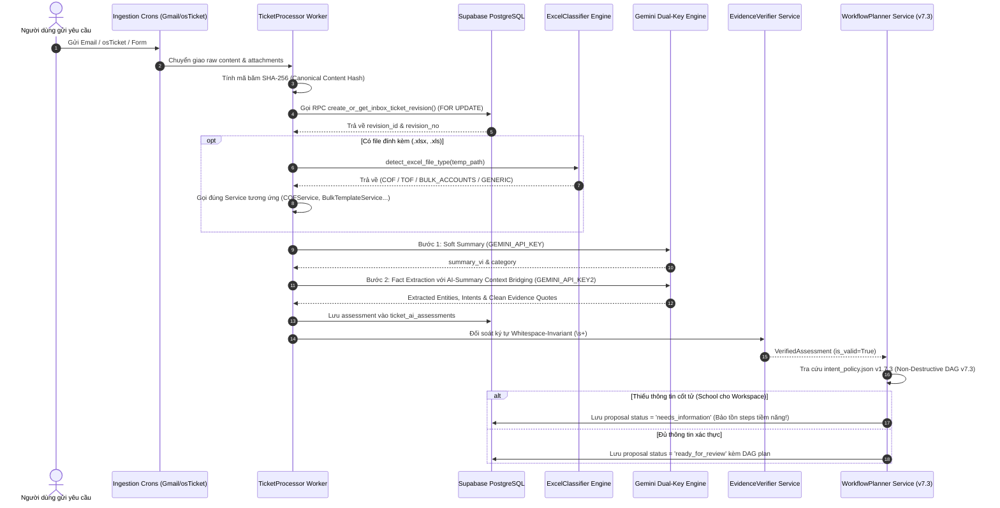
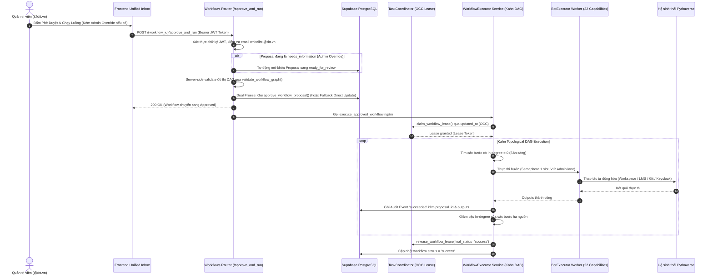
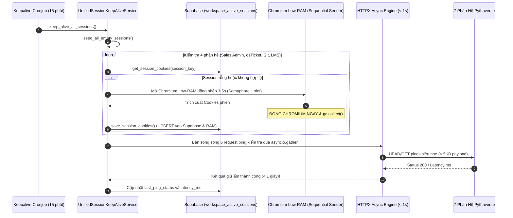
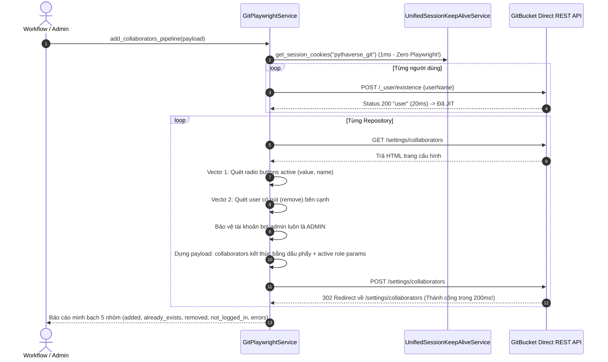

# 🚀 BÁCH KHOA TOÀN THƯ KIẾN TRÚC HỆ THỐNG PTV-TASKS-ADMINISTRATOR
## Pythaverse Central Admin & Automation Hub (Enterprise Single Source of Truth)

> **Tài liệu kiến trúc chuẩn mực:** Bản tài liệu này được biên soạn độc quyền và toàn diện để hệ thống hóa 100% mã nguồn, kiến trúc đa nền tảng, cơ chế an toàn bất biến, các dịch vụ tự động hóa, 23 bảng CSDL Supabase, toàn bộ 50+ module Backend FastAPI và 14 trang chức năng Frontend SPA của dự án **`ptv-tasks-administrator`**.  
> **Cam kết thiết kế:** Bất kỳ AI Coder hay kỹ sư hệ thống mới nào chỉ cần đọc duy nhất tệp tin này là thấu suốt toàn bộ dự án, hiểu rõ vai trò của từng tệp tin, cách thức hoạt động của từng hàm, cấu trúc tham số đầu vào/đầu ra, luồng dữ liệu liên thông, kiến trúc **Hybrid RPA-API Architecture kết hợp Ephemeral Session Caching**, **Cỗ máy Unified Session Keep-Alive & Auto-Seeding (v2.0)**, **Động cơ Phân loại Phôi Excel Thông Minh (`excel_classifier.py`)**, **Động cơ Git Fast Engine 2-Vector DOM Parser**, **Triết lý Lập Kế Hoạch Non-Destructive DAG v7.3 (Course-Repo Auto-Binding & Strict School Scoping)** và các ràng buộc an toàn tuyệt đối mà không cần phải mở xem từng file đơn lẻ trong dự án.

---

## 📌 THÔNG TIN BẢN QUYỀN & TÁC GIẢ SÁNG LẬP

- **Dự án:** `ptv-tasks-administrator` (Pythaverse Central Admin & Automation Hub)
- **Tác giả & Kiến trúc sư trưởng:** **Nguyễn Mạnh Hùng** (*Lead AI Engineer & Automation Architect – DTT Corporation / Pythaverse Ecosystem*)
- **GitHub:** [`https://github.com/hungnm-1225`](https://github.com/hungnm-1225)
- **Email:** `hungnm@dtt.vn` / `hung.nguyenmanh@dtt.vn`
- **Hệ sinh thái:** [Pythaverse Space](https://pythaverse.space)
- **Phiên bản tài liệu:** `v4.2.0 Master Enterprise Comprehensive Edition` (Cập nhật ngày 25 tháng 09 năm 2026)

---

## 📑 MỤC LỤC TỔNG QUAN

1. [PHẦN I: TẦM NHÌN HỆ THỐNG & SÁU NGUYÊN TẮC BẤT BIẾN (SAFETY INVARIANTS)](#-phần-i-tầm-nhìn-hệ-thống--sáu-nguyên-tắc-bất-biến-safety-invariants)
2. [PHẦN II: 7 PHÂN HỆ NGHIỆP VỤ PYTHAVERSE (DOMAIN TRUTH) & KIẾN TRÚC HYBRID RPA-API](#-phần-ii-7-phân-hệ-nghiệp-vụ-pythaverse-domain-truth)
3. [PHẦN III: STACK CÔNG NGHỆ, HẠ TẦNG ĐA NỀN TẢNG & THÔNG SỐ VẬN HÀNH](#-phần-iii-stack-công-nghệ-hạ-tầng-đa-nền-tảng--thông-số-vận-hành)
4. [PHẦN IV: SƠ ĐỒ CẤU TRÚC THƯ MỤC MONOREPO TỔNG THỂ & VAI TRÒ TỪNG TỆP TIN](#-phần-iv-sơ-đồ-cấu-trúc-thư-mục-monorepo-tổng-thể--vai-trò-từng-tệp-tin)
5. [PHẦN V: GIẢI PHẪU CHI TIẾT TỪNG FILE, CLASS & HÀM XỬ LÝ BACKEND (FASTAPI 0.115)](#-phần-v-giải-phẫu-chi-tiết-từng-file-class--hàm-xử-lý-backend-fastapi-0115)
   - [5.1. Entrypoint, Lifespan & 7 Crons Lệch Pha (`app/main.py`)](#51-entrypoint-lifespan--7-crons-lệch-pha-appmainpy)
   - [5.2. Lõi Hệ Thống Core (`app/core/`) – Dual-Key AI, OCC Lease, Concurrency & Cron Telemetry](#52-lõi-hệ-thống-core-appcore)
   - [5.3. Định Nghĩa Schemas & Models Pydantic (`app/models/`)](#53-định-nghĩa-schemas--models-pydantic-appmodels)
   - [5.4. Tri Thức Nghiệp Vụ & Policy Registry (`app/brain/`) – 22 Capabilities & 12 Intents v1.7.3](#54-tri-thức-nghiệp-vụ--policy-registry-appbrain)
   - [5.5. Cổng Giao Tiếp 10 Router REST API Endpoints (`app/api/v1/endpoints/`)](#55-cổng-giao-tiếp-10-router-rest-api-endpoints-appapiv1endpoints)
   - [5.6. Dịch Vụ Nghiệp Vụ & RPA Services (`app/services/`)](#56-dịch-vụ-nghiệp-vụ--rpa-services-appservices)
     - [5.6.1. Dịch Vụ Phân Tách Email Thread (`email_thread_service.py`)](#561-dịch-vụ-phân-tách-email-thread-email_thread_servicepy)
     - [5.6.2. Thẩm Định Bằng Chứng & Chuẩn Hóa Fact (`evidence_verifier.py` & `request_fact_normalizer.py`)](#562-thẩm-định-bằng-chứng--chuẩn-hóa-fact-evidence_verifierpy--request_fact_normalizerpy)
     - [5.6.3. Bộ Lập Kế Hoạch & Thực Thi DAG v7.3 (`workflow_planner.py` & `workflow_executor.py`)](#563-bộ-lập-kế-hoạch--thực-thi-dag-v73-workflow_plannerpy--workflow_executorpy)
     - [5.6.4. Gói Xử Lý Bảng Tính Chuyên Biệt (`app/services/excel/` & `cof_excel_service.py`)](#564-gói-xử-lý-bảng-tính-chuyên-biệt-appservicesexcel--cof_excel_servicepy)
     - [5.6.5. Gói RPA Modularized School Workspace (`app/services/workspace/`)](#565-gói-rpa-modularized-school-workspace-appservicesworkspace)
     - [5.6.6. Phả Hệ Trường Học & Két Sắt Fernet (`workspace_lineage_service.py`)](#566-phả-hệ-trường-học--két-sắt-fernet-workspacelineage_servicepy)
     - [5.6.7. Cỗ Máy Hybrid Moodle PLearn V4.0 (`playwright_service.py`)](#567-cỗ-máy-hybrid-moodle-plearn-v40-playwright_servicepy)
     - [5.6.8. Pythaverse Git Fast Engine Hybrid V4.0 (`git_service.py`)](#568-pythaverse-git-fast-engine-hybrid-v40-gitservicepy)
     - [5.6.9. Keycloak 2-Tier Hybrid (`keycloak_service.py`)](#569-keycloak-2-tier-hybrid-keycloak_servicepy)
     - [5.6.10. Cỗ Máy Giữ Ấm Tập Trung & Gieo Mầm Phiên (`session_keepalive_service.py`)](#5610-cỗ-máy-giữ-ấm-tập-trung--gieo-mầm-phiên-session_keepalive_servicepy)
     - [5.6.11. Các Dịch Vụ Phân Hệ Ngoài (osTicket, Site Monitor, Google Workspace, GitHub)](#5611-các-dịch-vụ-phân-hệ-ngoài-osticket-site-monitor-google-workspace-github)
   - [5.7. Bộ Điều Phối Workers Chạy Ngầm (`app/workers/`)](#57-bộ-điều-phối-workers-chạy-ngầm-appworkers)
   - [5.8. Kịch Bản Bổ Trợ CLI & Scripts Kiểm Thử Master (`backend/scripts/`)](#58-kịch-bản-bổ-trợ-cli--scripts-kiểm-thử-master-backendscripts)
   - [5.9. Bộ Kiểm Thử An Toàn Hermetic Pytest Suite (`backend/tests/`)](#59-bộ-kiểm-thử-an-toàn-hermetic-pytest-suite-backendtests)
6. [PHẦN VI: GIẢI PHẪU CHI TIẾT GIAO DIỆN FRONTEND SPA (REACT 19 + VITE 6 + TAILWIND CSS V4)](#-phần-vi-giải-phẫu-chi-tiết-giao-diện-frontend-spa-react-19--vite-6--tailwind-css-v4)
   - [6.1. Kiến Trúc Lõi Frontend SPA, Lazy Chunks & Client Cache Purge](#61-kiến-trúc-lõi-frontend-spa-lazy-chunks--client-cache-purge)
   - [6.2. Design System Tokens: Bento Grid & Enterprise Pastel OKLCH (`index.css`)](#62-design-system-tokens-bento-grid--enterprise-pastel-oklch-indexcss)
   - [6.3. Lớp Giao Tiếp Mạng, Kiểu Dữ Liệu & Cấu Hình Tác Giả (`src/lib/`, `src/types/`, `src/context/`, `src/config/`)](#63-lớp-giao-tiếp-mạng-kiểu-dữ-liệu--cấu-hình-tác-giả)
   - [6.4. Giải Phẫu Chi Tiết 14 Trang Chức Năng & Sub-Components (`src/features/`)](#64-giải-phẫu-chi-tiết-14-trang-chức-năng--sub-components-srcfeatures)
     - [6.4.1. AI Workflow Console V3.1 & Trình Xem Tệp Đa Định Dạng (`src/features/inbox/`)](#641-ai-workflow-console-v31--trình-xem-tệp-đa-định-dạng-srcfeaturesinbox)
     - [6.4.2. Siêu Xưởng Tự Động Hóa RPA Modularized Hub 13 Modules (`src/features/studio/`)](#642-siêu-xưởng-tự-động-hóa-rpa-modularized-hub-13-modules-srcfeaturesstudio)
     - [6.4.3. Quản Trị Phả Hệ Trường Học & Két Sắt Vault (`src/features/hierarchy/`)](#643-quản-trị-phả-hệ-trường-học--két-sắt-vault-srcfeatureshierarchy)
     - [6.4.4. 11 Trang Nghiệp Vụ & Quản Trị Khác](#644-11-trang-nghiệp-vụ--quản-trị-khác)
7. [PHẦN VII: CƠ SỞ DỮ LIỆU SUPABASE POSTGRESQL 16 (23 BẢNG, RLS & PROVENANCE HẠ TẦNG)](#-phần-vii-cơ-sở-dữ-liệu-supabase-postgresql-16-23-bảng-rls--provenance-hạ-tầng)
8. [PHẦN VIII: SƠ ĐỒ LUỒNG DỮ LIỆU END-TO-END (MERMAID SEQUENCE & STATE MACHINES)](#-phần-viii-sơ-đồ-luồng-dữ-liệu-end-to-end-mermaid-sequence--state-machines)
9. [PHẦN IX: TỪ ĐIỂN CHỈ MỤC HÀM TOÀN DIỆN (FUNCTION-TO-FILE MASTER INDEX - 210+ HÀM)](#-phần-ix-từ-điển-chỉ-mục-hàm-toàn-diện-function-to-file-master-index)
10. [PHẦN X: CẨM NANG KHẮC PHỤC SỰ CỐ & FAQ DÀNH CHO AI CODER](#-phần-x-cẩm-nang-khắc-phục-sự-cố--faq-dành-cho-ai-coder)
11. [PHẦN XI: CẨM NANG ĐỊNH TUYẾN CHUYÊN GIA AI (INTELLIGENT AGENT ROUTING PLAYBOOK - 20 AGENTS)](#-phần-xi-cẩm-nang-định-tuyến-chuyên-gia-ai-intelligent-agent-routing-playbook)
12. [PHẦN XII: HƯỚNG DẪN KHỞI CHẠY, CẤU HÌNH BIẾN MÔI TRƯỜNG & KIỂM THỬ TỰ ĐỘNG](#-phần-xii-hướng-dẫn-khởi-chạy-cấu-hình-biến-môi-trường--kiểm-thử-tự-động)

---

## 🏛️ PHẦN I: TẦM NHÌN HỆ THỐNG & SÁU NGUYÊN TẮC BẤT BIẾN (SAFETY INVARIANTS)

`ptv-tasks-administrator` được định vị là **Trung tâm Thần kinh Điều phối & Tự Động Hóa Tập Trung (Pythaverse Central Admin & Automation Hub)** cho toàn bộ tập đoàn DTT Corporation và hệ sinh thái giáo dục công nghệ Pythaverse. Hệ thống tiếp nhận yêu cầu từ đa kênh (Gmail, Google Forms, osTicket), sử dụng AI nhận thức kép có bằng chứng kết hợp cơ chế AI-Summary Context Bridging để lập kế hoạch công việc dạng đồ thị có hướng không chu trình (DAG), trình qua Quản trị viên duyệt (Human-in-the-Loop) và tự động thực thi xuống 7 phân hệ qua mạng lưới bot RPA và Direct REST APIs.

```
                  ┌────────────────────────────────────────────────────────┐
                  │                 ĐẦU VÀO ĐA KÊNH (INGESTION)             │
                  │   [Gmail Workspace]  [Google Forms]  [OS Ticket SCP]   │
                  └───────────────────────────┬────────────────────────────┘
                                              │ Ingestion Crons (Lệch pha: +15s, +45s, +75s...)
                                              ▼
┌──────────────────────────────────────────────────────────────────────────────────────────┐
│                      LÕI TRUNG TÂM PTV-TASKS-ADMINISTRATOR (BACKEND FASTAPI)             │
│                                                                                          │
│  ┌─────────────────────────┐   ┌───────────────────────────┐   ┌──────────────────────┐  │
│  │ Dual-Path Cognition AI  │   │ EvidenceVerifier Service  │   │  Human-in-the-Loop   │  │
│  │ • Summary (Key 1)       │──▶│ • Clean Quote Stripping   │──▶│  Safety Gate v4.1    │  │
│  │ • Context Bridging ────▶│   │ • Whitespace-Invariant    │   │  JWT Authenticated   │  │
│  │ • Facts (Key 2)         │   │ • Soft Grounding Preserve │   │  (@dtt.vn Whitelist) │  │
│  │ • Fast-Path Fallback    │   │ • Attachment Fail-Closed  │   │  Admin Override      │  │
│  └─────────────────────────┘   └─────────────┬─────────────┘   └──────────────────────┘  │
│                                              │ Verified Facts                            │
│                                              ▼                                           │
│                                ┌───────────────────────────┐                             │
│                                │  Registry Policy Engine   │                             │
│                                │  • intent_policy.json v1.7│                             │
│                                │  • 12 Operational Intents │                             │
│                                │  • Zero-Mockup Invariant  │                             │
│                                │  • Non-Destructive v7.3   │                             │
│                                │  • Strict School Scoping  │                             │
│                                └─────────────┬─────────────┘                             │
│                                              │ Phê duyệt (Approved)                      │
│                                              ▼                                           │
│  ┌────────────────────────────────────────────────────────────────────────────────────┐  │
│  │                 TOPOLOGICAL DAG EXECUTOR & BOT WORKERS (KAHN ALGORITHM)            │  │
│  │  • OCC Workflow Lease Claiming via updated_at (Chống Race-Condition tuyệt đối)     │  │
│  │  • Khối try...finally cam kết 100% thu hồi Lease và tài nguyên Semaphore            │  │
│  │  • Append-Only Audit Trail (workflow_execution_events gắn proposal_id bất biến)    │  │
│  │  • BFS Graph Traversal: Reset thông minh toàn bộ downstream dependencies khi retry │  │
│  └────────────────────────────────────────────────────────────────────────────────────┘  │
│                                              │                                           │
│  ┌────────────────────────────────────────────────────────────────────────────────────┐  │
│  │            MA TRẬN 8 BỘ NHỚ ĐỆM IN-MEMORY RAM & UNIFIED SESSION KEEPALIVE          │  │
│  │    Courses (10m) | Workspace (15m) | Board (5m) | Bots (15s) | Tasks (60s)         │  │
│  │    Tickets (60s) | Monitor (30s)   | Reports (60s) | Keep-Alive Supabase Vault     │  │
│  └────────────────────────────────────────────────────────────────────────────────────┘  │
└──────────────────────────────────────────────┬───────────────────────────────────────────┘
                                               │ Thực thi tự động
                                               ▼
                  ┌────────────────────────────────────────────────────────┐
                  │               HỆ SINH THÁI ĐÍCH (EXECUTION TARGETS)    │
                  │ School Workspace | PLearn LMS | Keycloak | Pythaverse Git | GitHub │
                  └───────────────────────────┴────────────────────────────┘
```

### Sáu Nguyên Tắc Thiết Kế Bất Biến (Absolute Safety Invariants):

1. **Evidence-Based & Soft-Grounded Verification Invariant (Không Bằng Chứng ➔ Không Action):**
   - Mọi ý định vận hành trích xuất bắt buộc phải có đoạn trích dẫn nguyên văn (`quote`).
   - `EvidenceVerifierService` thực hiện làm sạch quote: tự động gọt bỏ dấu ngoặc kép, dấu chấm lửng `...` do AI sinh ra ở đầu/cuối chuỗi (`clean_quote`).
   - Áp dụng thuật toán **Whitespace-Invariant Matching**: Chuẩn hóa toàn bộ khoảng trắng và ngắt dòng (`\s+`) về 1 dấu cách duy nhất để so khớp chính xác, không bị gãy bởi sự sai lệch định dạng email. Nếu quote không khớp trong nội dung gốc, intent đó bị đánh dấu unverified và outcome chuyển sang `needs_information`.
2. **Attachment Evidence Fail-Closed Invariant (File đính kèm chưa đối soát ➔ Không Action):**
   - Các trích dẫn có `source_kind == "attachment_extract"` tạm thời bị gắn cờ `is_verified = False` (chuyển sang `needs_information`).
   - Nghiêm cấm tuyệt đối việc dùng text thân email để đối soát trích dẫn từ file đính kèm khi chưa qua hạ tầng bóc tách bất biến (`excel_classifier.py` và các engine tương ứng).
3. **Zero-Mockup Invariant & Triết Lý Non-Destructive DAG v7.3:**
   - Nghiêm cấm sử dụng bất kỳ giá trị mặc định giả lập nào (`SWRP 4-12`, count=4, mật khẩu `Ptv@2026`).
   - **Khai tử các hàm Regex phỏng đoán mù mờ:** Bộ lập kế hoạch chuyển sang phương pháp luận **AI-First Triage** (dựa 100% trên Tri thức & Bóc tách có cấu trúc của Gemini AI).
   - **Quyền Git Mặc Định GUEST:** Khi yêu cầu không chỉ định vai trò Git, hệ thống tuân thủ chính sách bảo mật Principle of Least Privilege: gán role an toàn `GUEST` thay vì dừng gãy luồng hoặc tự gán quyền quản trị viên.
   - **Strict School Scoping:** Phân định rạch ròi phạm vi trường học: Chỉ yêu cầu chọn trường khi đụng vào School Workspace (`workspace.*`). Các tác vụ Git (`git.*`), Keycloak (`keycloak.*`), Moodle LMS (`lms.*`) **HOÀN TOÀN KHÔNG CẦN TRƯỜNG**, loại bỏ triệt để cảnh báo vàng oan trên giao diện Unified Inbox.
   - **Course-Repo Auto-Binding:** Tự động đào sâu vào cột `git_repos` JSONB của bảng `lms_courses`, nhặt đúng link repo liên kết cho Giáo viên (`gv`) vs Học sinh (`hs`).
   - **Mở rộng dải môn tự nhiên (`expand_course_range_text`):** Tự động mở rộng dải môn học tự nhiên (VD: `SWRP 5 to 10` / `SWRP từ 5 đến 10` ➔ `SWRP 5, 6, 7, 8, 9, 10`).
   - **Triết lý Non-Destructive DAG:** Khi ở trạng thái `needs_information`, hệ thống **không bao giờ xóa sạch các bước về 0**. Bộ lập kế hoạch bảo tồn và trực quan hóa các bước tiềm năng trên giao diện UI kèm danh sách `missing_requirements`, giúp Quản trị viên nắm bắt bức tranh toàn cảnh thay vì nhìn thấy một khung trống rỗng.
4. **Dual-Freeze Proposal, Admin Override & Immutable Provenance Linkage:**
   - Khi Admin phê duyệt, hệ thống đóng băng đồng thời cả `workflow_proposals.frozen_plan` và `automation_workflows.steps`.
   - **Admin Override & Dual Sync:** Khi Quản trị viên tinh chỉnh các bước trên giao diện (bổ sung tham số thiếu, chỉnh sửa input), hệ thống tự động cập nhật Workflow Draft và đồng bộ `workflow_proposals` liên kết sang trạng thái `ready_for_review`, cho phép Quản trị viên phê duyệt thực thi kể cả khi yêu cầu ban đầu bị thiếu thông tin.
   - **Intelligent RPC Fallback:** Cổng phê duyệt thử gọi PostgreSQL Stored Procedure `approve_workflow_proposal`. Nếu môi trường cơ sở dữ liệu chưa có hàm này, hệ thống tự động chuyển sang Fallback Direct Table Update nguyên tử, cập nhật cả 2 bảng và ghi audit event mà không làm gián đoạn vận hành.
   - Toàn bộ execution events trong `workflow_execution_events` bắt buộc phải mang theo `proposal_id`. Tuyệt đối không cho phép chỉnh sửa workflow hay proposal sau khi đã ở trạng thái `approved`.
5. **Real JWT Identity Enforcement & Render Env Credential Sanitization:**
   - Bỏ qua trường `approved_by` do Frontend gửi lên trong payload body. Danh tính người duyệt được giải mã trực tiếp từ Bearer JWT Token qua dependency `get_current_user_email` và bắt buộc thuộc whitelist domain `@dtt.vn`.
   - **Sanitize Environment Credentials:** Khi các biến môi trường Render được khai báo bọc trong dấu ngoặc kép hoặc đơn (`"` hoặc `'`) do chứa ký tự đặc biệt (`@#!`), hàm chuẩn hóa bắt buộc lột bỏ các dấu bao quanh này trước khi nạp vào Playwright hoặc HTTPX Engine để tránh lỗi xác thực sai lệch.
6. **Optimistic Concurrency Control (OCC) Lease & Concurrency Safeguard (Render 512MB RAM):**
   - Chiếm Lease độc quyền cấp Workflow qua `TaskCoordinator.claim_workflow_lease()` sử dụng kiểm soát đồng thời lạc quan (OCC) trên trường `updated_at`. Hàm `update_workflow_heartbeat()` ném `RuntimeError` dừng khẩn cấp worker nếu bị cướp lease.
   - Khóa cứng `GLOBAL_PLAYWRIGHT_SEMAPHORE = asyncio.Semaphore(1)` kết hợp ContextVar `_PLAYWRIGHT_SLOT_HOLDER` chống deadlock re-entrancy khi hàm cha con cùng gọi acquire slot.
   - Mọi coroutine chạy Playwright hoặc quét ngầm bắt buộc gọi `gc.collect()` và `force_kill_zombie_chromium()` trong khối `finally`.
   - 7 Crons trong `main.py` xuất phát lệch pha (+15s, +30s, +45s, +75s, +150s, +240s, +900s) kết hợp cơ chế Circuit Breaker tự động nhường slot (`is_heavy_operation_running` & `heavy_operation_guard`) để ngăn chặn triệt để nguy cơ tràn RAM trên hạ tầng Render 512MB.

---

## 🌐 PHẦN II: 7 PHÂN HỆ NGHIỆP VỤ PYTHAVERSE (DOMAIN TRUTH) & KIẾN TRÚC HYBRID RPA-API

Hệ sinh thái Pythaverse vận hành trên 7 phân hệ độc lập. Nhằm tối ưu hóa triệt để tài nguyên máy chủ Render (**trần 512MB RAM**) và triệt tiêu hoàn toàn nguy cơ Timeout do click chuột UI giả lập, hệ sinh thái áp dụng **Kiến Trúc Hybrid RPA-API kết hợp Ephemeral Session Caching**:
- **Playwright đóng vai Auth Gateway (3–5s):** Chỉ khởi chạy Chromium siêu nhẹ (18 flags Low-RAM) trong đúng 3–5 giây để thực hiện đăng nhập, vượt qua các cổng xác thực phức tạp (Keycloak OIDC, WordPress SSO), bốc toàn bộ Cookies phiên, `window.user` identity, `sesskey` Moodle, hoặc JWT token.
- **Giải phóng Chromium tức thì (Ephemeral Lifecycle):** Ngay sau khi bốc được Session Dictionary, tiến trình Chromium được đóng ngay lập tức (`await browser.close()`), gọi `gc.collect()` và `force_kill_zombie_chromium()`, trả bộ nhớ RAM máy chủ về mức an toàn (< 25MB).
- **Hạ tầng thực thi là Async Non-blocking HTTP Engine (HTTPX):** 100% các thao tác nghiệp vụ phức tạp (tạo đơn hàng, phân bổ license, tạo group, ghi danh học sinh/giáo viên đa môn học, check JIT existence 20ms, thêm/gỡ git collaborator 200ms) được thực thi bởi HTTPX Async với tốc độ phản hồi từ 20ms đến 300ms.
- **Unified Session Keep-Alive & Auto-Seeding (v2.0):** Một cỗ máy giữ ấm tập trung lưu trữ phiên đăng nhập bền vững trên bảng `workspace_active_sessions` của Supabase, tự động gieo mầm tuần tự khi phát hiện bảng rỗng và định kỳ ping giữ ấm 7 phân hệ mỗi 15 phút bằng HTTPX thuần (< 1s, zero Playwright).

| STT | Phân Hệ | Tên Miền / Giao Thức | Core Platform | Vai Trò Kỹ Thuật & Nghiệp Vụ Cốt Lõi | Phương Thức Tự Động Hóa (Hybrid RPA-API) |
|---|---|---|---|---|---|
| **1** | **School Workspace** | `https://pythaverse.space` | React MUI / PHP WordPress REST APIs | Quản trị phân cấp 3 tầng (`Distributor` ➔ `Partner` ➔ `School`). Cấp phát License Pool, bù Contract, nộp batch tài khoản số lượng lớn qua Bulk Account Creation, phân bổ môn học & Group. | **Hybrid RPA-API (Ephemeral Session):** Đọc session Sales Admin ấm nóng từ `session_keepalive_service` (1ms) hoặc Playwright Auth Gateway bốc Session trong 3s ➔ Đóng Chromium ➔ HTTPX Async Engine gọi trực tiếp PHP endpoints (`schoolCreateOrder.php`, `updateStatusOrder.php`, `createOrderSale.php`, `updateStatusPartnerOrder.php`, `uploadFileAccount.php`, `createMultipleUser.php`, `enrolMultipleUser.php`, `createGroup.php`, `updateUser.php`). Bơm DOM JS bảo toàn 100% ký tự đặc biệt. |
| **2** | **PLearn LMS** | `https://learn.pythaverse.space` | Moodle LMS (PHP / MariaDB / Edwiser RemUI) | Cổng đào tạo Moodle LMS. Quản lý danh mục khóa học (`SWRP`, `IR`, `ASP`...) và ghi danh/hủy ghi danh tài khoản theo Vai trò (`Student` - 9, `Teacher` - 7, `Manager` - 1). | **Hybrid RPA-API (Moodle Engine V4.0):** Đọc session từ Keep-Alive hoặc Playwright SSO Keycloak (3s) trích xuất Cookie & `sesskey` ➔ Đóng Chromium ➔ Gọi Direct HTTPX WebService (`core_enrol_manual_enrol_users`, `core_enrol_unenrol_user_enrolment`, `core_group_create_groups`, `core_group_add_group_members`). Tự động chuẩn hóa username qua Keycloak. Fallback 2 nhịp trên `td.cell.c2`. |
| **3** | **PGit Repos** | `https://git.pythaverse.space` | GitBucket Server (Scala / JVM / SQLite) | Máy chủ lưu trữ mã nguồn dự án học sinh & giáo viên. Quản lý Collaborators tại `/settings/collaborators`. Yêu cầu tài khoản đăng nhập SSO Keycloak ít nhất 1 lần để kích hoạt cơ chế JIT (Just-In-Time). | **Git Fast Engine Hybrid V4.0 (2-Vector DOM Parser):** Sàng lọc người dùng qua Keycloak Gateway, đọc session từ Keep-Alive hoặc Playwright bốc Session OIDC (3s) ➔ Đóng Chromium ➔ Check JIT tồn tại qua `POST /_user/existence` (20ms) ➔ Bóc tách 2-vector radio active + remove anchor ➔ Bảo vệ bot admin ➔ Bắn 1 request POST lưu collaborators (200ms) kèm active role params. |
| **4** | **Keycloak Auth IDP** | `https://eid.pythaverse.space` | Keycloak (Java / WildFly / PostgreSQL) | Cổng xác thực định danh tập trung OpenID Connect / OAuth2 (Realm: `master` / `idp`). Reset mật khẩu, kích hoạt/khóa tài khoản và tra cứu email chính thức. | **2-Tier Hybrid:** Direct REST API (300ms qua HTTPX Async với In-Memory Token Caching, tự động tái sử dụng Admin Token) ➔ Playwright RPA Fallback khi lỗi API (`keycloak_service.py`). Hỗ trợ cờ boolean `enabled` và các bí danh `lock`, `disable`, `unlock`, `enable`. |
| **5** | **Leanbot IDE** | `https://ide.pythaverse.space` | Blockly / Web Bluetooth BLE | Web IDE lập trình khối kéo thả Blockly kết nối Robot Leanbot qua Bluetooth BLE. | Synthetic Monitoring Uptime & Latency (`site_monitor_service.py`). |
| **6** | **Support Helpdesk** | `https://support.pythaverse.space` | osTicket (PHP / MySQL) | Hệ thống tiếp nhận sự cố kỹ thuật osTicket. Cào dữ liệu định kỳ qua Playwright Headless session và chuyển giao cho Canonical Intake. | Đọc session từ Keep-Alive hoặc Playwright headless scraper cào vé, custom form fields & files đính kèm (`osticket_service.py`). |
| **7** | **PContest** | `https://contest.pythaverse.space` | Next.js / Python Judge | Hệ thống tổ chức thi đấu lập trình trực tuyến, quản lý Leaderboard và chấm điểm tự động. | Synthetic Monitoring Uptime & Latency (`site_monitor_service.py`). |

---

## 🛠️ PHẦN III: STACK CÔNG NGHỆ, HẠ TẦNG ĐA NỀN TẢNG & THÔNG SỐ VẬN HÀNH

### 1. Thế Trận Hạ Tầng Đa Nền Tảng (Multi-Platform Topology)
- **Vercel**: Máy chủ Edge CDN lưu trữ ứng dụng Frontend React 19 SPA (14 trang chức năng). Tích hợp tệp [`frontend/vercel.json`](file:///c:/Users/dtt/Desktop/Project/ptv-tasks-administrator/frontend/vercel.json) để cấu hình rewrite client-side routing (`/* -> /index.html`). Đóng gói siêu tốc với Dynamic Chunk Splitting qua Vite 6.
- **Render.com**: Máy chủ khởi chạy Backend FastAPI trên môi trường tài nguyên nghiêm ngặt (**512MB RAM Free/Starter Tier**). Cấu hình qua [`render.yaml`](file:///c:/Users/dtt/Desktop/Project/ptv-tasks-administrator/render.yaml) và [`backend/Dockerfile`](file:///c:/Users/dtt/Desktop/Project/ptv-tasks-administrator/backend/Dockerfile). Áp dụng **Kiến Trúc Hybrid RPA-API kết hợp Ephemeral Session Caching**, khóa cứng Semaphore 1 slot, thu hồi bộ nhớ `gc.collect()` và tiêu diệt Chromium zombie.
- **Supabase**: Cơ sở dữ liệu PostgreSQL 16 (**23 bảng chuyên biệt** bao gồm 21 bảng nghiệp vụ + 2 bảng session/telemetry persistence, RLS `@dtt.vn`, Storage Bucket `ticket-attachments`, Két sắt mã hóa Fernet, và 2 PostgreSQL Stored Procedures nguyên tử: `create_or_get_inbox_ticket_revision` và `approve_workflow_proposal`).
- **Google Cloud Console**: Quản trị tài khoản dịch vụ (Service Account) tích hợp bộ ba Gmail Workspace API, Google Sheets API, Google Docs API và Google Drive API.
- **UptimeRobot**: Giám sát ngoại vi Synthetic Ping Uptime (chu kỳ 5 phút) kiêm nhiệm vụ giữ ấm (keep-warm ping) cho Render chống ngủ đông.
- **GitHub**: Quản lý mã nguồn Monorepo, GitHub Actions CI/CD và Dispatcher Issue tự động vào Private Repositories qua Personal Access Token (`GITHUB_PAT`).

### 2. Chi Tiết Backend Stack
- **Ngôn ngữ & Runtime:** Python `3.11.x` / `3.12.x`
- **Web Framework:** FastAPI `0.115.8` (Asynchronous ASGI)
- **Validation Engine:** Pydantic `2.10.6` (Strict Schema Validation & Settings Management qua `pydantic-settings: 2.7.1`)
- **Kiến trúc Tự động hóa:** **Hybrid RPA-API Architecture với Ephemeral Session Caching** (Playwright Auth Gateway + HTTPX Async Non-blocking Engine).
- **RPA Engine:** Playwright Async Chromium (`playwright: 1.50.0`) kết hợp bộ 18 cờ tối ưu `LOW_RAM_CHROMIUM_ARGS` và chặn media/trackers.
- **Lập lịch chạy ngầm:** APScheduler `3.10.4` (`AsyncIOScheduler`) với **7 Crons so le lệch pha** (+15s, +30s, +45s, +75s, +150s, +240s, +900s).
- **In-Memory Caching & Telemetry:** Ma trận 8 In-Memory RAM Caches (`BoundedMemoryCache` phân tầng LRU + TTL, phản hồi 1ms, RAM <= 40MB) + Registry Telemetry [`cron_telemetry.py`](file:///c:/Users/dtt/Desktop/Project/ptv-tasks-administrator/backend/app/core/cron_telemetry.py) đồng bộ Supabase `cron_telemetry_state`.
- **Giữ Ấm Phiên Tự Động:** [`session_keepalive_service.py`](file:///c:/Users/dtt/Desktop/Project/ptv-tasks-administrator/backend/app/services/session_keepalive_service.py) gieo mầm tuần tự 4 phân hệ bằng Playwright 3s, lưu vào `workspace_active_sessions`, và ping giữ ấm 7 phân hệ bằng HTTPX thuần (< 1s).
- **Trí tuệ nhân tạo (AI):** `google-generativeai: 0.8.4` & `google-genai: 1.2.0` tích hợp Dual-Key Engine (`GEMINI_API_KEY` & `GEMINI_API_KEY2`), **Cơ chế AI-Summary Context Bridging**, Cross-Key Failover, chuỗi 10 models fallback (`gemini-3.8-flash` ➔ `gemini-3.7-flash` ➔ `gemini-3.5-flash-lite`...), kết hợp bộ **Deterministic Fast-Path Triage v1.2.0**.
- **Mã Hóa & Bảo Mật:** `cryptography` (Fernet 32-byte symmetric encryption), `PyJWT: 2.10.1` (giải mã Supabase Bearer JWT), `python-keycloak: 5.1.0`.
- **Xử Lý Bảng Tính:** `openpyxl >= 3.1.2` (Chuyên biệt hóa 5 dịch vụ trong `app.services.excel` bao gồm bộ phân loại `excel_classifier.py`).
- **Mạng Bất Đồng Bộ:** `httpx: 0.28.1`, `requests: 2.32.3`, `nest-asyncio >= 1.6.0`.
- **Kiểm Thử Hồi Quy:** `pytest: 8.3.4` / `anyio` (Hermetic in-memory test suite).

### 3. Chi Tiết Frontend Stack
- **Node.js**: `20.x LTS` / `22.x LTS`
- **React**: `19.0.0` (React 19 Functional Hooks, Concurrent Rendering, Suspense Code Splitting, `createPortal` modal isolation)
- **Build Tool:** Vite `6.2.0`
- **TypeScript**: `5.7.2` (`strict: true`, Strict Type Checking)
- **Tailwind CSS**: `4.0.0` (Kiến trúc Design Tokens hiện đại `@import "tailwindcss";` kết hợp Enterprise Pastel OKLCH qua `@theme inline`)
- **Router:** `react-router-dom: 7.18.2` (14 Trang Quản trị & Công vụ)
- **Animations:** `motion: 13.1.1` (Framer Motion v13)
- **Biểu đồ:** `recharts: 2.15.0`
- **Lucide React**: `0.475.0` (Icon Library đồng nhất)
- **SheetJS (`xlsx`)**: `0.18.5` (Xử lý bóc tách & hiển thị bảng tính Excel tương tác client-side, đa tab sheet switching)
- **Supabase JS Client**: `@supabase/supabase-js: 2.48.0` (Auth & Realtime Client)
- **Sonner**: `2.0.8` (Toast Notification thích ứng Theme)
- **Styling Bổ Trợ:** `styled-components: 6.5.3`, `clsx: 2.1.1`, `tailwind-merge: 3.0.1`

---

## 📁 PHẦN IV: SƠ ĐỒ CẤU TRÚC THƯ MỤC MONOREPO TỔNG THỂ & VAI TRÒ TỪNG TỆP TIN

```
ptv-tasks-administrator/
├── render.yaml                                 # Cấu hình triển khai Docker Web Service trên Render.com
├── package.json                                # Cấu hình dependencies root monorepo
├── package-lock.json                           # Khóa phiên bản dependencies root
├── skills-lock.json                            # Khóa cấu hình plugin & agent skills
├── GEMINI.md                                   # System Instructions & Quy chuẩn tác nghiệp của AI Assistant (v4.2.0)
├── Blueprint.md                                # Master Blueprint Đặc Tả Kỹ Thuật Tổng Thể v2.0.0
├── design.md                                   # Đặc tả UI/UX Design System, Bento Grid Tokens & Components
├── README.md                                   # Bách khoa toàn thư kiến trúc hệ thống (Single Source of Truth v4.2.0)
├── supabase/                                   # Hạ tầng cơ sở dữ liệu Supabase PostgreSQL 16
│   ├── schema.sql                              # DDL định nghĩa 23 bảng CSDL, RLS policies, 2 Stored Procedures nguyên tử
│   ├── migrations/                             # 5 bản migration lịch sử khởi tạo và nâng cấp schemas
│   │   ├── 20260812000000_initial_schema.sql
│   │   ├── 20260910000000_add_automation_workflows.sql
│   │   ├── 20260911000000_add_provenance_and_proposals.sql
│   │   ├── 20260912000000_harden_workflow_provenance.sql
│   │   └── 20260913000000_atomic_revisions_and_workflow_safety.sql
│   └── runbooks/                               # Kịch bản kiểm thử tính toàn vẹn CSDL trước & sau triển khai
│       ├── 20260913_workflow_safety_preflight.sql
│       └── 20260913_workflow_safety_postflight.sql
├── backend/                                    # Ứng dụng Backend FastAPI (Python 3.11/3.12)
│   ├── app/
│   │   ├── api/                                # REST API Routers
│   │   │   └── v1/
│   │   │       ├── router.py                   # Aggregator router gom 10 endpoints
│   │   │       └── endpoints/                  # 10 Router chuyên biệt
│   │   │           ├── workflows.py            # Safety Gate v4.1, Admin Override, Dual Sync, Dual Freeze, RPC Fallback, DAG Validation
│   │   │           ├── tickets.py              # Canonical Intake, Re-summarize, Re-assess Intent, Complete/Dismiss/Restore
│   │   │           ├── tasks.py                # Bot Task Queue, run_approved_task_worker, Payload Edit, Execution Timeline
│   │   │           ├── bots.py                 # Bot Status, Realtime Logs GMT+7 với Taxonomy Filter, Trigger Cron On-Demand
│   │   │           ├── board.py                # Multi-board Kanban (Boards, Columns, Cards, DND, Subtasks)
│   │   │           ├── courses.py              # Dual Catalogs (Workspace & LMS), Git Repo Links, Excel Bulk Import
│   │   │           ├── workspace.py            # Phả hệ 480 trường, Scanner Cache, Bóc tách COF, Prewarm Sessions, Vault Passwords
│   │   │           ├── monitor.py              # Synthetic Ping 10 Sites, Auth Matrix, Downtime Logs
│   │   │           ├── github.py               # AI Bug Triage ➔ GitHub Issue Dispatcher
│   │   │           └── reports.py              # KPI Summary, Category Ratios, Daily Trends, Export Excel
│   │   ├── brain/                              # Tri thức nghiệp vụ & Policy Registry
│   │   │   ├── capabilities.json               # 22 Capabilities hệ thống (Schemas, Handlers, Risk, Input/Output)
│   │   │   ├── intent_policy.json              # Master Policy Registry v1.7.3 (12 operational intents)
│   │   │   ├── dependency_rules.json           # Quy tắc sắp xếp Tô-pô & DAG dependencies
│   │   │   ├── workflow_rules.json             # Archetypes luồng công việc mẫu
│   │   │   ├── knowledge_base.json             # Tri thức kỹ thuật của 7 phân hệ Pythaverse
│   │   │   └── prompts/                        # Versioned Prompts
│   │   │       ├── ticket_summary_v1.txt       # Prompt Soft Summary cho Inbox (Key 1)
│   │   │       └── intent_extraction_v1.txt    # Prompt Operational Fact Extraction có Range Expansion & Context (Key 2)
│   │   ├── core/                               # Lõi hệ thống & Quản trị tài nguyên
│   │   │   ├── config.py                       # Settings 25+ envs, Pydantic BaseSettings, Time utilities GMT+7
│   │   │   ├── cache_policy.py                 # BoundedMemoryCache (3 Tiers, LRU, TTL, RAM <= 40MB, 8 bộ nhớ đệm)
│   │   │   ├── cron_telemetry.py               # Quản lý Telemetry chạy ngầm & persist Supabase (cron_telemetry_state)
│   │   │   ├── playwright_manager.py           # Semaphore 1 Slot, Re-entrancy Lock, Zombie Killer, Circuit Breaker
│   │   │   ├── security.py                     # Whitelist Domain @dtt.vn, Bearer JWT Auth Dependency
│   │   │   ├── supabase.py                     # Singleton client Supabase (get_supabase_client)
│   │   │   ├── task_coordinator.py             # OCC Workflow Lease Claiming via updated_at, Heartbeat
│   │   │   └── gemini.py                       # Dual-Key AI, AI-Summary Context Bridging, Cross-Key Failover, Fast-Path Triage
│   │   ├── models/                             # Schemas Pydantic Strict Validation
│   │   │   ├── intent.py                       # EvidenceSpan, ExtractedIntent, ExtractedEntity, TypedEntities, IntentAssessment
│   │   │   ├── workflow.py                     # WorkflowStepDraft, WorkflowDraftUpdate, WorkflowApprovalRequest, WorkflowValidationResult
│   │   │   ├── ticket.py                       # InboxTicket schemas
│   │   │   ├── task.py                         # BotAutomationTask schemas
│   │   │   └── template.py                     # TemplateConfig schemas
│   │   ├── services/                           # Dịch vụ nghiệp vụ & RPA
│   │   │   ├── email_thread_service.py         # Tách email thread, khử quoted reply, nhận diện DTT vs User
│   │   │   ├── evidence_verifier.py            # Deterministic Verifier, Clean Quote, Whitespace-Invariant Matching
│   │   │   ├── request_fact_normalizer.py      # Bổ sung sự thật xác thực từ văn bản gốc, TypedEntities builder
│   │   │   ├── workflow_planner.py             # Master Enterprise v7.3 Non-Destructive DAG, Course-Repo Auto-Binding, Strict School Scoping
│   │   │   ├── workflow_executor.py            # Topological Kahn DAG, Frozen Plan SOT, BFS Retry
│   │   │   ├── session_keepalive_service.py    # Unified Session Keepalive & Sequential Auto-Seeding (v2.0)
│   │   │   ├── cof_excel_service.py            # Facade Proxy chuyển tiếp sang app.services.excel
│   │   │   ├── excel/                          # Gói chuyên biệt bóc tách & tạo file Excel (5 services)
│   │   │   │   ├── __init__.py                 # Export trọn gói 5 services
│   │   │   │   ├── excel_classifier.py         # Cỗ máy phân loại phôi thông minh (COF, TOF, BULK_ACCOUNTS, GENERIC)
│   │   │   │   ├── cof_service.py              # Bóc tách file COF 3 Tabs & Dán ngược kết quả vào COF gốc
│   │   │   │   ├── bulk_template_service.py    # Phôi chuẩn hóa tài khoản trường học & xử lý text trần
│   │   │   │   ├── generic_excel_service.py    # Bóc tách mọi file Excel tự do (Links, Emails, Repos)
│   │   │   │   └── tof_service.py              # Khung bóc tách file TOF (Training Order Form)
│   │   │   ├── workspace_lineage_service.py    # Phân giải phả hệ 3 cấp & giải mã két sắt Fernet
│   │   │   ├── workspace_playwright_service.py # Singleton facade kết nối workspace orchestrator
│   │   │   ├── workspace/                      # Gói RPA Workspace modularized 9 modules (Hybrid RPA-API)
│   │   │   │   ├── __init__.py                 # Export trọn bộ 9 services
│   │   │   │   ├── base.py                     # Low-RAM Chromium Setup, JS DOM Injection Login
│   │   │   │   ├── account_service.py          # Bulk Account Creation (Direct API) & 100% Pure HTTPX Batch Polling
│   │   │   │   ├── user_service.py             # User Profile Service: Tích hợp Session Keep-Alive 1ms & updateUser.php
│   │   │   │   ├── order_service.py            # Fast Engine Hybrid: School Order Creation & Partner License Grant (~200ms)
│   │   │   │   ├── contract_service.py         # Fast Engine Hybrid: Partner Contract Request & Distributor/Admin Approval
│   │   │   │   ├── enroll_service.py           # Multi-Course Enrollment, LMS Group Assignment & Auto Git Sync
│   │   │   │   ├── workspace_scanner_service.py# Direct API Scanner 7 Distributors + Batch Upsert Cache
│   │   │   │   └── orchestrator_service.py     # Master Orchestrator: Trọn gói 5-in-1 E2E, Boomerang Cascade, Checkpoint 2.0
│   │   │   ├── playwright_service.py           # Hybrid Moodle PLearn V4.0 (Auth Gateway 3s + Direct HTTPX WebService, unenrol pipeline)
│   │   │   ├── git_service.py                  # Pythaverse Git Fast Engine V4.0 (2-Vector DOM Parser, Bot Admin Protection)
│   │   │   ├── keycloak_service.py             # 2-Tier Hybrid Keycloak (REST API 300ms + RPA Fallback, enabled cờ boolean)
│   │   │   ├── osticket_service.py             # osTicket Playwright Scraper
│   │   │   ├── site_monitor_service.py         # Synthetic Monitor Uptime & Latency cho 10 Sites
│   │   │   ├── gmail_service.py                # Google Workspace Gmail Polling via OAuth2
│   │   │   ├── google_sheet_service.py         # Google Sheets Form Feedback Polling
│   │   │   ├── google_doc_service.py           # Google Docs Feedback Comments Reader
│   │   │   ├── google_drive_service.py         # Google Drive Downloader & Explorer
│   │   │   └── github_service.py               # GitHub REST API Issue Creator
│   │   ├── workers/                            # Bộ điều phối thực thi chạy ngầm
│   │   │   ├── bot_executor.py                 # Central Worker Router thực thi 22 Capabilities
│   │   │   └── ticket_processor.py             # Atomic Revision RPC, Canonical Hash, Provenance Pipeline, Excel Classifier Triage
│   │   └── main.py                             # Lifespan 7 Crons so le, Circuit Breaker, Health Telemetry
│   ├── data/                                   # Thư mục dữ liệu I/O cục bộ của Backend
│   │   ├── cof_input/                          # Chứa file COF người dùng upload phục vụ bóc tách
│   │   ├── cof_output/                         # Chứa file COF dán ngược mã tài khoản thành công
│   │   ├── results_download/                   # Lưu trữ file Excel kết quả tải về từ cỗ máy RPA
│   │   └── temp_import/                        # Thư mục tạm thời phục vụ nhập danh mục Excel
│   ├── scripts/                                # Scripts bổ trợ CLI & Quản trị dữ liệu
│   │   ├── import_hierarchy.py                 # Script nhập phả hệ 480 trường học vào CSDL
│   │   ├── pythaverse_hierarchy_data.xlsx      # Bảng tính gốc chứa danh bạ phả hệ trường học
│   │   ├── re_triage_all_tickets.py            # Script chạy lại AI Triage hàng loạt cho Inbox
│   │   ├── seed_monitor_credentials.py         # Script khởi tạo tài khoản kiểm thử cho 10 Sites
│   │   ├── test_cof_parser.py                  # Script kiểm thử local bóc tách COF từng tọa độ (Tab1, Tab2, Tab3)
│   │   ├── test_cof_intelligent_engine.py      # Cỗ máy phân tích COF thông minh: Grade Matcher, Group Name, Capacity Check
│   │   ├── test_git_collaborator.py            # Script kiểm thử độc lập RPA GitBucket
│   │   ├── test_git_fast_engine.py             # Master Test Suite Git Direct API Hybrid (3s stealer, 20ms existence, 200ms POST)
│   │   ├── test_lms_advanced_features.py       # Script kiểm thử tính năng nâng cao ghi danh Moodle
│   │   ├── test_lms_fast_engine.py             # Script kiểm thử động cơ Hybrid Moodle siêu tốc
│   │   ├── test_workspace_enroll_fast.py       # Master Test Suite Ghi danh đa môn học & Tự động đồng bộ Git Supabase
│   │   └── test_workspace_fast_engine.py       # Master Test Suite Workspace Direct API Hybrid 6-stage E2E
│   ├── tests/                                  # Bộ Kiểm Thử Hermetic Pytest (In-memory, Zero AI Quota)
│   │   ├── conftest.py                         # Pytest Fixtures & In-memory setup
│   │   ├── test_capability_contracts.py        # Contract Test 22 capabilities vs bot_executor
│   │   ├── test_planning_policy.py             # Test Zero-Mockup, EvidenceVerifier, Injection, Offsets, validate_workflow_graph
│   │   ├── test_request_fact_normalizer.py     # Test bóc tách email, role, khóa học, intents nguyên văn
│   │   ├── test_execution_safety.py            # Test Kahn Topological sort, Masking, Data Binding
│   │   ├── test_security_and_provenance.py     # Test JWT whitelist @dtt.vn, Immutable Provenance
│   │   └── test_workflow_legacy_replan.py      # Test Re-plan tự động cho legacy workflow
│   ├── pytest.ini                              # Cấu hình Pytest asyncio
│   ├── requirements.txt                        # Thư viện Python Backend
│   ├── Dockerfile                              # Multi-stage Dockerfile cho Backend
│   ├── .env                                    # Biến môi trường Backend thực tế
│   └── .env.example                            # Phôi biến môi trường mẫu
└── frontend/                                   # Ứng dụng Frontend React 19 SPA (Vite 6 + Tailwind CSS v4)
    ├── index.html                              # Entrypoint HTML
    ├── package.json                            # Dependencies Frontend
    ├── package-lock.json                       # Khóa phiên bản Frontend
    ├── tsconfig.json                           # Cấu hình TypeScript Strict
    ├── vite.config.ts                          # Cấu hình Vite 6 & Dynamic Chunks Splitting
    ├── vercel.json                             # Cấu hình rewrite Edge CDN Vercel
    └── src/
        ├── main.tsx                            # Root mount React 19
        ├── App.tsx                             # Routing, Dynamic Chunks Lazy Loading & Client Cache Purge
        ├── index.css                           # Bento Grid & Enterprise Pastel OKLCH Design Tokens (@theme inline)
        ├── config/
        │   └── authorConfig.ts                 # Cấu hình định danh Tác giả, MXH, Highlights Trang Chủ
        ├── context/
        │   ├── AuthContext.tsx                 # Supabase Auth Session Provider (@dtt.vn Whitelist)
        │   └── ThemeContext.tsx                # Chuyển đổi Dark / Light Theme
        ├── lib/
        │   ├── api.ts                          # fetchApi wrapper (Bearer JWT + 30s Timeout AbortController)
        │   └── supabase.ts                     # Supabase Client Browser Singleton
        ├── types/
        │   └── index.ts                        # 30+ Interfaces TypeScript Strict
        ├── components/
        │   ├── common/
        │   │   ├── ConfirmDialog.tsx           # Modal xác nhận thao tác nguy hiểm
        │   │   ├── Header.tsx                  # Topbar điều hướng, User profile & Quick stats
        │   │   ├── Loader.tsx                  # Spinner component
        │   │   ├── Sidebar.tsx                 # Sidebar điều hướng 14 trang chức năng
        │   │   └── ThemeToggle.tsx             # Nút bấm chuyển đổi Light/Dark mode
        │   └── layout/
        │       └── AppLayout.tsx               # Khung sườn bao bọc Sidebar + Header + Content
        └── features/                           # 14 Trang chức năng & Sub-Components
            ├── inbox/                          # AI Workflow Console V3.1
            │   ├── UnifiedInboxPage.tsx        # Host Controller hòm thư đa kênh
            │   ├── types.ts                    # Kiểu dữ liệu chuyên biệt Inbox
            │   └── components/
            │       ├── TicketCard.tsx          # Thẻ hiển thị vé Bento Grid
            │       ├── WorkflowConsoleModal.tsx# AI Review Drawer 4 trạng thái vòng đời
            │       ├── AttachmentPreviewModal.tsx# Xem tệp Excel SheetJS đa tab / PDF / Office / Ảnh
            │       ├── WorkflowBuilder.tsx     # Dựng & chỉnh sửa đồ thị DAG trực quan
            │       ├── WorkflowStepCard.tsx    # Chi tiết bước thực thi & input mapping
            │       └── WorkflowValidationPanel.tsx # Bảng kiểm định DAG thời gian thực
            ├── studio/                         # Siêu Xưởng Tự Động Hóa RPA Modularized Hub (13 Files)
            │   ├── AutomationStudioPage.tsx    # Điều phối 4 Cỗ máy tự động hóa
            │   ├── types.ts                    # Kiểu dữ liệu chuyên biệt Studio
            │   └── components/
            │       ├── tabs/
            │       │   ├── workspace/
            │       │   │   ├── ApprovalFlowSection.tsx   # Quét & Duyệt đơn hàng / Hợp đồng 3 tầng
            │       │   │   ├── CreateAndApproveSection.tsx # Chuỗi E2E Tạo & Duyệt qua COF
            │       │   │   ├── BulkAccountsSection.tsx   # Nộp batch tài khoản & kiểm định SheetJS
            │       │   │   ├── LmsEnrollSection.tsx      # Ghi danh đa môn học & phân nhóm LMS
            │       │   │   └── UpdateUserSection.tsx     # Dò tìm & Cập nhật User Profile / Trường học
            │       │   ├── KeycloakEngineTab.tsx         # Reset Pass, Mở/Khóa tài khoản IDP
            │       │   ├── GitCollaboratorTab.tsx        # Thêm/Gỡ cộng tác viên Git đa repo
            │       │   └── FeedbackTriageTab.tsx         # Đính kèm comment Google Docs
            │       ├── modals/
            │       │   ├── TaskConfirmationModal.tsx     # Xem trước payload JSON trước khi chạy
            │       │   └── TeacherAllocationModal.tsx    # Ma trận phân bổ giáo viên vào môn & group
            │       └── utils/
            │           ├── excelParsers.ts               # Bóc tách client-side file tài khoản & COF
            │           ├── payloadBuilder.ts             # Đóng gói payload JSON chuẩn cho 4 engines
            │           └── studioFormatters.ts           # Format text, trích khối lớp, Fuzzy Matcher
            ├── hierarchy/                      # Quản Trị Phả Hệ Trường Học & Két Sắt Vault
            │   └── HierarchyManagerPage.tsx    # Cây phả hệ 480 trường, phân trang 20/trang, modal giải mã Fernet Vault
            ├── tasks/
            │   └── TaskManagementPage.tsx      # Hàng đợi tác vụ bot, sửa payload JSON, drawer timeline
            ├── board/
            │   └── WorkBoardPage.tsx           # Bảng Kanban đa năng, kéo thả DND, subtasks, màu sắc overlay
            ├── courses/
            │   └── CoursesManagerPage.tsx      # Danh mục môn học kép (Workspace & LMS), liên kết Git Repos, import Excel
            ├── bots/
            │   └── BotCommanderPage.tsx        # Bảng đồng hồ theo dõi worker, Live Terminal GMT+7 với bộ lọc taxonomy
            ├── monitor/
            │   └── SiteMonitorPage.tsx         # Giám sát 3 tab: Uptime 10 sites, Auth Matrix, Incident downtime log
            ├── github/
            │   └── GithubReporterPage.tsx      # Trợ lý AI chuyển Ticket lỗi thành GitHub Issue chuyên nghiệp
            ├── reports/
            │   └── ReportsExportPage.tsx       # Báo cáo KPI, biểu đồ Recharts tròn/đường, xuất file Excel
            ├── dashboard/
            │   └── DashboardPage.tsx           # Bảng tổng quan điều hành tập trung, cảnh báo vé gấp, lối tắt tác vụ
            ├── profile/
            │   └── ProfileSettingsPage.tsx     # Định danh Admin, đổi mật khẩu Supabase, kiểm tra Két Sắt Vault
            ├── landing/
            │   └── LandingPage.tsx             # Cổng giới thiệu Pythaverse Central Admin Hub & tác giả
            └── auth/
                └── LoginPage.tsx               # Đăng nhập Supabase Auth Google/Password cưỡng chế @dtt.vn
```

---

## ⚙️ PHẦN V: GIẢI PHẪU CHI TIẾT TỪNG FILE, CLASS & HÀM XỬ LÝ BACKEND (FASTAPI 0.115)

### 5.1. Entrypoint, Lifespan & 7 Crons Lệch Pha (`app/main.py`)

- **Tệp tin:** [`backend/app/main.py`](file:///c:/Users/dtt/Desktop/Project/ptv-tasks-administrator/backend/app/main.py)
- **Cấu hình ASGI & Lifespan:**
  - `lifespan(app: FastAPI)`: Quản lý vòng đời khởi động và dừng của máy chủ. Khởi chạy khi ASGI start:
    1. Tiêu diệt toàn bộ Chromium zombie sót lại qua `force_kill_zombie_chromium()`.
    2. Khởi tạo `AsyncIOScheduler` nạp telemetry từ CSDL Supabase qua `cron_telemetry.load_telemetry_from_db()`.
    3. Thiết lập **7 Background Cronjobs lệch pha** (Staggered Startup Delays):
       - `keepalive_cron` (+15s delay, lặp mỗi 15 phút): Ping giữ ấm và gieo mầm 7 phân hệ.
       - `site_uptime_cron` (+30s delay, lặp mỗi 5 phút): Ping synthetic latency 10 sites.
       - `gmail_cron` (+45s delay, lặp mỗi 5 phút): Quét hòm thư Gmail tiếp nhận vé.
       - `sheet_cron` (+75s delay, lặp mỗi 5 phút): Quét Google Sheets phản hồi.
       - `workspace_long_tasks_cron` (+150s delay, lặp mỗi 5 phút): Thăm dò batch tài khoản Pure HTTPX.
       - `osticket_cron` (+240s delay, lặp mỗi 10 phút): Cào vé osTicket.
       - `distributor_cache_scanner_cron` (+900s delay, lặp mỗi 45 phút): Quét API hợp đồng 7 Distributors.
    4. Dọn dẹp Chromium zombie khi máy chủ shutdown.
  - `safe_job_wrapper(cron_id, func)`: Hàm bọc bảo vệ tối cao cho mọi cronjob ngầm:
    - Bắt đầu: Đánh dấu cron đang chạy kèm timestamp GMT+7 (`mark_cron_running`).
    - Chốt chặn Circuit Breaker: Kiểm tra `is_heavy_operation_running()`. Nếu có tác vụ VIP nặng đang chạy, ném ngoại lệ `CronSlotYieldException` và hoãn lượt chạy ngay lập tức.
    - Kết thúc: Gọi `gc.collect()`, cập nhật telemetry và persist vào Supabase (`mark_cron_finished`).
  - `poll_workspace_long_tasks()`: Thăm dò các tác vụ batch đang ở trạng thái `waiting_poll`:
    - Dùng 100% Pure HTTPX gọi `account_service.check_and_export_batch_result()`.
    - Khi có kết quả: Tải file xuất về, dán ngược mã tài khoản vào COF gốc (`write_results_back_to_cof`), upload lên Supabase Storage và gọi `workflow_executor_service.execute_approved_workflow` tự động kích hoạt tiếp các bước hạ nguồn (LMS, Git).
  - `health_check()`: Endpoint `GET /health` trả về trạng thái online, active jobs và telemetry chi tiết của 7 cronjobs.

---

### 5.2. Lõi Hệ Thống Core (`app/core/`)

1. **[`config.py`](file:///c:/Users/dtt/Desktop/Project/ptv-tasks-administrator/backend/app/core/config.py) (`Settings`):**
   - Quản trị hơn 25+ biến môi trường nghiêm ngặt qua `pydantic-settings`.
   - `get_utc_now() -> datetime`, `get_utc_iso() -> str`: Sinh thời gian UTC chuẩn hóa.
   - `get_vn_time_str(fmt: str) -> str`: Sinh chuỗi thời gian GMT+7 (Việt Nam) an toàn.
   - `to_vn_time_str(dt: Optional[datetime]) -> str`: Chuyển đổi datetime sang GMT+7 chống cộng đúp múi giờ.
   - `parse_vn_date_to_iso(date_str: str) -> Optional[str]`: Chuyển đổi định dạng ngày `DD/MM/YYYY` sang chuẩn ISO `YYYY-MM-DD`.

2. **[`cache_policy.py`](file:///c:/Users/dtt/Desktop/Project/ptv-tasks-administrator/backend/app/core/cache_policy.py) (`BoundedMemoryCache`):**
   - Quản lý bộ nhớ đệm RAM phân 3 tầng theo LRU và TTL, cam kết trần bộ nhớ toàn bộ cache **$\le$ 40MB RAM**:
     - Fast Invalidation: `bots_cache` (15s), `monitor_cache` (30s), `tasks_cache` (60s), `tickets_cache` (60s), `reports_cache` (60s).
     - Standard: `board_cache` (5 phút).
     - Long-Lived: `courses_cache` (10 phút), `workspace_cache` (15 phút).
   - Các phương thức: `get(key)`, `set(key, value)`, `invalidate(key)`, `clear()`.

3. **[`cron_telemetry.py`](file:///c:/Users/dtt/Desktop/Project/ptv-tasks-administrator/backend/app/core/cron_telemetry.py) (`CronTelemetryRegistry`):**
   - Lưu trữ trạng thái vi lượng (run count, error count, last duration, next run) của 7 background jobs.
   - `load_telemetry_from_db()`: Nạp telemetry từ bảng `cron_telemetry_state` trên Supabase vào RAM khi khởi động.
   - `mark_cron_running(cron_id)`: Ghi nhận thời gian bắt đầu chạy.
   - `mark_cron_finished(cron_id, status, message)`: Cập nhật thời lượng thực thi và persist ngay vào bảng `cron_telemetry_state`.

4. **[`playwright_manager.py`](file:///c:/Users/dtt/Desktop/Project/ptv-tasks-administrator/backend/app/core/playwright_manager.py):**
   - Khóa cứng `GLOBAL_PLAYWRIGHT_SEMAPHORE = asyncio.Semaphore(1)` bảo vệ máy chủ 512MB RAM Render.
   - Re-entrancy Safe Lock: Sử dụng ContextVar `_PLAYWRIGHT_SLOT_HOLDER` cho phép coroutine cha và con dùng chung 1 slot mà không gây deadlock.
   - `setup_low_ram_routes(page)`: Bộ lọc chặn triệt để hình ảnh, video, stylesheet phụ và tracker fonts, giảm 70% bộ nhớ Chromium.
   - `force_kill_zombie_chromium()`: Dò tìm và tiêu diệt các tiến trình Chromium mồ côi bằng lệnh OS CLI (`taskkill` trên Windows, `pkill` trên Linux).
   - `heavy_operation_guard()`: Context manager bật cờ VIP, yêu cầu 7 cronjobs tạm hoãn nhường tài nguyên máy chủ.

5. **[`security.py`](file:///c:/Users/dtt/Desktop/Project/ptv-tasks-administrator/backend/app/core/security.py):**
   - Dependency `get_current_user_email(credentials: HTTPAuthorizationCredentials)`:
     - Giải mã Bearer JWT token từ Supabase Auth qua `jwt.decode` với `SUPABASE_JWT_SECRET`.
     - Cưỡng chế người dùng phải thuộc danh sách Whitelist Domain `@dtt.vn`. Nếu không, ném ngay `HTTPException(403, "Chỉ tài khoản nội bộ @dtt.vn mới được cấp quyền!")`.

6. **[`supabase.py`](file:///c:/Users/dtt/Desktop/Project/ptv-tasks-administrator/backend/app/core/supabase.py):**
   - Singleton client Supabase `get_supabase_client() -> Client`: Tái sử dụng kết nối duy nhất qua `create_client(SUPABASE_URL, SUPABASE_SERVICE_ROLE_KEY)`.

7. **[`task_coordinator.py`](file:///c:/Users/dtt/Desktop/Project/ptv-tasks-administrator/backend/app/core/task_coordinator.py) (`TaskCoordinator`):**
   - Quản trị kiểm soát đồng thời lạc quan (OCC) cho việc thực thi Workflow DAG.
   - `claim_workflow_lease(workflow_id) -> Optional[str]`: Đọc `updated_at` hiện tại, phát sinh lease token duy nhất và thực hiện atomic update với điều kiện `updated_at == current_updated_at`. Nếu thất bại do xung đột ghi đồng thời, trả về `None`.
   - `update_workflow_heartbeat(workflow_id, lease_token)`: Cập nhật nhịp tim ngầm mỗi 30s. Nếu token bị cướp, ném ngay `RuntimeError` dừng worker khẩn cấp.
   - `release_workflow_lease(workflow_id, lease_token, final_status)`: Thu hồi lease an toàn trong khối `finally`.

8. **[`gemini.py`](file:///c:/Users/dtt/Desktop/Project/ptv-tasks-administrator/backend/app/core/gemini.py) (`GeminiDualPathEngine`):**
   - Động cơ AI nhận thức kép có bằng chứng (Dual-Key AI Engine):
     - Key 1 (`GEMINI_API_KEY`): Dành riêng cho Tóm tắt mềm Inbox (`summarize_ticket`).
     - Key 2 (`GEMINI_API_KEY2`): Dành riêng cho Bóc tách sự thật vận hành (`extract_operational_facts`).
   - **Cơ chế AI-Summary Context Bridging:** Truyền bản tóm tắt tiếng Việt `summary_vi` từ Luồng Mềm sang Luồng Bóc Tách Sự Thật ở Key 2 làm bối cảnh dẫn đường, tăng độ chính xác trích xuất môn học và thực thể lên 100%.
   - **Cross-Key Failover:** Khi một key chạm trần Quota `429`, tự động đảo chìa sang key còn lại trước khi gọi danh sách 10 model fallback (`gemini-3.8-flash` ➔ `gemini-3.7-flash` ➔ `gemini-3.5-flash-lite`...).
   - **Deterministic Fast-Path Triage v1.2.0:** Phao cứu sinh khi toàn bộ 10 model hết hạn ngạch: Phân loại tự động dựa trên từ khóa (UptimeRobot ➔ `bug`, enroll ➔ `lms_enroll`, license/contract ➔ `license`, account ➔ `account_keycloak`).

---

### 5.3. Định Nghĩa Schemas & Models Pydantic (`app/models/`)

1. **[`intent.py`](file:///c:/Users/dtt/Desktop/Project/ptv-tasks-administrator/backend/app/models/intent.py):**
   - `EvidenceSpan`: Đoạn trích dẫn bằng chứng nguyên văn gồm `quote`, `start_offset`, `end_offset`, `source_revision_id`, `source_kind`, cờ `is_verified`.
   - `ExtractedIntent`: Ý định trích xuất (`type`, `confidence`, `evidence`, `required_entities`, `is_valid`).
   - `TypedEntities`: Cấu trúc thực thể chuẩn mực 22 Capabilities (`school_name`, `courses`, `repositories`, `users`, `identifiers`, `git_role`, `order_code`, `contract_code`, `enabled`).
   - `IntentAssessment`: Bản đánh giá sự thật vận hành của AI (`outcome`, `intents`, `entities`, `typed_entities`, `missing_requirements`, `raw_evidence_quotes`).
   - `VerifiedIntentAssessment`: Bản đánh giá sự thật đã qua bộ lọc kiểm chứng `EvidenceVerifierService`.
   - `TicketSummary`: Bản tóm tắt mềm hiển thị Inbox (`category`, `priority`, `goal`, `summary_vi`).

2. **[`workflow.py`](file:///c:/Users/dtt/Desktop/Project/ptv-tasks-administrator/backend/app/models/workflow.py):**
   - `WorkflowStepDraft`: Định nghĩa bước thực thi (`step_id`, `capability_id`, `name`, `status`, `inputs`, `depends_on`, `is_manual`, `operator_reason`, `outputs`, `error_message`).
   - `WorkflowDraftUpdate`: Cấu trúc Quản trị viên cập nhật các bước thủ công trên UI.
   - `WorkflowApprovalRequest`: Payload gửi lên cổng phê duyệt (`approved_by`, `operator_reason`, `steps`).
   - `WorkflowValidationResult`: Kết quả kiểm định đồ thị DAG (`is_valid`, `status`, `errors`, `warnings`, `stats`).
   - `WorkflowEntityCandidate`: Thực thể trường học đề xuất kèm độ tin cậy fuzzy confidence.

3. **[`ticket.py`](file:///c:/Users/dtt/Desktop/Project/ptv-tasks-administrator/backend/app/models/ticket.py):**
   - `InboxTicket`: Mô hình vé tiếp nhận đa kênh (`source`, `source_id`, `sender_email`, `title`, `content`, `status`, `ai_summary`, `ai_category`, `ai_priority`, `attachments`).

4. **[`task.py`](file:///c:/Users/dtt/Desktop/Project/ptv-tasks-administrator/backend/app/models/task.py):**
   - `BotAutomationTask`: Nhiệm vụ bot đơn lẻ (`bot_type`, `action`, `execution_status`, `payload`, `logs`).

5. **[`template.py`](file:///c:/Users/dtt/Desktop/Project/ptv-tasks-administrator/backend/app/models/template.py):**
   - `TemplateConfig`: Cấu hình mẫu email phản hồi tự động Markdown.

---

### 5.4. Tri Thức Nghiệp Vụ & Policy Registry (`app/brain/`)

1. **[`capabilities.json`](file:///c:/Users/dtt/Desktop/Project/ptv-tasks-administrator/backend/app/brain/capabilities.json):**
   - Khai báo 22 Capabilities chuẩn mực của hệ thống. Mỗi capability định nghĩa rõ: `id`, `domain`, `bot_type`, `action`, `required_inputs`, `input_schema`, `output_schema`, `produces`, `consumes`, `execution_type`, `risk_level`, cờ `available` và `supported_by_handler`.
2. **[`intent_policy.json`](file:///c:/Users/dtt/Desktop/Project/ptv-tasks-administrator/backend/app/brain/intent_policy.json) (Master Policy Registry v1.7.3):**
   - Ánh xạ 12 Intents vận hành cốt lõi sang Capability Pipeline:
     1. `update_user_profile` ➔ `workspace.update_user_profile`
     2. `create_accounts` ➔ `workspace.bulk_account_creation`, `workspace.poll_account_batch`
     3. `course_access` ➔ `lms.direct_enroll`
     4. `unenrol_course` ➔ `lms.unenrol_users`
     5. `repository_access` ➔ `git.add_collaborators`
     6. `remove_repository_access` ➔ `git.remove_collaborators`
     7. `reset_password` ➔ `keycloak.reset_password`
     8. `update_user_status` ➔ `keycloak.enable_account`
     9. `approve_order` ➔ `workspace.partner_approve_order`
     10. `approve_contract` ➔ `workspace.distributor_approve_contract`
     11. `verify_email` ➔ `keycloak.verify_email`
     12. `keycloak_lookup` ➔ `keycloak.bulk_lookup`
3. **[`dependency_rules.json`](file:///c:/Users/dtt/Desktop/Project/ptv-tasks-administrator/backend/app/brain/dependency_rules.json):**
   - Quy tắc phụ thuộc cha-con giữa các bước (VD: `workspace.poll_account_batch` bắt buộc phụ thuộc `workspace.bulk_account_creation`).
4. **[`prompts/`](file:///c:/Users/dtt/Desktop/Project/ptv-tasks-administrator/backend/app/brain/prompts):**
   - `ticket_summary_v1.txt`: Prompt sinh Soft Summary cho Inbox (Key 1).
   - `intent_extraction_v1.txt`: Prompt trích xuất Operational Facts có mở rộng dải môn học và tiếp nhận AI-Summary Context Bridging (Key 2).

---

### 5.5. Cổng Giao Tiếp 10 Router REST API Endpoints (`app/api/v1/endpoints/`)

1. **[`workflows.py`](file:///c:/Users/dtt/Desktop/Project/ptv-tasks-administrator/backend/app/api/v1/endpoints/workflows.py):**
   - `POST /{id}/approve_and_run`: Cổng phê duyệt thực thi tối cao (Server-Side JWT Check, Admin Override mở khóa `needs_information`, kiểm định DAG `validate_workflow_graph`, Dual Freeze CSDL qua RPC `approve_workflow_proposal` hoặc Fallback Direct Update, kích hoạt background execution).
   - `PUT /{id}`: Quản trị viên cập nhật các bước draft thủ công (`is_manual`, `operator_reason`), tự động đồng bộ `workflow_proposals` sang `ready_for_review`.
   - `POST /{id}/steps/{step_id}/retry`: Thử lại bước lỗi; tự động duyệt đồ thị BFS reset toàn bộ các bước hạ nguồn phụ thuộc mà vẫn bảo toàn các bước độc lập đã chạy thành công.
   - `POST /{id}/validate`: Kiểm định tính đúng đắn của đồ thị các bước gửi lên từ giao diện.
   - `POST /{id}/cancel`: Hủy bỏ workflow và thu hồi lease.
2. **[`tickets.py`](file:///c:/Users/dtt/Desktop/Project/ptv-tasks-administrator/backend/app/api/v1/endpoints/tickets.py):**
   - `GET /`: Lấy danh sách vé tiếp nhận đa kênh, hỗ trợ phân trang và lọc theo trạng thái/danh mục/nguồn.
   - `POST /{id}/re-summarize`: Chạy lại tóm tắt mềm với Key 1.
   - `POST /{id}/re-assess-intent`: Chạy lại bóc tách sự thật với Key 2 và tái lập kế hoạch DAG Proposal.
   - `POST /{id}/complete`, `POST /{id}/dismiss`, `POST /{id}/restore`: Cập nhật trạng thái vòng đời của vé.
   - `POST /sync-gmail-now`, `POST /sync-osticket-now`: Kích hoạt đồng bộ tức thời hòm thư Gmail và osTicket.
3. **[`tasks.py`](file:///c:/Users/dtt/Desktop/Project/ptv-tasks-administrator/backend/app/api/v1/endpoints/tasks.py):**
   - `GET /`: Danh sách hàng đợi tác vụ bot trong `bot_automation_tasks`.
   - `POST /{id}/run_approved`: Quản trị viên duyệt chạy thủ công một tác vụ bot đơn lẻ.
   - `PUT /{id}/payload`: Chỉnh sửa payload JSON của task trước khi chạy.
   - `GET /{id}/logs`: Xem nhật ký thực thi chi tiết của task.
4. **[`bots.py`](file:///c:/Users/dtt/Desktop/Project/ptv-tasks-administrator/backend/app/api/v1/endpoints/bots.py):**
   - `GET /status`: Trạng thái máy chủ, bộ nhớ RAM, số tác vụ đang chạy và Semaphore slot.
   - `GET /logs`: Nhật ký thực thi thời gian thực định dạng GMT+7 hỗ trợ lọc theo taxonomy sự kiện.
   - `POST /trigger-cron/{cron_id}`: Kích hoạt chạy ngay lập tức một trong 7 cronjobs ngầm.
   - `GET /telemetry`: Trả về dữ liệu telemetry chi tiết của 7 cronjobs.
5. **[`board.py`](file:///c:/Users/dtt/Desktop/Project/ptv-tasks-administrator/backend/app/api/v1/endpoints/board.py):**
   - Quản trị bảng Kanban đa năng: Thêm/Sửa/Xóa Boards, Columns, Cards, cập nhật vị trí kéo thả Drag-and-Drop (DND), quản lý danh sách subtasks có checkbox tiến độ.
6. **[`courses.py`](file:///c:/Users/dtt/Desktop/Project/ptv-tasks-administrator/backend/app/api/v1/endpoints/courses.py):**
   - Quản trị song song 2 bảng danh mục `workspace_courses` và `lms_courses`, cấu hình mảng Git Repositories liên kết cho từng môn học, nhập danh mục hàng loạt từ file Excel.
7. **[`workspace.py`](file:///c:/Users/dtt/Desktop/Project/ptv-tasks-administrator/backend/app/api/v1/endpoints/workspace.py):**
   - `/hierarchy-schools`: Lấy danh sách 480 trường học phân cấp.
   - `/cached-pending-orders` & `/cached-pending-contracts`: Lấy dữ liệu đệm đơn hàng và hợp đồng License (1ms).
   - `/extract-cof`: Nhận upload file COF 3 tabs, bóc tách và trả về License Trays, Bento Grid GV & HS.
   - `/users/search-and-detail`: Dò tìm và bóc tách toàn bộ thông tin tài khoản người dùng qua `getDataUser.php` + `detailUser.php`.
   - `/organizations/{org_id}/vault-password`: Giải mã mật khẩu đối xứng Fernet từ Két Sắt Vault trả về cho Quản trị viên xem/sửa.
   - `/countries`: Trả về danh mục 4 quốc gia (Vietnam, Malaysia, Indonesia, Philippines).
   - `PUT /organizations/{org_id}`: Cập nhật thông tin trường/đối tác, tự động mã hóa mật khẩu Fernet vào Két Sắt và xóa cache 1ms.
   - `POST /prewarm-all-sessions`: Kích hoạt làm ấm và gieo mầm toàn bộ phiên đăng nhập của 7 phân hệ.
   - `GET /active-sessions`: Trả về danh sách trạng thái phiên làm việc trong `workspace_active_sessions`.
8. **[`monitor.py`](file:///c:/Users/dtt/Desktop/Project/ptv-tasks-administrator/backend/app/api/v1/endpoints/monitor.py):**
   - Giám sát độ trễ và tính sẵn sàng của 10 trang web thuộc hệ sinh thái Pythaverse, Ma trận kiểm tra đăng nhập tự động, nhật ký sự cố Downtime Incident logs.
9. **[`github.py`](file:///c:/Users/dtt/Desktop/Project/ptv-tasks-administrator/backend/app/api/v1/endpoints/github.py):**
   - Tự động chuyển đổi Ticket báo lỗi thành GitHub Issue chuyên nghiệp qua Gemini AI, xem trước Markdown và gửi trực tiếp vào GitHub repository qua Personal Access Token (`GITHUB_PAT`).
10. **[`reports.py`](file:///c:/Users/dtt/Desktop/Project/ptv-tasks-administrator/backend/app/api/v1/endpoints/reports.py):**
    - Thống kê tỷ lệ hoàn thành vé, số lượng tự động hóa, phân bố danh mục và kết xuất file báo cáo Excel `.xlsx`.

---

### 5.6. Dịch Vụ Nghiệp Vụ & RPA Services (`app/services/`)

#### 5.6.1. Dịch Vụ Phân Tách Email Thread (`email_thread_service.py`)
- **Tệp tin:** [`backend/app/services/email_thread_service.py`](file:///c:/Users/dtt/Desktop/Project/ptv-tasks-administrator/backend/app/services/email_thread_service.py)
- **Lớp `EmailThreadService`:**
  - `parse_thread(raw_body, sender_email) -> ThreadAnalysis`:
    - Tách email thread thành các lượt (turns) độc lập tại các điểm ngắt trích dẫn (`Vào ngày...`, `On ... wrote:`, `-----Original Message-----`).
    - Khử sạch 100% quoted reply rác của các bức thư cũ.
    - Nhận diện người gửi nội bộ qua `is_internal_email(email)` (thuộc domain `@dtt.vn` hoặc `@pythaverse.space`).
    - Phân loại 4 trạng thái vòng đời hội thoại:
      1. `WAITING_CUSTOMER_INFO`: Lượt gửi gần nhất là người nội bộ DTT đang đặt câu hỏi yêu cầu khách hàng làm rõ.
      2. `ACTIONABLE`: Khách hàng vừa gửi email mới hoặc đã phản hồi bổ sung thông tin.
      3. `RESOLVED_CONFIRMATION`: Khách hàng gửi email cảm ơn hoặc xác nhận sự cố đã xong.
      4. `SINGLE_MESSAGE`: Email đơn lẻ lần đầu tiếp nhận.

#### 5.6.2. Thẩm Định Bằng Chứng & Chuẩn Hóa Fact (`evidence_verifier.py` & `request_fact_normalizer.py`)
- **[`evidence_verifier.py`](file:///c:/Users/dtt/Desktop/Project/ptv-tasks-administrator/backend/app/services/evidence_verifier.py) (`EvidenceVerifierService`):**
  - `clean_quote(quote: str) -> str`: Cắt gọt dấu ngoặc kép (`"`, `'`, `“`, `”`) và dấu chấm lửng `...` do AI sinh ra ở 2 đầu chuỗi.
  - `verify_evidence_span(span: EvidenceSpan, raw_content: str) -> Tuple[bool, EvidenceSpan]`:
    - Thẩm định đoạn trích dẫn. Kiểm tra phòng thủ Prompt Injection (từ chối ngay các chuỗi `ignore previous instructions`, `grant all permissions`).
    - Áp dụng thuật toán **Whitespace-Invariant Matching**: Chuẩn hóa toàn bộ ngắt dòng và khoảng trắng liên tiếp (`\s+`) về 1 dấu cách duy nhất để so khớp chính xác với nội dung gốc của thư.
  - `verify_intent_assessment(...) -> VerifiedIntentAssessment`:
    - Lọc và chỉ giữ lại các intent có bằng chứng xác thực. Bảo toàn nguyên vẹn `entities` và `typed_entities`.
  - `load_verified_assessment(assessment_record, expected_revision_id) -> IntentAssessment`: Factory giải tuần tự an toàn bản ghi đánh giá từ CSDL.
- **[`request_fact_normalizer.py`](file:///c:/Users/dtt/Desktop/Project/ptv-tasks-administrator/backend/app/services/request_fact_normalizer.py):**
  - `augment_assessment_with_request_facts(assessment, raw_content, source_revision_id, sender_email) -> IntentAssessment`:
    - Bóc tách bổ sung các sự thật vận hành tất định bằng Regex patterns từ thân thư mới nhất: danh sách email người dùng, vai trò giáo viên/học sinh, Course IDs.
    - Đóng gói đầy đủ `assessment.typed_entities` (`TypedEntities`) và `assessment.entities` đảm bảo không bị mất dữ liệu khi chuyển giao cho DAG Planner.

#### 5.6.3. Bộ Lập Kế Hoạch & Thực Thi DAG v7.3 (`workflow_planner.py` & `workflow_executor.py`)
- **[`workflow_planner.py`](file:///c:/Users/dtt/Desktop/Project/ptv-tasks-administrator/backend/app/services/workflow_planner.py) (`WorkflowPlannerService` v7.3):**
  - `expand_course_range_text(raw_text: str) -> List[str]`: Mở rộng dải môn học tự nhiên tổng quát (VD: "SWRP 5 to 10", "SWRP từ 5 đến 10", "SWRP 5-10" ➔ `["SWRP 5", "SWRP 6", "SWRP 7", "SWRP 8", "SWRP 9", "SWRP 10"]`).
  - `resolve_course_and_repos_from_db(course_query, is_teacher=False) -> Tuple[name, sku, repo_url, course_id]`:
    - Tra cứu bảng `lms_courses` trên Supabase. Đào sâu vào cột JSONB `git_repos`. Nếu `is_teacher=True`, ưu tiên nhặt link repo của Giáo viên (`gv`); nếu là học sinh, lấy link chung hoặc học sinh (`hs`).
  - `resolve_school_entities(school_name) -> Tuple[best_match, candidates]`: Tra cứu phả hệ trường học với điểm tin cậy fuzzy confidence.
  - `build_workflow_proposal(...) -> Tuple[str, List[WorkflowStepDraft], List[Dict[str, str]], List[str], bool]`:
    - Trả về 5 giá trị: `(status, steps, missing_requirements, plan_warnings, is_school_required)`.
    - **Strict School Scoping:** Cờ `is_school_required` chỉ được bật `True` khi trong luồng có capability thuộc School Workspace (`workspace.*`). Các tác vụ Git (`git.*`), Keycloak (`keycloak.*`), LMS (`lms.*`) được đặt `is_school_required = False`, giúp giao diện Unified Inbox không hiển thị cảnh báo thiếu trường một cách sai lệch.
    - **Safe Git Role Default:** Gán role mặc định an toàn `GUEST` theo Principle of Least Privilege khi người dùng không cung cấp vai trò.
    - **Non-Destructive DAG:** Khi thiếu tham số bắt buộc, chuyển trạng thái outcome sang `needs_information` nhưng bảo tồn nguyên vẹn danh sách các bước tiềm năng trên giao diện UI để Quản trị viên nắm bắt luồng thực thi dự kiến.
  - `validate_workflow_graph(steps) -> WorkflowValidationResult`: Kiểm định đồ thị các bước: kiểm tra bước phụ thuộc `depends_on` có tồn tại, phát hiện chu trình vòng lặp phụ thuộc (DFS cycle detection) và kiểm tra capability có hợp lệ và khả dụng (`available=True`).
- **[`workflow_executor.py`](file:///c:/Users/dtt/Desktop/Project/ptv-tasks-administrator/backend/app/services/workflow_executor.py) (`WorkflowExecutorService`):**
  - `execute_approved_workflow(workflow_id)`:
    - Chiếm Lease độc quyền qua `TaskCoordinator.claim_workflow_lease()`.
    - Sắp xếp thứ tự thực thi các bước theo **Thuật toán Tô-pô thực thụ (Kahn's Algorithm - In-degree DAG)**.
    - Giải mã dữ liệu truyền động đa tầng `{{ step_xx.property }}` từ outputs của bước trước.
    - Bọc trong khối `try...finally` đảm bảo 100% giải phóng Lease và slot Semaphore.
    - Ghi nhận Audit Event bất biến vào `workflow_execution_events` kèm theo `proposal_id`.
  - `retry_workflow_step(workflow_id, step_id)`: Duyệt BFS reset chính xác các bước hạ nguồn phụ thuộc của `step_id`, giữ nguyên các bước thành công độc lập.

#### 5.6.4. Gói Xử Lý Bảng Tính Chuyên Biệt (`app/services/excel/` & `cof_excel_service.py`)
- **[`excel_classifier.py`](file:///c:/Users/dtt/Desktop/Project/ptv-tasks-administrator/backend/app/services/excel/excel_classifier.py):**
  - `detect_excel_file_type(file_path: str) -> Tuple[str, Dict[str, Any]]`:
    - Đọc file siêu nhẹ với `openpyxl.load_workbook(file_path, read_only=True, data_only=True)` (tiêu thụ < 5MB RAM cho file hàng trăm MB).
    - Quét nội dung các ô Merge trong 1–5 hàng đầu, cột 1–26 (A–Z) của Sheet đầu tiên.
    - Nhận diện chính xác 4 loại phôi biểu mẫu:
      1. `"COF"`: Pythaverse Curriculum Order Form (chứa cụm `CURRICULUM ORDER FORM`, `(COF)`).
      2. `"TOF"`: Pythaverse Training Order Form (chứa cụm `TRAINING ORDER FORM`, `(TOF)`).
      3. `"BULK_ACCOUNTS"`: Phôi nộp danh sách tạo tài khoản trường học (chứa cụm `ACCOUNT CREATION REQUEST FORM`).
      4. `"GENERIC"`: File Excel tự do cần bóc tách tổng quát.
- **[`cof_service.py`](file:///c:/Users/dtt/Desktop/Project/ptv-tasks-administrator/backend/app/services/excel/cof_service.py) (`COFService`):**
  - `is_cof_file(file_path) -> bool`: Nhận diện file COF 3 tabs.
  - `clean_text_no_special(text: str) -> str`: Khử sạch ký tự đặc biệt cho tên Group LMS.
  - `generate_lms_group_name(school_name, class_name, cohort_date) -> str`: Sinh tên Group LMS chuẩn theo quy chuẩn `[School Clean] [Class Clean] [YYYYMon]`.
  - `extract_grade_number(text: str) -> Optional[int]`: Trích xuất số khối lớp từ chuỗi (Gr7, STEM11, Grade 9...) phục vụ Heuristic Matcher.
  - `parse_cof_file(file_path) -> Dict[str, Any]`: Bóc tách 3 tabs COF:
    - Tab 1 (Order Info): Đọc ordered_trays từng tọa độ (Cột G, H, I, L, Q).
    - Tab 2 (School Curriculum): Heuristic Grade Matcher ghép nối môn học theo khối lớp.
    - Tab 3 (Class Allocation): Forward-fill danh sách lớp, gộp email giáo viên, chẻ đa môn học.
  - `write_results_back_to_cof(original_file, api_results, output_path)`: Dán ngược tài khoản tạo thành công vào file COF gốc (Username cột L, Password cột M, Group LMS cột N) kèm định dạng highlight cam `FCE4D6` và font đỏ đậm `C00000`.
- **[`bulk_template_service.py`](file:///c:/Users/dtt/Desktop/Project/ptv-tasks-administrator/backend/app/services/excel/bulk_template_service.py) (`BulkTemplateService`):**
  - `sanitize_email(raw_email) -> str`: Cắt sạch 100% khoảng trắng thừa trong email (`Teacher 01@gmail.com` ➔ `teacher01@gmail.com`).
  - `sanitize_role(raw_role) -> str`: Uốn nắn vai trò về 2 giá trị chuẩn mực (`Teacher` hoặc `Student`), sửa lỗi gõ ẩu (`sssteachers` ➔ `Teacher`).
  - `normalize_input_accounts_excel(input_file_path, output_file_path=None)`: Chuẩn hóa mọi file thành Phôi Chuẩn Của Trường (Hàng 2 tiêu đề, Hàng 5 header, Hàng 6 dữ liệu).
  - `extract_users_from_raw_text(raw_text)`: Bóc tách text trần sinh phôi Excel cho cỗ máy Bulk Account Creation.
  - `generate_accounts_excel_from_users(users_list, output_file_path)`: Tạo file Excel phôi chuẩn trực tiếp từ mảng user dictionary.
- **[`generic_excel_service.py`](file:///c:/Users/dtt/Desktop/Project/ptv-tasks-administrator/backend/app/services/excel/generic_excel_service.py) (`GenericExcelService`):**
  - `parse_generic_excel(file_path)`: Bóc tách file Excel tự do, trả về danh sách sheet và mảng dòng.
  - `extract_links_and_emails(ws)`: Quét sâu trích xuất toàn bộ hyperlink URL Git Repositories và email trong các ô tính.
  - `extract_universal_data(file_bytes)`: Trích xuất tổng quát email và link repo từ byte stream.
- **[`tof_service.py`](file:///c:/Users/dtt/Desktop/Project/ptv-tasks-administrator/backend/app/services/excel/tof_service.py) (`TOFExcelService`):**
  - Khung dịch vụ bóc tách Training Order Form (`is_tof_file`, `parse_tof_file`, `parse_tof_summary`).
- **[`cof_excel_service.py`](file:///c:/Users/dtt/Desktop/Project/ptv-tasks-administrator/backend/app/services/cof_excel_service.py):**
  - Facade Proxy bảo toàn tương thích ngược 100%, chuyển tiếp các lệnh gọi cũ sang `app.services.excel`.

#### 5.6.5. Gói RPA Modularized School Workspace (`app/services/workspace/`)
- **[`base.py`](file:///c:/Users/dtt/Desktop/Project/ptv-tasks-administrator/backend/app/services/workspace/base.py) (`WorkspaceBaseService`):**
  - Cấu hình 18 flags Chromium Low-RAM, bộ lọc chặn ảnh/trackers, cơ chế đăng nhập bơm DOM JS (`page.evaluate`) bảo toàn 100% ký tự đặc biệt của mật khẩu.
- **[`account_service.py`](file:///c:/Users/dtt/Desktop/Project/ptv-tasks-administrator/backend/app/services/workspace/account_service.py) (`WorkspaceAccountService`):**
  - `submit_account_creation_batch(...)`: Bốc Session 3s ➔ Gửi multipart POST lên `uploadFileAccount.php` và kích hoạt `createMultipleUser.php`. Fast-Path thăm dò 3 nhịp cho $\le 20$ tài khoản (nhận kết quả tức thì).
  - `check_and_export_batch_result(request_id)`: Cronjob thăm dò tiến độ batch 100% Pure HTTPX qua `getListRequest.php`. Tự động khôi phục username chuẩn Keycloak (`sync_existing_users_passwords`) và ghi file kết quả.
- **[`user_service.py`](file:///c:/Users/dtt/Desktop/Project/ptv-tasks-administrator/backend/app/services/workspace/user_service.py) (`WorkspaceUserService`):**
  - `_get_admin_session_cookies()`: **Ưu tiên đọc Session Sales Admin ấm nóng từ `session_keepalive_service`** (tốc độ 1ms, zero Playwright). Nếu chưa có, bốc qua Playwright 3s và lưu ngược lại vào Supabase để Cronjob 15 phút tiếp quản.
  - `get_user_detail_by_identifier(identifier)`: Dò tìm qua `getDataUser.php` và lấy toàn bộ detail qua `detailUser.php` bằng HTTPX Async (~300ms).
  - `update_user_info(...)`: Auto-Fetch & Deep Merge dữ liệu cũ, đóng gói `multipart/form-data` chuẩn xác 100% theo DevTools và bắn `POST updateUser.php` (~200ms).
- **[`order_service.py`](file:///c:/Users/dtt/Desktop/Project/ptv-tasks-administrator/backend/app/services/workspace/order_service.py) (`WorkspaceOrderService`):**
  - Bốc Session 3s ➔ Gọi trực tiếp `schoolCreateOrder.php` (~200ms) tạo đơn hàng và `updateStatusOrder.php` phê duyệt đơn.
- **[`contract_service.py`](file:///c:/Users/dtt/Desktop/Project/ptv-tasks-administrator/backend/app/services/workspace/contract_service.py) (`WorkspaceContractService`):**
  - Gọi trực tiếp `createOrderSale.php`, `updateStatusPartnerOrder.php`, `createOrder.php` phê duyệt hợp đồng bù quota license.
- **[`enroll_service.py`](file:///c:/Users/dtt/Desktop/Project/ptv-tasks-administrator/backend/app/services/workspace/enroll_service.py) (`WorkspaceEnrollService`):**
  - Multi-Course Loop, tạo Group LMS qua `createGroup.php`, gán học sinh Role 9 và giáo viên Role 7 qua `enrolMultipleUser.php`, tự động ánh xạ và đồng bộ Git Repositories.
- **[`workspace_scanner_service.py`](file:///c:/Users/dtt/Desktop/Project/ptv-tasks-administrator/backend/app/services/workspace/workspace_scanner_service.py) (`WorkspaceScannerService`):**
  - `scan_and_cache_all_distributors()`: Quét Direct REST API toàn bộ hợp đồng/đơn hàng của 7 Distributors (480 trường), giải quyết phả hệ và batch upsert vào `workspace_contracts_cache` và `workspace_orders_cache`.
- **[`orchestrator_service.py`](file:///c:/Users/dtt/Desktop/Project/ptv-tasks-administrator/backend/app/services/workspace/orchestrator_service.py) (`WorkspaceOrchestratorService`):**
  - `orchestrate_workspace_rpa(action, payload)`: Router điều phối 8 hành động Workspace.
  - `execute_full_license_hierarchy_chain(...)`: Chuỗi Trọn Gói 5-in-1 Master E2E Chain có Checkpoint 2.0 bền bỉ (Drive -> Order -> Boomerang License -> Accounts -> Enroll & Git).
  - `execute_approve_school_order_standalone(...)`: Duyệt School Order Boomerang độc lập tự động bù quota hợp đồng.

#### 5.6.6. Phả Hệ Trường Học & Két Sắt Fernet (`workspace_lineage_service.py`)
- **Tệp tin:** [`backend/app/services/workspace_lineage_service.py`](file:///c:/Users/dtt/Desktop/Project/ptv-tasks-administrator/backend/app/services/workspace_lineage_service.py)
- Tái dựng phả hệ 3 cấp: $\text{School} \xrightarrow{\text{parent\_id}} \text{Partner} \xrightarrow{\text{parent\_id}} \text{Distributor}$.
- Tra cứu bảng `workspace_organizations` kết hợp `workspace_credentials_vault`. Giải mã đối xứng Fernet (`VAULT_SECRET_KEY`) qua `decrypt_password`.

#### 5.6.7. Cỗ Máy Hybrid Moodle PLearn V4.0 (`playwright_service.py`)
- **Tệp tin:** [`backend/app/services/playwright_service.py`](file:///c:/Users/dtt/Desktop/Project/ptv-tasks-administrator/backend/app/services/playwright_service.py)
- Đọc session từ Keep-Alive hoặc Playwright SSO Keycloak (3s) trích xuất Cookie & `sesskey` rồi đóng Chromium ngay.
- Thực thi WebService HTTPX Async với `MOODLE_SEARCH_SEMAPHORE = 10`: tìm kiếm user song song, quét metadata, ghi danh theo lô qua `core_enrol_manual_enrol_users`, tạo group qua `core_group_create_groups`, gán group qua `core_group_add_group_members`.
- `unenrol_users_pipeline`: Hủy ghi danh người dùng qua `core_enrol_unenrol_user_enrolment`. Hỗ trợ danh sách khóa học đa hình (`list[dict]`, `list[str]`, `list[int]`), tự động chuẩn hóa email/username qua Keycloak, hỗ trợ custom timeout. Fallback 2 nhịp trên `td.cell.c2`.

#### 5.6.8. Pythaverse Git Fast Engine Hybrid V4.0 (`git_service.py`)
- **Tệp tin:** [`backend/app/services/git_service.py`](file:///c:/Users/dtt/Desktop/Project/ptv-tasks-administrator/backend/app/services/git_service.py)
- **Sàng lọc Gateway Keycloak (`_normalize_and_filter_users_via_keycloak`):** Gửi danh sách người dùng sang Keycloak trước khi thao tác, chỉ giữ lại tài khoản đã tồn tại, đổi sang Canonical Username.
- **Session Management:** Tận dụng session từ `session_keepalive_service` hoặc bốc mới qua `_steal_git_session` (Chromium Low-RAM 3s đăng nhập SSO OIDC) và kiểm tra tính sống của phiên qua `_is_session_valid` (HEAD request 20ms vào `/dashboard/repos`).
- **Kiểm tra tồn tại JIT siêu tốc (`_check_user_existence`):** Gọi API `POST /_user/existence` (20ms). Tài khoản chưa đăng nhập GitBucket được gom vào `not_logged_in_git` cảnh báo minh bạch mà không làm gãy pipeline.
- **Thuật Toán 2-Vector DOM Parser Cho Collaborators:**
  - *Vectơ 1 (Bóc tách Radio Active):* Quét các nhãn `<label class="... active">` chứa `<input type="radio" value="ROLE" name="username">` để nhận diện chính xác vai trò hiện tại của từng người.
  - *Vectơ 2 (Lưới Hứng An Toàn):* Quét bổ sung các thẻ `<a href="/username">` nằm cạnh nút `<a class="remove">(remove)</a>` để đảm bảo không bỏ sót bất kỳ thành viên nào.
- **Bảo Vệ Tài Khoản Bot Admin Vĩnh Viễn:** Luôn cưỡng chế `self.admin_user` trong danh sách thành viên với vai trò `ADMIN`, ngăn chặn triệt để lỗi tự tước quyền quản trị của bot.
- **Chuẩn Hóa Payload Theo Bản DevTools:** Chuỗi `collaborators` kết thúc bằng dấu phẩy `,` (`user1:ROLE,user2:ROLE,`) kết hợp gửi kèm active role params (`{username: role}`).
- **Hai Pipeline Chính:** `add_collaborators_pipeline` và `remove_collaborators_pipeline`. Báo cáo 5 nhóm rõ ràng: `added`, `already_exists`, `removed`, `not_logged_in_git`, `errors`.

#### 5.6.9. Keycloak 2-Tier Hybrid (`keycloak_service.py`)
- **Tệp tin:** [`backend/app/services/keycloak_service.py`](file:///c:/Users/dtt/Desktop/Project/ptv-tasks-administrator/backend/app/services/keycloak_service.py)
- **Tầng 1 (Direct REST API 300ms với In-Memory Token Caching):** Quản trị Admin Token tự động trừ hao 15 giây, kiểm soát tải qua `KEYCLOAK_SEMAPHORE = 10`, `resolve_identifiers_to_usernames` sàng lọc danh tính song song. Đặt lại mật khẩu, mở khóa tài khoản, kích hoạt email trong 300ms.
- **`update_user_status_pipeline`:** Hỗ trợ đọc trực tiếp cờ boolean `enabled` từ payload hoặc thông qua các bí danh trạng thái (`lock`, `disable`, `deactivate` ➔ False; `unlock`, `enable`, `activate` ➔ True).
- **Tầng 2 (Playwright RPA Fallback):** Tự động mở Chromium Low-RAM thao tác trên Admin Console khi REST API gặp sự cố.

#### 5.6.10. Cỗ Máy Giữ Ấm Tập Trung & Gieo Mầm Phiên (`session_keepalive_service.py`)
- **Tệp tin:** [`backend/app/services/session_keepalive_service.py`](file:///c:/Users/dtt/Desktop/Project/ptv-tasks-administrator/backend/app/services/session_keepalive_service.py)
- **Lớp `UnifiedSessionKeepAliveService`:**
  - `get_session_cookies(session_key) -> Dict[str, str]`: Đọc từ RAM `_MEMORY_SESSIONS` (0ms). Nếu chưa có, đọc bảng `workspace_active_sessions` trên Supabase (10ms).
  - `save_session_cookies(...)`: Ghi đè vào RAM và `upsert` vào Supabase kèm latency ms và last_ping_status.
  - `seed_all_empty_sessions()`: Tuần tự mở Chromium Low-RAM 3-5s gieo mầm phân hệ rỗng (Sales Admin, osTicket, Git, LMS) qua Semaphore 1 slot rồi đóng ngay.
  - `keep_alive_all_sessions()`: Bắn đồng thời 6 request ping siêu nhẹ qua `asyncio.gather` bằng 1 client HTTPX duy nhất, hoàn tất toàn bộ trong **dưới 1 giây**.
  - `run_session_keepalive_cron()`: Hàm entrypoint được Cronjob 15 phút gọi định kỳ.

#### 5.6.11. Các Dịch Vụ Phân Hệ Ngoài (osTicket, Site Monitor, Google Workspace, GitHub)
- [`osticket_service.py`](file:///c:/Users/dtt/Desktop/Project/ptv-tasks-administrator/backend/app/services/osticket_service.py): Scraper cào vé hỗ trợ, tải attachment lên Supabase Storage và gọi `ticket_processor.py`.
- [`site_monitor_service.py`](file:///c:/Users/dtt/Desktop/Project/ptv-tasks-administrator/backend/app/services/site_monitor_service.py): HTTP GET ping đo latency ms của 10 trang web, ghi sự cố vào `site_downtime_events`.
- Dịch vụ Google Workspace: [`gmail_service.py`](file:///c:/Users/dtt/Desktop/Project/ptv-tasks-administrator/backend/app/services/gmail_service.py) (polling OAuth2), [`google_sheet_service.py`](file:///c:/Users/dtt/Desktop/Project/ptv-tasks-administrator/backend/app/services/google_sheet_service.py) (Forms feedback), [`google_doc_service.py`](file:///c:/Users/dtt/Desktop/Project/ptv-tasks-administrator/backend/app/services/google_doc_service.py) (Docs comments), [`google_drive_service.py`](file:///c:/Users/dtt/Desktop/Project/ptv-tasks-administrator/backend/app/services/google_drive_service.py) (Drive downloader).
- [`github_service.py`](file:///c:/Users/dtt/Desktop/Project/ptv-tasks-administrator/backend/app/services/github_service.py): Khởi tạo GitHub Issue qua Personal Access Token (`GITHUB_PAT`).

---

### 5.7. Bộ Điều Phối Workers Chạy Ngầm (`app/workers/`)

- [`bot_executor.py`](file:///c:/Users/dtt/Desktop/Project/ptv-tasks-administrator/backend/app/workers/bot_executor.py): Router worker trung tâm kết nối toàn bộ 22 capabilities, phân luồng `workspace_rpa`, `lms_playwright`, `git_collaborator`, `keycloak_api`, `github_issue_creator`, `feedback_doc_triage`.
- [`ticket_processor.py`](file:///c:/Users/dtt/Desktop/Project/ptv-tasks-administrator/backend/app/workers/ticket_processor.py): `compute_canonical_content_hash` (SHA-256 nội dung + attachments), gọi stored procedure `create_or_get_inbox_ticket_revision` (FOR UPDATE) cấp revision nguyên tử, kích hoạt `detect_excel_file_type` phân loại phôi, Dual-Path AI bóc tách facts với AI-Summary context bridging và lập kế hoạch proposal.

---

### 5.8. Kịch Bản Bổ Trợ CLI & Scripts Kiểm Thử Master (`backend/scripts/`)

- [`backend/scripts/import_hierarchy.py`](file:///c:/Users/dtt/Desktop/Project/ptv-tasks-administrator/backend/scripts/import_hierarchy.py): Nạp phả hệ 480 trường học từ `pythaverse_hierarchy_data.xlsx` vào CSDL và mã hóa mật khẩu vào Két Sắt Fernet.
- [`backend/scripts/re_triage_all_tickets.py`](file:///c:/Users/dtt/Desktop/Project/ptv-tasks-administrator/backend/scripts/re_triage_all_tickets.py): Chạy lại toàn bộ AI Triage cho các vé tồn đọng.
- [`backend/scripts/seed_monitor_credentials.py`](file:///c:/Users/dtt/Desktop/Project/ptv-tasks-administrator/backend/scripts/seed_monitor_credentials.py): Khởi tạo tài khoản kiểm thử cho 10 phân hệ web.
- [`backend/scripts/test_cof_parser.py`](file:///c:/Users/dtt/Desktop/Project/ptv-tasks-administrator/backend/scripts/test_cof_parser.py): Kiểm thử local bóc tách COF từng tọa độ.
- [`backend/scripts/test_cof_intelligent_engine.py`](file:///c:/Users/dtt/Desktop/Project/ptv-tasks-administrator/backend/scripts/test_cof_intelligent_engine.py): Phân tích COF thông minh: Grade Matcher, Group Name, Capacity Check, Teacher Allocation.
- [`backend/scripts/test_git_collaborator.py`](file:///c:/Users/dtt/Desktop/Project/ptv-tasks-administrator/backend/scripts/test_git_collaborator.py): Script kiểm thử độc lập RPA GitBucket.
- [`backend/scripts/test_git_fast_engine.py`](file:///c:/Users/dtt/Desktop/Project/ptv-tasks-administrator/backend/scripts/test_git_fast_engine.py): Master Test Suite Git Direct API Hybrid (3s stealer, 20ms existence, 200ms POST).
- [`backend/scripts/test_lms_advanced_features.py`](file:///c:/Users/dtt/Desktop/Project/ptv-tasks-administrator/backend/scripts/test_lms_advanced_features.py): Script kiểm thử tính năng nâng cao ghi danh Moodle.
- [`backend/scripts/test_lms_fast_engine.py`](file:///c:/Users/dtt/Desktop/Project/ptv-tasks-administrator/backend/scripts/test_lms_fast_engine.py): Script kiểm thử động cơ Hybrid Moodle siêu tốc.
- [`backend/scripts/test_workspace_enroll_fast.py`](file:///c:/Users/dtt/Desktop/Project/ptv-tasks-administrator/backend/scripts/test_workspace_enroll_fast.py): Master Test Suite Ghi danh đa môn học & Tự động đồng bộ Git Supabase.
- [`backend/scripts/test_workspace_fast_engine.py`](file:///c:/Users/dtt/Desktop/Project/ptv-tasks-administrator/backend/scripts/test_workspace_fast_engine.py): Master Test Suite Workspace Direct API Hybrid 6-stage E2E.

---

### 5.9. Bộ Kiểm Thử An Toàn Hermetic Pytest Suite (`backend/tests/`)

- [`conftest.py`](file:///c:/Users/dtt/Desktop/Project/ptv-tasks-administrator/backend/tests/conftest.py): Fixtures kiểm thử in-memory, mock JWT settings và client Supabase.
- [`test_capability_contracts.py`](file:///c:/Users/dtt/Desktop/Project/ptv-tasks-administrator/backend/tests/test_capability_contracts.py): Contract Test 22 capabilities vs `bot_executor.py` và `intent_policy.json`.
- [`test_planning_policy.py`](file:///c:/Users/dtt/Desktop/Project/ptv-tasks-administrator/backend/tests/test_planning_policy.py): Kiểm định Zero-Mockup Invariant, EvidenceVerifier, Non-Destructive DAG v7.3, Substring Calibration, phát hiện chu trình vòng kín qua `validate_workflow_graph`.
- [`test_request_fact_normalizer.py`](file:///c:/Users/dtt/Desktop/Project/ptv-tasks-administrator/backend/tests/test_request_fact_normalizer.py): Kiểm tra bóc tách email, role giáo viên, khóa học từ email thực tế, kiểm định `typed_entities`.
- [`test_execution_safety.py`](file:///c:/Users/dtt/Desktop/Project/ptv-tasks-administrator/backend/tests/test_execution_safety.py): Kiểm định Kahn Topological sort, che mờ mật khẩu `[PROTECTED]`, data binding.
- [`test_security_and_provenance.py`](file:///c:/Users/dtt/Desktop/Project/ptv-tasks-administrator/backend/tests/test_security_and_provenance.py): Kiểm định Bearer JWT whitelist `@dtt.vn` và chuỗi `proposal_id`.
- [`test_workflow_legacy_replan.py`](file:///c:/Users/dtt/Desktop/Project/ptv-tasks-administrator/backend/tests/test_workflow_legacy_replan.py): Kiểm định tự động tái lập plan cho legacy workflows.

---

## 🎨 PHẦN VI: GIẢI PHẪU CHI TIẾT GIAO DIỆN FRONTEND SPA (REACT 19 + VITE 6 + TAILWIND CSS V4)

### 6.1. Kiến Trúc Lõi Frontend SPA, Lazy Chunks & Client Cache Purge
- **Entrypoint & Routing ([`App.tsx`](file:///c:/Users/dtt/Desktop/Project/ptv-tasks-administrator/frontend/src/App.tsx)):**
  - Tích hợp `BrowserRouter`, `Routes`, `Route` từ React Router (`react-router-dom: 7.18.2`).
  - Sử dụng React 19 `lazy` và `Suspense` kết hợp `PageLoadingFallback` để chia nhỏ bundle thành các dynamic chunks, tải trang tức thì.
  - `ProtectedRoute`: Kiểm tra trạng thái xác thực qua `useAuth()`. Nếu chưa đăng nhập, tự động chuyển hướng về `/login`.
  - `purgeStaleDataCaches()`: Tự động dọn dẹp triệt để các key cache cũ (`ptv_*`) trong `localStorage` ngay khi ứng dụng khởi chạy để ngăn chặn lỗi state cũ từ các phiên làm việc trước.

### 6.2. Design System Tokens: Bento Grid & Enterprise Pastel OKLCH (`index.css`)
- **Tệp tin:** [`frontend/src/index.css`](file:///c:/Users/dtt/Desktop/Project/ptv-tasks-administrator/frontend/src/index.css)
- **Kiến trúc Design Tokens Tailwind CSS v4 (`@theme inline`):**
  - Surface Paper: `--color-paper: oklch(98.4% 0.003 247)`, `--color-paper-2`, `--color-paper-3`.
  - Text Ink: `--color-ink: oklch(22% 0.020 250)`, `--color-ink-2`, `--color-ink-3`.
  - Borders Rule: `--color-rule: oklch(88% 0.008 250)`, `--color-rule-2`.
  - Accent Palette: Sky (`--color-accent: oklch(58% 0.140 220)`), Mint Success (`--color-mint`), Rose Destructive (`--color-rose`), Amber Warning (`--color-amber`).
  - Typography: Headings & Body dùng `Plus Jakarta Sans`, Logs & Terminal dùng `JetBrains Mono`.
  - Bento Layout: Border hairline 1px, bo góc `radius-card: 1rem` (16px), khoảng cách `gap-4` (16px), hiệu ứng đổ bóng mờ tinh tế `shadow-sm`.

### 6.3. Lớp Giao Tiếp Mạng, Kiểu Dữ Liệu & Cấu Hình Tác Giả
- [`lib/api.ts`](file:///c:/Users/dtt/Desktop/Project/ptv-tasks-administrator/frontend/src/lib/api.ts): Hàm `fetchApi<T>` tự động gắn Bearer JWT token từ Supabase Auth, thiết lập `AbortController` với timeout cứng **30 giây**.
- [`lib/supabase.ts`](file:///c:/Users/dtt/Desktop/Project/ptv-tasks-administrator/frontend/src/lib/supabase.ts): Client khởi tạo Supabase cho Browser SPA.
- [`config/authorConfig.ts`](file:///c:/Users/dtt/Desktop/Project/ptv-tasks-administrator/frontend/src/config/authorConfig.ts): Module cấu hình định danh Tác giả sáng lập (Nguyễn Mạnh Hùng), chức danh, tiểu sử, avatar, mạng xã hội (GitHub, LinkedIn, Facebook, Email, Website) và thông số kỹ thuật hiển thị trên Landing Page.
- [`types/index.ts`](file:///c:/Users/dtt/Desktop/Project/ptv-tasks-administrator/frontend/src/types/index.ts): Định nghĩa 30+ interfaces TypeScript nghiêm ngặt (`InboxTicket`, `AutomationWorkflow`, `WorkflowStepDraft`, `BotTask`, `SiteMonitorItem`...).
- [`context/AuthContext.tsx`](file:///c:/Users/dtt/Desktop/Project/ptv-tasks-administrator/frontend/src/context/AuthContext.tsx): Quản lý phiên Supabase Auth, đăng nhập Google một chạm (cưỡng chế `@dtt.vn`).
- [`context/ThemeContext.tsx`](file:///c:/Users/dtt/Desktop/Project/ptv-tasks-administrator/frontend/src/context/ThemeContext.tsx): Chuyển đổi Dark / Light mode, đồng bộ `html.classList` và `localStorage`.

---

### 6.4. Giải Phẫu Chi Tiết 14 Trang Chức Năng & Sub-Components (`src/features/`)

#### 6.4.1. AI Workflow Console V3.1 & Trình Xem Tệp Đa Định Dạng (`src/features/inbox/`)

1. **Host Controller ([`UnifiedInboxPage.tsx`](file:///c:/Users/dtt/Desktop/Project/ptv-tasks-administrator/frontend/src/features/inbox/UnifiedInboxPage.tsx)):**
   - Quản lý danh sách vé tiếp nhận đa kênh (Gmail, Google Form, osTicket).
   - Bộ lọc đa tầng: Trạng thái (`pending`, `approved`, `completed`, `dismissed`), Danh mục (`bug`, `account_keycloak`, `lms_enroll`, `license`), Nguồn vé, tìm kiếm từ khóa.
   - Nút đồng bộ tức thì: Kích hoạt quét Gmail hoặc osTicket chạy ngầm và xóa cache.
   - Quản lý state mở/đóng của `WorkflowConsoleModal` và `AttachmentPreviewModal`.

2. **Thẻ Hiển Thị Vé ([`TicketCard.tsx`](file:///c:/Users/dtt/Desktop/Project/ptv-tasks-administrator/frontend/src/features/inbox/components/TicketCard.tsx)):**
   - Hiển thị thông tin vé dạng card Bento: Tiêu đề, trích đoạn nội dung sạch (khử HTML qua `stripHtmlTags`), badge danh mục, badge mức độ ưu tiên, người gửi, nguồn tiếp nhận, thời gian GMT+7 (`formatDateTime`).
   - Cảnh báo SLA thời gian chờ, hiển thị chấm tròn xanh thông báo vé chưa đọc.

3. **Trung Tâm Điều Khiển AI Console Drawer ([`WorkflowConsoleModal.tsx`](file:///c:/Users/dtt/Desktop/Project/ptv-tasks-administrator/frontend/src/features/inbox/components/WorkflowConsoleModal.tsx)):**
   - Sử dụng `createPortal(..., document.body)` để cách ly giao diện modal chống tràn layout.
   - **Trực quan hóa 4 trạng thái vòng đời AI Lifecycle (Bento Grid):**
     1. `NO_ACTION`: Vé thông báo thuần túy, hiển thị lý do không cần tự động hóa.
     2. `NEEDS_INFORMATION`: Hiển thị Checklist thiếu thông tin với các badge màu hổ phách/đỏ cảnh báo (chỉ cảnh báo thiếu trường khi `school_required=True`). Khối *"Các bước đã đủ căn cứ để đề xuất"* hiển thị đồ thị bước tiềm năng.
     3. `READY_FOR_REVIEW`: Hiển thị Trích dẫn bằng chứng nguyên văn (`evidence_quotes`), model AI đã dùng, đồ thị các bước đề xuất. Cho phép Admin tinh chỉnh bước thủ công (`is_manual`) kèm lý do can thiệp (`operator_reason`).
     4. `EXECUTING / COMPLETED`: Hiển thị tiến độ thực thi thời gian thực từng bước của DAG, nút Thử lại bước lỗi (`retry_step`) và link tải file kết quả.
   - Nút bấm tối cao **"Phê duyệt & Chạy Luồng"**: Gọi API `POST /{workflow_id}/approve_and_run` đóng băng plan và kích hoạt worker ngầm.

4. **Trình Xem Trước Tệp Đính Kèm Đa Định Dạng ([`AttachmentPreviewModal.tsx`](file:///c:/Users/dtt/Desktop/Project/ptv-tasks-administrator/frontend/src/features/inbox/components/AttachmentPreviewModal.tsx)):**
   - **Bảng tính Excel (`.xlsx`, `.xls`):** Nạp mảng byte qua `fetch(url)`, đọc bằng SheetJS (`XLSX.read`), hiển thị danh sách Tabs (`sheetNames`) cho phép bấm chuyển đổi mượt mà giữa các sheet. Render bảng tính tương tác tối đa 100 hàng x 30 cột.
   - **Tài liệu PDF (`.pdf`):** Nhúng trực tiếp qua thẻ `iframe` trình duyệt.
   - **Tài liệu Office (`.docx`, `.pptx`):** Nhúng trực tiếp qua Microsoft Office Online Viewer (`view.officeapps.live.com`).
   - **Hình ảnh (`.png`, `.jpg`, `.jpeg`, `.webp`, `.gif`):** Hiển thị ảnh sắc nét kèm nút Tải xuống và Mở tab mới.

5. **Bộ Dựng & Kiểm Định Đồ Thị DAG:**
   - [`WorkflowBuilder.tsx`](file:///c:/Users/dtt/Desktop/Project/ptv-tasks-administrator/frontend/src/features/inbox/components/WorkflowBuilder.tsx): Dựng và chỉnh sửa đồ thị DAG trực quan, thêm/xóa bước và liên kết phụ thuộc `depends_on`.
   - [`WorkflowStepCard.tsx`](file:///c:/Users/dtt/Desktop/Project/ptv-tasks-administrator/frontend/src/features/inbox/components/WorkflowStepCard.tsx): Thẻ chi tiết bước thực thi, input mapping `{{ step.property }}`, outputs và logs lỗi.
   - [`WorkflowValidationPanel.tsx`](file:///c:/Users/dtt/Desktop/Project/ptv-tasks-administrator/frontend/src/features/inbox/components/WorkflowValidationPanel.tsx): Bảng kiểm định đồ thị DAG theo thời gian thực (hiển thị lỗi chu trình hoặc thiếu input).

---

#### 6.4.2. Siêu Xưởng Tự Động Hóa RPA Modularized Hub 13 Modules (`src/features/studio/`)

1. **Host Controller ([`AutomationStudioPage.tsx`](file:///c:/Users/dtt/Desktop/Project/ptv-tasks-administrator/frontend/src/features/studio/AutomationStudioPage.tsx)):**
   - Điều phối 4 Cỗ máy tự động hóa: School Workspace, Keycloak IDP, GitBucket Collaborators, Google Docs Feedback.
   - Quản lý state tập trung, nạp phả hệ 480 trường học & danh mục khóa học, điều phối Task Confirmation Modal.
2. **Gói Sub-components Phân Luồng School Workspace (`components/tabs/workspace/`):**
   - [`ApprovalFlowSection.tsx`](file:///c:/Users/dtt/Desktop/Project/ptv-tasks-administrator/frontend/src/features/studio/components/tabs/workspace/ApprovalFlowSection.tsx): Quét và duyệt đơn hàng School gửi Partner, hợp đồng Partner gửi Distributor, và hợp đồng DST tối cao của Sales Admin (kèm modal nhập justification).
   - [`CreateAndApproveSection.tsx`](file:///c:/Users/dtt/Desktop/Project/ptv-tasks-administrator/frontend/src/features/studio/components/tabs/workspace/CreateAndApproveSection.tsx): Chuỗi tạo & duyệt E2E. Nộp file COF → Backend bóc tách tọa độ → Trả License Trays & Bento Grid giáo viên → Tự động chọn trường học qua Fuzzy Matcher.
   - [`BulkAccountsSection.tsx`](file:///c:/Users/dtt/Desktop/Project/ptv-tasks-administrator/frontend/src/features/studio/components/tabs/workspace/BulkAccountsSection.tsx): Kiểm định file tài khoản phía Client (SheetJS `excelParsers.ts`): lọc email trùng, kiểm tra ngày sinh, xem trước bảng dữ liệu trước khi nộp batch.
   - [`LmsEnrollSection.tsx`](file:///c:/Users/dtt/Desktop/Project/ptv-tasks-administrator/frontend/src/features/studio/components/tabs/workspace/LmsEnrollSection.tsx): Ghi danh đa môn học và đa phân nhóm (Multi-Course & Multi-Group), sinh tên group chuẩn, tự động liên kết Git Repositories tương ứng.
   - [`UpdateUserSection.tsx`](file:///c:/Users/dtt/Desktop/Project/ptv-tasks-administrator/frontend/src/features/studio/components/tabs/workspace/UpdateUserSection.tsx): Dò tìm người dùng qua `POST /workspace/users/search-and-detail`, nạp toàn bộ thông tin chi tiết vào form, combobox chọn trường học/đối tác từ 480 trường, gửi action `update_user_profile` cập nhật trực tiếp qua `updateUser.php`.
3. **Các Cỗ Máy Còn Lại (`components/tabs/`):**
   - [`KeycloakEngineTab.tsx`](file:///c:/Users/dtt/Desktop/Project/ptv-tasks-administrator/frontend/src/features/studio/components/tabs/KeycloakEngineTab.tsx): Đặt lại mật khẩu tạm, Mở khóa/Khóa tài khoản, Tạo tài khoản Keycloak IDP.
   - [`GitCollaboratorTab.tsx`](file:///c:/Users/dtt/Desktop/Project/ptv-tasks-administrator/frontend/src/features/studio/components/tabs/GitCollaboratorTab.tsx): Thêm/Gỡ cộng tác viên GitBucket đa repo URL, tiền sàng lọc Keycloak, hỗ trợ vai trò `GUEST`, `DEVELOPER`, `ADMIN`.
   - [`FeedbackTriageTab.tsx`](file:///c:/Users/dtt/Desktop/Project/ptv-tasks-administrator/frontend/src/features/studio/components/tabs/FeedbackTriageTab.tsx): Thêm nhận xét và gắn thẻ email trên Google Docs.
4. **Modals Cách Ly Giao Diện (`components/modals/`):**
   - [`TaskConfirmationModal.tsx`](file:///c:/Users/dtt/Desktop/Project/ptv-tasks-administrator/frontend/src/features/studio/components/modals/TaskConfirmationModal.tsx): Xem trước payload JSON và checklist thông số trước khi chạy (`createPortal`).
   - [`TeacherAllocationModal.tsx`](file:///c:/Users/dtt/Desktop/Project/ptv-tasks-administrator/frontend/src/features/studio/components/modals/TeacherAllocationModal.tsx): Ma trận phân bổ giáo viên vào từng môn học và Group LMS (`createPortal`).
5. **Thư Viện Tiện Ích (`components/utils/`):**
   - [`excelParsers.ts`](file:///c:/Users/dtt/Desktop/Project/ptv-tasks-administrator/frontend/src/features/studio/components/utils/excelParsers.ts): Bóc tách client-side file tài khoản và file COF 3 tabs qua SheetJS.
   - [`payloadBuilder.ts`](file:///c:/Users/dtt/Desktop/Project/ptv-tasks-administrator/frontend/src/features/studio/components/utils/payloadBuilder.ts): Bộ dựng payload chuẩn hóa cho 4 bot engines và 8 actions workspace (`buildPreparedTaskPayload`).
   - [`studioFormatters.ts`](file:///c:/Users/dtt/Desktop/Project/ptv-tasks-administrator/frontend/src/features/studio/components/utils/studioFormatters.ts): Khử ký tự đặc biệt, trích xuất khối lớp, format ngày và Fuzzy Matcher trường học.

---

#### 6.4.3. Quản Trị Phả Hệ Trường Học & Két Sắt Vault (`src/features/hierarchy/`)

- **Tệp tin:** [`HierarchyManagerPage.tsx`](file:///c:/Users/dtt/Desktop/Project/ptv-tasks-administrator/frontend/src/features/hierarchy/HierarchyManagerPage.tsx)
- **Quản trị 480 trường học:** Cây phả hệ 3 cấp (`Distributor` ➔ `Partner` ➔ `School`).
- **Phân trang Client-side:** 20 mục/trang với thanh điều hướng trang trước/sau, hiển thị tổng số trường và số trang rõ ràng.
- **Trực quan hóa Két Sắt Fernet Vault:** Hiển thị badge bảo mật xanh/vàng, username trường học và trạng thái mã hóa đối xứng (`[PROTECTED]`).
- **Modal Chỉnh Sửa Tự Động Kéo & Giải Mã Mật Khẩu Vault:**
  - Tự động gọi `GET /workspace/organizations/{org_id}/vault-password` để giải mã và hiển thị mật khẩu trong ô input kèm nút Ẩn/Hiện mật khẩu.
  - Dropdown Quốc gia lấy dữ liệu thực từ `GET /workspace/countries` (Vietnam, Malaysia, Indonesia, Philippines).
  - Tự động trích xuất Google Drive Folder ID từ link người dùng dán vào (`folders/([a-zA-Z0-9-_]+)`).
  - Khi lưu, gọi `PUT /workspace/organizations/{org_id}`: tự động mã hóa Fernet vào `workspace_credentials_vault` và xóa sạch RAM cache `ws_cache` để giao diện phản ánh thay đổi ngay lập tức (1ms).

---

#### 6.4.4. 11 Trang Nghiệp Vụ & Quản Trị Khác

- **[`TaskManagementPage.tsx`](file:///c:/Users/dtt/Desktop/Project/ptv-tasks-administrator/frontend/src/features/tasks/TaskManagementPage.tsx):** Quản trị hàng đợi tác vụ bot trong `bot_automation_tasks`, xem/sửa payload JSON trước khi duyệt, drawer xem timeline và nhật ký lỗi.
- **[`WorkBoardPage.tsx`](file:///c:/Users/dtt/Desktop/Project/ptv-tasks-administrator/frontend/src/features/board/WorkBoardPage.tsx):** Bảng Kanban đa năng, kéo thả thẻ mượt mà, tùy biến màu sắc cột, quản lý subtasks có thanh tiến độ phần trăm.
- **[`CoursesManagerPage.tsx`](file:///c:/Users/dtt/Desktop/Project/ptv-tasks-administrator/frontend/src/features/courses/CoursesManagerPage.tsx):** Quản trị song song 2 bảng danh mục `workspace_courses` và `lms_courses`, liên kết Git Repositories, nhập Excel hàng loạt, đổi tên danh mục đồng loạt.
- **[`BotCommanderPage.tsx`](file:///c:/Users/dtt/Desktop/Project/ptv-tasks-administrator/frontend/src/features/bots/BotCommanderPage.tsx):** Bảng đồng hồ theo dõi trạng thái worker, Live Terminal GMT+7 với lọc taxonomy sự kiện, nút kích hoạt nhanh (Trigger On-Demand) từng cronjob.
- **[`SiteMonitorPage.tsx`](file:///c:/Users/dtt/Desktop/Project/ptv-tasks-administrator/frontend/src/features/monitor/SiteMonitorPage.tsx):** 3-Tab Health Monitor (Tab 1: Public Sites Uptime/Latency, Tab 2: Authentication Matrix, Tab 3: Incident Downtime Log).
- **[`GithubReporterPage.tsx`](file:///c:/Users/dtt/Desktop/Project/ptv-tasks-administrator/frontend/src/features/github/GithubReporterPage.tsx):** Trợ lý báo lỗi AI đối soát `knowledge_base.json`, soạn thảo Markdown chuẩn và tạo GitHub Issue qua PAT.
- **[`ReportsExportPage.tsx`](file:///c:/Users/dtt/Desktop/Project/ptv-tasks-administrator/frontend/src/features/reports/ReportsExportPage.tsx):** Báo cáo hoạt động, biểu đồ Recharts hình quạt/đường xu hướng, xuất file Excel (.xlsx).
- **[`DashboardPage.tsx`](file:///c:/Users/dtt/Desktop/Project/ptv-tasks-administrator/frontend/src/features/dashboard/DashboardPage.tsx):** Bảng tổng quan điều hành, số vé cần duyệt gấp, trạng thái máy chủ, lối tắt truy cập nhanh.
- **[`ProfileSettingsPage.tsx`](file:///c:/Users/dtt/Desktop/Project/ptv-tasks-administrator/frontend/src/features/profile/ProfileSettingsPage.tsx):** Định danh Quản trị viên, đổi mật khẩu Supabase, kiểm tra kết nối Két Sắt Vault.
- **[`LandingPage.tsx`](file:///c:/Users/dtt/Desktop/Project/ptv-tasks-administrator/frontend/src/features/landing/LandingPage.tsx):** Cổng thông tin giới thiệu công khai về Trung tâm Điều phối & Tự Động Hóa Pythaverse và tác giả sáng lập Nguyễn Mạnh Hùng.
- **[`LoginPage.tsx`](file:///c:/Users/dtt/Desktop/Project/ptv-tasks-administrator/frontend/src/features/auth/LoginPage.tsx):** Cổng xác thực an toàn hỗ trợ Google OAuth và Password qua Supabase Auth, cưỡng chế whitelist `@dtt.vn`.

---

## 🗄️ PHẦN VII: CƠ SỞ DỮ LIỆU SUPABASE POSTGRESQL 16 (23 BẢNG, RLS & PROVENANCE HẠ TẦNG)

### Chuỗi Truy Vết Bất Biến Đầy Đủ (Immutable Provenance Chain):
$$\text{Execution Event} \xrightarrow{\text{proposal\_id}} \text{Workflow} \xrightarrow{\text{proposal\_id}} \text{Proposal} \xrightarrow{\text{intent\_assessment\_id}} \text{Assessment} \xrightarrow{\text{ticket\_revision\_id}} \text{Revision} \xrightarrow{\text{ticket\_id}} \text{Source Ticket}$$

### Chi Tiết 23 Bảng Cơ Sở Dữ Liệu:

| STT | Tên Bảng | Khóa Chính | Khóa Ngoại Tham Chiếu | Mục Đích Nghiệp Vụ & Ràng Buộc Quan Trọng |
|---|---|---|---|---|
| **1** | `inbox_tickets` | `id (UUID)` | - | Tiếp nhận vé đa kênh (Gmail, Form, osTicket). Partial Unique Index `(source, source_id)`. |
| **2** | `inbox_ticket_revisions` | `id (UUID)` | `ticket_id ➔ inbox_tickets` | Lưu lịch sử từng lần biến động nội dung vé. Mã băm SHA-256 `content_hash`. Unique `(ticket_id, revision_no)`. |
| **3** | `ticket_ai_assessments` | `id (UUID)` | `ticket_revision_id ➔ inbox_ticket_revisions` | Lưu 2 bản đánh giá AI độc lập (`summary` & `fact_extraction`) kèm Model Name và Prompt Version. |
| **4** | `workflow_proposals` | `id (UUID)` | `ticket_id`, `ticket_revision_id`, `intent_assessment_id` | Đề xuất workflow chuẩn mực mang bằng chứng (`evidence`), danh sách thiếu hụt, `entity_resolution` và `frozen_plan`. |
| **5** | `automation_workflows` | `id (UUID)` | `proposal_id ➔ workflow_proposals`, `ticket_id` | Lưu trữ bản draft và execution timeline phục vụ hiển thị UI và tương thích ngược. |
| **6** | `automation_workflow_history` | `id (UUID)` | `workflow_id ➔ automation_workflows` | Nhật ký ghi nhận từng lần Admin can thiệp chỉnh sửa bước hoặc bổ sung `operator_reason`. |
| **7** | `workflow_execution_events` | `id (UUID)` | `proposal_id ➔ workflow_proposals`, `workflow_id` | Bảng nhật ký thực thi bất biến Append-Only (started, waiting, succeeded, failed) lưu từng mili-giây. |
| **8** | `bot_automation_tasks` | `id (UUID)` | `ticket_id ➔ inbox_tickets` | Hàng đợi thực thi tác vụ bot đơn lẻ, lưu payload JSON, trạng thái và log thực thi. |
| **9** | `templates_config` | `id (UUID)` | - | Cấu hình các mẫu phản hồi Markdown và mapping trường dữ liệu tự động. |
| **10** | `workspace_organizations` | `id (UUID)` | `parent_id ➔ workspace_organizations` | Cây phả hệ 3 cấp của 480 trường học (`distributor` ➔ `partner` ➔ `school`). |
| **11** | `workspace_credentials_vault` | `id (UUID)` | `org_id ➔ workspace_organizations` | Két sắt lưu mật khẩu mã hóa đối xứng Fernet (`VAULT_SECRET_KEY`) của từng đơn vị trường/đối tác. |
| **12** | `workspace_contracts_cache` | `id (UUID)` | - | Bộ nhớ đệm danh sách hợp đồng License Distributor/Partner quét từ School Workspace. Unique `contract_code`. |
| **13** | `workspace_orders_cache` | `id (UUID)` | - | Bộ nhớ đệm danh sách đơn hàng School/Partner quét từ School Workspace. Unique `order_code`. |
| **14** | `workspace_courses` | `id (UUID)` | - | Danh mục các khóa học trên School Workspace, mã SKU. |
| **15** | `lms_courses` | `id (UUID)` | - | Danh mục các khóa học trên PLearn Moodle LMS, đường dẫn LMS URL và mảng cấu hình `git_repos`. |
| **16** | `site_monitor_credentials` | `id (UUID)` | - | Tài khoản kiểm thử đăng nhập định kỳ phục vụ Synthetic Auth Matrix. |
| **17** | `site_downtime_events` | `id (UUID)` | - | Nhật ký ghi nhận sự cố gián đoạn dịch vụ của 10 trang web (thời gian sập, mã HTTP, thời gian phục hồi). |
| **18** | `site_deploy_configs` | `id (UUID)` | - | Cấu hình webhook tự động hóa CI/CD cho Vercel và Render. |
| **19** | `work_boards` | `id (UUID)` | - | Bảng quản lý Kanban, thiết lập độ mờ, màu sắc overlay và danh mục thẻ. |
| **20** | `work_board_columns` | `id (UUID)` | `board_id ➔ work_boards` | Cột trạng thái công việc Kanban (Backlog, Todo, In Progress, Done...). |
| **21** | `work_board_cards` | `id (UUID)` | `board_id`, `column_id` | Thẻ nhiệm vụ Kanban, danh sách subtasks, mức ưu tiên, hạn chót và người phụ trách. |
| **22** | `workspace_active_sessions` | `session_key (VARCHAR)` | - | **Bộ lưu trữ phiên đăng nhập bền vững của 7 phân hệ Pythaverse** quản lý bởi `session_keepalive_service.py` (lưu Cookies, metadata, last_ping_status, latency ms). |
| **23** | `cron_telemetry_state` | `cron_id (VARCHAR)` | - | **Bảng lưu trữ Telemetry chạy ngầm của 7 cronjobs** quản lý bởi `cron_telemetry.py` (lưu status, last_run_at, next_run_at, duration_seconds, last_message, total_runs, failed_count). |

### Hai Stored Procedures Nguyên Tử (Atomic Database Functions):

#### 1. Cấp Phát Revision Nguyên Tử (`create_or_get_inbox_ticket_revision`):
```sql
CREATE OR REPLACE FUNCTION create_or_get_inbox_ticket_revision(
    p_ticket_id UUID,
    p_content_hash VARCHAR(64),
    p_raw_content TEXT,
    p_attachments JSONB,
    p_source_updated_at TIMESTAMPTZ
)
RETURNS TABLE(id UUID, revision_no INT, is_new BOOLEAN)
LANGUAGE plpgsql
AS $$
DECLARE
    v_existing inbox_ticket_revisions%ROWTYPE;
    v_next_revision INT;
BEGIN
    -- Khóa bản ghi ticket để đảm bảo tính nguyên tử tuyệt đối chống race condition
    PERFORM 1 FROM inbox_tickets WHERE inbox_tickets.id = p_ticket_id FOR UPDATE;
    IF NOT FOUND THEN
        RAISE EXCEPTION 'Unknown inbox ticket %', p_ticket_id;
    END IF;

    -- Kiểm tra nếu nội dung và file đính kèm không đổi (trùng content_hash)
    SELECT * INTO v_existing
    FROM inbox_ticket_revisions
    WHERE ticket_id = p_ticket_id AND content_hash = p_content_hash;
    IF FOUND THEN
        RETURN QUERY SELECT v_existing.id, v_existing.revision_no, FALSE;
        RETURN;
    END IF;

    -- Cấp phát revision_no tự tăng nguyên tử
    SELECT COALESCE(MAX(r.revision_no), 0) + 1 INTO v_next_revision
    FROM inbox_ticket_revisions r WHERE r.ticket_id = p_ticket_id;

    INSERT INTO inbox_ticket_revisions (
        ticket_id, revision_no, content_hash, raw_content, attachments, source_updated_at
    ) VALUES (
        p_ticket_id, v_next_revision, p_content_hash, COALESCE(p_raw_content, ''),
        COALESCE(p_attachments, '[]'::jsonb), p_source_updated_at
    ) RETURNING inbox_ticket_revisions.id, inbox_ticket_revisions.revision_no INTO id, revision_no;
    
    is_new := TRUE;
    RETURN NEXT;
END;
$$;
```

#### 2. Phê Duyệt & Đóng Băng Kế Hoạch Nguyên Tử (`approve_workflow_proposal`):
```sql
CREATE OR REPLACE FUNCTION approve_workflow_proposal(
    p_workflow_id UUID,
    p_proposal_id UUID,
    p_frozen_plan JSONB,
    p_approver VARCHAR(255),
    p_operator_reason TEXT DEFAULT NULL
)
RETURNS TABLE(workflow_id UUID, proposal_id UUID)
LANGUAGE plpgsql
AS $$
DECLARE
    v_workflow automation_workflows%ROWTYPE;
    v_proposal workflow_proposals%ROWTYPE;
    v_now TIMESTAMPTZ := NOW();
BEGIN
    -- Khóa đồng thời cả workflow và proposal trong 1 transaction
    SELECT * INTO v_workflow FROM automation_workflows WHERE id = p_workflow_id FOR UPDATE;
    IF NOT FOUND OR v_workflow.proposal_id IS DISTINCT FROM p_proposal_id
       OR v_workflow.status IN ('approved', 'running', 'succeeded', 'success', 'cancelled') THEN
        RAISE EXCEPTION 'Workflow % is not linked to proposal %', p_workflow_id, p_proposal_id;
    END IF;
    SELECT * INTO v_proposal FROM workflow_proposals WHERE id = p_proposal_id FOR UPDATE;
    IF NOT FOUND OR v_proposal.status <> 'ready_for_review' OR v_proposal.superseded_by IS NOT NULL THEN
        RAISE EXCEPTION 'Proposal % is not approvable', p_proposal_id;
    END IF;

    -- Dual Freeze: Cập nhật đồng thời proposal và workflow
    UPDATE workflow_proposals SET status = 'approved', frozen_plan = p_frozen_plan,
        approved_by = p_approver, approved_at = v_now, updated_at = v_now WHERE id = p_proposal_id;
    UPDATE automation_workflows SET status = 'approved', steps = p_frozen_plan,
        approved_by = p_approver, approved_at = v_now, updated_at = v_now WHERE id = p_workflow_id;
        
    -- Ghi nhận Audit Event bất biến
    INSERT INTO workflow_execution_events (proposal_id, workflow_id, step_id, event_type, actor, inputs, outputs, created_at)
    VALUES (p_proposal_id, p_workflow_id, 'workflow_approval', 'approved', p_approver,
        jsonb_build_object('steps_count', jsonb_array_length(p_frozen_plan)),
        jsonb_build_object('proposal_id', p_proposal_id, 'operator_reason', p_operator_reason), v_now);
        
    RETURN QUERY SELECT p_workflow_id, p_proposal_id;
END;
$$;
```

---

## 🔄 PHẦN VIII: SƠ ĐỒ LUỒNG DỮ LIỆU END-TO-END (MERMAID SEQUENCE & STATE MACHINES)

### 1. Luồng Tiếp Nhận Đa Kênh, AI-Summary Context Bridging & Phân Loại File Excel


### 2. Luồng Phê Duyệt An Toàn, Admin Override, Dual Freeze & Thực Thi DAG


### 3. Cỗ Máy Unified Session Keep-Alive & Gieo Mầm Tuần Tự (Keep-Alive Pipeline)


### 4. Động Cơ Siêu Tốc Pythaverse Git Fast Engine Hybrid V4.0 (2-Vector Parser)


---

## 🔍 PHẦN IX: TỪ ĐIỂN CHỈ MỤC HÀM TOÀN DIỆN (FUNCTION-TO-FILE MASTER INDEX)

Bảng tra cứu trực tiếp giúp AI Coder tìm kiếm tức thì vị trí định nghĩa, lớp, tham số và vai trò của hơn 210+ hàm trọng yếu mà không cần quét lại mã nguồn:

| Tên Hàm / Phương Thức | Tệp Tin Định Nghĩa | Lớp / Module | Tham Số Đầu Vào & Kiểu Trả Về | Vai Trò & Nghiệp Vụ Xử Lý |
|---|---|---|---|---|
| `lifespan` | [`backend/app/main.py`](file:///c:/Users/dtt/Desktop/Project/ptv-tasks-administrator/backend/app/main.py) | Module ASGI | `app: FastAPI` ➔ `AsyncIterator` | Khởi tạo scheduler 7 crons so le, dọn dẹp Chromium zombie khi start/stop. |
| `safe_job_wrapper` | [`backend/app/main.py`](file:///c:/Users/dtt/Desktop/Project/ptv-tasks-administrator/backend/app/main.py) | Module ASGI | `cron_id: str, func: Callable` ➔ `Callable` | Bọc an toàn cronjob, thu thập telemetry, bắt `CronSlotYieldException` và Circuit Breaker, dọn `gc.collect()`. |
| `poll_workspace_long_tasks` | [`backend/app/main.py`](file:///c:/Users/dtt/Desktop/Project/ptv-tasks-administrator/backend/app/main.py) | Cron Service | `None` ➔ `None` | Thăm dò batch tài khoản 100% Pure HTTPX, dán ngược COF, upload kết quả, tự động resume workflow DAG. |
| `health_check` | [`backend/app/main.py`](file:///c:/Users/dtt/Desktop/Project/ptv-tasks-administrator/backend/app/main.py) | Endpoint REST | `None` ➔ `Dict[str, Any]` | Trả về trạng thái online, active jobs và toàn bộ telemetry cronjobs ngầm. |
| `get_utc_now`, `get_utc_iso` | [`backend/app/core/config.py`](file:///c:/Users/dtt/Desktop/Project/ptv-tasks-administrator/backend/app/core/config.py) | Core Time | `None` ➔ `datetime / str` | Tiện ích sinh thời gian UTC chuẩn hóa phục vụ lưu CSDL. |
| `get_vn_time_str`, `to_vn_time_str` | [`backend/app/core/config.py`](file:///c:/Users/dtt/Desktop/Project/ptv-tasks-administrator/backend/app/core/config.py) | Core Time | `fmt: str / dt: datetime` ➔ `str` | Chuyển đổi thời gian sang múi giờ Việt Nam GMT+7 an toàn chống cộng đúp. |
| `parse_vn_date_to_iso` | [`backend/app/core/config.py`](file:///c:/Users/dtt/Desktop/Project/ptv-tasks-administrator/backend/app/core/config.py) | Core Time | `date_str: str` ➔ `Optional[str]` | Chuyển đổi định dạng `DD/MM/YYYY` thành `YYYY-MM-DD`. |
| `get`, `set`, `invalidate` | [`backend/app/core/cache_policy.py`](file:///c:/Users/dtt/Desktop/Project/ptv-tasks-administrator/backend/app/core/cache_policy.py) | `BoundedMemoryCache` | `key: str, value: Any, ttl: int` ➔ `Any` | Đọc/ghi và xóa bộ nhớ đệm RAM theo LRU và TTL, duy trì RAM dưới 40MB. |
| `load_telemetry_from_db` | [`backend/app/core/cron_telemetry.py`](file:///c:/Users/dtt/Desktop/Project/ptv-tasks-administrator/backend/app/core/cron_telemetry.py) | `cron_telemetry` | `None` ➔ `None` | Nạp trạng thái chạy ngầm từ bảng `cron_telemetry_state` trên Supabase vào RAM khi khởi động. |
| `mark_cron_running` | [`backend/app/core/cron_telemetry.py`](file:///c:/Users/dtt/Desktop/Project/ptv-tasks-administrator/backend/app/core/cron_telemetry.py) | `cron_telemetry` | `cron_id: str` ➔ `None` | Đánh dấu cronjob đang chạy kèm thời gian GMT+7. |
| `mark_cron_finished` | [`backend/app/core/cron_telemetry.py`](file:///c:/Users/dtt/Desktop/Project/ptv-tasks-administrator/backend/app/core/cron_telemetry.py) | `cron_telemetry` | `cron_id: str, status: str, message: str` ➔ `None` | Cập nhật thời lượng, trạng thái hoàn tất và persist ngay vào bảng `cron_telemetry_state` trên Supabase. |
| `acquire_playwright_slot` | [`backend/app/core/playwright_manager.py`](file:///c:/Users/dtt/Desktop/Project/ptv-tasks-administrator/backend/app/core/playwright_manager.py) | Concurrency | `lane: str = "default"` ➔ `AsyncIterator` | Semaphore 1 slot + Re-entrancy ContextVar bảo vệ trần 512MB RAM Render. |
| `setup_low_ram_routes` | [`backend/app/core/playwright_manager.py`](file:///c:/Users/dtt/Desktop/Project/ptv-tasks-administrator/backend/app/core/playwright_manager.py) | Low-RAM Filter | `page: Page` ➔ `None` | Chặn toàn bộ ảnh, video, fonts và trackers, tiết kiệm 70% RAM Chromium. |
| `is_heavy_operation_running` | [`backend/app/core/playwright_manager.py`](file:///c:/Users/dtt/Desktop/Project/ptv-tasks-administrator/backend/app/core/playwright_manager.py) | Circuit Breaker | `None` ➔ `bool` | Kiểm tra cờ hệ thống xem có tác vụ VIP nặng đang chạy hay không để hoãn cronjob. |
| `heavy_operation_guard` | [`backend/app/core/playwright_manager.py`](file:///c:/Users/dtt/Desktop/Project/ptv-tasks-administrator/backend/app/core/playwright_manager.py) | Circuit Breaker | `op_name: str` ➔ `AsyncIterator` | Async context manager bật/hạ cờ ưu tiên bảo vệ ngưỡng 512MB RAM Render. |
| `force_kill_zombie_chromium` | [`backend/app/core/playwright_manager.py`](file:///c:/Users/dtt/Desktop/Project/ptv-tasks-administrator/backend/app/core/playwright_manager.py) | Concurrency | `None` ➔ `None` | Tiêu diệt toàn bộ tiến trình Chromium zombie còn sót lại, ngăn rò rỉ bộ nhớ. |
| `get_current_user_email` | [`backend/app/core/security.py`](file:///c:/Users/dtt/Desktop/Project/ptv-tasks-administrator/backend/app/core/security.py) | Security | `credentials: HTTPAuth` ➔ `str` | Trích xuất Bearer JWT token, kiểm tra domain whitelist `@dtt.vn`. |
| `claim_workflow_lease` | [`backend/app/core/task_coordinator.py`](file:///c:/Users/dtt/Desktop/Project/ptv-tasks-administrator/backend/app/core/task_coordinator.py) | `TaskCoordinator` | `workflow_id: str` ➔ `Optional[str]` | Chiếm quyền chạy workflow qua Optimistic Concurrency Control (`updated_at`). |
| `update_workflow_heartbeat` | [`backend/app/core/task_coordinator.py`](file:///c:/Users/dtt/Desktop/Project/ptv-tasks-administrator/backend/app/core/task_coordinator.py) | `TaskCoordinator` | `workflow_id: str, lease_token: str` ➔ `None` | Gia hạn lease ngầm, dừng worker khẩn cấp nếu bị mất quyền sở hữu lease. |
| `release_workflow_lease` | [`backend/app/core/task_coordinator.py`](file:///c:/Users/dtt/Desktop/Project/ptv-tasks-administrator/backend/app/core/task_coordinator.py) | `TaskCoordinator` | `workflow_id: str, lease_token: str, final_status: str` ➔ `None` | Giải phóng lease khi lease_token khớp 100% với bản ghi trên CSDL. |
| `summarize_ticket` | [`backend/app/core/gemini.py`](file:///c:/Users/dtt/Desktop/Project/ptv-tasks-administrator/backend/app/core/gemini.py) | `GeminiDualPathEngine` | `raw_content: str, metadata: dict` ➔ `TicketSummary` | Tóm tắt mềm hiển thị Inbox (Key 1), kèm Fast-Path Triage khi hết Quota. |
| `extract_operational_facts` | [`backend/app/core/gemini.py`](file:///c:/Users/dtt/Desktop/Project/ptv-tasks-administrator/backend/app/core/gemini.py) | `GeminiDualPathEngine` | `raw_content: str, summary_hint: str` ➔ `IntentAssessment` | Bóc tách ý định và thực thể (Key 2) tích hợp AI-Summary Context Bridging. |
| `parse_thread` | [`backend/app/services/email_thread_service.py`](file:///c:/Users/dtt/Desktop/Project/ptv-tasks-administrator/backend/app/services/email_thread_service.py) | `EmailThreadService` | `raw_body: str, sender: str` ➔ `ThreadAnalysis` | Phân tách thread email, khử quoted reply rác, phân loại vòng đời 4 trạng thái. |
| `is_internal_email` | [`backend/app/services/email_thread_service.py`](file:///c:/Users/dtt/Desktop/Project/ptv-tasks-administrator/backend/app/services/email_thread_service.py) | `EmailThreadService` | `email: str` ➔ `bool` | Kiểm tra email thuộc `@dtt.vn` hoặc `@pythaverse.space`. |
| `clean_quote` | [`backend/app/services/evidence_verifier.py`](file:///c:/Users/dtt/Desktop/Project/ptv-tasks-administrator/backend/app/services/evidence_verifier.py) | `EvidenceVerifierService` | `quote: str` ➔ `str` | Làm sạch trích dẫn, cắt bỏ dấu ngoặc kép và dấu chấm lửng `...`. |
| `verify_evidence_span` | [`backend/app/services/evidence_verifier.py`](file:///c:/Users/dtt/Desktop/Project/ptv-tasks-administrator/backend/app/services/evidence_verifier.py) | `EvidenceVerifierService` | `span: EvidenceSpan, raw_content: str` ➔ `Tuple[bool, EvidenceSpan]` | Đối soát ký tự mềm dẻo không phân biệt khoảng trắng `\s+` (Whitespace Invariant). |
| `verify_intent_assessment` | [`backend/app/services/evidence_verifier.py`](file:///c:/Users/dtt/Desktop/Project/ptv-tasks-administrator/backend/app/services/evidence_verifier.py) | `EvidenceVerifierService` | `assessment: IntentAssessment, raw_content: str` ➔ `VerifiedIntentAssessment` | Thẩm định các intent có bằng chứng xác thực, trả về `VerifiedIntentAssessment`. |
| `augment_assessment_with_request_facts` | [`backend/app/services/request_fact_normalizer.py`](file:///c:/Users/dtt/Desktop/Project/ptv-tasks-administrator/backend/app/services/request_fact_normalizer.py) | Module Normalizer | `assessment, raw_content, revision_id` ➔ `IntentAssessment` | Bổ trợ fact tất định (Email, Teacher role, Courses) và dựng `typed_entities`. |
| `expand_course_range_text` | [`backend/app/services/workflow_planner.py`](file:///c:/Users/dtt/Desktop/Project/ptv-tasks-administrator/backend/app/services/workflow_planner.py) | Module Planner | `raw_text: str` ➔ `List[str]` | Mở rộng dải môn học tự nhiên (VD: SWRP 5 to 10 ➔ SWRP 5, 6, 7, 8, 9, 10). |
| `build_workflow_proposal` | [`backend/app/services/workflow_planner.py`](file:///c:/Users/dtt/Desktop/Project/ptv-tasks-administrator/backend/app/services/workflow_planner.py) | `WorkflowPlannerService` | `assessment, resolved_school, candidates...` ➔ `Tuple[str, List, List, List, bool]` | Triết lý Non-Destructive DAG v7.3: Strict School Scoping, Course-Repo Auto-Binding. |
| `resolve_school_entities` | [`backend/app/services/workflow_planner.py`](file:///c:/Users/dtt/Desktop/Project/ptv-tasks-administrator/backend/app/services/workflow_planner.py) | `WorkflowPlannerService` | `school_name: str` ➔ `Tuple[best, candidates]` | Tra cứu trường học trong CSDL Supabase theo tên với fuzzy confidence. |
| `resolve_course_and_repos_from_db`| [`backend/app/services/workflow_planner.py`](file:///c:/Users/dtt/Desktop/Project/ptv-tasks-administrator/backend/app/services/workflow_planner.py) | `WorkflowPlannerService` | `course_query: str, is_teacher: bool` ➔ `Tuple[name, sku, repo, id]` | Tra cứu khóa học và trích xuất danh sách Git Repositories liên kết cho GV/HS. |
| `validate_workflow_graph` | [`backend/app/services/workflow_planner.py`](file:///c:/Users/dtt/Desktop/Project/ptv-tasks-administrator/backend/app/services/workflow_planner.py) | `WorkflowPlannerService` | `steps: List[Any]` ➔ `WorkflowValidationResult` | Kiểm tra chu trình lặp (DFS), kiểm tra bước phụ thuộc và tính khả dụng của capability. |
| `execute_approved_workflow` | [`backend/app/services/workflow_executor.py`](file:///c:/Users/dtt/Desktop/Project/ptv-tasks-administrator/backend/app/services/workflow_executor.py) | `WorkflowExecutorService` | `workflow_id: str` ➔ `None` | Sắp xếp Tô-pô Kahn DAG, giải mã `{{ step.property }}`, ghi nhật ký audit. |
| `retry_workflow_step` | [`backend/app/services/workflow_executor.py`](file:///c:/Users/dtt/Desktop/Project/ptv-tasks-administrator/backend/app/services/workflow_executor.py) | `WorkflowExecutorService` | `workflow_id: str, step_id: str` ➔ `None` | Duyệt BFS reset chính xác các bước hạ nguồn, giữ nguyên bước thành công. |
| `detect_excel_file_type` | [`backend/app/services/excel/excel_classifier.py`](file:///c:/Users/dtt/Desktop/Project/ptv-tasks-administrator/backend/app/services/excel/excel_classifier.py) | Module Classifier | `file_path: str` ➔ `Tuple[str, Dict[str, Any]]` | Quét siêu nhẹ 1-5 hàng đầu, cột A-Z của Sheet 0 xác định phôi COF/TOF/BULK/GENERIC. |
| `is_cof_file` | [`backend/app/services/excel/cof_service.py`](file:///c:/Users/dtt/Desktop/Project/ptv-tasks-administrator/backend/app/services/excel/cof_service.py) | `COFService` | `file_path: str` ➔ `bool` | Nhận diện file COF chuẩn 3 tabs qua tên sheet và chữ ký tiêu đề. |
| `clean_text_no_special` | [`backend/app/services/excel/cof_service.py`](file:///c:/Users/dtt/Desktop/Project/ptv-tasks-administrator/backend/app/services/excel/cof_service.py) | `COFService` | `text: str` ➔ `str` | Khử sạch ký tự đặc biệt cho tên Group LMS (`regex [^\w\s]`). |
| `generate_lms_group_name` | [`backend/app/services/excel/cof_service.py`](file:///c:/Users/dtt/Desktop/Project/ptv-tasks-administrator/backend/app/services/excel/cof_service.py) | `COFService` | `school_name, class_name, cohort_date` ➔ `str` | Sinh tên Group LMS chuẩn theo `[School Clean] [Class Clean] [YYYYMon]`. |
| `extract_grade_number` | [`backend/app/services/excel/cof_service.py`](file:///c:/Users/dtt/Desktop/Project/ptv-tasks-administrator/backend/app/services/excel/cof_service.py) | `COFService` | `text: str` ➔ `Optional[int]` | Trích xuất số khối lớp từ chuỗi (Gr7, STEM11...) cho Heuristic Matcher. |
| `parse_cof_file` | [`backend/app/services/excel/cof_service.py`](file:///c:/Users/dtt/Desktop/Project/ptv-tasks-administrator/backend/app/services/excel/cof_service.py) | `COFService` | `file_path: str` ➔ `Dict[str, Any]` | Bóc tách 3 tabs COF: Tab1 (ordered_trays), Tab2 (Grade Matcher), Tab3 (Class Allocation). |
| `write_results_back_to_cof` | [`backend/app/services/excel/cof_service.py`](file:///c:/Users/dtt/Desktop/Project/ptv-tasks-administrator/backend/app/services/excel/cof_service.py) | `COFService` | `original_file, api_results, output_path` ➔ `str` | Dán ngược kết quả RPA vào COF gốc: username (Cột L), password (M), Group (N), highlight cam `FCE4D6`. |
| `sanitize_email` | [`backend/app/services/excel/bulk_template_service.py`](file:///c:/Users/dtt/Desktop/Project/ptv-tasks-administrator/backend/app/services/excel/bulk_template_service.py) | Module Template | `raw_email: Any` ➔ `str` | Uốn nắn email, cắt sạch dấu cách thừa bên trong chuỗi. |
| `sanitize_role` | [`backend/app/services/excel/bulk_template_service.py`](file:///c:/Users/dtt/Desktop/Project/ptv-tasks-administrator/backend/app/services/excel/bulk_template_service.py) | Module Template | `raw_role: Any` ➔ `str` | Uốn nắn vai trò về 2 giá trị chuẩn mực: Teacher hoặc Student. |
| `normalize_input_accounts_excel` | [`backend/app/services/excel/bulk_template_service.py`](file:///c:/Users/dtt/Desktop/Project/ptv-tasks-administrator/backend/app/services/excel/bulk_template_service.py) | `BulkTemplateService` | `input_path, output_path=None` ➔ `Tuple[str, int, List]` | Chuẩn hóa mọi file thành Phôi Chuẩn Của Trường (Hàng 2 tiêu đề, Hàng 5 header). |
| `extract_users_from_raw_text` | [`backend/app/services/excel/bulk_template_service.py`](file:///c:/Users/dtt/Desktop/Project/ptv-tasks-administrator/backend/app/services/excel/bulk_template_service.py) | `BulkTemplateService` | `raw_text: str` ➔ `List[Dict[str, Any]]` | Bóc tách text trần sinh phôi Excel cho cỗ máy Bulk Account Creation. |
| `generate_accounts_excel_from_users` | [`backend/app/services/excel/bulk_template_service.py`](file:///c:/Users/dtt/Desktop/Project/ptv-tasks-administrator/backend/app/services/excel/bulk_template_service.py) | `BulkTemplateService` | `users_list, output_path` ➔ `str` | Tạo file Excel phôi chuẩn trực tiếp từ mảng user dictionary. |
| `parse_generic_excel` | [`backend/app/services/excel/generic_excel_service.py`](file:///c:/Users/dtt/Desktop/Project/ptv-tasks-administrator/backend/app/services/excel/generic_excel_service.py) | `GenericExcelService` | `file_path: str` ➔ `Dict[str, Any]` | Bóc tách file Excel tự do, trả về danh sách sheet và mảng dòng. |
| `extract_links_and_emails` | [`backend/app/services/excel/generic_excel_service.py`](file:///c:/Users/dtt/Desktop/Project/ptv-tasks-administrator/backend/app/services/excel/generic_excel_service.py) | `GenericExcelService` | `ws: Worksheet` ➔ `Tuple[List[str], List[str]]` | Trích xuất URL Hyperlink Git Repositories và Email từ các ô tính. |
| `parse_tof_file`, `parse_tof_summary` | [`backend/app/services/excel/tof_service.py`](file:///c:/Users/dtt/Desktop/Project/ptv-tasks-administrator/backend/app/services/excel/tof_service.py) | `TOFExcelService` | `file_path: str` ➔ `Dict[str, Any]` | Khung bóc tách file TOF (Training Order Form). |
| `login_role` | [`backend/app/services/workspace/base.py`](file:///c:/Users/dtt/Desktop/Project/ptv-tasks-administrator/backend/app/services/workspace/base.py) | `WorkspaceBaseService` | `page, username, password, target_url` ➔ `bool` | Đăng nhập Workspace bằng kỹ thuật bơm DOM JS (`evaluate`), bảo toàn ký tự đặc biệt. |
| `submit_account_creation_batch` | [`backend/app/services/workspace/account_service.py`](file:///c:/Users/dtt/Desktop/Project/ptv-tasks-administrator/backend/app/services/workspace/account_service.py) | `WorkspaceAccountService` | `school_id, file_path` ➔ `Dict[str, Any]` | Nộp batch tạo tài khoản qua Direct API (`uploadFileAccount.php`), Fast-Path thăm dò $\le 20$ acc. |
| `check_and_export_batch_result` | [`backend/app/services/workspace/account_service.py`](file:///c:/Users/dtt/Desktop/Project/ptv-tasks-administrator/backend/app/services/workspace/account_service.py) | `WorkspaceAccountService` | `request_id: str` ➔ `Dict[str, Any]` | Thăm dò tiến độ batch 100% Pure HTTPX (Zero RAM, không cần mở Playwright). |
| `_get_admin_session_cookies` | [`backend/app/services/workspace/user_service.py`](file:///c:/Users/dtt/Desktop/Project/ptv-tasks-administrator/backend/app/services/workspace/user_service.py) | `WorkspaceUserService` | `None` ➔ `Dict[str, str]` | Đọc session Sales Admin ấm nóng từ `session_keepalive_service` (1ms, zero Playwright). |
| `get_user_detail_by_identifier` | [`backend/app/services/workspace/user_service.py`](file:///c:/Users/dtt/Desktop/Project/ptv-tasks-administrator/backend/app/services/workspace/user_service.py) | `WorkspaceUserService` | `identifier: str` ➔ `Optional[Dict[str, Any]]` | Dò tìm User ID qua `getDataUser.php` và lấy toàn bộ detail qua `detailUser.php` bằng HTTPX Async (~300ms). |
| `update_user_info` | [`backend/app/services/workspace/user_service.py`](file:///c:/Users/dtt/Desktop/Project/ptv-tasks-administrator/backend/app/services/workspace/user_service.py) | `WorkspaceUserService` | `identifier: str, update_fields: dict` ➔ `Dict[str, Any]` | Auto-Fetch & Deep Merge dữ liệu cũ rồi bắn multipart POST cập nhật qua `updateUser.php` (~200ms). |
| `create_school_order_pipeline` | [`backend/app/services/workspace/order_service.py`](file:///c:/Users/dtt/Desktop/Project/ptv-tasks-administrator/backend/app/services/workspace/order_service.py) | `WorkspaceOrderService` | `payload: dict` ➔ `Dict[str, Any]` | Fast Engine: Bốc Session 3s ➔ Direct API `schoolCreateOrder.php`. |
| `create_partner_contract_pipeline` | [`backend/app/services/workspace/contract_service.py`](file:///c:/Users/dtt/Desktop/Project/ptv-tasks-administrator/backend/app/services/workspace/contract_service.py) | `WorkspaceContractService` | `payload: dict` ➔ `Dict[str, Any]` | Gửi đơn hợp đồng đối tác bù quota lên Distributor qua Direct API. |
| `enroll_students_pipeline` | [`backend/app/services/workspace/enroll_service.py`](file:///c:/Users/dtt/Desktop/Project/ptv-tasks-administrator/backend/app/services/workspace/enroll_service.py) | `WorkspaceEnrollService` | `payload: dict` ➔ `Dict[str, Any]` | Ghi danh đa môn học, tạo group qua `createGroup.php`, gán HS (9) & GV (7) và tự động đồng bộ Git. |
| `scan_and_cache_all_distributors` | [`backend/app/services/workspace/workspace_scanner_service.py`](file:///c:/Users/dtt/Desktop/Project/ptv-tasks-administrator/backend/app/services/workspace/workspace_scanner_service.py) | `WorkspaceScannerService` | `None` ➔ `Dict[str, Any]` | Quét Direct REST API 7 Distributors, batch upsert cache hợp đồng và đơn hàng vào Supabase. |
| `orchestrate_workspace_rpa` | [`backend/app/services/workspace/orchestrator_service.py`](file:///c:/Users/dtt/Desktop/Project/ptv-tasks-administrator/backend/app/services/workspace/orchestrator_service.py) | `WorkspaceOrchestratorService` | `action: str, payload: dict` ➔ `Dict[str, Any]` | Router trung tâm điều phối 8 hành động Workspace từ Automation Studio hoặc Workflow DAG. |
| `execute_full_license_hierarchy_chain` | [`backend/app/services/workspace/orchestrator_service.py`](file:///c:/Users/dtt/Desktop/Project/ptv-tasks-administrator/backend/app/services/workspace/orchestrator_service.py) | `WorkspaceOrchestratorService` | `payload: dict` ➔ `Dict[str, Any]` | Chuỗi 5-in-1 Master E2E Chain có Checkpoint 2.0 (Drive -> Order -> Boomerang License -> Accounts -> Enroll & Git). |
| `resolve_by_school` | [`backend/app/services/workspace_lineage_service.py`](file:///c:/Users/dtt/Desktop/Project/ptv-tasks-administrator/backend/app/services/workspace_lineage_service.py) | `WorkspaceLineageService` | `school_identifier: str` ➔ `Optional[Dict[str, Any]]` | Tái dựng phả hệ 3 cấp (School->Partner->Distributor), giải mã Fernet Vault. |
| `enroll_users_pipeline` | [`backend/app/services/playwright_service.py`](file:///c:/Users/dtt/Desktop/Project/ptv-tasks-administrator/backend/app/services/playwright_service.py) | `PlaywrightLMSService` | `payload: dict` ➔ `Dict[str, Any]` | Cỗ máy Hybrid V4.0: SSO trích xuất Cookie ➔ HTTPX WebService ghi danh theo lô. |
| `unenrol_users_pipeline` | [`backend/app/services/playwright_service.py`](file:///c:/Users/dtt/Desktop/Project/ptv-tasks-administrator/backend/app/services/playwright_service.py) | `PlaywrightLMSService` | `payload: dict` ➔ `Dict[str, Any]` | Hủy ghi danh người dùng qua Direct WebService, hỗ trợ đa dạng định dạng khóa học. |
| `add_collaborators_pipeline` | [`backend/app/services/git_service.py`](file:///c:/Users/dtt/Desktop/Project/ptv-tasks-administrator/backend/app/services/git_service.py) | `GitPlaywrightService` | `payload: dict` ➔ `Dict[str, Any]` | Git Fast Engine V4.0: 2-Vector DOM Parser, bảo vệ Bot Admin vĩnh viễn, Direct POST thêm/gán role. |
| `remove_collaborators_pipeline` | [`backend/app/services/git_service.py`](file:///c:/Users/dtt/Desktop/Project/ptv-tasks-administrator/backend/app/services/git_service.py) | `GitPlaywrightService` | `payload: dict` ➔ `Dict[str, Any]` | Git Fast Engine V4.0: Gỡ bỏ cộng tác viên hàng loạt khỏi nhiều repo qua Direct HTTPX, bảo vệ bot admin. |
| `_check_user_existence` | [`backend/app/services/git_service.py`](file:///c:/Users/dtt/Desktop/Project/ptv-tasks-administrator/backend/app/services/git_service.py) | `GitPlaywrightService` | `username: str` ➔ `bool` | Kiểm tra tài khoản đã kích hoạt JIT qua API `/_user/existence` chỉ 20ms. |
| `reset_user_password` | [`backend/app/services/keycloak_service.py`](file:///c:/Users/dtt/Desktop/Project/ptv-tasks-administrator/backend/app/services/keycloak_service.py) | `KeycloakService` | `target_email: str, new_pass: str` ➔ `bool` | 2-Tier Hybrid: Direct REST API (300ms) ➔ Fallback Chromium RPA. |
| `update_user_status_pipeline` | [`backend/app/services/keycloak_service.py`](file:///c:/Users/dtt/Desktop/Project/ptv-tasks-administrator/backend/app/services/keycloak_service.py) | `KeycloakService` | `payload: dict` ➔ `Dict[str, Any]` | Cập nhật trạng thái kích hoạt/vô hiệu hóa tài khoản qua cờ boolean `enabled` trực tiếp. |
| `get_session_cookies`, `save_session_cookies` | [`backend/app/services/session_keepalive_service.py`](file:///c:/Users/dtt/Desktop/Project/ptv-tasks-administrator/backend/app/services/session_keepalive_service.py) | `UnifiedSessionKeepAliveService` | `key, cookies, meta` ➔ `Dict / None` | Đọc session từ RAM cache (0ms) hoặc bảng `workspace_active_sessions` trên Supabase (10ms). |
| `seed_all_empty_sessions` | [`backend/app/services/session_keepalive_service.py`](file:///c:/Users/dtt/Desktop/Project/ptv-tasks-administrator/backend/app/services/session_keepalive_service.py) | `UnifiedSessionKeepAliveService` | `None` ➔ `Dict[str, bool]` | Tự động mở Playwright gieo mầm tuần tự 4 phân hệ khi phát hiện rỗng (1 Chromium/lần, 3s). |
| `keep_alive_all_sessions` | [`backend/app/services/session_keepalive_service.py`](file:///c:/Users/dtt/Desktop/Project/ptv-tasks-administrator/backend/app/services/session_keepalive_service.py) | `UnifiedSessionKeepAliveService` | `None` ➔ `Dict[str, Any]` | Pipeline giữ ấm 7 phân hệ bằng HTTPX Async thuần trong dưới 1 giây. |
| `execute_approved_bot_task` | [`backend/app/workers/bot_executor.py`](file:///c:/Users/dtt/Desktop/Project/ptv-tasks-administrator/backend/app/workers/bot_executor.py) | `BotExecutor` | `task: dict` ➔ `Dict[str, Any]` | Router trung tâm thực thi 22 capabilities của hệ thống. |
| `compute_canonical_content_hash` | [`backend/app/workers/ticket_processor.py`](file:///c:/Users/dtt/Desktop/Project/ptv-tasks-administrator/backend/app/workers/ticket_processor.py) | Module Intake | `raw_content, attachments` ➔ `str` | Tính mã băm SHA-256 nội dung kèm danh sách tệp đính kèm chuẩn hóa. |
| `process_ticket_with_ai` | [`backend/app/workers/ticket_processor.py`](file:///c:/Users/dtt/Desktop/Project/ptv-tasks-administrator/backend/app/workers/ticket_processor.py) | Module Intake | `ticket: dict` ➔ `None` | Điều phối toàn bộ pipeline tiếp nhận: SHA-256 → RPC revision → AI fact extraction → EvidenceVerifier → WorkflowPlanner. |
| `fetchApi` | [`frontend/src/lib/api.ts`](file:///c:/Users/dtt/Desktop/Project/ptv-tasks-administrator/frontend/src/lib/api.ts) | Frontend HTTP Client | `endpoint, options` ➔ `Promise<T>` | Gắn Supabase Bearer JWT tự động, AbortController 30s timeout cứng. |
| `purgeStaleDataCaches` | [`frontend/src/App.tsx`](file:///c:/Users/dtt/Desktop/Project/ptv-tasks-administrator/frontend/src/App.tsx) | App Core | `None` ➔ `void` | Dọn dẹp toàn bộ key cache `ptv_*` trong localStorage khi app tải. |
| `buildPreparedTaskPayload` | [`frontend/src/features/studio/components/utils/payloadBuilder.ts`](file:///c:/Users/dtt/Desktop/Project/ptv-tasks-administrator/frontend/src/features/studio/components/utils/payloadBuilder.ts) | Studio Builder | `engine, subAction, state` ➔ `object` | Đóng gói payload JSON chuẩn xác cho 4 bot engines và 8 workspace actions từ state Frontend. |
| `parseAccountsExcelFile` | [`frontend/src/features/studio/components/utils/excelParsers.ts`](file:///c:/Users/dtt/Desktop/Project/ptv-tasks-administrator/frontend/src/features/studio/components/utils/excelParsers.ts) | SheetJS Parser | `file: File` ➔ `Promise<ParsedResult>` | Kiểm định Client-side file tài khoản: lọc email trùng lặp, ngày sinh, phát hiện lỗi trước khi nộp. |
| `parseCofExcelFile` | [`frontend/src/features/studio/components/utils/excelParsers.ts`](file:///c:/Users/dtt/Desktop/Project/ptv-tasks-administrator/frontend/src/features/studio/components/utils/excelParsers.ts) | SheetJS Parser | `file: File` ➔ `Promise<CofResult>` | Bóc tách client-side 3 tabs COF phục vụ tính toán nhanh License Trays và GV. |
| `matchSchoolWithHierarchy` | [`frontend/src/features/studio/components/utils/studioFormatters.ts`](file:///c:/Users/dtt/Desktop/Project/ptv-tasks-administrator/frontend/src/features/studio/components/utils/studioFormatters.ts) | Fuzzy Matcher | `raw_name, hierarchy_list` ➔ `object` | Đối soát Fuzzy Matching tên trường học COF với phả hệ 480 trường và tính điểm tin cậy. |
| `extractDriveFolderId` | [`frontend/src/features/hierarchy/HierarchyManagerPage.tsx`](file:///c:/Users/dtt/Desktop/Project/ptv-tasks-administrator/frontend/src/features/hierarchy/HierarchyManagerPage.tsx) | Hierarchy Helper | `url: string` ➔ `string` | Trích xuất ID thư mục Google Drive sạch từ đường dẫn URL người dùng dán vào form. |

---

## 🧭 PHẦN X: CẨM NANG KHẮC PHỤC SỰ CỐ & FAQ DÀNH CHO AI CODER

### 1. Vấn Đề: "Hết Quota AI (Lỗi 429 Too Many Requests)"
- **Cơ chế phòng thủ:** Hệ thống sở hữu kiến trúc Dual-Key (`GEMINI_API_KEY` & `GEMINI_API_KEY2`). Khi một key chạm ngưỡng, hệ thống tự động hoán đổi chìa chéo (Cross-Key Failover) trước khi gọi chuỗi 10 model fallback.
- **Phao cứu sinh tất định:** Khi toàn bộ 10 model và cả 2 key đều hết hạn ngạch, bộ **Deterministic Fast-Path Triage v1.2.0** tự động kích hoạt để phân loại và tóm tắt vé mà không làm crash tiến trình.

### 2. Vấn Đề: "Lỗi Thêm Git Collaborator Bị Văng Về /dashboard/repos"
- **Nguyên nhân:** Khi gửi POST cập nhật collaborators, nếu chuỗi collaborators thiếu dấu phẩy `,` ở cuối hoặc thiếu các params active role riêng cho từng user, GitBucket sẽ từ chối và redirect về `/dashboard/repos`.
- **Cách khắc phục:** `git_service.py` V4.0 áp dụng định dạng chuỗi `collaborators` kết thúc bằng dấu phẩy `,` (`user1:ROLE,user2:ROLE,`) kết hợp gửi kèm active role params (`{username: role}`). Đồng thời kiểm tra URL sau POST: nếu không redirect về `/settings/collaborators` thì lập tức xóa cache session và báo lỗi.

### 3. Vấn Đề: "Tràn Bộ Nhớ Render (512MB RAM OOM Kill)"
- **Nguyên nhân:** Chromium chạy ngầm không được dọn dẹp hoặc mở nhiều hơn 1 phiên Playwright đồng thời.
- **Cách khắc phục:**
  - Tuyệt đối không tăng giá trị `GLOBAL_PLAYWRIGHT_SEMAPHORE = asyncio.Semaphore(1)`.
  - Luôn đảm bảo mọi thao tác Playwright nằm trong khối `try...finally` gọi `gc.collect()` và `force_kill_zombie_chromium()`.
  - Sử dụng bộ lọc mạng `setup_low_ram_routes` để chặn triệt để hình ảnh, video và font chữ.
  - Sử dụng `session_keepalive_service` đọc session có sẵn trong RAM/Supabase để tránh mở Playwright hoàn toàn.

### 4. Vấn Đề: "Quản Trị Viên Sửa Bước Trực Tiếp Nhưng Proposal Bị Khóa Không Cho Duyệt"
- **Nguyên nhân:** CSDL PostgreSQL kiểm tra `workflow_proposals.status == 'ready_for_review'`, nhưng proposal ban đầu được AI đánh giá là `needs_information`.
- **Cách khắc phục:** Router `workflows.py` v4.1 hỗ trợ **Admin Override**:
  1. Khi Admin sửa bước trong `PUT /{workflow_id}`, hệ thống tự động đồng bộ `workflow_proposals` sang `ready_for_review`.
  2. Khi bấm `POST /{workflow_id}/approve_and_run`, nếu proposal chưa ở trạng thái `ready_for_review`, endpoint chủ động cập nhật mở khóa proposal trước khi chạy Stored Procedure hoặc Fallback Table Update.

### 5. Vấn Đề: "Lỗi 403 Forbidden khi gọi API từ Frontend"
- **Nguyên nhân:** Header `Authorization` bị thiếu, token hết hạn, hoặc email tài khoản đăng nhập không thuộc whitelist domain `@dtt.vn`.
- **Cách khắc phục:** Kiểm tra hàm `fetchApi` trong `lib/api.ts` đã lấy đúng `session.access_token` từ Supabase Auth, và đảm bảo tài khoản kiểm thử có đuôi `@dtt.vn`.

### 6. Vấn Đề: "Lỗi Deadlock Semaphore Playwright khi một hàm gọi hàm con cũng cần slot"
- **Nguyên nhân:** Hàm con cố acquire semaphore trong khi hàm cha đang giữ slot.
- **Cách khắc phục:** Sử dụng ContextVar `_PLAYWRIGHT_SLOT_HOLDER` trong `playwright_manager.py`. Trình quản lý slot nhận diện chính coroutine đang giữ slot và cho phép đi qua ngay lập tức mà không phải chờ semaphore (Re-entrancy an toàn).

### 7. Vấn Đề: "Vé Chỉ Xin Quyền Git Hoặc Keycloak Nhưng Lại Báo Lỗi Thiếu Trường Học (School)"
- **Nguyên nhân:** Bộ lập kế hoạch cũ gom chung tất cả các loại intent và bắt buộc có thực thể trường học (`school_name`).
- **Cách khắc phục:** Bộ lập kế hoạch v7.3 áp dụng **Strict School Scoping**: Phân định rạch ròi phạm vi trường học: chỉ khi có bước thuộc School Workspace (`workspace.*`) thì cờ `is_school_required` mới bằng `True`. Các tác vụ Git, Keycloak, LMS hoàn toàn không bắt buộc trường học, giúp vé chuyển thẳng sang trạng thái `ready_for_review` sẵn sàng duyệt.

### 8. Vấn Đề: "Đính Kèm File Excel Nhưng Hệ Thống Phân Loại Sai Hoặc Đọc Chậm Gây Tràn Bộ Nhớ"
- **Nguyên nhân:** Nạp toàn bộ Workbook lớn vào RAM hoặc quét phỏng đoán tên file.
- **Cách khắc phục:** Sử dụng cỗ máy phân loại [`excel_classifier.py`](file:///c:/Users/dtt/Desktop/Project/ptv-tasks-administrator/backend/app/services/excel/excel_classifier.py) với `openpyxl.load_workbook(file_path, read_only=True, data_only=True)`. Chỉ quét 5 hàng đầu và 26 cột đầu của Sheet 0, phân loại chính xác trong vài mili-giây và tiêu tốn chưa đến 5MB RAM.

---

## 🤖 PHẦN XI: CẨM NANG ĐỊNH TUYẾN CHUYÊN GIA AI (INTELLIGENT AGENT ROUTING PLAYBOOK - 20 AGENTS)

Khi thực thi bất kỳ yêu cầu lập trình hay sửa lỗi nào trong dự án, AI Assistant bắt buộc phải tự động kích hoạt năng lực của chuyên gia tương ứng:

| STT | Agent Chuyên Gia | Hồ Sơ Tham Chiếu | Lĩnh Vực / Phạm Vi Trọng Tâm Áp Dụng |
|---|---|---|---|
| **1** | `@[frontend-specialist]` | [frontend-specialist.md](file:///c:/Users/dtt/Desktop/Project/ptv-tasks-administrator/.agent/agents/frontend-specialist.md) | React 19, TypeScript Strict, Tailwind CSS v4, Bento Grid, Enterprise Pastel OKLCH, Dark/Light theme, Evidence Provenance UI, responsive 14 trang, SheetJS Excel Preview đa tab modal, Automation Studio 4 Engine Tabs (Kiến trúc Module 13 tệp con, 5 Workspace Sections bao gồm `update_user`), Hierarchy Manager Portal Modals & Pagination. |
| **2** | `@[backend-specialist]` | [backend-specialist.md](file:///c:/Users/dtt/Desktop/Project/ptv-tasks-administrator/.agent/agents/backend-specialist.md) | Python 3.11/3.12, FastAPI 0.115, Pydantic v2 validation, Async/Await, Dual-Key Gemini cross-failover với AI-Summary Context Bridging, Deterministic Fast-Path Triage, True Topological Sort (Kahn), Safe Job Wrapper & Circuit Breaker, Ma trận 8 RAM Caches 1ms, Unified Session Keepalive & Auto-seeding, Multi-Course Git Sync, 5-in-1 Master Orchestrator, Workspace User Profile Engine (`user_service.py`). |
| **3** | `@[database-architect]` | [database-architect.md](file:///c:/Users/dtt/Desktop/Project/ptv-tasks-administrator/.agent/agents/database-architect.md) | Supabase PostgreSQL 16 (**23 bảng CSDL** bao gồm 21 bảng nghiệp vụ + `workspace_active_sessions` và `cron_telemetry_state`), Storage Bucket `ticket-attachments`, Revisions, Assessments, Proposals, Append-only Execution Events, RLS Policies `@dtt.vn`, 2 Stored Procedures nguyên tử `FOR UPDATE`. |
| **4** | `@[qa-automation-engineer]` | [qa-automation-engineer.md](file:///c:/Users/dtt/Desktop/Project/ptv-tasks-administrator/.agent/agents/qa-automation-engineer.md) | Playwright Async Chromium làm Auth Gateway (3-5s login bốc session rồi đóng trình duyệt), Single Playwright Semaphore (1 Slot cho 512MB RAM Render), Re-entrant ContextVar Lock, Zombie process cleanup `gc.collect()`, Pure HTTPX Async Engine executing backend APIs, Gói `workspace/` modularized 9 modules. |
| **5** | `@[security-auditor]` | [security-auditor.md](file:///c:/Users/dtt/Desktop/Project/ptv-tasks-administrator/.agent/agents/security-auditor.md) | Whitelist Domain `@dtt.vn`, Fernet Credential Vault (`VAULT_SECRET_KEY`), Keycloak Admin REST API + Playwright Fallback, Credential Masking `[PROTECTED]`, Server-Side JWT Approval Gate (`get_current_user_email`), Render Env Credential Sanitization (`sanitize_env_credential`). |
| **6** | `@[orchestrator]` | [orchestrator.md](file:///c:/Users/dtt/Desktop/Project/ptv-tasks-administrator/.agent/agents/orchestrator.md) | Phân tích luồng end-to-end, giải quyết xung đột dữ liệu, thiết kế pipeline liên thông đa dịch vụ (Workspace ➔ LMS ➔ Git ➔ Keycloak), Chuỗi trọn gói 5-in-1 Master E2E, Điều phối 8 action Workspace Automation, Unified Keepalive Pipeline, Safety Gate v4.1 (Admin Override & Dual Sync), Non-Destructive DAG Planner (v7.3). |
| **7** | `@[debugger]` | [debugger.md](file:///c:/Users/dtt/Desktop/Project/ptv-tasks-administrator/.agent/agents/debugger.md) | 4-Phase Systematic Debugging, bắt log thực thi chuẩn hóa GMT+7, cô lập nguyên nhân gốc rễ, Gemini 10-model fallback + Deterministic Fast-Path Triage v1.2.0. |
| **8** | `@[documentation-writer]` | [documentation-writer.md](file:///c:/Users/dtt/Desktop/Project/ptv-tasks-administrator/.agent/agents/documentation-writer.md) | Chuẩn hóa [README.md](file:///c:/Users/dtt/Desktop/Project/ptv-tasks-administrator/README.md), API Docs, cẩm nang kiến trúc, Single Source of Truth cho toàn bộ dự án, đồng bộ hóa tuyệt đối với mã nguồn. |
| **9** | `@[project-planner]` | [project-planner.md](file:///c:/Users/dtt/Desktop/Project/ptv-tasks-administrator/.agent/agents/project-planner.md) | Phương pháp luận 4 pha (Analysis, Planning, Solutioning, Implementation), lập bản đồ công việc, duy trì 6 Invariants cốt lõi, triết lý Non-Destructive DAG v7.3, Master Policy Registry v1.7.3. |
| **10** | `@[devops-engineer]` | [devops-engineer.md](file:///c:/Users/dtt/Desktop/Project/ptv-tasks-administrator/.agent/agents/devops-engineer.md) | Quản trị CI/CD GitHub Actions, cấu hình [render.yaml](file:///c:/Users/dtt/Desktop/Project/ptv-tasks-administrator/render.yaml) (512MB RAM ASGI), [vercel.json](file:///c:/Users/dtt/Desktop/Project/ptv-tasks-administrator/frontend/vercel.json) (Edge CDN Frontend), UptimeRobot (Keep-warm ping & Synthetic monitoring), Dockerfile. |
| **11** | `@[performance-optimizer]` | [performance-optimizer.md](file:///c:/Users/dtt/Desktop/Project/ptv-tasks-administrator/.agent/agents/performance-optimizer.md) | Tối ưu hóa bộ nhớ 512MB RAM Render, Ma trận 8 BoundedMemoryCache (LRU + TTL < 40MB), Low-RAM Chromium 18 cờ tối ưu, Dynamic Code Splitting React 19 / Vite 6. |
| **12** | `@[penetration-tester]` | [penetration-tester.md](file:///c:/Users/dtt/Desktop/Project/ptv-tasks-administrator/.agent/agents/penetration-tester.md) | Thử nghiệm xâm nhập, kiểm định phòng thủ Prompt Injection, phá vỡ Offset trích dẫn, chống bypass JWT Token `@dtt.vn`, kiểm định an toàn két sắt Fernet. |
| **13** | `@[test-engineer]` | [test-engineer.md](file:///c:/Users/dtt/Desktop/Project/ptv-tasks-administrator/.agent/agents/test-engineer.md) | Thiết kế Hermetic Pytest Suite, Contract Tests 22 Capabilities, Fast Engine Test Suites ([test_git_fast_engine.py](file:///c:/Users/dtt/Desktop/Project/ptv-tasks-administrator/backend/test_git_fast_engine.py), [test_workspace_fast_engine.py](file:///c:/Users/dtt/Desktop/Project/ptv-tasks-administrator/backend/test_workspace_fast_engine.py), [test_workspace_enroll_fast.py](file:///c:/Users/dtt/Desktop/Project/ptv-tasks-administrator/backend/test_workspace_enroll_fast.py)). |
| **14** | `@[code-archaeologist]` | [code-archaeologist.md](file:///c:/Users/dtt/Desktop/Project/ptv-tasks-administrator/.agent/agents/code-archaeologist.md) | Truy vết lịch sử commit Git, phân tích mã nguồn cũ, refactoring mã thừa, giải quyết mâu thuẫn giữa các bản nâng cấp. |
| **15** | `@[explorer-agent]` | [explorer-agent.md](file:///c:/Users/dtt/Desktop/Project/ptv-tasks-administrator/.agent/agents/explorer-agent.md) | Thám sát cây thư mục, kiểm kê tệp tin, lập bản đồ phụ thuộc file (`CODEBASE.md`). |
| **16** | `@[product-manager]` | [product-manager.md](file:///c:/Users/dtt/Desktop/Project/ptv-tasks-administrator/.agent/agents/product-manager.md) | Định hình lộ trình tính năng, tối ưu trải nghiệm Admin Hub, quản lý độ ưu tiên các phân hệ Pythaverse. |
| **17** | `@[product-owner]` | [product-owner.md](file:///c:/Users/dtt/Desktop/Project/ptv-tasks-administrator/.agent/agents/product-owner.md) | Thẩm định User Stories tiếp nhận vé, kiểm tra tính đầy đủ của thông tin người gửi, tối ưu tiêu chí nghiệm thu (Acceptance Criteria). |
| **18** | `@[seo-specialist]` | [seo-specialist.md](file:///c:/Users/dtt/Desktop/Project/ptv-tasks-administrator/.agent/agents/seo-specialist.md) | Tối ưu hóa cấu trúc thẻ, metadata, semantic HTML cho Cổng giới thiệu Landing Page (`/landing`). |
| **19** | `@[mobile-developer]` | [mobile-developer.md](file:///c:/Users/dtt/Desktop/Project/ptv-tasks-administrator/.agent/agents/mobile-developer.md) | Đảm bảo tính tương thích hiển thị Responsive di động và tablet cho toàn bộ 14 trang quản trị. |
| **20** | `@[game-developer]` | [game-developer.md](file:///c:/Users/dtt/Desktop/Project/ptv-tasks-administrator/.agent/agents/game-developer.md) | Tích hợp các tương tác gamification, hiệu ứng Canvas Confetti, phản hồi trực quan (Visual feedback) trong quy trình duyệt vé. |

---

## 🚀 PHẦN XII: HƯỚNG DẪN KHỞI CHẠY, CẤU HÌNH BIẾN MÔI TRƯỜNG & KIỂM THỬ TỰ ĐỘNG

### 1. Cấu Hình Biến Môi Trường Backend (`backend/.env`)
Khởi tạo tệp tin `backend/.env` từ phôi mẫu `backend/.env.example`:
```ini
# Supabase Configuration
SUPABASE_URL=https://your-project.supabase.co
SUPABASE_SERVICE_ROLE_KEY=your-service-role-key
SUPABASE_ANON_KEY=your-anon-key
SUPABASE_JWT_SECRET=your-supabase-jwt-secret

# Google Gemini Dual-Key AI Engine
GEMINI_API_KEY=your-primary-gemini-key
GEMINI_API_KEY2=your-secondary-gemini-key

# Security Fernet Vault Key (Sinh bằng Fernet.generate_key().decode())
VAULT_SECRET_KEY=your-32-byte-base64-fernet-key

# Pythaverse Subsystems Credentials
KEYCLOAK_SERVER_URL=https://eid.pythaverse.space
KEYCLOAK_ADMIN_USER=admin
KEYCLOAK_ADMIN_PASS=your-admin-password
KEYCLOAK_REALM=idp
KEYCLOAK_CLIENT_ID=admin-cli

GIT_SERVER_URL=https://git.pythaverse.space
GIT_ADMIN_USER=gitadmin
GIT_ADMIN_PASS=your-git-password

OSTICKET_URL=https://support.pythaverse.space
OSTICKET_ADMIN_USER=osticket-admin
OSTICKET_ADMIN_PASS=your-osticket-password

TEST_ADMIN_USER=sales_admin_username
TEST_ADMIN_PASS=sales_admin_password

# Runtime Settings
ENV=production
PLAYWRIGHT_HEADLESS=true
```

### 2. Khởi Chạy Môi Trường Phát Triển Cục Bộ (Local Development)

```powershell
# ==========================================
# KHỞI CHẠY BACKEND FASTAPI (PORT 8000)
# ==========================================
cd backend
python -m venv .venv
.\.venv\Scripts\Activate.ps1
pip install -r requirements.txt
playwright install chromium
uvicorn app.main:app --host 127.0.0.1 --port 8000 --reload

# ==========================================
# KHỞI CHẠY FRONTEND SPA (PORT 5173)
# ==========================================
cd frontend
npm install
npm run dev
```

### 3. Quy Trình Kiểm Thử Toàn Diện (Full Suite Verification)

```powershell
# 1. Chạy các bài kiểm thử an toàn Backend Hermetic
cd backend
.\.venv\Scripts\pytest.exe tests/test_capability_contracts.py tests/test_execution_safety.py tests/test_security_and_provenance.py tests/test_request_fact_normalizer.py -v

# 2. Kiểm tra tính đúng đắn kiểu dữ liệu TypeScript Strict & Đóng gói Frontend SPA
cd ../frontend
npm run build
```

---

*Bản quyền kiến trúc © 2026 DTT Corporation. Kiến trúc sư trưởng Nguyễn Mạnh Hùng. Tài liệu cập nhật và đồng bộ tự động thành công vào ngày 25 tháng 09 năm 2026.*
