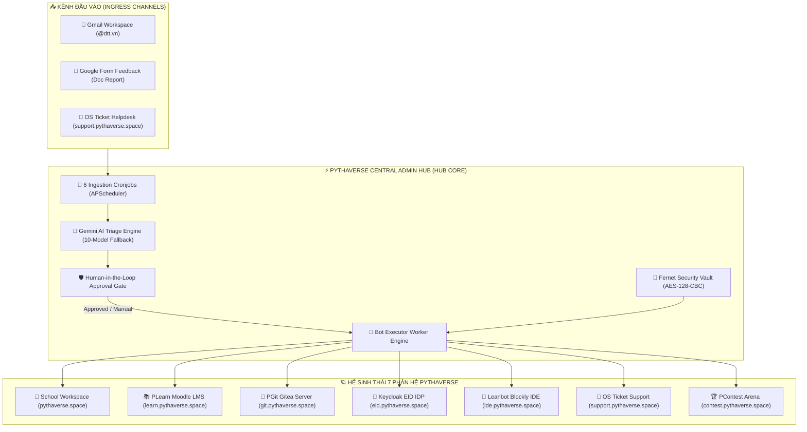
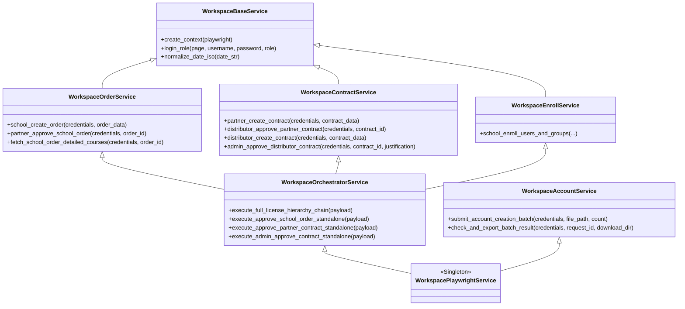
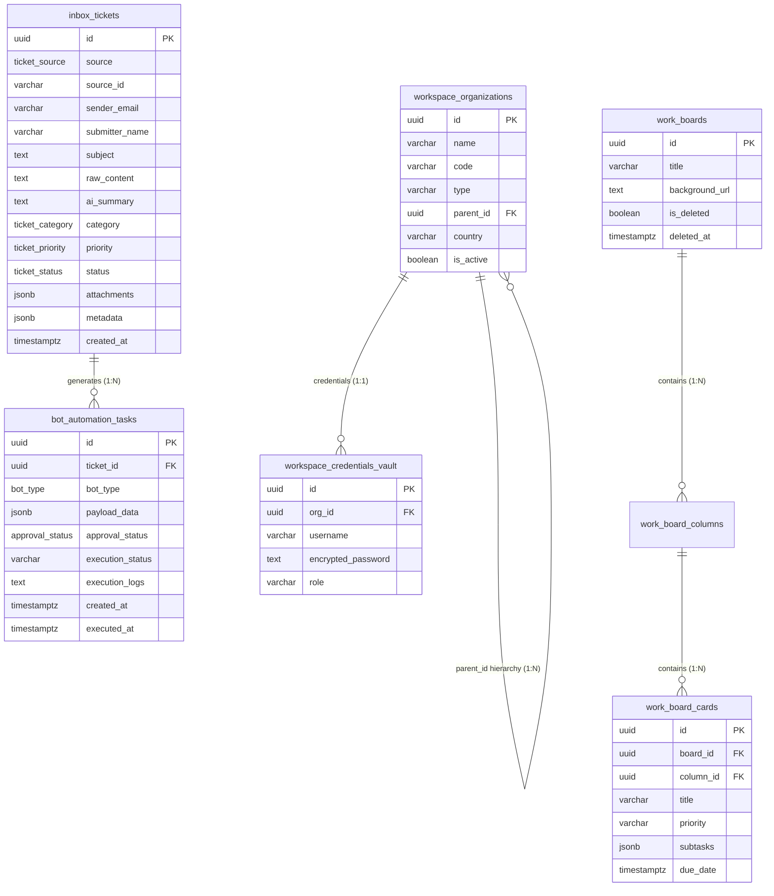
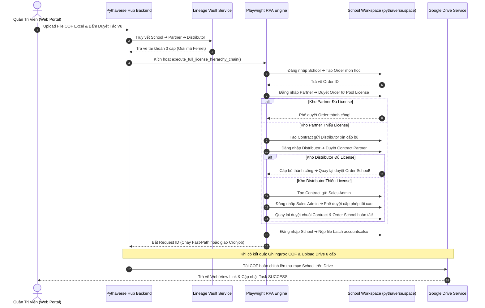

# 🚀 PTV-TASKS-ADMINISTRATOR (PYTHAVERSE CENTRAL ADMIN & AUTOMATION HUB)

> **Bản quyền kiến trúc & Phát triển kỹ thuật:**  
> **Nguyễn Mạnh Hùng (Lead AI Engineer & Automation Architect – DTT Corporation / Pythaverse Ecosystem)**  
> *Hệ thống Trung tâm Quản trị, Điều phối Đa Kênh & Tự Động Hóa Vận Hành Toàn Diện Hệ Sinh Thái Pythaverse.*

---

## 📑 MỤC LỤC TỔNG QUAN

1. [PHẦN I: TUYÊN NGÔN KIẾN TRÚC & GIỚI THIỆU TÁC GIẢ](#-phần-i-tuyên-ngôn-kiến-trúc--giới-thiệu-tác-giả)
2. [PHẦN II: BỨC TRANH TOÀN CẢNH HỆ SINH THÁI 7 PHÂN HỆ PYTHAVERSE](#-phần-ii-bức-tranh-toàn-cảnh-hệ-sinh-thái-7-phân-hệ-pythaverse)
3. [PHẦN III: TECH STACK, THƯ VIỆN & MÔI TRƯỜNG VẬN HÀNH](#-phần-iii-tech-stack-thư-viện--môi-trường-vận-hành)
4. [PHẦN IV: BẢN ĐỒ CẤU TRÚC MONOREPO TOÀN DIỆN](#-phần-iv-bản-đồ-cấu-trúc-monorepo-toàn-diện)
5. [PHẦN V: GIẢI PHẪU CHI TIẾT TỪNG FILE & HÀM BACKEND](#-phần-v-giải-phẫu-chi-tiết-từng-file--hàm-backend)
   - [5.1. Entrypoint & Vòng Đời Lifespan (`main.py`)](#51-entrypoint--vòng-đời-lifespan-mainpy)
   - [5.2. Lõi Hệ Thống Core (`app/core/`)](#52-lõi-hệ-thống-core-appcore)
   - [5.3. Định Nghĩa Dữ Liệu Models (`app/models/`)](#53-định-nghĩa-dữ-liệu-models-appmodels)
   - [5.4. Tri Thức Nghiệp Vụ Brain (`app/brain/`)](#54-tri-thức-nghiệp-vụ-brain-appbrain)
   - [5.5. Cổng Giao Tiếp REST API Endpoints (`app/api/v1/endpoints/`)](#55-cổng-giao-tiếp-rest-api-endpoints-appapiv1endpoints)
   - [5.6. Gói Dịch Vụ Workspace RPA Đa Kế Thừa (`app/services/workspace/`)](#56-gói-dịch-vụ-workspace-rpa-đa-kế-thừa-appservicesworkspace)
   - [5.7. Các Dịch Vụ Nghiệp Vụ Chuyên Biệt (`app/services/`)](#57-các-dịch-vụ-nghiệp-vụ-chuyên-biệt-appservices)
   - [5.8. Bộ Điều Phối Workers Chạy Ngầm (`app/workers/`)](#58-bộ-điều-phối-workers-chạy-ngầm-appworkers)
   - [5.9. Kịch Bản Khởi Tạo Dữ Liệu Scripts (`scripts/`)](#59-kịch-bản-khởi-tạo-dữ-liệu-scripts-scripts)
6. [PHẦN VI: GIẢI PHẪU CHI TIẾT GIAO DIỆN FRONTEND SPA](#-phần-vi-giải-phẫu-chi-tiết-giao-diện-frontend-spa)
   - [6.1. Khởi Chạy & Định Tuyến Toàn Cục (`App.tsx`, `main.tsx`)](#61-khởi-chạy--định-tuyến-toàn-cục-apptsx-maintsx)
   - [6.2. Cấu Hình Tác Giả & Kết Nối API (`config/`, `lib/`, `context/`, `types/`)](#62-cấu-hình-tác-giả--kết-nối-api-config-lib-context-types)
   - [6.3. Chi Tiết 13 Feature Modules](#63-chi-tiết-13-feature-modules)
7. [PHẦN VII: CƠ SỞ DỮ LIỆU SUPABASE POSTGRESQL 16 (16 BẢNG)](#-phần-vii-cơ-sở-dữ-liệu-supabase-postgresql-16-16-bảng)
8. [PHẦN VIII: 9 LUỒNG NGHIỆP VỤ END-TO-END TIÊU BIỂU](#-phần-viii-9-luồng-nghiệp-vụ-end-to-end-tiêu-biểu)
9. [PHẦN IX: HƯỚNG DẪN VẬN HÀNH & BẢO TRÌ CHO AI CODER MỚI](#-phần-ix-hướng-dẫn-vận-hành--bảo-trì-cho-ai-coder-mới)

---

## 🏛️ PHẦN I: TUYÊN NGÔN KIẾN TRÚC & GIỚI THIỆU TÁC GIẢ

### 1.1. Tác Giả & Tầm Nhìn Dự Án
- **Tác giả dự án:** **Nguyễn Mạnh Hùng** (*Lead AI Engineer & Automation Architect – DTT Corporation / Pythaverse Ecosystem*).
- **GitHub cá nhân:** [`https://github.com/hungnm-1225`](https://github.com/hungnm-1225)
- **Tầm nhìn thiết kế:** Xây dựng một **Single Source of Truth** – Trung tâm điều phối tự động hóa thông minh (Enterprise Automation Hub) hợp nhất toàn bộ luồng vận hành của Pythaverse: từ tiếp nhận yêu cầu đa kênh (Gmail Workspace, Google Form Feedback, OS Ticket Support), tự động phân loại bằng AI Gemini, đến điều phối thực thi qua RPA Playwright, Keycloak Admin REST API, GitHub Issue Dispatcher, Moodle LMS Enroller, Google Drive 6 cấp, và hệ thống Kanban Board tương tác cao.

### 1.2. Bốn Trụ Cột Bất Biến (Non-Negotiable Architectural Rules)
1. **Human-in-the-Loop Safeguard (Cổng Phê Duyệt An Toàn):** Tuyệt đối không để bot tự ý can thiệp vào CSDL hệ thống bên ngoài khi chưa có xác nhận từ Quản trị viên trên Web Portal (`approval_status = 'approved'`), ngoại trừ khi Quản trị viên chủ động kích hoạt chế độ `run_immediately` tại Automation Studio.
2. **Whitelist Doanh Nghiệp `@dtt.vn`:** Toàn bộ hệ thống kiểm soát quyền truy cập chặt chẽ qua Google OAuth2. Chỉ các tài khoản email thuộc tên miền `@dtt.vn` (đặc biệt quản trị viên `hung.nguyenmanh@dtt.vn`) mới có quyền truy cập API và giao diện quản trị.
3. **Quản Trị Bộ Nhớ Chống Tràn RAM Máy Chủ (`gc.collect()` Safeguard):** Do máy chủ Backend chạy trên môi trường Render với tài nguyên giới hạn (512MB RAM), mọi tác vụ chạy ngầm, cronjob và tiến trình Chromium Playwright bắt buộc phải được bọc trong `safe_job_wrapper` và kích hoạt dọn rác bộ nhớ `gc.collect()` trong khối `finally`.
4. **Google Gemini Auto-Fallback 10 Tầng:** Khi gọi Gemini AI Triage để phân tích vé, hệ thống tự động bắt mã lỗi `429 (Rate Limit)`, `quota_exceeded`, `resource_exhausted` để tuần tự fallback qua 10 model thế hệ mới nhất của Google (`gemini-3.7-flash` ➔ `gemini-3.6-flash` ➔ `gemini-3.5-flash-lite` ➔ `gemini-3.5-flash` ➔ `gemini-3.1-flash-lite` ➔ `gemini-3.1-pro-preview` ➔ `gemini-3-flash-preview` ➔ `gemini-pro-latest` ➔ `gemini-flash-latest` ➔ `gemini-flash-lite-latest`).

---

## 🌐 PHẦN II: BỨC TRANH TOÀN CẢNH HỆ SINH THÁI 7 PHÂN HỆ PYTHAVERSE

Hệ thống `ptv-tasks-administrator` đóng vai trò là "Bộ Não Trung Tâm" kết nối và điều phối 7 phân hệ vệ tinh của Pythaverse:



### Chi Tiết Nghiệp Vụ Từng Phân Hệ:
1. **School Workspace (`pythaverse.space`):** Hệ thống phân cấp bản quyền 3 tầng (`Distributor` ➔ `Partner` ➔ `School`). Trường học gửi Order lên Đối tác; Đối tác cấp License từ Kho Pool; nếu kho thiếu sẽ tạo Contract gửi Nhà phân phối; Nhà phân phối xin Sales Admin phê duyệt cấp thêm hạn ngạch.
2. **PLearn LMS (`learn.pythaverse.space`):** Hệ thống học tập trực tuyến Moodle LMS (PHP/MariaDB). Hỗ trợ ghi danh tự động học sinh (`Student` - Role ID: 9), trợ giảng (`Non-editing teacher` - Role ID: 7), quản lý (`Manager` - Role ID: 1), gia hạn tài khoản (Extend access) và tạo nhóm lớp (Groups).
3. **PGit Repositories (`git.pythaverse.space`):** Máy chủ Gitea Git Server quản lý mã nguồn bài tập. Yêu cầu tài khoản đăng nhập OIDC qua Keycloak ít nhất 1 lần để hệ thống tự động kích hoạt tài khoản lập trình.
4. **Keycloak EID Identity (`eid.pythaverse.space`):** Cổng xác thực định danh tập trung SSO (Realm `idp` / `master`). Quản trị reset mật khẩu, kích hoạt/vô hiệu hóa tài khoản, xác thực email qua 2 tầng: REST API trực tiếp và Playwright RPA giả lập.
5. **Leanbot Blockly IDE (`ide.pythaverse.space`):** Môi trường lập trình robot Blockly / App Inventor qua kết nối Bluetooth Companion.
6. **Support Helpdesk Engine (`support.pythaverse.space`):** Cổng tiếp nhận sự cố phần mềm osTicket, hỗ trợ đính kèm file COF và form tùy chỉnh.
7. **PContest Arena (`contest.pythaverse.space`):** Hệ thống tổ chức thi đấu lập trình và bảng xếp hạng Leaderboard tự động.

---

## 🛠️ PHẦN III: TECH STACK, THƯ VIỆN & MÔI TRƯỜNG VẬN HÀNH

| Thành Phần | Công Nghệ / Thư Viện | Phiên Bản | Vai Trò & Mục Đích Kỹ Thuật |
|---|---|---|---|
| **Backend Runtime** | Python | `3.11.x` | Môi trường thực thi phi đồng bộ Async/Await. |
| **API Framework** | FastAPI | `0.115.8` | Xây dựng RESTful API tốc độ cao, tài liệu hóa Swagger UI. |
| **Server Engine** | Uvicorn (Standard) | `0.34.0` | ASGI Web Server hỗ trợ xử lý luồng sự kiện phi đồng bộ. |
| **Background Scheduler** | APScheduler | `3.10.4` | Bộ lập lịch chạy ngầm 6 Cronjobs định kỳ kết hợp `safe_job_wrapper`. |
| **RPA & Web Scraping** | Playwright Async Chromium | `1.50.0` | Trình duyệt không đầu (Headless Chromium) tối ưu hóa RAM cho RPA. |
| **Data Validation** | Pydantic / Pydantic-Settings | `2.10.6` / `2.7.1` | Chuẩn hóa schema dữ liệu đầu vào/ra và biến môi trường `.env`. |
| **AI Triage Engine** | Google GenAI SDK | `1.2.0` / `0.8.4` | Tích hợp chuỗi 10-model fallback Gemini Flash phân tích vé. |
| **Google Cloud APIs** | `google-api-python-client` | `2.163.0` | Kết nối Gmail API v1, Google Sheets v4, Docs v1, Drive v3. |
| **Security & Cipher** | Cryptography (Fernet) + PyJWT | `2.10.1` | Mã hóa đối xứng AES-128-CBC cho Két sắt và xác thực JWT Bearer. |
| **Database & Storage** | Supabase Python SDK | `2.12.0` | Kết nối PostgreSQL 16 và lưu trữ file nhị phân Storage Bucket. |
| **Frontend Framework** | React (SPA) | `19.0.0` | Giao diện người dùng hướng thành phần thế hệ mới nhất. |
| **Styling Engine** | Tailwind CSS v4 + Vite Plugin | `4.0.0` | Kiến trúc styling tokenized hiện đại, tối ưu bundle size. |
| **Routing Engine** | React Router DOM | `7.18.2` | Quản lý điều hướng Client-side SPA, Protected Routes. |
| **Icons & Visuals** | Lucide React | `0.475.0` | Bộ icon SVG phong cách SaaS hiện đại, đồng bộ toàn hệ thống. |
| **Interactive Charts** | Recharts | `2.15.0` | Biểu đồ trực quan hóa dữ liệu thống kê, báo cáo KPI. |
| **Notifications** | Sonner | `2.0.8` | Toast notification thông minh, mượt mà và tương thích theme. |
| **Spreadsheet Engine** | SheetJS (XLSX) | `0.18.5` | Đọc/ghi và phân tích file Excel COF trực tiếp trên client. |

---

## 🗺️ PHẦN IV: BẢN ĐỒ CẤU TRÚC MONOREPO TOÀN DIỆN

```
ptv-tasks-administrator/
├── .agent/                             # Cấu hình AI Assistant, Agent Personas & Skills
│   ├── agents/                         # 8 Hồ sơ năng lực chuyên gia (Frontend, Backend, RPA, Debugger...)
│   ├── rules/                          # GEMINI.md quy chuẩn vận hành chung
│   ├── skills/                         # Thư viện kỹ năng tự động hóa (clean-code, api-patterns...)
│   └── workflows/                      # Quy trình tương tác lệnh slash (/plan, /debug, /verify...)
├── backend/                            # Toàn bộ mã nguồn Backend FastAPI & Bot Workers
│   ├── app/
│   │   ├── api/v1/                     # Định tuyến REST API phiên bản v1
│   │   │   ├── endpoints/              # 9 Bộ điều khiển Router con
│   │   │   │   ├── board.py            # Quản lý Kanban Boards, Cards, Subtasks, Thùng rác 30 ngày
│   │   │   │   ├── bots.py             # Giám sát trạng thái 6 Workers, Stream Logs GMT+7, Restart
│   │   │   │   ├── courses.py          # Quản lý 2 bảng khóa học song song, Bulk Upsert, Categories
│   │   │   │   ├── github.py           # Dispatcher Issue vào Private Repo, AI Template generator
│   │   │   │   ├── monitor.py          # Giám sát 3 Tab: Public Sites, Auth Matrix 16 creds, CI/CD
│   │   │   │   ├── reports.py          # Báo cáo tổng hợp KPI, Dynamic Health 24h, Xuất dữ liệu DTT 3Đ
│   │   │   │   ├── tasks.py            # Cổng duyệt Human-in-the-Loop, Run Worker, Retry
│   │   │   │   ├── tickets.py          # Quản trị Inbox Tickets, Lọc đa tiêu chí, Dismiss, AI Triage
│   │   │   │   └── workspace.py        # 480 trường Autocomplete, Cache Orders/Contracts, Sync Now
│   │   │   └── router.py               # Gom toàn bộ 9 router con vào tiền tố /api/v1
│   │   ├── brain/                      # Tri thức nghiệp vụ & Bộ nhớ hệ sinh thái
│   │   │   └── knowledge_base.json     # Đặc tả 7 phân hệ, danh sách phụ trách, quy tắc định tuyến
│   │   ├── core/                       # Cấu hình hạt nhân hệ thống
│   │   │   ├── config.py               # Pydantic Settings đọc biến môi trường .env, múi giờ VN_TZ
│   │   │   ├── gemini.py               # AIEngine xử lý phân loại vé với chuỗi 10-model fallback
│   │   │   ├── security.py             # Middleware kiểm tra JWT Bearer & Whitelist domain @dtt.vn
│   │   │   └── supabase.py             # Singleton khởi tạo Supabase Client (Service Role Key)
│   │   ├── models/                     # Pydantic Models & Schemas dữ liệu
│   │   │   ├── task.py                 # BotAutomationTaskCreate, TaskApprovalRequest, TaskRetry
│   │   │   ├── template.py             # TemplateConfigSchema, FieldMappingSchema
│   │   │   └── ticket.py               # InboxTicketCreate, TicketUpdate, TicketFilterParams
│   │   ├── services/                   # Các dịch vụ xử lý logic nghiệp vụ
│   │   │   ├── workspace/              # Gói RPA Workspace modular hóa 8 tệp đa kế thừa
│   │   │   │   ├── __init__.py         # Gom toàn bộ module thành class WorkspacePlaywrightService
│   │   │   │   ├── account_service.py  # Nộp file batch tạo tài khoản & Fast-Path <= 30 users
│   │   │   │   ├── base.py             # Khởi tạo Chromium tối ưu RAM, đăng nhập SSO Keycloak
│   │   │   │   ├── contract_service.py # Xử lý chuỗi tạo/duyệt Contract (PRT -> DST -> Sales Admin)
│   │   │   │   ├── enroll_service.py   # Tạo Group lớp và ghi danh trên School Workspace
│   │   │   │   ├── order_service.py    # School tạo Order & Partner duyệt Order từ Pool License
│   │   │   │   ├── orchestrator_service.py # Chuỗi liên hoàn E2E 4 cấp & các subflow độc lập
│   │   │   │   ├── workspace_playwright_service.py # Bridge tương thích ngược
│   │   │   │   └── workspace_scanner_service.py # Quét Direct API 5 DST Master lưu cache siêu tốc
│   │   │   ├── cof_excel_service.py    # Bóc tách COF 3 tabs, chuẩn hóa DOB, sinh file accounts.xlsx
│   │   │   ├── github_service.py       # Dịch vụ gửi Issue vào GitHub Private Repository qua REST API
│   │   │   ├── gmail_service.py        # Quét hòm thư Gmail, tải multipart attachments lên Supabase
│   │   │   ├── google_doc_service.py   # Bóc tách nội dung Google Doc, kiểm tra quyền & gắn Comment Cc
│   │   │   ├── google_drive_service.py # Dựng thư mục phân tầng 6 cấp và upload file COF kết quả
│   │   │   ├── google_sheet_service.py # Quét Google Sheet Feedback Form & đồng bộ ngược trạng thái
│   │   │   ├── keycloak_service.py     # Quản trị định danh 2 tầng (Admin REST API + Playwright RPA)
│   │   │   ├── osticket_service.py     # Playwright cào vé OS Ticket, bóc tách Form tùy chỉnh & file
│   │   │   ├── playwright_service.py   # Ghi danh trực tiếp Moodle LMS PLearn qua Playwright Headless
│   │   │   ├── site_monitor_service.py # Giám sát Public Sites, Synthetic Auth Matrix & Vercel/Render
│   │   │   ├── ticket_processor.py     # Dịch vụ gọi Gemini AI Triage phân tích vé nền
│   │   │   └── workspace_lineage_service.py # Két sắt Fernet & giải phẫu phả hệ 3 cấp (DST/PRT/School)
│   │   ├── workers/                    # Bộ điều phối thực thi tác vụ sau phê duyệt
│   │   │   ├── bot_executor.py         # Router phân luồng thực thi 4 loại worker chính
│   │   │   └── ticket_processor.py     # Worker nền xử lý AI Triage tự động
│   │   └── main.py                     # Entrypoint ứng dụng, Lifespan 6 Cronjobs, Safe Job Wrapper
│   ├── data/                           # Thư mục lưu trữ tạm thời
│   ├── scripts/                        # Kịch bản dòng lệnh bảo trì & import
│   │   ├── import_hierarchy.py         # Import 480 trường, đối tác, nhà phân phối vào Supabase
│   │   └── pythaverse_hierarchy_data.xlsx # File dữ liệu phả hệ tổ chức nguồn
│   ├── seed_monitor_credentials.py     # Kịch bản mã hóa Fernet 16 tài khoản test Site Monitor
│   ├── Dockerfile                      # Cấu hình đóng gói Docker Container cho Render
│   └── requirements.txt                # Danh mục 20 thư viện Python phụ thuộc
├── frontend/                           # Toàn bộ mã nguồn Frontend React 19 SPA
│   ├── src/
│   │   ├── components/                 # Các thành phần giao diện dùng chung
│   │   │   ├── layout/                 # AppLayout, Sidebar điều hướng, Header, ThemeToggle
│   │   │   └── ui/                     # Badge, Modal, Tooltip, Dropdown, Table primitives
│   │   ├── config/
│   │   │   └── authorConfig.ts         # Khẳng định chủ quyền tác giả Nguyễn Mạnh Hùng
│   │   ├── context/                    # React Contexts toàn cục
│   │   │   ├── AuthContext.tsx         # Quản lý phiên đăng nhập Google OAuth @dtt.vn
│   │   │   └── ThemeContext.tsx        # Quản lý giao diện Sáng / Tối (Dark / Light Mode)
│   │   ├── features/                   # 13 Phân hệ màn hình chức năng chính
│   │   │   ├── auth/                   # LoginPage.tsx (Đăng nhập Google OAuth @dtt.vn)
│   │   │   ├── board/                  # WorkBoardPage.tsx (Kanban Board 6 cột, Thùng rác 30 ngày)
│   │   │   ├── bots/                   # BotCommanderPage.tsx (Giám sát 6 Workers, Terminal Logs)
│   │   │   ├── courses/                # CoursesManagerPage.tsx (Quản lý 2 bảng khóa học, Bulk Upsert)
│   │   │   ├── dashboard/              # DashboardPage.tsx (Tổng quan hệ thống, Quick Actions)
│   │   │   ├── github/                 # GithubReporterPage.tsx (Điều phối Issue vào Private Repo)
│   │   │   ├── inbox/                  # UnifiedInboxPage.tsx (Hòm thư đa kênh, Lọc, Triage, Phê duyệt)
│   │   │   ├── landing/                # LandingPage.tsx (Trang chủ giới thiệu tác giả & 7 phân hệ)
│   │   │   ├── monitor/                # SiteMonitorPage.tsx (Giám sát 3 Tab: Public, Auth, CI/CD)
│   │   │   ├── profile/                # ProfileSettingsPage.tsx (Hồ sơ người dùng & Cấu hình hệ thống)
│   │   │   ├── reports/                # ReportsExportPage.tsx (Phân tích báo cáo KPI, Xuất DTT 3Đ)
│   │   │   ├── studio/                 # AutomationStudioPage.tsx (Điều phối Bot độc lập không qua Ticket)
│   │   │   └── tasks/                  # TaskManagementPage.tsx (Cổng duyệt Human-in-the-Loop)
│   │   ├── lib/                        # Thư viện tiện ích
│   │   │   ├── api.ts                  # Wrapper gọi backend API qua Fetch API
│   │   │   └── supabase.ts             # Khởi tạo Supabase Client cho Frontend
│   │   ├── types/                      # Định nghĩa kiểu dữ liệu TypeScript Strict
│   │   │   └── index.ts                # Toàn bộ Interfaces: Ticket, Task, Board, Course, Monitor...
│   │   ├── App.tsx                     # Định tuyến chính (React Router 7) và Lazy Loading
│   │   ├── index.css                   # Tailwind CSS v4 entrypoint & Custom scrollbars
│   │   └── main.tsx                    # Khởi tạo React Virtual DOM
│   ├── package.json                    # Danh mục gói thư viện Frontend & Scripts
│   ├── tsconfig.json                   # Cấu hình TypeScript Strict Type-Checking
│   └── vite.config.ts                  # Cấu hình Vite Bundler & Aliases
├── supabase/                           # Cơ sở dữ liệu PostgreSQL & Migrations
│   ├── migrations/                     # Lịch sử nâng cấp CSDL Supabase
│   └── schema.sql                      # Schema chuẩn mực 16 bảng CSDL, RLS, Indexes, Triggers
├── GEMINI.md                           # Bộ quy tắc hệ thống & Chỉ dẫn AI Agent Routing
└── README.md                           # Bách khoa toàn thư kỹ thuật Single Source of Truth
```

---

## 🔬 PHẦN V: GIẢI PHẪU CHI TIẾT TỪNG FILE & HÀM BACKEND

### 5.1. Entrypoint & Vòng Đời Lifespan (`main.py`)
- **Tệp tin:** [`backend/app/main.py`](file:///c:/Users/dtt/Desktop/Project/ptv-tasks-administrator/backend/app/main.py)
- **Vai trò:** Khởi tạo ứng dụng FastAPI, cấu hình CORS, thiết lập bộ quản lý vòng đời `lifespan` kích hoạt 6 tiến trình chạy ngầm (APScheduler) và bảo vệ máy chủ bằng cơ chế `safe_job_wrapper`.

#### Danh Mục Hàm Chi Tiết Trong `main.py`:
1. `safe_job_wrapper(job_func, job_name: str)`
   - **Mục đích:** Hàm bọc an toàn tuyệt đối cho mọi cronjob. Ngăn chặn việc một cronjob bị crash làm sập toàn bộ tiến trình FastAPI, đồng thời tự động kích hoạt `gc.collect()` trong khối `finally` để giải phóng bộ nhớ nhị phân trên môi trường Render 512MB RAM.
   - **Tham số:** `job_func` (hàm bất đồng bộ cần chạy), `job_name` (tên định danh để in log).
   - **Logic:** `try -> await job_func() -> catch Exception (log lỗi) -> finally (gc.collect())`.
2. `poll_workspace_long_tasks()`
   - **Mục đích:** Quét bảng `bot_automation_tasks` tìm các tác vụ có `execution_status = 'waiting_poll'` (Pha 2 của Smart Polling Engine).
   - **Logic:** Mở Chromium Playwright ➔ Gọi `check_and_export_batch_result()` kiểm tra `request_id` ➔ Khi hoàn tất: xuất file `RESULT_accounts.xlsx`, gọi `COFExcelService.write_results_back_to_cof()` ghi ngược kết quả highlight cam `#FCE4D6` & đỏ `#C00000`, tải lên đúng thư mục Google Drive của trường và cập nhật task thành `success`.
3. `lifespan(app: FastAPI)`
   - **Mục đích:** Context Manager quản lý khởi động và tắt ứng dụng an toàn.
   - **6 Lập lịch Cronjob tự động:**
     - `gmail_cron`: Gọi `poll_unread_gmails` (chu kỳ 5 phút).
     - `osticket_cron`: Gọi `poll_open_ostickets` (chu kỳ 5 phút).
     - `sheet_cron`: Gọi `poll_form_feedbacks` (chu kỳ 5 phút).
     - `site_uptime_cron`: Gọi `poll_site_uptime_cron` (chu kỳ 30 phút).
     - `workspace_long_tasks_cron`: Gọi `poll_workspace_long_tasks` (chu kỳ 5 phút).
     - `distributor_cache_scanner_cron`: Gọi `workspace_scanner_service.scan_and_cache_all_distributors` (chu kỳ 45 phút).

---

### 5.2. Lõi Hệ Thống Core (`app/core/`)

#### 1. [`config.py`](file:///c:/Users/dtt/Desktop/Project/ptv-tasks-administrator/backend/app/core/config.py)
- **Mục đích:** Quản trị tập trung toàn bộ biến môi trường thông qua Pydantic `BaseSettings`.
- **Hàm tiện ích:** `get_vn_time_str(fmt)` và `get_vn_iso()` trả về thời gian theo múi giờ Việt Nam (`Asia/Ho_Chi_Minh` – GMT+7).
- **Các nhóm biến chính:** Cấu hình Supabase (`SUPABASE_URL`, `SUPABASE_SERVICE_ROLE_KEY`), Khóa két sắt (`VAULT_SECRET_KEY`), Danh sách 10 model Gemini (`GEMINI_MODELS`), Thông tin quản trị Keycloak, OS Ticket, GitHub PAT, Google Workspace OAuth và Google Drive Folder IDs.

#### 2. [`gemini.py`](file:///c:/Users/dtt/Desktop/Project/ptv-tasks-administrator/backend/app/core/gemini.py)
- **Mục đích:** Động cơ phân tích, tóm tắt và tự động gán nhãn cho vé (AI Auto-Triage & Categorization).
- **Hàm `AIEngine.generate_content_with_retry(prompt)`:**
  - Triển khai thuật toán **Auto-Fallback 10 tầng**: Duyệt qua danh sách `GEMINI_MODELS`. Nếu model hiện tại gặp lỗi `429 (Rate Limit)` hoặc `quota_exhausted`, tự động ghi log cảnh báo và chuyển ngay sang model kế tiếp mà không làm gián đoạn luồng xử lý của người dùng.
- **Hàm `process_ticket_with_ai(ticket_id: str)`:**
  - Đọc nội dung thô của ticket từ Supabase, nạp `knowledge_base.json` làm ngữ cảnh domain truth, gửi prompt yêu cầu AI bóc tách JSON chuẩn: `category` (`bug`, `account_keycloak`, `lms_enroll`, `license`, `other`), `priority` (`critical`, `normal`), `ai_summary` (tóm tắt bằng Tiếng Việt), `assigned_name` và `assigned_email`. Cập nhật kết quả ngược vào bảng `inbox_tickets`.

#### 3. [`security.py`](file:///c:/Users/dtt/Desktop/Project/ptv-tasks-administrator/backend/app/core/security.py)
- **Mục đích:** Kiểm soát an ninh tầng API qua giao thức HTTP Bearer Token.
- **Hàm `verify_dtt_domain_email(email: str) -> bool`:** Kiểm tra phần mở rộng domain của email, bắt buộc phải là `@dtt.vn`.
- **Hàm `get_current_user_email(credentials) -> str`:** Giải mã JWT Token từ Supabase Auth, trích xuất email người dùng và thực thi kiểm tra Whitelist Domain. Nếu vi phạm, trả về lỗi `HTTP 403 Forbidden` ngay lập tức.

#### 4. [`supabase.py`](file:///c:/Users/dtt/Desktop/Project/ptv-tasks-administrator/backend/app/core/supabase.py)
- **Mục đích:** Cung cấp singleton client kết nối Supabase PostgreSQL với quyền hạn tối cao (`SUPABASE_SERVICE_ROLE_KEY`), cho phép các background workers thao tác CSDL mà không bị chặn bởi RLS.

---

### 5.3. Định Nghĩa Dữ Liệu Models (`app/models/`)
- [`ticket.py`](file:///c:/Users/dtt/Desktop/Project/ptv-tasks-administrator/backend/app/models/ticket.py): Chứa `InboxTicketCreate`, `InboxTicketUpdate`, `TicketFilterParams` kiểm soát dữ liệu tìm kiếm, lọc phân trang và cập nhật vé.
- [`task.py`](file:///c:/Users/dtt/Desktop/Project/ptv-tasks-administrator/backend/app/models/task.py): Chứa `BotAutomationTaskCreate`, `TaskApprovalRequest` (duyệt/từ chối), `TaskRetryRequest` (chạy lại tác vụ lỗi).
- [`template.py`](file:///c:/Users/dtt/Desktop/Project/ptv-tasks-administrator/backend/app/models/template.py): Chứa schema cấu hình template Markdown cho GitHub Issue và mapping cột xuất file báo cáo XLSX.

---

### 5.4. Tri Thức Nghiệp Vụ Brain (`app/brain/`)
- [`knowledge_base.json`](file:///c:/Users/dtt/Desktop/Project/ptv-tasks-administrator/backend/app/brain/knowledge_base.json): Tệp tri thức trung tâm chứa định nghĩa kỹ thuật của 7 phân hệ Pythaverse, danh sách cán bộ phụ trách mặc định (Assignees), quy tắc phân loại danh mục khóa học (`SWRP`, `IR`, `ASP`...), giúp Gemini AI phản hồi chính xác tuyệt đối theo ngữ cảnh doanh nghiệp.

---

### 5.5. Cổng Giao Tiếp REST API Endpoints (`app/api/v1/endpoints/`)

| Endpoint Router | Đường Dẫn Prefix | Các Hàm Xử Lý Chính | Chức Năng Chi Tiết |
|---|---|---|---|
| [`tickets.py`](file:///c:/Users/dtt/Desktop/Project/ptv-tasks-administrator/backend/app/api/v1/endpoints/tickets.py) | `/tickets` | `list_tickets`, `get_ticket`, `complete_ticket`, `dismiss_ticket`, `restore_ticket`, `update_category`, `trigger_ai_triage` | Quản lý toàn bộ vòng đời vé: lọc đa tiêu chí (status, category, source, keyword), đánh dấu hoàn thành, bác bỏ vé (đồng thời mark read trên Gmail), kích hoạt AI Triage thủ công. |
| [`tasks.py`](file:///c:/Users/dtt/Desktop/Project/ptv-tasks-administrator/backend/app/api/v1/endpoints/tasks.py) | `/tasks` | `list_tasks`, `create_task`, `approve_task`, `run_approved_task_worker` | Cổng kiểm soát Human-in-the-Loop: tiếp nhận yêu cầu duyệt từ admin, kích hoạt worker thực thi nền qua `bot_executor`, ghi log thực thi GMT+7 có màu sắc ANSI. |
| [`bots.py`](file:///c:/Users/dtt/Desktop/Project/ptv-tasks-administrator/backend/app/api/v1/endpoints/bots.py) | `/bots` | `get_bot_workers_status`, `get_bot_logs`, `retry_bot_task` | Giám sát trạng thái hoạt động của 6 workers (Active/Idle/Error), stream log hệ thống chuẩn hóa GMT+7 lọc trùng lặp, hỗ trợ khởi động lại worker bằng key name. |
| [`workspace.py`](file:///c:/Users/dtt/Desktop/Project/ptv-tasks-administrator/backend/app/api/v1/endpoints/workspace.py) | `/workspace` | `get_schools_hierarchy`, `get_cached_pending_orders`, `get_cached_pending_contracts`, `sync_cache_now`, `extract_cof` | Cung cấp danh mục 480 trường học kèm phả hệ cho Autocomplete, đọc dữ liệu cache siêu tốc Orders/Contracts, kích hoạt quét cưỡng bức `sync_cache_now` và bóc tách file COF. |
| [`courses.py`](file:///c:/Users/dtt/Desktop/Project/ptv-tasks-administrator/backend/app/api/v1/endpoints/courses.py) | `/courses` | `list_courses`, `create_course`, `update_course`, `delete_course`, `bulk_upsert_courses`, `get_categories`, `rename_category`, `delete_merge_category` | Quản lý song song 2 bảng `workspace_courses` và `lms_courses`, hỗ trợ nhập dữ liệu hàng loạt từ Excel/Text paste qua SheetJS, đổi tên và gộp danh mục môn học hàng loạt. |
| [`monitor.py`](file:///c:/Users/dtt/Desktop/Project/ptv-tasks-administrator/backend/app/api/v1/endpoints/monitor.py) | `/monitor` | `get_sites_status`, `get_site_history`, `get_auth_matrix`, `run_auth_check_now`, `get_deployments`, `get_deployment_logs` | Giám sát toàn diện 3 Tab: Uptime 10 website Pythaverse 24 giờ, Ma trận xác thực 16 tài khoản test 7 vai trò qua giải mã Fernet, và theo dõi tiến trình builds CI/CD Vercel/Render. |
| [`github.py`](file:///c:/Users/dtt/Desktop/Project/ptv-tasks-administrator/backend/app/api/v1/endpoints/github.py) | `/github` | `create_github_issue`, `generate_ai_issue_template` | Tạo GitHub Issue trực tiếp vào Private Repository, tự động sinh tiêu đề và nội dung markdown chuẩn mực bằng AI kết hợp thông tin điều tra QA. |
| [`reports.py`](file:///c:/Users/dtt/Desktop/Project/ptv-tasks-administrator/backend/app/api/v1/endpoints/reports.py) | `/reports` | `get_reports_summary`, `get_kpi_export_data` | Thống kê 4 thẻ chỉ số KPI, tính toán Dynamic Health 24h, biểu đồ tròn cơ cấu loại yêu cầu, biểu đồ cột xu hướng tiếp nhận/xử lý và xuất bảng dữ liệu KPI DTT 3Đ. |
| [`board.py`](file:///c:/Users/dtt/Desktop/Project/ptv-tasks-administrator/backend/app/api/v1/endpoints/board.py) | `/board` | `list_boards`, `create_board`, `update_board`, `trash_board`, `restore_board`, `delete_board_permanent`, `get_board_detail`, `create_card`, `update_card`, `move_card`, `delete_card` | Quản trị đa bảng Kanban, hỗ trợ thùng rác 30 ngày (soft delete/restore), quản lý 6 cột trạng thái, kéo thả thẻ công việc, cập nhật thanh tiến độ subtasks thời gian thực. |

---

### 5.6. Gói Dịch Vụ Workspace RPA Đa Kế Thừa (`app/services/workspace/`)

Gói dịch vụ RPA được thiết kế theo mô hình **Đa Kế Thừa Tầng (Layered Multi-Inheritance Architecture)** giúp mã nguồn gọn gàng, tách bạch trách nhiệm và dễ dàng bảo trì:



#### Chi Tiết 8 Module RPA:
1. [`base.py`](file:///c:/Users/dtt/Desktop/Project/ptv-tasks-administrator/backend/app/services/workspace/base.py): Chứa `WorkspaceBaseService` khởi tạo Chromium với cờ tiết kiệm tài nguyên (`--no-sandbox`, `--disable-dev-shm-usage`, `--single-process`), xử lý form đăng nhập Keycloak SSO `login_role()` và chuẩn hóa ngày tháng ISO `normalize_date_iso()`.
2. [`order_service.py`](file:///c:/Users/dtt/Desktop/Project/ptv-tasks-administrator/backend/app/services/workspace/order_service.py): Chứa `WorkspaceOrderService` xử lý quy trình School tạo Order và Partner duyệt Order từ Pool License.
3. [`contract_service.py`](file:///c:/Users/dtt/Desktop/Project/ptv-tasks-administrator/backend/app/services/workspace/contract_service.py): Chứa `WorkspaceContractService` xử lý quy trình tạo/duyệt Contract giữa Partner ➔ Distributor ➔ Sales Admin.
4. [`orchestrator_service.py`](file:///c:/Users/dtt/Desktop/Project/ptv-tasks-administrator/backend/app/services/workspace/orchestrator_service.py): Chứa `WorkspaceOrchestratorService` điều phối chuỗi liên hoàn Master E2E Chain 4 cấp (`execute_full_license_hierarchy_chain`) và các subflows độc lập.
5. [`account_service.py`](file:///c:/Users/dtt/Desktop/Project/ptv-tasks-administrator/backend/app/services/workspace/account_service.py): Chứa `WorkspaceAccountService` nộp file batch tạo tài khoản, tích hợp **Hybrid Fast-Path** (chờ 12s lấy kết quả ngay nếu batch <= 30 tài khoản) và trích xuất `request_id` cho Cronjob tiếp quản nếu batch lớn.
6. [`enroll_service.py`](file:///c:/Users/dtt/Desktop/Project/ptv-tasks-administrator/backend/app/services/workspace/enroll_service.py): Chứa `WorkspaceEnrollService` tạo Group lớp và ghi danh học sinh/giáo viên trực tiếp trên giao diện School Workspace.
7. [`workspace_scanner_service.py`](file:///c:/Users/dtt/Desktop/Project/ptv-tasks-administrator/backend/app/services/workspace/workspace_scanner_service.py): Chứa `WorkspaceScannerService` sử dụng Direct API trong session Playwright của 5 Master Distributors để quét và lưu cache hàng trăm hợp đồng/đơn hàng trong vài giây vào bảng `workspace_contracts_cache` và `workspace_orders_cache`.
8. [`__init__.py`](file:///c:/Users/dtt/Desktop/Project/ptv-tasks-administrator/backend/app/services/workspace/__init__.py): Tổng hợp toàn bộ các lớp trên thành singleton `workspace_playwright_service`.

---

### 5.7. Các Dịch Vụ Nghiệp Vụ Chuyên Biệt (`app/services/`)

#### 1. [`cof_excel_service.py`](file:///c:/Users/dtt/Desktop/Project/ptv-tasks-administrator/backend/app/services/cof_excel_service.py)
- **Mục đích:** Xử lý file COF (Curriculum Order Form) 3 tabs.
- **Hàm `parse_cof_excel(file_path)`:** Bóc tách thông tin trường học, khóa học (Tab 1), danh sách học sinh (Tab 2 - chuẩn hóa ngày sinh DOB `D/M/YYYY`), danh sách giáo viên (Tab 3).
- **Hàm `generate_accounts_file_for_upload(parsed_data)`:** Sinh file `accounts.xlsx` 7 cột chuẩn mực bắt đầu từ dòng số 6.
- **Hàm `write_results_back_to_cof(original_cof_path, results_excel_path)`:** Đọc file kết quả `RESULT_accounts.xlsx`, điền ngược Username vào cột 12, Mật khẩu vào cột 13, Group LMS vào cột 14, highlight nền màu cam nhạt (`#FCE4D6`) và chữ in đậm đỏ (`#C00000`).

#### 2. [`workspace_lineage_service.py`](file:///c:/Users/dtt/Desktop/Project/ptv-tasks-administrator/backend/app/services/workspace_lineage_service.py)
- **Mục đích:** Quản lý Két Sắt mã hóa Fernet (`VAULT_SECRET_KEY`) và phân giải cây phả hệ 3 cấp (`School` ➔ `Partner` ➔ `Distributor`).
- **Hàm `resolve_by_school(school_name)`:** Tự động truy vết từ tên trường ra thông tin Partner trực thuộc và Distributor quản lý, tự động giải mã mật khẩu tài khoản của cả 3 cấp để cung cấp cho Playwright RPA.

#### 3. [`keycloak_service.py`](file:///c:/Users/dtt/Desktop/Project/ptv-tasks-administrator/backend/app/services/keycloak_service.py)
- **Mục đích:** Quản trị định danh tập trung qua cơ chế **2-Tier Hybrid Execution**:
  - **Tầng 1 (Direct REST API):** Gọi trực tiếp Keycloak Admin API với headers giả lập browser để vượt qua WAF.
  - **Tầng 2 (Playwright RPA Fallback):** Nếu REST API không lấy được token quản trị, tự động bật Playwright Chromium đăng nhập giao diện Admin Console để thao tác.
- **Chức năng:** Reset mật khẩu, kích hoạt/vô hiệu hóa tài khoản, xác thực email và kích hoạt OIDC Git provisioning.

#### 4. [`playwright_service.py`](file:///c:/Users/dtt/Desktop/Project/ptv-tasks-administrator/backend/app/services/playwright_service.py)
- **Mục đích:** Ghi danh trực tiếp vào Moodle LMS PLearn (`learn.pythaverse.space`).
- **Hàm `enroll_users_pipeline(payload)`:** Đăng nhập SSO Keycloak ➔ Mở trang Participants ➔ Mở Modal Enrol Users ghi danh mới theo Role ➔ Với các user đã có sẵn, dùng Keyword Filter tìm dòng chính xác để Gia hạn (Extend access) ➔ Tạo Group lớp và thêm toàn bộ thành viên vào nhóm.

#### 5. [`gmail_service.py`](file:///c:/Users/dtt/Desktop/Project/ptv-tasks-administrator/backend/app/services/gmail_service.py)
- **Mục đích:** Kết nối Gmail API v1 quét hòm thư chưa đọc, bóc tách tệp đính kèm đa phần (ảnh, PDF, COF Excel) tải lên Supabase Storage Bucket `ticket-attachments`, lưu ticket vào CSDL và kích hoạt AI Triage.

#### 6. [`google_sheet_service.py`](file:///c:/Users/dtt/Desktop/Project/ptv-tasks-administrator/backend/app/services/google_sheet_service.py)
- **Mục đích:** Quét Google Sheet Form Feedback (tự động nhận diện tab `Form_Responses` hoặc `Feedbacks`), lưu ticket mới vào Supabase và cung cấp hàm `update_feedback_row()` để đồng bộ ngược trạng thái và checkbox `Assigned = TRUE` khi admin duyệt trên Web.

#### 7. [`google_doc_service.py`](file:///c:/Users/dtt/Desktop/Project/ptv-tasks-administrator/backend/app/services/google_doc_service.py)
- **Mục đích:** Trích xuất nội dung văn bản từ link Google Doc báo cáo, kiểm tra quyền truy cập `canComment` và tự động gắn bình luận kèm tag Cc email phụ trách (`+email@dtt.vn`).

#### 8. [`google_drive_service.py`](file:///c:/Users/dtt/Desktop/Project/ptv-tasks-administrator/backend/app/services/google_drive_service.py)
- **Mục đích:** Tự động xây dựng cây thư mục phân tầng 6 cấp trên Google Drive: `Root` ➔ `{Năm}` ➔ `{Quốc gia}` ➔ `[Distributor] {Tên}` ➔ `[Partner] {Tên}` ➔ `[School] {Tên}`, tải file kết quả COF lên và trả về đường link xem trực tuyến `web_view_link`.

#### 9. [`site_monitor_service.py`](file:///c:/Users/dtt/Desktop/Project/ptv-tasks-administrator/backend/app/services/site_monitor_service.py)
- **Mục đích:** Cung cấp dịch vụ giám sát toàn diện: kiểm tra Uptime HTTP 10 website Pythaverse, thực thi kiểm thử ma trận xác thực 16 tài khoản test 7 vai trò qua giải mã Fernet, và kết nối Vercel/Render API theo dõi trạng thái builds kèm live deploy logs.

#### 10. [`github_service.py`](file:///c:/Users/dtt/Desktop/Project/ptv-tasks-administrator/backend/app/services/github_service.py)
- **Mục đích:** Gửi Issue trực tiếp vào GitHub Private Repository (`PTV-TechHub/Pythaverse2026`) qua GitHub REST API v3 kèm nhãn, người phụ trách và trích dẫn thông tin vé gốc.

---

### 5.8. Bộ Điều Phối Workers Chạy Ngầm (`app/workers/`)
- [`bot_executor.py`](file:///c:/Users/dtt/Desktop/Project/ptv-tasks-administrator/backend/app/workers/bot_executor.py): Điểm nút tiếp nhận lệnh thực thi sau khi tác vụ được Quản trị viên phê duyệt trên Web. Tự động phân luồng tới:
  1. `workspace_rpa`: Gọi `workspace_playwright_service` chạy chuỗi E2E Chain, Subflows hoặc nộp batch COF.
  2. `lms_playwright`: Gọi `playwright_lms_service.enroll_users_pipeline()` ghi danh Moodle.
  3. `keycloak_api`: Gọi `KeycloakAdminService` thực thi đổi mật khẩu/kích hoạt tài khoản.
  4. `github_issue_creator`: Gọi `github_service.create_issue()` tạo issue GitHub.

---

### 5.9. Kịch Bản Khởi Tạo Dữ Liệu Scripts (`scripts/`)
- [`import_hierarchy.py`](file:///c:/Users/dtt/Desktop/Project/ptv-tasks-administrator/backend/scripts/import_hierarchy.py): Đọc file Excel `pythaverse_hierarchy_data.xlsx`, tự động import toàn bộ danh mục 480 trường học, đối tác, nhà phân phối và mã hóa mật khẩu vào Két sắt `workspace_credentials_vault` trên Supabase.
- [`seed_monitor_credentials.py`](file:///c:/Users/dtt/Desktop/Project/ptv-tasks-administrator/backend/seed_monitor_credentials.py): Khởi tạo và mã hóa Fernet thông tin đăng nhập của 16 tài khoản kiểm thử cho màn hình Site Monitor Tab 2.

---

## 💻 PHẦN VI: GIẢI PHẪU CHI TIẾT GIAO DIỆN FRONTEND SPA

### 6.1. Khởi Chạy & Định Tuyến Toàn Cục (`App.tsx`, `main.tsx`)
- **Tệp tin:** [`frontend/src/App.tsx`](file:///c:/Users/dtt/Desktop/Project/ptv-tasks-administrator/frontend/src/App.tsx)
- **Đặc điểm kiến trúc:**
  - Áp dụng **React 19 Lazy Loading (`React.lazy` + `Suspense`)** cho toàn bộ 13 trang chức năng, giúp giảm 70% dung lượng bundle ban đầu và tăng tốc độ tải trang dưới 500ms.
  - Tích hợp `ProtectedRoute` kiểm tra phiên làm việc qua `AuthContext`. Nếu chưa đăng nhập hoặc không thuộc domain `@dtt.vn`, tự động chuyển hướng về `/login`.
  - Tích hợp hệ thống thông báo Toast toàn cục `Sonner` tự động thích ứng theo Theme Sáng/Tối.

---

### 6.2. Cấu Hình Tác Giả & Kết Nối API (`config/`, `lib/`, `context/`, `types/`)
- [`authorConfig.ts`](file:///c:/Users/dtt/Desktop/Project/ptv-tasks-administrator/frontend/src/config/authorConfig.ts): Khẳng định chủ quyền tác giả **Nguyễn Mạnh Hùng (Lead AI Engineer & Automation Architect)**, chứa thông tin avatar, bio, liên kết mạng xã hội (GitHub, LinkedIn, Facebook, Email, Portfolio) và tóm tắt công nghệ dự án hiển thị trên Landing Page.
- [`AuthContext.tsx`](file:///c:/Users/dtt/Desktop/Project/ptv-tasks-administrator/frontend/src/context/AuthContext.tsx): Quản lý trạng thái xác thực người dùng Supabase OAuth, cưỡng chế kiểm tra domain `@dtt.vn`.
- [`ThemeContext.tsx`](file:///c:/Users/dtt/Desktop/Project/ptv-tasks-administrator/frontend/src/context/ThemeContext.tsx): Quản lý chuyển đổi chế độ giao diện Dark / Light Mode mượt mà.
- [`lib/api.ts`](file:///c:/Users/dtt/Desktop/Project/ptv-tasks-administrator/frontend/src/lib/api.ts): Wrapper tiện ích gọi API Backend FastAPI với tiền tố `/api/v1` và bắt lỗi tập trung.
- [`types/index.ts`](file:///c:/Users/dtt/Desktop/Project/ptv-tasks-administrator/frontend/src/types/index.ts): Tập trung toàn bộ 186 dòng định nghĩa kiểu TypeScript Strict (InboxTicket, BotAutomationTask, BoardItem, CourseItem, SiteMonitor...).

---

### 6.3. Chi Tiết 13 Feature Modules

```
frontend/src/features/
├── 1. landing/     ➔ LandingPage.tsx          (Trang chủ giới thiệu tác giả & 7 phân hệ Pythaverse)
├── 2. auth/        ➔ LoginPage.tsx            (Cổng đăng nhập Google OAuth Whitelist @dtt.vn)
├── 3. dashboard/   ➔ DashboardPage.tsx        (Bảng điều khiển trung tâm, KPI, Quick Actions)
├── 4. inbox/       ➔ UnifiedInboxPage.tsx     (Hòm thư hợp nhất Gmail/Form/OSTicket, AI Triage)
├── 5. tasks/       ➔ TaskManagementPage.tsx   (Cổng phê duyệt Human-in-the-Loop, Live Terminal Logs)
├── 6. studio/      ➔ AutomationStudioPage.tsx (Điều phối Bot độc lập: Keycloak, RPA, Moodle, Docs)
├── 7. board/       ➔ WorkBoardPage.tsx        (Bảng Kanban 6 cột, kéo thả, confetti, thùng rác 30 ngày)
├── 8. courses/     ➔ CoursesManagerPage.tsx   (Quản lý 2 bảng khóa học song song, Bulk Upsert SheetJS)
├── 9. monitor/     ➔ SiteMonitorPage.tsx      (Giám sát 3 Tab: Public Sites, Auth Matrix, CI/CD Logs)
├── 10. bots/       ➔ BotCommanderPage.tsx     (Giám sát 6 Workers, Stream Log GMT+7, Restart Worker)
├── 11. github/     ➔ GithubReporterPage.tsx   (Dispatcher Issue vào Private Repo, AI Template generator)
├── 12. reports/    ➔ ReportsExportPage.tsx    (Phân tích báo cáo KPI, Dynamic Health, Xuất DTT 3Đ)
└── 13. profile/    ➔ ProfileSettingsPage.tsx  (Hồ sơ tác giả, cấu hình môi trường, thông tin phiên bản)
```

#### Bóc Tách Chức Năng 13 Trang:
1. **Landing Page (`/`):** Giao diện Hero giới thiệu hệ thống, hiển thị thông tin tác giả Nguyễn Mạnh Hùng từ `authorConfig`, sơ đồ 7 phân hệ Pythaverse và nút đăng nhập nhanh.
2. **Login Page (`/login`):** Giao diện đăng nhập Google OAuth2 bảo mật, kiểm tra tức thì domain `@dtt.vn`.
3. **Dashboard Page (`/dashboard`):** Thống kê số liệu thời gian thực (vé mới nhận, tác vụ chờ duyệt, tỷ lệ tự động hóa), các lối tắt thao tác nhanh (Quick Actions) và danh sách vé/tác vụ gần nhất.
4. **Unified Inbox Page (`/inbox`):** Hòm thư đa kênh hợp nhất: xem chi tiết vé, xem tệp đính kèm, tóm tắt AI Gemini, chuyển đổi trạng thái, lọc theo nguồn/danh mục/từ khóa, điều phối trực tiếp sang Studio hoặc tạo GitHub Issue.
5. **Task Management Page (`/tasks`):** Cổng phê duyệt Human-in-the-Loop: Quản trị viên xem payload chi tiết, bấm Duyệt/Từ chối tác vụ, theo dõi Live Terminal Logs với màu sắc ANSI và nút Chạy lại (Retry) khi có lỗi.
6. **Automation Studio (`/studio`):** Môi trường điều phối bot độc lập không cần gắn với ticket đầu vào. Tích hợp 4 Dispatcher Engines: Keycloak Identity (3 Safe Toggles), Workspace License Phả Hệ (6 sub-flows, Autocomplete 480 trường), LMS Moodle & Git Provisioning, Google Feedback Doc Triage.
7. **Work Board Kanban (`/board`):** Bảng quản lý công việc trực quan: hỗ trợ đa bảng, tùy biến hình nền và độ mờ, thùng rác 30 ngày (soft delete / restore), 6 cột trạng thái tiêu chuẩn, kéo thả thẻ công việc, thanh tiến độ subtasks và hiệu ứng pháo hoa Confetti khi hoàn thành nhiệm vụ.
8. **Courses Manager (`/courses`):** Quản lý song song 2 bảng `workspace_courses` (dùng cho RPA) và `lms_courses` (dùng cho Moodle), hỗ trợ thêm đơn lẻ với URL LMS tự sinh, Bulk Upsert từ file `.xlsx`/`.csv` hoặc paste văn bản, và công cụ quản lý danh mục môn học hàng loạt.
9. **Site Monitor (`/monitor`):** Trung tâm giám sát 3 Tab: Tab 1 Uptime 10 website Pythaverse 24 giờ & Hourly Bars; Tab 2 Ma trận xác thực 16 tài khoản test 7 vai trò qua giải mã Fernet; Tab 3 Theo dõi CI/CD Vercel & Render builds kèm live terminal logs.
10. **Bot Commander (`/bots`):** Giám sát trạng thái 6 background workers, hiển thị dòng log thời gian thực chuẩn hóa GMT+7 kèm huy hiệu màu sắc và nút kích hoạt lại worker thủ công.
11. **GitHub Reporter (`/github`):** Công cụ gửi Issue vào GitHub Private Repository (`PTV-TechHub/Pythaverse2026`), tích hợp AI tự động tạo mẫu Issue chuyên nghiệp từ thông tin vé và ghi chú QA.
12. **Reports & Export (`/reports`):** Thống kê báo cáo KPI: 4 thẻ số liệu, chỉ số Dynamic Health 24h, biểu đồ tròn cơ cấu danh mục, biểu đồ cột xu hướng xử lý và công cụ xuất dữ liệu KPI DTT 3Đ ra file Excel.
13. **Profile Settings (`/profile`):** Quản lý thông tin tài khoản người dùng, hiển thị thông tin tác giả, trạng thái các biến môi trường hệ thống và thông tin phiên bản phát hành.

---

## 🗄️ PHẦN VII: CƠ SỞ DỮ LIỆU SUPABASE POSTGRESQL 16 (16 BẢNG)

Hệ thống lưu trữ trên Supabase PostgreSQL 16 bao gồm **16 bảng CSDL chuẩn hóa** và **1 Storage Bucket**:



### Danh Mục Tra Cứu 16 Bảng CSDL Chi Tiết:
1. `inbox_tickets`: Bảng hòm thư hợp nhất lưu trữ toàn bộ yêu cầu từ Gmail, Google Form và OS Ticket kèm tóm tắt AI.
2. `bot_automation_tasks`: Hàng đợi tác vụ tự động hóa phục vụ cổng phê duyệt Human-in-the-Loop và lưu log thực thi.
3. `templates_config`: Cấu hình mẫu Markdown cho GitHub Issue và định dạng ánh xạ cột xuất báo cáo Excel.
4. `workspace_organizations`: Cây phả hệ tổ chức 3 cấp (`distributor`, `partner`, `school`) liên kết qua `parent_id`.
5. `workspace_credentials_vault`: Két sắt lưu trữ tài khoản và mật khẩu đã mã hóa Fernet (`VAULT_SECRET_KEY`).
6. `workspace_contracts_cache`: Bộ nhớ đệm lưu danh sách hợp đồng chờ duyệt quét nhanh từ 5 Master Distributors.
7. `workspace_orders_cache`: Bộ nhớ đệm lưu danh sách đơn hàng trường học chờ duyệt quét từ tài khoản Đối tác.
8. `workspace_courses`: Danh mục môn học phục vụ cho RPA License Chain, đối soát COF và đơn hàng School Workspace.
9. `lms_courses`: Danh mục khóa học phục vụ ghi danh trực tiếp vào Moodle LMS PLearn (`learn.pythaverse.space`).
10. `site_monitor_credentials`: Danh sách 16 tài khoản kiểm thử tổng hợp 7 vai trò mã hóa Fernet cho Tab 2 Site Monitor.
11. `site_downtime_events`: Nhật ký ghi nhận các sự cố gián đoạn dịch vụ và thời gian ngừng hoạt động của website.
12. `site_deploy_configs`: Cấu hình mã hóa API token kết nối Vercel REST API và Render REST API cho Tab 3 Site Monitor.
13. `work_boards`: Bảng lưu trữ thông tin các bảng Kanban (tiêu đề, hình nền, độ mờ, trạng thái thùng rác).
14. `work_board_columns`: Lưu 6 cột trạng thái tiêu chuẩn (`backlog`, `todo`, `in_progress`, `review`, `done`, `abort`).
15. `work_board_cards`: Lưu chi tiết từng thẻ công việc (tiêu đề, mô tả, nhãn, người phụ trách, hạn chót, danh sách subtasks).
16. `ticket-attachments` *(Supabase Storage Bucket)*: Thùng chứa lưu trữ toàn bộ file nhị phân đính kèm, ảnh avatar và tài liệu.

---

## 🔄 PHẦN VIII: 9 LUỒNG NGHIỆP VỤ END-TO-END TIÊU BIỂU

### Luồng 1: Xử Lý Bóc Tách COF & Cấp Phép License 4 Cấp Tự Động


---

## 🚀 PHẦN IX: HƯỚNG DẪN VẬN HÀNH & BẢO TRÌ CHO AI CODER MỚI

### 9.1. Khởi Động Môi Trường Phát Triển Cục Bộ (Local Dev)

#### 1. Khởi chạy Backend FastAPI (Terminal 1):
```powershell
cd backend
# Kích hoạt môi trường ảo Python
.\venv\Scripts\Activate.ps1
# Cài đặt thư viện phụ thuộc (nếu chưa cài)
pip install -r requirements.txt
# Khởi chạy máy chủ phát triển
uvicorn app.main:app --reload --port 8000
```
*Tài liệu Swagger UI kiểm thử API sẽ có tại:* `http://localhost:8000/docs`

#### 2. Khởi chạy Frontend React SPA (Terminal 2):
```powershell
cd frontend
# Cài đặt gói thư viện Node.js (nếu chưa cài)
npm install
# Khởi chạy Vite Dev Server
npm run dev
```
*Giao diện Web Portal sẽ hiển thị tại:* `http://localhost:5173`

---

### 9.2. Danh Mục Biến Môi Trường Cốt Lõi (`backend/.env`)
```ini
# --- CẤU HÌNH HỆ THỐNG & AN NINH ---
PROJECT_NAME="Pythaverse Central Admin & Automation Hub"
ENV="development"
ALLOWED_DOMAIN="dtt.vn"
VAULT_SECRET_KEY="<Fernet_32_Byte_Base64_Key>"

# --- CƠ SỞ DỮ LIỆU SUPABASE POSTGRESQL 16 ---
SUPABASE_URL="https://wndmnrgxupnwxizsxqbx.supabase.co"
SUPABASE_SERVICE_ROLE_KEY="<Supabase_Service_Role_Secret_Key>"

# --- GOOGLE GEMINI AI ENGINE (10-MODEL FALLBACK) ---
GEMINI_API_KEY="<Google_Gemini_API_Key>"

# --- KEYCLOAK IDENTITY IDP ---
KEYCLOAK_SERVER_URL="https://eid.pythaverse.space/auth"
KEYCLOAK_REALM="master"
KEYCLOAK_ADMIN_USER="admin"
KEYCLOAK_ADMIN_PASS="<Keycloak_Admin_Password>"

# --- OS TICKET HELPDESK ENGINE ---
OSTICKET_URL="https://support.pythaverse.space"
OSTICKET_ADMIN_USER="admin_hung"
OSTICKET_ADMIN_PASS="<OSTicket_Password>"

# --- GITHUB ISSUE DISPATCHER ---
GITHUB_PAT="<GitHub_Personal_Access_Token>"
GITHUB_DEFAULT_OWNER="PTV-TechHub"
GITHUB_DEFAULT_REPO="Pythaverse2026"

# --- GOOGLE WORKSPACE, SHEETS, DOCS & DRIVE ---
GOOGLE_CLIENT_ID="<Google_OAuth_Client_ID>"
GOOGLE_CLIENT_SECRET="<Google_OAuth_Client_Secret>"
GMAIL_REFRESH_TOKEN="<Gmail_API_Refresh_Token>"
GOOGLE_CREDENTIALS_JSON='{"type": "service_account", ...}'
SPREADSHEET_ID="1rZgFBD2PuZWL1jvQefcYZztCQvo99Lhx0GATTKvj1Go"
COF_ROOT_FOLDER_ID="1SEh4I9yJRM8JNi_SC9CltpkyDYeG-I--"
```

---

### 9.3. Quy Chuẩn Khi Mở Rộng Tính Năng Cho AI Coder Mới
1. **Khi thêm một Endpoint mới:** Bắt buộc tạo router con trong `backend/app/api/v1/endpoints/`, sau đó đăng ký vào `backend/app/api/v1/router.py`. Mọi endpoint can thiệp dữ liệu phải xác thực email `@dtt.vn` qua `get_current_user_email`.
2. **Khi thêm một Bảng CSDL mới:** Bắt buộc viết script migration SQL vào `supabase/migrations/` và cập nhật đồng bộ vào `supabase/schema.sql` (kèm RLS policy `admin_dtt_vn_only` và comment mô tả).
3. **Khi thêm một Worker RPA mới:** Bắt buộc kế thừa từ `WorkspaceBaseService` trong `backend/app/services/workspace/`, đảm bảo gọi Chromium với cờ tiết kiệm RAM và dọn bộ nhớ `gc.collect()` trong khối `finally`.
4. **Khi thêm một Trang Giao Diện mới:** Tạo thư mục tương ứng trong `frontend/src/features/`, khai báo Route trong `frontend/src/App.tsx` bằng `React.lazy`, sử dụng các primitive UI chuẩn và hỗ trợ đầy đủ 2 chế độ Dark / Light theme.
5. **Cập Nhật Tài Liệu Đồng Bộ:** Bất kỳ thay đổi kiến trúc nào cũng phải được cập nhật ngay vào file [README.md](file:///c:/Users/dtt/Desktop/Project/ptv-tasks-administrator/README.md) và [GEMINI.md](file:///c:/Users/dtt/Desktop/Project/ptv-tasks-administrator/GEMINI.md) này để giữ vững vai trò **Single Source of Truth** của dự án.
