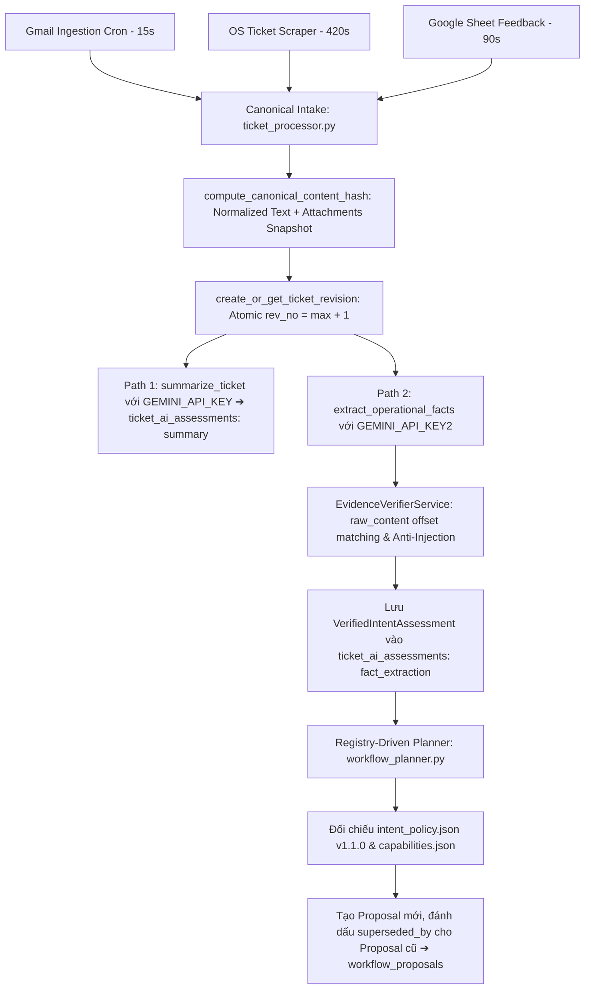
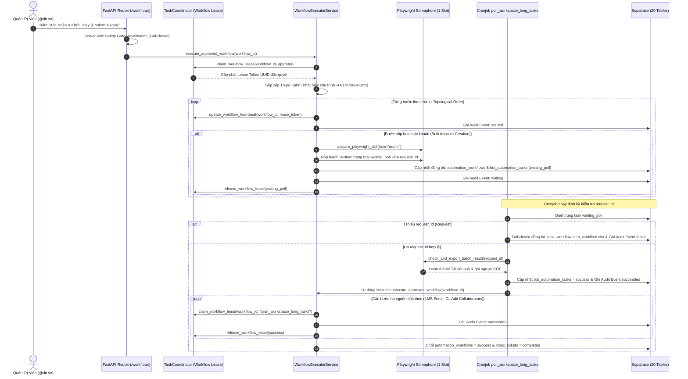

# 🚀 BÁCH KHOA TOÀN THƯ KIẾN TRÚC HỆ THỐNG PTV-TASKS-ADMINISTRATOR
## Pythaverse Central Admin & Automation Hub (Enterprise Single Source of Truth)

> **Tài liệu Kỹ Thuật Độc Quyền & Tối Cao:** Bản đặc tả kiến trúc toàn diện này được biên soạn nhằm chuẩn hóa và hệ thống lại 100% mã nguồn, sơ đồ luồng dữ liệu, cấu trúc cơ sở dữ liệu 20 bảng, các gói dịch vụ RPA, ma trận bộ nhớ đệm RAM, kiến trúc AI Workflow tất định điều khiển bởi Chính sách (Registry-Driven Policy Engine) và giao diện người dùng của dự án **`ptv-tasks-administrator`**. Mọi kỹ sư phần mềm, chuyên gia tự động hóa hoặc AI Coder mới chỉ cần đọc tài liệu này là có thể nắm bắt trọn vẹn toàn bộ hệ sinh thái mà không bao giờ gặp tình trạng suy đoán, hallucination hay làm sai lệch nghiệp vụ.

---

## 📌 THÔNG TIN BẢN QUYỀN & TÁC GIẢ SÁNG LẬP

- **Dự án:** `ptv-tasks-administrator` (Pythaverse Central Admin & Automation Hub)
- **Tác giả & Kiến trúc sư trưởng:** **Nguyễn Mạnh Hùng** (*Lead AI Engineer & Automation Architect – DTT Corporation / Pythaverse Ecosystem*)
- **GitHub:** [`https://github.com/hungnm-1225`](https://github.com/hungnm-1225)
- **Email:** `hungnm@dtt.vn` / `hung.nguyenmanh@dtt.vn`
- **Hệ sinh thái:** [Pythaverse Space](https://pythaverse.space)
- **Phiên bản:** `v3.1.0 Enterprise Provenance & Evidence-Grounded Edition` (Cập nhật tháng 09/2026)

---

## 📑 MỤC LỤC TỔNG QUAN

1. [PHẦN I: TẦM NHÌN HỆ THỐNG & NĂM NGUYÊN TẮC BẤT BIẾN (SAFETY INVARIANTS)](#-phần-i-tầm-nhìn-hệ-thống--năm-nguyên-tắc-bất-biến-safety-invariants)
2. [PHẦN II: 7 PHÂN HỆ NGHIỆP VỤ PYTHAVERSE (DOMAIN TRUTH)](#-phần-ii-7-phân-hệ-nghiệp-vụ-pythaverse-domain-truth)
3. [PHẦN III: STACK CÔNG NGHỆ, HẠ TẦNG ĐA NỀN TẢNG & THÔNG SỐ VẬN HÀNH](#-phần-iii-stack-công-nghệ-hạ-tầng-đa-nền-tảng--thông-số-vận-hành)
4. [PHẦN IV: SƠ ĐỒ CẤU TRÚC THƯ MỤC MONOREPO TỔNG THỂ & VAI TRÒ TỪNG FILE](#-phần-iv-sơ-đồ-cấu-trúc-thư-mục-monorepo-tổng-thể--vai-trò-từng-file)
5. [PHẦN V: GIẢI PHẪU CHI TIẾT TỪNG FILE & HÀM XỬ LÝ BACKEND (FASTAPI 0.115)](#-phần-v-giải-phẫu-chi-tiết-từng-file--hàm-xử-lý-backend-fastapi-0115)
   - [5.1. Entrypoint & Lifespan Crons Lệch Pha (`main.py`)](#51-entrypoint--lifespan-crons-lệch-pha-mainpy)
   - [5.2. Lõi Hệ Thống Core (`app/core/`) – Dual-Key Gemini, Verifier & Workflow Lease](#52-lõi-hệ-thống-core-appcore)
   - [5.3. Định Nghĩa Dữ Liệu Schemas (`app/models/`) – Bổ Sung Typed Offset `intent.py`](#53-định-nghĩa-dữ-liệu-schemas-appmodels)
   - [5.4. Tri Thức Nghiệp Vụ & Grounding Registry (`app/brain/`) – `intent_policy.json` v1.1.0](#54-tri-thức-nghiệp-vụ--grounding-registry-appbrain)
   - [5.5. Cổng Giao Tiếp REST API Endpoints & Server Safety Gate (`app/api/v1/endpoints/`)](#55-cổng-giao-tiếp-rest-api-endpoints--server-safety-gate-appapiv1endpoints)
   - [5.6. Bộ Lập Kế Hoạch Registry-Driven & Điều Phối Thực Thi DAG (`app/services/`)](#56-bộ-lập-kế-hoạch-registry-driven--điều-phối-thực-thi-dag-appservices)
   - [5.7. Bộ Điều Phối Workers Chạy Ngầm & Canonical Intake (`app/workers/`)](#57-bộ-điều-phối-workers-chạy-ngầm--canonical-intake-appworkers)
   - [5.8. Bộ Kiểm Thử An Toàn Tự Động Hermetic Pytest Suite (`backend/tests/`)](#58-bộ-kiểm-thử-an-toàn-tự-động-hermetic-pytest-suite-backendtests)
6. [PHẦN VI: GIẢI PHẪU CHI TIẾT GIAO DIỆN FRONTEND SPA (REACT 19 + VITE 6 + TAILWIND CSS V4)](#-phần-vi-giải-phẫu-chi-tiết-giao-diện-frontend-spa-react-19--vite-6--tailwind-css-v4)
   - [6.1. Khởi Chạy & Định Tuyến Toàn Cục (`App.tsx`, `main.tsx`)](#61-khởi-chạy--định-tuyến-toàn-cục-apptsx-maintsx)
   - [6.2. Thiết Kế Bento Grid & 4 Trạng Thái Workflow Console V3.1](#62-thiết-kế-bento-grid--4-trạng-thái-workflow-console-v31)
   - [6.3. Bóc Tách Chi Tiết 13 Feature Modules & AI Evidence Provenance](#63-bóc-tách-chi-tiết-13-feature-modules--ai-evidence-provenance)
7. [PHẦN VII: CƠ SỞ DỮ LIỆU SUPABASE POSTGRESQL 16 (20 BẢNG & PROVENANCE HẠ TẦNG)](#-phần-vii-cơ-sở-dữ-liệu-supabase-postgresql-16-20-bảng--provenance-hạ-tầng)
8. [PHẦN VIII: 11 SƠ ĐỒ LUỒNG NGHIỆP VỤ END-TO-END (MERMAID SEQUENCE & FLOWCHARTS)](#-phần-viii-11-sơ-đồ-luồng-nghiệp-vụ-end-to-end-mermaid-sequence--flowcharts)
9. [PHẦN IX: CẨM NANG VẬN HÀNH & HƯỚNG DẪN TEST DÀNH CHO KỸ SƯ HỆ THỐNG](#-phần-ix-cẩm-nang-vận-hành--hướng-dẫn-test-dành-cho-kỹ-sư-hệ-thống)
10. [PHẦN X: CẨM NANG ĐỊNH TUYẾN CHUYÊN GIA AI (INTELLIGENT AGENT ROUTING PLAYBOOK)](#-phần-x-cẩm-nang-định-tuyến-chuyên-gia-ai-intelligent-agent-routing-playbook)

---

## 🏛️ PHẦN I: TẦM NHÌN HỆ THỐNG & NĂM NGUYÊN TẮC BẤT BIẾN (SAFETY INVARIANTS)

`ptv-tasks-administrator` được định vị là **Trung tâm Thần kinh Điều phối & Tự Động Hóa Tập Trung (Pythaverse Central Admin & Automation Hub)** cho toàn bộ tập đoàn DTT Corporation và hệ sinh thái giáo dục công nghệ Pythaverse.

```
                  ┌────────────────────────────────────────────────────────┐
                  │                 ĐẦU VÀO ĐA KÊNH (INGESTION)             │
                  │   [Gmail Workspace]  [Google Forms]  [OS Ticket SCP]   │
                  └───────────────────────────┬────────────────────────────┘
                                              │ Ingestion Crons (Lệch pha)
                                              ▼
┌──────────────────────────────────────────────────────────────────────────────────────────┐
│                      LÕI TRUNG TÂM PTV-TASKS-ADMINISTRATOR (BACKEND FASTAPI)             │
│                                                                                          │
│  ┌─────────────────────────┐   ┌───────────────────────────┐   ┌──────────────────────┐  │
│  │ Dual-Path Cognition AI  │   │ EvidenceVerifier Service  │   │  Human-in-the-Loop   │  │
│  │ • Summary (Key 1)       │──▶│ • raw_content[start:end]  │──▶│  Safety Gate         │  │
│  │ • Facts (Key 2)         │   │ • Substring Calibration   │   │  Server-Side Verify  │  │
│  └─────────────────────────┘   └─────────────┬─────────────┘   └──────────────────────┘  │
│                                              │ Verified Facts                            │
│                                              ▼                                           │
│                                ┌───────────────────────────┐                             │
│                                │  Registry Policy Engine   │                             │
│                                │  • intent_policy.json     │                             │
│                                │  • Zero-Mockup Invariant  │                             │
│                                │  • Fail-Closed Double-Flag│                             │
│                                └─────────────┬─────────────┘                             │
│                                              │ Phê duyệt (Approved)                      │
│                                              ▼                                           │
│  ┌────────────────────────────────────────────────────────────────────────────────────┐  │
│  │                 TOPOLOGICAL DAG EXECUTOR & BOT WORKERS (KAHN ALGORITHM)            │  │
│  │  • TaskCoordinator Atomic Workflow Lease Claiming (Anti-Race Condition)            │  │
│  │  • Khối try...finally cam kết 100% thu hồi Lease và tài nguyên Semaphore            │  │
│  │  • Diệt tận gốc lỗi Request #None tại bước waiting_poll                            │  │
│  │  • Append-Only Audit Trail (workflow_execution_events - Che mờ mật khẩu [PROTECTED])│  │
│  └────────────────────────────────────────────────────────────────────────────────────┘  │
│                                              │                                           │
│  ┌────────────────────────────────────────────────────────────────────────────────────┐  │
│  │                    MA TRẬN 8 BỘ NHỚ ĐỆM IN-MEMORY RAM (1MS SPEED)                  │  │
│  │    Courses (10m) | Workspace (15m) | Board (5m) | Bots (15s) | Tasks (60s)         │  │
│  │    Tickets (60s) | Monitor (30s)   | Reports (60s)                                 │  │
│  └────────────────────────────────────────────────────────────────────────────────────┘  │
└──────────────────────────────────────────────┬───────────────────────────────────────────┘
                                               │ Thực thi tự động
                                               ▼
                  ┌────────────────────────────────────────────────────────┐
                  │               HỆ SINH THÁI ĐÍCH (EXECUTION TARGETS)    │
                  │ School Workspace | PLearn LMS | Keycloak | Pythaverse Git | GitHub │
                  └────────────────────────────────────────────────────────┘
```

### Năm Nguyên Tắc Thiết Kế Bất Biến (Absolute Safety Invariants):
1. **Evidence-Based & Offset Verification Invariant (Không Bằng Chứng ➔ Không Action):**
   - Mọi ý định vận hành trích xuất bắt buộc phải có đoạn trích dẫn nguyên văn (`quote`) kèm định vị ký tự (`start_offset`, `end_offset`). Dịch vụ `EvidenceVerifierService` bắt buộc đối soát từng ký tự: $\text{raw\_content}[\text{start}:\text{end}] == \text{quote}$. Nếu quote không tồn tại hoặc bịa đặt, intent đó bị gạch bỏ và outcome hạ xuống `needs_information`.
2. **Zero-Mockup Invariant (Cấm Tuyệt Đối Dữ Liệu Bịa Đặt / Fallback Giả Định):**
   - Nghiêm cấm sử dụng bất kỳ giá trị mặc định giả lập nào (`SWRP 4-12`, count=4, mật khẩu `Ptv@2026`). **Đặc biệt: Khai tử hoàn toàn default Git role `GUEST`**. Yêu cầu cấp quyền Git không nêu rõ vai trò bắt buộc sinh `missing_requirement: git_role`, chuyển trạng thái sang `needs_information` và không tạo bước `git.add_collaborators`.
3. **Fail-Closed Double-Flag Capability Policy:**
   - Mọi capability trong đồ thị DAG bắt buộc phải thỏa mãn song trùng 2 cờ:
     $$\text{capability}[\text{"available"}] == \text{True} \land \text{capability}[\text{"supported\_by\_handler"}] == \text{True}$$
   - Khai tử hoàn toàn fallback dispatcher liều lĩnh `("workspace_rpa", capability_id)`. Mọi capability không có handler trong executor bắt buộc ném `ValueError` dừng luồng lập tức.
4. **Server-Side Approval Revalidation & Provenance Linkage:**
   - Endpoint `/approve_and_run` kiểm tra lại toàn bộ đồ thị DAG, contract đầu vào và trạng thái workflow ở Backend trước khi chuyển sang `approved`. Tuyệt đối từ chối các workflow `no_action`, `needs_information`, `invalid` hoặc rỗng (0 bước). Bắt buộc người duyệt có domain `@dtt.vn` và Keycloak reset password phải có mật khẩu cụ thể.
5. **Workflow-Level Lease & Single-Instance Concurrency (Render 512MB RAM):**
   - Chiếm Lease độc quyền cấp Workflow thông qua `TaskCoordinator.claim_workflow_lease()` chống race condition giữa Admin Dispatch, Retry và Cronjobs.
   - Toàn bộ hàm thực thi DAG bọc trong `try...finally` đảm bảo 100% giải phóng lease và tài nguyên Playwright Semaphore (`GLOBAL_PLAYWRIGHT_SEMAPHORE = asyncio.Semaphore(1)`).
   - Diệt tận gốc lỗi `Request #None` tại bước `waiting_poll`: thiếu `request_id` lập tức fail-closed cả task, workflow step và workflow cha.

---

## 🌐 PHẦN II: 7 PHÂN HỆ NGHIỆP VỤ PYTHAVERSE (DOMAIN TRUTH)

| STT | Phân Hệ | Tên Miền / Giao Thức | Core Platform | Vai Trò Kỹ Thuật & Nghiệp Vụ Cốt Lõi | Phương Thức Tự Động Hóa |
|---|---|---|---|---|---|
| **1** | **School Workspace** | `https://pythaverse.space` | React MUI / Direct REST APIs | Quản trị phân cấp 3 tầng (`Distributor` ➔ `Partner` ➔ `School`). Cấp phát License Pool, bù Contract, nộp batch tài khoản số lượng lớn qua cỗ máy Bulk Account Creation. | Playwright Chromium Headless + Direct API Scanner (Gói `workspace/` 8 modules). |
| **2** | **PLearn LMS** | `https://learn.pythaverse.space` | Moodle LMS (PHP / MariaDB / Edwiser RemUI) | Cổng đào tạo Moodle LMS. Quản lý danh mục khóa học (`SWRP`, `IR`, `ASP`...) và ghi danh tài khoản theo Vai trò (`Student` - 9, `Teacher` - 7, `Manager` - 1), chia nhóm lớp tự động. | Playwright Headless + Keyword Filter 2 nhịp trên `td.cell.c2` (`playwright_service.py`). |
| **3** | **PGit Repos** | `https://git.pythaverse.space` | GitBucket Server (Scala / JVM / SQLite) | Máy chủ lưu trữ mã nguồn dự án học sinh & giáo viên. Quản lý Collaborators tại `/settings/collaborators`. Yêu cầu tài khoản người dùng đăng nhập SSO Keycloak để kích hoạt JIT provisioning. | Playwright Chromium tự động hóa OIDC Keycloak SSO Form, gán vai trò `ADMIN`, `DEVELOPER`, `GUEST` (`git_service.py`). |
| **4** | **Keycloak Auth IDP** | `https://eid.pythaverse.space` | Keycloak (Java / WildFly / PostgreSQL) | Cổng xác thực định danh tập trung OpenID Connect / OAuth2 (Realm: `idp` / `master`). Quản lý thông tin đăng nhập, reset mật khẩu, kích hoạt/khóa tài khoản và xác thực email. | 2-Tier Hybrid: Direct REST API (300ms) ➔ Playwright RPA Fallback (`keycloak_service.py`). |
| **5** | **Leanbot IDE** | `https://ide.pythaverse.space` | Blockly / Web Bluetooth BLE | Web IDE lập trình khối kéo thả Blockly / App Inventor kết nối Robot phần cứng Leanbot thông qua Bluetooth BLE Companion APK. | Synthetic Monitoring Uptime & Latency (`site_monitor_service.py`). |
| **6** | **Support Helpdesk** | `https://support.pythaverse.space` | osTicket (PHP / MySQL) | Hệ thống tiếp nhận sự cố kỹ thuật osTicket. Được cào dữ liệu định kỳ qua Playwright Headless session và chuyển giao cho Canonical Intake. | Playwright headless scraper cào vé, custom form fields & files đính kèm (`osticket_service.py`). |
| **7** | **PContest** | `https://contest.pythaverse.space` | Next.js / Python Judge | Hệ thống tổ chức thi đấu lập trình trực tuyến, quản lý bảng xếp hạng Leaderboard và chấm điểm tự động. | Synthetic Monitoring Uptime & Latency (`site_monitor_service.py`). |

---

## 🛠️ PHẦN III: STACK CÔNG NGHỆ, HẠ TẦNG ĐA NỀN TẢNG & THÔNG SỐ VẬN HÀNH

### 1. Thế Trận Hạ Tầng Đa Nền Tảng (Multi-Platform Deployment Topology)
- **Vercel**: Máy chủ Edge CDN lưu trữ và tối ưu hóa ứng dụng Frontend React 19 SPA (Build siêu tốc, HMR, Dynamic Chunk Splitting).
- **Render.com**: Máy chủ khởi chạy Backend FastAPI trên môi trường tài nguyên hạn chế (**512MB RAM Starter/Free Tier**). Yêu cầu khắt khe về Semaphore, thu hồi bộ nhớ `gc.collect()` và tiêu diệt tiến trình Chromium rác.
- **Supabase**: Cơ sở dữ liệu PostgreSQL 16 (20 bảng chuyên biệt, RLS `@dtt.vn`, Storage Bucket `ticket-attachments` và Két sắt mã hóa Fernet).
- **Google Cloud Console**: Quản trị tài khoản dịch vụ (Service Account) tích hợp bộ ba Gmail Workspace API, Google Sheets API và Google Drive API 6 cấp.
- **UptimeRobot**: Giám sát ngoại vi Synthetic Ping Uptime (chu kỳ 5 phút) kiêm nhiệm vụ giữ ấm (keep-warm ping) cho Render chống ngủ đông.
- **GitHub**: Hệ thống quản lý mã nguồn Monorepo, GitHub Actions CI/CD và Dispatcher Issue tự động vào Private Repositories.

### 2. Backend Stack & Phiên Bản Chuẩn
- **Ngôn ngữ & Runtime:** Python `3.11.x` / `3.12.x`
- **Web Framework:** FastAPI `0.115.x` (Asynchronous, OpenAPI/Swagger tự sinh tại `/docs`)
- **Validation Engine:** Pydantic `2.10.x` (Strict Schema Validation & Typed Entities)
- **RPA & Automation Engine:** Playwright Async Chromium (`playwright.async_api: 1.50.x`)
- **Lập lịch chạy ngầm:** APScheduler `3.10.x` (`AsyncIOScheduler`) với 6 Crons so le lệch pha.
- **In-Memory Caching:** Bộ nhớ đệm RAM tự phát triển (Ma trận 8 In-Memory Caches, TTL 15s - 15m, phản hồi 1ms).
- **Mã hóa dữ liệu Két Sắt:** `cryptography.fernet: ^44.0.x`
- **Trí tuệ nhân tạo (AI):** `google-generativeai: ^0.8.4` tích hợp động cơ **Dual-Key Engine** (`GEMINI_API_KEY` & `GEMINI_API_KEY2`) kết hợp chuỗi 10 models fallback.
- **Kiểm Thử Hồi Quy:** `pytest: ^8.x` / `pytest-asyncio: ^1.4.x` (Hermetic in-memory test suite, 15/15 green in 2.29s).

---

## 📁 PHẦN IV: SƠ ĐỒ CẤU TRÚC THƯ MỤC MONOREPO TỔNG THỂ & VAI TRÒ TỪNG FILE

```
ptv-tasks-administrator/
├── backend/                            # Ứng dụng Backend FastAPI (Python 3.11/3.12)
│   ├── app/
│   │   ├── api/v1/                     # Bộ định tuyến REST API v1
│   │   │   ├── endpoints/              # 10 Router chi tiết theo miền nghiệp vụ (Có In-Memory Cache)
│   │   │   │   ├── board.py            # API Kanban Board, Thùng rác 30 ngày, Columns, Cards
│   │   │   │   ├── bots.py             # API Giám sát 8 Workers, Stream log GMT+7, Retry Worker
│   │   │   │   ├── courses.py          # API CRUD Khóa học (Workspace vs LMS), Git Repos, Bulk Upsert
│   │   │   │   ├── github.py           # API Dispatch Issue vào Private Repo & AI Template Generator
│   │   │   │   ├── monitor.py          # API Giám sát 3-Tab: Public Sites, Auth Matrix, CI/CD Logs
│   │   │   │   ├── reports.py          # API Thống kê KPI, Dynamic Health 24h, Xuất DTT 3Đ Excel
│   │   │   │   ├── tasks.py            # API Cổng Duyệt Tác Vụ Human-in-the-Loop, Background Dispatch
│   │   │   │   ├── tickets.py          # API Hòm thư, /re-summarize (có audit), /re-assess-intent, Sync On-demand
│   │   │   │   ├── workflows.py        # API AI Workflow Console, Server Safety Gate, Approve & Run
│   │   │   │   └── workspace.py        # API Phả hệ 480 trường, RAM Cache, Sync Scanner
│   │   │   └── router.py               # Điểm tập hợp toàn bộ Router v1
│   │   ├── brain/                      # Tri thức nghiệp vụ & Grounding Registry
│   │   │   ├── capabilities.json       # 19 Capabilities hệ thống (schemas, input/output, handler check)
│   │   │   ├── intent_policy.json      # Bảng chính sách tất định ánh xạ Intent -> Capability pipeline (v1.1.0)
│   │   │   ├── workflow_rules.json     # 5 Archetypes quy trình chuẩn
│   │   │   ├── dependency_rules.json   # Quy tắc ràng buộc tiên quyết giữa các năng lực
│   │   │   ├── knowledge_base.json     # Định nghĩa 7 phân hệ, từ khóa routing cán bộ phụ trách
│   │   │   └── prompts/                # Prompt Templates có Versioning
│   │   │       ├── ticket_summary_v1.txt    # Prompt tóm tắt mềm cho Inbox (Key 1)
│   │   │       └── intent_extraction_v1.txt # Prompt bóc tách sự thật có offsets & git_role (v1.1.0, Key 2)
│   │   ├── core/                       # Lõi hệ thống & Quản trị tài nguyên
│   │   │   ├── cache_policy.py         # BoundedMemoryCache LRU Budget ≤ 40MB, 4 Tiers
│   │   │   ├── config.py               # Pydantic Settings, Single Source of Time (UTC DB & GMT+7 Display)
│   │   │   ├── gemini.py               # AI Engine Dual-Key & Dual-Path, tích hợp EvidenceVerifier
│   │   │   ├── playwright_manager.py   # Single-Instance Playwright Semaphore (1 Slot), Zombie Killer
│   │   │   ├── security.py             # Whitelist Domain @dtt.vn, Bearer JWT
│   │   │   ├── supabase.py             # Singleton Supabase Client (Service Role Key)
│   │   │   └── task_coordinator.py     # Atomic Task & Workflow Lease Claiming, Heartbeat, Release
│   │   ├── models/                     # Schemas Pydantic Validation
│   │   │   ├── intent.py               # Schemas EvidenceSpan (offset), VerifiedIntentAssessment, TypedEntities
│   │   │   ├── task.py                 # Schemas Task Create, Approval, Retry
│   │   │   ├── template.py             # Schemas GitHub Template & XLSX Export Mapping
│   │   │   ├── ticket.py               # Schemas Ticket Create, Update, Filter Params
│   │   │   └── workflow.py             # Schemas Workflow Draft, Step DAG, Validation
│   │   ├── services/                   # Các dịch vụ nghiệp vụ chuyên biệt
│   │   │   ├── workspace/              # GÓI DỊCH VỤ WORKSPACE RPA ĐA KẾ THỪA (8 MODULES)
│   │   │   ├── evidence_verifier.py    # Dịch vụ Thẩm định Bằng chứng Ký tự (Offset Matching & Anti-Injection)
│   │   │   ├── cof_excel_service.py    # Bóc tách COF 3 Tabs, chuẩn hóa accounts.xlsx, ghi ngược kết quả
│   │   │   ├── git_service.py          # Tự động hóa Collaborators Pythaverse Git (GitBucket OIDC)
│   │   │   ├── github_service.py       # Dispatcher gửi Issue trực tiếp vào Private Repo
│   │   │   ├── gmail_service.py        # Ingestion Gmail API thuần túy, chuyển Canonical Intake
│   │   │   ├── google_doc_service.py   # Đọc nội dung Doc báo cáo, add comment tag email
│   │   │   ├── google_drive_service.py # Quản lý thư mục Drive 6 cấp, tải COF lên đúng trường
│   │   │   ├── google_sheet_service.py # Ingestion Form Feedback Sheet, chuyển Canonical Intake
│   │   │   ├── keycloak_service.py     # 2-Tier Hybrid: Direct REST API + Playwright Fallback
│   │   │   ├── osticket_service.py     # Ingestion OS Ticket Playwright, chuyển Canonical Intake
│   │   │   ├── playwright_service.py   # Ghi danh trực tiếp Moodle LMS PLearn (Keyword Filter 2 nhịp)
│   │   │   ├── site_monitor_service.py # Giám sát Uptime 10 site, Test 16 acc test qua Fernet, CI/CD
│   │   │   ├── workflow_executor.py    # Topological DAG Executor (Kahn), Workflow Lease, Diệt Request #None
│   │   │   ├── workflow_planner.py     # Registry-Driven Policy Engine (Zero-LLM), Nối Provenance Proposals
│   │   │   └── workspace_lineage_service.py # Giải mã Fernet Két Sắt & Phân giải phả hệ 3 cấp
│   │   ├── workers/                    # Bộ điều phối thực thi chạy ngầm
│   │   │   ├── bot_executor.py         # Router Worker trung tâm thực thi 6 loại bot
│   │   │   └── ticket_processor.py     # Canonical Intake Orchestrator (create_or_get_ticket_revision)
│   │   └── main.py                     # Entrypoint FastAPI, Lifespan 6 Crons, Resume DAG an toàn
│   ├── tests/                          # Bộ Kiểm Thử An Toàn Hermetic Pytest (15/15 Green in 2.29s)
│   │   ├── conftest.py                 # Môi trường test cô lập, mock keys
│   │   ├── test_capability_contracts.py# Contract Test 19 capabilities vs bot_executor
│   │   ├── test_planning_policy.py     # Test Zero-Mockup (Git role), EvidenceVerifier, Offset, Injection
│   │   └── test_execution_safety.py    # Test Kahn Topological sort, [PROTECTED] Masking, Data Binding
│   ├── pytest.ini                      # Cấu hình Pytest tự động phát hiện test và asyncio
│   └── requirements.txt                # Danh mục gói thư viện Python Backend
├── frontend/                           # Ứng dụng Frontend SPA (React 19 + Vite 6 + Tailwind CSS v4)
│   ├── src/
│   │   ├── features/                   # 13 TRANG CHỨC NĂNG CHUYÊN BIỆT
│   │   │   ├── inbox/                  # Hòm Thư Đa Kênh & AI Workflow Console V3.1 (Evidence-Grounded)
│   │   │   │   ├── components/
│   │   │   │   │   ├── WorkflowBuilder.tsx # Trình biên tập DAG, khóa capability thiếu handler, is_manual
│   │   │   │   │   ├── WorkflowStepCard.tsx # Thẻ bước thực thi, badge rủi ro, inline inputs
│   │   │   │   │   └── WorkflowValidationPanel.tsx # Safety Gate, 4 tiêu chí kiểm định, cảnh báo lỗi
│   │   │   │   └── UnifiedInboxPage.tsx # Console Bento V3.1: 4 States, Operator Reason, Evidence Quotes
│   │   │   └── ...                     # Các feature modules khác (Dashboard, Board, Tasks, Studio...)
│   │   ├── types/index.ts              # TypeScript strict interfaces (is_manual, operator_reason, offsets...)
│   │   └── App.tsx                     # React 19 SPA Router, Lazy Loading 13 Modules
├── supabase/
│   ├── migrations/
│   │   └── 20260911000000_add_provenance_and_proposals.sql # Migration CSDL 20 bảng
│   └── schema.sql                      # Schema chuẩn mực 20 bảng CSDL, RLS, Indexes, Triggers
├── GEMINI.md                           # System Instructions & Quy chuẩn tác nghiệp của AI Assistant
└── README.md                           # Bách khoa toàn thư kiến trúc hệ thống (Single Source of Truth)
```

---

## 🔬 PHẦN V: GIẢI PHẪU CHI TIẾT TỪNG FILE & HÀM XỬ LÝ BACKEND (FASTAPI 0.115)

### 5.1. Entrypoint & Lifespan Crons Lệch Pha (`main.py`)
- **Tệp tin:** [`backend/app/main.py`](file:///c:/Users/dtt/Desktop/Project/ptv-tasks-administrator/backend/app/main.py)
- **Hàm `poll_workspace_long_tasks()` – Đồng Bộ Waiting Poll & Tự Động Resume DAG:**
  - Quét bảng `bot_automation_tasks` tìm các task có `execution_status = 'waiting_poll'`.
  - **Diệt tận gốc lỗi `Request #None`:** Nếu thiếu `request_id` hợp lệ, lập tức đánh dấu `failed` cho cả bot task lẫn bước workflow trong `automation_workflows`, cập nhật trạng thái workflow sang `failed` và ghi audit event `failed` vào `workflow_execution_events`. Không bao giờ để workflow bị treo mù!
  - **Xử lý toàn diện các nhánh kết quả:** Bắt trọn vẹn cả 3 trạng thái: `completed`, `still_processing` và `failed`/`error`.
  - Sau khi lấy kết quả batch thành công:
    - Ghi nhận sự kiện `succeeded` vào `workflow_execution_events`.
    - Đánh dấu bước `status = 'success'`, gán outputs và **tự động gọi `workflow_executor_service.execute_approved_workflow(workflow_id)` chạy ngầm** để tiếp tục các bước hạ nguồn (LMS Enroll, Git Add Collaborators).
    - **Chỉ đánh dấu `inbox_tickets = 'completed'` khi toàn bộ Workflow đã hoàn thành thành công**.
- **Cơ Chế Lập Lịch So Le 6 Crons (Bảo vệ Render 512MB RAM):**
  1. `gmail_cron`: Gọi `poll_unread_gmails` (Chu kỳ: 10 phút, Chạy sau 15s).
  2. `sheet_cron`: Gọi `poll_form_feedbacks` (Chu kỳ: 15 phút, Chạy sau 90s).
  3. `workspace_long_tasks_cron`: Gọi `poll_workspace_long_tasks` (Chu kỳ: 10 phút, Chạy sau 180s).
  4. `osticket_cron`: Gọi `poll_open_ostickets` (Chu kỳ: 15 phút, Chạy sau 420s).
  5. `site_uptime_cron`: Gọi `poll_site_uptime_cron` (Chu kỳ: 60 phút, Chạy sau 1200s).
  6. `distributor_cache_scanner_cron`: Quét cache 5 Master Distributors (Chu kỳ: 60 phút, Chạy sau 2400s).

---

### 5.2. Lõi Hệ Thống Core (`app/core/`)

#### [`gemini.py`](file:///c:/Users/dtt/Desktop/Project/ptv-tasks-administrator/backend/app/core/gemini.py) (Dual-Path Cognition & Dual-Key Resiliency)
- **Dual-Key Engine:**
  - `GEMINI_API_KEY`: Chuyên trách luồng Tóm tắt mềm `summarize_ticket()` hiển thị giao diện.
  - `GEMINI_API_KEY2`: Chuyên trách luồng Trích xuất sự thật vận hành `extract_operational_facts()`.
  - **Cross-Key Failover:** Khi một Key chạm giới hạn 429/quota, tự động đảo sang Key còn lại trước khi chuyển sang model tiếp theo trong danh sách 10 models fallback.
- **Tích hợp `EvidenceVerifierService`:**
  - Kết quả bóc tách từ Gemini được chuyển ngay qua `evidence_verifier.verify_intent_assessment(assessment, raw_content)` để đối soát substring từng ký tự. Trích dẫn giả mạo bị gạch bỏ ngay tại cổng lõi AI!
  - Thay thế hoàn toàn việc insert hardcode `revision_no: 1` bằng lời gọi chuẩn hóa `create_or_get_ticket_revision`.

#### [`task_coordinator.py`](file:///c:/Users/dtt/Desktop/Project/ptv-tasks-administrator/backend/app/core/task_coordinator.py) (Atomic Lease Coordinator)
- **Xóa bỏ Fake ID `workflow_{id}`:**
- **Cung cấp bộ ba hàm Workflow-Level Lease độc quyền:**
  - `claim_workflow_lease(workflow_id, operator, lease_duration_seconds=600)`: Chiếm quyền thực thi nguyên tử trên `automation_workflows`, chặn đứng race-condition.
  - `update_workflow_heartbeat(workflow_id, lease_token)`: Gia hạn nhịp tim cho tác vụ dài.
  - `release_workflow_lease(workflow_id, lease_token, final_status)`: Giải phóng lease an toàn khi workflow kết thúc.

---

### 5.3. Định Nghĩa Dữ Liệu Schemas & Dịch Vụ Thẩm Định Bằng Chứng

#### [`intent.py`](file:///c:/Users/dtt/Desktop/Project/ptv-tasks-administrator/backend/app/models/intent.py)
- `EvidenceSpan`: Bắt buộc chứa `quote`, `start_offset`, `end_offset`, `source_kind` (`ticket_body` | `attachment_extract`), `source_revision_id`, `is_verified`.
- `VerifiedIntentAssessment`: Bản đánh giá đã qua bộ lọc thẩm định (`is_fully_verified: True`, `verified_at`, `source_revision_id`).
- `TypedEntities`: Khung dữ liệu thực thể chuẩn (`school_name`, `courses`, `repositories`, `users`, `target_email`, `git_role`).

#### [`evidence_verifier.py`](file:///c:/Users/dtt/Desktop/Project/ptv-tasks-administrator/backend/app/services/evidence_verifier.py) (Deterministic Evidence Verifier)
- **So khớp vị trí:** Kiểm tra $\text{raw\_content}[\text{start}:\text{end}] == \text{quote}$.
- **Hiệu chỉnh sai lệch offset (Offset Calibration):** Nếu LLM tính sai offset, tự động dò tìm vị trí substring thực tế trong `raw_content` để hiệu chỉnh lại `start_offset` và `end_offset`.
- **Loại bỏ ảo giác (Zero-Hallucination):** Quote không xuất hiện trong nội dung gốc ➔ Đánh dấu `is_verified = False`, loại bỏ khỏi intent, cảnh báo và hạ outcome về `needs_information`.
- **Chống Prompt Injection:** Tự động phát hiện và chặn các câu lệnh override hệ thống (`ignore previous instructions...`).

---

### 5.4. Tri Thức Nghiệp Vụ & Grounding Registry (`app/brain/`)
- [`capabilities.json`](file:///c:/Users/dtt/Desktop/Project/ptv-tasks-administrator/backend/app/brain/capabilities.json) (v2.0.0):
  - Khóa van an toàn kép (`available: false`, `supported_by_handler: false`) cho 5 capabilities chưa có bot handler thực tế trong `bot_executor.py`.
- [`intent_policy.json`](file:///c:/Users/dtt/Desktop/Project/ptv-tasks-administrator/backend/app/brain/intent_policy.json) (v1.1.0):
  - **Khai tử hoàn toàn role `GUEST` mặc định.** Đưa `git_role` vào `required_inputs` bắt buộc cho `repository_access`.
  - Nguồn sự thật duy nhất định nghĩa: `required_entities`, `required_inputs`, `min_evidence_quotes`, `risk_level`, `capability_pipeline`.

---

### 5.5. Cổng Giao Tiếp REST API Endpoints (`app/api/v1/endpoints/`)
- [`tickets.py`](file:///c:/Users/dtt/Desktop/Project/ptv-tasks-administrator/backend/app/api/v1/endpoints/tickets.py):
  - Cả `POST /{id}/re-summarize` và `POST /{id}/re-assess-intent` đều sử dụng hàm duy nhất `create_or_get_ticket_revision` (không sinh bừa `revision_no: 1`).
  - `/re-summarize` ghi nhận độc lập bản ghi mới vào `ticket_ai_assessments` (bảo toàn 100% Provenance).
- [`workflows.py`](file:///c:/Users/dtt/Desktop/Project/ptv-tasks-administrator/backend/app/api/v1/endpoints/workflows.py):
  - **Server-side Safety Gate:** Từ chối thẳng thừng `no_action`, `needs_information`, `invalid`, workflow rỗng (0 bước).
  - Bắt buộc người phê duyệt có email thuộc `@dtt.vn`.
  - Bắt buộc kiểm tra `target_role` cho bước Git (không cho phép role rỗng) và `temporary_password` cho Keycloak.

---

### 5.6. Dịch Vụ Lập Kế Hoạch & Thực Thi Workflow

#### [`workflow_planner.py`](file:///c:/Users/dtt/Desktop/Project/ptv-tasks-administrator/backend/app/services/workflow_planner.py) (Registry-Driven Policy Engine)
- **Zero Hardcoded Logic:** Triệt tiêu hoàn toàn code cứng `if intent_type == ...`. Quy trình sinh bước hoàn toàn do `intent_policy.json` chỉ đạo.
- **Nối đầy đủ Provenance Chain:** Đọc assessment trực tiếp từ bảng `ticket_ai_assessments` (bản ghi `fact_extraction` mới nhất), lưu `workflow_proposals` chứa đủ: `ticket_revision_id`, `intent_assessment_id`, `policy_version`, `evidence`, `entity_resolution`, `plan`.
- **Tự động Supersede:** Đánh dấu `status = 'superseded'` và cập nhật `superseded_by` cho các proposals cũ chưa duyệt khi có revision/proposal mới.

#### [`workflow_executor.py`](file:///c:/Users/dtt/Desktop/Project/ptv-tasks-administrator/backend/app/services/workflow_executor.py) (Topological DAG Executor)
- **Kahn's Algorithm Fail-Closed:** Khi phát hiện chu trình phụ thuộc trong DAG ➔ Ném lỗi `ValueError` và fail workflow ngay lập tức (tuyệt đối không fallback về mảng gốc).
- **Khai tử Fallback liều lĩnh:** Xóa sổ hoàn toàn cú pháp `("workspace_rpa", capability_id)`. Capability lạ ném lỗi `ValueError` lập tức.
- **Khối `try...finally` Bảo Vệ Lease:** Luôn luôn giải phóng lease qua `TaskCoordinator.release_workflow_lease()` kể cả khi gặp sự cố bất ngờ.
- **Diệt tận gốc lỗi `Request #None`:** Bước trả về `waiting_poll` bắt buộc phải có `request_id` hợp lệ.

---

### 5.7. Bộ Điều Phối Workers & Canonical Intake

#### [`ticket_processor.py`](file:///c:/Users/dtt/Desktop/Project/ptv-tasks-administrator/backend/app/workers/ticket_processor.py) (Canonical Intake Orchestrator)
- **`compute_canonical_content_hash(raw_content, attachments)`:** Chuẩn hóa văn bản và băm kết hợp cả danh sách snapshot file đính kèm. File đính kèm đổi ➔ Hash đổi!
- **`create_or_get_ticket_revision(ticket_id, raw_content, attachments, source_updated_at)`:** Một cửa tiếp nhận duy nhất. Nếu hash mới, tính toán atomic $\text{revision\_no} = \max(\text{revision\_no}) + 1$, triệt tiêu hoàn toàn xung đột `uq_ticket_revision`.

---

### 5.8. Bộ Kiểm Thử An Toàn Hermetic Pytest Suite (`backend/tests/`)
Hệ thống tích hợp bộ kiểm thử an toàn hermetic, chạy siêu tốc **<2.3 giây** mà không tốn một token quota AI nào:
- [`test_capability_contracts.py`](file:///c:/Users/dtt/Desktop/Project/ptv-tasks-administrator/backend/tests/test_capability_contracts.py): Kiểm tra 100% capability có `available=true` bắt buộc phải có bot handler thật trong `bot_executor.py`.
- [`test_execution_safety.py`](file:///c:/Users/dtt/Desktop/Project/ptv-tasks-administrator/backend/tests/test_execution_safety.py): Kiểm tra thuật toán sắp xếp Tô-pô Kahn, cơ chế che mờ thông tin mật `[PROTECTED]`, và giải mã template data binding.
- [`test_planning_policy.py`](file:///c:/Users/dtt/Desktop/Project/ptv-tasks-administrator/backend/tests/test_planning_policy.py): Mở rộng toàn diện 9 bài test:
  1. `test_zero_mockup_invariant`: Chống dữ liệu bịa đặt (courses/repos).
  2. `test_no_default_git_role_invariant`: Chặn đứng role GUEST mặc định, yêu cầu `git_role`.
  3. `test_missing_evidence_fails_closed`: Thiếu bằng chứng ➔ `needs_information`.
  4. `test_no_action_produces_zero_steps`: Thư rác ➔ 0 bước thực thi.
  5. `test_circular_dependency_detection`: Bắt chu trình DAG.
  6. `test_evidence_verifier_rejects_hallucinated_quote`: Bắt quả tang quote ảo giác.
  7. `test_evidence_verifier_calibrates_skewed_offsets`: Tự động sửa lệch offset.
  8. `test_prompt_injection_quote_rejected`: Chống câu lệnh tấn công chiếm quyền.
  9. `test_unsupported_capability_fails_closed`: Chặn capability chưa có bot handler.
- **Kết quả thực tế:** `15 passed in 2.29s` (100% Green, 0 Warning, 0 Failure).

---

## 🎨 PHẦN VI: GIẢI PHẪU CHI TIẾT GIAO DIỆN FRONTEND SPA (REACT 19 + VITE 6 + TAILWIND CSS V4)

### 6.1. Cấu Hình Types TypeScript Strict (`types/index.ts`)
- Bổ sung `is_manual: boolean`, `operator_reason: string`, `supported_by_handler: boolean`.
- Nâng cấp `EvidenceSpan` với `start_offset`, `end_offset`, `source_kind`, `is_verified`.

### 6.2. Nâng Cấp Bento Grid V3.1 & 4 Trạng Thái Tường Minh
- **[`UnifiedInboxPage.tsx`](file:///c:/Users/dtt/Desktop/Project/ptv-tasks-administrator/frontend/src/features/inbox/UnifiedInboxPage.tsx):**
  - **Tường minh 4 trạng thái:**
    - `needs_information`: Khóa nút duyệt, hiển thị **Missing Requirements Checklist** chi tiết từng trường thiếu.
    - `no_action`: Hiển thị lý do và căn cứ không kích hoạt tự động hóa.
    - `invalid`: Hiển thị panel đỏ cảnh báo vi phạm chính sách hoặc chu trình DAG.
    - `ready_for_review`: Mở khóa đồ thị bước và nút duyệt chạy.
  - **Audit Patch cho Manual Edit:** Xuất hiện thanh nhập **"Lý do can thiệp thủ công (Operator Reason)"** khi bấm *Chỉnh Sửa Luồng*, lưu vết vào `automation_workflow_history`.
  - **VÙNG B (AI Understanding & Evidence Provenance):** Hiển thị câu trích dẫn nguyên văn bằng chứng (`❝ quote ❞`), danh sách intent kèm huy hiệu mức độ rủi ro (`High Mutation`, `Medium Mutation`). Hiển thị độ tin cậy thực chất (thay bằng cảnh báo nếu thiếu bằng chứng).
- **[`WorkflowBuilder.tsx`](file:///c:/Users/dtt/Desktop/Project/ptv-tasks-administrator/frontend/src/features/inbox/components/WorkflowBuilder.tsx):**
  - Khóa (disable) các capability nếu `available === false || supported_by_handler === false`.
  - Bước do admin thêm thủ công được gắn cờ `is_manual: true` (không mạo danh AI-generated).
- **[`WorkflowValidationPanel.tsx`](file:///c:/Users/dtt/Desktop/Project/ptv-tasks-administrator/frontend/src/features/inbox/components/WorkflowValidationPanel.tsx):**
  - Bổ sung checklist 4 tiêu chí nhanh: Số bước, Đồ thị DAG, Phân giải trường học, và 100% Handler Support.

---

## 🗄️ PHẦN VII: CƠ SỞ DỮ LIỆU SUPABASE POSTGRESQL 16 (20 BẢNG & PROVENANCE HẠ TẦNG)

Hệ thống sử dụng cơ sở dữ liệu Supabase PostgreSQL 16 với **20 bảng dữ liệu chuyên biệt**, áp dụng chính sách RLS đồng bộ `"admin_dtt_vn_only"` cho email `@dtt.vn`:

```
┌────────────────────────────────────────────────────────────────────────────────────────┐
│                        CƠ SỞ DỮ LIỆU SUPABASE POSTGRESQL 16 (20 BẢNG)                  │
├─────────────────────────┬──────────────────────────┬───────────────────────────────────┤
│ 1. INBOX & PROVENANCE   │ 2. LINEAGE & VAULT       │ 3. SCANNER & COURSE CATALOGS      │
│ • inbox_tickets         │ • workspace_organizations│ • workspace_contracts_cache       │
│ • inbox_ticket_revisions│ • workspace_credentials_ │ • workspace_orders_cache          │
│ • ticket_ai_assessments │   vault                  │ • workspace_courses               │
│ • workflow_proposals    │                          │ • lms_courses                     │
│ • workflow_execution_   │                          │                                   │
│   events                │                          │                                   │
│ • bot_automation_tasks  │                          │                                   │
│ • automation_workflows  │                          │                                   │
│ • automation_workflow_  │                          │                                   │
│   history               │                          │                                   │
│ • templates_config      │                          │                                   │
├─────────────────────────┼──────────────────────────┼───────────────────────────────────┤
│ 4. SITE HEALTH & CI/CD  │ 5. KANBAN WORK BOARD     │ 6. STORAGE BUCKET                 │
│ • site_monitor_         │ • work_boards            │ • ticket-attachments              │
│   credentials           │ • work_board_columns     │   (Lưu trữ file đính kèm email,   │
│ • site_downtime_events  │ • work_board_cards       │    COF Excel và kết quả nộp batch)│
│ • site_deploy_configs   │                          │                                   │
└─────────────────────────┴──────────────────────────┴───────────────────────────────────┘
```

### Chuỗi Truy Vết Bất Biến Đầy Đủ (Immutable Provenance Chain):
$$\text{Event} \xrightarrow{\text{workflow\_id}} \text{Workflow} \xrightarrow{\text{version}} \text{Proposal} \xrightarrow{\text{intent\_assessment\_id}} \text{Assessment} \xrightarrow{\text{ticket\_revision\_id}} \text{Revision} \xrightarrow{\text{ticket\_id}} \text{Source Ticket}$$

---

## 🔄 PHẦN VIII: 11 SƠ ĐỒ LUỒNG NGHIỆP VỤ END-TO-END (MERMAID SEQUENCE & FLOWCHARTS)

### Luồng Canonical Intake, Evidence Verification & Registry Policy Engine


### Luồng Topological Execution, Workflow Lease & Auto-Resume


---

## 🧭 PHẦN IX: CẨM NANG VẬN HÀNH & HƯỚNG DẪN TEST DÀNH CHO KỸ SƯ HỆ THỐNG

### 1. Lệnh Kiểm Thử Hồi Quy Tự Động (Hermetic Pytest Suite)
Để chạy toàn bộ 15 bài test kiểm định an toàn mà không tốn quota AI:
```powershell
cd backend
.\venv\Scripts\Activate.ps1
pytest -v
```
*(Hoặc: `python -m pytest -v`)*

### 2. Lệnh Kiểm Tra Build Frontend (Vercel Typecheck)
```powershell
cd frontend
npm run build
```

### 3. Ma Trận Xử Lý Lỗi Vận Hành Nhanh:
| Hiện Tượng | Nguyên Nhân Cốt Lõi | Tệp Cần Mở | Giải Pháp Chuẩn |
|---|---|---|---|
| **Workflow bị chặn `needs_information` khi xin quyền Git** | Yêu cầu không nêu rõ vai trò (`ADMIN`, `DEVELOPER`, `GUEST`). | `frontend/src/features/inbox/UnifiedInboxPage.tsx` | Nhập lý do vào ô *Chỉnh Sửa Luồng* hoặc bổ sung `git_role` trên giao diện. |
| **Báo lỗi `Request #None` trong log Cron** | Bàn giao giữa RPA và School Workspace bị thiếu request ID. | `backend/app/main.py` | Cronjob đã tự động fail-closed an toàn, kiểm tra lại tài khoản admin trường. |
| **Báo lỗi `Unknown config option: asyncio_mode`** | Môi trường ảo Python thiếu thư viện pytest-asyncio. | `backend/requirements.txt` | Chạy lệnh `pip install pytest-asyncio`. |
| **Quản trị viên chỉnh sửa luồng bị từ chối** | Chưa cung cấp email `@dtt.vn` hoặc thiếu lý do chỉnh sửa. | `backend/app/api/v1/endpoints/workflows.py` | Kiểm tra localStorage `user_email` và nhập `operator_reason`. |

---

## 🤖 PHẦN X: CẨM NANG ĐỊNH TUYẾN CHUYÊN GIA AI (INTELLIGENT AGENT ROUTING PLAYBOOK)

Mỗi khi AI Assistant tiếp nhận yêu cầu từ người dùng, hệ thống **BẮT BUỘC TỰ ĐỘNG** nhận diện miền nghiệp vụ và áp dụng năng lực chuyên gia từ các hồ sơ agent trong `.agent/agents/`:

| Lĩnh Vực / Phạm Vi Tác Vụ | Agent Chuyên Gia | Hồ Sơ Tham Chiếu | Trọng Tâm Quy Chuẩn Áp Dụng |
|---|---|---|---|
| **Frontend UI/UX** | `frontend-specialist` | `.agent/agents/frontend-specialist.md` | React 19, TypeScript Strict, Tailwind CSS v4, Bento Grid, 4 Core States, Operator Reason Audit Patch. |
| **Backend & REST APIs** | `backend-specialist` | `.agent/agents/backend-specialist.md` | Python 3.11/3.12, FastAPI 0.115, Pydantic v2, Dual-Key Gemini, Registry Policy Engine, Kahn DAG. |
| **Database & Storage** | `database-architect` | `.agent/agents/database-architect.md` | Supabase PostgreSQL 16 (20 bảng CSDL), Revisions, Assessments, Proposals (superseded_by), Execution Events. |
| **RPA & Web Scraping** | `qa-automation-engineer` | `.agent/agents/qa-automation-engineer.md` | Playwright Async Chromium, Single Playwright Semaphore (1 Slot cho Render 512MB), Zombie killer. |
| **Security & Identity** | `security-auditor` | `.agent/agents/security-auditor.md` | EvidenceVerifier, Anti-Injection Invariant, Fernet Vault, Whitelist Domain `@dtt.vn`, Masking `[PROTECTED]`. |

---
*Tài liệu được cập nhật và kiểm định tự động thành công vào ngày 11 tháng 09 năm 2026 bởi Lead AI Engineer Nguyễn Mạnh Hùng và Co-pilot AI Senior Architect.*
