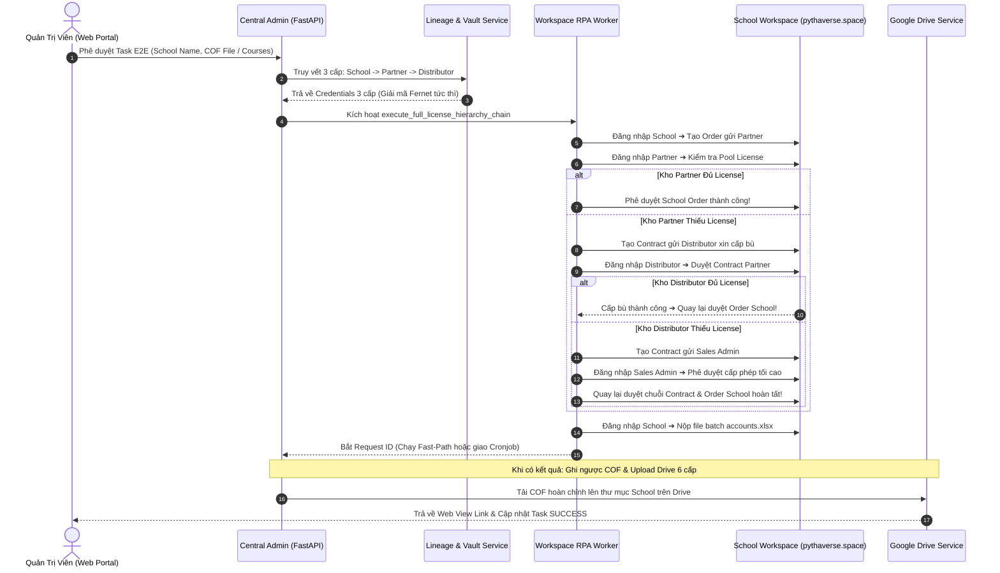
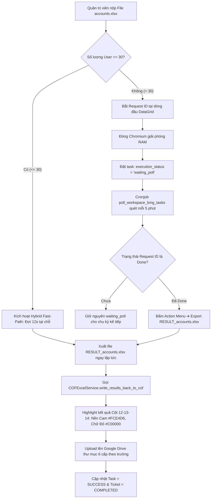
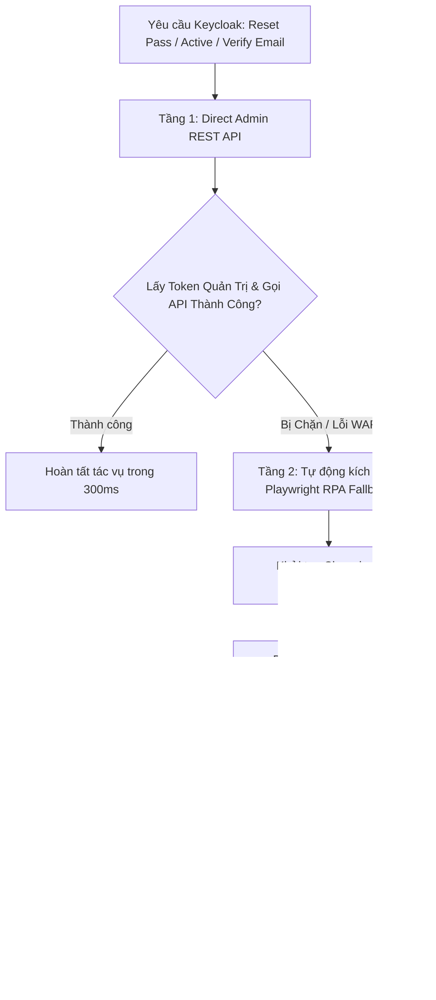
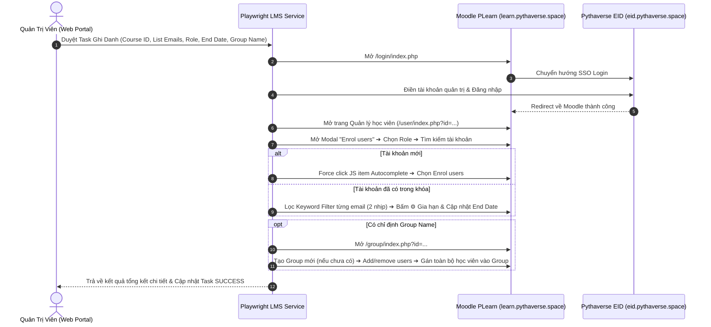
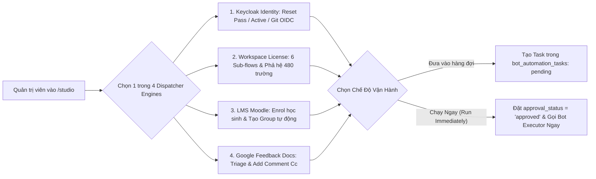
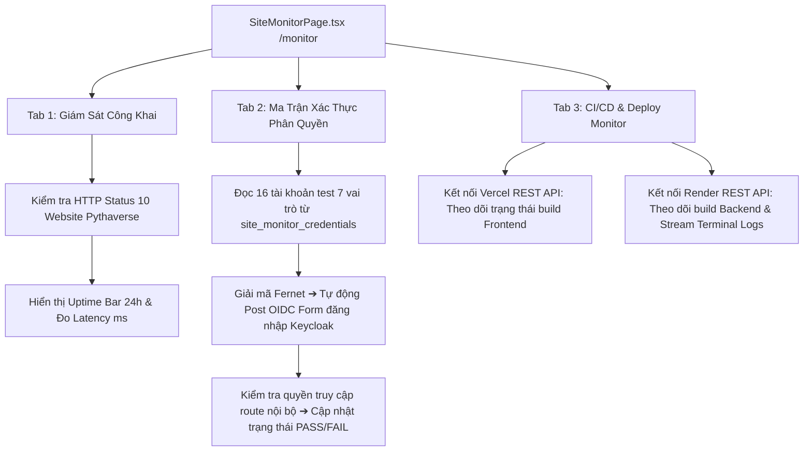
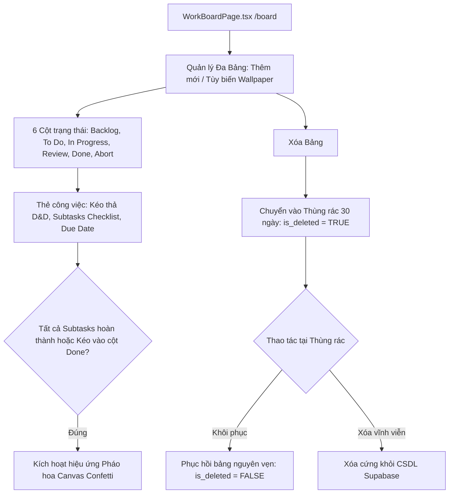
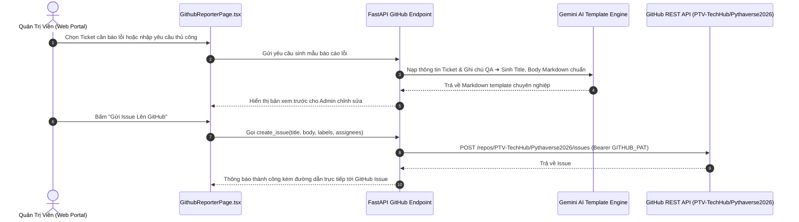

# 🚀 BÁCH KHOA TOÀN THƯ KIẾN TRÚC HỆ THỐNG PTV-TASKS-ADMINISTRATOR
## Pythaverse Central Admin & Automation Hub (Enterprise Single Source of Truth)

> **Tài liệu Kỹ Thuật Độc Quyền & Tối Cao:** Bản đặc tả kiến trúc toàn diện này được biên soạn nhằm chuẩn hóa và hệ thống lại 100% mã nguồn, sơ đồ luồng dữ liệu, cấu trúc cơ sở dữ liệu, các gói dịch vụ RPA và giao diện người dùng của dự án **`ptv-tasks-administrator`**. Mọi kỹ sư phần mềm, chuyên gia tự động hóa hoặc AI Coder mới chỉ cần đọc tài liệu này là có thể nắm bắt trọn vẹn toàn bộ hệ sinh thái, hiểu rõ từng tệp tin và từng hàm xử lý mà không cần phải duyệt thủ công từng tệp code hay gặp bối rối khi thao tác với một file đơn lẻ.

---

## 📌 THÔNG TIN BẢN QUYỀN & TÁC GIẢ SÁNG LẬP

- **Dự án:** `ptv-tasks-administrator` (Pythaverse Central Admin & Automation Hub)
- **Tác giả & Kiến trúc sư trưởng:** **Nguyễn Mạnh Hùng** (*Lead AI Engineer & Automation Architect – DTT Corporation / Pythaverse Ecosystem*)
- **GitHub:** [`https://github.com/hungnm-1225`](https://github.com/hungnm-1225)
- **Email:** `hungnm@dtt.vn` / `hung.nguyenmanh@dtt.vn`
- **Hệ sinh thái:** [Pythaverse Space](https://pythaverse.space)
- **Phiên bản:** `v2.5.0 Enterprise Release` (Cập nhật tháng 08/2026)

---

## 📑 MỤC LỤC TỔNG QUAN

1. [PHẦN I: TẦM NHÌN HỆ THỐNG & BỐN NGUYÊN TẮC BẤT DI BẤT DỊCH](#-phần-i-tầm-nhìn-hệ-thống--bốn-nguyên-tắc-bất-di-bất-dịch)
2. [PHẦN II: 7 PHÂN HỆ NGHIỆP VỤ PYTHAVERSE (DOMAIN TRUTH)](#-phần-ii-7-phân-hệ-nghiệp-vụ-pythaverse-domain-truth)
3. [PHẦN III: STACK CÔNG NGHỆ, THƯ VIỆN & MÔI TRƯỜNG VẬN HÀNH](#-phần-iii-stack-công-nghệ-thư-viện--môi-trường-vận-hành)
4. [PHẦN IV: SƠ ĐỒ CẤU TRÚC THƯ MỤC MONOREPO TỔNG THỂ](#-phần-iv-sơ-đồ-cấu-trúc-thư-mục-monorepo-tổng-thể)
5. [PHẦN V: GIẢI PHẪU CHI TIẾT TỪNG FILE & HÀM XỬ LÝ BACKEND (FASTAPI 0.115)](#-phần-v-giải-phẫu-chi-tiết-từng-file--hàm-xử-lý-backend-fastapi-0115)
   - [5.1. Entrypoint & Lifespan Crons (`main.py`)](#51-entrypoint--lifespan-crons-mainpy)
   - [5.2. Lõi Hệ Thống Core (`app/core/`)](#52-lõi-hệ-thống-core-appcore)
   - [5.3. Định Nghĩa Dữ Liệu Models (`app/models/`)](#53-định-nghĩa-dữ-liệu-models-appmodels)
   - [5.4. Tri Thức Nghiệp Vụ Brain (`app/brain/knowledge_base.json`)](#54-tri-thức-nghiệp-vụ-brain-appbrainknowledge_basejson)
   - [5.5. Cổng Giao Tiếp REST API Endpoints (`app/api/v1/endpoints/`)](#55-cổng-giao-tiếp-rest-api-endpoints-appapiv1endpoints)
   - [5.6. Gói Dịch Vụ Workspace RPA Đa Kế Thừa (`app/services/workspace/`)](#56-gói-dịch-vụ-workspace-rpa-đa-kế-thừa-appservicesworkspace)
   - [5.7. Các Dịch Vụ Nghiệp Vụ Chuyên Biệt (`app/services/`)](#57-các-dịch-vụ-nghiệp-vụ-chuyên-biệt-appservices)
   - [5.8. Bộ Điều Phối Workers Chạy Ngầm (`app/workers/`)](#58-bộ-điều-phối-workers-chạy-ngầm-appworkers)
   - [5.9. Kịch Bản Khởi Tạo Dữ Liệu Scripts (`scripts/`)](#59-kịch-bản-khởi-tạo-dữ-liệu-scripts-scripts)
6. [PHẦN VI: GIẢI PHẪU CHI TIẾT GIAO DIỆN FRONTEND SPA (REACT 19 + VITE 6 + TAILWIND CSS V4)](#-phần-vi-giải-phẫu-chi-tiết-giao-diện-frontend-spa-react-19--vite-6--tailwind-css-v4)
   - [6.1. Khởi Chạy & Định Tuyến Toàn Cục (`App.tsx`, `main.tsx`)](#61-khởi-chạy--định-tuyến-toàn-cục-apptsx-maintsx)
   - [6.2. Cấu Hình Tác Giả & Contexts (`config/`, `context/`, `lib/`, `types/`)](#62-cấu-hình-tác-giả--contexts-config-context-lib-types)
   - [6.3. Bóc Tách Chi Tiết 13 Feature Modules](#63-bóc-tách-chi-tiết-13-feature-modules)
7. [PHẦN VII: CƠ SỞ DỮ LIỆU SUPABASE POSTGRESQL 16 (16 BẢNG & STORAGE BUCKET)](#-phần-vii-cơ-sở-dữ-liệu-supabase-postgresql-16-16-bảng--storage-bucket)
8. [PHẦN VIII: 9 SƠ ĐỒ LUỒNG NGHIỆP VỤ END-TO-END (MERMAID SEQUENCE & FLOWCHARTS)](#-phần-viii-9-sơ-đồ-luồng-nghiệp-vụ-end-to-end-mermaid-sequence--flowcharts)
9. [PHẦN IX: CẨM NANG VẬN HÀNH & MA TRẬN ĐIỀU HƯỚNG DÀNH CHO AI CODER MỚI](#-phần-ix-cẩm-nang-vận-hành--ma-trận-điều-hướng-dành-cho-ai-coder-mới)

---

## 🏛️ PHẦN I: TẦM NHÌN HỆ THỐNG & BỐN NGUYÊN TẮC BẤT DI BẤT DỊCH

`ptv-tasks-administrator` được định vị là **Trung tâm Thần kinh Điều phối & Tự Động Hóa Tập Trung (Pythaverse Central Admin & Automation Hub)** cho toàn bộ tập đoàn DTT Corporation và hệ sinh thái giáo dục công nghệ Pythaverse.

```
                  ┌────────────────────────────────────────────────────────┐
                  │                 ĐẦU VÀO ĐA KÊNH (INGESTION)             │
                  │   [Gmail Workspace]  [Google Forms]  [OS Ticket SCP]   │
                  └───────────────────────────┬────────────────────────────┘
                                              │ Ingestion Crons (5 mins)
                                              ▼
┌──────────────────────────────────────────────────────────────────────────────────────────┐
│                      LÕI TRUNG TÂM PTV-TASKS-ADMINISTRATOR (BACKEND FASTAPI)             │
│                                                                                          │
│  ┌─────────────────────────┐   ┌───────────────────────────┐   ┌──────────────────────┐  │
│  │   Gemini AI Triage      │   │  Human-in-the-Loop Gate   │   │  Lineage & Vault     │  │
│  │   (10-Model Fallback)   │──▶│  (Approval Queue Portal)  │──▶│  (Fernet Encryption) │  │
│  └─────────────────────────┘   └───────────────────────────┘   └──────────────────────┘  │
│                                              │ Phê duyệt / Run Immediate                 │
│                                              ▼                                           │
│  ┌────────────────────────────────────────────────────────────────────────────────────┐  │
│  │                             BOT WORKER EXECUTION CENTER                            │  │
│  │  [Workspace RPA 4-Cấp]  [Keycloak 2-Tier API]  [LMS PLearn Enrol]  [GitHub Dispatch]│  │
│  └────────────────────────────────────────────────────────────────────────────────────┘  │
└──────────────────────────────────────────────┬───────────────────────────────────────────┘
                                               │ Thực thi tự động
                                               ▼
                  ┌────────────────────────────────────────────────────────┐
                  │               HỆ SINH THÁI ĐÍCH (EXECUTION TARGETS)    │
                  │  School Workspace | PLearn LMS | Keycloak EID | GitHub │
                  └────────────────────────────────────────────────────────┘
```

### Bốn Nguyên Tắc Thiết Kế Bất Di Bất Dịch (Absolute Rules):
1. **Cổng Phê Duyệt Con Người (Human-in-the-Loop Gate):**
   - Mọi tác vụ có khả năng gây đột biến hệ thống (cấp phát License, tạo tài khoản Keycloak, ghi danh LMS, tạo GitHub Issue) BẮT BUỘC phải đi qua hàng đợi phê duyệt của Quản trị viên (`approval_status = 'approved'`), trừ trường hợp Quản trị viên chủ động kích hoạt từ Automation Studio với cờ `run_immediately = true`.
2. **Kiểm Soát Miền Doanh Nghiệp (@dtt.vn Whitelist):**
   - Bảo mật đa tầng dựa trên Supabase OAuth & Bearer Token. Chỉ các tài khoản email Google thuộc miền `@dtt.vn` (đặc biệt tài khoản Quản trị viên Tối cao `hung.nguyenmanh@dtt.vn`) mới có quyền đăng nhập và gọi API. Tự động từ chối và đăng xuất mọi tài khoản ngoài miền.
3. **Bảo Vệ Bộ Nhớ Đệm RAM (Memory Collection Safeguard):**
   - Do hệ thống triển khai trên máy chủ Render giới hạn 512MB RAM, mọi tác vụ chạy ngầm và tiến trình Playwright Chromium BẮT BUỘC phải thực thi bên trong `safe_job_wrapper` và luôn gọi `gc.collect()` trong khối `finally` để giải phóng bộ nhớ nhị phân.
4. **Google Gemini Auto-Fallback 10 Tầng:**
   - Đảm bảo tính sẵn sàng 99.99% cho bộ máy phân tích AI bằng cơ chế tự động chuyển đổi thông minh giữa 10 mô hình Gemini khi gặp lỗi hạn mức `429 Too Many Requests`, `quota_exhausted` hoặc `ResourceExhausted`.

---

## 🌐 PHẦN II: 7 PHÂN HỆ NGHIỆP VỤ PYTHAVERSE (DOMAIN TRUTH)

Mọi kỹ sư và AI Coder khi tương tác với dự án bắt buộc phải hiểu rõ bản chất nghiệp vụ của 7 phân hệ:

| STT | Phân Hệ | Tên Miền / Giao Thức | Vai Trò Kỹ Thuật & Nghiệp Vụ Cốt Lõi |
|---|---|---|---|
| **1** | **School Workspace** | `https://pythaverse.space` | Hệ thống quản trị phân cấp 3 tầng (`Distributor` ➔ `Partner` ➔ `School`). Trường học tạo Order gửi Đối tác; Đối tác cấp License từ Pool hoặc xin Nhà phân phối cấp bù Contract; Quản trị viên Sales Admin phê duyệt tối cao. |
| **2** | **PLearn LMS** | `https://learn.pythaverse.space` | Cổng đào tạo Moodle LMS (PHP / MariaDB / REST WebServices). Quản lý danh mục khóa học (`SWRP`, `IR`, `ASP`...) và ghi danh tài khoản theo Vai trò (`Student` - 9, `Non-editing teacher` - 7, `Manager` - 1), chia nhóm lớp tự động. |
| **3** | **PGit Repos** | `https://git.pythaverse.space` | Máy chủ lưu trữ mã nguồn Gitea Git Server. Yêu cầu tài khoản người dùng phải đăng nhập SSO qua Keycloak ít nhất 1 lần để kích hoạt cơ chế JIT (Just-In-Time) provisioning. |
| **4** | **Keycloak Auth IDP** | `https://eid.pythaverse.space` | Cổng xác thực định danh tập trung OpenID Connect / OAuth2 (Realm: `idp` / `master`). Quản lý thông tin đăng nhập, reset mật khẩu, kích hoạt/khóa tài khoản và xác thực email. |
| **5** | **Leanbot IDE** | `https://ide.pythaverse.space` | Web IDE lập trình khối kéo thả Blockly / App Inventor kết nối Robot phần cứng Leanbot thông qua Bluetooth BLE Companion APK. |
| **6** | **Support Helpdesk** | `https://support.pythaverse.space` | Hệ thống tiếp nhận sự cố kỹ thuật osTicket (PHP / MySQL). Được cào dữ liệu tự động định kỳ 5 phút qua Playwright Headless session. |
| **7** | **PContest** | `https://contest.pythaverse.space` | Hệ thống tổ chức thi đấu lập trình trực tuyến, quản lý bảng xếp hạng Leaderboard và chấm điểm tự động. |

---

## 🛠️ PHẦN III: STACK CÔNG NGHỆ, THƯ VIỆN & MÔI TRƯỜNG VẬN HÀNH

```
                      ┌────────────────────────────────────────────────────────┐
                      │              KIẾN TRÚC CÔNG NGHỆ HIỆN ĐẠI              │
                      └────────────────────────────────────────────────────────┘
                       ┌───────────────────────┐      ┌───────────────────────┐
                       │     FRONTEND SPA      │      │     BACKEND API       │
                       ├───────────────────────┤      ├───────────────────────┤
                       │ • React 19 Strict     │      │ • Python 3.11         │
                       │ • TypeScript Strict   │      │ • FastAPI 0.115       │
                       │ • Vite 6 Bundler      │      │ • Pydantic v2         │
                       │ • Tailwind CSS v4     │      │ • APScheduler 3.10    │
                       │ • Lucide React Icons  │      │ • Playwright Async    │
                       │ • Sonner Toast & D&D  │      │ • Fernet Cryptography │
                       │ • Canvas Confetti     │      │ • SheetJS / OpenPyXL  │
                       └───────────────────────┘      └───────────────────────┘
                                      │                      │
                                      ▼                      ▼
                       ┌──────────────────────────────────────────────────────┐
                       │             CƠ SỞ DỮ LIỆU & ĐIỆN TOÁN ĐÁM MÂY        │
                       ├──────────────────────────────────────────────────────┤
                       │ • Supabase PostgreSQL 16 (16 Tables + RLS Policies)  │
                       │ • Google Gemini AI Studio (10-Model Sequence)        │
                       │ • Vercel (Frontend Hosting) & Render (Backend Docker)│
                       │ • Google Workspace APIs (Gmail, Sheets, Docs, Drive) │
                       └──────────────────────────────────────────────────────┘
```

### 1. Backend Stack
- **Ngôn ngữ & Runtime:** Python 3.11+
- **Web Framework:** FastAPI 0.115 (Asynchronous, OpenAPI/Swagger tự sinh tại `/docs`)
- **Validation Engine:** Pydantic v2 (Strict Schema Validation)
- **RPA & Automation Engine:** Playwright Async Chromium (`playwright.async_api`) với cờ tối ưu RAM: `--no-sandbox`, `--disable-dev-shm-usage`, `--disable-gpu`, `--single-process`.
- **Lập lịch chạy ngầm:** APScheduler 3.10 `AsyncIOScheduler` với 6 Crons tự động.
- **In-Memory Caching:** Bộ nhớ đệm RAM tự chế (SimpleMemoryCache & WorkspaceMemoryCache, TTL 5-15 phút, phản hồi 1ms, tự động invalidate khi có thao tác CUD).
- **Mã hóa dữ liệu Két Sắt:** `cryptography.fernet` (Thuật toán mã hóa đối xứng khóa 32 bytes URL-safe base64).
- **Trí tuệ nhân tạo (AI):** `google-generativeai` tích hợp chuỗi 10 models fallback.
- **Xử lý Bảng tính:** `openpyxl` kết hợp định dạng màu hex và công thức Excel.

### 2. Frontend Stack
- **Framework UI:** React 19 (Functional Components, Custom Hooks)
- **Ngôn ngữ:** TypeScript Strict Mode (`strict: true`, tuyệt đối không dùng `any` bừa bãi)
- **Bundler:** Vite 6 (Hỗ trợ HMR siêu tốc và tối ưu hóa Dynamic Chunk Splitting)
- **Định tuyến:** React Router DOM v7 (Lazy loading 100% 13 modules với `React.lazy` + `Suspense`)
- **CSS Styling:** Tailwind CSS v4 (Kiến trúc Design Tokens, Dark/Light Mode, Container Queries, SaaS aesthetic)
- **Biểu tượng (Icons):** `lucide-react` (Bộ icon đồng nhất, sắc nét)
- **Thông báo & Hiệu ứng:** `sonner` (Toast notifications) và `canvas-confetti` (Hiệu ứng pháo hoa khi xong việc).

---

## 📁 PHẦN IV: SƠ ĐỒ CẤU TRÚC THƯ MỤC MONOREPO TỔNG THỂ

```
ptv-tasks-administrator/
├── .agent/                             # Cấu hình AI Assistant & Chuyên gia Agents
│   ├── agents/                         # Hồ sơ năng lực chuyên gia (Frontend, Backend, RPA, Security...)
│   ├── rules/                          # Quy tắc hành vi bắt buộc GEMINI.md
│   ├── skills/                         # Kỹ năng nghiệp vụ chuyên biệt
│   └── workflows/                      # Quy trình làm việc tự động hóa
├── backend/                            # Ứng dụng Backend FastAPI (Python 3.11)
│   ├── app/
│   │   ├── api/v1/                     # Các bộ định tuyến REST API v1
│   │   │   ├── endpoints/              # 9 Router chi tiết theo miền nghiệp vụ
│   │   │   │   ├── board.py            # API Quản lý Kanban Board, Thùng rác 30 ngày, Columns, Cards
│   │   │   │   ├── bots.py             # API Trạng thái Worker, Stream log GMT+7, Retry Worker
│   │   │   │   ├── courses.py          # API CRUD Khóa học (Workspace vs LMS), In-Memory Cache, Bulk Upsert, Category
│   │   │   │   ├── github.py           # API Dispatch Issue vào Private Repo & AI Template
│   │   │   │   ├── monitor.py          # API Giám sát 3-Tab: Public Sites, Auth Matrix, CI/CD Logs
│   │   │   │   ├── reports.py          # API Thống kê KPI, Dynamic Health 24h, Xuất DTT 3Đ Excel
│   │   │   │   ├── tasks.py            # API Cổng Duyệt Tác Vụ Human-in-the-Loop, Background Dispatch
│   │   │   │   ├── tickets.py          # API Hòm thư hợp nhất, Multi-filter, AI Triage thủ công
│   │   │   │   └── workspace.py        # API Phả hệ 480 trường, RAM Cache, Sync Scanner, Extract COF
│   │   │   └── router.py               # Điểm tập hợp toàn bộ Router v1
│   │   ├── brain/                      # Tri thức nghiệp vụ AI Triage
│   │   │   └── knowledge_base.json     # Định nghĩa 7 phân hệ, từ khóa routing cán bộ phụ trách
│   │   ├── core/                       # Lõi hệ thống & Quản trị tài nguyên
│   │   │   ├── config.py               # Pydantic Settings, Biến môi trường, Hàm múi giờ GMT+7
│   │   │   ├── gemini.py               # AI Engine Triage, Chuỗi 10-Model Fallback tự phục hồi
│   │   │   ├── playwright_manager.py   # Global Concurrency Semaphore 1-slot, Low-RAM Chromium Args, Route Interceptor
│   │   │   ├── security.py             # Kiểm tra Domain @dtt.vn, Xác thực Bearer JWT
│   │   │   └── supabase.py             # Singleton Supabase Client (Service Role Key)
│   │   ├── models/                     # Schemas Pydantic Validation
│   │   │   ├── task.py                 # Schemas Task Create, Approval, Retry
│   │   │   ├── template.py             # Schemas GitHub Template & XLSX Export Mapping
│   │   │   └── ticket.py               # Schemas Ticket Create, Update, Filter Params
│   │   ├── services/                   # Các dịch vụ nghiệp vụ chuyên biệt
│   │   │   ├── workspace/              # GÓI DỊCH VỤ WORKSPACE RPA ĐA KẾ THỪA (8 MODULES)
│   │   │   │   ├── __init__.py         # Tổng hợp Singleton workspace_playwright_service
│   │   │   │   ├── account_service.py  # Nộp batch tài khoản, Hybrid Fast-Path <=30 users
│   │   │   │   ├── base.py             # Khởi tạo Chromium RAM thấp, Login SSO, Date Formatter
│   │   │   │   ├── contract_service.py # Tạo/Duyệt Hợp đồng PRT -> DST -> Sales Admin
│   │   │   │   ├── enroll_service.py   # Tạo Group và Ghi danh học sinh/GV trên School Workspace
│   │   │   │   ├── order_service.py    # School tạo Order & Partner duyệt Order từ Pool License
│   │   │   │   ├── orchestrator_service.py # Master E2E Chain 4 cấp & Subflows độc lập
│   │   │   │   └── workspace_scanner_service.py # Direct API Scanner 5 Master Distributors
│   │   │   ├── cof_excel_service.py    # Bóc tách COF 3 Tabs, sinh accounts.xlsx, ghi ngược kết quả
│   │   │   ├── github_service.py       # Dispatcher gửi Issue trực tiếp vào Private Repo
│   │   │   ├── gmail_service.py        # Quét hòm thư Gmail, tải Attachment lên Storage Bucket
│   │   │   ├── google_doc_service.py   # Đọc nội dung Doc báo cáo, add comment tag Cc email
│   │   │   ├── google_drive_service.py # Quản lý thư mục Drive 6 cấp, tải COF lên đúng trường
│   │   │   ├── google_sheet_service.py # Quét Form Feedback Sheet & Cập nhật ngược Assigned=TRUE
│   │   │   ├── keycloak_service.py     # 2-Tier Hybrid: Direct REST API + Playwright Fallback
│   │   │   ├── osticket_service.py     # Playwright Scraper cào vé OS Ticket, Custom Form & Files
│   │   │   ├── playwright_service.py   # Ghi danh trực tiếp Moodle LMS PLearn theo vai trò & Group
│   │   │   ├── site_monitor_service.py # Giám sát Uptime 10 site, Test 16 acc test, Vercel/Render CI/CD
│   │   │   ├── ticket_processor.py     # Cầu nối tiếp nhận ticket và kích hoạt AI Triage
│   │   │   ├── workspace_lineage_service.py # Giải mã Fernet Két Sắt & Phân giải phả hệ 3 cấp
│   │   │   └── workspace_playwright_service.py # Bridge file tương thích ngược
│   │   ├── workers/                    # Bộ điều phối thực thi chạy ngầm
│   │   │   ├── bot_executor.py         # Router Worker trung tâm thực thi 4 loại bot (14 actions)
│   │   │   └── ticket_processor.py     # Xử lý luồng nạp ticket và kích hoạt AI
│   │   └── main.py                     # Entrypoint FastAPI, Lifespan 6 Crons, safe_job_wrapper
│   ├── scripts/                        # Kịch bản khởi tạo CSDL
│   │   ├── import_hierarchy.py         # Import 480 trường và mã hóa Fernet vào Két Sắt
│   │   ├── seed_monitor_credentials.py # Khởi tạo và mã hóa 16 tài khoản test Site Monitor
│   │   └── test_lms_advanced_features.py # Kịch bản kiểm thử các tính năng nâng cao Moodle LMS
│   ├── Dockerfile                      # Dockerfile triển khai môi trường Render (Chromium ready)
│   └── requirements.txt                # Danh mục gói thư viện Python Backend
├── frontend/                           # Ứng dụng Frontend SPA (React 19 + Vite 6 + Tailwind CSS v4)
│   ├── src/
│   │   ├── components/
│   │   │   ├── common/                 # Components dùng chung (Header.tsx, Sidebar.tsx)
│   │   │   └── layout/                 # Khung sườn giao diện (AppLayout.tsx)
│   │   ├── config/
│   │   │   └── authorConfig.ts         # Khẳng định chủ quyền tác giả Nguyễn Mạnh Hùng & Socials
│   │   ├── context/
│   │   │   ├── AuthContext.tsx         # Quản lý phiên đăng nhập Google & Whitelist @dtt.vn
│   │   │   └── ThemeContext.tsx        # Quản lý giao diện Sáng / Tối (Dark/Light Mode)
│   │   ├── features/                   # 13 TRANG CHỨC NĂNG CHUYÊN BIỆT
│   │   │   ├── auth/LoginPage.tsx      # Đăng nhập bảo mật Google OAuth Whitelist
│   │   │   ├── board/WorkBoardPage.tsx # Bảng Kanban 6 cột, kéo thả, Confetti, Thùng rác 30 ngày
│   │   │   ├── bots/BotCommanderPage.tsx # Giám sát 6 Workers, Stream Log GMT+7, Restart
│   │   │   ├── courses/CoursesManagerPage.tsx # Quản lý 2 bảng khóa học, Bulk Upsert, Category
│   │   │   ├── dashboard/DashboardPage.tsx # Bảng điều khiển KPI tổng quan, Quick Actions
│   │   │   ├── github/GithubReporterPage.tsx # Điều phối Issue GitHub, AI Template Generator
│   │   │   ├── inbox/UnifiedInboxPage.tsx # Hòm thư hợp nhất đa kênh, Gemini AI Triage
│   │   │   ├── landing/LandingPage.tsx # Trang chủ giới thiệu tác giả & 7 phân hệ Pythaverse
│   │   │   ├── monitor/SiteMonitorPage.tsx # Giám sát 3 Tab: Public Sites, Auth Matrix, CI/CD
│   │   │   ├── profile/ProfileSettingsPage.tsx # Hồ sơ tác giả, trạng thái biến môi trường, System info
│   │   │   ├── reports/ReportsExportPage.tsx # Báo cáo phân tích KPI, Dynamic Health, Xuất DTT 3Đ
│   │   │   ├── studio/AutomationStudioPage.tsx # Điều phối Bot độc lập (Keycloak, RPA, Moodle, Docs)
│   │   │   └── tasks/TaskManagementPage.tsx # Cổng phê duyệt Human-in-the-Loop, Live Terminal Logs
│   │   ├── lib/
│   │   │   ├── api.ts                  # Wrapper gọi API Backend FastAPI chuẩn mực (fetchApi)
│   │   │   └── supabase.ts             # Supabase Client khởi tạo cho Frontend
│   │   ├── types/
│   │   │   └── index.ts                # Toàn bộ định nghĩa TypeScript Strict Types
│   │   ├── App.tsx                     # Khởi tạo React Router DOM v7 & Lazy Load 13 Pages
│   │   ├── index.css                   # Tailwind CSS v4, Font Inter, Typography, Scrollbar
│   │   └── main.tsx                    # Khởi tạo React Virtual DOM
│   ├── package.json                    # Danh mục gói thư viện Frontend & Scripts
│   ├── tsconfig.json                   # Cấu hình TypeScript Strict Type-Checking
│   └── vite.config.ts                  # Cấu hình Vite Bundler & Aliases
├── supabase/                           # Cơ sở dữ liệu PostgreSQL 16 & Migrations
│   ├── migrations/                     # Lịch sử nâng cấp CSDL Supabase
│   │   └── 20260812000000_initial_schema.sql # Migration khởi tạo CSDL
│   └── schema.sql                      # Schema chuẩn mực 16 bảng CSDL, RLS, Indexes, Triggers
├── Blueprint.md                        # Bản đặc tả kỹ thuật kiến trúc tổng thể Master Blueprint
├── GEMINI.md                           # Bộ quy tắc hệ thống & Chỉ dẫn AI Agent Routing
└── README.md                           # Bách khoa toàn thư kỹ thuật Single Source of Truth
```

---

## 🔬 PHẦN V: GIẢI PHẪU CHI TIẾT TỪNG FILE & HÀM XỬ LÝ BACKEND (FASTAPI 0.115)

### 5.1. Entrypoint & Lifespan Crons (`main.py`)
- **Tệp tin:** [`backend/app/main.py`](file:///c:/Users/dtt/Desktop/Project/ptv-tasks-administrator/backend/app/main.py)
- **Vai trò:** Khởi tạo ứng dụng FastAPI, cấu hình CORS, thiết lập bộ quản lý vòng đời `lifespan` kích hoạt 6 tiến trình chạy ngầm (APScheduler) và bảo vệ máy chủ bằng cơ chế `safe_job_wrapper`.

#### Danh Mục Hàm Chi Tiết Trong `main.py`:
1. `safe_job_wrapper(job_func, job_name: str)`
   - **Mục đích:** Hàm bọc an toàn tuyệt đối cho mọi cronjob. Ngăn chặn việc một cronjob bị crash làm sập toàn bộ tiến trình FastAPI, đồng thời tự động kích hoạt `gc.collect()` trong khối `finally` để giải phóng bộ nhớ nhị phân trên môi trường Render 512MB RAM.
   - **Tham số:** `job_func` (hàm bất đồng bộ cần chạy), `job_name` (tên định danh để in log).
   - **Logic:** `try -> await job_func() -> catch Exception (log lỗi) -> finally (gc.collect())`.
2. `poll_workspace_long_tasks()`
   - **Mục đích:** Quét bảng `bot_automation_tasks` tìm các tác vụ có `execution_status = 'waiting_poll'` (Pha 2 của Smart Polling Engine).
   - **Logic:** Mở Chromium Playwright ➔ Gọi `check_and_export_batch_result()` kiểm tra `request_id` ➔ Khi hoàn tất: xuất file `RESULT_accounts.xlsx`, gọi `COFExcelService.write_results_back_to_cof()` ghi ngược kết quả highlight cam `#FCE4D6` & đỏ `#C00000`, tải lên đúng thư mục Google Drive của trường và cập nhật task thành `success`.
3. `lifespan(app: FastAPI)`
   - **Mục đích:** Context Manager quản lý khởi động và tắt ứng dụng an toàn.
   - **6 Lập lịch Cronjob tự động:**
     - `gmail_cron`: Gọi `poll_unread_gmails` (chu kỳ 5 phút).
     - `osticket_cron`: Gọi `poll_open_ostickets` (chu kỳ 5 phút).
     - `sheet_cron`: Gọi `poll_form_feedbacks` (chu kỳ 5 phút).
     - `site_uptime_cron`: Gọi `poll_site_uptime_cron` (chu kỳ 30 phút).
     - `workspace_long_tasks_cron`: Gọi `poll_workspace_long_tasks` (chu kỳ 5 phút).
     - `distributor_cache_scanner_cron`: Gọi `workspace_scanner_service.scan_and_cache_all_distributors` (chu kỳ 45 phút).

---

### 5.2. Lõi Hệ Thống Core (`app/core/`)

#### 1. [`config.py`](file:///c:/Users/dtt/Desktop/Project/ptv-tasks-administrator/backend/app/core/config.py)
- **Mục đích:** Quản trị tập trung toàn bộ biến môi trường thông qua Pydantic `BaseSettings`.
- **Hàm tiện ích:**
  - `get_vn_time_str(fmt: str = "%Y-%m-%d %H:%M:%S") -> str`: Trả về thời gian hiện tại theo múi giờ Việt Nam (`Asia/Ho_Chi_Minh` – GMT+7).
  - `get_vn_iso() -> str`: Trả về chuỗi thời gian định dạng ISO chuẩn múi giờ GMT+7.
- **Các nhóm biến chính:** Cấu hình Supabase (`SUPABASE_URL`, `SUPABASE_SERVICE_ROLE_KEY`), Khóa két sắt (`VAULT_SECRET_KEY`), Danh sách 10 model Gemini (`GEMINI_MODELS`), Thông tin quản trị Keycloak, OS Ticket, GitHub PAT, Google Workspace OAuth và Google Drive Folder IDs.

#### 2. [`gemini.py`](file:///c:/Users/dtt/Desktop/Project/ptv-tasks-administrator/backend/app/core/gemini.py)
- **Mục đích:** Động cơ phân tích, tóm tắt và tự động gán nhãn cho vé (AI Auto-Triage & Categorization).
- **Hàm `AIEngine.generate_content_with_retry(prompt: str) -> str`:**
  - Triển khai thuật toán **Auto-Fallback 10 tầng**: Duyệt qua danh sách `GEMINI_MODELS` (`gemini-3.7-flash` ➔ `gemini-3.6-flash` ➔ `gemini-3.5-flash-lite` ➔ `gemini-2.5-flash` ➔ ...). Nếu model hiện tại gặp lỗi `429 (Rate Limit)` hoặc `quota_exhausted`, tự động ghi log cảnh báo và chuyển ngay sang model kế tiếp mà không làm gián đoạn luồng xử lý của người dùng.
- **Hàm `process_ticket_with_ai(ticket_id: str) -> Optional[Dict[str, Any]]`:**
  - Đọc nội dung thô của ticket từ Supabase, nạp `knowledge_base.json` làm ngữ cảnh domain truth, gửi prompt yêu cầu AI bóc tách JSON chuẩn: `category` (`bug`, `account_keycloak`, `lms_enroll`, `license`, `other`), `priority` (`critical`, `normal`), `ai_summary` (tóm tắt bằng Tiếng Việt), `assigned_name` và `assigned_email`. Cập nhật kết quả ngược vào bảng `inbox_tickets`.

#### 3. [`security.py`](file:///c:/Users/dtt/Desktop/Project/ptv-tasks-administrator/backend/app/core/security.py)
- **Mục đích:** Kiểm soát an ninh tầng API qua giao thức HTTP Bearer Token.
- **Hàm `verify_dtt_domain_email(email: str) -> bool`:** Kiểm tra phần mở rộng domain của email, bắt buộc phải là `@dtt.vn`.
- **Hàm `get_current_user_email(credentials: HTTPAuthorizationCredentials) -> str`:** Giải mã JWT Token từ Supabase Auth, trích xuất email người dùng và thực thi kiểm tra Whitelist Domain. Nếu vi phạm, trả về lỗi `HTTP 403 Forbidden` ngay lập tức.

#### 4. [`supabase.py`](file:///c:/Users/dtt/Desktop/Project/ptv-tasks-administrator/backend/app/core/supabase.py)
- **Mục đích:** Cung cấp singleton client kết nối Supabase PostgreSQL với quyền hạn tối cao (`SUPABASE_SERVICE_ROLE_KEY`), cho phép các background workers thao tác CSDL mà không bị chặn bởi RLS.
- **Hàm `get_supabase_client() -> Client`:** Trả về đối tượng singleton kết nối Supabase.

#### 5. [`playwright_manager.py`](file:///c:/Users/dtt/Desktop/Project/ptv-tasks-administrator/backend/app/core/playwright_manager.py)
- **Mục đích:** Trung tâm kiểm soát tài nguyên và bộ nhớ trình duyệt Playwright Chromium toàn diện, thiết kế riêng cho môi trường máy chủ Render 512MB RAM.
- **Cơ chế Khóa Đơn Phiên (Global Concurrency Semaphore):**
  - `PLAYWRIGHT_CONCURRENCY_SEMAPHORE = asyncio.Semaphore(1)`
  - Context Manager `acquire_playwright_slot(task_name, timeout)`: Đảm bảo tại một thời điểm chỉ có tối đa 1 phiên Chromium chạy ngầm trong toàn bộ hệ thống; các tác vụ khác tự động xếp hàng đợi an toàn thay vì chạy đồng thời gây tràn RAM (OOM Kill).
- **Bộ Cờ Tiết Kiệm RAM (Low-RAM Chromium Arguments):**
  - `LOW_RAM_CHROMIUM_ARGS`: Bật `--js-flags=--max-old-space-size=128` khóa trần V8 Heap ở 128MB, vô hiệu hóa GPU, Audio, Extensions, Sync, Software Rasterizer và Dev-Shm.
- **Bộ Chặn Tải Tài Nguyên (Network Route Interceptor):**
  - `setup_low_ram_routes(target)`: Tự động abort toàn bộ request `image`, `media`, `font` (`.woff`, `.woff2`, `.ttf`), analytics/tracking (`google-analytics`, `facebook`, `hotjar`, `clarity`, `stats.wp.com`...), giảm 60-80% lượng tiêu thụ RAM và tăng tốc độ tải trang gấp 3-5 lần.
- **Trợ Thủ Chờ DOM & API Ổn Định:**
  - `wait_for_dom_and_spinners(page, target_selector, min_pacing_ms, timeout)`: Tự động chờ các spinner/overlay của MUI/WordPress/Moodle biến mất (`.MuiCircularProgress-root`, `.MuiSkeleton-root`, `.MuiDataGrid-loadingOverlay`, `.loading-icon`), chờ selector mục tiêu xuất hiện và chèn micro-pacing 300-500ms cho React Virtual DOM cập nhật hoàn tất trước khi thao tác.

---

### 5.3. Định Nghĩa Dữ Liệu Models (`app/models/`)
- [`ticket.py`](file:///c:/Users/dtt/Desktop/Project/ptv-tasks-administrator/backend/app/models/ticket.py): Chứa `InboxTicketCreate`, `InboxTicketUpdate`, `TicketFilterParams` kiểm soát dữ liệu tìm kiếm, lọc phân trang và cập nhật vé.
- [`task.py`](file:///c:/Users/dtt/Desktop/Project/ptv-tasks-administrator/backend/app/models/task.py): Chứa `BotAutomationTaskCreate`, `TaskApprovalRequest` (duyệt/từ chối), `TaskRetryRequest` (chạy lại tác vụ lỗi).
- [`template.py`](file:///c:/Users/dtt/Desktop/Project/ptv-tasks-administrator/backend/app/models/template.py): Chứa schema cấu hình template Markdown cho GitHub Issue và mapping cột xuất file báo cáo XLSX.

---

### 5.4. Tri Thức Nghiệp Vụ Brain (`app/brain/knowledge_base.json`)
- [`knowledge_base.json`](file:///c:/Users/dtt/Desktop/Project/ptv-tasks-administrator/backend/app/brain/knowledge_base.json): Tệp tri thức trung tâm chứa định nghĩa kỹ thuật của 7 phân hệ Pythaverse, danh sách cán bộ phụ trách mặc định (Assignees), quy tắc phân loại danh mục khóa học (`SWRP`, `IR`, `ASP`...), giúp Gemini AI phản hồi chính xác tuyệt đối theo ngữ cảnh doanh nghiệp.

---

### 5.5. Cổng Giao Tiếp REST API Endpoints (`app/api/v1/endpoints/`)

| Endpoint Router | Đường Dẫn Prefix | Các Hàm Xử Lý Chính | Chức Năng Chi Tiết |
|---|---|---|---|
| [`tickets.py`](file:///c:/Users/dtt/Desktop/Project/ptv-tasks-administrator/backend/app/api/v1/endpoints/tickets.py) | `/tickets` | `list_tickets`, `get_ticket`, `complete_ticket`, `dismiss_ticket`, `restore_ticket`, `update_category`, `trigger_ai_triage` | Quản lý toàn bộ vòng đời vé: lọc đa tiêu chí (status, category, source, keyword), đánh dấu hoàn thành, bác bỏ vé (đồng thời mark read trên Gmail), kích hoạt AI Triage thủ công. |
| [`tasks.py`](file:///c:/Users/dtt/Desktop/Project/ptv-tasks-administrator/backend/app/api/v1/endpoints/tasks.py) | `/tasks` | `list_tasks`, `create_task`, `approve_task`, `run_approved_task_worker` | Cổng kiểm soát Human-in-the-Loop: tiếp nhận yêu cầu duyệt từ admin, kích hoạt worker thực thi nền qua `bot_executor`, ghi log thực thi GMT+7 có màu sắc ANSI. |
| [`bots.py`](file:///c:/Users/dtt/Desktop/Project/ptv-tasks-administrator/backend/app/api/v1/endpoints/bots.py) | `/bots` | `get_bot_workers_status`, `get_bot_terminal_logs`, `retry_bot_task`, `format_vn_time`, `clean_log_message` | Giám sát trạng thái hoạt động của các workers (Active/Degraded/Error), stream log hệ thống chuẩn hóa GMT+7 lọc trùng lặp, hỗ trợ khởi động lại worker bằng key name. |
| [`workspace.py`](file:///c:/Users/dtt/Desktop/Project/ptv-tasks-administrator/backend/app/api/v1/endpoints/workspace.py) | `/workspace` | `get_hierarchy_schools`, `get_course_categories`, `get_workspace_courses`, `get_cached_pending_orders`, `get_cached_pending_contracts`, `trigger_distributor_cache_sync`, `extract_cof_content` | Tích hợp **WorkspaceMemoryCache** (TTL 15 phút, phản hồi 1ms), cung cấp danh mục 480 trường học kèm phả hệ cho Autocomplete, đọc dữ liệu cache siêu tốc Orders/Contracts, kích hoạt quét cưỡng bức `sync-cache-now` và bóc tách nội dung COF. |
| [`courses.py`](file:///c:/Users/dtt/Desktop/Project/ptv-tasks-administrator/backend/app/api/v1/endpoints/courses.py) | `/courses` | `list_courses`, `get_categories`, `create_course`, `update_course`, `delete_course`, `bulk_upsert_courses`, `rename_category`, `delete_category` | Tích hợp **SimpleMemoryCache** (TTL 10 phút, phản hồi 1ms, tự động invalidate khi CUD), quản lý song song 2 bảng `workspace_courses` và `lms_courses`, hỗ trợ nhập dữ liệu hàng loạt từ Excel/Text paste qua SheetJS, đổi tên và gộp danh mục môn học hàng loạt. |
| [`monitor.py`](file:///c:/Users/dtt/Desktop/Project/ptv-tasks-administrator/backend/app/api/v1/endpoints/monitor.py) | `/monitor` | `get_sites_status`, `get_site_history`, `get_auth_matrix`, `run_auth_check_now`, `get_deployments`, `get_deployment_logs` | Giám sát toàn diện 3 Tab: Uptime 10 website Pythaverse 24 giờ, Ma trận xác thực 16 tài khoản test 7 vai trò qua giải mã Fernet, và theo dõi tiến trình builds CI/CD Vercel/Render. |
| [`github.py`](file:///c:/Users/dtt/Desktop/Project/ptv-tasks-administrator/backend/app/api/v1/endpoints/github.py) | `/github` | `create_github_issue`, `generate_ai_issue_template` | Tạo GitHub Issue trực tiếp vào Private Repository, tự động sinh tiêu đề và nội dung markdown chuẩn mực bằng AI kết hợp thông tin điều tra QA. |
| [`reports.py`](file:///c:/Users/dtt/Desktop/Project/ptv-tasks-administrator/backend/app/api/v1/endpoints/reports.py) | `/reports` | `get_reports_summary`, `get_kpi_export_data` | Thống kê 4 thẻ chỉ số KPI, tính toán Dynamic Health 24h, biểu đồ tròn cơ cấu loại yêu cầu, biểu đồ cột xu hướng tiếp nhận/xử lý và xuất bảng dữ liệu KPI DTT 3Đ. |
| [`board.py`](file:///c:/Users/dtt/Desktop/Project/ptv-tasks-administrator/backend/app/api/v1/endpoints/board.py) | `/board` | `list_boards`, `create_board`, `update_board`, `trash_board`, `restore_board`, `delete_board_permanent`, `get_board_detail`, `create_card`, `update_card`, `move_card`, `delete_card` | Quản trị đa bảng Kanban, hỗ trợ thùng rác 30 ngày (soft delete/restore), quản lý 6 cột trạng thái, kéo thả thẻ công việc, cập nhật thanh tiến độ subtasks thời gian thực. |

---

### 5.6. Gói Dịch Vụ Workspace RPA Đa Kế Thừa (`app/services/workspace/`)

Gói dịch vụ RPA được thiết kế theo mô hình **Đa Kế Thừa Tầng (Layered Multi-Inheritance Architecture)** giúp mã nguồn gọn gàng, tách bạch trách nhiệm và dễ dàng bảo trì:


#### Chi Tiết 8 Module RPA:
1. [`base.py`](file:///c:/Users/dtt/Desktop/Project/ptv-tasks-administrator/backend/app/services/workspace/base.py): Chứa `WorkspaceBaseService` khởi tạo Chromium với cờ tiết kiệm tài nguyên (`--no-sandbox`, `--disable-dev-shm-usage`, `--single-process`), xử lý form đăng nhập Keycloak SSO `login_role()` và chuẩn hóa ngày tháng ISO `normalize_date_iso()`.
2. [`order_service.py`](file:///c:/Users/dtt/Desktop/Project/ptv-tasks-administrator/backend/app/services/workspace/order_service.py): Chứa `WorkspaceOrderService` xử lý quy trình School tạo Order (`school_create_order`), Partner duyệt Order từ Pool License (`partner_approve_school_order`), và trích xuất chi tiết môn học của Order (`fetch_school_order_detailed_courses`).
3. [`contract_service.py`](file:///c:/Users/dtt/Desktop/Project/ptv-tasks-administrator/backend/app/services/workspace/contract_service.py): Chứa `WorkspaceContractService` xử lý quy trình Partner tạo Contract gửi Distributor (`partner_create_contract`), Distributor duyệt Contract (`distributor_approve_partner_contract`), Distributor tạo Contract xin Sales Admin (`distributor_create_contract`), và Sales Admin phê duyệt cấp bù tối cao (`admin_approve_distributor_contract`).
4. [`orchestrator_service.py`](file:///c:/Users/dtt/Desktop/Project/ptv-tasks-administrator/backend/app/services/workspace/orchestrator_service.py): Chứa `WorkspaceOrchestratorService` điều phối chuỗi liên hoàn Master E2E Chain 4 cấp (`execute_full_license_hierarchy_chain`) và các subflows độc lập (`execute_approve_school_order_standalone`, `execute_approve_partner_contract_standalone`).
5. [`account_service.py`](file:///c:/Users/dtt/Desktop/Project/ptv-tasks-administrator/backend/app/services/workspace/account_service.py): Chứa `WorkspaceAccountService` nộp file batch tạo tài khoản (`submit_account_creation_batch`), tích hợp **Hybrid Fast-Path** (chờ 12s lấy kết quả ngay nếu batch <= 30 tài khoản) và trích xuất `request_id` cho Cronjob tiếp quản nếu batch lớn (`check_and_export_batch_result`).
6. [`enroll_service.py`](file:///c:/Users/dtt/Desktop/Project/ptv-tasks-administrator/backend/app/services/workspace/enroll_service.py): Chứa `WorkspaceEnrollService` (`school_enroll_users_and_groups`) tạo Group lớp và ghi danh học sinh/giáo viên trực tiếp trên giao diện School Workspace.
7. [`workspace_scanner_service.py`](file:///c:/Users/dtt/Desktop/Project/ptv-tasks-administrator/backend/app/services/workspace/workspace_scanner_service.py): Chứa `WorkspaceScannerService` sử dụng Direct API trong session Playwright của 5 Master Distributors để quét và lưu cache hàng trăm hợp đồng/đơn hàng trong vài giây vào bảng `workspace_contracts_cache` và `workspace_orders_cache`.
8. [`__init__.py`](file:///c:/Users/dtt/Desktop/Project/ptv-tasks-administrator/backend/app/services/workspace/__init__.py): Tổng hợp toàn bộ các lớp trên thành singleton `workspace_playwright_service`.

---

### 5.7. Các Dịch Vụ Nghiệp Vụ Chuyên Biệt (`app/services/`)

#### 1. [`playwright_service.py`](file:///c:/Users/dtt/Desktop/Project/ptv-tasks-administrator/backend/app/services/playwright_service.py) (Moodle LMS PLearn Direct Enroller)
- **Mục đích:** Quản lý tự động hóa 100% trên giao diện Moodle LMS PLearn (`learn.pythaverse.space`) với giao diện Edwiser RemUI.
- **Các hàm xử lý chính:**
  - `_sanitize_emails(email_list)`: Làm sạch, chuyển lowercase và loại bỏ email trùng lặp.
  - `_parse_date_components(date_str)`: Chuyển đổi định dạng chuỗi ngày (`YYYY-MM-DD` hoặc `DD/MM/YYYY`) thành dictionary `{day, month, year}` để điền Form dropdown Moodle.
  - `_login_moodle_sso(page)`: Mở `/login/index.php`, tự động bắt redirect Keycloak SSO, điền tài khoản quản trị và kiểm tra đăng nhập thành công.
  - `_close_modal_safely(page, modal)`: Đóng modal an toàn và dọn dẹp thẻ backdrop `.modal-backdrop` chống Layout Freeze.
  - `enroll_users_pipeline(payload)`:
    - **Bước 1 (Ghi danh mới):** Mở modal "Enrol users", chọn Role (`Student`: 9, `Non-editing teacher`: 7, `Manager`: 1), bung "Show more...", bật checkbox "Enable" và chọn ngày Enrolment ends. Tìm kiếm email trong ô Autocomplete; nếu có gợi ý thì chọn để ghi danh.
    - **Bước 2 (Smart Fallback 2 nhịp):** Với các tài khoản không có trong gợi ý mới (đã từng có trong khóa), sử dụng bộ lọc Keyword Filter (chọn `keywords`, điền email vào ô `Type...`, bấm `Apply filters` 2 lần để tạo Tag Pill), khớp chính xác cột `td.cell.c2`, bấm biểu tượng ⚙️ (Gia hạn) để cập nhật ngày kết thúc.
    - **Bước 3 (Auto Group Creation):** Nếu có `group_name`, mở `/group/index.php?id=...`, tự động tạo Group nếu chưa có và gán toàn bộ học viên vào Group lớp.
  - `modify_user_role(payload)`: Áp dụng **Mono-Role Replacement** – xóa sạch toàn bộ role badges cũ trước khi gán duy nhất 1 role mong muốn và bấm icon đĩa mềm 💾 lưu lại.
  - `unenrol_users_pipeline(payload)`: Lọc chính xác email qua Keyword Filter và bấm icon thùng rác 🗑️ xác nhận gỡ người dùng khỏi khóa học.

#### 2. [`keycloak_service.py`](file:///c:/Users/dtt/Desktop/Project/ptv-tasks-administrator/backend/app/services/keycloak_service.py) (2-Tier Hybrid Keycloak Identity Engine)
- **Mục đích:** Quản trị định danh tài khoản tập trung trên Keycloak EID (`eid.pythaverse.space`).
- **Kiến trúc 2 Tầng (2-Tier Hybrid):**
  - **Tầng 1 (Direct REST API):** Gọi `execute_via_rest_api()` sử dụng HTTPX kèm `BROWSER_HEADERS` (User-Agent giả lập trình duyệt) để lấy Admin Token và gọi trực tiếp Keycloak Admin REST API (`/auth/admin/realms/{realm}/users`). Hoàn thành trong 300ms.
  - **Tầng 2 (Playwright RPA Fallback):** Nếu Tầng 1 gặp lỗi WAF hoặc bị chặn mạng, tự động gọi `execute_via_playwright_ui()`, mở Chromium headless, đăng nhập vào giao diện Keycloak Admin Console và thao tác trực tiếp trên Web UI.
- **Hàm điều phối:** `execute_account_action(payload)` – tự động thực hiện các hành động: `reset_password`, `set_status` (kích hoạt/vô hiệu hóa), `verify_email`, `send_verify_email`, `delete_user`, `git_oidc_provision`.

#### 3. [`cof_excel_service.py`](file:///c:/Users/dtt/Desktop/Project/ptv-tasks-administrator/backend/app/services/cof_excel_service.py) (Bóc Tách & Ghi Ngược COF Excel)
- **Mục đích:** Đọc hiểu cấu trúc bảng tính COF (Curriculum Order Form) 3 Tabs và tạo file kết quả chuẩn mực.
- **Các hàm xử lý chính:**
  - `parse_cof_excel(file_path)`: Đọc Tab 1 (COF - School Name, Môn học, License, Ngày), Tab 2 (Student Info - Họ tên, Email, DOB, Class Group), Tab 3 (Teacher Info - Họ tên, Email, Course Assign).
  - `_format_date_dmy(val)`: **Chuẩn hóa ngày sinh DOB** bắt buộc về định dạng `D/M/YYYY` (ví dụ `1/1/1990` hoặc `15/8/2012`), loại bỏ phần giờ phút rác.
  - `generate_accounts_file_for_upload(students, teachers, output_path)`: Sinh file `accounts.xlsx` 7 cột chuẩn bắt đầu từ dòng 6 (`No.`, `First Name (*)`, `Last Name (*)`, `Mobile number`, `Email (*)`, `Date of Birth (*)`, `Role (*)`).
  - `write_results_back_to_cof(original_cof_path, result_accounts_path, output_cof_path)`: Đọc file `RESULT_accounts.xlsx`, map User/Pass vào Cột 12-13 và Group LMS vào Cột 14 của Tab 2/Tab 3, đồng thời highlight nền cam nhạt (`#FCE4D6`) và chữ in đậm màu đỏ (`#C00000`).
  - `detect_and_process_excel(file_path, output_dir)`: Tự động nhận diện file tải lên là COF hay file Accounts gốc để điều phối chính xác.

#### 4. [`workspace_lineage_service.py`](file:///c:/Users/dtt/Desktop/Project/ptv-tasks-administrator/backend/app/services/workspace_lineage_service.py) (Phân Giải Phả Hệ & Giải Mã Két Sắt)
- **Mục đích:** Cầu nối định danh truy vết phả hệ 3 cấp (`Distributor` ➔ `Partner` ➔ `School`) và giải mã tài khoản bảo mật.
- **Hàm `decrypt_password(encrypted_pwd: str) -> str`:** Sử dụng Fernet đối xứng với `VAULT_SECRET_KEY` để giải mã mật khẩu tức thì.
- **Các hàm phân giải:**
  - `resolve_by_school(school_identifier)`: Nhận vào tên trường hoặc School ID, truy vết cây cha để trả về đủ 3 bộ credentials `{school, partner, distributor}`.
  - `resolve_by_partner(partner_identifier)`: Truy vết ngược lên Distributor cấp cha.
  - `resolve_by_distributor(distributor_identifier)`: Lấy thông tin tài khoản của Distributor.
  - `resolve_by_contract(contract_code)`: Nhận diện mã Hợp đồng (ví dụ `PRT-260331-18084`) để suy ra Partner và Distributor tương ứng.

#### 5. [`site_monitor_service.py`](file:///c:/Users/dtt/Desktop/Project/ptv-tasks-administrator/backend/app/services/site_monitor_service.py) (Giám Sát Hệ Thống 3 Tầng)
- **Mục đích:** Cung cấp dữ liệu giám sát cho trang `/monitor`.
- **Các hàm xử lý chính:**
  - `check_all_sites()`: Kiểm tra HTTP status và đo độ trễ latency của 10 website Pythaverse.
  - `execute_role_auth_check(cred)`: Giải mã Fernet 16 tài khoản test trong `site_monitor_credentials`, tự động POST login form Keycloak SSO và kiểm tra quyền truy cập route đích (`PASS` / `FAIL`).
  - `get_uptime_history(site_id, days=45)` & `get_hourly_uptime_history(site_id, hours=24)`: Truy vấn lịch sử uptime từ bảng `site_downtime_events`.
  - `get_deployments_summary()` & `get_deployment_logs_stream()`: Kết nối REST API Vercel và Render để theo dõi lịch sử build và stream terminal logs CI/CD.

#### 6. Các Dịch Vụ Google Workspace & Tiện Ích Khác:
- [`gmail_service.py`](file:///c:/Users/dtt/Desktop/Project/ptv-tasks-administrator/backend/app/services/gmail_service.py): `poll_unread_gmails` quét hòm thư định kỳ, tải attachment lên Supabase Storage `ticket-attachments` và kích hoạt AI Triage.
- [`google_sheet_service.py`](file:///c:/Users/dtt/Desktop/Project/ptv-tasks-administrator/backend/app/services/google_sheet_service.py): `poll_form_feedbacks` quét Google Sheet Feedback, nhận diện tab và ghi nhận ticket.
- [`google_doc_service.py`](file:///c:/Users/dtt/Desktop/Project/ptv-tasks-administrator/backend/app/services/google_doc_service.py): `insert_comment_with_mentions` thêm comment tag email người phụ trách vào Google Docs.
- [`google_drive_service.py`](file:///c:/Users/dtt/Desktop/Project/ptv-tasks-administrator/backend/app/services/google_drive_service.py): `upload_file_to_school_folder` dựng cây thư mục 6 cấp trên Drive và tải file COF kết quả lên đúng vị trí.
- [`osticket_service.py`](file:///c:/Users/dtt/Desktop/Project/ptv-tasks-administrator/backend/app/services/osticket_service.py): `poll_open_ostickets` sử dụng Playwright session để cào danh sách vé, bóc tách Custom Form fields và file đính kèm.
- [`github_service.py`](file:///c:/Users/dtt/Desktop/Project/ptv-tasks-administrator/backend/app/services/github_service.py): `create_issue` gửi Issue trực tiếp vào Private Repository `PTV-TechHub/Pythaverse2026` qua Bearer Token `GITHUB_PAT`.

---

### 5.8. Bộ Điều Phối Workers Chạy Ngầm (`app/workers/`)

#### [`bot_executor.py`](file:///c:/Users/dtt/Desktop/Project/ptv-tasks-administrator/backend/app/workers/bot_executor.py) (Bộ Điều Phối Trung Tâm)
- **Hàm `execute_approved_bot_task(bot_type: str, payload_data: Dict[str, Any]) -> Dict[str, Any]`:**
  - Nhận diện `bot_type` và `action` để phân phối chính xác:
    1. **`workspace_rpa` (10 Actions):**
       - `pipeline_end_to_end` / `create_order_and_contracts`: Kích hoạt Master E2E Chain 4 cấp.
       - `approve_school_order_standalone`: Phê duyệt Order có sẵn của School.
       - `approve_partner_contract_standalone`: Phê duyệt Contract có sẵn của Partner.
       - `partner_create_and_approve_chain`: Tạo và duyệt chuỗi Partner.
       - `distributor_create_and_approve_chain`: Tạo và duyệt chuỗi Distributor.
       - `school_create_order`: School tạo Order mới.
       - `partner_approve_order`: Partner duyệt Order.
       - `partner_create_contract` / `distributor_approve_contract` / `distributor_create_contract` / `admin_approve_contract`.
       - `bulk_account_creation`: Nộp batch COF và tính toán thời gian nghỉ ngắt quãng 15s/tài khoản (`max(total * 15, 30)`).
       - `school_enroll_users`: Ghi danh học viên & lớp trên School Workspace.
    2. **`lms_playwright` / `lms_git_provisioning` / `lms_enroll`:** Chuyển tiếp sang `playwright_lms_service.enroll_users_pipeline()`.
    3. **`keycloak_api`:** Chuyển tiếp sang `keycloak_service.execute_account_action()`.
    4. **`github_issue_creator`:** Chuyển tiếp sang `github_service.create_issue()`.

---

### 5.9. Kịch Bản Khởi Tạo Dữ Liệu Scripts (`scripts/`)
- [`import_hierarchy.py`](file:///c:/Users/dtt/Desktop/Project/ptv-tasks-administrator/backend/scripts/import_hierarchy.py): Đọc file `pythaverse_hierarchy_data.xlsx`, mã hóa Fernet toàn bộ mật khẩu và nạp cây phả hệ 480 trường vào bảng `workspace_organizations` và `workspace_credentials_vault`.
- [`seed_monitor_credentials.py`](file:///c:/Users/dtt/Desktop/Project/ptv-tasks-administrator/backend/seed_monitor_credentials.py): Khởi tạo và mã hóa Fernet 16 tài khoản test cho 7 vai trò trong bảng `site_monitor_credentials`.
- [`test_lms_advanced_features.py`](file:///c:/Users/dtt/Desktop/Project/ptv-tasks-administrator/backend/test_lms_advanced_features.py): Bộ kịch bản độc lập kiểm thử ghi danh Moodle, Keyword Filter 2 nhịp, đổi vai trò Mono-Role và xóa ghi danh.

---

## 🎨 PHẦN VI: GIẢI PHẪU CHI TIẾT GIAO DIỆN FRONTEND SPA (REACT 19 + VITE 6 + TAILWIND CSS V4)

### 6.1. Khởi Chạy & Định Tuyến Toàn Cục (`App.tsx`, `main.tsx`)
- **Tệp tin:** [`frontend/src/App.tsx`](file:///c:/Users/dtt/Desktop/Project/ptv-tasks-administrator/frontend/src/App.tsx)
- **Cơ chế:** Áp dụng **100% Lazy Loading** cho tất cả 13 trang bằng `React.lazy()` và bọc trong `Suspense` kèm component fallback spinner đẹp mắt, giúp tối ưu hóa Bundle Size và tăng tốc First Contentful Paint (FCP).
- **Cấu trúc Route:**
  - Route công khai: `/` (Landing Page), `/login` (Login Page).
  - Protected Routes (bọc bởi `AuthContext` Whitelist `@dtt.vn` và `AppLayout`): `/dashboard`, `/board`, `/inbox`, `/studio`, `/tasks`, `/courses`, `/github`, `/bots`, `/reports`, `/monitor`, `/profile`.

---

### 6.2. Cấu Hình Tác Giả & Contexts (`config/`, `context/`, `lib/`, `types/`)
- [`authorConfig.ts`](file:///c:/Users/dtt/Desktop/Project/ptv-tasks-administrator/frontend/src/config/authorConfig.ts): Lưu trữ thông tin định danh tác giả **Nguyễn Mạnh Hùng**, chức danh Lead AI Engineer & Automation Architect, liên kết mạng xã hội (GitHub, LinkedIn, Facebook, Email, Website) và highlights dự án.
- [`AuthContext.tsx`](file:///c:/Users/dtt/Desktop/Project/ptv-tasks-administrator/frontend/src/context/AuthContext.tsx): Quản lý trạng thái phiên đăng nhập qua Supabase Auth, tự động kiểm tra đuôi `@dtt.vn`, lưu trữ thông tin user vào React State và tự động logout nếu ngoài miền.
- [`ThemeContext.tsx`](file:///c:/Users/dtt/Desktop/Project/ptv-tasks-administrator/frontend/src/context/ThemeContext.tsx): Quản lý chuyển đổi chế độ Dark / Light theme, lưu cấu hình vào LocalStorage (`theme`), tự động gắn thẻ `class="dark"` lên thẻ `<html>`.
- [`lib/api.ts`](file:///c:/Users/dtt/Desktop/Project/ptv-tasks-administrator/frontend/src/lib/api.ts): Hàm tiện ích `fetchApi<T>(endpoint, options)` bọc chuẩn REST API Backend kèm xử lý lỗi tập trung.
- [`lib/supabase.ts`](file:///c:/Users/dtt/Desktop/Project/ptv-tasks-administrator/frontend/src/lib/supabase.ts): Khởi tạo Supabase JS Client cho Frontend qua `createClient(VITE_SUPABASE_URL, VITE_SUPABASE_ANON_KEY)`.
- [`types/index.ts`](file:///c:/Users/dtt/Desktop/Project/ptv-tasks-administrator/frontend/src/types/index.ts): Tập hợp 18 interfaces TypeScript nghiêm ngặt (`InboxTicket`, `BotAutomationTask`, `CourseItem`, `BoardItem`, `BoardCardItem`...).

---

### 6.3. Bóc Tách Chi Tiết 13 Feature Modules

| STT | Feature Component | Đường Dẫn | Trọng Tâm Giao Diện & Logic Xử Lý Nghiệp Vụ |
|---|---|---|---|
| **1** | [`DashboardPage.tsx`](file:///c:/Users/dtt/Desktop/Project/ptv-tasks-administrator/frontend/src/features/dashboard/DashboardPage.tsx) | `/dashboard` | **Executive Dashboard:** 4 KPI Metric Cards (Tổng Ticket, Chờ Duyệt, Đã Xử Lý Tháng, Tỷ Lệ Tự Động Hóa), Quick Action buttons dẫn nhanh tới Studio/Courses/GitHub, bảng tóm tắt 5 vé và tác vụ mới nhất. |
| **2** | [`WorkBoardPage.tsx`](file:///c:/Users/dtt/Desktop/Project/ptv-tasks-administrator/frontend/src/features/board/WorkBoardPage.tsx) | `/board` | **Kanban Work Board:** Quản lý đa bảng, tùy biến hình nền/overlay, 6 cột trạng thái (`Backlog`, `To Do`, `In Progress`, `Review`, `Done`, `Abort`), kéo thả HTML5 D&D mượt mà, Subtasks checklist với progress bar, kích hoạt Canvas Confetti khi hoàn thành, và **Thùng Rác 30 Ngày** (Soft Delete/Restore/Xóa vĩnh viễn). |
| **3** | [`UnifiedInboxPage.tsx`](file:///c:/Users/dtt/Desktop/Project/ptv-tasks-administrator/frontend/src/features/inbox/UnifiedInboxPage.tsx) | `/inbox` | **Hòm Thư Đa Kênh Hợp Nhất:** Tiếp nhận ticket từ Gmail, Google Form và OS Ticket; bộ lọc đa tầng (Category, Priority, Source, Status, Keyword); xem trước tệp đính kèm; thẻ tóm tắt AI Gemini Tiếng Việt; gán cán bộ phụ trách; nút điều hướng nhanh sang Automation Studio hoặc GitHub Reporter. |
| **4** | [`AutomationStudioPage.tsx`](file:///c:/Users/dtt/Desktop/Project/ptv-tasks-administrator/frontend/src/features/studio/AutomationStudioPage.tsx) | `/studio` | **Trung Tâm Điều Phối Tác Vụ Độc Lập:** 4 Dispatcher Engines (Keycloak Identity, Workspace License 6 subflows kèm Autocomplete 480 trường, Moodle LMS & Group, Google Feedback Docs); hỗ trợ nạp tệp COF/Accounts; chọn chế độ "Đưa vào hàng đợi" hoặc "Chạy ngay (Run Immediately)". Tích hợp LocalStorage Cache 0ms (`ptv_studio_*`). |
| **5** | [`TaskManagementPage.tsx`](file:///c:/Users/dtt/Desktop/Project/ptv-tasks-administrator/frontend/src/features/tasks/TaskManagementPage.tsx) | `/tasks` | **Cổng Phê Duyệt Human-in-the-Loop:** Danh sách tác vụ chờ duyệt; trình xem chi tiết JSON payload; modal phê duyệt kèm chỉnh sửa tham số; Live Terminal Logs thời gian thực hiển thị log màu sắc ANSI; nút Retry cho tác vụ gặp sự cố. |
| **6** | [`CoursesManagerPage.tsx`](file:///c:/Users/dtt/Desktop/Project/ptv-tasks-administrator/frontend/src/features/courses/CoursesManagerPage.tsx) | `/courses` | **Quản Lý Danh Mục Khóa Học Song Song:** Dual-pane phân tách rõ `workspace_courses` và `lms_courses`; SWR Silent Fetch & LocalStorage Cache 0ms (`ptv_courses_*`); CRUD đơn lẻ tự sinh URL Moodle; Bulk Import SheetJS hỗ trợ nạp Excel và paste văn bản tự do; Category Manager đổi tên và gộp danh mục hàng loạt. |
| **7** | [`GithubReporterPage.tsx`](file:///c:/Users/dtt/Desktop/Project/ptv-tasks-administrator/frontend/src/features/github/GithubReporterPage.tsx) | `/github` | **Điều Phối GitHub Issue:** Tạo Issue trực tiếp vào Private Repo `PTV-TechHub/Pythaverse2026`; bộ máy Gemini AI sinh Title & Markdown Template chuẩn mực từ thông tin ticket và ghi chú QA; xem trước và chỉnh sửa Markdown trước khi gửi. |
| **8** | [`BotCommanderPage.tsx`](file:///c:/Users/dtt/Desktop/Project/ptv-tasks-administrator/frontend/src/features/bots/BotCommanderPage.tsx) | `/bots` | **Giám Sát & Điều Khiển Bot Workers:** 6 thẻ trạng thái worker thời gian thực (Gmail Sync, Keycloak API, Workspace License, LMS Moodle, Google Doc Triage, GitHub Dispatcher); stream log hệ thống GMT+7; nút Restart worker bằng key name. |
| **9** | [`ReportsExportPage.tsx`](file:///c:/Users/dtt/Desktop/Project/ptv-tasks-administrator/frontend/src/features/reports/ReportsExportPage.tsx) | `/reports` | **Phân Tích KPI & Xuất Báo Cáo:** 4 chỉ số KPI tổng quan; Dynamic Health 24h; biểu đồ tròn tỷ trọng Category; biểu đồ cột xu hướng Tiếp nhận vs Xử lý 7 ngày; chức năng xuất file Excel báo cáo KPI DTT 3Đ. |
| **10** | [`SiteMonitorPage.tsx`](file:///c:/Users/dtt/Desktop/Project/ptv-tasks-administrator/frontend/src/features/monitor/SiteMonitorPage.tsx) | `/monitor` | **Giám Sát Hệ Sinh Thái 3 Tab:** Tab 1 Uptime Bar 24h & lịch sử 45 ngày của 10 website Pythaverse; Tab 2 Ma trận xác thực 16 tài khoản test 7 vai trò qua giải mã Fernet; Tab 3 Theo dõi builds CI/CD Vercel & Render kèm stream log terminal. |
| **11** | [`ProfileSettingsPage.tsx`](file:///c:/Users/dtt/Desktop/Project/ptv-tasks-administrator/frontend/src/features/profile/ProfileSettingsPage.tsx) | `/profile` | **Hồ Sơ Tác Giả & Cấu Hình:** Khẳng định quyền tác giả Nguyễn Mạnh Hùng; hiển thị trạng thái các biến môi trường backend/frontend; thông tin phiên bản phát hành `v2.5.0 Enterprise`. |
| **12** | [`LandingPage.tsx`](file:///c:/Users/dtt/Desktop/Project/ptv-tasks-administrator/frontend/src/features/landing/LandingPage.tsx) | `/` | **Trang Chủ Giới Thiệu:** Giới thiệu tác giả và 7 phân hệ trong hệ sinh thái Pythaverse, công nghệ sử dụng, và nút chuyển hướng đăng nhập. |
| **13** | [`LoginPage.tsx`](file:///c:/Users/dtt/Desktop/Project/ptv-tasks-administrator/frontend/src/features/auth/LoginPage.tsx) | `/login` | **Cổng Đăng Nhập Doanh Nghiệp:** Đăng nhập một chạm qua Google OAuth với chính sách bảo mật cưỡng chế Whitelist `@dtt.vn`. |

---

## 🗄️ PHẦN VII: CƠ SỞ DỮ LIỆU SUPABASE POSTGRESQL 16 (16 BẢNG & STORAGE BUCKET)

Hệ thống sử dụng cơ sở dữ liệu Supabase PostgreSQL 16 với 16 bảng dữ liệu chuyên biệt, phân chia theo 5 nhóm nghiệp vụ:

```
┌────────────────────────────────────────────────────────────────────────────────────────┐
│                        CƠ SỞ DỮ LIỆU SUPABASE POSTGRESQL 16 (16 BẢNG)                  │
├─────────────────────────┬──────────────────────────┬───────────────────────────────────┤
│ 1. INBOX & AUTOMATION   │ 2. LINEAGE & VAULT       │ 3. SCANNER & COURSE CATALOGS      │
│ • inbox_tickets         │ • workspace_organizations│ • workspace_contracts_cache       │
│ • bot_automation_tasks  │ • workspace_credentials_ │ • workspace_orders_cache          │
│ • templates_config      │   vault                  │ • workspace_courses               │
│                         │                          │ • lms_courses                     │
├─────────────────────────┼──────────────────────────┼───────────────────────────────────┤
│ 4. SITE HEALTH & CI/CD  │ 5. KANBAN WORK BOARD     │ 6. STORAGE BUCKET                 │
│ • site_monitor_         │ • work_boards            │ • ticket-attachments              │
│   credentials           │ • work_board_columns     │   (Lưu trữ file đính kèm email,   │
│ • site_downtime_events  │ • work_board_cards       │    COF Excel và avatar tác giả)   │
│ • site_deploy_configs   │                          │                                   │
└─────────────────────────┴──────────────────────────┴───────────────────────────────────┘
```

### Chi Tiết Cấu Trúc Bảng Dữ Liệu:

#### 1. Nhóm Inbox & Tự Động Hóa:
- `inbox_tickets`: Lưu trữ toàn bộ vé yêu cầu từ Gmail, Google Form, OS Ticket. Các cột chính: `id`, `source`, `sender_email`, `subject`, `raw_content`, `ai_summary`, `category`, `priority`, `status`, `country`, `doc_url`, `attachments` (JSONB), `metadata` (JSONB).
- `bot_automation_tasks`: Hàng đợi tác vụ tự động hóa chờ phê duyệt (Human-in-the-Loop). Các cột chính: `id`, `ticket_id`, `bot_type`, `payload_data` (JSONB), `approval_status`, `execution_status`, `execution_logs`, `created_at`, `executed_at`.
- `templates_config`: Cấu hình mẫu Markdown cho GitHub Issues và ánh xạ cột báo cáo XLSX.

#### 2. Nhóm Phả Hệ Tổ Chức & Két Sắt Mã Hóa:
- `workspace_organizations`: Cây phả hệ 3 cấp của 480 trường học (`distributor` ➔ `partner` ➔ `school`) qua `parent_id`.
- `workspace_credentials_vault`: Két sắt lưu trữ tài khoản và mật khẩu đã mã hóa Fernet (`VAULT_SECRET_KEY`) của các đơn vị trong phả hệ.

#### 3. Nhóm Bộ Nhớ Đệm Scanner & Danh Mục Khóa Học:
- `workspace_contracts_cache`: Lưu dữ liệu cache các Hợp đồng được quét bởi Direct API Scanner của 5 Master Distributors.
- `workspace_orders_cache`: Lưu dữ liệu cache các Đơn hàng (Orders) của trường học.
- `workspace_courses`: Danh mục khóa học phục vụ cấp phát License trên School Workspace và bóc tách COF.
- `lms_courses`: Danh mục khóa học phục vụ ghi danh trực tiếp trên Moodle LMS PLearn (`learn.pythaverse.space`).

#### 4. Nhóm Giám Sát Sức Khỏe & CI/CD:
- `site_monitor_credentials`: Lưu trữ 16 tài khoản test cho 7 vai trò được mã hóa Fernet để kiểm tra xác thực định kỳ.
- `site_downtime_events`: Ghi nhận nhật ký các sự cố downtime (thời gian bắt đầu, kết thúc, thời lượng, mã lỗi HTTP).
- `site_deploy_configs`: Cấu hình kết nối API Token tới Vercel và Render để theo dõi tiến trình build CI/CD.

#### 5. Nhóm Bảng Công Việc Kanban (Work Board):
- `work_boards`: Lưu thông tin các bảng Kanban, hình nền `background_url`, màu sắc overlay, cờ `is_default`, `is_deleted` và `deleted_at` (Thùng rác 30 ngày).
- `work_board_columns`: 6 cột trạng thái (`Backlog`, `To Do`, `In Progress`, `Review`, `Done`, `Abort`) của mỗi bảng kèm thứ tự `order_index`.
- `work_board_cards`: Thẻ công việc chi tiết, mức độ ưu tiên, phân loại, hạn chót `due_date`, người phụ trách và danh sách `subtasks` (JSONB).

---

## 🔄 PHẦN VIII: 9 SƠ ĐỒ LUỒNG NGHIỆP VỤ END-TO-END (MERMAID SEQUENCE & FLOWCHARTS)

### Luồng 1: Master E2E License Hierarchy Chain (Chuỗi Cấp Phép License 4 Cấp)


---

### Luồng 2: Smart Polling Engine (Xử Lý Nộp Batch Tài Khoản & Ghi Ngược COF)


---

### Luồng 3: Quản Lý Định Danh Keycloak 2-Tier Hybrid


---

### Luồng 4: Ghi Danh Trực Tiếp Moodle LMS PLearn & Phân Nhóm Lớp


---

### Luồng 5: Ingestion Đa Kênh & Phân Tích Gemini AI Auto-Fallback 10 Tầng


---

### Luồng 6: Điều Phối Bot Độc Lập Automation Studio


---

### Luồng 7: Giám Sát Sức Khỏe Đa Tầng 3-Tabs (Site Monitor)


---

### Luồng 8: Quản Lý Công Việc Kanban Work Board & Thùng Rác 30 Ngày


---

### Luồng 9: Điều Phối GitHub Issue Trực Tiếp Vào Private Repo


---

## 🧭 PHẦN IX: CẨM NANG VẬN HÀNH & MA TRẬN ĐIỀU HƯỚNG DÀNH CHO AI CODER MỚI

Khi tiếp nhận bất kỳ yêu cầu nào từ người dùng, AI Coder mới **CHỈ CẦN TRA BẢNG DƯỚI ĐÂY** để biết chính xác file và hàm cần can thiệp:

### 1. Bảng Ma Trận Tra Cứu Tác Vụ (Quick Dispatch Matrix)

| Yêu Cầu Nghiệp Vụ Cần Xử Lý | Tệp Tin Cần Mở | Hàm Xử Lý Trọng Tâm | Ghi Chú Kỹ Thuật |
|---|---|---|---|
| **Sửa lỗi / Nâng cấp Ghi danh Moodle LMS** | [`backend/app/services/playwright_service.py`](file:///c:/Users/dtt/Desktop/Project/ptv-tasks-administrator/backend/app/services/playwright_service.py) | `enroll_users_pipeline`, `modify_user_role`, `unenrol_users_pipeline` | Dùng Keyword Filter 2 nhịp, lọc `td.cell.c2`, gỡ sạch role cũ khi gán Mono-Role. |
| **Sửa lỗi chuỗi cấp phép License 4 cấp** | [`backend/app/services/workspace/orchestrator_service.py`](file:///c:/Users/dtt/Desktop/Project/ptv-tasks-administrator/backend/app/services/workspace/orchestrator_service.py) | `execute_full_license_hierarchy_chain` | Kết hợp `order_service.py` và `contract_service.py`. |
| **Thay đổi logic bóc tách COF Excel** | [`backend/app/services/cof_excel_service.py`](file:///c:/Users/dtt/Desktop/Project/ptv-tasks-administrator/backend/app/services/cof_excel_service.py) | `parse_cof_excel`, `generate_accounts_file_for_upload`, `write_results_back_to_cof` | Ngày sinh DOB bắt buộc `D/M/YYYY`, highlight cam `#FCE4D6` & đỏ `#C00000`. |
| **Thêm / Sửa thao tác Keycloak** | [`backend/app/services/keycloak_service.py`](file:///c:/Users/dtt/Desktop/Project/ptv-tasks-administrator/backend/app/services/keycloak_service.py) | `execute_account_action`, `reset_password`, `activate_account` | Luôn giữ 2-Tier: Direct API trước, RPA Fallback sau. |
| **Sửa / Tối ưu In-Memory Cache Khóa Học** | [`backend/app/api/v1/endpoints/courses.py`](file:///c:/Users/dtt/Desktop/Project/ptv-tasks-administrator/backend/app/api/v1/endpoints/courses.py) | `SimpleMemoryCache.invalidate`, `list_courses`, `bulk_upsert_courses` | TTL 10 phút, tự động xóa cache khi CUD. |
| **Sửa / Tối ưu Cache Phả Hệ 480 Trường** | [`backend/app/api/v1/endpoints/workspace.py`](file:///c:/Users/dtt/Desktop/Project/ptv-tasks-administrator/backend/app/api/v1/endpoints/workspace.py) | `WorkspaceMemoryCache`, `get_hierarchy_schools`, `get_cached_pending_orders` | TTL 15 phút, đọc RAM 0.1ms. |
| **Thêm / Sửa luồng Bot Worker nền** | [`backend/app/workers/bot_executor.py`](file:///c:/Users/dtt/Desktop/Project/ptv-tasks-administrator/backend/app/workers/bot_executor.py) | `execute_approved_bot_task` | Khớp đúng `bot_type` và `action` từ payload. |
| **Thay đổi chu kỳ Cron / Thêm Cron mới** | [`backend/app/main.py`](file:///c:/Users/dtt/Desktop/Project/ptv-tasks-administrator/backend/app/main.py) | `lifespan`, `safe_job_wrapper` | Bắt buộc bọc bằng `safe_job_wrapper` và gọi `gc.collect()`. |
| **Sửa giao diện Studio Điều Phối Bot** | [`frontend/src/features/studio/AutomationStudioPage.tsx`](file:///c:/Users/dtt/Desktop/Project/ptv-tasks-administrator/frontend/src/features/studio/AutomationStudioPage.tsx) | Component `AutomationStudioPage` | 4 Dispatcher Tabs, Autocomplete 480 trường. |
| **Sửa giao diện Quản Lý Khóa Học** | [`frontend/src/features/courses/CoursesManagerPage.tsx`](file:///c:/Users/dtt/Desktop/Project/ptv-tasks-administrator/frontend/src/features/courses/CoursesManagerPage.tsx) | Component `CoursesManagerPage` | Phân biệt `workspace_courses` và `lms_courses`, SheetJS parser. |
| **Sửa giao diện Kanban Work Board** | [`frontend/src/features/board/WorkBoardPage.tsx`](file:///c:/Users/dtt/Desktop/Project/ptv-tasks-administrator/frontend/src/features/board/WorkBoardPage.tsx) | Component `WorkBoardPage` | 6 Cột trạng thái, Thùng rác 30 ngày, Canvas Confetti. |
| **Sửa giao diện Giám Sát Hệ Thống** | [`frontend/src/features/monitor/SiteMonitorPage.tsx`](file:///c:/Users/dtt/Desktop/Project/ptv-tasks-administrator/frontend/src/features/monitor/SiteMonitorPage.tsx) | Component `SiteMonitorPage` | 3 Tab: Public Sites, Auth Matrix, CI/CD Logs. |
| **Sửa giao diện Cổng Duyệt Tác Vụ** | [`frontend/src/features/tasks/TaskManagementPage.tsx`](file:///c:/Users/dtt/Desktop/Project/ptv-tasks-administrator/frontend/src/features/tasks/TaskManagementPage.tsx) | Component `TaskManagementPage` | Human-in-the-Loop Gate, ANSI logs, Live Terminal. |
| **Sửa giao diện Hòm Thư Đa Kênh** | [`frontend/src/features/inbox/UnifiedInboxPage.tsx`](file:///c:/Users/dtt/Desktop/Project/ptv-tasks-administrator/frontend/src/features/inbox/UnifiedInboxPage.tsx) | Component `UnifiedInboxPage` | Feed hợp nhất, AI Triage badge, Filter đa tiêu chí. |

---

### 2. Khởi Động Môi Trường Phát Triển Cục Bộ (Local Dev)

#### 1. Khởi chạy Backend FastAPI (Terminal 1):
```powershell
cd backend
# Kích hoạt môi trường ảo Python
.\venv\Scripts\Activate.ps1
# Cài đặt thư viện phụ thuộc (nếu chưa cài)
pip install -r requirements.txt
# Khởi chạy máy chủ phát triển
uvicorn app.main:app --reload --port 8000
```
*Tài liệu Swagger UI kiểm thử API trực quan:* `http://localhost:8000/docs`

#### 2. Khởi chạy Frontend React SPA (Terminal 2):
```powershell
cd frontend
# Cài đặt gói thư viện Node.js (nếu chưa cài)
npm install
# Khởi chạy Vite Dev Server
npm run dev
```
*Giao diện Web Portal hiển thị tại:* `http://localhost:5173`

---

### 3. Danh Mục Biến Môi Trường Cốt Lõi (`backend/.env`)
```ini
# --- CẤU HÌNH HỆ THỐNG & AN NINH ---
PROJECT_NAME="Pythaverse Central Admin & Automation Hub"
ENV="development"
ALLOWED_DOMAIN="dtt.vn"
VAULT_SECRET_KEY="<Fernet_32_Byte_Base64_Key>"

# --- CƠ SỞ DỮ LIỆU SUPABASE POSTGRESQL 16 ---
SUPABASE_URL="https://wndmnrgxupnwxizsxqbx.supabase.co"
SUPABASE_SERVICE_ROLE_KEY="<Supabase_Service_Role_Secret_Key>"

# --- GOOGLE GEMINI AI ENGINE (10-MODEL FALLBACK) ---
GEMINI_API_KEY="<Google_Gemini_API_Key>"

# --- KEYCLOAK IDENTITY IDP ---
KEYCLOAK_SERVER_URL="https://eid.pythaverse.space/auth"
KEYCLOAK_REALM="master"
KEYCLOAK_ADMIN_USER="admin"
KEYCLOAK_ADMIN_PASS="<Keycloak_Admin_Password>"

# --- OS TICKET HELPDESK ENGINE ---
OSTICKET_URL="https://support.pythaverse.space"
OSTICKET_ADMIN_USER="admin_hung"
OSTICKET_ADMIN_PASS="<OSTicket_Password>"

# --- GITHUB ISSUE DISPATCHER ---
GITHUB_PAT="<GitHub_Personal_Access_Token>"
GITHUB_DEFAULT_OWNER="PTV-TechHub"
GITHUB_DEFAULT_REPO="Pythaverse2026"

# --- GOOGLE WORKSPACE, SHEETS, DOCS & DRIVE ---
GOOGLE_CLIENT_ID="<Google_OAuth_Client_ID>"
GOOGLE_CLIENT_SECRET="<Google_OAuth_Client_Secret>"
GMAIL_REFRESH_TOKEN="<Gmail_API_Refresh_Token>"
GOOGLE_CREDENTIALS_JSON='{"type": "service_account", ...}'
SPREADSHEET_ID="1rZgFBD2PuZWL1jvQefcYZztCQvo99Lhx0GATTKvj1Go"
COF_ROOT_FOLDER_ID="1SEh4I9yJRM8JNi_SC9CltpkyDYeG-I--"
```

---

### 4. Quy Chuẩn Khi Mở Rộng Tính Năng Cho AI Coder Mới
1. **Khi thêm một Endpoint mới:** Bắt buộc tạo router con trong `backend/app/api/v1/endpoints/`, sau đó đăng ký vào `backend/app/api/v1/router.py`. Mọi endpoint can thiệp dữ liệu phải xác thực email `@dtt.vn` qua `get_current_user_email`.
2. **Khi thêm một Bảng CSDL mới:** Bắt buộc viết script migration SQL vào `supabase/migrations/` và cập nhật đồng bộ vào `supabase/schema.sql` (kèm RLS policy `admin_dtt_vn_only` và comment mô tả).
3. **Khi thêm một Worker RPA mới:** Bắt buộc kế thừa từ `WorkspaceBaseService` trong `backend/app/services/workspace/`, đảm bảo gọi Chromium với cờ tiết kiệm RAM và dọn bộ nhớ `gc.collect()` trong khối `finally`.
4. **Khi thêm một Trang Giao Diện mới:** Tạo thư mục tương ứng trong `frontend/src/features/`, khai báo Route trong `frontend/src/App.tsx` bằng `React.lazy`, sử dụng các primitive UI chuẩn và hỗ trợ đầy đủ 2 chế độ Dark / Light theme.
5. **Cập Nhật Tài Liệu Đồng Bộ:** Bất kỳ thay đổi kiến trúc nào cũng phải được cập nhật ngay vào file [README.md](file:///c:/Users/dtt/Desktop/Project/ptv-tasks-administrator/README.md) và [GEMINI.md](file:///c:/Users/dtt/Desktop/Project/ptv-tasks-administrator/GEMINI.md) này để giữ vững vai trò **Single Source of Truth** của dự án.
