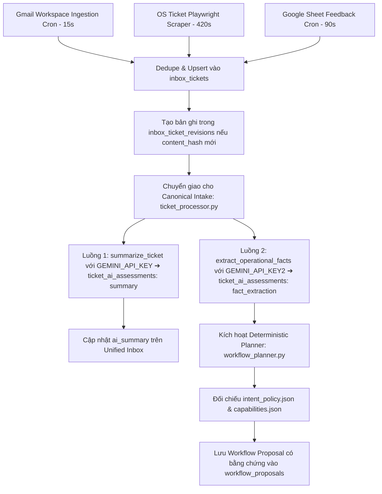
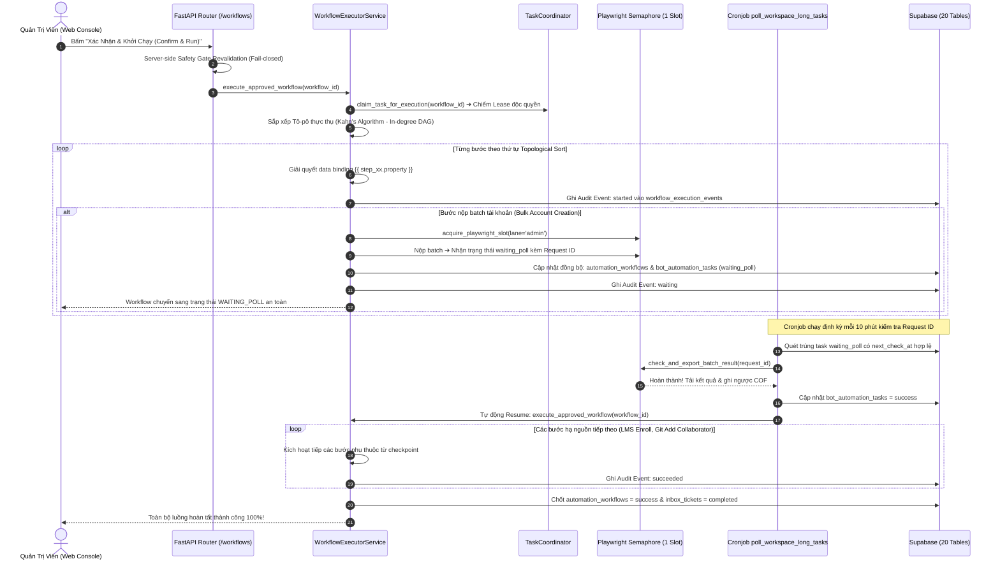

# 🚀 BÁCH KHOA TOÀN THƯ KIẾN TRÚC HỆ THỐNG PTV-TASKS-ADMINISTRATOR
## Pythaverse Central Admin & Automation Hub (Enterprise Single Source of Truth)

> **Tài liệu Kỹ Thuật Độc Quyền & Tối Cao:** Bản đặc tả kiến trúc toàn diện này được biên soạn nhằm chuẩn hóa và hệ thống lại 100% mã nguồn, sơ đồ luồng dữ liệu, cấu trúc cơ sở dữ liệu 20 bảng, các gói dịch vụ RPA, ma trận bộ nhớ đệm RAM, kiến trúc AI Workflow tất định (Deterministic Safety-Critical) và giao diện người dùng của dự án **`ptv-tasks-administrator`**. Mọi kỹ sư phần mềm, chuyên gia tự động hóa hoặc AI Coder mới chỉ cần đọc tài liệu này là có thể nắm bắt trọn vẹn toàn bộ hệ sinh thái mà không bao giờ gặp tình trạng suy đoán, hallucination hay làm sai lệch nghiệp vụ.

---

## 📌 THÔNG TIN BẢN QUYỀN & TÁC GIẢ SÁNG LẬP

- **Dự án:** `ptv-tasks-administrator` (Pythaverse Central Admin & Automation Hub)
- **Tác giả & Kiến trúc sư trưởng:** **Nguyễn Mạnh Hùng** (*Lead AI Engineer & Automation Architect – DTT Corporation / Pythaverse Ecosystem*)
- **GitHub:** [`https://github.com/hungnm-1225`](https://github.com/hungnm-1225)
- **Email:** `hungnm@dtt.vn` / `hung.nguyenmanh@dtt.vn`
- **Hệ sinh thái:** [Pythaverse Space](https://pythaverse.space)
- **Phiên bản:** `v3.0.0 Enterprise Safety-Critical & Deterministic Workflow Edition` (Cập nhật tháng 09/2026)

---

## 📑 MỤC LỤC TỔNG QUAN

1. [PHẦN I: TẦM NHÌN HỆ THỐNG & NĂM NGUYÊN TẮC BẤT DI BẤT DỊCH (SAFETY INVARIANTS)](#-phần-i-tầm-nhìn-hệ-thống--năm-nguyên-tắc-bất-di-bất-dịch-safety-invariants)
2. [PHẦN II: 7 PHÂN HỆ NGHIỆP VỤ PYTHAVERSE (DOMAIN TRUTH)](#-phần-ii-7-phân-hệ-nghiệp-vụ-pythaverse-domain-truth)
3. [PHẦN III: STACK CÔNG NGHỆ, THƯ VIỆN & THÔNG SỐ VẬN HÀNH MÔI TRƯỜNG](#-phần-iii-stack-công-nghệ-thư-viện--thông-số-vận-hành-môi-trường)
4. [PHẦN IV: SƠ ĐỒ CẤU TRÚC THƯ MỤC MONOREPO TỔNG THỂ & VAI TRÒ TỪNG FILE](#-phần-iv-sơ-đồ-cấu-trúc-thư-mục-monorepo-tổng-thể--vai-trò-từng-file)
5. [PHẦN V: GIẢI PHẪU CHI TIẾT TỪNG FILE & HÀM XỬ LÝ BACKEND (FASTAPI 0.115)](#-phần-v-giải-phẫu-chi-tiết-từng-file--hàm-xử-lý-backend-fastapi-0115)
   - [5.1. Entrypoint & Lifespan Crons Lệch Pha (`main.py`)](#51-entrypoint--lifespan-crons-lệch-pha-mainpy)
   - [5.2. Lõi Hệ Thống Core (`app/core/`) – Dual-Key Gemini & Playwright Semaphore](#52-lõi-hệ-thống-core-appcore)
   - [5.3. Định Nghĩa Dữ Liệu Schemas (`app/models/`) – Bổ Sung `intent.py` & `workflow.py`](#53-định-nghĩa-dữ-liệu-schemas-appmodels)
   - [5.4. Tri Thức Nghiệp Vụ & Grounding Registry (`app/brain/`) – `intent_policy.json`](#54-tri-thức-nghiệp-vụ--grounding-registry-appbrain)
   - [5.5. Cổng Giao Tiếp REST API Endpoints & Ma Trận 8 In-Memory Caches (`app/api/v1/endpoints/`)](#55-cổng-giao-tiếp-rest-api-endpoints--ma-trận-8-in-memory-caches-appapiv1endpoints)
   - [5.6. Gói Dịch Vụ Workspace RPA Đa Kế Thừa (`app/services/workspace/`)](#56-gói-dịch-vụ-workspace-rpa-đa-kế-thừa-appservicesworkspace)
   - [5.7. Các Dịch Vụ Nghiệp Vụ Chuyên Biệt (`app/services/`)](#57-các-dịch-vụ-nghiệp-vụ-chuyên-biệt-appservices)
   - [5.8. Bộ Điều Phối Workers Chạy Ngầm (`app/workers/`) – `ticket_processor.py`](#58-bộ-điều-phối-workers-chạy-ngầm-appworkers)
   - [5.9. Bộ Kiểm Thử An Toàn Tự Động Pytest Suite (`backend/tests/`)](#59-bộ-kiểm-thử-an-toàn-tự-động-pytest-suite-backendtests)
6. [PHẦN VI: GIẢI PHẪU CHI TIẾT GIAO DIỆN FRONTEND SPA (REACT 19 + VITE 6 + TAILWIND CSS V4)](#-phần-vi-giải-phẫu-chi-tiết-giao-diện-frontend-spa-react-19--vite-6--tailwind-css-v4)
   - [6.1. Khởi Chạy & Định Tuyến Toàn Cục (`App.tsx`, `main.tsx`)](#61-khởi-chạy--định-tuyến-toàn-cục-apptsx-maintsx)
   - [6.2. Thiết Kế Hệ Thống Design System Bento Grid & Enterprise Pastel OKLCH](#62-thiết-kế-hệ-thống-design-system-bento-grid--enterprise-pastel-oklch)
   - [6.3. Bóc Tách Chi Tiết 13 Feature Modules & AI Workflow Console V3](#63-bóc-tách-chi-tiết-13-feature-modules--ai-workflow-console-v3)
7. [PHẦN VII: CƠ SỞ DỮ LIỆU SUPABASE POSTGRESQL 16 (20 BẢNG & PROVENANCE HẠ TẦNG)](#-phần-vii-cơ-sở-dữ-liệu-supabase-postgresql-16-20-bảng--provenance-hạ-tầng)
8. [PHẦN VIII: 11 SƠ ĐỒ LUỒNG NGHIỆP VỤ END-TO-END (MERMAID SEQUENCE & FLOWCHARTS)](#-phần-viii-11-sơ-đồ-luồng-nghiệp-vụ-end-to-end-mermaid-sequence--flowcharts)
9. [PHẦN IX: CẨM NANG VẬN HÀNH & MA TRẬN ĐIỀU HƯỚNG DÀNH CHO AI CODER MỚI](#-phần-ix-cẩm-nang-vận-hành--ma-trận-điều-hướng-dành-cho-ai-coder-mới)
10. [PHẦN X: CẨM NANG ĐỊNH TUYẾN CHUYÊN GIA AI (INTELLIGENT AGENT ROUTING PLAYBOOK)](#-phần-x-cẩm-nang-định-tuyến-chuyên-gia-ai-intelligent-agent-routing-playbook)

---

## 🏛️ PHẦN I: TẦM NHÌN HỆ THỐNG & NĂM NGUYÊN TẮC BẤT DI BẤT DỊCH (SAFETY INVARIANTS)

`ptv-tasks-administrator` được định vị là **Trung tâm Thần kinh Điều phối & Tự Động Hóa Tập Trung (Pythaverse Central Admin & Automation Hub)** cho toàn bộ tập đoàn DTT Corporation và hệ sinh thái giáo dục công nghệ Pythaverse.

```
                  ┌────────────────────────────────────────────────────────┐
                  │                 ĐẦU VÀO ĐA KÊNH (INGESTION)             │
                  │   [Gmail Workspace]  [Google Forms]  [OS Ticket SCP]   │
                  └───────────────────────────┬────────────────────────────┘
                                              │ Ingestion Crons (Lệch pha)
                                              ▼
┌──────────────────────────────────────────────────────────────────────────────────────────┐
│                      LÕI TRUNG TÂM PTV-TASKS-ADMINISTRATOR (BACKEND FASTAPI)             │
│                                                                                          │
│  ┌─────────────────────────┐   ┌───────────────────────────┐   ┌──────────────────────┐  │
│  │ Dual-Path Cognition AI  │   │  Deterministic Planner    │   │  Human-in-the-Loop   │  │
│  │ • Summary (Key 1)       │──▶│  • intent_policy.json     │──▶│  Safety Gate         │  │
│  │ • Facts/Evidence (Key 2)│   │  • Zero-Mockup Invariant  │   │  Server-Side Verify  │  │
│  └─────────────────────────┘   └───────────────────────────┘   └──────────────────────┘  │
│                                              │ Phê duyệt (Approved)                      │
│                                              ▼                                           │
│  ┌────────────────────────────────────────────────────────────────────────────────────┐  │
│  │                 TOPOLOGICAL DAG EXECUTOR & BOT WORKERS (KAHN ALGORITHM)            │  │
│  │  • TaskCoordinator Exclusive Lease Claiming (Anti-Race Condition)                  │  │
│  │  • Single-Instance Playwright Semaphore (1 Slot cho Render 512MB RAM)              │  │
│  │  • Hai chiều Sync waiting_poll & Auto-Resume Workflow                              │  │
│  │  • Append-Only Audit Trail (workflow_execution_events - Che mờ mật khẩu [PROTECTED])│  │
│  └────────────────────────────────────────────────────────────────────────────────────┘  │
│                                              │                                           │
│  ┌────────────────────────────────────────────────────────────────────────────────────┐  │
│  │                    MA TRẬN 8 BỘ NHỚ ĐỆM IN-MEMORY RAM (1MS SPEED)                  │  │
│  │    Courses (10m) | Workspace (15m) | Board (5m) | Bots (15s) | Tasks (60s)         │  │
│  │    Tickets (60s) | Monitor (30s)   | Reports (60s)                                 │  │
│  └────────────────────────────────────────────────────────────────────────────────────┘  │
└──────────────────────────────────────────────┬───────────────────────────────────────────┘
                                               │ Thực thi tự động
                                               ▼
                  ┌────────────────────────────────────────────────────────┐
                  │               HỆ SINH THÁI ĐÍCH (EXECUTION TARGETS)    │
                  │ School Workspace | PLearn LMS | Keycloak | Pythaverse Git | GitHub │
                  └────────────────────────────────────────────────────────┘
```

### Năm Nguyên Tắc Thiết Kế Bất Di Bất Dịch (Absolute Safety Invariants):
1. **Evidence-Based Invariant (Không Bằng Chứng ➔ Không Action):**
   - Một ý định (Intent) chỉ được công nhận nếu có đoạn trích dẫn nguyên văn (`evidence_quotes`) từ nội dung vé gốc. Tuyệt đối không suy đoán ý định ngoài nguồn. Thiếu bằng chứng bắt buộc chuyển sang trạng thái `needs_information`.
2. **Zero-Mockup Invariant (Cấm Tuyệt Đối Dữ Liệu Bịa Đặt / Fallback Giả Lập):**
   - Nghiêm cấm sử dụng bất kỳ giá trị mặc định giả lập nào (`SWRP 4-12`, count=4, mật khẩu `Ptv@2026`, role `DEVELOPER`) khi người dùng chưa cung cấp. Thiếu dữ kiện đầu vào cốt tử ➔ Chặn phê duyệt thực thi và hiển thị Checklist thiếu thông tin trên Web Console.
3. **Fail-Closed Capability Policy:**
   - Mọi capability trong đồ thị bắt buộc phải có `available=true` và `supported_by_handler=true` trong `capabilities.json`. Tuyệt đối không sinh bước cho các capability chưa có code bot xử lý trong `bot_executor.py` (ví dụ `resolve_lineage`, `generate_accounts_file`...).
4. **Server-Side Approval Revalidation:**
   - Endpoint `/approve_and_run` bắt buộc kiểm tra lại toàn bộ đồ thị DAG, contract đầu vào và trạng thái workflow ở Backend trước khi chuyển sang `approved`. Tuyệt đối không tin tưởng client validation. Khước từ hoàn toàn các workflow `no_action`, `needs_information`, `invalid` hoặc rỗng (0 bước).
5. **Memory Collection Safeguard & Single-Instance Concurrency (Render 512MB RAM):**
   - Duy trì nghiêm ngặt `GLOBAL_PLAYWRIGHT_SEMAPHORE = asyncio.Semaphore(1)`.
   - Mọi coroutine chạy Playwright hoặc quét ngầm bắt buộc gọi `gc.collect()` và `force_kill_zombie_chromium()` trong khối `finally`.
   - 6 Crons trong `main.py` xuất phát lệch pha (15s, 90s, 180s, 420s, 1200s, 2400s) để ngăn tràn RAM.

---

## 🌐 PHẦN II: 7 PHÂN HỆ NGHIỆP VỤ PYTHAVERSE (DOMAIN TRUTH)

| STT | Phân Hệ | Tên Miền / Giao Thức | Core Platform | Vai Trò Kỹ Thuật & Nghiệp Vụ Cốt Lõi | Phương Thức Tự Động Hóa |
|---|---|---|---|---|---|
| **1** | **School Workspace** | `https://pythaverse.space` | React MUI / Direct REST APIs | Hệ thống quản trị phân cấp 3 tầng (`Distributor` ➔ `Partner` ➔ `School`). Trường học tạo Order gửi Đối tác; Đối tác cấp License từ Pool hoặc xin Nhà phân phối cấp bù Contract; Quản trị viên Sales Admin phê duyệt tối cao. | Playwright Chromium Headless + Direct API Scanner (Gói `workspace/` 8 modules). |
| **2** | **PLearn LMS** | `https://learn.pythaverse.space` | Moodle LMS (PHP / MariaDB / Edwiser RemUI) | Cổng đào tạo Moodle LMS. Quản lý danh mục khóa học (`SWRP`, `IR`, `ASP`...) và ghi danh tài khoản theo Vai trò (`Student` - 9, `Teacher` - 7, `Manager` - 1), chia nhóm lớp tự động. | Playwright Headless + Keyword Filter 2 nhịp trên `td.cell.c2` (`playwright_service.py`). |
| **3** | **PGit Repos** | `https://git.pythaverse.space` | GitBucket Server (Scala / JVM / SQLite) | Máy chủ lưu trữ mã nguồn dự án học sinh & giáo viên. Quản lý Collaborators tại `/settings/collaborators`. Yêu cầu tài khoản người dùng phải đăng nhập SSO qua Keycloak ít nhất 1 lần để kích hoạt JIT provisioning. | Playwright Chromium tự động hóa OIDC Keycloak SSO Form, gán vai trò `ADMIN`, `DEVELOPER`, `GUEST` và click Apply changes (`git_service.py`). |
| **4** | **Keycloak Auth IDP** | `https://eid.pythaverse.space` | Keycloak (Java / WildFly / PostgreSQL) | Cổng xác thực định danh tập trung OpenID Connect / OAuth2 (Realm: `idp` / `master`). Quản lý thông tin đăng nhập, reset mật khẩu, kích hoạt/khóa tài khoản và xác thực email. | 2-Tier Hybrid: Direct REST API (300ms) ➔ Playwright RPA Fallback (`keycloak_service.py`). |
| **5** | **Leanbot IDE** | `https://ide.pythaverse.space` | Blockly / Web Bluetooth BLE | Web IDE lập trình khối kéo thả Blockly / App Inventor kết nối Robot phần cứng Leanbot thông qua Bluetooth BLE Companion APK. | Synthetic Monitoring Uptime & Latency (`site_monitor_service.py`). |
| **6** | **Support Helpdesk** | `https://support.pythaverse.space` | osTicket (PHP / MySQL) | Hệ thống tiếp nhận sự cố kỹ thuật osTicket. Được cào dữ liệu tự động định kỳ qua Playwright Headless session và chuyển giao cho Canonical Intake. | Playwright headless scraper cào vé, custom form fields & files đính kèm (`osticket_service.py`). |
| **7** | **PContest** | `https://contest.pythaverse.space` | Next.js / Python Judge | Hệ thống tổ chức thi đấu lập trình trực tuyến, quản lý bảng xếp hạng Leaderboard và chấm điểm tự động. | Synthetic Monitoring Uptime & Latency (`site_monitor_service.py`). |

---

## 🛠️ PHẦN III: STACK CÔNG NGHỆ, THƯ VIỆN & THÔNG SỐ VẬN HÀNH MÔI TRƯỜNG

### 1. Backend Stack & Phiên Bản Chuẩn
- **Ngôn ngữ & Runtime:** Python `3.11.x`
- **Web Framework:** FastAPI `0.115.x` (Asynchronous, OpenAPI/Swagger tự sinh tại `/docs`)
- **Validation Engine:** Pydantic `2.10.x` (Strict Schema Validation & Settings Management qua `pydantic-settings`)
- **RPA & Automation Engine:** Playwright Async Chromium (`playwright.async_api: 1.50.x`) với cờ tối ưu RAM nghiêm ngặt.
- **Lập lịch chạy ngầm:** APScheduler `3.10.x` (`AsyncIOScheduler`) với 6 Crons so le lệch pha.
- **In-Memory Caching:** Bộ nhớ đệm RAM tự phát triển (Ma trận 8 In-Memory Caches, TTL 15s - 15m, phản hồi 1ms, tự động invalidate khi có thao tác CUD).
- **Mã hóa dữ liệu Két Sắt:** `cryptography.fernet: ^44.0.x` (Thuật toán mã hóa đối xứng khóa 32 bytes URL-safe base64).
- **Trí tuệ nhân tạo (AI):** `google-generativeai: ^0.8.4` tích hợp động cơ **Dual-Key Engine** (`GEMINI_API_KEY` & `GEMINI_API_KEY2`) kết hợp chuỗi 10 models fallback tự phục hồi.
- **Xử lý Bảng tính:** `openpyxl: ^3.1.5` kết hợp định dạng màu hex và công thức Excel.
- **HTTP Client:** `httpx: ^0.28.x` cho REST API calls và synthetic monitoring.
- **Kiểm Thử Hồi Quy:** `pytest: ^8.x` chạy hermetic unit/contract test tự động.

### 2. Frontend Stack & Phiên Bản Chuẩn
- **Framework UI:** React `19.0.0` (Functional Components, Custom Hooks, Concurrent Rendering)
- **Ngôn ngữ:** TypeScript `5.7.x` Strict Mode (`strict: true`, type-safe 100%)
- **Bundler:** Vite `6.2.x` (Hỗ trợ HMR siêu tốc và tối ưu hóa Dynamic Chunk Splitting)
- **Định tuyến:** React Router DOM `v7` (Lazy loading 100% 13 modules với `React.lazy` + `Suspense`)
- **CSS Styling:** Tailwind CSS `4.0.x` (Kiến trúc Design Tokens hiện đại `@import "tailwindcss";`, Dark/Light Mode, Bento Grid SaaS aesthetic)
- **Biểu tượng (Icons):** `lucide-react: 0.475.x` (Bộ icon đồng nhất, sắc nét)
- **Thông báo & Hiệu ứng:** `sonner: ^2.0.1` (Toast notifications) và `canvas-confetti: ^1.9.4`.

### 3. Thông Số Tối Ưu RAM Render 512MB & Kiến Trúc Phân Làn Ưu Tiên
- **Khóa trần Đơn phiên Playwright (`GLOBAL_PLAYWRIGHT_SEMAPHORE = asyncio.Semaphore(1)`):**
  - **Làn VIP Quản trị viên (`lane='admin'`):** Timeout 300s, ưu tiên tuyệt đối cho thao tác duyệt web.
  - **Làn Nền Cronjob (`lane='cron'`):** Timeout 45s; nếu slot bận, tự động nhường slot êm dịu (`CronSlotYieldException`) và thoát an toàn mà KHÔNG làm văng lỗi ASGI.
  - **Cơ chế Re-entrancy Protection qua `contextvars`:** Tự động phát hiện tác vụ cha/con cùng coroutine context để chống deadlock lồng nhau.
  - **Tiêu diệt Zombie Chromium:** Hàm `force_kill_zombie_chromium()` chạy trong khối `finally` thu hồi 100% RAM native về hệ điều hành.

---

## 📁 PHẦN IV: SƠ ĐỒ CẤU TRÚC THƯ MỤC MONOREPO TỔNG THỂ & VAI TRÒ TỪNG FILE

```
ptv-tasks-administrator/
├── backend/                            # Ứng dụng Backend FastAPI (Python 3.11)
│   ├── app/
│   │   ├── api/v1/                     # Bộ định tuyến REST API v1
│   │   │   ├── endpoints/              # 10 Router chi tiết theo miền nghiệp vụ (Có In-Memory Cache)
│   │   │   │   ├── board.py            # API Kanban Board, Thùng rác 30 ngày, Columns, Cards
│   │   │   │   ├── bots.py             # API Giám sát 8 Workers, Stream log GMT+7, Retry Worker
│   │   │   │   ├── courses.py          # API CRUD Khóa học (Workspace vs LMS), Git Repos, Bulk Upsert
│   │   │   │   ├── github.py           # API Dispatch Issue vào Private Repo & AI Template Generator
│   │   │   │   ├── monitor.py          # API Giám sát 3-Tab: Public Sites, Auth Matrix, CI/CD Logs
│   │   │   │   ├── reports.py          # API Thống kê KPI, Dynamic Health 24h, Xuất DTT 3Đ Excel
│   │   │   │   ├── tasks.py            # API Cổng Duyệt Tác Vụ Human-in-the-Loop, Background Dispatch
│   │   │   │   ├── tickets.py          # API Hòm thư, /re-summarize, /re-assess-intent, Sync On-demand
│   │   │   │   ├── workflows.py        # API AI Workflow Console, Server-Side Safety Gate, Approve & Run
│   │   │   │   └── workspace.py        # API Phả hệ 480 trường, RAM Cache, Sync Scanner
│   │   │   └── router.py               # Điểm tập hợp toàn bộ Router v1
│   │   ├── brain/                      # Tri thức nghiệp vụ & Grounding Registry
│   │   │   ├── capabilities.json       # 19 Capabilities hệ thống (schemas, inputs/outputs, handler check)
│   │   │   ├── intent_policy.json      # Bảng chính sách ánh xạ Intent -> Capability tất định (Mới Pha 3)
│   │   │   ├── workflow_rules.json     # 5 Archetypes quy trình chuẩn
│   │   │   ├── dependency_rules.json   # Quy tắc ràng buộc tiên quyết giữa các năng lực
│   │   │   ├── knowledge_base.json     # Định nghĩa 7 phân hệ, từ khóa routing cán bộ phụ trách
│   │   │   └── prompts/                # Prompt Templates có Versioning (Mới Pha 2)
│   │   │       ├── ticket_summary_v1.txt    # Prompt tóm tắt mềm cho Inbox
│   │   │       └── intent_extraction_v1.txt # Prompt bóc tách sự thật có bằng chứng
│   │   ├── core/                       # Lõi hệ thống & Quản trị tài nguyên
│   │   │   ├── cache_policy.py         # BoundedMemoryCache LRU Budget ≤ 40MB, 4 Tiers
│   │   │   ├── config.py               # Pydantic Settings, Single Source of Time (UTC DB & GMT+7 Display)
│   │   │   ├── gemini.py               # AI Engine Dual-Key & Dual-Path Cognition (10-Model Fallback)
│   │   │   ├── playwright_manager.py   # Single-Instance Playwright Semaphore (1 Slot), Zombie Killer
│   │   │   ├── security.py             # Whitelist Domain @dtt.vn, Bearer JWT
│   │   │   ├── supabase.py             # Singleton Supabase Client (Service Role Key)
│   │   │   └── task_coordinator.py     # TaskCoordinator: Atomic Lease Claiming, Heartbeat
│   │   ├── models/                     # Schemas Pydantic Validation
│   │   │   ├── intent.py               # Schemas IntentAssessment, EvidenceSpan, TicketSummary (Mới Pha 2)
│   │   │   ├── task.py                 # Schemas Task Create, Approval, Retry
│   │   │   ├── template.py             # Schemas GitHub Template & XLSX Export Mapping
│   │   │   ├── ticket.py               # Schemas Ticket Create, Update, Filter Params
│   │   │   └── workflow.py             # Schemas Workflow Draft, Step DAG, Validation
│   │   ├── services/                   # Các dịch vụ nghiệp vụ chuyên biệt
│   │   │   ├── workspace/              # GÓI DỊCH VỤ WORKSPACE RPA ĐA KẾ THỪA (8 MODULES)
│   │   │   ├── cof_excel_service.py    # Bóc tách COF 3 Tabs, chuẩn hóa accounts.xlsx, ghi ngược kết quả
│   │   │   ├── git_service.py          # Tự động hóa Collaborators Pythaverse Git (GitBucket OIDC)
│   │   │   ├── github_service.py       # Dispatcher gửi Issue trực tiếp vào Private Repo
│   │   │   ├── gmail_service.py        # Ingestion Gmail API thuần túy, chuyển Canonical Intake
│   │   │   ├── google_doc_service.py   # Đọc nội dung Doc báo cáo, add comment tag email
│   │   │   ├── google_drive_service.py # Quản lý thư mục Drive 6 cấp, tải COF lên đúng trường
│   │   │   ├── google_sheet_service.py # Ingestion Form Feedback Sheet, chuyển Canonical Intake
│   │   │   ├── keycloak_service.py     # 2-Tier Hybrid: Direct REST API + Playwright Fallback
│   │   │   ├── osticket_service.py     # Ingestion OS Ticket Playwright, chuyển Canonical Intake
│   │   │   ├── playwright_service.py   # Ghi danh trực tiếp Moodle LMS PLearn (Keyword Filter 2 nhịp)
│   │   │   ├── site_monitor_service.py # Giám sát Uptime 10 site, Test 16 acc test qua Fernet, CI/CD
│   │   │   ├── workflow_executor.py    # Topological DAG Executor (Kahn), TaskCoordinator lease, Audit log
│   │   │   ├── workflow_planner.py     # Deterministic Planning Engine (Zero-LLM), Provenance Proposal
│   │   │   └── workspace_lineage_service.py # Giải mã Fernet Két Sắt & Phân giải phả hệ 3 cấp
│   │   ├── workers/                    # Bộ điều phối thực thi chạy ngầm
│   │   │   ├── bot_executor.py         # Router Worker trung tâm thực thi 6 loại bot
│   │   │   └── ticket_processor.py     # Canonical Intake Orchestrator (process_ticket_revision)
│   │   └── main.py                     # Entrypoint FastAPI, Lifespan 6 Crons so le, Resume Waiting Workflow
│   ├── tests/                          # Bộ Kiểm Thử Hồi Quy Tự Động (Mới Pha 7 - 10 Tests Green)
│   │   ├── conftest.py                 # Môi trường test cô lập, mock keys
│   │   ├── test_capability_contracts.py# Contract Test 19 capabilities vs bot_executor
│   │   ├── test_planning_policy.py     # Test Zero-Mockup Invariant & Evidence check
│   │   └── test_execution_safety.py    # Test Topological sort Kahn & Credential Masking
│   ├── pytest.ini                      # Cấu hình Pytest tự động
│   └── requirements.txt                # Danh mục gói thư viện Python Backend
├── frontend/                           # Ứng dụng Frontend SPA (React 19 + Vite 6 + Tailwind CSS v4)
│   ├── src/
│   │   ├── features/                   # 13 TRANG CHỨC NĂNG CHUYÊN BIỆT
│   │   │   ├── inbox/                  # Hòm Thư Đa Kênh & AI Workflow Console V3 (Evidence-Grounded)
│   │   │   │   ├── components/
│   │   │   │   │   ├── WorkflowBuilder.tsx # Trình biên tập DAG, khóa capability chưa có handler
│   │   │   │   │   ├── WorkflowStepCard.tsx # Thẻ bước thực thi, badge trạng thái, inline inputs
│   │   │   │   │   └── WorkflowValidationPanel.tsx # Safety Gate, Policy Invariants, Cảnh báo lỗi
│   │   │   │   └── UnifiedInboxPage.tsx # Console Bento V3 hiển thị Evidence Quotes từ email gốc
│   │   │   └── ...                     # Các feature modules khác (Dashboard, Board, Tasks, Studio...)
│   │   ├── types/index.ts              # TypeScript strict interfaces (WorkflowProposal, MissingRequirements...)
│   │   └── App.tsx                     # React 19 SPA Router, Lazy Loading 13 Modules
├── supabase/
│   ├── migrations/
│   │   └── 20260911000000_add_provenance_and_proposals.sql # Migration CSDL 20 bảng (Pha 1)
│   └── schema.sql                      # Schema chuẩn mực 20 bảng CSDL, RLS, Indexes, Triggers
├── GEMINI.md                           # System Instructions & Quy chuẩn tác nghiệp của AI Assistant
└── README.md                           # Bách khoa toàn thư kiến trúc hệ thống (Single Source of Truth)
```

---

## 🔬 PHẦN V: GIẢI PHẪU CHI TIẾT TỪNG FILE & HÀM XỬ LÝ BACKEND (FASTAPI 0.115)

### 5.1. Entrypoint & Lifespan Crons Lệch Pha (`main.py`)
- **Tệp tin:** [`backend/app/main.py`](file:///c:/Users/dtt/Desktop/Project/ptv-tasks-administrator/backend/app/main.py)
- **Hàm `poll_workspace_long_tasks()` – Đồng Bộ Waiting Poll & Tự Động Resume DAG:**
  - Quét bảng `bot_automation_tasks` tìm các task có `execution_status = 'waiting_poll'`.
  - Diệt tận gốc lỗi `Request #None`: Nếu thiếu `request_id` hợp lệ, lập tức đánh dấu `failed` để tránh lặp vô tận.
  - Sau khi lấy kết quả batch thành công và ghi ngược COF:
    - Kiểm tra `payload_data` có chứa `workflow_id` và `workflow_step_id` không.
    - Nếu task thuộc một Workflow: Cập nhật bước tương ứng trong `automation_workflows` sang `status = 'success'`, gán outputs và **tự động gọi `workflow_executor_service.execute_approved_workflow(workflow_id)` chạy ngầm** để tiếp tục các bước hạ nguồn (như LMS Enroll, Git Add Collaborators).
    - **Chỉ đánh dấu `inbox_tickets = 'completed'` khi toàn bộ Workflow đã hoàn thành thành công**, không đánh dấu sớm làm gián đoạn quy trình.
- **Cơ Chế Lập Lịch So Le 6 Crons:**
  1. `gmail_cron`: Gọi `poll_unread_gmails` (Chu kỳ: 10 phút, Chạy sau 15s).
  2. `sheet_cron`: Gọi `poll_form_feedbacks` (Chu kỳ: 15 phút, Chạy sau 90s).
  3. `workspace_long_tasks_cron`: Gọi `poll_workspace_long_tasks` (Chu kỳ: 10 phút, Chạy sau 180s).
  4. `osticket_cron`: Gọi `poll_open_ostickets` (Chu kỳ: 15 phút, Chạy sau 420s).
  5. `site_uptime_cron`: Gọi `poll_site_uptime_cron` (Chu kỳ: 60 phút, Chạy sau 1200s).
  6. `distributor_cache_scanner_cron`: Quét cache 5 Master Distributors (Chu kỳ: 60 phút, Chạy sau 2400s).

---

### 5.2. Lõi Hệ Thống Core (`app/core/`)

#### [`gemini.py`](file:///c:/Users/dtt/Desktop/Project/ptv-tasks-administrator/backend/app/core/gemini.py) (Dual-Path Cognition & Dual-Key Resiliency)
- **Dual-Key Engine:**
  - `GEMINI_API_KEY`: Chuyên trách luồng Tóm tắt mềm `summarize_ticket()`.
  - `GEMINI_API_KEY2`: Chuyên trách luồng Trích xuất sự thật vận hành `extract_operational_facts()`.
  - **Cross-Key Failover:** Khi một Key gặp lỗi `429 Too Many Requests` hoặc chạm giới hạn hạn mức, tự động đảo sang Key còn lại trước khi chuyển sang model tiếp theo trong danh sách 10 model fallback.
- **Tách Biệt Nhận Thức Kép (Dual-Path):**
  - `summarize_ticket(subject, raw_content, source) -> TicketSummary`: Tạo bản tóm tắt mềm tiếng Việt hiển thị trên Unified Inbox. Tuyệt đối không sinh action hay tham số mutation.
  - `extract_operational_facts(subject, raw_content, source, excel_summary) -> IntentAssessment`: Trích xuất các ý định và thực thể có **đính kèm trích dẫn nguyên văn (`evidence_quotes`)**. Nếu không có bằng chứng, trả về `needs_information`. Chống Prompt Injection bằng cách coi nội dung yêu cầu là untrusted string.
  - `analyze_ticket(...)`: Cầu nối tương thích ngược chạy đồng thời 2 luồng.
  - `process_ticket_with_ai(ticket_id)`: Tự động tạo bản ghi revision trong `inbox_ticket_revisions` và ghi 2 bản đánh giá độc lập vào `ticket_ai_assessments`.

---

### 5.3. Định Nghĩa Dữ Liệu Schemas (`app/models/`)
- [`intent.py`](file:///c:/Users/dtt/Desktop/Project/ptv-tasks-administrator/backend/app/models/intent.py) (Mới Pha 2):
  - `EvidenceSpan`: Chứa `quote` (đoạn trích nguyên văn từ nội dung vé làm bằng chứng) và `context_note`.
  - `ExtractedIntent`: Ý định vận hành kèm độ tin cậy `confidence`, danh sách `evidence: List[EvidenceSpan]` và `required_entities`.
  - `IntentAssessment`: Bản đánh giá sự thật vận hành Pydantic v2 strict (`outcome`: `no_action` | `needs_information` | `candidate_action`, `intents`, `entities`, `missing_requirements`, `warnings`, `raw_evidence_quotes`).
  - `TicketSummary`: Bản tóm tắt mềm phục vụ hiển thị Inbox (`category`, `priority`, `goal`, `summary_vi`).
- [`workflow.py`](file:///c:/Users/dtt/Desktop/Project/ptv-tasks-administrator/backend/app/models/workflow.py): Định nghĩa `WorkflowStepDraft`, `WorkflowValidationResult`, `WorkflowDraftUpdate`, `WorkflowApprovalRequest`.

---

### 5.4. Tri Thức Nghiệp Vụ & Grounding Registry (`app/brain/`)
- [`capabilities.json`](file:///c:/Users/dtt/Desktop/Project/ptv-tasks-administrator/backend/app/brain/capabilities.json) (v2.0.0):
  - Đồng bộ hóa 19 capabilities: bổ sung `input_schema`, `output_schema`, `supported_by_handler`, `requires_explicit_evidence`, `requires_manual_confirmation`.
  - **Khóa van an toàn:** Những capability chưa có code bot xử lý trong `bot_executor.py` (như `workspace.resolve_school`, `cof.generate_accounts_file`, `cof.parse_file`, `cof.write_results_back`, `lms.unenrol_users`) đều được gắn cờ `supported_by_handler = false` và `available = false`.
- [`intent_policy.json`](file:///c:/Users/dtt/Desktop/Project/ptv-tasks-administrator/backend/app/brain/intent_policy.json) (Mới Pha 3):
  - Bảng chính sách tất định quy định rõ mỗi Intent (`create_accounts`, `course_access`, `repository_access`, `reset_password`, `verify_email`) được phép kích hoạt chuỗi capability nào.
  - Chỉ trỏ vào các capability đang có cờ `available = true` và có handler thực tế.

---

### 5.5. Cổng Giao Tiếp REST API Endpoints (`app/api/v1/endpoints/`)
- [`tickets.py`](file:///c:/Users/dtt/Desktop/Project/ptv-tasks-administrator/backend/app/api/v1/endpoints/tickets.py):
  - `POST /{ticket_id}/re-summarize`: Chỉ làm tươi lại bản tóm tắt Inbox (Soft Summary).
  - `POST /{ticket_id}/re-assess-intent`: Bắt buộc Gemini AI trích xuất lại sự thật có bằng chứng, tạo revision và sinh bản Proposal version mới.
  - `POST /{ticket_id}/triage`: Bí danh tương thích ngược gọi trực tiếp vào `re-assess-intent`.
- [`workflows.py`](file:///c:/Users/dtt/Desktop/Project/ptv-tasks-administrator/backend/app/api/v1/endpoints/workflows.py):
  - `POST /{workflow_id}/approve_and_run`: **Chốt chặn an toàn Server-side (Safety-Critical Approval Gate):**
    - Kiểm tra trạng thái: Từ chối thẳng thừng `no_action`, `needs_information`, `invalid`, `running`, `succeeded`, `cancelled`.
    - Kiểm tra danh tính người duyệt: Bắt buộc `approved_by` hợp lệ có đuôi `@dtt.vn`.
    - Chặn workflow rỗng (0 bước).
    - Tự động chạy lại `validate_workflow_graph()` ở backend (Fail-closed).
    - Kiểm tra required inputs từng bước: trường học bắt buộc cho Workspace, courses bắt buộc cho LMS, repo bắt buộc cho Git.
    - Riêng `keycloak.reset_password`: Bắt buộc quản trị viên phải chỉ định mật khẩu tạm thời cụ thể trước khi bấm duyệt.

---

### 5.6. Dịch Vụ Lập Kế Hoạch & Thực Thi Workflow

#### [`workflow_planner.py`](file:///c:/Users/dtt/Desktop/Project/ptv-tasks-administrator/backend/app/services/workflow_planner.py) (Deterministic Planning Engine)
- **Zero-LLM inside Planner:** Hoàn toàn không gọi Gemini bên trong planner. Tiếp nhận `IntentAssessment` đã kiểm chứng từ Pha 2.
- **Hàm `build_workflow_proposal()`:** Đối chiếu `intent_policy.json` và `capabilities.json`.
- **Zero-Mockup Invariant:** Xóa sổ 100% các giá trị mặc định bịa đặt. Thiếu trường học, file, course, repo ➔ Dừng lại ở trạng thái `needs_information` và trả về Checklist.
- **Lưu trữ Provenance:** Tự động lưu bản đề xuất vào bảng mới `workflow_proposals` (Pha 1) kèm bằng chứng trích dẫn nguyên văn (`evidence_quotes`), đồng thời cập nhật `automation_workflows` để giữ tương thích ngược.

#### [`workflow_executor.py`](file:///c:/Users/dtt/Desktop/Project/ptv-tasks-administrator/backend/app/services/workflow_executor.py) (Topological DAG Executor)
- **Thuật Toán Sắp Xếp Tô-pô (Kahn's Algorithm):** Tính toán in-degree của từng bước trong đồ thị DAG, đảm bảo bước cha luôn hoàn thành trước bước con.
- **Bảo Vệ Concurrency:** Chiếm Lease độc quyền qua `TaskCoordinator.claim_task_for_execution()` chống race condition.
- **Đồng Bộ Hai Chiều `waiting_poll`:** Cập nhật đồng thời cả `automation_workflows` và `bot_automation_tasks.execution_status = 'waiting_poll'` để Cronjob quét trúng.
- **Append-Only Execution Audit:** Ghi nhận sự kiện (`started`, `waiting`, `succeeded`, `failed`, `retried`) vào bảng `workflow_execution_events`, tự động che mờ mật khẩu và token nhạy cảm (`[PROTECTED]`).

---

### 5.7. Bộ Điều Phối Workers & Canonical Intake

#### [`ticket_processor.py`](file:///c:/Users/dtt/Desktop/Project/ptv-tasks-administrator/backend/app/workers/ticket_processor.py) (Canonical Intake Orchestrator)
- **Một Cửa Tiếp Nhận Duy Nhất (`process_ticket_revision`):**
  1. Đọc nội dung từ `inbox_ticket_revisions`.
  2. Bóc tách file COF/Excel (nếu có).
  3. Phân tách 2 đánh giá AI độc lập (Summary mềm + Fact Extraction có bằng chứng).
  4. Lưu độc lập 2 assessments vào `ticket_ai_assessments`.
  5. Khởi chạy Deterministic Planner sinh Workflow Proposal chuẩn mực.
- **Hàm `process_incoming_ticket(ticket_data)`:** Cầu nối chuẩn cho 3 Ingestion Adapters (Gmail, Sheet, osTicket), tự động quản lý mã băm `content_hash` và đánh số `revision_no`.
- *(Lưu ý: File rỗng `backend/app/services/ticket_processor.py` đã được loại bỏ hoàn toàn để tránh xung đột import).*

#### Chuẩn Hóa 3 Ingestion Adapters:
- [`osticket_service.py`](file:///c:/Users/dtt/Desktop/Project/ptv-tasks-administrator/backend/app/services/osticket_service.py), [`gmail_service.py`](file:///c:/Users/dtt/Desktop/Project/ptv-tasks-administrator/backend/app/services/gmail_service.py), [`google_sheet_service.py`](file:///c:/Users/dtt/Desktop/Project/ptv-tasks-administrator/backend/app/services/google_sheet_service.py):
  - Lột bỏ hoàn toàn việc gọi AI rải rác.
  - Chỉ làm nhiệm vụ cào dữ liệu, chuẩn hóa, lưu vào `inbox_tickets` và chuyển giao quyền xử lý sang `process_incoming_ticket()`.

---

### 5.8. Bộ Kiểm Thử An Toàn Tự Động Pytest Suite (`backend/tests/`)
Hệ thống tích hợp bộ test kiểm định an toàn hồi quy (Hermetic Unit & Contract Tests), chạy siêu tốc (<2s) mà không tốn quota AI:
- [`test_capability_contracts.py`](file:///c:/Users/dtt/Desktop/Project/ptv-tasks-administrator/backend/tests/test_capability_contracts.py): Kiểm tra 100% capability có `available=true` bắt buộc phải có bot handler thực tế trong `bot_executor.py`. Đảm bảo `intent_policy.json` không trỏ vào capability bị khóa.
- [`test_planning_policy.py`](file:///c:/Users/dtt/Desktop/Project/ptv-tasks-administrator/backend/tests/test_planning_policy.py): Kiểm định bất di bất dịch: Tuyệt đối không xuất hiện các giá trị mockup (`SWRP 4-12`, count=4, `Ptv@2026`, `DEVELOPER`). Kiểm tra `needs_information` khi thiếu bằng chứng hoặc thiếu required inputs; kiểm tra phát hiện chu trình lặp kín (Circular Dependency).
- [`test_execution_safety.py`](file:///c:/Users/dtt/Desktop/Project/ptv-tasks-administrator/backend/tests/test_execution_safety.py): Kiểm tra thuật toán sắp xếp Tô-pô Kahn (bước cha luôn đứng trước bước con); kiểm tra cơ chế che mờ thông tin mật `[PROTECTED]`; kiểm tra giải mã data binding `{{ step_xx.property }}`.
- **Kết quả thực thi:** `10 passed in 7.59s` (100% Green).

---

## 🎨 PHẦN VI: GIẢI PHẪU CHI TIẾT GIAO DIỆN FRONTEND SPA (REACT 19 + VITE 6 + TAILWIND CSS V4)

### 6.1. Cấu Hình Types TypeScript Strict (`types/index.ts`)
- [`types/index.ts`](file:///c:/Users/dtt/Desktop/Project/ptv-tasks-administrator/frontend/src/types/index.ts):
  - Bổ sung `EvidenceQuotes: string[]`, `MissingRequirementItem`, `WorkflowProposal`.
  - Cập nhật `WorkflowAIAnalysis`: hỗ trợ `workflow_outcome`, `missing_requirements`, `evidence_quotes`, `model_used`.
  - Cập nhật `CapabilityDefinition`: bổ sung `input_schema`, `output_schema`, `supported_by_handler`, `requires_explicit_evidence`, `requires_manual_confirmation`.
  - Cập nhật `WorkflowValidationResult`: hỗ trợ trạng thái `needs_information`.

### 6.2. Nâng Cấp Giao Diện Unified Inbox & AI Workflow Console V3
- **[`UnifiedInboxPage.tsx`](file:///c:/Users/dtt/Desktop/Project/ptv-tasks-administrator/frontend/src/features/inbox/UnifiedInboxPage.tsx):**
  - **VÙNG B (AI Understanding & Evidence Provenance):** Hiển thị khối **"Căn Cứ Trích Dẫn (AI nói điều này dựa vào câu nào?)"** trích nguyên văn từng câu trong email làm bằng chứng (`❝ quote ❞`), kèm huy hiệu tên Model AI thực tế (ví dụ `gemini-3.8-flash`).
  - **Header Console:** Tách bạch 2 nút AI độc lập:
    - 📝 **"Tóm tắt lại"**: Gọi `POST /tickets/{id}/re-summarize` (chỉ cập nhật text Inbox).
    - ✨ **"AI Đánh giá lại ý định"**: Gọi `POST /tickets/{id}/re-assess-intent` (ép Gemini trích xuất lại sự thật và sinh Proposal version mới).
  - **Safety Gate Lock:** Khóa hoàn toàn nút "Confirm & Run" nếu trạng thái là `no_action` hoặc `needs_information` (thay thế bằng status badge cảnh báo an toàn).
- **[`WorkflowValidationPanel.tsx`](file:///c:/Users/dtt/Desktop/Project/ptv-tasks-administrator/frontend/src/features/inbox/components/WorkflowValidationPanel.tsx):**
  - Bổ sung chip kiểm định **"Policy Khớp 100%"** và cảnh báo trực quan nếu phát hiện capability bị tạm khóa.
- **[`WorkflowBuilder.tsx`](file:///c:/Users/dtt/Desktop/Project/ptv-tasks-administrator/frontend/src/features/inbox/components/WorkflowBuilder.tsx):**
  - Khóa (disable) các capability chưa có bot handler trong dropdown chọn bước để Quản trị viên không bao giờ chọn nhầm action chết.

---

## 🗄️ PHẦN VII: CƠ SỞ DỮ LIỆU SUPABASE POSTGRESQL 16 (20 BẢNG & PROVENANCE HẠ TẦNG)

Hệ thống sử dụng cơ sở dữ liệu Supabase PostgreSQL 16 với **20 bảng dữ liệu chuyên biệt** (nâng cấp từ 16 bảng tại migration `20260911000000_add_provenance_and_proposals.sql`), áp dụng chính sách RLS đồng bộ `"admin_dtt_vn_only"` cho email `@dtt.vn`:

```
┌────────────────────────────────────────────────────────────────────────────────────────┐
│                        CƠ SỞ DỮ LIỆU SUPABASE POSTGRESQL 16 (20 BẢNG)                  │
├─────────────────────────┬──────────────────────────┬───────────────────────────────────┤
│ 1. INBOX & PROVENANCE   │ 2. LINEAGE & VAULT       │ 3. SCANNER & COURSE CATALOGS      │
│ • inbox_tickets         │ • workspace_organizations│ • workspace_contracts_cache       │
│ • inbox_ticket_revisions│ • workspace_credentials_ │ • workspace_orders_cache          │
│ • ticket_ai_assessments │   vault                  │ • workspace_courses               │
│ • workflow_proposals    │                          │ • lms_courses                     │
│ • workflow_execution_   │                          │                                   │
│   events                │                          │                                   │
│ • bot_automation_tasks  │                          │                                   │
│ • automation_workflows  │                          │                                   │
│ • automation_workflow_  │                          │                                   │
│   history               │                          │                                   │
│ • templates_config      │                          │                                   │
├─────────────────────────┼──────────────────────────┼───────────────────────────────────┤
│ 4. SITE HEALTH & CI/CD  │ 5. KANBAN WORK BOARD     │ 6. STORAGE BUCKET                 │
│ • site_monitor_         │ • work_boards            │ • ticket-attachments              │
│   credentials           │ • work_board_columns     │   (Lưu trữ file đính kèm email,   │
│ • site_downtime_events  │ • work_board_cards       │    COF Excel và kết quả nộp batch)│
│ • site_deploy_configs   │                          │                                   │
└─────────────────────────┴──────────────────────────┴───────────────────────────────────┘
```

### Chi Tiết 4 Bảng Hạ Tầng Provenance Mới (Pha 1):
1. **`inbox_ticket_revisions`:** Lưu trữ lịch sử từng lần biến động nội dung vé kèm mã băm `content_hash` (SHA-256) và ràng buộc duy nhất `uq_ticket_revision (ticket_id, revision_no)`. Giúp osTicket cập nhật tin nhắn mà không làm hỏng dữ liệu lập plan cũ.
2. **`ticket_ai_assessments`:** Lưu trữ độc lập 2 bản đánh giá AI (`assessment_kind`: `'summary'` hoặc `'fact_extraction'`), ghi nhận `model_name`, `prompt_version`, `registry_version` và kết quả có cấu trúc `structured_result`.
3. **`workflow_proposals`:** Bản đề xuất Workflow chuẩn mực có trích dẫn bằng chứng (`evidence`), danh sách thiếu hụt (`missing_requirements`), kế hoạch (`plan`), phiên bản chính sách (`policy_version`) và bản đóng băng (`frozen_plan`).
4. **`workflow_execution_events`:** Nhật ký thực thi bất biến append-only, ghi nhận `step_id`, `event_type` (`started`, `waiting`, `succeeded`, `failed`, `retried`, `cancelled`), tham số đã che mờ mật khẩu `inputs`, kết quả `outputs`, thời gian `duration_ms` và người thực hiện `actor`.

---

## 🔄 PHẦN VIII: 11 SƠ ĐỒ LUỒNG NGHIỆP VỤ END-TO-END (MERMAID SEQUENCE & FLOWCHARTS)

### Luồng 5: Canonical Intake Pipeline & Dual-Path AI (Pha 2 & Pha 5)


### Luồng 11: Topological DAG Execution & Auto-Resume Workflow (Pha 4)


---

## 🧭 PHẦN IX: CẨM NANG VẬN HÀNH & MA TRẬN ĐIỀU HƯỚNG DÀNH CHO AI CODER MỚI

| Yêu Cầu Nghiệp Vụ Cần Xử Lý | Tệp Tin Cần Mở | Hàm Xử Lý Trọng Tâm | Ghi Chú Kỹ Thuật |
|---|---|---|---|
| **Lập Kế Hoạch AI Workflow Tất Định** | [`backend/app/services/workflow_planner.py`](file:///c:/Users/dtt/Desktop/Project/ptv-tasks-administrator/backend/app/services/workflow_planner.py) | `build_workflow_proposal`, `plan_workflow_for_ticket` | Thuần logic, không gọi LLM, đối chiếu `intent_policy.json`, lưu `workflow_proposals`. |
| **Thực Thi Luồng Tự Động DAG & Sắp Xếp Tô-pô** | [`backend/app/services/workflow_executor.py`](file:///c:/Users/dtt/Desktop/Project/ptv-tasks-administrator/backend/app/services/workflow_executor.py) | `execute_approved_workflow`, `_topological_sort`, `_resolve_input_bindings` | Thuật toán Kahn, TaskCoordinator lease, đồng bộ 2 chiều `waiting_poll`, che mờ mật khẩu `[PROTECTED]`. |
| **Một Cửa Tiếp Nhận Vé Canonical Intake** | [`backend/app/workers/ticket_processor.py`](file:///c:/Users/dtt/Desktop/Project/ptv-tasks-administrator/backend/app/workers/ticket_processor.py) | `process_ticket_revision`, `process_incoming_ticket` | Quản lý mã băm `content_hash`, tạo `inbox_ticket_revisions` và ghi nhận `ticket_ai_assessments`. |
| **Bóc Tách Sự Thật AI & Dual-Key Engine** | [`backend/app/core/gemini.py`](file:///c:/Users/dtt/Desktop/Project/ptv-tasks-administrator/backend/app/core/gemini.py) | `summarize_ticket`, `extract_operational_facts`, `_call_gemini_with_fallback` | Dual-Key (`GEMINI_API_KEY` & `GEMINI_API_KEY2`), Cross-Key Failover, 10-Model fallback. |
| **Chạy Bộ Kiểm Thử An Toàn Pytest** | [`backend/tests/`](file:///c:/Users/dtt/Desktop/Project/ptv-tasks-administrator/backend/tests/) | Chạy lệnh `pytest` tại terminal backend | 10 bài test kiểm tra contracts, zero-mockup, evidence và topological execution. |
| **Tóm Tắt Lại & Đánh Giá Lại Vé API** | [`backend/app/api/v1/endpoints/tickets.py`](file:///c:/Users/dtt/Desktop/Project/ptv-tasks-administrator/backend/app/api/v1/endpoints/tickets.py) | `re_summarize_ticket`, `re_assess_ticket_intent` | Tách bạch 2 endpoint làm tươi Inbox text và sinh Proposal version mới. |
| **Phê Duyệt & Khởi Chạy Workflow API** | [`backend/app/api/v1/endpoints/workflows.py`](file:///c:/Users/dtt/Desktop/Project/ptv-tasks-administrator/backend/app/api/v1/endpoints/workflows.py) | `approve_and_run_workflow`, `validate_workflow` | Chốt chặn an toàn Server-side (Fail-closed), kiểm tra contract từng bước. |
| **Giao Diện AI Workflow Console V3** | [`frontend/src/features/inbox/UnifiedInboxPage.tsx`](file:///c:/Users/dtt/Desktop/Project/ptv-tasks-administrator/frontend/src/features/inbox/UnifiedInboxPage.tsx) | `UnifiedInboxPage`, `WorkflowBuilder`, `WorkflowValidationPanel` | Bento V3 hiển thị trích dẫn nguyên văn bằng chứng (`evidence_quotes`), 2 nút Re-analysis. |

---

## 🤖 PHẦN X: CẨM NANG ĐỊNH TUYẾN CHUYÊN GIA AI (INTELLIGENT AGENT ROUTING PLAYBOOK)

Mỗi khi AI Assistant tiếp nhận yêu cầu từ người dùng, hệ thống **BẮT BUỘC TỰ ĐỘNG** nhận diện miền nghiệp vụ và áp dụng năng lực chuyên gia từ các hồ sơ agent trong `.agent/agents/`:

| Lĩnh Vực / Phạm Vi Tác Vụ | Agent Chuyên Gia | Hồ Sơ Tham Chiếu | Trọng Tâm Quy Chuẩn Áp Dụng |
|---|---|---|---|
| **Frontend UI/UX** | `frontend-specialist` | `.agent/agents/frontend-specialist.md` | React 19, TypeScript Strict, Tailwind CSS v4, Bento Grid, Enterprise Pastel OKLCH, Dark/Light theme, Evidence Provenance UI. |
| **Backend & REST APIs** | `backend-specialist` | `.agent/agents/backend-specialist.md` | Python 3.11, FastAPI 0.115, Pydantic v2 validation, Async/Await, Dual-Key Gemini Engine, True Topological Sort (Kahn), 8 RAM Caches. |
| **Database & Storage** | `database-architect` | `.agent/agents/database-architect.md` | Supabase PostgreSQL 16 (20 bảng CSDL + Storage Bucket), Revisions, Assessments, Proposals, Append-only Execution Events, RLS `@dtt.vn`. |
| **RPA & Web Scraping** | `qa-automation-engineer` | `.agent/agents/qa-automation-engineer.md` | Playwright Async Chromium, Gói `workspace/` modularized 8 modules, Single Playwright Semaphore (1 Slot cho 512MB RAM), Zombie killer. |
| **Security & Identity** | `security-auditor` | `.agent/agents/security-auditor.md` | Whitelist Domain `@dtt.vn`, Fernet Credential Vault (`VAULT_SECRET_KEY`), Keycloak Admin REST API, Credential Masking `[PROTECTED]`. |

### Checklist Tự Kiểm Tra Trước Khi Trả Lời (Agent Routing Checklist):
1. Đã nhận diện đúng Agent chuyên môn cho lĩnh vực yêu cầu chưa?
2. Đã đảm bảo ngôn ngữ phản hồi bằng **Tiếng Việt**, tên biến/hàm/mã nguồn bằng **Tiếng Anh** chuẩn mực chưa?
3. Đã gắn link tệp tin định dạng `[Tên tệp](file:///...)` chuẩn xác chưa?
4. Đã bảo đảm tuân thủ **Năm Nguyên Tắc Bất Di Bất Dịch (AI Safety Invariants)** chưa?