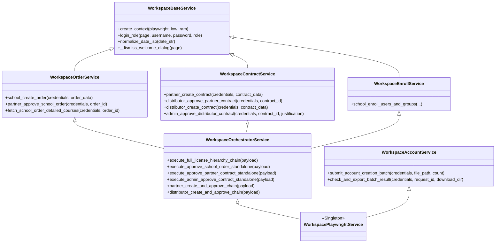
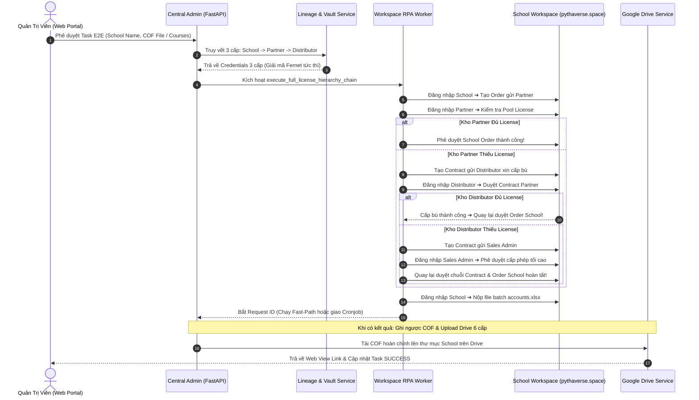
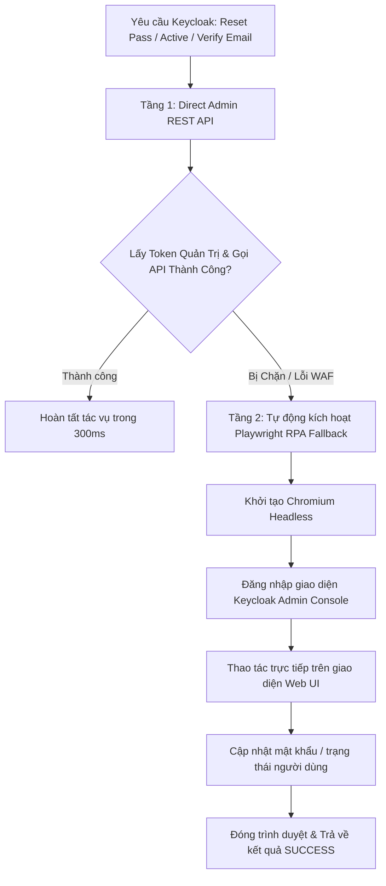
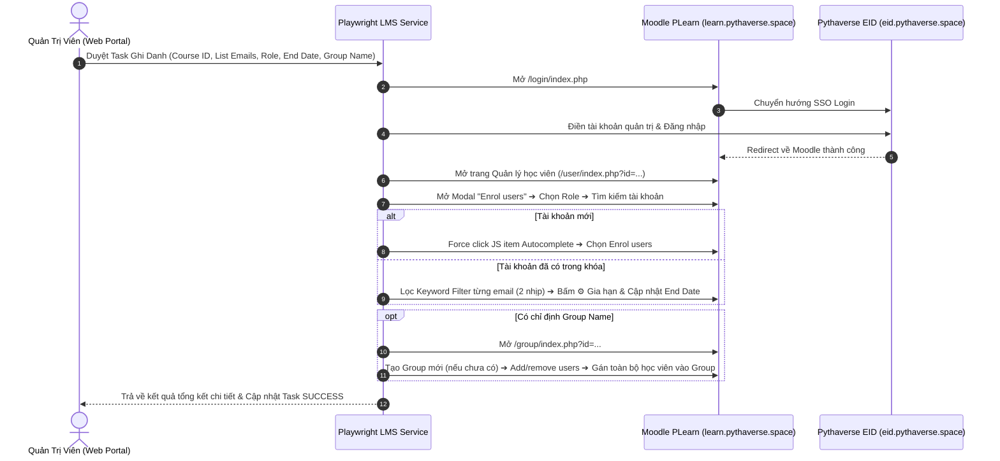
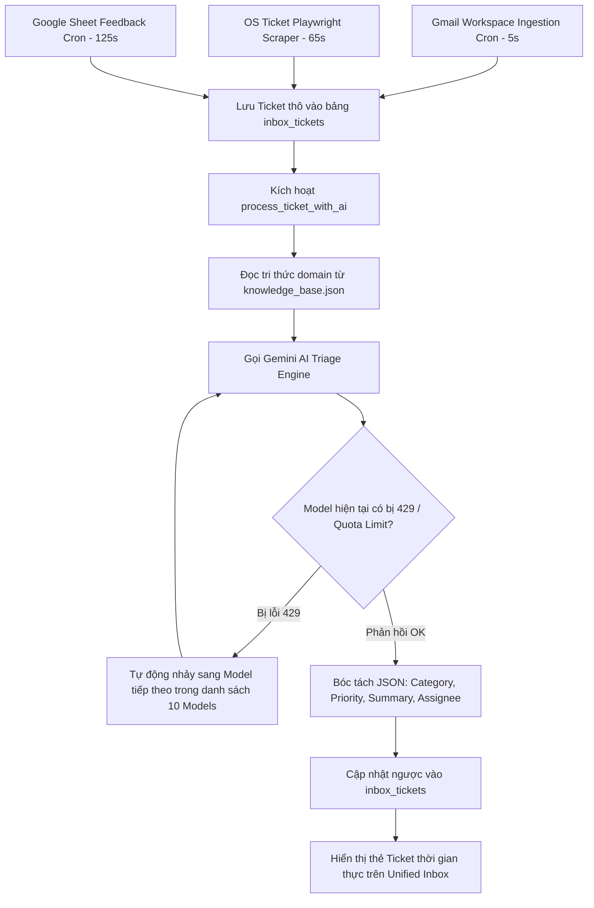
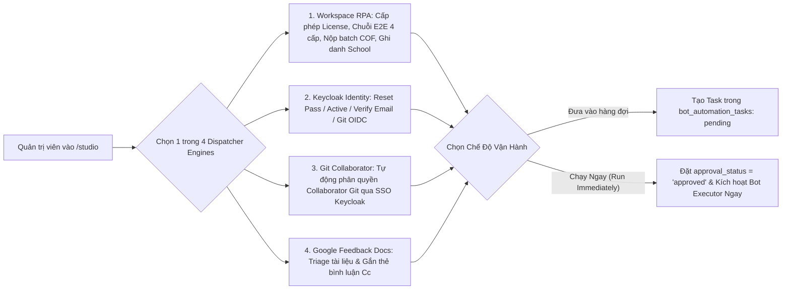
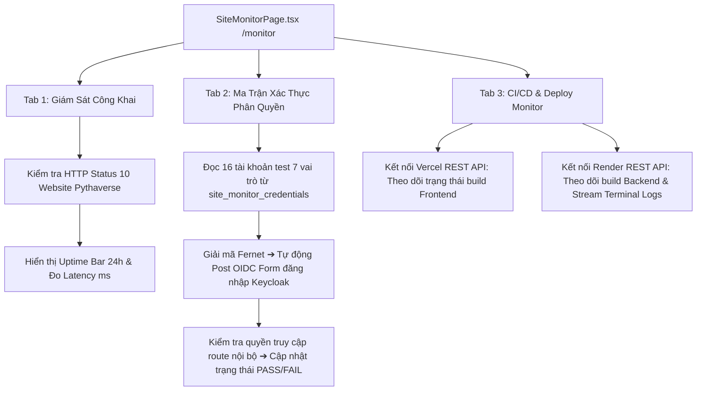
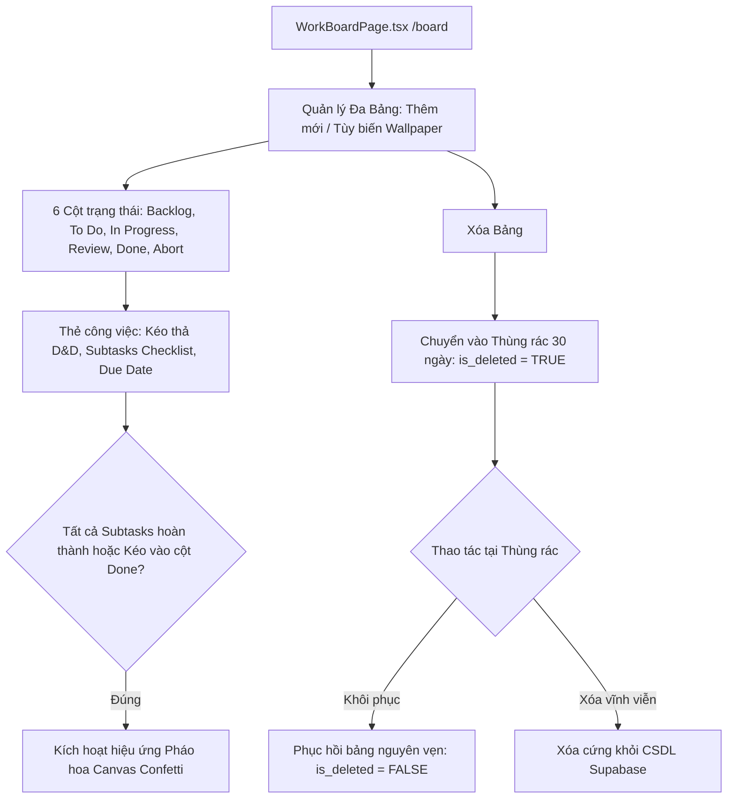
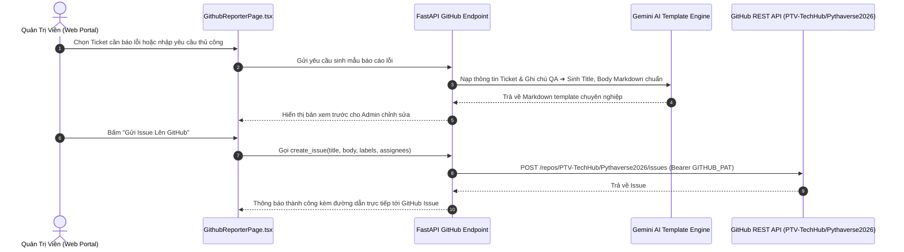
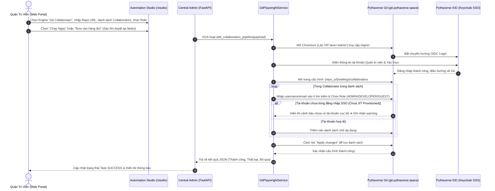

# 🚀 BÁCH KHOA TOÀN THƯ KIẾN TRÚC HỆ THỐNG PTV-TASKS-ADMINISTRATOR
## Pythaverse Central Admin & Automation Hub (Enterprise Single Source of Truth)

> **Tài liệu Kỹ Thuật Độc Quyền & Tối Cao:** Bản đặc tả kiến trúc toàn diện này được biên soạn nhằm chuẩn hóa và hệ thống lại 100% mã nguồn, sơ đồ luồng dữ liệu, cấu trúc cơ sở dữ liệu, các gói dịch vụ RPA, ma trận bộ nhớ đệm RAM và giao diện người dùng của dự án **`ptv-tasks-administrator`**. Mọi kỹ sư phần mềm, chuyên gia tự động hóa hoặc AI Coder mới chỉ cần đọc tài liệu này là có thể nắm bắt trọn vẹn toàn bộ hệ sinh thái, hiểu rõ từng tệp tin và từng hàm xử lý mà không cần phải duyệt thủ công từng tệp code hay gặp bối rối khi thao tác với một file đơn lẻ.

---

## 📌 THÔNG TIN BẢN QUYỀN & TÁC GIẢ SÁNG LẬP

- **Dự án:** `ptv-tasks-administrator` (Pythaverse Central Admin & Automation Hub)
- **Tác giả & Kiến trúc sư trưởng:** **Nguyễn Mạnh Hùng** (*Lead AI Engineer & Automation Architect – DTT Corporation / Pythaverse Ecosystem*)
- **GitHub:** [`https://github.com/hungnm-1225`](https://github.com/hungnm-1225)
- **Email:** `hungnm@dtt.vn` / `hung.nguyenmanh@dtt.vn`
- **Hệ sinh thái:** [Pythaverse Space](https://pythaverse.space)
- **Phiên bản:** `v2.6.0 Enterprise Reliability Release` (Cập nhật tháng 09/2026)

---

## 📑 MỤC LỤC TỔNG QUAN

1. [PHẦN I: TẦM NHÌN HỆ THỐNG & BỐN NGUYÊN TẮC BẤT DI BẤT DỊCH](#-phần-i-tầm-nhìn-hệ-thống--bốn-nguyên-tắc-bất-di-bất-dịch)
2. [PHẦN II: 7 PHÂN HỆ NGHIỆP VỤ PYTHAVERSE (DOMAIN TRUTH)](#-phần-ii-7-phân-hệ-nghiệp-vụ-pythaverse-domain-truth)
3. [PHẦN III: STACK CÔNG NGHỆ, THƯ VIỆN & THÔNG SỐ VẬN HÀNH MÔI TRƯỜNG](#-phần-iii-stack-công-nghệ-thư-viện--thông-số-vận-hành-môi-trường)
4. [PHẦN IV: SƠ ĐỒ CẤU TRÚC THƯ MỤC MONOREPO TỔNG THỂ & VAI TRÒ TỪNG FILE](#-phần-iv-sơ-đồ-cấu-trúc-thư-mục-monorepo-tổng-thể--vai-trò-từng-file)
5. [PHẦN V: GIẢI PHẪU CHI TIẾT TỪNG FILE & HÀM XỬ LÝ BACKEND (FASTAPI 0.115)](#-phần-v-giải-phẫu-chi-tiết-từng-file--hàm-xử-lý-backend-fastapi-0115)
   - [5.1. Entrypoint & Lifespan Crons Lệch Pha (`main.py`)](#51-entrypoint--lifespan-crons-lệch-pha-mainpy)
   - [5.2. Lõi Hệ Thống Core (`app/core/`)](#52-lõi-hệ-thống-core-appcore)
   - [5.3. Định Nghĩa Dữ Liệu Schemas (`app/models/`)](#53-định-nghĩa-dữ-liệu-schemas-appmodels)
   - [5.4. Tri Thức Nghiệp Vụ Brain (`app/brain/knowledge_base.json`)](#54-tri-thức-nghiệp-vụ-brain-appbrainknowledge_basejson)
   - [5.5. Cổng Giao Tiếp REST API Endpoints & Ma Trận 8 In-Memory Caches (`app/api/v1/endpoints/`)](#55-cổng-giao-tiếp-rest-api-endpoints--ma-trận-8-in-memory-caches-appapiv1endpoints)
   - [5.6. Gói Dịch Vụ Workspace RPA Đa Kế Thừa (`app/services/workspace/`)](#56-gói-dịch-vụ-workspace-rpa-đa-kế-thừa-appservicesworkspace)
   - [5.7. Các Dịch Vụ Nghiệp Vụ Chuyên Biệt (`app/services/`)](#57-các-dịch-vụ-nghiệp-vụ-chuyên-biệt-appservices)
   - [5.8. Bộ Điều Phối Workers Chạy Ngầm (`app/workers/`)](#58-bộ-điều-phối-workers-chạy-ngầm-appworkers)
   - [5.9. Kịch Bản Khởi Tạo Dữ Liệu & Test Scripts (`scripts/`)](#59-kịch-bản-khởi-tạo-dữ-liệu--test-scripts-scripts)
6. [PHẦN VI: GIẢI PHẪU CHI TIẾT GIAO DIỆN FRONTEND SPA (REACT 19 + VITE 6 + TAILWIND CSS V4)](#-phần-vi-giải-phẫu-chi-tiết-giao-diện-frontend-spa-react-19--vite-6--tailwind-css-v4)
   - [6.1. Khởi Chạy & Định Tuyến Toàn Cục (`App.tsx`, `main.tsx`)](#61-khởi-chạy--định-tuyến-toàn-cục-apptsx-maintsx)
   - [6.2. Thiết Kế Hệ Thống Design System Bento Grid & Enterprise Pastel OKLCH](#62-thiết-kế-hệ-thống-design-system-bento-grid--enterprise-pastel-oklch)
   - [6.3. Cấu Hình Tác Giả, Contexts & Tiện Ích Client (`config/`, `context/`, `lib/`, `types/`)](#63-cấu-hình-tác-giả-contexts--tiện-ích-client-config-context-lib-types)
   - [6.4. Bóc Tách Chi Tiết 13 Feature Modules](#64-bóc-tách-chi-tiết-13-feature-modules)
   - [6.5. Components Dùng Chung & Bố Cục Layout (`components/common/`, `components/layout/`)](#65-components-dùng-chung--bố-cục-layout-componentscommon-componentslayout)
7. [PHẦN VII: CƠ SỞ DỮ LIỆU SUPABASE POSTGRESQL 16 (16 BẢNG & STORAGE BUCKET)](#-phần-vii-cơ-sở-dữ-liệu-supabase-postgresql-16-16-bảng--storage-bucket)
8. [PHẦN VIII: 10 SƠ ĐỒ LUỒNG NGHIỆP VỤ END-TO-END (MERMAID SEQUENCE & FLOWCHARTS)](#-phần-viii-10-sơ-đồ-luồng-nghiệp-vụ-end-to-end-mermaid-sequence--flowcharts)
9. [PHẦN IX: CẨM NANG VẬN HÀNH & MA TRẬN ĐIỀU HƯỚNG DÀNH CHO AI CODER MỚI](#-phần-ix-cẩm-nang-vận-hành--ma-trận-điều-hướng-dành-cho-ai-coder-mới)
10. [PHẦN X: CẨM NANG ĐỊNH TUYẾN CHUYÊN GIA AI (INTELLIGENT AGENT ROUTING PLAYBOOK)](#-phần-x-cẩm-nang-định-tuyến-chuyên-gia-ai-intelligent-agent-routing-playbook)

---

## 🏛️ PHẦN I: TẦM NHÌN HỆ THỐNG & BỐN NGUYÊN TẮC BẤT DI BẤT DỊCH

`ptv-tasks-administrator` được định vị là **Trung tâm Thần kinh Điều phối & Tự Động Hóa Tập Trung (Pythaverse Central Admin & Automation Hub)** cho toàn bộ tập đoàn DTT Corporation và hệ sinh thái giáo dục công nghệ Pythaverse.

```
                  ┌────────────────────────────────────────────────────────┐
                  │                 ĐẦU VÀO ĐA KÊNH (INGESTION)             │
                  │   [Gmail Workspace]  [Google Forms]  [OS Ticket SCP]   │
                  └───────────────────────────┬────────────────────────────┘
                                              │ Ingestion Crons (5 mins)
                                              ▼
┌──────────────────────────────────────────────────────────────────────────────────────────┐
│                      LÕI TRUNG TÂM PTV-TASKS-ADMINISTRATOR (BACKEND FASTAPI)             │
│                                                                                          │
│  ┌─────────────────────────┐   ┌───────────────────────────┐   ┌──────────────────────┐  │
│  │   Gemini AI Triage      │   │  Human-in-the-Loop Gate   │   │  Lineage & Vault     │  │
│  │   (10-Model Fallback)   │──▶│  (Approval Queue Portal)  │──▶│  (Fernet Encryption) │  │
│  └─────────────────────────┘   └───────────────────────────┘   └──────────────────────┘  │
│                                              │ Phê duyệt / Run Immediate                 │
│                                              ▼                                           │
│  ┌────────────────────────────────────────────────────────────────────────────────────┐  │
│  │                             BOT WORKER EXECUTION CENTER                            │  │
│  │  [Workspace RPA 4-Cấp]  [Keycloak 2-Tier API]  [LMS PLearn Enrol]  [Git Collaborator]│  │
│  │  [Google Docs Triage]   [GitHub Issue Dispatcher]                                  │  │
│  └────────────────────────────────────────────────────────────────────────────────────┘  │
│                                              │                                           │
│  ┌────────────────────────────────────────────────────────────────────────────────────┐  │
│  │                    MA TRẬN 8 BỘ NHỚ ĐỆM IN-MEMORY RAM (1MS SPEED)                  │  │
│  │    Courses (10m) | Workspace (15m) | Board (5m) | Bots (15s) | Tasks (60s)         │  │
│  │    Tickets (60s) | Monitor (30s)   | Reports (60s)                                 │  │
│  └────────────────────────────────────────────────────────────────────────────────────┘  │
└──────────────────────────────────────────────┬───────────────────────────────────────────┘
                                               │ Thực thi tự động
                                               ▼
                  ┌────────────────────────────────────────────────────────┐
                  │               HỆ SINH THÁI ĐÍCH (EXECUTION TARGETS)    │
                  │ School Workspace | PLearn LMS | Keycloak | Pythaverse Git | GitHub │
                  └────────────────────────────────────────────────────────┘
```

### Bốn Nguyên Tắc Thiết Kế Bất Di Bất Dịch (Absolute Rules):
1. **Cổng Phê Duyệt Con Người (Human-in-the-Loop Gate):**
   - Mọi tác vụ có khả năng gây đột biến hệ thống (cấp phát License, tạo tài khoản Keycloak, ghi danh LMS, phân quyền Git, tạo GitHub Issue) BẮT BUỘC phải đi qua hàng đợi phê duyệt của Quản trị viên (`approval_status = 'approved'`), trừ trường hợp Quản trị viên chủ động kích hoạt từ Automation Studio với cờ `run_immediately = true`.
2. **Kiểm Soát Miền Doanh Nghiệp (@dtt.vn Whitelist):**
   - Bảo mật đa tầng dựa trên Supabase OAuth & Bearer Token. Chỉ các tài khoản email Google thuộc miền `@dtt.vn` (đặc biệt tài khoản Quản trị viên Tối cao `hung.nguyenmanh@dtt.vn`) mới có quyền đăng nhập và gọi API. Tự động từ chối và đăng xuất mọi tài khoản ngoài miền.
3. **Bảo Vệ Bộ Nhớ Đệm RAM (Memory Collection Safeguard) & Khóa Trần Đơn Phiên (Single-Instance Concurrency):**
   - Do hệ thống triển khai trên máy chủ Render giới hạn 512MB RAM, mọi tác vụ chạy ngầm và tiến trình Playwright Chromium BẮT BUỘC phải tuân thủ nghiêm ngặt RAM Budget (Python app ≤ 150MB, Cache ≤ 40MB, Playwright ≤ 220MB, Transient ≤ 60MB).
   - Phiên Playwright áp dụng cơ chế khóa trần duy nhất 1 Chromium instance tại một thời điểm (`GLOBAL_PLAYWRIGHT_SEMAPHORE = asyncio.Semaphore(1)`), phân làm 2 làn ưu tiên: Làn 1 VIP Admin (Timeout 300s) và Làn 2 Nền Cron (Timeout 45s, tự động nhường slot an toàn `CronSlotYieldException` nếu hệ thống bận). Hỗ trợ cơ chế Re-entrancy Protection qua `contextvars` chống deadlock lồng nhau và tự động tiêu diệt tiến trình zombie Chromium (`force_kill_zombie_chromium()`) ngay khi giải phóng slot.
4. **Google Gemini Auto-Fallback 10 Tầng:**
   - Đảm bảo tính sẵn sàng 99.99% cho bộ máy phân tích AI bằng cơ chế tự động chuyển đổi thông minh giữa 10 mô hình Gemini khi gặp lỗi hạn mức `429 Too Many Requests`, `quota_exhausted` hoặc `ResourceExhausted`.

---

## 🌐 PHẦN II: 7 PHÂN HỆ NGHIỆP VỤ PYTHAVERSE (DOMAIN TRUTH)

Mọi kỹ sư và AI Coder khi tương tác với dự án bắt buộc phải hiểu rõ bản chất nghiệp vụ của 7 phân hệ:

| STT | Phân Hệ | Tên Miền / Giao Thức | Core Platform | Vai Trò Kỹ Thuật & Nghiệp Vụ Cốt Lõi | Phương Thức Tự Động Hóa |
|---|---|---|---|---|---|
| **1** | **School Workspace** | `https://pythaverse.space` | React MUI / Direct REST APIs | Hệ thống quản trị phân cấp 3 tầng (`Distributor` ➔ `Partner` ➔ `School`). Trường học tạo Order gửi Đối tác; Đối tác cấp License từ Pool hoặc xin Nhà phân phối cấp bù Contract; Quản trị viên Sales Admin phê duyệt tối cao. | Playwright Chromium Headless + Direct API Scanner (Gói `workspace/` 8 modules). |
| **2** | **PLearn LMS** | `https://learn.pythaverse.space` | Moodle LMS (PHP / MariaDB / Edwiser RemUI) | Cổng đào tạo Moodle LMS. Quản lý danh mục khóa học (`SWRP`, `IR`, `ASP`...) và ghi danh tài khoản theo Vai trò (`Student` - 9, `Non-editing teacher` - 7, `Manager` - 1), chia nhóm lớp tự động. | Playwright Headless + Keyword Filter 2 nhịp trên `td.cell.c2` (`playwright_service.py`). |
| **3** | **PGit Repos** | `https://git.pythaverse.space` | GitBucket Server (Scala / JVM / SQLite) | Máy chủ lưu trữ mã nguồn dự án học sinh & giáo viên. Quản lý Collaborators tại `/settings/collaborators`. Yêu cầu tài khoản người dùng phải đăng nhập SSO qua Keycloak ít nhất 1 lần để kích hoạt JIT provisioning. | Playwright Chromium tự động hóa OIDC Keycloak SSO Form, gán vai trò `ADMIN`, `DEVELOPER`, `GUEST` và click Apply changes (`git_service.py`). |
| **4** | **Keycloak Auth IDP** | `https://eid.pythaverse.space` | Keycloak (Java / WildFly / PostgreSQL) | Cổng xác thực định danh tập trung OpenID Connect / OAuth2 (Realm: `idp` / `master`). Quản lý thông tin đăng nhập, reset mật khẩu, kích hoạt/khóa tài khoản và xác thực email. | 2-Tier Hybrid: Direct REST API (300ms) ➔ Playwright RPA Fallback (`keycloak_service.py`). |
| **5** | **Leanbot IDE** | `https://ide.pythaverse.space` | Blockly / Web Bluetooth BLE | Web IDE lập trình khối kéo thả Blockly / App Inventor kết nối Robot phần cứng Leanbot thông qua Bluetooth BLE Companion APK. | Synthetic Monitoring Uptime & Latency (`site_monitor_service.py`). |
| **6** | **Support Helpdesk** | `https://support.pythaverse.space` | osTicket (PHP / MySQL) | Hệ thống tiếp nhận sự cố kỹ thuật osTicket. Được cào dữ liệu tự động định kỳ 5 phút qua Playwright Headless session. | Playwright headless scraper cào vé, custom form fields & files đính kèm (`osticket_service.py`). |
| **7** | **PContest** | `https://contest.pythaverse.space` | Next.js / Python Judge | Hệ thống tổ chức thi đấu lập trình trực tuyến, quản lý bảng xếp hạng Leaderboard và chấm điểm tự động. | Synthetic Monitoring Uptime & Latency (`site_monitor_service.py`). |

---

## 🛠️ PHẦN III: STACK CÔNG NGHỆ, THƯ VIỆN & THÔNG SỐ VẬN HÀNH MÔI TRƯỜNG

```
                      ┌────────────────────────────────────────────────────────┐
                      │              KIẾN TRÚC CÔNG NGHỆ HIỆN ĐẠI              │
                      └────────────────────────────────────────────────────────┘
                       ┌───────────────────────┐      ┌───────────────────────┐
                       │     FRONTEND SPA      │      │     BACKEND API       │
                       ├───────────────────────┤      ├───────────────────────┤
                       │ • React 19 Strict     │      │ • Python 3.11         │
                       │ • TypeScript Strict   │      │ • FastAPI 0.115       │
                       │ • Vite 6 Bundler      │      │ • Pydantic v2         │
                       │ • Tailwind CSS v4     │      │ • APScheduler 3.10    │
                       │ • Lucide React Icons  │      │ • Playwright Async    │
                       │ • Sonner Toast & D&D  │      │ • Fernet Cryptography │
                       │ • Canvas Confetti     │      │ • SheetJS / OpenPyXL  │
                       │ • Bento Grid Layout   │      │ • 8 In-Memory Caches  │
                       └───────────────────────┘      └───────────────────────┘
                                      │                      │
                                      ▼                      ▼
                       ┌──────────────────────────────────────────────────────┐
                       │             CƠ SỞ DỮ LIỆU & ĐIỆN TOÁN ĐÁM MÂY        │
                       ├──────────────────────────────────────────────────────┤
                       │ • Supabase PostgreSQL 16 (16 Tables + RLS Policies)  │
                       │ • Google Gemini AI Studio (10-Model Sequence)        │
                       │ • Vercel (Frontend Hosting) & Render (Backend Docker)│
                       │ • Google Workspace APIs (Gmail, Sheets, Docs, Drive) │
                       └──────────────────────────────────────────────────────┘
```

### 1. Backend Stack & Phiên Bản Chuẩn
- **Ngôn ngữ & Runtime:** Python `3.11.x`
- **Web Framework:** FastAPI `0.115.x` (Asynchronous, OpenAPI/Swagger tự sinh tại `/docs`)
- **Validation Engine:** Pydantic `2.10.x` (Strict Schema Validation & Settings Management qua `pydantic-settings`)
- **RPA & Automation Engine:** Playwright Async Chromium (`playwright.async_api: 1.50.x`) với cờ tối ưu RAM nghiêm ngặt.
- **Lập lịch chạy ngầm:** APScheduler `3.10.x` (`AsyncIOScheduler`) với 6 Crons so le lệch pha.
- **In-Memory Caching:** Bộ nhớ đệm RAM tự phát triển (Ma trận 8 In-Memory Caches, TTL 15s - 15m, phản hồi 1ms, tự động invalidate khi có thao tác CUD).
- **Mã hóa dữ liệu Két Sắt:** `cryptography.fernet: ^44.0.x` (Thuật toán mã hóa đối xứng khóa 32 bytes URL-safe base64).
- **Trí tuệ nhân tạo (AI):** `google-generativeai: ^0.8.4` tích hợp chuỗi 10 models fallback tự phục hồi.
- **Xử lý Bảng tính:** `openpyxl: ^3.1.5` kết hợp định dạng màu hex và công thức Excel.
- **HTTP Client:** `httpx: ^0.28.x` cho REST API calls và synthetic monitoring.

### 2. Frontend Stack & Phiên Bản Chuẩn
- **Framework UI:** React `19.0.0` (Functional Components, Custom Hooks, Concurrent Rendering)
- **Ngôn ngữ:** TypeScript `5.7.x` Strict Mode (`strict: true`, tuyệt đối không dùng `any` bừa bãi)
- **Bundler:** Vite `6.2.x` (Hỗ trợ HMR siêu tốc và tối ưu hóa Dynamic Chunk Splitting)
- **Định tuyến:** React Router DOM `v7` (Lazy loading 100% 13 modules với `React.lazy` + `Suspense`)
- **CSS Styling:** Tailwind CSS `4.0.x` (Kiến trúc Design Tokens hiện đại `@import "tailwindcss";`, Dark/Light Mode, Container Queries, Bento Grid SaaS aesthetic)
- **Biểu tượng (Icons):** `lucide-react: 0.475.x` (Bộ icon đồng nhất, sắc nét)
- **Xử lý Excel Client-side:** SheetJS (`xlsx: 0.18.5`)
- **Thông báo & Hiệu ứng:** `sonner: ^2.0.1` (Toast notifications) và `canvas-confetti: ^1.9.4` (Hiệu ứng pháo hoa khi xong việc).

### 3. Thông Số Tối Ưu RAM Render 512MB & Kiến Trúc Phân Làn Ưu Tiên (Single-Instance Concurrency)
- **Khóa trần Đơn phiên Playwright (`GLOBAL_PLAYWRIGHT_SEMAPHORE = asyncio.Semaphore(1)`):**
  - Trên môi trường Render 512MB RAM, để ngăn chặn triệt để hiện tượng Out-Of-Memory (OOM Crash >512MB), hệ thống sử dụng duy nhất **1 Global Semaphore** tại [`playwright_manager.py`](file:///c:/Users/dtt/Desktop/Project/ptv-tasks-administrator/backend/app/core/playwright_manager.py), đảm bảo **tại một thời điểm CHỈ CÓ TỐI ĐA 1 Chromium instance được phép hoạt động**.
  - **Làn VIP Quản trị viên (`lane='admin'`):** Dành riêng cho Quản trị viên duyệt tác vụ Human-in-the-Loop tại `/tasks` hoặc điều phối từ `/studio`. Thời gian chờ (Timeout) 300s, ưu tiên tuyệt đối không bị gián đoạn.
  - **Làn Nền Cronjob (`lane='cron'`):** Dành cho các tiến trình quét ngầm định kỳ (osTicket, distributor scanner, long task). Thời gian chờ tối đa 45s; nếu slot đang bận, cronjob chủ động nhường slot êm dịu (`CronSlotYieldException`) và thoát an toàn cho chu kỳ sau, KHÔNG làm văng lỗi đỏ ASGI hay crash hệ thống.
  - **Cơ chế Re-entrancy Protection qua `contextvars`:** Tự động phát hiện và cho phép đi qua an toàn nếu một chuỗi tác vụ cha và con đều gọi `acquire_playwright_slot` trong cùng một coroutine context, triệt tiêu 100% nguy cơ deadlock lồng nhau.
  - **Tự động tiêu diệt Zombie Chromium:** Hàm `force_kill_zombie_chromium()` tự động chạy trong khối `finally` của `acquire_playwright_slot` để thu hồi native memory ngay sau khi giải phóng slot.
- **Loại bỏ cờ `--single-process`:** Nhằm triệt tiêu hoàn toàn hiện tượng deadlock và sập trình duyệt khi thao tác với các trang web SPA nặng (React MUI, Moodle RemUI).
- **V8 JavaScript Heap:** Khóa trần ở 128MB qua cờ `--js-flags=--max-old-space-size=128`.
- **Playwright Low-RAM Arguments (`LOW_RAM_CHROMIUM_ARGS`):** `--no-sandbox`, `--disable-setuid-sandbox`, `--disable-dev-shm-usage`, `--disable-gpu`, `--disable-software-rasterizer`, `--disable-extensions`, `--disable-background-networking`, `--disable-default-apps`, `--disable-sync`, `--mute-audio`, `--no-first-run`, `--no-zygote`, `--disable-breakpad`, `--disable-component-update`, `--disable-domain-reliability`, `--disable-features=AudioServiceOutOfProcess,IsolateOrigins,site-per-process`, `--disable-ipc-flooding-protection`.
- **Network Route Interceptor (`setup_low_ram_routes`):** Hủy tải toàn bộ tài nguyên `image`, `media`, `font` (`.woff`, `.woff2`, `.ttf`), analytics/tracking (`google-analytics`, `facebook`, `hotjar`, `clarity`, `stats.wp.com`...), giảm 60-80% RAM và tăng tốc 3-5 lần.

### 4. Ma Trận Cache Phân Tầng Có Kiểm Soát Dung Lượng (`BoundedMemoryCache` - Budget ≤ 40MB)
Hệ thống chuẩn hóa 8 bộ nhớ đệm RAM tại [`cache_policy.py`](file:///c:/Users/dtt/Desktop/Project/ptv-tasks-administrator/backend/app/core/cache_policy.py) với thuật toán LRU (Least Recently Used) và giới hạn cứng số lượng entries:
- **Tier A — Catalog (max 50 entries, TTL 10-15m):** Danh mục môn học ([`courses.py`](file:///c:/Users/dtt/Desktop/Project/ptv-tasks-administrator/backend/app/api/v1/endpoints/courses.py)), phả hệ 480 trường học ([`workspace.py`](file:///c:/Users/dtt/Desktop/Project/ptv-tasks-administrator/backend/app/api/v1/endpoints/workspace.py)).
- **Tier B — Short-lived Status (max 10-20 entries, TTL 15-30s):** Trạng thái 8 Workers ([`bots.py`](file:///c:/Users/dtt/Desktop/Project/ptv-tasks-administrator/backend/app/api/v1/endpoints/bots.py)), Uptime & Ping ([`monitor.py`](file:///c:/Users/dtt/Desktop/Project/ptv-tasks-administrator/backend/app/api/v1/endpoints/monitor.py)), Báo cáo KPI ([`reports.py`](file:///c:/Users/dtt/Desktop/Project/ptv-tasks-administrator/backend/app/api/v1/endpoints/reports.py)).
- **Tier C — Summary Feeds (max 15 entries, TTL 45-60s):** Danh sách Task thu gọn ([`tasks.py`](file:///c:/Users/dtt/Desktop/Project/ptv-tasks-administrator/backend/app/api/v1/endpoints/tasks.py)), Vé Ingestion ([`tickets.py`](file:///c:/Users/dtt/Desktop/Project/ptv-tasks-administrator/backend/app/api/v1/endpoints/tickets.py)).
- **Tier D — Transactional Data (CẤM CACHE):** Trạng thái thực thi (`execution_status`), Lease token, Checkpoint và Retry state luôn truy vấn trực tiếp từ Supabase để bảo toàn tính nhất quán (Single Source of Truth).

### 5. Bộ Điều Phối Thực Thi Độc Quyền (`TaskCoordinator` - Anti-Duplicate Execution Engine)
Mọi luồng khởi chạy tác vụ (Admin Approve, Studio Dispatch, Retry, Cron Polling) đều bắt buộc đi qua [`task_coordinator.py`](file:///c:/Users/dtt/Desktop/Project/ptv-tasks-administrator/backend/app/core/task_coordinator.py):
- **Atomic Task Claiming:** Cấp phát `execution_lease` (`lease_token`, `expires_at = now + 10m`, `heartbeat_at`). Nếu task đang chạy và lease còn hạn, tự động từ chối mọi yêu cầu chạy trùng lặp.
- **Heartbeat & Stale Recovery:** Cho phép gia hạn lease trong các tác vụ dài và tự động thu hồi (take-over) các task bị sập/treo quá thời hạn lease.
- **Release Lease Chuẩn:** Tự động thu hồi lease và cập nhật trạng thái (`waiting_poll`, `success`, `failed`, `partial_success`) an toàn.

### 6. Mặt Phẳng Điều Khiển Hạ Tầng & Triển Khai (Infrastructure & Deployment Control Plane)

```text
                               GitHub (hungnm-1225)
                                       │
                                       ▼
                             Source Code Repository
                                       │
                    ┌──────────────────┴──────────────────┐
                    ▼                                     ▼
            Vercel Edge Network                     Render Cloud
          Frontend SPA (React 19)              FastAPI 0.115 / Docker
                    │                                     │
                    │                                     ├── Playwright Chromium
                    │                                     ├── Google Workspace APIs
                    │                                     ├── Gemini AI Triage
                    │                                     └── Supabase PostgreSQL Client
                    │                                     │
                    └──────────────────┬──────────────────┘
                                       ▼
                             Supabase Cloud
                     PostgreSQL 16 / Storage Buckets
                                       
Google Cloud Console (dtt.vn)
        │
        ├── OAuth 2.0 Consent Screen (Internal / Whitelist)
        ├── Google Workspace APIs (Gmail API, Google Sheets API, Google Docs API, Google Drive API)
        └── Credentials: GOOGLE_CLIENT_ID, GOOGLE_CLIENT_SECRET, GOOGLE_REFRESH_TOKEN

UptimeRobot Monitor
        │
        ▼
Synthetic Ping (/api/v1/health) ➔ Render Container (Keep-Alive)
```

#### Cấu hình Google Cloud Console & Workspace API:
1. **Google Cloud Project:** Dự án định danh nội bộ DTT Corporation kích hoạt 4 APIs: `Gmail API`, `Google Sheets API`, `Google Drive API`, `Google Docs API`.
2. **OAuth Consent Screen:** Loại User: `Internal` (Chỉ chấp nhận tài khoản Google Workspace thuộc tổ chức `@dtt.vn`).
3. **OAuth 2.0 Credentials:** Tạo `Desktop Client` hoặc `Web Application` để trích xuất `GOOGLE_CLIENT_ID` và `GOOGLE_CLIENT_SECRET`.
4. **Google Refresh Token:** Sinh thông qua kịch bản `python scripts/init_google_tokens.py`, lưu trữ an toàn trong biến môi trường Render `GOOGLE_REFRESH_TOKEN`.
5. **Scopes tối thiểu:**
   - `https://www.googleapis.com/auth/gmail.modify`
   - `https://www.googleapis.com/auth/spreadsheets.readonly`
   - `https://www.googleapis.com/auth/drive.file`
   - `https://www.googleapis.com/auth/documents`

### 7. Bảng Trạng Thái Triển Khai Thực Tế (Feature Implementation Status)

| Phân Hệ / Tính Năng | Trạng Thái | Mô Tả Thực Thi & Kiểm Soát Rủi Ro |
|---|:---:|---|
| **Single-Instance Playwright** | `✅ IMPLEMENTED` | Semaphore = 1, Re-entrancy ContextVar, priority yield cron 45s, auto kill zombie. |
| **Bounded Cache Policy (Budget ≤ 40MB)** | `✅ IMPLEMENTED` | 8 Caches chuẩn hóa LRU qua `BoundedMemoryCache`, phân 4 Tier (A, B, C, D). |
| **Task Execution Engine & Lease** | `✅ IMPLEMENTED` | `TaskCoordinator` atomic claim token, heartbeat, chống chạy trùng lặp. |
| **Thống Nhất Nguồn Thời Gian** | `✅ IMPLEMENTED` | UTC trong CSDL/Backend, `to_vn_time_str()` hiển thị GMT+7 chuẩn mực. |
| **Structured Event Log Stream** | `✅ IMPLEMENTED` | Bóc tách taxonomy: `LIFECYCLE`, `STATE`, `API`, `PLAYWRIGHT`, `CHECKPOINT`, `RETRY`, `CRON`, `MEMORY`. |
| **COF Excel Pipeline** | `✅ IMPLEMENTED` | `COFExcelService` 3 tabs & 1 tab, đóng file giải phóng RAM, upload Drive 6 cấp. |
| **Transaction Checkpoint 2.0** | `✅ IMPLEMENTED` | 4 Cấp: workflow, step, resources, verification. Bỏ qua bước đã xong khi Retry. |
| **Moodle Keyword Filter 2 Nhịp** | `✅ IMPLEMENTED` | Ghi danh / Gia hạn / Unenrol qua `td.cell.c2` trên giao diện PLearn LMS. |
| **GitBucket Collaborator Bot** | `✅ IMPLEMENTED` | Tự động hóa Keycloak OIDC SSO login, phân vai trò ADMIN/DEV/GUEST an toàn. |
| **Keycloak 2-Tier Hybrid API** | `✅ IMPLEMENTED` | Direct Admin REST API (300ms) kèm Playwright fallback. |


---

## 📁 PHẦN IV: SƠ ĐỒ CẤU TRÚC THƯ MỤC MONOREPO TỔNG THỂ & VAI TRÒ TỪNG FILE

```
ptv-tasks-administrator/
├── .agent/                             # Cấu hình AI Assistant & Chuyên gia Agents
│   ├── agents/                         # Hồ sơ năng lực chuyên gia (frontend, backend, qa, security...)
│   ├── rules/                          # Quy tắc hành vi bắt buộc GEMINI.md
│   ├── skills/                         # Kỹ năng nghiệp vụ chuyên biệt
│   └── workflows/                      # Quy trình làm việc tự động hóa (/brainstorm, /plan, /debug...)
├── backend/                            # Ứng dụng Backend FastAPI (Python 3.11)
│   ├── app/
│   │   ├── api/v1/                     # Bộ định tuyến REST API v1
│   │   │   ├── endpoints/              # 9 Router chi tiết theo miền nghiệp vụ (Có In-Memory Cache)
│   │   │   │   ├── board.py            # API Kanban Board, Thùng rác 30 ngày, Columns, Cards (BoardMemoryCache)
│   │   │   │   ├── bots.py             # API Giám sát 8 Workers, Stream log GMT+7, Retry Worker (BotsMemoryCache)
│   │   │   │   ├── courses.py          # API CRUD Khóa học (Workspace vs LMS), Git Repos, Bulk Upsert (SimpleMemoryCache)
│   │   │   │   ├── github.py           # API Dispatch Issue vào Private Repo & AI Template Generator
│   │   │   │   ├── monitor.py          # API Giám sát 3-Tab: Public Sites, Auth Matrix, CI/CD Logs (MonitorMemoryCache)
│   │   │   │   ├── reports.py          # API Thống kê KPI, Dynamic Health 24h, Xuất DTT 3Đ Excel (ReportsMemoryCache)
│   │   │   │   ├── tasks.py            # API Cổng Duyệt Tác Vụ Human-in-the-Loop, Background Dispatch (TasksMemoryCache)
│   │   │   │   ├── tickets.py          # API Hòm thư hợp nhất, Multi-filter, AI Triage thủ công (TicketsMemoryCache)
│   │   │   │   └── workspace.py        # API Phả hệ 480 trường, RAM Cache, Sync Scanner, Extract COF (WorkspaceMemoryCache)
│   │   │   └── router.py               # Điểm tập hợp toàn bộ Router v1
│   │   ├── brain/                      # Tri thức nghiệp vụ AI Triage Grounding
│   │   │   └── knowledge_base.json     # Định nghĩa 7 phân hệ, từ khóa routing cán bộ phụ trách
│   │   ├── core/                       # Lõi hệ thống & Quản trị tài nguyên
│   │   │   ├── cache_policy.py         # BoundedMemoryCache LRU Budget ≤ 40MB, 4 Tiers, Active TTL Eviction
│   │   │   ├── config.py               # Pydantic Settings, Single Source of Time (UTC DB & GMT+7 UI Display)
│   │   │   ├── gemini.py               # AI Engine Triage, Chuỗi 10-Model Fallback tự phục hồi
│   │   │   ├── playwright_manager.py   # Single-Instance Playwright, Priority Scheduling, Re-entrancy Token, Zombie Killer
│   │   │   ├── security.py             # Kiểm tra Domain @dtt.vn, Xác thực Bearer JWT
│   │   │   ├── supabase.py             # Singleton Supabase Client (Service Role Key)
│   │   │   └── task_coordinator.py     # TaskCoordinator: Atomic Lease Claiming, Heartbeat, Anti-duplicate Execution
│   │   ├── models/                     # Schemas Pydantic Validation
│   │   │   ├── task.py                 # Schemas Task Create, Approval, Retry
│   │   │   ├── template.py             # Schemas GitHub Template & XLSX Export Mapping
│   │   │   └── ticket.py               # Schemas Ticket Create, Update, Filter Params
│   │   ├── services/                   # Các dịch vụ nghiệp vụ chuyên biệt
│   │   │   ├── workspace/              # GÓI DỊCH VỤ WORKSPACE RPA ĐA KẾ THỪA (8 MODULES)
│   │   │   │   ├── __init__.py         # Tổng hợp Singleton workspace_playwright_service
│   │   │   │   ├── account_service.py  # Nộp batch tài khoản, Checkpoint Resume, Fast-Path <=30 users
│   │   │   │   ├── base.py             # Khởi tạo Chromium RAM thấp, Login SSO DOM Injection, Date Formatter
│   │   │   │   ├── contract_service.py # Tạo/Duyệt Hợp đồng PRT -> DST -> Sales Admin, Safe Navigate, Live Fetch
│   │   │   │   ├── enroll_service.py   # Tạo Group và Ghi danh học sinh/GV trên School Workspace
│   │   │   │   ├── order_service.py    # School tạo Order & Partner duyệt Order từ Pool License (Auto-PRT nếu thiếu)
│   │   │   │   ├── orchestrator_service.py # Master E2E Chain 4 cấp, Boomerang Subflow & Checkpoint Idempotency
│   │   │   │   └── workspace_scanner_service.py # Direct API Scanner 5 Master Distributors (Lane Cron, Batch Upsert 50)
│   │   │   ├── cof_excel_service.py    # Bóc tách COF 3 Tabs, detect_and_process_excel, sinh accounts.xlsx, ghi ngược kết quả
│   │   │   ├── git_service.py          # GitPlaywrightService: Tự động hóa Collaborators Pythaverse Git (GitBucket OIDC)
│   │   │   ├── github_service.py       # Dispatcher gửi Issue trực tiếp vào Private Repo
│   │   │   ├── gmail_service.py        # Quét hòm thư Gmail, tải Attachment lên Storage Bucket
│   │   │   ├── google_doc_service.py   # Đọc nội dung Doc báo cáo, add comment tag Cc email
│   │   │   ├── google_drive_service.py # Quản lý thư mục Drive 6 cấp, tải COF lên đúng trường
│   │   │   ├── google_sheet_service.py # Quét Form Feedback Sheet & Cập nhật ngược Assigned=TRUE
│   │   │   ├── keycloak_service.py     # 2-Tier Hybrid: Direct REST API + Playwright Fallback
│   │   │   ├── osticket_service.py     # Playwright Scraper cào vé OS Ticket, Custom Form & Files
│   │   │   ├── playwright_service.py   # Ghi danh trực tiếp Moodle LMS PLearn (Batch Multi-Course, Keyword Filter, Mono-Role)
│   │   │   ├── site_monitor_service.py # Giám sát Uptime 10 site, Test 16 acc test qua Fernet, Vercel/Render CI/CD
│   │   │   ├── ticket_processor.py     # Cầu nối tiếp nhận ticket và kích hoạt AI Triage
│   │   │   ├── workspace_lineage_service.py # Giải mã Fernet Két Sắt & Phân giải phả hệ 3 cấp
│   │   │   └── workspace_playwright_service.py # Bridge file tương thích ngược
│   │   ├── workers/                    # Bộ điều phối thực thi chạy ngầm
│   │   │   ├── bot_executor.py         # Router Worker trung tâm thực thi 6 loại bot (15 actions)
│   │   │   └── ticket_processor.py     # Xử lý luồng nạp ticket và kích hoạt AI
│   │   └── main.py                     # Entrypoint FastAPI, Lifespan 6 Crons so le, safe_job_wrapper
│   ├── scripts/                        # Kịch bản khởi tạo CSDL
│   │   ├── import_hierarchy.py         # Import 480 trường và mã hóa Fernet vào Két Sắt
│   │   └── pythaverse_hierarchy_data.xlsx # File dữ liệu phả hệ gốc
│   ├── re_triage_all_tickets.py        # Kịch bản vá body email trọn vẹn và re-triage hàng loạt bằng Gemini AI
│   ├── seed_monitor_credentials.py     # Khởi tạo và mã hóa 16 tài khoản test Site Monitor
│   ├── test_git_collaborator.py        # Script kiểm thử độc lập tính năng thêm Collaborators Git (Headed Mode)
│   ├── test_lms_advanced_features.py   # Kịch bản kiểm thử các tính năng nâng cao Moodle LMS
│   ├── Dockerfile                      # Dockerfile triển khai môi trường Render (Chromium ready)
│   └── requirements.txt                # Danh mục gói thư viện Python Backend
├── frontend/                           # Ứng dụng Frontend SPA (React 19 + Vite 6 + Tailwind CSS v4)
│   ├── src/
│   │   ├── components/
│   │   │   ├── common/                 # Components dùng chung (Header.tsx, Sidebar.tsx, ConfirmDialog.tsx, ThemeToggle.tsx)
│   │   │   └── layout/                 # Khung sườn giao diện (AppLayout.tsx)
│   │   ├── config/
│   │   │   └── authorConfig.ts         # Khẳng định chủ quyền tác giả Nguyễn Mạnh Hùng & Socials
│   │   ├── context/
│   │   │   ├── AuthContext.tsx         # Quản lý phiên đăng nhập Google & Whitelist @dtt.vn
│   │   │   └── ThemeContext.tsx        # Quản lý giao diện Sáng / Tối (Dark/Light Mode)
│   │   ├── features/                   # 13 TRANG CHỨC NĂNG CHUYÊN BIỆT
│   │   │   ├── auth/LoginPage.tsx      # Đăng nhập bảo mật Google OAuth Whitelist @dtt.vn
│   │   │   ├── board/WorkBoardPage.tsx # Bảng Kanban 6 cột, kéo thả, Confetti, Thùng rác 30 ngày
│   │   │   ├── bots/BotCommanderPage.tsx # Giám sát 8 Workers, Stream Log GMT+7, Restart
│   │   │   ├── courses/CoursesManagerPage.tsx # Quản lý 2 bảng khóa học, Git Repos, Bulk Upsert, Category
│   │   │   ├── dashboard/DashboardPage.tsx # Bảng điều khiển Bento KPI tổng quan, Quick Actions
│   │   │   ├── github/GithubReporterPage.tsx # Điều phối Issue GitHub, AI Template Generator
│   │   │   ├── inbox/UnifiedInboxPage.tsx # Hòm thư hợp nhất đa kênh, Gemini AI Triage
│   │   │   ├── landing/LandingPage.tsx # Trang chủ giới thiệu tác giả & 7 phân hệ Pythaverse
│   │   │   ├── monitor/SiteMonitorPage.tsx # Giám sát 3 Tab: Public Sites, Auth Matrix, CI/CD
│   │   │   ├── profile/ProfileSettingsPage.tsx # Hồ sơ tác giả, trạng thái biến môi trường, System info
│   │   │   ├── reports/ReportsExportPage.tsx # Báo cáo phân tích KPI, Dynamic Health, Xuất DTT 3Đ
│   │   │   ├── studio/AutomationStudioPage.tsx # Điều phối 4 Bot độc lập (Workspace RPA, Keycloak, Git, Docs)
│   │   │   └── tasks/TaskManagementPage.tsx # Cổng phê duyệt Human-in-the-Loop, Live Terminal Logs, Resume Checkpoint
│   │   ├── lib/
│   │   │   ├── api.ts                  # Wrapper gọi API Backend FastAPI chuẩn mực (fetchApi)
│   │   │   └── supabase.ts             # Supabase Client khởi tạo cho Frontend
│   │   ├── types/
│   │   │   └── index.ts                # Toàn bộ định nghĩa TypeScript Strict Types (18+ Interfaces)
│   │   ├── App.tsx                     # Khởi tạo React Router DOM v7 & Lazy Load 13 Pages, purgeStaleDataCaches
│   │   ├── index.css                   # Tailwind CSS v4, Font Plus Jakarta Sans, Scrollbar
│   │   └── main.tsx                    # Khởi tạo React Virtual DOM
│   ├── package.json                    # Danh mục gói thư viện Frontend & Scripts
│   ├── tsconfig.json                   # Cấu hình TypeScript Strict Type-Checking
│   └── vite.config.ts                  # Cấu hình Vite Bundler & Aliases
├── supabase/                           # Cơ sở dữ liệu PostgreSQL 16 & Migrations
│   ├── migrations/                     # Lịch sử nâng cấp CSDL Supabase
│   │   └── 20260812000000_initial_schema.sql # Migration khởi tạo CSDL
│   └── schema.sql                      # Schema chuẩn mực 16 bảng CSDL, RLS, Indexes, Triggers
├── design-system/                      # Cấu hình Design System Bento Grid & Enterprise Pastel OKLCH
│   └── ptv-tasks-admin/
│       └── MASTER.md                   # Bảng màu, typography, shadow, spacing chuẩn
├── design.md                           # Bản đặc tả Design System Enterprise Pastel & Bento Grid
├── Blueprint.md                        # Bản đặc tả kỹ thuật kiến trúc tổng thể Master Blueprint
├── GEMINI.md                           # Bộ quy tắc hệ thống & Chỉ dẫn AI Agent Routing
└── README.md                           # Bách khoa toàn thư kỹ thuật Single Source of Truth
```

---

## 🔬 PHẦN V: GIẢI PHẪU CHI TIẾT TỪNG FILE & HÀM XỬ LÝ BACKEND (FASTAPI 0.115)

### 5.1. Entrypoint & Lifespan Crons Lệch Pha (`main.py`)
- **Tệp tin:** [`backend/app/main.py`](file:///c:/Users/dtt/Desktop/Project/ptv-tasks-administrator/backend/app/main.py)
- **Vai trò:** Khởi tạo ứng dụng FastAPI, cấu hình CORS, thiết lập bộ quản lý vòng đời `lifespan` kích hoạt 6 tiến trình chạy ngầm so le lệch pha (APScheduler) và bảo vệ máy chủ bằng cơ chế `safe_job_wrapper`.

#### Danh Mục Hàm Chi Tiết Trong `main.py`:
1. `safe_job_wrapper(job_func, job_name: str)`
   - **Mục đích:** Hàm bọc an toàn tuyệt đối cho mọi cronjob. Ngăn chặn việc một cronjob bị crash làm sập toàn bộ tiến trình FastAPI, đồng thời tự động kích hoạt `gc.collect()` trong khối `finally` để giải phóng bộ nhớ nhị phân trên môi trường Render 512MB RAM.
   - **Cơ chế nhường slot êm dịu (`CronSlotYieldException`):** Khi một cronjob quét ngầm yêu cầu cấp slot Playwright trên `lane='cron'` nhưng slot đang bị chiếm giữ bởi tác vụ Quản trị viên (Admin VIP), hệ thống ném ngoại lệ `CronSlotYieldException`. `safe_job_wrapper` bắt ngoại lệ này, ghi log thông tin êm dịu (`INFO: Yielded slot safely`) và kết thúc lượt chạy an toàn mà KHÔNG sinh lỗi stack trace đỏ hay làm gián đoạn máy chủ ASGI.
   - **Tham số:** `job_func` (hàm bất đồng bộ cần chạy), `job_name` (tên định danh để in log).
   - **Logic:** `try -> await job_func() -> catch CronSlotYieldException (yield êm) -> catch Exception (log lỗi) -> finally (gc.collect())`.
2. `poll_workspace_long_tasks()`
   - **Mục đích:** Quét bảng `bot_automation_tasks` tìm các tác vụ có `execution_status = 'waiting_poll'` (Pha 2 của Smart Polling Engine) để kiểm tra tiến độ nộp batch tài khoản.
   - **Quy trình xử lý từng tác vụ:**
     1. Đọc `payload_data`, phân giải tài khoản đăng nhập trường qua `WorkspaceLineageService`.
     2. Gọi `workspace_playwright_service.check_and_export_batch_result(credentials, request_id, temp_dir)` (Slot Playwright `lane='cron'` được cấp phát và giải phóng an toàn bên trong hàm dịch vụ kèm cơ chế Re-entrancy Protection).
     3. **Nếu trạng thái hoàn thành (`Done` / `Completed`):**
        - Tải file kết quả `RESULT_accounts.xlsx` về thư mục tạm.
        - Tải file COF gốc từ Supabase Storage và gọi `COFExcelService.write_results_back_to_cof()` để dán User/Pass vào Cột 12-13, Group LMS vào Cột 14, highlight nền cam nhạt (`#FCE4D6`) và chữ in đậm màu đỏ (`#C00000`).
        - Upload file COF hoàn thiện lên Supabase Storage bucket `ticket-attachments` (`results/RESULT_{request_id}_{filename}`) và lấy URL công khai.
        - Gọi `GoogleDriveService.upload_file_to_school_folder()` để tự động đưa file vào đúng cây thư mục 6 cấp của trường trên Google Drive.
        - Giải phóng lease token qua `TaskCoordinator.release_task_lease()` và cập nhật trạng thái task thành `success`, `current_step = 'completed'`, lưu `result_file_url` và `drive_web_view_link`.
        - Cập nhật ticket liên quan thành `completed`.
     4. **Nếu vẫn đang xử lý:** Lên lịch kiểm tra tiếp theo sau 3 phút (`next_poll_at`) và cập nhật heartbeat qua `TaskCoordinator.update_task_heartbeat()`.
3. `lifespan(app: FastAPI)`
   - **Mục đích:** Context Manager quản lý khởi động và tắt ứng dụng an toàn.
   - **Cơ chế Lập Lịch So Le Lệch Pha 6 Crons (So Le Giãn Cách & Chống Tràn RAM Render 512MB):**
     1. `gmail_cron`: Gọi `poll_unread_gmails` (Chu kỳ: 10 phút, Xuất phát sau 15s).
     2. `sheet_cron`: Gọi `poll_form_feedbacks` (Chu kỳ: 15 phút, Xuất phát sau 90s).
     3. `workspace_long_tasks_cron`: Gọi `poll_workspace_long_tasks` (Chu kỳ: 10 phút, Xuất phát sau 180s).
     4. `osticket_cron`: Gọi `poll_open_ostickets` (Chu kỳ: 15 phút, Xuất phát sau 420s).
     5. `site_uptime_cron`: Gọi `poll_site_uptime_cron` (Chu kỳ: 60 phút, Xuất phát sau 1200s).
     6. `distributor_cache_scanner_cron`: Gọi `workspace_scanner_service.scan_and_cache_all_distributors` (Chu kỳ: 60 phút, Xuất phát sau 2400s).
4. `health_check()`
   - **Mục đích:** Endpoint kiểm tra sức khỏe hệ thống tại `/api/v1/health` (hỗ trợ cả GET và HEAD).
   - **Trả về:** `{"status": "online", "scheduler_running": true, "active_jobs": 6}`.

---

### 5.2. Lõi Hệ Thống Core (`app/core/`)

#### 1. [`config.py`](file:///c:/Users/dtt/Desktop/Project/ptv-tasks-administrator/backend/app/core/config.py) (Single Source of Time & Environment Settings)
- **Mục đích:** Quản trị tập trung toàn bộ biến môi trường qua Pydantic `BaseSettings` và đóng vai trò **Nguồn Chân Lý Thời Gian Duy Nhất (Single Source of Time)** cho toàn bộ hệ thống.
- **Nguyên Tắc Bất Di Bất Dịch Về Thời Gian:**
  - **Lưu trữ CSDL / API Contract:** Bắt buộc lưu trữ và trao đổi bằng chuỗi ISO 8601 chuẩn múi giờ UTC (`YYYY-MM-DDTHH:MM:SSZ`). Tuyệt đối không lưu giờ địa phương vào cột `timestamptz`.
  - **Hiển thị Người Dùng / Log Giao Diện:** Bắt buộc chuyển đổi sang múi giờ Việt Nam (`Asia/Ho_Chi_Minh` – GMT+7) thông qua hàm chuẩn hóa `to_vn_time_str()`.
- **Hệ Thống Hàm Tiện Ích Thời Gian:**
  - `get_utc_now() -> datetime`: Trả về đối tượng `datetime` có nhận thức múi giờ UTC (`timezone.utc`).
  - `get_utc_iso() -> str`: Trả về chuỗi thời gian ISO 8601 UTC chuẩn (`2026-09-09T04:10:00Z`).
  - `get_vn_now() -> datetime`: Trả về đối tượng `datetime` theo múi giờ Việt Nam GMT+7.
  - `get_vn_iso() -> str`: Trả về chuỗi ISO theo múi giờ GMT+7 (`+07:00`).
  - `get_vn_time_str(fmt: str = "%Y-%m-%d %H:%M:%S") -> str`: Trả về chuỗi thời gian hiện tại định dạng dễ đọc theo GMT+7.
  - `to_vn_time_str(dt_input: Any, fmt: str = "%Y-%m-%d %H:%M:%S") -> str`: **Bộ chuyển đổi vạn năng:** Nhận vào bất kỳ kiểu dữ liệu nào (`datetime`, chuỗi ISO UTC, chuỗi timestamp có hoặc không có offset) và chuyển đổi chính xác sang chuỗi ngày giờ GMT+7. Nếu dữ liệu rỗng hoặc không hợp lệ, trả về chuỗi rỗng an toàn mà không gây crash.
- **Các Nhóm Biến Môi Trường Chính (`Settings`):**
  - *Supabase Cloud:* `SUPABASE_URL`, `SUPABASE_SERVICE_ROLE_KEY`.
  - *Bảo mật & Két sắt:* `VAULT_SECRET_KEY` (Khóa Fernet 32 bytes URL-safe base64), `SECRET_KEY`, `ACCESS_TOKEN_EXPIRE_MINUTES`.
  - *Google Gemini AI:* `GEMINI_API_KEY`, `GEMINI_MODELS` (Mảng 10 models fallback).
  - *Google Workspace OAuth:* `GOOGLE_CLIENT_ID`, `GOOGLE_CLIENT_SECRET`, `GOOGLE_REFRESH_TOKEN`, `GOOGLE_DRIVE_ROOT_FOLDER_ID`.
  - *Quản trị tích hợp:* `KEYCLOAK_ADMIN_URL`, `KEYCLOAK_ADMIN_USER`, `KEYCLOAK_ADMIN_PASSWORD`, `OSTICKET_ADMIN_URL`, `OSTICKET_ADMIN_USER`, `OSTICKET_ADMIN_PASSWORD`, `GITHUB_PAT`.

#### 2. [`cache_policy.py`](file:///c:/Users/dtt/Desktop/Project/ptv-tasks-administrator/backend/app/core/cache_policy.py) (Ma Trận Cache Phân Tầng Có Giới Hạn Dung Lượng `BoundedMemoryCache`)
- **Mục đích:** Khắc phục triệt để nguy cơ rò rỉ bộ nhớ (Memory Leak) và phình RAM không kiểm soát trên môi trường Render 512MB RAM bằng cơ chế Cache LRU (Least Recently Used) có giới hạn dung lượng cứng (Total Memory Budget ≤ 40MB).
- **Phân Loại 4 Tầng Cache (`CacheTier`):**
  1. `TIER_A_CATALOG`: Max 50 entries, TTL 600s - 900s (10 - 15 phút). Áp dụng cho dữ liệu danh mục ít thay đổi: Danh mục khóa học ([`courses.py`](file:///c:/Users/dtt/Desktop/Project/ptv-tasks-administrator/backend/app/api/v1/endpoints/courses.py)), Cây phả hệ 480 trường học ([`workspace.py`](file:///c:/Users/dtt/Desktop/Project/ptv-tasks-administrator/backend/app/api/v1/endpoints/workspace.py)), Danh sách bảng Kanban ([`board.py`](file:///c:/Users/dtt/Desktop/Project/ptv-tasks-administrator/backend/app/api/v1/endpoints/board.py)).
  2. `TIER_B_STATUS`: Max 10 - 20 entries, TTL 15s - 30s. Áp dụng cho dữ liệu giám sát trạng thái thời gian thực: Trạng thái 8 Bot Workers ([`bots.py`](file:///c:/Users/dtt/Desktop/Project/ptv-tasks-administrator/backend/app/api/v1/endpoints/bots.py)), Uptime & Ping 10 website ([`monitor.py`](file:///c:/Users/dtt/Desktop/Project/ptv-tasks-administrator/backend/app/api/v1/endpoints/monitor.py)), Báo cáo KPI tổng quan ([`reports.py`](file:///c:/Users/dtt/Desktop/Project/ptv-tasks-administrator/backend/app/api/v1/endpoints/reports.py)).
  3. `TIER_C_SUMMARY`: Max 15 entries, TTL 45s - 60s. Áp dụng cho danh sách nguồn tóm tắt: Danh sách task phê duyệt ([`tasks.py`](file:///c:/Users/dtt/Desktop/Project/ptv-tasks-administrator/backend/app/api/v1/endpoints/tasks.py)), Danh sách vé hòm thư ([`tickets.py`](file:///c:/Users/dtt/Desktop/Project/ptv-tasks-administrator/backend/app/api/v1/endpoints/tickets.py)).
  4. `TIER_D_TRANSACTIONAL`: **CẤM CACHE.** Áp dụng cho dữ liệu giao dịch nhạy cảm: Trạng thái thực thi (`execution_status`), Lease token, Checkpoints, Retry counts bắt buộc luôn đọc trực tiếp từ Supabase để đảm bảo tính toàn vẹn (ACID).
- **Kiến Trúc & Hoạt Động Của Lớp `BoundedMemoryCache[T]`:**
  - Lưu trữ qua `collections.OrderedDict` để duy trì thứ tự truy cập LRU.
  - `get(key: str) -> Optional[T]`: Kiểm tra TTL chủ động (`time.time() > expires_at`). Nếu hết hạn, lập tức xóa bỏ và trả về `None`. Nếu còn hạn, di chuyển key về cuối hàng đợi (`move_to_end(key)`) và ghi nhận `hits += 1`.
  - `set(key: str, value: T, ttl: Optional[float] = None)`: Tự động dọn dẹp các mục hết hạn `_evict_expired()`. Nếu số lượng vượt quá `max_entries`, lập tức đẩy phần tử ít sử dụng nhất ra khỏi bộ nhớ qua `popitem(last=False)`.
  - `invalidate(key: str)`: Xóa một mục cụ thể khi có thao tác Create/Update/Delete.
  - `clear()`: Xóa sạch toàn bộ cache và giải phóng bộ nhớ.
  - `stats() -> Dict[str, Any]`: Cung cấp số liệu thống kê: `size`, `max_entries`, `tier`, `hits`, `misses`, `hit_rate` phục vụ giám sát vận hành.

#### 3. [`task_coordinator.py`](file:///c:/Users/dtt/Desktop/Project/ptv-tasks-administrator/backend/app/core/task_coordinator.py) (Bộ Điều Phối Thực Thi Độc Quyền `TaskCoordinator`)
- **Mục đích:** Giải quyết triệt để bài toán xung đột thực thi đồng thời (Race Condition), người dùng click đúp nút Duyệt/Retry hoặc nhiều worker cùng xử lý một task dẫn đến việc tạo trùng đơn hàng, hợp đồng hoặc batch tài khoản.
- **Cơ Chế Khóa Lease Phân Tán (Distributed Execution Lease Engine):**
  - Khởi tạo Singleton `task_coordinator`.
  - Quản lý trạng thái lease thông qua trường `execution_lease` (JSONB) trong bảng `bot_automation_tasks`:
    ```json
    {
      "lease_token": "a1b2c3d4-...",
      "worker_identity": "worker_run_approved_task",
      "acquired_at": "2026-09-09T04:00:00Z",
      "expires_at": "2026-09-09T04:10:00Z",
      "heartbeat_at": "2026-09-09T04:02:00Z"
    }
    ```
- **Các Hàm Xử Lý Trọng Tâm:**
  - `claim_task_for_execution(task_id: str, worker_identity: str, lease_duration_seconds: int = 600) -> bool`:
    - Truy vấn task từ CSDL. Nếu task đang ở trạng thái `running` và lease hiện tại vẫn còn hiệu lực (`expires_at > now`), lập tức **từ chối** cấp quyền chạy (`return False`), ngăn chặn chạy trùng lặp.
    - Nếu task chưa có lease hoặc lease đã hết hạn (stale lease do worker trước bị crash), cấp phát một `lease_token` UUID mới, thiết lập `expires_at = now + lease_duration`, cập nhật trạng thái `execution_status = 'running'` và trả về `True`.
  - `update_task_heartbeat(task_id: str, lease_token: str, extend_seconds: int = 600) -> bool`:
    - Kiểm tra `lease_token` có khớp với token đang giữ quyền không. Nếu khớp, gia hạn thêm thời gian `expires_at` và cập nhật `heartbeat_at = now`. Hàm này được gọi định kỳ giữa các bước chuyển tiếp của workflow dài.
  - `release_task_lease(task_id: str, lease_token: str, final_status: Optional[str] = None, error_message: Optional[str] = None) -> bool`:
    - Giải phóng lease an toàn sau khi tác vụ hoàn tất hoặc thất bại. Xóa sạch `execution_lease` và cập nhật trạng thái kết thúc (`success`, `failed`, `waiting_poll`, `partial_success`).
  - `is_task_claimable(task_id: str) -> bool`:
    - Hàm kiểm tra quyền thực thi dạng Read-only, phục vụ giao diện Web Portal vô hiệu hóa nút bấm trước khi người dùng kịp click.

#### 4. [`playwright_manager.py`](file:///c:/Users/dtt/Desktop/Project/ptv-tasks-administrator/backend/app/core/playwright_manager.py) (Kiểm Soát Tài Nguyên Playwright Chromium Đơn Phiên)
- **Mục đích:** Quản trị tài nguyên trình duyệt Playwright Chromium, loại bỏ triệt để hiện tượng Out-Of-Memory (>512MB RAM) trên môi trường Render Cloud.
- **Kiến Trúc Concurrency Khóa Đơn Global Semaphore (`GLOBAL_PLAYWRIGHT_SEMAPHORE = asyncio.Semaphore(1)`):**
  - Trên môi trường Render 512MB, việc mở 2 Chromium instances đồng thời chắc chắn gây crash máy chủ (~200MB native RSS mỗi browser + ~150MB Python process = >512MB). Do đó, hệ thống duy trì **Duy nhất 1 instance Chromium được phép chạy tại một thời điểm**.
- **Cơ Chế Chống Deadlock Lồng Nhau Qua Token Re-entrancy (`ContextVar`):**
  - Sử dụng `_PLAYWRIGHT_SLOT_HOLDER = ContextVar("_PLAYWRIGHT_SLOT_HOLDER", default=None)`.
  - Khi một tác vụ cha (ví dụ: Orchestrator) đã xin slot thành công, bất kỳ hàm con nào bên trong cùng coroutine context (ví dụ: `school_create_order` hay `check_and_export_batch_result`) gọi lại `acquire_playwright_slot` sẽ được nhận diện qua token và **cho phép đi qua ngay lập tức**, triệt tiêu 100% nguy cơ tự khóa chính mình (Self-deadlock).
- **Phân Làn Ưu Tiên Bất Đối Xứng (Priority Scheduling):**
  - `acquire_playwright_slot(task_name: str, timeout: float = 300.0, lane: str = "admin")`:
    - **Làn VIP Quản trị viên (`lane='admin'`):** Dành cho Quản trị viên duyệt tác vụ trên Web Portal hoặc Automation Studio. Thời gian chờ 300s, ưu tiên tối đa. Nếu quá hạn sẽ ném lỗi `TimeoutError`.
    - **Làn Nền Cronjob (`lane='cron'`):** Dành cho các tiến trình quét ngầm (osTicket, distributor scanner, long task poller). Thời gian chờ 45s. Nếu slot bận quá hạn, tự động ném `CronSlotYieldException` để cronjob nhường slot êm dịu mà không làm văng lỗi đỏ ASGI.
- **Tiêu Diệt Tiến Trình Rác Tự Động (`force_kill_zombie_chromium()`):**
  - Chạy bắt buộc trong khối `finally` của `acquire_playwright_slot`.
  - Quét danh sách tiến trình trên hệ điều hành (`psutil` hoặc lệnh hệ thống), tìm kiếm và tiêu diệt cưỡng bức các tiến trình con Chromium mồ côi (headless zombie processes) không tự đóng sau phiên làm việc, đảm bảo thu hồi 100% RAM native về hệ điều hành.
- **Bộ Cờ Tiết Kiệm RAM Nghiêm Ngặt (`LOW_RAM_CHROMIUM_ARGS`):**
  - Khóa trần V8 JavaScript Heap ở 128MB: `--js-flags=--max-old-space-size=128`.
  - Loại bỏ cờ `--single-process` (chống sập tab và crash renderer trên các trang React/Moodle nặng).
  - Vô hiệu hóa toàn bộ GPU, Zygote, Sandbox, Extensions, Audio, Sync, Dev-Shm: `--no-sandbox`, `--disable-dev-shm-usage`, `--disable-gpu`, `--disable-software-rasterizer`, `--disable-extensions`, `--disable-background-networking`, `--no-zygote`...
- **Bộ Chặn Tải Mạng Tiết Kiệm Băng Thông (`setup_low_ram_routes`):**
  - Hủy tải toàn bộ hình ảnh (`image`), video/audio (`media`), web fonts (`.woff`, `.woff2`, `.ttf`), tracking/analytics ngầm (`google-analytics`, `facebook`, `clarity`, `hotjar`, `stats.wp.com`...). Giảm 60-80% mức tiêu thụ RAM và tăng tốc tải trang 3-5 lần.
- **Bộ 4 Trợ Thủ Chờ DOM & API Ổn Định (DOM & Polling Helpers):**
  1. `wait_for_dom_and_spinners(page, target_selector, min_pacing_ms, timeout)`: Chờ toàn bộ spinner ẩn đi (`.MuiCircularProgress-root`, `.MuiSkeleton-root`, `.MuiDataGrid-loadingOverlay`, `.loading-icon`), chờ selector xuất hiện và đệm micro-pacing 300-500ms cho React Virtual DOM cập nhật xong.
  2. `smart_wait_for_options_loaded(page, parent_locator, min_options, timeout)`: Chờ danh sách options Material-UI hoặc Listbox nạp xong từ API.
  3. `smart_poll_condition(check_fn, timeout, poll_interval) -> Any`: Động cơ Polling kiểm tra điều kiện bất đồng bộ linh hoạt, thoát ngay khi đạt điều kiện.
  4. `smart_wait_login_or_error(page, success_selector, error_selector, timeout) -> bool`: Chờ đồng thời selector thành công hoặc lỗi xuất hiện, phản hồi tức thì.

#### 5. [`gemini.py`](file:///c:/Users/dtt/Desktop/Project/ptv-tasks-administrator/backend/app/core/gemini.py) (Động Cơ AI Auto-Triage & 10-Model Fallback)
- **Mục đích:** Tự động phân tích nội dung vé hòm thư đa kênh, bóc tách cấu trúc và đề xuất tác vụ bot tự động.
- **Hàm `AIEngine.generate_content_with_retry(prompt: str) -> str`:**
  - Thuật toán **Auto-Fallback 10 tầng**: Tự động chuyển đổi giữa 10 models khi gặp lỗi `429 (Rate Limit)` hoặc `quota_exhausted`: `gemini-3.8-flash` ➔ `gemini-3.7-flash` ➔ `gemini-3.5-flash-lite` ➔ `gemini-3.1-pro-preview` ➔ `gemini-3.6-flash` ➔ `gemini-3.5-flash` ➔ `gemini-3.1-flash-lite` ➔ `gemini-3-flash-preview` ➔ `gemini-2.5-pro` ➔ `gemini-2.5-flash`.
- **Hàm `process_ticket_with_ai(ticket_id: str) -> Optional[Dict[str, Any]]`:**
  - Bóc tách nội dung thô, giải mã file COF Excel (nếu có), nạp `knowledge_base.json` làm ngữ cảnh chuẩn mực và yêu cầu Gemini trích xuất: `category`, `priority`, `summary_vi`, `assigned_name`, `assigned_email`, `suggested_bot_type`, `suggested_action`, `suggested_payload`.

#### 6. [`security.py`](file:///c:/Users/dtt/Desktop/Project/ptv-tasks-administrator/backend/app/core/security.py) (Kiểm Soát Miền Doanh Nghiệp @dtt.vn)
- **Mục đích:** Bảo vệ toàn diện các API endpoints thông qua kiểm tra HTTP Bearer JWT Token.
- **Hàm `verify_dtt_domain_email(email: str) -> bool`:** Bắt buộc email kết thúc bằng `@dtt.vn`.
- **Hàm `get_current_user_email(credentials: HTTPAuthorizationCredentials) -> str`:** Giải mã JWT Token từ Supabase Auth, kiểm tra Whitelist Domain. Nếu không thuộc `@dtt.vn`, trả về lỗi `HTTP 403 Forbidden` và từ chối truy cập.

#### 7. [`supabase.py`](file:///c:/Users/dtt/Desktop/Project/ptv-tasks-administrator/backend/app/core/supabase.py) (Singleton Supabase Client)
- **Mục đích:** Cung cấp singleton client kết nối Supabase PostgreSQL với quyền hạn quản trị tối cao (`SUPABASE_SERVICE_ROLE_KEY`), cho phép các background workers và API routers thao tác CSDL an toàn mà không bị cản trở bởi RLS policies.
- **Hàm `get_supabase_client() -> Client`:** Trả về đối tượng singleton Supabase.

---

### 5.3. Định Nghĩa Dữ Liệu Schemas (`app/models/`)
- [`task.py`](file:///c:/Users/dtt/Desktop/Project/ptv-tasks-administrator/backend/app/models/task.py):
  - `BotType` (Enum): `keycloak_api`, `lms_playwright`, `github_issue_creator`, `google_doc_comment`.
  - `ApprovalStatus` (Enum): `pending`, `approved`, `rejected`.
  - `AutomationTaskCreate`: Schema nộp task mới vào hàng đợi (`ticket_id`, `bot_type`, `payload_data`).
  - `AutomationTaskApprovalUpdate`: Schema phê duyệt task (`approval_status`, `edited_payload`).
  - `AutomationTaskResponse`: Schema phản hồi thông tin task đầy đủ từ CSDL.
- [`ticket.py`](file:///c:/Users/dtt/Desktop/Project/ptv-tasks-administrator/backend/app/models/ticket.py):
  - `TicketSource` (Enum): `gmail`, `google_form`, `osticket`.
  - `TicketCategory` (Enum): `bug`, `account_keycloak`, `lms_enroll`, `license`, `other`.
  - `TicketPriority` (Enum): `critical`, `normal`.
  - `TicketStatus` (Enum): `pending`, `approved`, `processing`, `completed`, `dismissed`.
  - `TicketCreate` & `TicketResponse`: Schema dữ liệu vé hòm thư đa kênh.
- [`template.py`](file:///c:/Users/dtt/Desktop/Project/ptv-tasks-administrator/backend/app/models/template.py):
  - `TemplateConfigCreate` & `TemplateConfigResponse`: Schema cấu hình mẫu Markdown và mapping trường dữ liệu xuất file.

---

### 5.4. Tri Thức Nghiệp Vụ Brain (`app/brain/knowledge_base.json`)
- [`knowledge_base.json`](file:///c:/Users/dtt/Desktop/Project/ptv-tasks-administrator/backend/app/brain/knowledge_base.json): Tệp tri thức trung tâm chứa định nghĩa kỹ thuật của 7 phân hệ Pythaverse, danh sách cán bộ phụ trách mặc định (Assignees: `hung.nguyenmanh@dtt.vn`, `afiq@dtt.vn`, `hieptc@dtt.vn`...), quy tắc phân loại danh mục khóa học (`SWRP`, `IR`, `ASP`...), giúp Gemini AI phản hồi chính xác tuyệt đối theo ngữ cảnh doanh nghiệp.

---

### 5.5. Cổng Giao Tiếp REST API Endpoints & Ma Trận 8 In-Memory Caches (`app/api/v1/endpoints/`)

Toàn bộ hệ thống REST API Backend được tối ưu hóa phản hồi 1ms thông qua **Ma Trận 8 Bộ Nhớ Đệm In-Memory RAM Caching** chuẩn hóa qua lớp `BoundedMemoryCache` ([`cache_policy.py`](file:///c:/Users/dtt/Desktop/Project/ptv-tasks-administrator/backend/app/core/cache_policy.py)), phân loại theo 4 tầng dữ liệu (`CacheTier`), kiểm soát dung lượng cứng (LRU Eviction) và khóa trần ngân sách RAM ≤ 40MB:

| STT | Instance Cache | Tầng Cache (`CacheTier`) | Giới Hạn Dung Lượng (`max_entries`) | TTL Mặc Định | Tệp Tin Khai Báo | Cơ Chế Invalidate (Làm Sạch) | Phạm Vi Dữ Liệu Đệm |
|---|---|---|:---:|---|---|---|---|
| **1** | `SimpleMemoryCache` | `TIER_A_CATALOG` | 50 entries | 600s (10 phút) | [`courses.py`](file:///c:/Users/dtt/Desktop/Project/ptv-tasks-administrator/backend/app/api/v1/endpoints/courses.py) | Tự động khi Thêm, Sửa, Xóa, Bulk Upsert, Đổi tên Category. | Danh mục khóa học `workspace_courses`, `lms_courses`, `git_repos` và danh sách Category. |
| **2** | `WorkspaceMemoryCache` | `TIER_A_CATALOG` | 50 entries | 900s (15 phút) | [`workspace.py`](file:///c:/Users/dtt/Desktop/Project/ptv-tasks-administrator/backend/app/api/v1/endpoints/workspace.py) | Khi gọi `sync-cache-now` hoặc cập nhật phả hệ. | Phả hệ 480 trường học, cache Orders/Contracts của 5 Master Distributors. |
| **3** | `BoardMemoryCache` | `TIER_A_CATALOG` | 30 entries | 300s (5 phút) | [`board.py`](file:///c:/Users/dtt/Desktop/Project/ptv-tasks-administrator/backend/app/api/v1/endpoints/board.py) | Khi tạo/sửa bảng, xóa vào thùng rác, khôi phục, kéo thẻ, cập nhật subtasks. | Danh sách Bảng, Thùng rác, Cột trạng thái, Thẻ công việc. |
| **4** | `BotsMemoryCache` | `TIER_B_STATUS` | 10 entries | 15s | [`bots.py`](file:///c:/Users/dtt/Desktop/Project/ptv-tasks-administrator/backend/app/api/v1/endpoints/bots.py) | Khi force sync, purge RAM hoặc kích hoạt retry worker. | Trạng thái Real-time 8 Workers và terminal logs thực thi gần nhất. |
| **5** | `TasksMemoryCache` | `TIER_C_SUMMARY` | 15 entries | 60s | [`tasks.py`](file:///c:/Users/dtt/Desktop/Project/ptv-tasks-administrator/backend/app/api/v1/endpoints/tasks.py) | Khi duyệt task, tạo task mới hoặc cập nhật trạng thái worker. | Danh sách tác vụ thu gọn trong hàng đợi phê duyệt (Không đệm execution status chi tiết). |
| **6** | `TicketsMemoryCache` | `TIER_C_SUMMARY` | 15 entries | 60s | [`tickets.py`](file:///c:/Users/dtt/Desktop/Project/ptv-tasks-administrator/backend/app/api/v1/endpoints/tickets.py) | Khi hoàn thành vé, bác bỏ vé, đổi category hoặc sync đa kênh. | Danh sách vé hòm thư đa kênh hợp nhất theo bộ lọc. |
| **7** | `MonitorMemoryCache` | `TIER_B_STATUS` | 10 entries | 30s | [`monitor.py`](file:///c:/Users/dtt/Desktop/Project/ptv-tasks-administrator/backend/app/api/v1/endpoints/monitor.py) | Khi quản trị viên bấm nút "Kiểm tra ngay (Check Now)". | Trạng thái Uptime 10 site, lịch sử uptime 45 ngày và nhật ký sự cố. |
| **8** | `ReportsMemoryCache` | `TIER_B_STATUS` | 10 entries | 60s | [`reports.py`](file:///c:/Users/dtt/Desktop/Project/ptv-tasks-administrator/backend/app/api/v1/endpoints/reports.py) | Khi có vé hoặc tác vụ mới hoàn tất. | Thống kê 4 thẻ KPI, Dynamic Health 24h, biểu đồ donut và xu hướng 7 ngày. |

#### Giải Phẫu Chi Tiết 9 Router API:

1. **[`tickets.py`](file:///c:/Users/dtt/Desktop/Project/ptv-tasks-administrator/backend/app/api/v1/endpoints/tickets.py) (`/tickets`):**
   - `GET /`: `list_tickets(status, category, source, sort)` – lọc đa tiêu chí, đọc từ `TicketsMemoryCache` (`TIER_C_SUMMARY`).
   - `POST /sync/osticket`: `trigger_sync_osticket()` – kích hoạt cào vé OS Ticket chạy ngầm và invalidate cache.
   - `POST /sync/gmail`: `trigger_sync_gmail()` – kích hoạt quét Gmail chạy ngầm và invalidate cache.
   - `PUT /{ticket_id}/complete`: `complete_ticket()` – đánh dấu hoàn thành vé.
   - `PUT /{ticket_id}/dismiss`: `dismiss_ticket()` – đưa vé vào thùng rác, đồng thời gọi `mark_email_as_read()` trên Gmail nếu nguồn là email.
   - `PUT /{ticket_id}/restore`: `restore_ticket()` – khôi phục vé đã bác bỏ về trạng thái `pending`.
   - `PUT /{ticket_id}/category`: `update_category()` – đổi phân loại vé.
   - `POST /{ticket_id}/triage`: `trigger_ticket_triage()` – kích hoạt lại bộ máy Gemini AI phân tích lại nội dung vé, trích xuất category, priority, summary và assignee cập nhật vào CSDL.

2. **[`tasks.py`](file:///c:/Users/dtt/Desktop/Project/ptv-tasks-administrator/backend/app/api/v1/endpoints/tasks.py) (`/tasks`):**
   - `GET /`: `list_tasks(status, limit, offset)` – lấy danh sách task chờ duyệt từ `TasksMemoryCache` (`TIER_C_SUMMARY`).
   - `POST /`: `create_task(payload)` – tạo task mới; nếu `run_immediately = true` thì kích hoạt ngay worker nền.
   - `PUT /{task_id}/approve`: `approve_task(payload)` – phê duyệt hoặc từ chối task. Nếu duyệt, đưa `run_approved_task_worker` vào `background_tasks`.
   - `run_approved_task_worker(task_id, bot_type, payload, ticket_id)`: **Bộ Máy Thực Thi Độc Quyền & Idempotency Checkpoint:**
     - **Bảo Vệ Lease Độc Quyền:** Trước khi khởi chạy, gọi `TaskCoordinator.claim_task_for_execution(task_id, "worker_run_approved_task")`. Nếu task đang chạy hoặc người dùng click đúp nút Duyệt, hệ thống từ chối cấp lease ngay lập tức, ngăn chặn 100% việc tạo trùng đơn hàng hay hợp đồng.
     - **Gia Hạn Heartbeat Từng Bước:** Khi tác vụ chuyển tiếp giữa các bước (ví dụ: `school_order_created` ➔ `partner_contract_created` ➔ `admin_approved`), tự động gọi `TaskCoordinator.update_task_heartbeat()` để gia hạn thời hạn lease, ngăn ngừa các worker khác can thiệp.
     - **Tự Động Giải Phóng Lease An Toàn:** Trong khối `finally`, luôn gọi `TaskCoordinator.release_task_lease()` để giải phóng token và chốt trạng thái cuối cùng (`success`, `failed`, `waiting_poll`, `partial_success`).
     - Tự động phân giải credentials phả hệ 3 cấp nếu là `workspace_rpa` qua `WorkspaceLineageService`.
     - Ghi nhận tiến trình từng bước thời gian thực vào cột `current_step` và ghi log ANSI chuẩn GMT+7 vào cột `execution_logs`.
     - Khi xảy ra sự cố, lưu bước gián đoạn vào `last_error_step` và lưu trạng thái vào `payload_data['checkpoint']`.
   - `POST /{task_id}/retry`: `retry_task()`:
     - Sử dụng `TaskCoordinator.claim_task_for_execution(task_id, "worker_retry_task")` để bảo đảm chỉ có duy nhất 1 luồng Retry chạy cho task đó.
     - Nhận diện `checkpoint` để tiếp tục thực thi từ bước dở dang thay vì làm lại từ đầu.

3. **[`bots.py`](file:///c:/Users/dtt/Desktop/Project/ptv-tasks-administrator/backend/app/api/v1/endpoints/bots.py) (`/bots`):**
   - `GET /status`: `get_bot_workers_status()` – giám sát 8 workers (`gmail_sync_worker`, `osticket_sync_worker`, `feedback_sheet_worker`, `distributor_cache_worker`, `workspace_license_worker`, `keycloak_api_worker`, `lms_git_worker`, `github_dispatcher`), đọc từ `BotsMemoryCache` (`TIER_B_STATUS`, TTL 15s).
   - `GET /logs`: `get_bot_terminal_logs()`:
     - Stream 30 bản ghi log thực thi gần nhất từ bảng `bot_automation_tasks`.
     - **Phân Loại Sự Kiện Chuẩn Hóa (Event Taxonomy Parser):** Hàm `clean_log_message` tự động bóc tách và gán nhãn sự kiện chuẩn mực: `[LIFECYCLE]`, `[STATE]`, `[API]`, `[PLAYWRIGHT]`, `[CHECKPOINT]`, `[RETRY]`, `[CRON]`, `[MEMORY]`.
     - **Chuẩn Hóa Múi Giờ GMT+7 & Làm Sạch Timestamp:** Chuyển đổi timestamp sang GMT+7 chuẩn bằng `to_vn_time_str()`, loại bỏ các chuỗi timestamp trùng lặp ở đầu log nội dung.
     - **Loại Bỏ `#None` Xấu Xí:** Kiểm tra `request_id`; nếu chưa được sinh (đang ở pha nộp file), hiển thị dấu gạch ngang thanh lịch (`—`) thay vì nhãn rác `Request #None`.
   - `POST /force-sync/{sync_type}`: `force_sync_pipeline()` – ép quét tức thì cho các luồng: `gmail`, `osticket`, `sheet`, `distributor_cache`, `site_uptime`.
   - `POST /purge-memory`: `purge_system_memory()` – gọi cưỡng bức `gc.collect()` và xóa cache RAM.
   - `POST /{task_id}/retry`: `retry_bot_task()` – chạy lại 1 task theo UUID hoặc chạy lại toàn bộ task lỗi của một Worker theo tên key.

4. **[`workspace.py`](file:///c:/Users/dtt/Desktop/Project/ptv-tasks-administrator/backend/app/api/v1/endpoints/workspace.py) (`/workspace`):**
   - `GET /hierarchy-schools`: `get_hierarchy_schools(search)` – trả về 480 trường học kèm phả hệ đầy đủ cho Autocomplete, tìm kiếm trong RAM 0.1ms.
   - `GET /categories`: `get_course_categories()` – trả về danh sách category duy nhất của Workspace.
   - `GET /courses`: `get_workspace_courses(category)` – danh mục khóa học phục vụ License RPA.
   - `GET /cached-pending-orders`: `get_cached_pending_orders(school_name, distributor_code)` – đọc cache đơn hàng của trường học từ `workspace_orders_cache`.
   - `GET /cached-pending-contracts`: `get_cached_pending_contracts(contract_type, distributor_code)` – đọc cache hợp đồng PRT / DST từ `workspace_contracts_cache`.
   - `POST /sync-cache-now`: `trigger_distributor_cache_sync()` – kích hoạt quét nền 5 Master Distributors (chạy trên `lane='cron'`).
   - `POST /extract-cof`: `extract_cof_content(req)` – bóc tách dữ liệu COF text bằng Regular Expressions, map tự động với cache khóa học.

5. **[`courses.py`](file:///c:/Users/dtt/Desktop/Project/ptv-tasks-administrator/backend/app/api/v1/endpoints/courses.py) (`/courses`):**
   - `GET /{course_type}`: `list_courses(course_type, category, search)` – nạp danh mục khóa học `workspace` hoặc `lms`, tìm kiếm & lọc trong RAM. Hỗ trợ tìm kiếm theo tên khóa, mã môn, category hoặc đường dẫn Git Repository.
   - `GET /{course_type}/categories`: `get_categories(course_type)` – nạp danh mục Category duy nhất.
   - `POST /{course_type}`: `create_course(course_type, payload)` – thêm khóa học mới, hỗ trợ lưu trường `git_repos: Optional[List[Dict[str, Any]]]`, tự sinh URL Moodle `https://learn.pythaverse.space/course/view.php?id={course_id}`.
   - `PUT /{course_type}/{course_id}`: `update_course()` – cập nhật thông tin khóa học và danh sách `git_repos`.
   - `DELETE /{course_type}/{course_id}`: `delete_course()` – xóa khóa học.
   - `POST /{course_type}/bulk-upsert`: `bulk_upsert_courses()` – nạp hàng loạt từ Excel/Text qua SheetJS theo từng batch 50 records.
   - `PUT /{course_type}/categories/rename`: `rename_category()` – đổi tên danh mục môn học hàng loạt.
   - `DELETE /{course_type}/categories`: `delete_category(old_category, target_category)` – xóa hoặc gộp danh mục môn học.

6. **[`board.py`](file:///c:/Users/dtt/Desktop/Project/ptv-tasks-administrator/backend/app/api/v1/endpoints/board.py) (`/board`):**
   - `GET /boards`: `list_boards()` – danh sách các bảng hoạt động từ `BoardMemoryCache`.
   - `GET /boards/trash`: `list_trash_boards()` – danh sách các bảng trong thùng rác 30 ngày.
   - `POST /boards`: `create_board(payload)` – tạo bảng mới kèm 6 cột mặc định (`Tiếp Nhận`, `Cần Làm`, `Đang Làm`, `Chờ Duyệt`, `Hoàn Thành`, `Hủy Bỏ`).
   - `PUT /boards/{board_id}`: `update_board()` – cập nhật tiêu đề, wallpaper, độ mờ overlay/columns/cards.
   - `DELETE /boards/{board_id}`: `soft_delete_board()` – chuyển bảng vào thùng rác (`is_deleted = TRUE`).
   - `PUT /boards/{board_id}/restore`: `restore_board()` – khôi phục bảng nguyên vẹn.
   - `DELETE /boards/{board_id}/permanent`: `permanent_delete_board()` – xóa vĩnh viễn khỏi CSDL.
   - `GET /boards/{board_id}/columns` & `POST /boards/{board_id}/columns`: quản lý cột trạng thái.
   - `GET /boards/{board_id}/cards`, `POST /cards`, `PUT /cards/{card_id}`, `PUT /cards/{card_id}/move`, `DELETE /cards/{card_id}`: quản lý thẻ công việc và kéo thả.

7. **[`monitor.py`](file:///c:/Users/dtt/Desktop/Project/ptv-tasks-administrator/backend/app/api/v1/endpoints/monitor.py) (`/monitor`):**
   - `GET /sites`: `get_monitored_sites()` – trạng thái Uptime 10 site Pythaverse và đo latency (RAM Cache 30s).
   - `POST /check-now`: `check_all_now()` – kiểm tra ngay lập tức toàn bộ 10 website.
   - `GET /sites/{site_id}/history`: `get_site_history(site_id, days)` – lịch sử uptime 45 ngày.
   - `GET /sites/{site_id}/hourly`: `get_site_hourly_history(site_id, hours)` – lịch sử uptime 24 giờ.
   - `GET /auth-matrix`: `get_auth_matrix()` – ma trận xác thực 16 tài khoản test 7 vai trò qua giải mã Fernet.
   - `POST /auth-matrix/check-now`: `run_auth_check_now()` – kích hoạt kiểm tra xác thực phân quyền ngay.
   - `GET /deployments` & `GET /deployments/logs`: theo dõi builds CI/CD Vercel & Render.

8. **[`github.py`](file:///c:/Users/dtt/Desktop/Project/ptv-tasks-administrator/backend/app/api/v1/endpoints/github.py) (`/github`):**
   - `POST /create-issue`: `create_github_issue(payload)` – gửi Issue trực tiếp vào Private Repo `PTV-TechHub/Pythaverse2026` bằng GitHub PAT.
   - `POST /ai-generate-template`: `ai_generate_bug_template(req)` – kết hợp Domain Knowledge từ `knowledge_base.json` + Ghi chú QA thực tế + File đính kèm để sinh Bug Report Markdown nghiêm ngặt (chỉ báo cáo thực nghiệm, không suy diễn nguyên nhân).

9. **[`reports.py`](file:///c:/Users/dtt/Desktop/Project/ptv-tasks-administrator/backend/app/api/v1/endpoints/reports.py) (`/reports`):**
   - `GET /summary`: `get_reports_summary(cat_range, trend_range)` – tổng hợp 4 chỉ số KPI, Dynamic Health 24h, phân bố loại yêu cầu và xu hướng tiếp nhận vs xử lý.
   - `GET /kpi-export`: `get_kpi_export_data()` – xuất bảng dữ liệu báo cáo KPI chuẩn mực DTT 3Đ (Đúng - Đủ - Đẹp).

---

### 5.6. Gói Dịch Vụ Workspace RPA Đa Kế Thừa (`app/services/workspace/`)

Gói dịch vụ RPA được thiết kế theo mô hình **Đa Kế Thừa Tầng (Layered Multi-Inheritance Architecture)** giúp mã nguồn gọn gàng, tách bạch trách nhiệm và dễ dàng bảo trì:



#### Chi Tiết 8 Module RPA:
1. [`base.py`](file:///c:/Users/dtt/Desktop/Project/ptv-tasks-administrator/backend/app/services/workspace/base.py): Chứa `WorkspaceBaseService` khởi tạo Chromium với cờ tiết kiệm tài nguyên trên Làn VIP (`lane='admin'`), thiết lập Network Route Interceptor chặn toàn bộ media/font/analytics, xử lý form đăng nhập Keycloak SSO `login_role()` qua bộ selector kiên cố, tự động đóng dialog thông báo chào mừng `_dismiss_welcome_dialog()` và chuẩn hóa ngày tháng ISO `normalize_date_iso()`.
2. [`order_service.py`](file:///c:/Users/dtt/Desktop/Project/ptv-tasks-administrator/backend/app/services/workspace/order_service.py): Chứa `WorkspaceOrderService` xử lý quy trình School tạo Order (`school_create_order` - chọn môn học, nhập số lượng licenses, chọn ngày bắt đầu/kết thúc), Partner duyệt Order từ Pool License (`partner_approve_school_order` - kiểm tra số dư license, nếu thiếu tự động kích hoạt tạo bù hợp đồng PRT hoặc cảnh báo), và trích xuất chi tiết môn học của Order (`fetch_school_order_detailed_courses`).
3. [`contract_service.py`](file:///c:/Users/dtt/Desktop/Project/ptv-tasks-administrator/backend/app/services/workspace/contract_service.py): Chứa `WorkspaceContractService` xử lý quy trình Partner tạo Contract gửi Distributor (`partner_create_contract`), Distributor duyệt Contract của Partner (`distributor_approve_partner_contract`), Distributor tạo Contract xin Sales Admin cấp bù (`distributor_create_contract`), và Sales Admin phê duyệt tối cao (`admin_approve_distributor_contract` kèm lý do `justification`). Tích hợp các hàm điều hướng an toàn `_safe_navigate`, trích xuất danh sách hợp đồng chờ duyệt `fetch_pending_partner_contracts` và `fetch_pending_distributor_contracts`.
4. [`orchestrator_service.py`](file:///c:/Users/dtt/Desktop/Project/ptv-tasks-administrator/backend/app/services/workspace/orchestrator_service.py): Chứa `WorkspaceOrchestratorService` điều phối chuỗi liên hoàn Master E2E Chain 4 cấp (`execute_full_license_hierarchy_chain`: School Order ➔ Partner Contract ➔ Distributor Contract ➔ Sales Admin Approve ➔ Boomerang Partner Approve School Order) và các subflows độc lập (`execute_approve_school_order_standalone`, `execute_approve_partner_contract_standalone`, `execute_admin_approve_contract_standalone`, `execute_partner_create_and_approve_chain`, `execute_distributor_create_and_approve_chain`). Đảm bảo lưu và trả về đầy đủ `checkpoint` và `current_step` ở 100% các nhánh rẽ phục vụ cơ chế phục hồi điểm checkpoint khi chạy lại (Resume).
5. [`account_service.py`](file:///c:/Users/dtt/Desktop/Project/ptv-tasks-administrator/backend/app/services/workspace/account_service.py): Chứa `WorkspaceAccountService` nộp file batch tạo tài khoản (`submit_account_creation_batch`), nhận `checkpoint` để tự động kiểm tra `account_batch_request_id` (bỏ qua bước nộp lại file nếu đã có request id từ phiên trước). Tích hợp **Hybrid Fast-Path**: nếu batch <= 30 tài khoản sẽ đợi 12s lấy kết quả ngay; nếu batch > 30 tài khoản sẽ trích xuất `request_id` tại dòng đầu của `MuiDataGrid`, đóng Chromium giải phóng RAM và chuyển sang trạng thái `waiting_poll` để Cronjob tiếp quản định kỳ (`check_and_export_batch_result`).
6. [`enroll_service.py`](file:///c:/Users/dtt/Desktop/Project/ptv-tasks-administrator/backend/app/services/workspace/enroll_service.py): Chứa `WorkspaceEnrollService` (`school_enroll_users_and_groups`) tạo Group lớp và ghi danh học sinh/giáo viên trực tiếp trên giao diện School Workspace, áp dụng `wait_for_dom_and_spinners` để đồng bộ hóa DOM & MUI spinner hoàn toàn tự nhiên thay vì chờ tĩnh.
7. [`workspace_scanner_service.py`](file:///c:/Users/dtt/Desktop/Project/ptv-tasks-administrator/backend/app/services/workspace/workspace_scanner_service.py): Chứa `WorkspaceScannerService` chạy trên Làn Nền Cronjob (`lane='cron'`), sử dụng Direct API trong session Playwright của 5 Master Distributors để quét và lưu cache hàng trăm hợp đồng/đơn hàng trong vài giây vào bảng `workspace_contracts_cache` và `workspace_orders_cache` theo từng batch 50 records.
8. [`__init__.py`](file:///c:/Users/dtt/Desktop/Project/ptv-tasks-administrator/backend/app/services/workspace/__init__.py): Tổng hợp toàn bộ các lớp trên thành singleton `workspace_playwright_service`.

---

### 5.7. Các Dịch Vụ Nghiệp Vụ Chuyên Biệt (`app/services/`)

#### 1. [`playwright_service.py`](file:///c:/Users/dtt/Desktop/Project/ptv-tasks-administrator/backend/app/services/playwright_service.py) (Moodle LMS PLearn Direct Enroller)
- **Mục đích:** Quản lý tự động hóa 100% trên giao diện Moodle LMS PLearn (`learn.pythaverse.space`) với giao diện Edwiser RemUI.
- **Các hàm xử lý chính:**
  - `_sanitize_emails(email_list)`: Làm sạch, chuyển lowercase và loại bỏ email trùng lặp.
  - `_parse_date_components(date_str)`: Chuyển đổi định dạng chuỗi ngày (`YYYY-MM-DD` hoặc `DD/MM/YYYY`) thành dictionary `{day, month, year}` để điền Form dropdown Moodle.
  - `_login_moodle_sso(page)`: Mở `/login/index.php`, tự động bắt redirect Keycloak SSO, điền tài khoản quản trị và kiểm tra đăng nhập thành công.
  - `_close_modal_safely(page, modal)`: Đóng modal an toàn và dọn dẹp thẻ backdrop `.modal-backdrop` chống Layout Freeze.
  - `enroll_users_pipeline(payload)`:
    - **Bước 1 (Ghi danh mới):** Mở modal "Enrol users", chọn Role (`Student`: 9, `Non-editing teacher`: 7, `Manager`: 1), bung "Show more...", bật checkbox "Enable" và chọn ngày Enrolment ends. Tìm kiếm email trong ô Autocomplete; nếu có gợi ý thì chọn để ghi danh.
    - **Bước 2 (Smart Fallback 2 nhịp):** Với các tài khoản không có trong gợi ý mới (đã từng có trong khóa), sử dụng bộ lọc Keyword Filter (chọn `keywords`, điền email vào ô `Type...`, bấm `Apply filters` 2 lần để tạo Tag Pill), khớp chính xác cột `td.cell.c2`, bấm biểu tượng ⚙️ (Gia hạn) để cập nhật ngày kết thúc.
    - **Bước 3 (Auto Group Creation):** Nếu có `group_name`, mở `/group/index.php?id=...`, tự động tạo Group nếu chưa có và gán toàn bộ học viên vào Group lớp.
  - `modify_user_role(payload)`: Áp dụng **Mono-Role Replacement** – xóa sạch toàn bộ role badges cũ trước khi gán duy nhất 1 role mong muốn và bấm icon đĩa mềm 💾 lưu lại.
  - `unenrol_users_pipeline(payload)`: Lọc chính xác email qua Keyword Filter và bấm icon thùng rác 🗑️ xác nhận gỡ người dùng khỏi khóa học.

#### 2. [`git_service.py`](file:///c:/Users/dtt/Desktop/Project/ptv-tasks-administrator/backend/app/services/git_service.py) (Pythaverse Git Collaborator Playwright Service)
- **Mục đích:** Tự động hóa quản trị và phân quyền cộng tác viên (Collaborators) trên hệ thống Pythaverse Git (`git.pythaverse.space` nền tảng GitBucket) qua xác thực tập trung Keycloak SSO.
- **Lớp `GitPlaywrightService` & Hàm `add_collaborators_pipeline(payload_data)`:**
  - **Tham số nhận vào:** `repo_url` (ví dụ `https://git.pythaverse.space/ptvswrp/SWRP11_Teacher`), `collaborators` (danh sách email hoặc username), và `role` (`ADMIN`, `DEVELOPER`, `GUEST` - mặc định `GUEST`).
  - **Tiến trình thực thi:**
    1. Yêu cầu slot Chromium trên Làn VIP (`lane='admin'`).
    2. Truy cập cổng đăng nhập Git SSO `/signin`, bắt điều hướng Keycloak OIDC, điền thông tin quản trị viên và hoàn tất xác thực.
    3. Điều hướng trực tiếp tới trang cấu hình cộng tác viên: `{repo_url}/settings/collaborators`.
    4. Duyệt qua từng người dùng trong danh sách: nhập email/username vào ô tìm kiếm collaborator, lựa chọn vai trò tương ứng.
    5. **Xử lý JIT Provisioning:** Nếu người dùng chưa từng đăng nhập SSO vào Git lần nào, GitBucket sẽ hiển thị thông báo tài khoản chưa tồn tại cục bộ; dịch vụ ghi nhận warning chi tiết mà không làm đứt gãy luồng xử lý của các thành viên khác.
    6. Click nút "Apply changes" để lưu danh sách cộng tác viên.
    7. Trả về kết quả JSON chi tiết: danh sách thành công, danh sách thất bại hoặc chưa active SSO.

#### 3. [`keycloak_service.py`](file:///c:/Users/dtt/Desktop/Project/ptv-tasks-administrator/backend/app/services/keycloak_service.py) (2-Tier Hybrid Keycloak Identity Engine)
- **Mục đích:** Quản trị định danh tài khoản tập trung trên Keycloak EID (`eid.pythaverse.space`).
- **Kiến trúc 2 Tầng (2-Tier Hybrid):**
  - **Tầng 1 (Direct REST API):** Gọi `execute_via_rest_api()` sử dụng HTTPX kèm `BROWSER_HEADERS` để lấy Admin Token và gọi trực tiếp Keycloak Admin REST API (`/auth/admin/realms/{realm}/users`). Hoàn thành trong 300ms.
  - **Tầng 2 (Playwright RPA Fallback):** Nếu Tầng 1 gặp lỗi WAF hoặc bị chặn mạng, tự động gọi `execute_via_playwright_ui()`, mở Chromium headless, đăng nhập vào giao diện Keycloak Admin Console và thao tác trực tiếp trên Web UI.
- **Hàm điều phối:** `execute_account_action(payload)` – tự động thực hiện các hành động: `reset_password`, `set_status` (kích hoạt/vô hiệu hóa), `verify_email`, `send_verify_email`, `delete_user`, `git_oidc_provision`.

#### 4. [`cof_excel_service.py`](file:///c:/Users/dtt/Desktop/Project/ptv-tasks-administrator/backend/app/services/cof_excel_service.py) (Bóc Tách & Ghi Ngược COF Excel)
- **Mục đích:** Đọc hiểu cấu trúc bảng tính COF (Curriculum Order Form) 3 Tabs và tạo file kết quả chuẩn mực.
- **Các hàm xử lý chính:**
  - `_clean_str(val)`: Làm sạch khoảng trắng và ép kiểu string an toàn.
  - `_format_date_dob(dob_raw)`: **Chuẩn hóa ngày sinh DOB** từ số serial Excel, date/datetime object hoặc text bất kỳ về định dạng `D/M/YYYY` (ví dụ `1/1/1990` hoặc `15/8/2012`), loại bỏ giờ phút rác.
  - `is_cof_file(file_path)`: Kiểm tra file có chứa các sheet `student info`, `teacher info`, `curriculum`, `cof`.
  - `parse_cof_file(file_path)`: Bóc tách Tab 1 (COF - School Name, Môn học, License, Ngày), Tab 2 (Student Info - Họ tên, Email, DOB, Class Group; chỉ đưa vào `students_to_create` những em chưa có username và `account_exist != 'yes'`), Tab 3 (Teacher Info - Họ tên, Email, Course Assign; chỉ đưa vào `teachers_to_create` những giáo viên chưa có username).
  - `normalize_input_accounts_excel(input_file_path, output_file_path)`: Quét tự động header, tạo format trường chuẩn: Tiêu đề Hàng 2, Header Hàng 5 (`No.`, `First Name (*)`, `Last Name (*)`, `Mobile number`, `Email (*)`, `Date of Birth (*)`, `Role (*)`), Dữ liệu bắt đầu từ Hàng 6 (chống mất học sinh dòng đầu tiên).
  - `detect_and_process_excel(file_path, temp_dir)`: **Bộ điều phối thông minh (Smart Router)**: nếu file là COF 3 Tabs thì tách học sinh/GV chưa tạo để nộp; nếu file 1 Tab thì chuẩn hóa header hàng 5 data hàng 6.
  - `write_results_back_to_standard_accounts(standard_file_path, api_user_records, output_file_path)`: Giữ nguyên 7 cột gốc (A-G), tạo thêm 3 cột ở cuối: H (Username), I (Password), J (Note: 'Tài khoản đã tồn tại').
  - `write_results_back_to_cof(original_cof_path, api_user_records, students_all, students_to_create, teachers_all, teachers_to_create, output_cof_path)`: Dán kết quả vào file COF 3 Tabs, chỉ dán vào học sinh/GV mới tạo, map Cột 12 (Username), Cột 13 (Password), Cột 14 (Group LMS), highlight nền cam nhạt (`#FCE4D6`) và chữ in đậm màu đỏ (`#C00000`).

#### 5. [`workspace_lineage_service.py`](file:///c:/Users/dtt/Desktop/Project/ptv-tasks-administrator/backend/app/services/workspace_lineage_service.py) (Phân Giải Phả Hệ & Giải Mã Két Sắt)
- **Mục đích:** Cầu nối định danh truy vết phả hệ 3 cấp (`Distributor` ➔ `Partner` ➔ `School`) và giải mã tài khoản bảo mật.
- **Hàm `decrypt_password(encrypted_pwd: str) -> str`:** Sử dụng Fernet đối xứng với `VAULT_SECRET_KEY` để giải mã mật khẩu tức thì.
- **Các hàm phân giải:**
  - `resolve_by_school(school_identifier)`: Nhận vào tên trường hoặc School ID, truy vết cây cha để trả về đủ 3 bộ credentials `{school, partner, distributor}`.
  - `resolve_by_partner(partner_identifier)`: Truy vết ngược lên Distributor cấp cha.
  - `resolve_by_distributor(distributor_identifier)`: Lấy thông tin tài khoản của Distributor.
  - `resolve_by_contract(contract_code)`: Nhận diện mã Hợp đồng (ví dụ `PRT-260331-18084`) để suy ra Partner và Distributor tương ứng.

#### 6. [`site_monitor_service.py`](file:///c:/Users/dtt/Desktop/Project/ptv-tasks-administrator/backend/app/services/site_monitor_service.py) (Giám Sát Hệ Thống 3 Tầng)
- **Mục đích:** Cung cấp dữ liệu giám sát cho trang `/monitor`.
- **Các hàm xử lý chính:**
  - `check_all_sites()`: Kiểm tra HTTP status và đo độ trễ latency của 10 website Pythaverse.
  - `execute_role_auth_check(cred)`: Giải mã Fernet 16 tài khoản test trong `site_monitor_credentials`, tự động POST login form Keycloak SSO và kiểm tra quyền truy cập route đích (`PASS` / `FAIL`).
  - `get_uptime_history(site_id, days=45)` & `get_hourly_uptime_history(site_id, hours=24)`: Truy vấn lịch sử uptime từ bảng `site_downtime_events`.
  - `get_deployments_summary()` & `get_deployment_logs_stream()`: Kết nối REST API Vercel và Render để theo dõi lịch sử build và stream terminal logs CI/CD.

#### 7. Các Dịch Vụ Google Workspace & Tiện Ích Khác:
- [`gmail_service.py`](file:///c:/Users/dtt/Desktop/Project/ptv-tasks-administrator/backend/app/services/gmail_service.py): 
  - `get_gmail_service()`: Khởi tạo Google API client singleton sử dụng OAuth2 Refresh Token (`GOOGLE_REFRESH_TOKEN`, `GOOGLE_CLIENT_ID`, `GOOGLE_CLIENT_SECRET`).
  - `extract_gmail_body(payload: dict) -> str`: Giải mã đệ quy đa tầng MIME parts (`text/plain` và `text/html`) từ Gmail API payload bằng `base64.urlsafe_b64decode`, bảo toàn 100% nội dung thư gốc (thay vì chỉ lấy `snippet` 100 ký tự bị cắt cụt).
  - `poll_unread_gmails()`: Quét email có nhãn `UNREAD`, tải file đính kèm lên Supabase Storage `ticket-attachments`, tạo bản ghi trong `inbox_tickets`, gỡ nhãn `UNREAD` qua `mark_email_as_read()` và kích hoạt quy trình AI Triage.
  - `mark_email_as_read(msg_id: str)` & `mark_emails_as_read_batch(msg_ids: list)`: Gỡ nhãn `UNREAD` trên hòm thư Gmail đơn lẻ hoặc qua batch request `batchModify`.
- [`google_sheet_service.py`](file:///c:/Users/dtt/Desktop/Project/ptv-tasks-administrator/backend/app/services/google_sheet_service.py): `poll_form_feedbacks` quét Google Sheet Feedback, nhận diện tab và ghi nhận ticket.
- [`google_doc_service.py`](file:///c:/Users/dtt/Desktop/Project/ptv-tasks-administrator/backend/app/services/google_doc_service.py): `insert_comment_with_mentions` thêm comment tag email người phụ trách vào Google Docs.
- [`google_drive_service.py`](file:///c:/Users/dtt/Desktop/Project/ptv-tasks-administrator/backend/app/services/google_drive_service.py): `upload_file_to_school_folder` dựng cây thư mục 6 cấp trên Drive (`Root` ➔ `{Năm}` ➔ `{Quốc gia}` ➔ `[Distributor]` ➔ `[Partner]` ➔ `[School]`) và tải file COF kết quả lên đúng vị trí.
- [`osticket_service.py`](file:///c:/Users/dtt/Desktop/Project/ptv-tasks-administrator/backend/app/services/osticket_service.py): `poll_open_ostickets` sử dụng Playwright session để cào danh sách vé, bóc tách Custom Form fields và file đính kèm.
- [`github_service.py`](file:///c:/Users/dtt/Desktop/Project/ptv-tasks-administrator/backend/app/services/github_service.py): `create_issue` gửi Issue trực tiếp vào Private Repository `PTV-TechHub/Pythaverse2026` qua Bearer Token `GITHUB_PAT`.

---

### 5.8. Bộ Điều Phối Workers Chạy Ngầm (`app/workers/`)

#### 1. [`bot_executor.py`](file:///c:/Users/dtt/Desktop/Project/ptv-tasks-administrator/backend/app/workers/bot_executor.py) (Bộ Điều Phối Trung Tâm)
- **Hàm `clean_entity_str(val)`:** Lọc bỏ chuỗi rác như "Tự động truy vết", "null", "undefined".
- **Hàm `download_file_to_temp(url)`:** Tải file an toàn từ Supabase Storage về thư mục tạm cục bộ.
- **Hàm `execute_approved_bot_task(bot_type: str, payload_data: Dict[str, Any], task_id: Optional[str] = None) -> Dict[str, Any]`:**
  - Nhận diện `bot_type` và `action` để phân phối chính xác **6 Nhóm Bots (15 Actions)**:
    1. **`workspace_rpa` (10 Actions):**
       - `pipeline_end_to_end` / `create_order_and_contracts`: Kích hoạt Master E2E Chain 4 cấp.
       - `approve_school_order_standalone`: Phê duyệt Order có sẵn của School.
       - `approve_partner_contract_standalone`: Phê duyệt Contract có sẵn của Partner.
       - `partner_create_and_approve_chain`: Tạo và duyệt chuỗi Partner.
       - `distributor_create_and_approve_chain`: Tạo và duyệt chuỗi Distributor.
       - `school_create_order`: School tạo Order mới.
       - `partner_approve_order`: Partner duyệt Order.
       - `partner_create_contract` / `distributor_approve_contract` / `distributor_create_contract` / `admin_approve_contract`.
       - `bulk_account_creation`: Nộp batch COF (chuẩn hóa header hàng 5 data hàng 6) và tính toán thời gian nghỉ ngắt quãng 15s/tài khoản (`max(total * 15, 45)`).
       - `school_enroll_users`: Ghi danh học viên & lớp trên School Workspace.
    2. **`lms_playwright` / `lms_git_provisioning` / `lms_enroll` (3 Actions):**
       - `enroll_users_pipeline`: Ghi danh học sinh/giáo viên và phân nhóm lớp.
       - `modify_user_role`: Đổi vai trò người dùng (Mono-Role).
       - `unenrol_users_pipeline`: Hủy ghi danh người dùng.
    3. **`keycloak_api` (1 Action tổng hợp):** Chuyển tiếp sang `keycloak_service.execute_account_action()`.
    4. **`github_issue_creator` (1 Action):** Chuyển tiếp sang `github_service.create_issue()`.
    5. **`feedback_doc_triage` / `google_doc_comment` (1 Action):** Chuyển tiếp sang `google_doc_service.insert_comment_with_mentions()`.
    6. **`git_collaborator` / `git_playwright` / `git_repo_collaborator` (1 Action):** Chuyển tiếp sang `git_playwright_service.add_collaborators_pipeline(payload_data)`.

#### 2. [`ticket_processor.py`](file:///c:/Users/dtt/Desktop/Project/ptv-tasks-administrator/backend/app/workers/ticket_processor.py) (Tiếp Nhận & Kích Hoạt AI Triage)
- **Hàm `process_incoming_ticket(ticket_data: Dict[str, Any])`:**
  - Tiếp nhận bản ghi ticket mới vừa nạp vào từ các nguồn (Gmail, osTicket, Google Sheet).
  - Tự động gọi `process_ticket_with_ai(ticket_id)` tại `app.core.gemini`: Nạp tri thức domain từ `knowledge_base.json`, bóc tách file đính kèm COF/Excel (nếu có) và yêu cầu AI tóm tắt tiếng Việt, phân loại nghiệp vụ, gợi ý tham số bot task tự động.
  - Nếu AI gợi ý bot task tự động, tạo một bản ghi tương ứng trong bảng `bot_automation_tasks` với trạng thái `approval_status = 'pending_approval'` để chờ Quản trị viên phê duyệt trên cổng Web Portal (`/tasks`).
  - *(Lưu ý: Tệp `backend/app/services/ticket_processor.py` là stub cũ để tương thích ngược, toàn bộ logic xử lý chính thức nằm tại worker này).*

---

### 5.9. Kịch Bản Khởi Tạo Dữ Liệu & Test Scripts (`scripts/`)
- [`re_triage_all_tickets.py`](file:///c:/Users/dtt/Desktop/Project/ptv-tasks-administrator/backend/re_triage_all_tickets.py): Kịch bản độc lập quét toàn bộ tickets chưa hoàn tất trong bảng `inbox_tickets`. Tự động nhận diện các vé Gmail bị cắt cụt nội dung (`< 250` ký tự), kết nối Gmail API tải lại toàn bộ MIME payload, giải mã qua `extract_gmail_body`, cập nhật lại `raw_content` vào Supabase và kích hoạt hàm `process_ticket_with_ai()` để Gemini AI phân tích lại toàn bộ.
- [`import_hierarchy.py`](file:///c:/Users/dtt/Desktop/Project/ptv-tasks-administrator/backend/scripts/import_hierarchy.py): Đọc file `pythaverse_hierarchy_data.xlsx`, mã hóa Fernet toàn bộ mật khẩu và nạp cây phả hệ 480 trường vào bảng `workspace_organizations` và `workspace_credentials_vault`.
- [`seed_monitor_credentials.py`](file:///c:/Users/dtt/Desktop/Project/ptv-tasks-administrator/backend/seed_monitor_credentials.py): Khởi tạo và mã hóa Fernet 16 tài khoản test cho 7 vai trò trong bảng `site_monitor_credentials`.
- [`test_git_collaborator.py`](file:///c:/Users/dtt/Desktop/Project/ptv-tasks-administrator/backend/test_git_collaborator.py): Script kiểm thử độc lập chức năng BULK Thêm Collaborator vào Pythaverse Git trên môi trường Headed Mode có giao diện.
- [`test_lms_advanced_features.py`](file:///c:/Users/dtt/Desktop/Project/ptv-tasks-administrator/backend/test_lms_advanced_features.py): Bộ kịch bản độc lập kiểm thử ghi danh Moodle, Keyword Filter 2 nhịp, đổi vai trò Mono-Role và xóa ghi danh.

---

## 🎨 PHẦN VI: GIẢI PHẪU CHI TIẾT GIAO DIỆN FRONTEND SPA (REACT 19 + VITE 6 + TAILWIND CSS V4)

### 6.1. Khởi Chạy & Định Tuyến Toàn Cục (`App.tsx`, `main.tsx`)
- **Tệp tin:** [`frontend/src/App.tsx`](file:///c:/Users/dtt/Desktop/Project/ptv-tasks-administrator/frontend/src/App.tsx)
- **Cơ chế:** Áp dụng **100% Lazy Loading** cho tất cả 13 trang bằng `React.lazy()` và bọc trong `Suspense` kèm component fallback spinner đẹp mắt, giúp tối ưu hóa Bundle Size và tăng tốc First Contentful Paint (FCP).
- **Bộ Quét & Làm Sạch Trình Duyệt (`purgeStaleDataCaches()`):** Tự động kích hoạt khi ứng dụng khởi chạy, quét và dọn sạch 100% các key cache LocalStorage cũ có tiền tố `ptv_*` (`ptv_tasks_*`, `ptv_studio_*`, `ptv_courses_*`, `ptv_wb_*`...) tồn đọng từ các phiên trước, bảo toàn duy nhất cấu hình `theme` và Supabase Session Token, đảm bảo toàn bộ dữ liệu hiển thị đồng bộ tuyệt đối từ Backend REST API.
- **Cấu trúc Route:**
  - Route công khai: `/` (Landing Page), `/login` (Login Page).
  - Protected Routes (bọc bởi `AuthContext` Whitelist `@dtt.vn` và `AppLayout`): `/dashboard`, `/board`, `/inbox`, `/studio`, `/tasks`, `/courses`, `/github`, `/bots`, `/reports`, `/monitor`, `/profile`.

---

### 6.2. Thiết Kế Hệ Thống Design System Bento Grid & Enterprise Pastel OKLCH
- **Bố Cục Bento Grid:** Thiết kế giao diện hiện đại dạng mosaic các thẻ bất đối xứng (1x1, 2x1, 2x2, 4x1), khoảng cách đồng nhất 16px, bo tròn góc thẻ 16-24px, viền hairline 1px tinh tế.
- **Bảng Màu Enterprise Pastel (OKLCH):**
  - Mặt giấy bề mặt: `--color-paper: oklch(98.4% 0.003 247)` (slate-50 off-white).
  - Nền trang: `--color-paper-2: oklch(96% 0.008 250)` (slate-100 tint).
  - Thẻ nâng cao: `--color-paper-3: oklch(99% 0.002 247)`.
  - Mực văn bản: `--color-ink: oklch(22% 0.020 250)` (slate-900) & `--color-ink-2: oklch(45% 0.015 250)`.
  - Màu chủ đạo: `--color-primary: oklch(32% 0.020 250)` (slate-800).
  - Màu điểm nhấn: `--color-accent: oklch(58% 0.140 220)` (sky-500) & `--color-accent-soft: oklch(95% 0.030 220)`.
  - Ngữ nghĩa: `--color-mint` (Success), `--color-rose` (Destructive), `--color-amber` (Warning).
- **Quy Chuẩn Typography 2+1:**
  - Font hiển thị & tiêu đề: **Plus Jakarta Sans** (weights 600, 700, 800, roman).
  - Font nội dung văn bản: **Plus Jakarta Sans** (weights 400, 500, 600).
  - Font Terminal/Mã nguồn: **JetBrains Mono** (weights 400, 500, 600).
- **Chế Độ Dark / Light Mode:** Tự động đồng bộ với thẻ `<html>` qua lớp `.dark`, lưu trạng thái trong `localStorage.getItem('theme')`.

---

### 6.3. Cấu Hình Tác Giả, Contexts & Tiện Ích Client (`config/`, `context/`, `lib/`, `types/`)
- [`authorConfig.ts`](file:///c:/Users/dtt/Desktop/Project/ptv-tasks-administrator/frontend/src/config/authorConfig.ts): Lưu trữ thông tin định danh tác giả **Nguyễn Mạnh Hùng**, chức danh Lead AI Engineer & Automation Architect, liên kết mạng xã hội (GitHub, LinkedIn, Facebook, Email, Website) và highlights dự án.
- [`AuthContext.tsx`](file:///c:/Users/dtt/Desktop/Project/ptv-tasks-administrator/frontend/src/context/AuthContext.tsx): Quản lý trạng thái phiên đăng nhập qua Supabase Auth, tự động kiểm tra đuôi `@dtt.vn`, lưu trữ thông tin user vào React State và tự động logout nếu ngoài miền.
- [`ThemeContext.tsx`](file:///c:/Users/dtt/Desktop/Project/ptv-tasks-administrator/frontend/src/context/ThemeContext.tsx): Quản lý chuyển đổi chế độ Dark / Light theme, lưu cấu hình vào LocalStorage (`theme`), tự động gắn thẻ `class="dark"` lên thẻ `<html>`.
- [`lib/api.ts`](file:///c:/Users/dtt/Desktop/Project/ptv-tasks-administrator/frontend/src/lib/api.ts): Hàm tiện ích `fetchApi<T>(endpoint, options)` bọc chuẩn REST API Backend kèm xử lý lỗi tập trung và tiêm Supabase Bearer Token.
- [`lib/supabase.ts`](file:///c:/Users/dtt/Desktop/Project/ptv-tasks-administrator/frontend/src/lib/supabase.ts): Khởi tạo Supabase JS Client cho Frontend qua `createClient(VITE_SUPABASE_URL, VITE_SUPABASE_ANON_KEY)`.
- [`types/index.ts`](file:///c:/Users/dtt/Desktop/Project/ptv-tasks-administrator/frontend/src/types/index.ts): Tập hợp 18 interfaces TypeScript nghiêm ngặt (`InboxTicket`, `BotAutomationTask`, `CourseItem`, `BoardItem`, `BoardCardItem`...).

---

### 6.4. Bóc Tách Chi Tiết 13 Feature Modules

| STT | Feature Component | Đường Dẫn | Trọng Tâm Giao Diện & Logic Xử Lý Nghiệp Vụ | Caching Client / Data Fetching |
|---|---|---|---|---|
| **1** | [`DashboardPage.tsx`](file:///c:/Users/dtt/Desktop/Project/ptv-tasks-administrator/frontend/src/features/dashboard/DashboardPage.tsx) | `/dashboard` | **Executive Bento Dashboard:** 4 KPI Metric Cards (Tổng Ticket Chờ, Chờ Duyệt, Đã Xử Lý Tháng, Tỷ Lệ Tự Động Hóa), Quick Action buttons dẫn nhanh tới Studio/Courses/GitHub, bảng tóm tắt 5 vé và 5 tác vụ mới nhất. | Gọi `/reports/summary` (RAM Cache Backend 60s). Không dùng LocalStorage. |
| **2** | [`WorkBoardPage.tsx`](file:///c:/Users/dtt/Desktop/Project/ptv-tasks-administrator/frontend/src/features/board/WorkBoardPage.tsx) | `/board` | **Kanban Work Board:** Quản lý đa bảng, tùy biến hình nền/overlay opacity/card opacity, 6 cột trạng thái (`Backlog`, `To Do`, `In Progress`, `Review`, `Done`, `Abort`), kéo thả HTML5 D&D mượt mà, Subtasks checklist với progress bar, kích hoạt Canvas Confetti khi hoàn thành, và **Thùng Rác 30 Ngày** (Soft Delete/Restore/Xóa vĩnh viễn). | Gọi `/board/*` (BoardMemoryCache Backend 5m). Không dùng LocalStorage. |
| **3** | [`UnifiedInboxPage.tsx`](file:///c:/Users/dtt/Desktop/Project/ptv-tasks-administrator/frontend/src/features/inbox/UnifiedInboxPage.tsx) | `/inbox` | **Hòm Thư Đa Kênh Hợp Nhất:** Tiếp nhận ticket từ Gmail, Google Form và OS Ticket; bộ lọc đa tầng (Category, Priority, Source, Status, Keyword); xem trước tệp đính kèm; thẻ tóm tắt AI Gemini Tiếng Việt; gán cán bộ phụ trách; nút điều hướng nhanh sang Automation Studio hoặc GitHub Reporter. | Gọi `/tickets` (TicketsMemoryCache Backend 60s). Không dùng LocalStorage. |
| **4** | [`AutomationStudioPage.tsx`](file:///c:/Users/dtt/Desktop/Project/ptv-tasks-administrator/frontend/src/features/studio/AutomationStudioPage.tsx) | `/studio` | **Trung Tâm Điều Phối Tác Vụ Độc Lập:** 4 Dispatcher Engines thực tế: <br>1. `workspace_rpa`: Cấp phép License Workspace 4 nhóm tác vụ (Phê duyệt đơn/hợp đồng, Chuỗi Master E2E 4 cấp kèm Autocomplete phả hệ 480 trường, Nộp batch tạo tài khoản COF, Ghi danh School Workspace; nạp môn học trực tiếp từ REST API 1ms).<br>2. `keycloak_api`: Quản trị định danh tập trung (Reset pass, Đổi trạng thái Active, Xác thực email, Kích hoạt Git OIDC).<br>3. `git_collaborator`: Thêm cộng tác viên Pythaverse Git tự động qua Keycloak SSO.<br>4. `feedback_doc_triage`: Đọc Docs phản hồi và gắn thẻ bình luận.<br>Hỗ trợ chọn chế độ "Đưa vào hàng đợi" hoặc "Chạy ngay (Run Immediately)". | Gọi `/workspace/*` (WorkspaceMemoryCache Backend 15m). Không dùng LocalStorage. |
| **5** | [`TaskManagementPage.tsx`](file:///c:/Users/dtt/Desktop/Project/ptv-tasks-administrator/frontend/src/features/tasks/TaskManagementPage.tsx) | `/tasks` | **Cổng Phê Duyệt Human-in-the-Loop:** Danh sách tác vụ chờ duyệt; trình xem chi tiết JSON payload; modal phê duyệt kèm chỉnh sửa tham số; Live Terminal Logs thời gian thực hiển thị log màu sắc ANSI; badge `partial_success` (Hoàn thành 1 phần); hiển thị trực tiếp `current_step` (tiến trình bước) & `#retry_count`; nút **Retry Resume Checkpoint** khôi phục điểm gián đoạn; nút tải file kết quả `result_file_url`. | Gọi `/tasks` (TasksMemoryCache Backend 60s). Không dùng LocalStorage. |
| **6** | [`CoursesManagerPage.tsx`](file:///c:/Users/dtt/Desktop/Project/ptv-tasks-administrator/frontend/src/features/courses/CoursesManagerPage.tsx) | `/courses` | **Quản Lý Danh Mục Khóa Học Song Song:** Dual-pane phân tách rõ `workspace_courses` và `lms_courses`; quản lý liên kết kho mã nguồn `git_repos`; CRUD đơn lẻ tự sinh URL Moodle; Bulk Import SheetJS hỗ trợ nạp Excel và paste văn bản tự do theo batch 50 records; Category Manager đổi tên và gộp danh mục hàng loạt. | Gọi `/courses/*` (SimpleMemoryCache Backend 10m). Không dùng LocalStorage. |
| **7** | [`GithubReporterPage.tsx`](file:///c:/Users/dtt/Desktop/Project/ptv-tasks-administrator/frontend/src/features/github/GithubReporterPage.tsx) | `/github` | **Điều Phối GitHub Issue:** Tạo Issue trực tiếp vào Private Repo `PTV-TechHub/Pythaverse2026`; bộ máy Gemini AI sinh Title & Markdown Template chuẩn mực từ thông tin ticket và ghi chú QA; xem trước và chỉnh sửa Markdown trước khi gửi. | Nạp context từ `knowledge_base.json`. |
| **8** | [`BotCommanderPage.tsx`](file:///c:/Users/dtt/Desktop/Project/ptv-tasks-administrator/frontend/src/features/bots/BotCommanderPage.tsx) | `/bots` | **Giám Sát & Điều Khiển Bot Workers:** 8 thẻ trạng thái worker thời gian thực (Gmail, OSTicket, Sheet, Distributor Cache, Workspace License, Keycloak, LMS, GitHub); stream log hệ thống GMT+7; nút Force Sync on-demand 5 luồng, nút Purge RAM và Batch Retry. | Gọi `/bots/status` (BotsMemoryCache Backend 15s). Không dùng LocalStorage. |
| **9** | [`ReportsExportPage.tsx`](file:///c:/Users/dtt/Desktop/Project/ptv-tasks-administrator/frontend/src/features/reports/ReportsExportPage.tsx) | `/reports` | **Phân Tích KPI & Xuất Báo Cáo:** 4 chỉ số KPI tổng quan; Dynamic Health 24h; biểu đồ tròn tỷ trọng Category; biểu đồ cột xu hướng Tiếp nhận vs Xử lý 7 ngày; chức năng xuất file Excel báo cáo KPI DTT 3Đ. | Gọi `/reports/summary` (ReportsMemoryCache Backend 60s). |
| **10** | [`SiteMonitorPage.tsx`](file:///c:/Users/dtt/Desktop/Project/ptv-tasks-administrator/frontend/src/features/monitor/SiteMonitorPage.tsx) | `/monitor` | **Giám Sát Hệ Sinh Thái 3 Tab:** Tab 1 Uptime Bar 24h & lịch sử 45 ngày của 10 website Pythaverse; Tab 2 Ma trận xác thực 16 tài khoản test 7 vai trò qua giải mã Fernet; Tab 3 Theo dõi builds CI/CD Vercel & Render kèm stream log terminal. | Gọi `/monitor/sites` (MonitorMemoryCache Backend 30s). Không dùng LocalStorage. |
| **11** | [`ProfileSettingsPage.tsx`](file:///c:/Users/dtt/Desktop/Project/ptv-tasks-administrator/frontend/src/features/profile/ProfileSettingsPage.tsx) | `/profile` | **Hồ Sơ Tác Giả & Cấu Hình:** Khẳng định quyền tác giả Nguyễn Mạnh Hùng; hiển thị trạng thái các biến môi trường backend/frontend; thông tin phiên bản phát hành `v2.6.0 Enterprise Reliability`. | Render client-side + ping env check. |
| **12** | [`LandingPage.tsx`](file:///c:/Users/dtt/Desktop/Project/ptv-tasks-administrator/frontend/src/features/landing/LandingPage.tsx) | `/` | **Trang Chủ Giới Thiệu:** Giới thiệu tác giả và 7 phân hệ trong hệ sinh thái Pythaverse, công nghệ sử dụng, và nút chuyển hướng đăng nhập. | Static SSR-friendly. |
| **13** | [`LoginPage.tsx`](file:///c:/Users/dtt/Desktop/Project/ptv-tasks-administrator/frontend/src/features/auth/LoginPage.tsx) | `/login` | **Cổng Đăng Nhập Doanh Nghiệp:** Đăng nhập một chạm qua Google OAuth với chính sách bảo mật cưỡng chế Whitelist `@dtt.vn`. | Supabase OAuth Flow. |

---

### 6.5. Components Dùng Chung & Bố Cục Layout (`components/common/`, `components/layout/`)
- [`Header.tsx`](file:///c:/Users/dtt/Desktop/Project/ptv-tasks-administrator/frontend/src/components/common/Header.tsx): Thanh điều hướng trên cùng, hiển thị tiêu đề trang động, nút chuyển đổi Dark/Light theme, thông tin tài khoản người dùng đăng nhập (`@dtt.vn`) và nút đăng xuất.
- [`Sidebar.tsx`](file:///c:/Users/dtt/Desktop/Project/ptv-tasks-administrator/frontend/src/components/common/Sidebar.tsx): Cột điều hướng bên trái với logo Pythaverse Hub, danh sách 11 liên kết chức năng được phân nhóm logic, hiệu ứng active route nổi bật và badge bản quyền tác giả **Nguyễn Mạnh Hùng**.
- [`ConfirmDialog.tsx`](file:///c:/Users/dtt/Desktop/Project/ptv-tasks-administrator/frontend/src/components/common/ConfirmDialog.tsx): Hộp thoại Modal xác nhận thao tác nguy hiểm (Xóa bảng, xóa vĩnh viễn, Force Sync, Purge RAM, Retry task hàng loạt), ngăn chặn nhầm lẫn và nâng cao an toàn vận hành.
- [`ThemeToggle.tsx`](file:///c:/Users/dtt/Desktop/Project/ptv-tasks-administrator/frontend/src/components/common/ThemeToggle.tsx): Nút gạt chuyển đổi giao diện Dark / Light Mode kèm icon Sun / Moon mượt mà, đồng bộ với `ThemeContext` và lớp `class="dark"` trên `<html>`.
- [`AppLayout.tsx`](file:///c:/Users/dtt/Desktop/Project/ptv-tasks-administrator/frontend/src/components/layout/AppLayout.tsx): Khung sườn tổng thể bao bọc Sidebar, Header và vùng nội dung chính `<Outlet />`, tích hợp cuộn trang mượt mà và padding chuẩn mực Bento Grid.

---

## 🗄️ PHẦN VII: CƠ SỞ DỮ LIỆU SUPABASE POSTGRESQL 16 (16 BẢNG & STORAGE BUCKET)

Hệ thống sử dụng cơ sở dữ liệu Supabase PostgreSQL 16 với 16 bảng dữ liệu chuyên biệt, phân chia theo 5 nhóm nghiệp vụ:

```
┌────────────────────────────────────────────────────────────────────────────────────────┐
│                        CƠ SỞ DỮ LIỆU SUPABASE POSTGRESQL 16 (16 BẢNG)                  │
├─────────────────────────┬──────────────────────────┬───────────────────────────────────┤
│ 1. INBOX & AUTOMATION   │ 2. LINEAGE & VAULT       │ 3. SCANNER & COURSE CATALOGS      │
│ • inbox_tickets         │ • workspace_organizations│ • workspace_contracts_cache       │
│ • bot_automation_tasks  │ • workspace_credentials_ │ • workspace_orders_cache          │
│ • templates_config      │   vault                  │ • workspace_courses               │
│                         │                          │ • lms_courses                     │
├─────────────────────────┼──────────────────────────┼───────────────────────────────────┤
│ 4. SITE HEALTH & CI/CD  │ 5. KANBAN WORK BOARD     │ 6. STORAGE BUCKET                 │
│ • site_monitor_         │ • work_boards            │ • ticket-attachments              │
│   credentials           │ • work_board_columns     │   (Lưu trữ file đính kèm email,   │
│ • site_downtime_events  │ • work_board_cards       │    COF Excel và avatar tác giả)   │
│ • site_deploy_configs   │                          │                                   │
└─────────────────────────┴──────────────────────────┴───────────────────────────────────┘
```

### Chi Tiết Cấu Trúc 16 Bảng Dữ Liệu:

#### 1. Nhóm Inbox & Tự Động Hóa:
- `inbox_tickets`: Lưu trữ toàn bộ vé yêu cầu từ Gmail, Google Form, OS Ticket. Các cột chính: `id` (UUID PK), `source` (ENUM), `source_id`, `sender_email`, `submitter_name`, `subject`, `raw_content`, `ai_summary`, `category` (ENUM), `priority` (ENUM), `status` (ENUM), `country`, `doc_url`, `attachments` (JSONB), `metadata` (JSONB), `created_at`, `updated_at`.
- `bot_automation_tasks`: Hàng đợi tác vụ tự động hóa chờ phê duyệt (Human-in-the-Loop). Các cột chính: `id` (UUID PK), `ticket_id` (FK ➔ `inbox_tickets.id`), `bot_type` (ENUM), `payload_data` (JSONB), `approval_status` (ENUM), `execution_status` (VARCHAR: `queued`, `running`, `waiting_poll`, `partial_success`, `success`, `failed`), `current_step` (VARCHAR: ghi nhận tiến trình bước thời gian thực), `last_error_step` (VARCHAR: bước gặp sự cố gần nhất), `retry_count` (INT4 DEFAULT 0: số lần chạy lại), `execution_logs` (TEXT ANSI), `created_at`, `executed_at`. Các Indexes hiệu năng: `idx_tasks_status` (`execution_status`, `approval_status`) và `idx_tasks_created_at` (`created_at DESC`).
- `templates_config`: Cấu hình mẫu Markdown cho GitHub Issues và ánh xạ cột báo cáo XLSX. Các cột: `id`, `template_key` (UNIQUE), `name`, `content_markdown`, `fields_mapping` (JSONB), `updated_at`.

#### 2. Nhóm Phả Hệ Tổ Chức & Két Sắt Mã Hóa:
- `workspace_organizations`: Cây phả hệ 3 cấp của 480 trường học (`distributor` ➔ `partner` ➔ `school`). Các cột: `id` (UUID PK), `name`, `code`, `role_type` (`distributor`, `partner`, `school`), `parent_id` (Self-referencing FK), `country`, `is_active`, `created_at`.
- `workspace_credentials_vault`: Két sắt lưu trữ tài khoản và mật khẩu đã mã hóa Fernet (`VAULT_SECRET_KEY`). Các cột: `id` (UUID PK), `org_id` (FK ➔ `workspace_organizations.id`), `username`, `encrypted_password` (Fernet encrypted), `role`, `updated_at`.

#### 3. Nhóm Bộ Nhớ Đệm Scanner & Danh Mục Khóa Học:
- `workspace_contracts_cache`: Lưu dữ liệu cache các Hợp đồng được quét bởi Direct API Scanner của 5 Master Distributors. Các cột: `id`, `contract_code`, `distributor_name`, `distributor_code`, `partner_name`, `partner_code`, `contract_type`, `total_licenses`, `status`, `raw_data` (JSONB), `synced_at`.
- `workspace_orders_cache`: Lưu dữ liệu cache các Đơn hàng (Orders) của trường học. Các cột: `id`, `order_id`, `partner_name`, `school_name`, `distributor_code`, `order_date`, `total_licenses`, `status`, `raw_data` (JSONB), `synced_at`.
- `workspace_courses`: Danh mục khóa học phục vụ cấp phát License trên School Workspace và bóc tách COF. Các cột: `id`, `course_id` (INT), `category` (VARCHAR), `course_name` (VARCHAR), `sku`, `lms_url`, `created_at`.
- `lms_courses`: Danh mục khóa học phục vụ ghi danh trực tiếp trên Moodle LMS PLearn (`learn.pythaverse.space`). Các cột: `id`, `course_id` (INT), `category` (VARCHAR), `course_name` (VARCHAR), `sku`, `lms_url`, `created_at`.

#### 4. Nhóm Giám Sát Sức Khỏe & CI/CD:
- `site_monitor_credentials`: Lưu trữ 16 tài khoản test cho 7 vai trò được mã hóa Fernet để kiểm tra xác thực định kỳ. Các cột: `id`, `site_id`, `role_label`, `username`, `encrypted_password`, `expected_path`, `is_active`, `last_status`, `last_latency_ms`, `last_checked_at`, `details`.
- `site_downtime_events`: Ghi nhận nhật ký các sự cố downtime. Các cột: `id`, `site_id`, `started_at`, `ended_at`, `duration_s`, `is_ongoing`, `http_code`, `error_message`.
- `site_deploy_configs`: Cấu hình kết nối API Token tới Vercel và Render để theo dõi tiến trình build CI/CD. Các cột: `id`, `provider` (`vercel`, `render`), `target_id`, `encrypted_api_token`, `is_active`, `created_at`.

#### 5. Nhóm Bảng Công Việc Kanban (Work Board):
- `work_boards`: Lưu thông tin các bảng Kanban. Các cột: `id` (UUID PK), `title`, `description`, `background_url`, `overlay_color`, `overlay_opacity`, `column_opacity`, `card_opacity`, `is_default`, `is_deleted`, `deleted_at` (Thùng rác 30 ngày), `categories` (JSONB), `priorities` (JSONB), `created_at`, `updated_at`.
- `work_board_columns`: 6 cột trạng thái của mỗi bảng. Các cột: `id` (UUID PK), `board_id` (FK ➔ `work_boards.id`), `title`, `color`, `column_type` (`backlog`, `todo`, `in_progress`, `review`, `done`, `abort`, `custom`), `order_index`.
- `work_board_cards`: Thẻ công việc chi tiết. Các cột: `id` (UUID PK), `board_id` (FK), `column_id` (FK), `title`, `description`, `priority`, `category`, `color`, `assigned_name`, `assigned_email`, `due_date`, `subtasks` (JSONB), `order_index`, `created_at`, `updated_at`.

#### 6. Storage Bucket:
- `ticket-attachments`: Lưu trữ file đính kèm email từ Gmail/OS Ticket, các file COF Excel gốc và kết quả `results/RESULT_{request_id}_{filename}`.

---

## 🔄 PHẦN VIII: 10 SƠ ĐỒ LUỒNG NGHIỆP VỤ END-TO-END (MERMAID SEQUENCE & FLOWCHARTS)

### Luồng 1: Master E2E License Hierarchy Chain (Chuỗi Cấp Phép License 4 Cấp)


---

### Luồng 2: Smart Polling Engine (Xử Lý Nộp Batch Tài Khoản & Ghi Ngược COF)


---

### Luồng 3: Quản Lý Định Danh Keycloak 2-Tier Hybrid


---

### Luồng 4: Ghi Danh Trực Tiếp Moodle LMS PLearn & Phân Nhóm Lớp


---

### Luồng 5: Ingestion Đa Kênh & Phân Tích Gemini AI Auto-Fallback 10 Tầng


---

### Luồng 6: Điều Phối Bot Độc Lập Automation Studio


---

### Luồng 7: Giám Sát Sức Khỏe Đa Tầng 3-Tabs (Site Monitor)


---

### Luồng 8: Quản Lý Công Việc Kanban Work Board & Thùng Rác 30 Ngày


---

### Luồng 9: Điều Phối GitHub Issue Trực Tiếp Vào Private Repo


---

### Luồng 10: Tự Động Hóa Thêm Cộng Tác Viên Pythaverse Git (Git Collaborator Pipeline)


---

## 🧭 PHẦN IX: CẨM NANG VẬN HÀNH & MA TRẬN ĐIỀU HƯỚNG DÀNH CHO AI CODER MỚI

Khi tiếp nhận bất kỳ yêu cầu nào từ người dùng, AI Coder mới **CHỈ CẦN TRA BẢNG DƯỚI ĐÂY** để biết chính xác file và hàm cần can thiệp:

### 1. Bảng Ma Trận Tra Cứu Tác Vụ Cực Nhanh (Quick Dispatch Matrix)

| Yêu Cầu Nghiệp Vụ Cần Xử Lý | Tệp Tin Cần Mở | Hàm Xử Lý Trọng Tâm | Ghi Chú Kỹ Thuật |
|---|---|---|---|
| **Sửa lỗi / Nâng cấp Ghi danh Moodle LMS** | [`backend/app/services/playwright_service.py`](file:///c:/Users/dtt/Desktop/Project/ptv-tasks-administrator/backend/app/services/playwright_service.py) | `enroll_users_pipeline`, `modify_user_role`, `unenrol_users_pipeline` | Dùng Keyword Filter 2 nhịp, lọc `td.cell.c2`, gỡ sạch role cũ khi gán Mono-Role. |
| **Thêm / Gỡ Collaborator Pythaverse Git** | [`backend/app/services/git_service.py`](file:///c:/Users/dtt/Desktop/Project/ptv-tasks-administrator/backend/app/services/git_service.py) | `add_collaborators_pipeline`, `_internal_add_collaborators` | Chạy trên Làn VIP `lane='admin'`, đăng nhập GitBucket SSO Keycloak OIDC, gán vai trò GUEST/DEVELOPER/ADMIN, xử lý cảnh báo JIT Provisioning. |
| **Sửa lỗi chuỗi cấp phép License 4 cấp** | [`backend/app/services/workspace/orchestrator_service.py`](file:///c:/Users/dtt/Desktop/Project/ptv-tasks-administrator/backend/app/services/workspace/orchestrator_service.py) | `execute_full_license_hierarchy_chain` | Kết hợp `order_service.py` và `contract_service.py`, bảo toàn checkpoint ở 100% nhánh rẽ. |
| **Thay đổi logic bóc tách COF Excel** | [`backend/app/services/cof_excel_service.py`](file:///c:/Users/dtt/Desktop/Project/ptv-tasks-administrator/backend/app/services/cof_excel_service.py) | `parse_cof_file`, `normalize_input_accounts_excel`, `detect_and_process_excel`, `write_results_back_to_cof` | Ngày sinh DOB bắt buộc `D/M/YYYY`, highlight cam `#FCE4D6` & đỏ `#C00000`. |
| **Thêm / Sửa thao tác Keycloak** | [`backend/app/services/keycloak_service.py`](file:///c:/Users/dtt/Desktop/Project/ptv-tasks-administrator/backend/app/services/keycloak_service.py) | `execute_account_action`, `execute_via_rest_api`, `execute_via_playwright_ui` | Luôn giữ 2-Tier: Direct API trước, RPA Fallback sau. |
| **Sửa / Tối ưu In-Memory Cache Khóa Học** | [`backend/app/api/v1/endpoints/courses.py`](file:///c:/Users/dtt/Desktop/Project/ptv-tasks-administrator/backend/app/api/v1/endpoints/courses.py) | `SimpleMemoryCache.invalidate`, `list_courses`, `bulk_upsert_courses` | TTL 10 phút, tự động xóa cache khi CUD. Quản lý liên kết `git_repos`. |
| **Sửa / Tối ưu Cache Phả Hệ 480 Trường** | [`backend/app/api/v1/endpoints/workspace.py`](file:///c:/Users/dtt/Desktop/Project/ptv-tasks-administrator/backend/app/api/v1/endpoints/workspace.py) | `WorkspaceMemoryCache`, `get_hierarchy_schools`, `get_cached_pending_orders` | TTL 15 phút, đọc RAM 0.1ms. Direct API Scanner chạy trên Làn Cron `lane='cron'`. |
| **Thêm / Sửa luồng Bot Worker nền** | [`backend/app/workers/bot_executor.py`](file:///c:/Users/dtt/Desktop/Project/ptv-tasks-administrator/backend/app/workers/bot_executor.py) | `execute_approved_bot_task` | Khớp đúng `bot_type` và `action` từ payload (6 nhóm bots, 15 actions). |
| **Thay đổi chu kỳ Cron / Thêm Cron mới** | [`backend/app/main.py`](file:///c:/Users/dtt/Desktop/Project/ptv-tasks-administrator/backend/app/main.py) | `lifespan`, `safe_job_wrapper` | Bắt buộc bọc bằng `safe_job_wrapper` và gọi `gc.collect()`. Khởi chạy so le lệch pha (5s, 65s, 125s, 185s, 245s, 305s). |
| **Sửa giao diện Studio Điều Phối Bot** | [`frontend/src/features/studio/AutomationStudioPage.tsx`](file:///c:/Users/dtt/Desktop/Project/ptv-tasks-administrator/frontend/src/features/studio/AutomationStudioPage.tsx) | Component `AutomationStudioPage` | 4 Dispatcher Engines thực tế (`workspace_rpa`, `keycloak_api`, `git_collaborator`, `feedback_doc_triage`), Autocomplete 480 trường, nạp môn học trực tiếp từ REST API 1ms. |
| **Sửa giao diện Quản Lý Khóa Học** | [`frontend/src/features/courses/CoursesManagerPage.tsx`](file:///c:/Users/dtt/Desktop/Project/ptv-tasks-administrator/frontend/src/features/courses/CoursesManagerPage.tsx) | Component `CoursesManagerPage` | Phân biệt `workspace_courses` và `lms_courses`, quản lý `git_repos`, SheetJS parser batch 50. |
| **Sửa giao diện Kanban Work Board** | [`frontend/src/features/board/WorkBoardPage.tsx`](file:///c:/Users/dtt/Desktop/Project/ptv-tasks-administrator/frontend/src/features/board/WorkBoardPage.tsx) | Component `WorkBoardPage` | 6 Cột trạng thái, Thùng rác 30 ngày, Canvas Confetti. |
| **Sửa giao diện Giám Sát Hệ Thống** | [`frontend/src/features/monitor/SiteMonitorPage.tsx`](file:///c:/Users/dtt/Desktop/Project/ptv-tasks-administrator/frontend/src/features/monitor/SiteMonitorPage.tsx) | Component `SiteMonitorPage` | 3 Tab: Public Sites, Auth Matrix, CI/CD Logs. |
| **Sửa giao diện Cổng Duyệt Tác Vụ** | [`frontend/src/features/tasks/TaskManagementPage.tsx`](file:///c:/Users/dtt/Desktop/Project/ptv-tasks-administrator/frontend/src/features/tasks/TaskManagementPage.tsx) | Component `TaskManagementPage` | Human-in-the-Loop Gate, ANSI logs, Live Terminal, State Machine Checkpoint Resume. |
| **Sửa giao diện Hòm Thư Đa Kênh** | [`frontend/src/features/inbox/UnifiedInboxPage.tsx`](file:///c:/Users/dtt/Desktop/Project/ptv-tasks-administrator/frontend/src/features/inbox/UnifiedInboxPage.tsx) | Component `UnifiedInboxPage` | Feed hợp nhất, AI Triage badge, Filter đa tiêu chí. |

---

### 2. Khởi Động Môi Trường Phát Triển Cục Bộ (Local Dev)

#### 1. Khởi chạy Backend FastAPI (Terminal 1):
```powershell
cd backend
# Kích hoạt môi trường ảo Python
.\venv\Scripts\Activate.ps1
# Cài đặt thư viện phụ thuộc (nếu chưa cài)
pip install -r requirements.txt
# Khởi chạy máy chủ phát triển
uvicorn app.main:app --reload --port 8000
```
*Tài liệu Swagger UI kiểm thử API trực quan:* `http://localhost:8000/docs`

#### 2. Khởi chạy Frontend React SPA (Terminal 2):
```powershell
cd frontend
# Cài đặt gói thư viện Node.js (nếu chưa cài)
npm install
# Khởi chạy Vite Dev Server
npm run dev
```
*Giao diện Web Portal hiển thị tại:* `http://localhost:5173`

---

### 3. Danh Mục Biến Môi Trường Cốt Lõi (`backend/.env`)
```ini
# --- CẤU HÌNH HỆ THỐNG & AN NINH ---
PROJECT_NAME="Pythaverse Central Admin & Automation Hub"
ENV="development"
ALLOWED_DOMAIN="dtt.vn"
VAULT_SECRET_KEY="<Fernet_32_Byte_Base64_Key>"

# --- CƠ SỞ DỮ LIỆU SUPABASE POSTGRESQL 16 ---
SUPABASE_URL="https://wndmnrgxupnwxizsxqbx.supabase.co"
SUPABASE_SERVICE_ROLE_KEY="<Supabase_Service_Role_Secret_Key>"

# --- GOOGLE GEMINI AI ENGINE (10-MODEL FALLBACK) ---
GEMINI_API_KEY="<Google_Gemini_API_Key>"

# --- KEYCLOAK IDENTITY IDP ---
KEYCLOAK_SERVER_URL="https://eid.pythaverse.space/auth"
KEYCLOAK_REALM="master"
KEYCLOAK_ADMIN_USER="admin"
KEYCLOAK_ADMIN_PASS="<Keycloak_Admin_Password>"

# --- PYTHAVERSE GIT (GITBUCKET ENGINE) ---
GIT_SERVER_URL="https://git.pythaverse.space"
GIT_ADMIN_USER="ptvadmin"
GIT_ADMIN_PASS="<Git_Admin_Password>"

# --- OS TICKET HELPDESK ENGINE ---
OSTICKET_URL="https://support.pythaverse.space"
OSTICKET_ADMIN_USER="admin_hung"
OSTICKET_ADMIN_PASS="<OSTicket_Password>"

# --- GITHUB ISSUE DISPATCHER ---
GITHUB_PAT="<GitHub_Personal_Access_Token>"
GITHUB_DEFAULT_OWNER="PTV-TechHub"
GITHUB_DEFAULT_REPO="Pythaverse2026"

# --- GOOGLE WORKSPACE, SHEETS, DOCS & DRIVE ---
GOOGLE_CLIENT_ID="<Google_OAuth_Client_ID>"
GOOGLE_CLIENT_SECRET="<Google_OAuth_Client_Secret>"
GMAIL_REFRESH_TOKEN="<Gmail_API_Refresh_Token>"
GOOGLE_CREDENTIALS_JSON='{"type": "service_account", ...}'
SPREADSHEET_ID="1rZgFBD2PuZWL1jvQefcYZztCQvo99Lhx0GATTKvj1Go"
COF_ROOT_FOLDER_ID="1SEh4I9yJRM8JNi_SC9CltpkyDYeG-I--"

# --- LIVE SITE MONITOR & WORKSPACE RPA ---
KEYCLOAK_URL="https://eid.pythaverse.space/auth"
TEST_ADMIN_USER="salesadmin@dtt.vn"
TEST_ADMIN_PASS="<SalesAdmin_Password>"
```

---

### 4. Năm Quy Chuẩn Vàng Khi Mở Rộng Tính Năng Mới
1. **Khi thêm một Endpoint mới:** Bắt buộc tạo router con trong `backend/app/api/v1/endpoints/`, sau đó đăng ký vào `backend/app/api/v1/router.py`. Mọi endpoint can thiệp dữ liệu phải xác thực email `@dtt.vn` qua `get_current_user_email`. Áp dụng In-Memory RAM Caching nếu endpoint được truy vấn thường xuyên.
2. **Khi thêm một Bảng CSDL mới:** Bắt buộc viết script migration SQL vào `supabase/migrations/` và cập nhật đồng bộ vào `supabase/schema.sql` (kèm RLS policy `admin_dtt_vn_only` và comment mô tả).
3. **Khi thêm một Worker RPA mới:** Bắt buộc kế thừa từ `WorkspaceBaseService` trong `backend/app/services/workspace/`, đảm bảo gọi Chromium với cờ tiết kiệm RAM và dọn bộ nhớ `gc.collect()` trong khối `finally`.
4. **Khi thêm một Trang Giao Diện mới:** Tạo thư mục tương ứng trong `frontend/src/features/`, khai báo Route trong `frontend/src/App.tsx` bằng `React.lazy`, tuân thủ cấu trúc Bento Grid, palette màu Enterprise Pastel OKLCH và hỗ trợ đầy đủ 2 chế độ Dark / Light theme.
5. **Cập Nhật Tài Liệu Đồng Bộ:** Bất kỳ thay đổi kiến trúc nào cũng phải được cập nhật ngay vào file [README.md](file:///c:/Users/dtt/Desktop/Project/ptv-tasks-administrator/README.md) và [GEMINI.md](file:///c:/Users/dtt/Desktop/Project/ptv-tasks-administrator/GEMINI.md) này để giữ vững vai trò **Single Source of Truth** của dự án.

---

## 🤖 PHẦN X: CẨM NANG ĐỊNH TUYẾN CHUYÊN GIA AI (INTELLIGENT AGENT ROUTING PLAYBOOK)

Khi AI Assistant thực thi bất kỳ nhiệm vụ lập trình hay phân tích nào trong workspace, hệ thống **BẮT BUỘC TỰ ĐỘNG** kích hoạt hồ sơ chuyên gia tương ứng từ `.agent/agents/`:

| Lĩnh Vực / Phạm Vi Tác Vụ | Agent Chuyên Gia | Hồ Sơ Tham Chiếu | Trọng Tâm Quy Chuẩn Áp Dụng |
|---|---|---|---|
| **Frontend UI/UX** | `frontend-specialist` | `.agent/agents/frontend-specialist.md` | React 19, TypeScript Strict, Tailwind CSS v4, Bento Grid, Enterprise Pastel OKLCH, Dark/Light theme, SaaS aesthetic, chống AI-slop, loại bỏ nhãn song ngữ thừa. |
| **Backend & REST APIs** | `backend-specialist` | `.agent/agents/backend-specialist.md` | Python 3.11, FastAPI 0.115, Pydantic v2 validation, Async/Await, APScheduler 6 Crons so le, Safe Job Wrapper, In-Memory RAM Caching 1ms. |
| **Database & Storage** | `database-architect` | `.agent/agents/database-architect.md` | Supabase PostgreSQL 16 (16 bảng CSDL + Storage Bucket), ENUMs, Foreign Keys, RLS Policies `@dtt.vn`, Performance Indexes, Triggers. |
| **RPA & Web Scraping** | `qa-automation-engineer` | `.agent/agents/qa-automation-engineer.md` | Playwright Async Chromium, Gói `workspace/` modularized 8 modules, Scanner Direct API, Moodle Keyword Filter 2 nhịp, Viewport chuẩn, Selector kiên cố, Smart Polling, dọn RAM `gc.collect()`. |
| **Security & Identity** | `security-auditor` | `.agent/agents/security-auditor.md` | Whitelist Domain `@dtt.vn`, Fernet Credential Vault (`VAULT_SECRET_KEY`), Keycloak Admin REST API + Playwright Fallback, Bearer Token validation. |
| **Điều Phối Đa Nhiệm** | `orchestrator` | `.agent/agents/orchestrator.md` | Phân tích luồng end-to-end, giải quyết xung đột dữ liệu, thiết kế pipeline liên thông đa dịch vụ. |
| **Gỡ Lỗi & Điều Tra Lỗi** | `debugger` | `.agent/agents/debugger.md` | 4-Phase Systematic Debugging, bắt log thực thi GMT+7, cô lập nguyên nhân gốc rễ, Gemini 10-model fallback. |

### Checklist Tự Kiểm Tra Trước Khi Trả Lời (Agent Routing Checklist):
1. Đã nhận diện đúng Agent chuyên môn cho lĩnh vực yêu cầu chưa?
2. Đã thông báo định tuyến: `🤖 **Applying knowledge of @[agent-name]...**` chưa?
3. Đã đảm bảo ngôn ngữ phản hồi bằng **Tiếng Việt**, tên biến/hàm/mã nguồn bằng **Tiếng Anh** chưa?
4. Đã gắn link tệp tin định dạng `[Tên tệp](file:///...)` chưa?
5. Đã bảo đảm tuân thủ 4 Nguyên Tắc Thiết Kế Bất Di Bất Dịch chưa?
